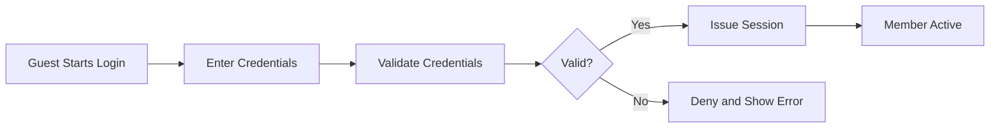
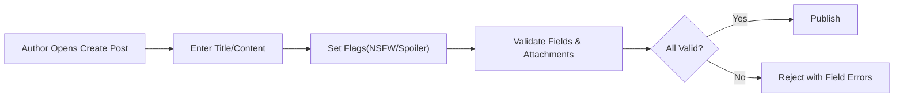
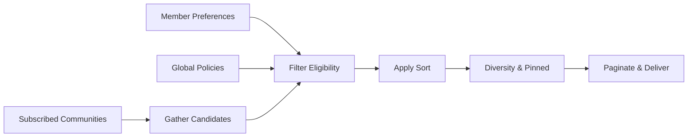
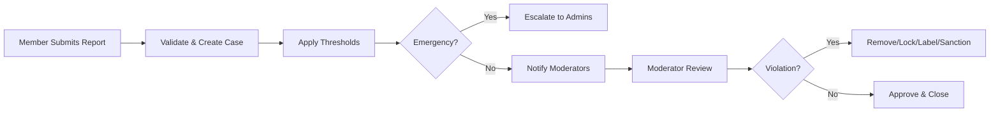

# communityPlatform Requirements Analysis (Business-Level)

## 1. Vision and Objectives
communityPlatform enables topic-based communities where people create and discover content, discuss via nested comments, and use voting to surface quality. Subscriptions personalize each member’s home feed. A karma system reflects contribution quality, while reporting and moderation maintain safety and trust.

Objectives
- Foster healthy, interest-based communities with consistent governance and transparent rules.
- Provide frictionless content creation (text, link, image) with clear validations and flags for NSFW/Spoilers.
- Surface quality through upvote/downvote mechanics and well-defined sorts: Hot, New, Top, Controversial.
- Offer personalized feeds via subscriptions, with appropriate safety and preference controls.
- Enable fair, auditable moderation workflows including reporting, escalation, and appeals.

## 2. In-Scope Capabilities and Assumptions
In Scope (MVP)
- User registration, login, logout, email verification, password reset.
- Community creation and governance (ownership, moderator roles, rules, visibility).
- Posts: text, link, image; validation limits; NSFW/Spoiler flags; visibility states.
- Comments with nested replies, editing/deletion rules, sorting.
- Voting: upvote/downvote for posts and comments, integrity and rate limits.
- Sorting: Hot/New/Top/Controversial for posts; Top/New/Controversial/Old for comments.
- Subscriptions and feeds: subscribe/unsubscribe, home/community feeds, pagination.
- Profiles and karma: public profiles, activity lists, contribution-based karma.
- Reporting and moderation: user reporting, community moderation, admin escalation, appeals.

Assumptions
- Email delivery exists for verification and transactional notices.
- Image storage is available with conservative file size/type limits.
- Global content and safety policies are published and enforceable.
- Locale language is en-US; times are represented to users in their preferred timezone; maintenance windows align with Asia/Seoul off-peak where noted.

## 3. Actors and Roles
- Guest: Unauthenticated visitor who can browse public content and start registration.
- Member: Authenticated user who can post, vote, comment, subscribe, report, and manage profile preferences.
- Community Owner: Member who created a community or received ownership via transfer; manages settings and moderators.
- Community Moderator: Member with scoped permissions to enforce rules in a specific community.
- Admin: Platform-level operator with global safety and policy enforcement authority.

Actor Principles (EARS)
- THE platform SHALL scope community moderator and owner permissions to their specific community.
- THE platform SHALL prioritize platform policies over community rules where conflicts arise.
- THE platform SHALL apply deny-by-default for actions not explicitly allowed by actor role and context.

## 4. End-to-End Business Workflows
### 4.1 Account Lifecycle
- Registration and Verification
  - WHEN a guest submits valid email and password, THE platform SHALL create a pending account and send verification.
  - WHEN the user completes verification, THE platform SHALL activate the account and record the activation timestamp.
  - IF verification is not completed within 14 days, THEN THE platform SHALL restrict posting and voting until verification.
- Login, Sessions, and Logout
  - WHEN a user logs in with valid credentials, THE platform SHALL establish a session and acknowledge within 2 seconds under normal load.
  - WHEN a user logs out, THE platform SHALL revoke the active session promptly and prevent further use.
- Recovery
  - WHEN a user requests password reset, THE platform SHALL send a secure reset path and invalidate prior access tokens upon password change.

Mermaid — Authentication Flow

```mermaid
graph LR
  A["Guest Starts Login"] --> B["Enter Credentials"]
  B --> C["Validate Credentials"]
  C --> D{"Valid?"}
  D -->|"Yes"| E["Issue Session"]
  E --> F["Member Active"]
  D -->|"No"| G["Deny and Show Error"]
```

### 4.2 Community Lifecycle
- Creation and Configuration
  - WHEN a verified member proposes a unique community name and required metadata, THE platform SHALL validate naming rules and reserve the name on success.
  - THE platform SHALL set the creator as owner and allow moderator assignment by the owner.
- Governance and Visibility
  - WHERE visibility is set to Private or Restricted, THE platform SHALL restrict viewing and/or posting to approved members.
  - WHEN rules are updated, THE platform SHALL record the change with actor and timestamp and show the updated time on the community page.
- Transfer, Archive, Closure
  - WHEN an owner initiates a transfer to an eligible member, THE platform SHALL require recipient acceptance within 72 hours.
  - WHEN a community is archived, THE platform SHALL disable new posts/comments while preserving readability.
  - WHEN a community is closed, THE platform SHALL delist it from discovery and retain content per retention policy.

### 4.3 Posting (Text/Link/Image)
- Validation and Flags
  - WHEN a member creates a post, THE platform SHALL validate title, body/URL, and image attachments against size/type/length limits.
  - WHERE NSFW is enabled or required by community policy, THE platform SHALL apply the NSFW flag and restrict visibility accordingly.
  - WHEN a post is marked Spoiler, THE platform SHALL mask previews until user reveal.
- Visibility Lifecycle
  - THE platform SHALL support states: Draft, Published, Deleted by Author, Removed by Moderator, Quarantined, Locked, Archived.
  - WHEN content is removed by moderation, THE platform SHALL hide it from general viewers and retain audit visibility for moderators and admins.

Mermaid — Post Validation and Publish

```mermaid
graph LR
  A["Author Opens Create Post"] --> B["Enter Title/Content"]
  B --> C["Set Flags(NSFW/Spoiler)"]
  C --> D["Validate Fields & Attachments"]
  D --> E{"All Valid?"}
  E -->|"Yes"| F["Publish"]
  E -->|"No"| G["Reject with Field Errors"]
```

### 4.4 Comments and Nested Threads
- Creation and Depth
  - WHEN a member comments, THE platform SHALL allow nesting up to a maximum depth (e.g., 8) and position replies under the correct parent.
  - WHEN a post or thread is locked, THE platform SHALL prevent new comments while preserving visibility.
- Editing and Deletion
  - WHERE an edit window exists, THE platform SHALL allow edits within the window and mark edited comments accordingly.
  - WHEN a comment is deleted by its author, THE platform SHALL tombstone the comment and preserve child replies.

### 4.5 Voting and Ranking
- Voting Rules
  - WHEN a member upvotes or downvotes, THE platform SHALL record a single active vote per item with the ability to change or remove it.
  - THE platform SHALL prohibit authors from voting on their own items.
  - WHERE content is locked or archived, THE platform SHALL prohibit new votes.
- Rank and Sorts
  - THE platform SHALL offer Hot, New, Top, and Controversial for posts; Top, New, Controversial, and Old for comments.
  - WHERE timeframe filters apply (Top/Controversial), THE platform SHALL limit candidates to the selected window.

### 4.6 Subscriptions and Feeds
- Subscribing
  - WHEN a member subscribes to a community, THE platform SHALL include eligible posts from that community in the home feed going forward.
  - WHEN a member unsubscribes, THE platform SHALL exclude that community’s posts from the home feed going forward.
- Composition
  - THE platform SHALL assemble the home feed primarily from subscribed communities, with optional recommendations subject to policy.
  - THE platform SHALL honor NSFW/Spoiler preferences, blocks, and community visibility in feed eligibility.

Mermaid — Home Feed Composition

```mermaid
graph LR
  A["Subscribed Communities"] --> D["Gather Candidates"]
  B["Member Preferences"] --> E["Filter Eligibility"]
  C["Global Policies"] --> E
  D --> E
  E --> F["Apply Sort"]
  F --> G["Diversity & Pinned"]
  G --> H["Paginate & Deliver"]
```

### 4.7 Profiles and Karma
- Profile Visibility
  - THE platform SHALL provide public profiles with username, display name, avatar, bio, join date, and contribution summaries respecting privacy settings.
- Karma Rules
  - WHEN valid votes accrue on a member’s content, THE platform SHALL update post karma and comment karma accordingly.
  - WHERE content is removed for policy violations, THE platform SHALL exclude associated votes from karma within a reasonable delay.

### 4.8 Reporting and Moderation
- Reporting and Queues
  - WHEN a member reports a post or comment, THE platform SHALL record reason and details and enqueue a case for community moderators.
  - WHERE severity is critical/emergency, THE platform SHALL prioritize the case and escalate to admins immediately.
- Actions and Appeals
  - WHEN moderators act (approve, remove, lock, warn, ban), THE platform SHALL record actor, reason code, and timestamps and notify affected users.
  - WHEN an appeal is filed, THE platform SHALL route to the appropriate reviewer and return a decision within published windows.

Mermaid — Reporting and Escalation

```mermaid
graph LR
  A["Member Submits Report"] --> B["Validate & Create Case"]
  B --> C["Apply Thresholds"]
  C --> D{"Emergency?"}
  D -->|"Yes"| E["Escalate to Admins"]
  D -->|"No"| F["Notify Moderators"]
  F --> G["Moderator Review"]
  G --> H{"Violation?"}
  H -->|"Yes"| I["Remove/Lock/Label/Sanction"]
  H -->|"No"| J["Approve & Close"]
```

## 5. Permissions and Access Control (Business Rules)
- THE platform SHALL allow guests to browse public communities and content; guests cannot create content or vote.
- THE platform SHALL allow members to create posts, comments, votes, and reports within communities where they have access.
- THE platform SHALL restrict community owners and moderators to actions within their community scope.
- THE platform SHALL allow admins to enforce platform-wide policies and act across all communities.
- IF a member is banned in a community, THEN THE platform SHALL block posting, commenting, and voting in that community while allowing general browsing elsewhere.

## 6. EARS Requirements Catalog (Selected)
Authentication & Sessions
- WHEN a user logs in successfully, THE platform SHALL acknowledge within 2 seconds under normal load and create a session.
- WHEN a user logs out, THE platform SHALL revoke active session tokens immediately.
- IF invalid credentials are submitted, THEN THE platform SHALL deny login with a generic failure message.

Community Management
- WHEN a verified member submits a unique community name meeting policy, THE platform SHALL create the community and assign ownership within 2 seconds under normal load.
- WHERE visibility is Private, THE platform SHALL restrict content viewing and posting to approved members.
- WHEN an owner transfers ownership and the recipient accepts within 72 hours, THE platform SHALL complete the transfer and log the event.

Posting
- WHEN a member submits a text/link/image post, THE platform SHALL validate fields and flags; IF violations exist, THEN THE platform SHALL reject with specific field errors.
- WHILE a post is Locked, THE platform SHALL prevent new comments and votes while preserving readability.
- WHEN a post is 180 days old without activity, THE platform SHALL archive it and disable new interactions.

Comments
- WHEN a comment is submitted within allowed depth and content limits, THE platform SHALL publish it within 2 seconds under normal load.
- IF a comment exceeds maximum depth, THEN THE platform SHALL reject with clear guidance to reply higher in the thread.

Voting & Ranking
- WHEN a member casts a vote, THE platform SHALL record one active vote per item and update visible score within 1 second under normal load.
- WHERE content is archived or locked, THE platform SHALL prohibit new votes.

Subscriptions & Feeds
- WHEN a member subscribes to a community, THE platform SHALL include eligible posts from that community in home feed composition within 5 seconds for subsequent loads.
- WHEN a member unsubscribes, THE platform SHALL exclude the community’s posts from the home feed going forward.

Profiles & Karma
- WHEN votes accrue on a member’s content, THE platform SHALL update karma components and display changes within 5 seconds.
- WHERE content is removed for policy, THE platform SHALL remove associated votes from karma within 24 hours.

Reporting & Moderation
- WHEN a report meets emergency criteria, THE platform SHALL escalate to admins immediately and restrict visibility per policy.
- WHEN a moderator takes action, THE platform SHALL notify the affected user with reason category and appeal window.

## 7. Sorting Definitions (Business Semantics)
Posts
- Hot: recency-aware ordering prioritizing newer high-score posts; items older than 7 days are de-emphasized versus newer items with similar scores.
- New: strict reverse chronological by creation time; ties break by stable identifier.
- Top: highest net score within a selected timeframe; ties break by total votes, then recency, then stable identifier.
- Controversial: includes only items meeting a minimum total vote threshold; prioritizes balanced up/down distributions; ties break by total votes then recency.

Comments
- Top: highest net score among siblings, tie-breakers as for posts.
- New: newest first among siblings.
- Controversial: thresholded by minimum total votes and balance among siblings.
- Old: oldest first among siblings.

## 8. Error Scenarios and Edge Cases
Validation
- IF a title is empty or exceeds maximum length, THEN THE platform SHALL reject with explicit limits.
- IF a URL is non-HTTP(S) or exceeds maximum length, THEN THE platform SHALL reject with a specific error.
- IF an image exceeds file size/type/dimension limits, THEN THE platform SHALL reject and enumerate failing files.

Permissions
- IF a guest attempts to post, THEN THE platform SHALL deny and prompt login/registration.
- IF a banned member attempts to interact in the banning community, THEN THE platform SHALL deny with scope and duration of ban.

Rate Limits
- IF posting or voting exceeds thresholds, THEN THE platform SHALL rate-limit and provide retry-after guidance.
- IF report submissions exceed daily caps, THEN THE platform SHALL deny further reports until the window resets.

State & Visibility
- IF content is removed, THEN THE platform SHALL show a tombstone placeholder to preserve thread continuity where appropriate.
- IF a community changes visibility to Private, THEN THE platform SHALL restrict non-approved access immediately and notify existing subscribers per policy.

## 9. Non-Functional Requirements (Business-Level)
Performance
- THE platform SHALL deliver home/community feeds within 3.5 seconds at the 95th percentile under normal load.
- THE platform SHALL process vote and comment submissions within 1–2 seconds under normal load.

Availability & Reliability
- THE platform SHALL provide 99.9% monthly availability for core functions.
- THE platform SHALL maintain an RPO of 15 minutes for user-generated content and an RTO of 4 hours for regional failures.

Security & Privacy
- THE platform SHALL require email verification before enabling content creation features.
- THE platform SHALL enforce least-privilege access and log sensitive actions (role changes, removals, bans, ownership transfers).
- THE platform SHALL protect user data and avoid exposing PII in user-facing messages and public content.

Observability & Auditability
- THE platform SHALL log moderation/admin actions with actor, reason, and timestamp.
- THE platform SHALL retain audit logs for at least 1 year and notification histories for at least 90 days.

Compliance
- THE platform SHALL provide data export within 30 days of verified request and complete account deletion/anonymization within 30 days after the grace period, except where legal holds apply.

## 10. Visual Diagrams (Mermaid)
Authentication, Posting, Reporting, and Feed flows are embedded in their respective sections and adhere to syntax rules (double-quoted labels, correct arrows, no spaces between brackets and quotes).

## 11. Glossary
- Community: Topic-based space with its own rules and moderators.
- Post: Top-level content item; types include text, link, and image.
- Comment: User reply to a post or comment; can be nested.
- Vote: Upvote or downvote that affects an item’s score.
- Score: Net result of votes at a point in time.
- Sort: Ordering logic (Hot/New/Top/Controversial for posts; Top/New/Controversial/Old for comments).
- Subscription: Member’s opt-in to include a community’s posts in their home feed.
- Feed: List of posts compiled for a viewer (home or community specific).
- NSFW/Spoiler: Content flags affecting display/visibility.
- Quarantined: Restricted visibility state due to policy concerns.
- Archived: Read-only state reached by age or policy; new interactions disabled.
- Owner/Moderator: Community-scoped roles held by members with elevated permissions.
- Admin: Platform-level operator with global authority.
- Karma: Aggregate reputation signal based on votes on posts and comments.
