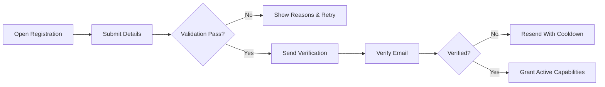
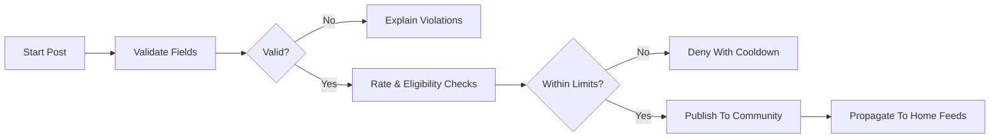
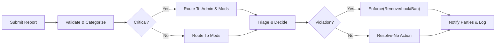

# communityPlatform — Business Requirements Specification

## Vision and Scope
communityPlatform enables interest-based communities to form, publish content, and hold structured discussions curated by voting and sorting. Members subscribe to communities, build reputation (karma), and help sustain quality through reporting and community moderation. Safety and transparency are core to trust. The scope covers registration and login, community creation and governance, posting (text, link, image), nested comments, voting and karma, feed sorting (Hot, New, Top, Controversial), subscriptions, user profiles, and reporting.

EARS intent:
- THE platform SHALL enable discoverable, topic-centric communities governed by clear rules and transparent enforcement.
- WHEN members participate by posting, commenting, or voting, THE platform SHALL update ranking and reputation signals promptly to keep feeds fresh and relevant.
- IF content or behavior violates policy, THEN THE platform SHALL support reporting, triage, and proportionate enforcement with appeal paths.

## Roles and Access Model
Roles define permissions in business terms. Community-scoped roles apply only within their communities.
- guestUser: Unauthenticated visitor; read-only access to public content.
- memberUser: Authenticated participant; may subscribe, post, comment, vote, and report within policy.
- communityOwner: Creates and configures a community; appoints moderators; highest authority within that community.
- communityModerator: Enforces community rules; processes reports; manages content within assigned community.
- adminUser: Site-wide trust & safety; can act across all communities to enforce platform policy and law.

EARS:
- THE platform SHALL restrict guestUser to read-only actions on public content.
- WHERE a role is scoped to a community, THE platform SHALL prevent actions outside that scope.
- IF platform policy requires intervention, THEN THE platform SHALL allow adminUser to override community-level decisions.

## Global Business Principles
- Transparency: Visible markers for removed/locked/archived states and clear reasons where appropriate.
- Safety-first: Reporting, moderation, and age/sensitivity labels reduce harm and maintain brand safety.
- Predictability: Deterministic sorts, clear rate limits, and consistent error semantics.
- Privacy-by-default: Minimal disclosure of personal data; configurable profile visibility; immutable audit trails with least-privilege access.

Out-of-Scope (initial release): private messaging, livestreams, marketplaces, full-text global search beyond simple filters, third-party enterprise SSO, and payouts.

## User Scenarios Overview
- Browsing: Guests and members explore communities and read posts with comments.
- Joining: Members subscribe to communities; preferences shape the home feed.
- Contributing: Members submit posts (text, link, image) and comments with nested replies.
- Curation: Members vote; feeds reorder by selected sort modes.
- Safety: Members report content; moderators triage; admins handle escalations.

## 6. Functional Requirements (EARS)

### 6.1 Authentication & Account Lifecycle
States: pendingVerification, active, locked, deactivated, pendingDeletion, deleted, banned.
- THE platform SHALL require unique username and email, a compliant password, and acceptance of legal terms during registration.
- WHEN a user verifies email, THE platform SHALL grant active capabilities (post, comment, vote, report) according to role.
- WHERE an account accumulates repeated failed logins, THE platform SHALL lock the account temporarily and notify the user.
- WHEN a user requests password reset, THE platform SHALL issue a one-time, time-bound reset and revoke active sessions upon success.
- WHEN a user deactivates the account, THE platform SHALL hide the profile and end sessions until reactivation.
- WHEN a user requests deletion, THE platform SHALL start a grace period after which personal identifiers are removed or anonymized per governance policy.

### 6.2 Communities (Creation, Settings, Ownership)
- THE platform SHALL allow eligible memberUser to create communities with unique handles and descriptions subject to naming rules and reserved terms.
- WHEN a community is created, THE platform SHALL assign the creator as communityOwner and initialize default rules and settings.
- WHERE a community sets visibility (public, restricted, private), THE platform SHALL enforce read and write access accordingly.
- WHEN a communityOwner appoints a communityModerator, THE platform SHALL require appointee acceptance before granting permissions.
- WHEN ownership is transferred, THE platform SHALL require explicit acceptance by the recipient; otherwise revert.
- IF a community violates sitewide policy, THEN THE platform SHALL allow adminUser to quarantine, deprecate, or reassign ownership per policy with audit logs.

### 6.3 Posting (Text, Link, Image) and Content Lifecycle
Types: Text, Link, Image.
- THE platform SHALL require a title (1–300 chars) and a valid post type; text bodies up to 40,000 chars; links with valid http/https; images within size/format limits.
- WHERE communities restrict post types, THE platform SHALL block disallowed types.
- WHEN submission passes validation and rate checks, THE platform SHALL publish the post to the community feed and propagate to home feeds for subscribers within defined freshness windows.
- WHERE a post is labeled NSFW or Spoiler, THE platform SHALL enforce visibility gates and shield previews per user preferences.
- WHEN an author deletes a post, THE platform SHALL replace content with a “[deleted by author]” marker and retain references per retention policy.
- WHEN moderators remove a post, THE platform SHALL set state to “removed by moderators” and retain author-visible access and reasons where configured.
- WHILE a post is locked, THE platform SHALL disable new comments and prevent vote changes.
- WHEN a post is archived after the configured window, THE platform SHALL preserve read access but prevent edits, new comments, and new votes.

### 6.4 Commenting and Nested Replies
- THE platform SHALL allow members to comment on unlocked, non-archived posts and to reply to comments up to a maximum nesting depth.
- WHEN a comment is created, THE platform SHALL timestamp and link it to the post, community, author, and optional parent.
- WHERE a comment violates rules, THE platform SHALL remove it with a public placeholder and store rationale for audit and appeals.
- WHEN a parent is removed or deleted, THE platform SHALL preserve children with a placeholder for the missing parent to maintain thread integrity.
- IF a comment thread is locked, THEN THE platform SHALL prevent new replies beneath that node.

### 6.5 Voting, Karma, and Anti-manipulation
- THE platform SHALL allow authenticated, eligible members to upvote or downvote posts and comments, excluding their own content.
- WHEN a user casts or changes a vote, THE platform SHALL update the item’s score and the author’s karma promptly and re-rank affected feeds within freshness targets.
- WHERE low-trust signals exist (e.g., very new account), THE platform SHALL apply stricter rate limits and may reduce vote influence.
- WHEN abnormal vote surges or coordination are detected, THE platform SHALL apply protective measures (slowdown/freeze/weight reduction) and flag for review.
- WHERE content is locked or archived, THE platform SHALL disable new voting and preserve existing scores.

### 6.6 Feeds and Sorting (Hot, New, Top, Controversial)
- THE platform SHALL assemble feeds from eligible content only, honoring user preferences (subscriptions, blocks, NSFW opt-in) and community visibility.
- WHEN users select Hot, THE platform SHALL prioritize recent, engaging content with recency decay.
- WHEN users select New, THE platform SHALL order by creation time descending.
- WHEN users select Top, THE platform SHALL order by net approval within a chosen window (24h, 7d, 30d, year, all time).
- WHEN users select Controversial, THE platform SHALL highlight high-activity items with near-balanced sentiment within a chosen window.
- WHERE content becomes ineligible (removed/quarantined), THE platform SHALL exclude it from new pages and avoid duplicates across pagination.

### 6.7 Subscriptions and Personalization
- WHEN a member subscribes to a community, THE platform SHALL include its new content in the member’s home feed within one minute and maintain a subscription state (subscribed/pending/banned/muted).
- WHEN a member unsubscribes, THE platform SHALL remove the community from future home feed results immediately.
- WHERE a community is private or restricted, THE platform SHALL require approval before activating a subscription.
- WHERE a community is muted by the user, THE platform SHALL suppress its content in home feeds and recommendations without altering subscription unless explicitly unsubscribed.

### 6.8 User Profiles and Visibility
- THE platform SHALL present profile elements: username, display name, avatar, bio, join date, karma (post/comment/total), recent activity, and community roles.
- WHERE a profile visibility level is set (Public, Limited, Private), THE platform SHALL enforce it for all viewers except adminUser for safety purposes with audit logging.
- WHEN the profile owner hides subscriptions or activity, THE platform SHALL withhold those lists from other viewers.
- IF a viewer is blocked by the profile owner, THEN THE platform SHALL present the profile as Private to that viewer.

### 6.9 Reporting, Safety, and Trust
- THE platform SHALL allow members to report posts, comments, communities, or user accounts using standardized categories (e.g., spam, harassment, doxxing, illegal content) plus community-specific categories.
- WHEN a report is submitted, THE platform SHALL acknowledge receipt within two seconds, deduplicate by item and category, and route to the appropriate moderation queue.
- WHERE categories are critical (e.g., child safety, credible threats), THE platform SHALL escalate to adminUser immediately.
- WHEN enforcement occurs (remove, lock, ban, quarantine), THE platform SHALL create audit entries and notify affected users with reason codes and appeal instructions where applicable.
- WHEN appeals are filed within the allowed window, THE platform SHALL route the case to a reviewer other than the original decision-maker when feasible and restore content or access if overturned.

## Authorization and Permission Matrix (Business-Level)
| Action | guestUser | memberUser | communityModerator | communityOwner | adminUser |
|---|---|---|---|---|---|
| View public content | ✅ | ✅ | ✅ | ✅ | ✅ |
| Register / Login | ✅ / ❌ | ❌ / ✅ | ❌ / ✅ | ❌ / ✅ | ❌ / ✅ |
| Create communities | ❌ | ✅ (eligibility) | ✅ (as member) | ✅ (as member) | ✅ |
| Post / Comment | ❌ | ✅ | ✅ | ✅ | ✅ |
| Vote | ❌ | ✅ | ✅ | ✅ | ✅ |
| Report | ❌ | ✅ | ✅ | ✅ | ✅ |
| Moderate (scoped) | ❌ | ❌ | ✅ | ✅ | ✅ |
| Site-wide enforcement | ❌ | ❌ | ❌ | ❌ | ✅ |

Notes:
- “scoped” permissions apply only within the communities where a user holds that role.
- adminUser may override community decisions for safety, legal, and policy compliance.

## Error and Recovery Semantics (Business Outcomes)
Representative business error keys and outcomes:
- AUTH_EMAIL_NOT_VERIFIED: verify email to unlock participation.
- PERM_INSUFFICIENT_ROLE: action requires higher permissions.
- COMMUNITY_PRIVATE: access by approval only.
- POST_VALIDATION_FAILED: correct title/body/link/image constraints and resubmit.
- POST_DUPLICATE_DETECTED: consider contributing to the existing post.
- COMMENT_DEPTH_LIMIT: start a new top-level comment.
- VOTE_SELF_NOT_ALLOWED: cannot vote on own content.
- FEED_EMPTY_FOR_FILTERS: relax filters or time windows.
- REPORT_INVALID_CATEGORY: choose an allowed category.

EARS:
- WHEN an action is denied, THE platform SHALL present a specific reason and a next best action within two seconds under normal load.
- WHERE a cooldown or rate limit applies, THE platform SHALL display the remaining wait time in the user’s local timezone (Asia/Seoul by default if unset).

## Nonfunctional Requirements (Highlights)
Performance (p95 targets under normal load):
- Feed page assembly: ≤ 3 s; vote acknowledgment: ≤ 0.5 s; post/comment creation: ≤ 1 s; profile page: ≤ 2 s.
Availability:
- THE platform SHALL target 99.9% monthly uptime for core actions and provide status updates within 30 minutes of major incidents.
Localization/Timezone:
- THE platform SHALL localize user-facing text to the selected language (default en-US) and render times in the user’s timezone; default to Asia/Seoul for this context when unspecified.
Privacy/Security:
- THE platform SHALL minimize personal data, restrict visibility of sensitive details, and record access to protected information with audit trails.
Scalability:
- THE platform SHALL sustain growth while meeting freshness targets for votes and feed re-ranking within 10 seconds.

## Acceptance Criteria and KPIs
Acceptance samples:
- GIVEN a new verified member, WHEN they subscribe to a community, THEN home feed includes posts from that community within one minute.
- GIVEN a locked post, WHEN a member attempts to comment, THEN a clear denial reason is shown and no comment is created.
- GIVEN a controversial sort on community feed, WHEN many items tie, THEN deterministic tie-breaking yields stable pages without duplicates across pagination.
- GIVEN a report of a critical category, WHEN submitted, THEN the case is visible to admin review immediately and acknowledgment reaches the reporter within two seconds.

KPI examples (illustrative):
- Time-to-first-moderator-response (median): ≤ 12 hours for community-level cases.
- Vote-to-rerank freshness (p95): ≤ 10 seconds.
- Feed responsiveness (first page p95): ≤ 3 seconds; duplicates across consecutive pages: < 2%.
- Verification completion rate within 24 hours: ≥ 90%.

## Mermaid Diagrams

User Onboarding (Registration → Verification → Participation)

Posting Flow (Validation → Rate Check → Publish → Propagate)

Reporting and Enforcement Flow

## Glossary and References
- Karma: Aggregate of community reactions to authored posts and comments; negative values are possible.
- Locked: State that disallows new comments and vote changes while preserving visibility.
- Archived: State that preserves read access but disallows edits and new interactions after an age threshold.
- Quarantine: Reduced discovery and access warning applied by adminUser for safety.
- Related specifications detail domain rules and nonfunctional expectations (roles, authentication, posting, voting, comments, feeds, profiles, reporting, NFRs, exception handling, data governance).