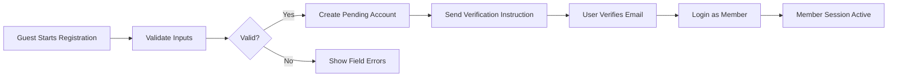
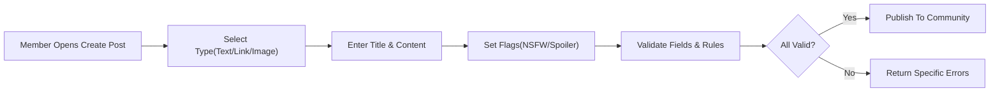
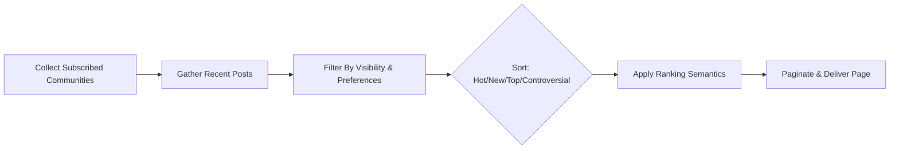
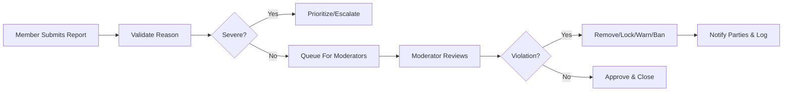
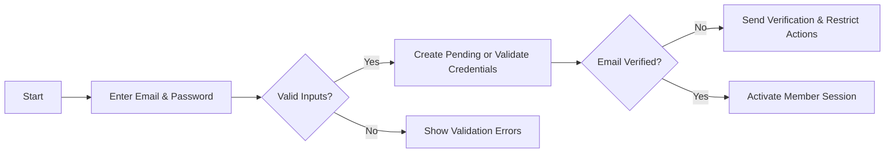
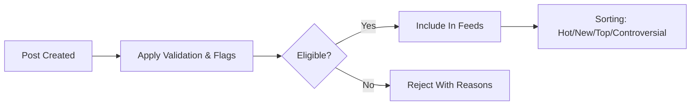
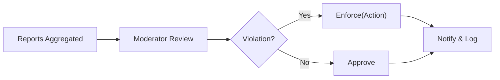

# communityPlatform — Requirements Analysis Report

## Product Overview
communityPlatform enables interest-based communities to form around topics in which members can publish posts (text, link, or image), discuss via nested comments, vote to curate quality, and subscribe for a personalized home feed. A karma system reflects community approval of contributions. Reporting and moderation workflows protect safety and enforce policies. This analysis captures business requirements in natural language suitable for backend implementation, without prescribing APIs, database schemas, or specific technologies.

## Actors and Roles
- Guest: Unauthenticated visitor who can browse public content and communities, view public profiles, and begin registration or login.
- Member: Authenticated user who can create communities, subscribe to communities, create posts, vote, comment with nested replies, report content, and manage a profile.
- Community Moderator (role assigned to a Member per community): Reviews reports and enforces rules within assigned communities.
- Community Owner (role held by a Member per community): Creates a community, manages moderators, rules, and key settings.
- Admin: Platform operator with authority to enforce platform-wide policies, handle escalations, and apply global sanctions.

EARS principles for identity and scope:
- THE platform SHALL scope moderator and owner authorities to their designated communities only and SHALL prevent cross-community overreach.
- THE platform SHALL prioritize platform policies over community rules where conflicts arise.

## Scope and Objectives

### In Scope (MVP)
- Registration, email verification, login, logout, and account recovery in business terms.
- Communities: creation, ownership, moderator assignment, descriptive rules, visibility (public/restricted/private), and subscription mechanics.
- Posts: text, link, and image types with validation limits and policy flags (NSFW/Spoiler).
- Comments: nested replies with depth limits, editing/deletion rules, and sorting options.
- Votes: upvote and downvote on posts and comments with visible scores and integrity protections.
- Sorts: Hot, New, Top, Controversial for posts; common sorts for comments.
- Subscriptions and Feeds: home feed constructed from subscriptions with business-level pagination.
- User Profiles: public profile fields, authored content lists, and karma.
- Reporting and Moderation: report intake, queues, actions, escalation, and appeals.

### Out of Scope (MVP)
- Direct messaging or chat between users.
- Real-time livestreaming or long-form video hosting.
- Third-party OAuth providers (email/password only at MVP).
- Monetary awards, complex badge economies, or marketplace features.

## Core Business Processes and Workflows

### 1) Registration, Verification, Login, Session
Narrative: Guests register with email and password, receive a verification instruction, verify, and then log in to become members. Members manage sessions across devices and can log out and recover accounts.

EARS requirements:
- WHEN a guest submits valid registration data, THE platform SHALL create a pending account and send a verification instruction within 10 seconds.
- WHEN the guest completes email verification, THE platform SHALL activate member capabilities immediately and record the activation time.
- IF email verification is incomplete, THEN THE platform SHALL restrict posting, commenting, voting, and community creation until verification.
- WHEN a user submits valid credentials, THE platform SHALL establish an authenticated session within 2 seconds under normal load.
- WHEN a user logs out, THE platform SHALL end the active session and prevent further use of its credentials.
- WHERE multiple devices are used, THE platform SHALL allow independent sessions and allow a member to revoke any device session from account settings.

Mermaid — Registration and Login Flow (Business-Level)

```mermaid
graph LR
  A["Guest Starts Registration"] --> B["Validate Inputs"]
  B --> C{"Valid?"}
  C -->|"Yes"| D["Create Pending Account"]
  C -->|"No"| E["Show Field Errors"]
  D --> F["Send Verification Instruction"]
  F --> G["User Verifies Email"]
  G --> H["Login as Member"]
  H --> I["Member Session Active"]
```

### 2) Community Creation and Governance
Narrative: Verified members create communities with unique names and metadata, become owners, and can assign moderators and define community rules.

EARS requirements:
- WHEN a verified member proposes a community name and required metadata, THE platform SHALL enforce uniqueness and naming policy before creation.
- WHEN a community is created successfully, THE platform SHALL designate the creator as the owner and initial moderator.
- WHEN an owner invites a moderator, THE platform SHALL grant community-scoped moderation permissions upon acceptance and record the event.
- WHERE community rules are updated, THE platform SHALL log changes and show the last updated timestamp to members.
- IF an owner initiates ownership transfer, THEN THE platform SHALL require acceptance within a defined window before completion.

### 3) Posting Content (Text/Link/Image)
Narrative: Members publish posts in communities that allow posting. Validation differs by type and community rules. Policy flags control visibility for sensitive or spoiler content.

EARS requirements:
- WHEN a member submits a text post, THE platform SHALL require a title and validate body length within configured limits.
- WHEN a member submits a link post, THE platform SHALL require a valid HTTP(S) URL and optional short summary within a defined length.
- WHEN a member submits an image post, THE platform SHALL require at least one supported image and enforce file size/count constraints.
- WHERE a community disallows a post type, THE platform SHALL reject attempts to create that type with a rule-specific message.
- WHEN NSFW or Spoiler flags are set, THE platform SHALL apply visibility controls that respect user preferences and age requirements.
- IF validation fails, THEN THE platform SHALL reject the post and return specific error reasons without losing entered content.

Mermaid — Post Creation (Business-Level)

```mermaid
graph LR
  A["Member Opens Create Post"] --> B["Select Type(Text/Link/Image)"]
  B --> C["Enter Title & Content"]
  C --> D["Set Flags(NSFW/Spoiler)"]
  D --> E["Validate Fields & Rules"]
  E --> F{"All Valid?"}
  F -->|"Yes"| G["Publish To Community"]
  F -->|"No"| H["Return Specific Errors"]
```

### 4) Commenting with Nested Replies
Narrative: Members comment on posts and reply to comments, forming threads with depth limits. Editing and deletion follow windows to balance flexibility and stability.

EARS requirements:
- WHEN a member submits a comment, THE platform SHALL validate non-empty content and associate it with the correct parent (post or comment).
- THE platform SHALL support nested replies up to a defined maximum depth and provide collapsing for deep branches by default.
- WHEN a comment is edited within the allowed window, THE platform SHALL indicate it was edited without losing context for replies.
- WHEN a comment is deleted by its author, THE platform SHALL show a tombstone to preserve thread readability while hiding the body from general users.
- IF a thread is locked by moderation, THEN THE platform SHALL prevent new comments while preserving visibility of existing content.

### 5) Voting on Posts and Comments
Narrative: Members signal content quality and relevance by upvoting or downvoting posts and comments. Visible scores are derived from votes.

EARS requirements:
- WHEN a member casts an upvote or downvote on an eligible item, THE platform SHALL record one active vote state per member per item and update the visible score.
- WHEN a member changes a vote, THE platform SHALL replace the prior state and reflect the new score promptly.
- THE platform SHALL prohibit guests and authors from voting on their own content.
- WHERE content is locked or archived, THE platform SHALL disallow new votes while maintaining visible historical scores.
- WHERE abnormal voting patterns are detected, THE platform SHALL throttle voting and present a clear message to the actor.

### 6) Subscriptions and Feed Composition with Sorts
Narrative: Members subscribe to communities, and their home feed consists primarily of posts from those subscriptions. Users can sort by Hot, New, Top, and Controversial.

EARS requirements:
- WHEN a member subscribes to a community, THE platform SHALL include its eligible posts in the member’s home feed for subsequent loads.
- WHEN a member unsubscribes, THE platform SHALL remove the community’s posts from future home feed pages.
- THE platform SHALL support Hot, New, Top, and Controversial sorts for home and community feeds, each with deterministic tie-breaking.
- WHERE a time window is selected for Top or Controversial, THE platform SHALL restrict candidates to that window before ordering.
- WHERE content is flagged NSFW or Spoiler, THE platform SHALL apply user preference filters consistently across all sorts.

Mermaid — Feed Composition (Business-Level)

```mermaid
graph LR
  A["Collect Subscribed Communities"] --> B["Gather Recent Posts"]
  B --> C["Filter By Visibility & Preferences"]
  C --> D{"Sort: Hot/New/Top/Controversial"}
  D --> E["Apply Ranking Semantics"]
  E --> F["Paginate & Deliver Page"]
```

### 7) User Profiles and Karma
Narrative: Profiles display public identity, authored content, and karma signals that reflect community approval.

EARS requirements:
- THE platform SHALL show public profile fields (e.g., username, avatar, bio, join date) and summarize authored content visible to the viewer’s access rights.
- THE platform SHALL compute total karma as the sum of post karma and comment karma derived from valid community votes.
- WHEN votes accrue or reverse on a user’s content, THE platform SHALL update displayed karma within a reasonable delay (≤ 60 seconds) without misrepresenting the actor’s own view.
- WHERE privacy settings restrict visibility, THE platform SHALL honor those settings while indicating that certain elements are hidden.

### 8) Reporting Inappropriate Content and Moderation
Narrative: Members report posts or comments for potential policy or rule violations. Moderators review cases within their communities; admins handle escalations and platform-wide enforcement.

EARS requirements:
- WHEN a member submits a report with a supported reason, THE platform SHALL acknowledge receipt and place the content into the appropriate moderation queue.
- WHERE reports reach defined thresholds or include severe categories, THE platform SHALL reduce default visibility and/or escalate priority accordingly.
- WHEN a moderator takes an action (approve, remove, lock, warn, ban-in-community), THE platform SHALL record the rationale and notify affected users with a policy-referenced message.
- WHEN an appeal is submitted, THE platform SHALL route it to the appropriate level (community moderators first; admins for escalations) and record outcomes.

Mermaid — Reporting and Moderation (Business-Level)

```mermaid
graph LR
  A["Member Submits Report"] --> B["Validate Reason"]
  B --> C{"Severe?"}
  C -->|"Yes"| D["Prioritize/Escalate"]
  C -->|"No"| E["Queue For Moderators"]
  E --> F["Moderator Reviews"]
  F --> G{"Violation?"}
  G -->|"Yes"| H["Remove/Lock/Warn/Ban"]
  G -->|"No"| I["Approve & Close"]
  H --> J["Notify Parties & Log"]
```

## Permissions and Access Control (Business-Level)
High-level permission matrix (✅ allowed, ❌ not allowed, ⚠️ conditional):

| Action | Guest | Member | Moderator (scope) | Owner (scope) | Admin |
|---|---|---|---|---|---|
| Browse public communities & posts | ✅ | ✅ | ✅ | ✅ | ✅ |
| View private community content | ❌ | ⚠️ (if approved) | ✅ | ✅ | ✅ |
| Create community | ❌ | ⚠️ (verified, eligible) | ⚠️ (as member) | ⚠️ (as member) | ✅ |
| Assign/remove moderators | ❌ | ❌ | ❌ | ✅ | ✅ |
| Create post | ❌ | ✅ | ✅ | ✅ | ✅ |
| Vote on content | ❌ | ✅ | ✅ | ✅ | ✅ |
| Comment/reply | ❌ | ✅ | ✅ | ✅ | ✅ |
| Remove or lock content | ❌ | ❌ | ✅ (in-scope) | ✅ (in-scope) | ✅ |
| Apply community bans | ❌ | ❌ | ✅ (in-scope) | ✅ (in-scope) | ✅ |
| Platform-wide sanctions | ❌ | ❌ | ❌ | ❌ | ✅ |

EARS clarifiers:
- WHERE a community is private, THE platform SHALL require approval for viewing and participation.
- WHERE an account is suspended, THE platform SHALL restrict posting, commenting, voting, and community creation while allowing permitted browsing.

## Content Visibility, Flags, and Lifecycle
- Visibility states: public, pending-approval (if community pre-moderation is enabled), removed (by moderation), deleted (by author), locked (no new comments/votes), archived (age/policy), quarantined (restricted by policy).
- NSFW and Spoiler flags: control previews and exposure based on user preferences and age requirements.

EARS requirements:
- WHEN content is removed by moderation, THE platform SHALL hide it from default views while preserving an audit trail visible to authorized roles.
- WHEN authors delete their content, THE platform SHALL show a tombstone to preserve thread continuity.
- WHILE content is Locked or Archived, THE platform SHALL disallow new comments and votes while keeping reading permitted according to visibility rules.

## Error Scenarios and User-Facing Behaviors
Representative behaviors across flows:
- Validation failures: THE platform SHALL present field-level error messages including the violated rule (e.g., title length, URL format, image size/count).
- Authentication required: WHEN a guest attempts an authenticated action, THE platform SHALL prompt login and preserve intent where safe (e.g., target vote).
- Authorization denied: WHEN a user lacks permission, THE platform SHALL explain the restriction without exposing sensitive policy internals.
- Rate limits: WHEN limits are exceeded, THE platform SHALL return a clear cool-down window and earliest retry time.
- Missing/removed content: THE platform SHALL show neutral messaging that avoids revealing private details.

## Non-Functional Expectations (Business-Level)
- Responsiveness: Interactive actions (login, vote, post, comment) SHALL complete within 1–2 seconds under normal conditions; first page of primary feeds within 2–3 seconds at the 95th percentile.
- Availability: Core functions SHALL target monthly availability of 99.9%, with planned maintenance in low-traffic windows.
- Pagination: Lists SHALL default to 20 items per page with an upper cap of 100.
- Freshness: Newly created eligible posts SHALL appear in “New” feeds within 10 seconds; ranking updates for other sorts within a reasonable delay (≤ 60 seconds).
- Abuse controls: The platform SHALL enforce reasonable per-account limits on posting, commenting, voting, and reporting to protect reliability while minimizing friction for legitimate use.

## Comprehensive EARS Requirement Catalog (Selected)
Identity & Access
- THE platform SHALL allow guests to browse public content without authentication.
- WHEN a guest completes registration and email verification, THE platform SHALL grant member capabilities immediately.
- IF an account is suspended, THEN THE platform SHALL restrict interactive features for the duration of the sanction.

Communities
- WHEN a member submits a unique, policy-compliant community name and required fields, THE platform SHALL create the community and assign ownership to the creator.
- WHEN an owner designates moderators, THE platform SHALL grant community-scoped permissions upon acceptance.

Posting
- WHEN a member submits a valid text/link/image post, THE platform SHALL publish it to the target community and make it eligible for feeds.
- IF a post violates validation or policy, THEN THE platform SHALL reject it with explicit reasons and preserve draft content for a reasonable window.

Comments
- WHEN a member submits a valid comment, THE platform SHALL publish it under the correct parent and maintain nesting depth.
- IF a comment exceeds maximum depth, THEN THE platform SHALL deny the reply and direct the user to respond at a higher level.

Voting
- WHEN a member votes on an eligible item, THE platform SHALL update the item’s score and the voter’s visible state without duplicating votes.
- IF suspicious voting behavior is detected, THEN THE platform SHALL rate-limit further voting and inform the actor.

Feeds & Sorts
- WHEN a user requests a feed sorted by New, THE platform SHALL respond with strictly reverse-chronological items.
- WHEN a user requests Top or Controversial with a time filter, THE platform SHALL restrict candidates to that window before ordering.

Profiles & Karma
- WHEN votes change on a member’s content, THE platform SHALL update the member’s displayed karma within a reasonable delay (≤ 60 seconds).
- WHERE privacy settings conceal parts of a profile, THE platform SHALL respect those settings and indicate hidden elements.

Reporting & Moderation
- WHEN a report is filed, THE platform SHALL acknowledge it and route the item to the appropriate queue.
- WHEN a moderator acts on a case, THE platform SHALL notify affected users and record the action, rationale, and outcome.
- WHEN an appeal is submitted, THE platform SHALL track and route it to the correct decision-makers and communicate the outcome.

Error Handling
- WHEN validation fails, THE platform SHALL present field-level reasons and whether retry is appropriate.
- WHEN rate limits are exceeded, THE platform SHALL present a retry-after indicator accurate within a small tolerance.

## Mermaid Diagrams (Validated Syntax)

Authentication (reprise)

```mermaid
graph LR
  A["Start"] --> B["Enter Email & Password"]
  B --> C{"Valid Inputs?"}
  C -->|"Yes"| D["Create Pending or Validate Credentials"]
  C -->|"No"| E["Show Validation Errors"]
  D --> F{"Email Verified?"}
  F -->|"No"| G["Send Verification & Restrict Actions"]
  F -->|"Yes"| H["Activate Member Session"]
```

Posting to Feeds

```mermaid
graph LR
  A["Post Created"] --> B["Apply Validation & Flags"]
  B --> C{"Eligible?"}
  C -->|"Yes"| D["Include In Feeds"]
  C -->|"No"| E["Reject With Reasons"]
  D --> F["Sorting: Hot/New/Top/Controversial"]
```

Moderation Lifecycle

```mermaid
graph LR
  A["Reports Aggregated"] --> B["Moderator Review"]
  B --> C{"Violation?"}
  C -->|"Yes"| D["Enforce(Action)"]
  C -->|"No"| E["Approve"]
  D --> F["Notify & Log"]
  E --> F
```

## Acceptance Criteria (Selected)
- WHEN a verified member creates a compliant community name with required fields, THE platform SHALL create the community and reflect ownership within 2 seconds under normal load.
- WHEN a valid link post is submitted with an allowed domain, THE platform SHALL publish it and make it visible in the community feed within 2 seconds and in the home feed on next composition.
- WHEN a member votes on a post, THE platform SHALL update the visible score for that member immediately and for others within 5 seconds.
- WHEN a report includes severe reasons, THE platform SHALL prioritize the case and reduce default visibility pending review.
- WHEN a user requests the home feed sorted by New, THE platform SHALL return the first page within 3 seconds at the 95th percentile under normal conditions.

## Glossary
- Community: A user-created topic space governed by community rules and platform policies.
- Post Types: Text (title + optional body), Link (title + URL), Image (title + images).
- Comment: A text reply attached to a post or another comment; supports nesting.
- Vote: A user signal (upvote/downvote) on posts and comments; scores are visible aggregates.
- Sorts: Hot (recency-weighted quality), New (reverse chronological), Top (highest score within a window), Controversial (high disagreement within a window).
- Subscription: Opt-in relationship by which a member receives a community’s posts in the home feed.
- Karma: Aggregate reputation built from community votes on authored content.
- Visibility States: public, pending-approval, removed, deleted, locked, archived, quarantined.
- Moderator: A member entrusted to enforce rules within a specific community.
- Admin: A platform operator with global enforcement authority.
