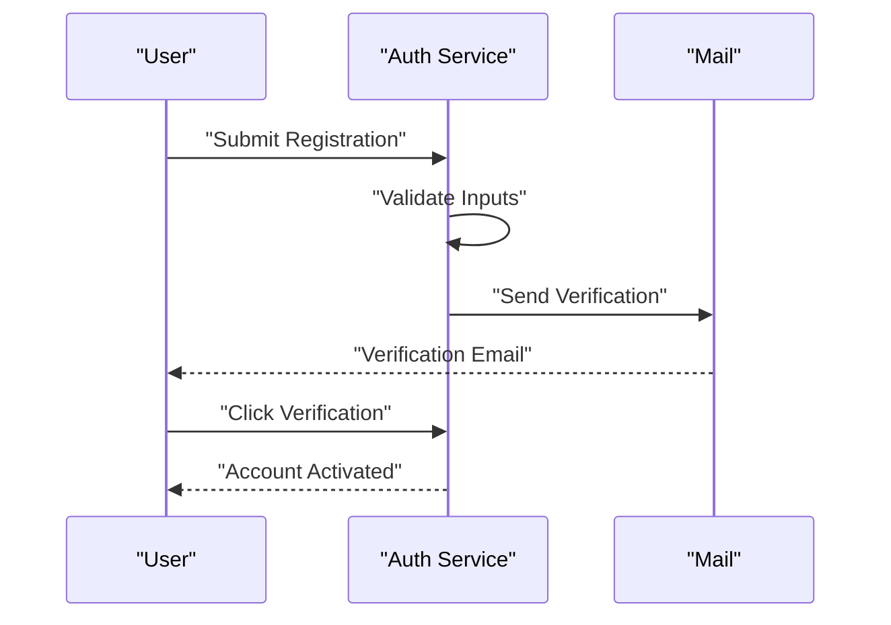
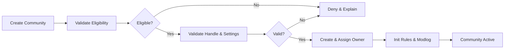
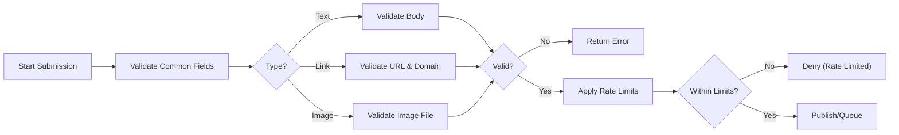
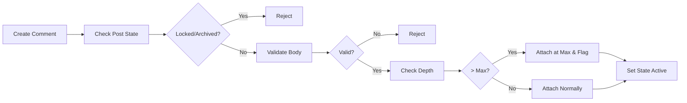
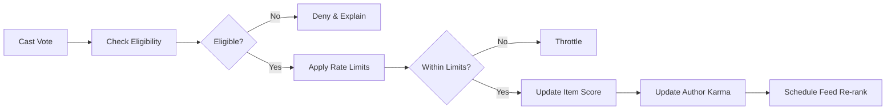
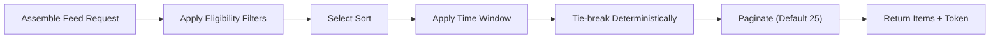
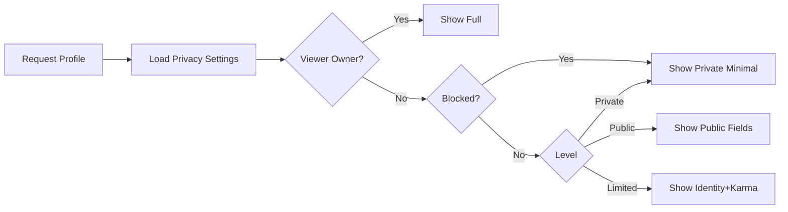
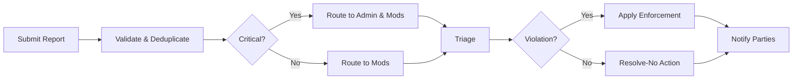
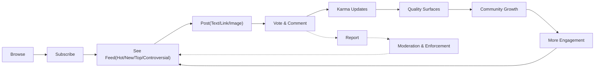

# communityPlatform Business Requirements Specification (BRS)

## Vision and Scope
communityPlatform enables interest-based communities where members publish posts (text, link, image), discuss via nested comments, curate quality with upvotes/downvotes, and personalize discovery through subscriptions and transparent feed sorting (Hot, New, Top, Controversial). Community owners and moderators govern locally within site-wide policies; administrators ensure platform-wide safety and compliance.

EARS summary:
- THE platform SHALL enable topic-centric communities discoverable and governable within site-wide policies.
- WHEN members participate (posting, commenting, voting), THE platform SHALL reflect changes in feeds, karma, and profiles within defined freshness targets.
- IF content or behavior violates rules, THEN THE platform SHALL support reporting, triage, enforcement, and appeals with auditable outcomes.

## Roles and Responsibility Model (Business-Level)
Roles: guestUser (unauthenticated), memberUser (authenticated), communityOwner (per-community authority), communityModerator (per-community enforcement), adminUser (site-wide safety and policy).

Permission boundaries (overview):
- guestUser: read-only access to public content.
- memberUser: can register/login, subscribe, post, comment, vote, report, manage own profile and content.
- communityOwner: all moderator powers in owned community; configures rules and settings; appoints/removes moderators.
- communityModerator: moderate within assigned community; act on reports; enforce rules.
- adminUser: site-wide governance; override community decisions for policy/legal reasons; manage categories and global safety.

EARS:
- THE role system SHALL prevent actions outside a user’s permitted scope and SHALL communicate reasons for denials with recovery guidance.
- WHERE a user holds multiple community roles, THE system SHALL evaluate permissions per target community context.

## Core User Journeys (Scenarios)
1) Registration/Login
- WHEN a guest submits valid registration, THE system SHALL create an account in PendingVerification and send verification instructions within 10 seconds.
- WHEN a verified user logs in with valid credentials, THE system SHALL establish a session and present member capabilities.

2) Create Community
- WHEN an eligible member submits a unique handle and compliant settings, THE system SHALL create the community and assign ownership.

3) Post Content (Text/Link/Image)
- WHEN a member submits valid post data allowed by the community, THE system SHALL publish the post or hold for review per policy.

4) Vote (Up/Down)
- WHEN a member votes on eligible content, THE system SHALL update the item’s score and the author’s karma with freshness guarantees.

5) Comment & Nested Replies
- WHEN a member submits a valid comment, THE system SHALL attach it to the post or target comment respecting depth limits.

6) Subscribe/Unsubscribe
- WHEN a member subscribes to a community, THE system SHALL include its new content in the member’s home feed within 60 seconds.

7) Profiles
- WHEN a viewer opens a public profile, THE system SHALL display identity, karma, and activity per the owner’s privacy settings.

8) Report Inappropriate Content
- WHEN a member submits a report with a valid category, THE system SHALL create a case, route for triage, and notify the reporter of status changes.

## 1) Authentication & Account Lifecycle (Business Requirements)
Definitions: Account states include PendingVerification, Active, Locked, PasswordResetRequired, Deactivated, PendingDeletion, Deleted, Banned.

Requirements (EARS):
- THE system SHALL allow registration with unique email and username, acceptance of Terms and Privacy, and a compliant password.
- WHEN registration is accepted, THE system SHALL set state to PendingVerification and send a one-time verification link (24h expiry).
- WHEN a user completes verification, THE system SHALL grant Active state and enable member capabilities.
- IF login attempts exceed thresholds, THEN THE system SHALL lock the account for a cooling period and notify the user.
- THE system SHALL allow password reset via one-time links (60m expiry) and SHALL revoke active sessions after reset.
- WHEN a user logs out from all devices, THE system SHALL terminate all active sessions within 60 seconds.
- THE system SHALL require email verification before enabling posting, voting, or commenting.
- THE system SHALL display user-facing times in the user’s timezone; WHERE unset, THE system SHALL default to Asia/Seoul for server-rendered timestamps.

Sequence (Mermaid):

Acceptance:
- Successful registration creates PendingVerification within 10s p95; verification activates account within 5s p95 of link open; login p95 < 2s.

## 2) Communities & Governance (Business Requirements)
Requirements (EARS):
- THE system SHALL allow eligible members to create communities with unique handles and policy-compliant names and descriptions.
- WHEN a community is created, THE system SHALL assign the creator as owner, initialize default rules, and record an audit entry.
- WHERE a community is NSFW, THE system SHALL apply age and preference gates platform-wide.
- WHEN owners appoint moderators, THE system SHALL require acceptance within a window or cancel the appointment.
- WHEN moderators act (approve/remove/lock/ban), THE system SHALL require reason codes and SHALL log actions immutably.
- IF an owner transfers ownership, THEN THE system SHALL require recipient acceptance before effect.
- IF community visibility changes (public→private), THEN THE system SHALL update access instantly and notify subscribers per preferences.

Flow (Mermaid):

Acceptance:
- Community creation p95 < 2s; moderation actions reflect in feeds within 5s.

## 3) Posting (Text, Link, Image)
Requirements (EARS):
- THE system SHALL support post types "Text", "Link", and "Image" only.
- WHEN a member submits a post, THE system SHALL validate title (1–300 chars), allowed type per community, and optional labels/tags.
- WHERE a Text post is submitted, THE system SHALL require body 1–40,000 chars.
- WHERE a Link post is submitted, THE system SHALL require an http/https URL ≤ 2,048 chars and SHALL block disallowed domains.
- WHERE an Image post is submitted, THE system SHALL allow JPEG/PNG/GIF ≤ 10 MB with min 320x320 pixels and SHALL reject corrupted/transparent-only images.
- WHEN validation fails, THE system SHALL return a single primary error with human-readable guidance.
- WHEN a post is created, THE system SHALL make it visible in the community feed within 5 seconds and in home feeds within 10 seconds under normal load.
- WHERE communities require tags/flairs, THE system SHALL prevent publishing without required tags and SHALL allow moderators to adjust tags.
- WHERE NSFW or Spoiler labels are set, THE system SHALL enforce preview shielding and age/preference gates.
- WHERE rate limits apply (e.g., 5 posts/24h default), THE system SHALL enforce them and provide retry-after guidance.

Lifecycle states: Active, Locked, Archived, Removed by Moderation, Removed by Admin, Deleted by Author, Pending Review, Legal Hold.

Flow (Mermaid):

Acceptance:
- Publish acknowledgment p95 ≤ 2s (excluding upload time); state changes reflected in ≤ 5s.

## 4) Comments & Nested Replies
Requirements (EARS):
- THE system SHALL allow members to comment on unlocked, non-archived posts and to reply under depth ≤ 8.
- WHEN a comment is submitted, THE system SHALL validate body 1–10,000 chars and enforce community policies (e.g., word filters, link caps for low-trust users).
- WHERE replies exceed max depth, THE system SHALL attach at max depth and flag "depth_max_reached".
- WHEN comments are edited, THE system SHALL record edit timestamp, retain non-public history for moderators/admins, and display an "edited" indicator if > 2 minutes after creation.
- WHEN a comment or thread is locked, THE system SHALL prevent new replies beneath the locked node and display a lock indicator.
- WHEN a post is archived, THE system SHALL render all comments read-only.

Flow (Mermaid):

Acceptance:
- Comment creation p95 ≤ 2s; lock/unlock reflects in ≤ 2s.

## 5) Voting & Karma
Requirements (EARS):
- THE system SHALL allow only authenticated, eligible users to vote; self-votes are disallowed.
- WHERE email is unverified or account age < 1 hour, THE system SHALL deny voting and provide guidance.
- WHERE community disables downvotes, THE system SHALL allow only upvotes.
- WHEN an upvote/downvote is cast, THE system SHALL update the item’s aggregates and the author’s post/comment karma within freshness targets (≤ 2s visible to voter; ≤ 10s to others).
- WHERE content is locked or archived, THE system SHALL disable new voting and vote changes.
- WHERE fraud is suspected (brigading, correlated accounts), THE system SHALL apply protective measures (slowdown, freeze, weight reduction) and inform users in generic terms.
- WHERE fraudulent votes are confirmed, THE system SHALL retroactively remove their impact on scores and karma.

Karma (business rules):
- THE system SHALL maintain post karma, comment karma, and total karma per user; totals may be negative.
- WHERE content is removed (policy or author-deleted), THE system SHALL exclude that content’s karma from visible totals.

Flow (Mermaid):

Acceptance:
- Vote acknowledgment ≤ 500 ms p50 and ≤ 2s p95; profile karma updates ≤ 10s p95.

## 6) Feeds & Sorting (Hot, New, Top, Controversial)
Eligibility filters (before sorting): respect visibility, bans, mutes/blocks, NSFW preferences, content state (exclude removed/hard-deleted), and privacy.

Definitions (business-only):
- New: order by creation time descending.
- Top: order by highest net approval within a selected window (24h, 7d, 30d, 1y, all-time); require ≥ 1 net vote.
- Hot: emphasize recent, engaging posts with recency decay; require ≥ 3 total votes to enter.
- Controversial: highlight posts with high total votes and balanced polarity; minimum 10 total votes; exclude policy-removed content.

EARS:
- THE feed assembler SHALL prioritize subscribed communities for member Home, and global popularity for guest Home.
- WHERE subscribed sources are insufficient for page size, THE assembler SHALL supplement with safe recommendations.
- THE sorting engine SHALL apply deterministic tie-breaking and stable pagination (no duplicates across pages for identical parameters).
- THE system SHALL default Top/Controversial windows to 24h in Home and to All Time in Community unless specified.
- WHILE a user paginates within a request sequence, THE assembler SHALL maintain a 5-minute stability window to avoid reshuffling delivered pages.

Flow (Mermaid):

Acceptance:
- First page p95 ≤ 3s; subsequent pages p95 ≤ 3s; no duplicates across consecutive pages for same params.

## 7) Subscriptions & Personalization
Requirements (EARS):
- THE system SHALL allow members to subscribe/unsubscribe to communities they can access; banned users cannot subscribe.
- WHEN a member subscribes, THE system SHALL add the community to the subscription list and reflect inclusion in Home within 60 seconds.
- WHEN a member unsubscribes, THE system SHALL cease including new content from that community immediately.
- THE system SHALL enforce a diversity rule in Home pages to avoid over-concentration (> 40% from one community when alternatives exist).
- THE system SHALL allow muting communities to suppress their content without changing subscription state.

Acceptance:
- Subscription toggle effects visible in Home within 60s; list pagination default 50 items/page.

## 8) Profiles & Activity
Requirements (EARS):
- THE system SHALL display username, display name, avatar, bio, join date, and karma totals per privacy settings.
- WHERE the owner hides activity or subscriptions, THE system SHALL suppress those lists for viewers other than the owner and adminUser (for safety).
- WHEN a profile is set to Private, THE system SHALL show minimal identity only to non-owners.
- WHEN a viewer is blocked by the profile owner, THE system SHALL treat the profile as Private to that viewer.
- THE system SHALL paginate activity at 20 items/page and subscriptions at 50 items/page, returning within 2s p95.

Flow (Mermaid):

Acceptance:
- Profile header p95 ≤ 700 ms; full profile p95 ≤ 2s.

## 9) Reporting, Safety & Trust
Requirements (EARS):
- THE system SHALL allow members to report posts, comments, communities, and user accounts using site-wide categories plus community-specific categories.
- WHEN a report is submitted, THE system SHALL deduplicate per item+category+reporter within 24h and aggregate counts.
- WHEN a report case is created, THE system SHALL route it to community moderators/owners and, for critical categories (e.g., child safety, credible threats), additionally to adminUser.
- THE system SHALL record case states: Open, Under Review, Awaiting Info, Resolved-Action Taken, Resolved-No Action, Escalated, Archived.
- WHEN enforcement is applied, THE system SHALL notify the content author (with reason code) and the reporter (outcome summary) without revealing reporter identity.
- WHERE bad-faith reporting is detected, THE system SHALL rate-limit further reports from that account and record the signal privately.

Flow (Mermaid):

Acceptance:
- Report acknowledgment within 2s p95; critical category routing near-real-time; enforcement visibility in feeds within 5 minutes 99%.

## 10) Permission Matrix (Business-Level Snapshot)
| Action | guestUser | memberUser | communityModerator | communityOwner | adminUser |
|---|---|---|---|---|---|
| View public content | ✅ | ✅ | ✅ | ✅ | ✅ |
| Register/Login | ✅/❌ | ✅ | ✅ | ✅ | ✅ |
| Create community | ❌ | ✅ (eligible) | ✅ (as member) | ✅ (as member) | ✅ |
| Post/Comment/Vote | ❌ | ✅ | ✅ | ✅ | ✅ |
| Moderate (scoped) | ❌ | ❌ | ✅ | ✅ | ✅ (global) |
| Apply site-wide enforcement | ❌ | ❌ | ❌ | ❌ | ✅ |
| Report content | ❌ | ✅ | ✅ | ✅ | ✅ |
| View audit logs (scoped/system) | ❌ | ❌ | ✅ (scoped) | ✅ (scoped) | ✅ (system) |

EARS:
- THE system SHALL enforce the above permissions, scoping moderation to the relevant community and reserving overrides to adminUser for policy/legal reasons.

## 11) Non-Functional Requirements (User-Centered)
Performance & Freshness:
- THE system SHALL return first-page Home feed within 2s p50 and 3s p95; community feed within 700 ms p50 and 1.2s p95.
- THE system SHALL acknowledge votes within 400 ms p95 and reflect score changes to the voter within 2s p95.
- THE system SHALL make new posts visible in community feeds within 5s and in Home within 10s.

Availability & Reliability:
- THE system SHALL meet 99.9% monthly uptime for core actions (browse, login, post, vote, comment).
- WHEN partial outages occur, THE system SHALL gracefully degrade optional features (e.g., recommendations) and label stale data.

Security & Privacy:
- THE system SHALL minimize personal data collection and mask sensitive data in errors/logs.
- WHEN suspicious behavior occurs (brute force, vote manipulation), THE system SHALL apply throttles and verifications.
- WHEN users request deletion, THE system SHALL complete erasure/anonymization within 30 days absent legal holds.

Localization & Timezone:
- THE system SHALL localize user-facing messages; EARS keywords remain English in specifications.
- THE system SHALL render times in the user’s selected timezone; if none, default to Asia/Seoul in server-generated notices for consistency.

Observability & Auditing:
- THE system SHALL log authentication events, content lifecycle actions, moderation/enforcement, role assignments, and data-rights events with minimal PII and tamper-evident storage.

## 12) Error and Recovery Semantics (Business-Facing)
Standardized categories (examples): AUTH_INVALID_CREDENTIALS, AUTH_EMAIL_NOT_VERIFIED, PERM_INSUFFICIENT_ROLE, POST_VALIDATION_FAILED, POST_DUPLICATE_DETECTED, COMMENT_RATE_LIMITED, VOTE_SELF_NOT_ALLOWED, VOTE_TARGET_LOCKED, SORT_UNSUPPORTED, SUB_LIMIT_REACHED, PROFILE_PRIVATE, REPORT_DUPLICATE_OPEN, SYS_TEMPORARY_UNAVAILABLE.

EARS:
- WHEN an action fails, THE system SHALL present a clear, localized message and an action-oriented hint within 2s p95.
- WHEN rate limits block an action, THE system SHALL include a retry-after estimate.
- WHEN duplicates are detected, THE system SHALL reference the existing item by title/community without revealing sensitive data.

## 13) Acceptance Criteria & KPIs
Acceptance (samples):
- GIVEN a verified member, WHEN creating a text post with valid fields, THEN publication completes ≤ 2s p95 and appears in the community feed ≤ 5s.
- GIVEN a new account < 1 hour, WHEN attempting to vote, THEN the system denies with guidance to wait or verify.
- GIVEN a locked post, WHEN attempting to comment, THEN the system denies with "post_locked" and no side effects occur.
- GIVEN a report with a critical category, WHEN submitted, THEN it appears in admin queues within 60 seconds and acknowledges the reporter immediately.

KPIs (illustrative):
- Report resolution median < 24h for community-level cases by month 3.
- Home feed first-page p95 < 3s in 95% of days per month.
- Duplicate link post rejection accuracy > 90% by sampling.

## 14) Glossary
- Community: A topic-based forum governed by owner/moderators.
- Karma: Reputation derived from community voting on user-authored content.
- Hot/New/Top/Controversial: Business-defined sorts for feeds reflecting recency, approval, and polarity.
- NSFW: Not Safe For Work; label controlling visibility and monetization eligibility.
- Locked/Archived: Interaction-restricted states that preserve visibility with no new votes/comments.
- Pending Review: Temporary state awaiting moderation.

## 15) Global Value Loop (Conceptual)

Notes on Scope Compliance:
- Business requirements only; no database schemas, API endpoints, or UI wireframes are specified. Requirements are written in EARS for testability, with diagrams validated for Mermaid syntax (labels use double quotes, proper arrows, no extraneous spaces).