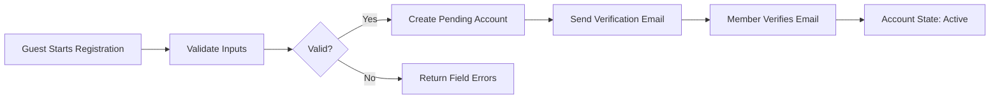
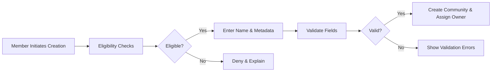
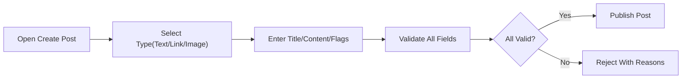
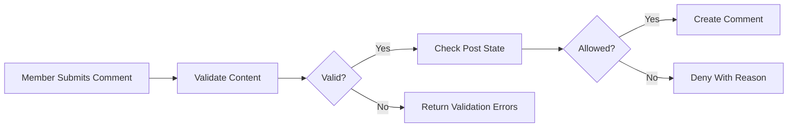
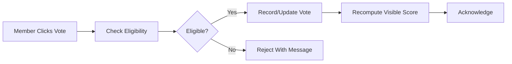
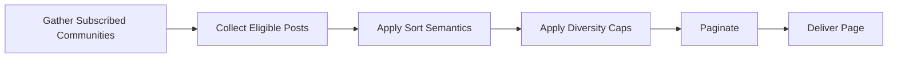
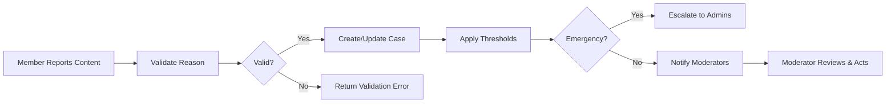

# communityPlatform — Requirements Analysis Report (Business-Level)

## Vision and Scope
- Purpose: Enable interest-based communities where members post text, links, or images; vote and comment with nested replies; subscribe to communities; build reputation via karma; and maintain safety through reporting and moderation.
- Outcomes: High-signal discovery through voting and ranking; transparent governance; member-controlled feeds; measurable performance and safety SLAs.
- In Scope (MVP): Registration and login; community creation and subscription; posting (text/link/image); voting and ranking (Hot/New/Top/Controversial); comments with nesting; user profiles and karma; reporting moderation; notifications (business-level triggers).
- Out of Scope (MVP): Direct messaging; livestreaming; marketplace; third‑party OAuth; complex monetization beyond basic policy placeholders.

EARS (scope-defining):
- THE platform SHALL permit guests to browse public communities and content.
- WHEN a guest completes registration and verifies email, THE platform SHALL grant member capabilities aligned to role permissions.
- THE platform SHALL support posts of type text, link, and image with type-specific validations.
- THE platform SHALL allow upvote/downvote on posts and comments by authenticated members only.
- THE platform SHALL provide post sorts Hot/New/Top/Controversial and comment sorts Top/New/Old/Controversial in business terms.
- WHEN content is reported, THE platform SHALL enqueue it for moderation and track outcomes.

## Actors and Roles
- Guest: Unauthenticated visitor; can view public content; cannot interact.
- Member: Authenticated user; can subscribe to communities, post, vote, comment, report content, manage profile settings.
- Community Moderator (role assigned to a Member per community): Can review reports and enforce rules within scope (remove/lock/label/sanction locally).
- Community Owner (subset of Member): Owns a specific community; can configure rules, assign/remove moderators, transfer ownership.
- Admin: Platform-level operator; handles escalations, platform-wide sanctions, community quarantines and closures.

EARS (role principles):
- THE platform SHALL restrict actions by actor identity (guest, member, moderator, owner, admin) and community scoping for moderator/owner actions.
- WHERE a role is community-scoped, THE platform SHALL prevent actions outside that community.

## Authentication and Account Lifecycle (Business Workflows)
- Registration: Email + password with consent; creates pending account awaiting email verification.
- Verification: Confirms email and promotes to active member.
- Login/Logout: Establishes and revokes authenticated sessions with short-lived access and longer-lived refresh model (business-level).
- Recovery: Password reset via secure process; invalid or expired tokens are rejected with a remediation path.
- Account States: email-unverified, active, suspended, deleted.

EARS:
- WHEN a guest registers with valid data, THE platform SHALL create an "email-unverified" account and send verification within 10 seconds.
- WHEN verification is completed, THE platform SHALL activate the account immediately and record activation time.
- IF email is unverified, THEN THE platform SHALL block posting, voting, and community creation until verification.
- WHEN a member logs in with valid credentials, THE platform SHALL establish a session within 2 seconds under normal load.
- WHEN a member requests password reset, THE platform SHALL issue a secure reset flow and invalidate prior sessions upon successful reset.

Mermaid — Authentication Flow

```mermaid
graph LR
  A["Guest Starts Registration"] --> B["Validate Inputs"]
  B --> C{"Valid?"}
  C -->|"Yes"| D["Create Pending Account"]
  D --> E["Send Verification Email"]
  E --> F["Member Verifies Email"]
  F --> G["Account State: Active"]
  C -->|"No"| X["Return Field Errors"]
```

## Communities (Creation, Governance, Subscription)
- Creation: Members with verified email and in good standing can create communities with unique names and required metadata.
- Ownership & Moderation: Creator becomes owner; owners can appoint moderators; moderators act within community scope.
- Rules & Guidelines: Owners/moderators can define rule sets (titles, descriptions) and update with audit trail.
- Visibility: Public, Restricted, Private; determines who may view and who may participate.
- Subscriptions: Members subscribe/unsubscribe; private communities require approval; bans revoke subscription.

EARS:
- WHEN a member proposes a community name, THE platform SHALL enforce case-insensitive uniqueness and reserved term restrictions.
- WHEN a community is created, THE platform SHALL assign the creator as owner and allow moderator assignment.
- WHEN visibility is Private, THE platform SHALL restrict viewing and participation to approved members.
- WHEN a member subscribes, THE platform SHALL include posts from that community in the member’s home feed for subsequent loads.
- IF a member is banned from a community, THEN THE platform SHALL block their posting, commenting, and voting in that community and remove the subscription.

Mermaid — Community Creation

```mermaid
graph LR
  A["Member Initiates Creation"] --> B["Eligibility Checks"]
  B --> C{"Eligible?"}
  C -->|"Yes"| D["Enter Name & Metadata"]
  D --> E["Validate Fields"]
  E --> F{"Valid?"}
  F -->|"Yes"| G["Create Community & Assign Owner"]
  F -->|"No"| H["Show Validation Errors"]
  C -->|"No"| I["Deny & Explain"]
```

## Posting (Text/Link/Image)
- Types: Text (title + optional body), Link (title + URL + optional short summary), Image (title + 1–10 images with optional per-image captions).
- Validation: Title length bounds; body and caption limits; URL scheme and length; image type/size/count; community-specific rules (allowed post types, banned domains).
- Flags: NSFW and Spoiler flags; influence visibility and previews.
- Editing/Deletion: Author edit windows; soft deletion with tombstone; moderator removal; archival disables new interactions.

EARS:
- WHEN a member submits a post, THE platform SHALL validate title, content, and flags according to type-specific rules and community policy.
- IF any validation fails, THEN THE platform SHALL reject creation and enumerate all failed rules in a single response.
- WHEN a post is marked NSFW, THE platform SHALL restrict visibility to eligible, opted-in members and hide previews for others.
- WHEN a post is older than 180 days without activity, THE platform SHALL archive the post and disable new comments and votes.

Mermaid — Post Creation

```mermaid
graph LR
  A["Open Create Post"] --> B["Select Type(Text/Link/Image)"]
  B --> C["Enter Title/Content/Flags"]
  C --> D["Validate All Fields"]
  D --> E{"All Valid?"}
  E -->|"Yes"| F["Publish Post"]
  E -->|"No"| G["Reject With Reasons"]
```

## Comments and Nested Threads
- Eligibility: Comments allowed on published, unlocked posts within community visibility constraints.
- Nesting: Replies form a tree up to a maximum depth; deep branches are collapsed by default.
- Editing/Deletion: Author edits allowed for a limited window; soft deletion keeps thread continuity; moderator removal preserves audit view.
- Sorting: Top/New/Old/Controversial supported at sibling level; deterministic tie-breakers.

EARS:
- WHEN a member submits a comment, THE platform SHALL associate it to the parent (post or comment) and maintain correct nesting.
- WHEN a thread is locked, THE platform SHALL prevent new comments while preserving visibility of existing ones.
- IF a comment exceeds content or link limits, THEN THE platform SHALL reject with field-specific errors.

Mermaid — Comment Flow

```mermaid
graph LR
  A["Member Submits Comment"] --> B["Validate Content"]
  B --> C{"Valid?"}
  C -->|"Yes"| D["Check Post State"]
  D --> E{"Allowed?"}
  E -->|"Yes"| F["Create Comment"]
  E -->|"No"| G["Deny With Reason"]
  C -->|"No"| H["Return Validation Errors"]
```

## Voting and Ranking
- Voting: Members can upvote or downvote each post or comment once; vote can be changed or removed.
- Eligibility: No guest voting; no self-voting; private/restricted communities require membership; locked/archived content disallows new votes.
- Integrity: Rate limits and brigading detection; suspicious votes can be invalidated by moderators/admins.
- Scores: Net score and total votes as business concepts; used by ranking sorts.
- Sorts (Posts):
  - Hot: Recency-aware popularity; de-emphasizes older content when scores are similar.
  - New: Strict reverse-chronological by creation time.
  - Top: Highest net score within selected timeframe (default This Week).
  - Controversial: High total votes with balanced up/down ratio within timeframe; requires a minimum vote count.
- Sorts (Comments): Top/New/Old/Controversial, applied among siblings with deterministic ties.

EARS:
- WHEN a member casts a vote, THE platform SHALL record a single vote state per item and update visible score within 5 seconds.
- IF a member attempts to vote on own content, THEN THE platform SHALL reject the vote with a policy message.
- WHEN sort = Hot, THE platform SHALL rank recent higher-scoring posts above older equally scoring posts.
- WHEN sort = Top with timeframe, THE platform SHALL include only posts within the timeframe and order by net score, then total votes, then recency.
- WHEN sort = Controversial, THE platform SHALL include only items meeting minimum total votes and prioritize closer up/down balance.

Mermaid — Vote Processing

```mermaid
graph LR
  A["Member Clicks Vote"] --> B["Check Eligibility"]
  B --> C{"Eligible?"}
  C -->|"Yes"| D["Record/Update Vote"]
  D --> E["Recompute Visible Score"]
  E --> F["Acknowledge"]
  C -->|"No"| G["Reject With Message"]
```

## Subscriptions and Feeds
- Subscribe/Unsubscribe: Members can subscribe to communities; creators are auto-subscribed to their own communities; bans revoke subscriptions.
- Home Feed: Composed primarily from subscribed communities; backfills with popular content if no subscriptions; honors policies and preferences (NSFW, blocks).
- Community Feed: Items from a single community; pinned items appear above ranked lists.
- Pagination: Default 20 items per page; user preference 10–50 within a hard cap of 100.
- Diversity: Cap single-community dominance per page to avoid overrepresentation (e.g., 60% default cap).

EARS:
- WHEN a member subscribes, THE platform SHALL reflect the state immediately and include the community’s posts in subsequent home feed loads.
- WHEN a member has zero subscriptions, THE platform SHALL present a global popular feed compliant with safety and policy filters.
- WHERE a member disables NSFW, THE platform SHALL exclude NSFW posts from all feed sorts.
- THE platform SHALL prevent duplicate items within a single page response and maintain stable ordering within that page.

Mermaid — Home Feed Composition

```mermaid
graph LR
  A["Gather Subscribed Communities"] --> B["Collect Eligible Posts"]
  B --> C["Apply Sort Semantics"]
  C --> D["Apply Diversity Caps"]
  D --> E["Paginate"]
  E --> F["Deliver Page"]
```

## Profiles and Karma
- Profile: Public representation of a member with identity fields (username, display name, avatar, bio), join date, karma totals, and recent authored content subject to visibility.
- Karma: Sum of post karma and comment karma; changes with valid vote events; used for eligibility gates (e.g., downvote enablement, community creation).
- Privacy: Profile privacy levels (Public/Members-only/Private); block/hide interactions reduce visibility.

EARS:
- WHEN a valid upvote is cast on a member’s post, THE platform SHALL increase post karma by one unit and reflect on profile within 5 seconds.
- WHEN a valid downvote is cast on a member’s comment, THE platform SHALL decrease comment karma by one unit and reflect within 5 seconds.
- WHERE profile privacy is Members-only, THE platform SHALL restrict full profile view to authenticated members and show a minimal stub to guests.

## Reporting and Moderation
- Reporting: Members can report posts/comments with categorized reasons and optional notes; deduplicate same-reporter multiple reports.
- Queues: Reports aggregate into cases; moderators review community-scoped cases; admins review escalations.
- Actions: Approve, remove, lock, correct labels, warn, mute/ban (community scope), platform ban (admin scope), quarantine community (admin scope).
- Thresholds: Auto-soft-hide or under-review states triggered by report volume and severity.
- Appeals: Authors can appeal removals and sanctions within set windows; escalations occur if moderator unresponsive.

EARS:
- WHEN a member submits a report, THE platform SHALL acknowledge within 1 second and aggregate into a case.
- WHEN a case includes Emergency/Critical reasons, THE platform SHALL escalate to admins immediately and mark content Under Review.
- WHEN a moderator removes content, THE platform SHALL record action, reason, and notify the author with appeal options.
- IF no moderator takes action within 48 hours on an Under Review case, THEN THE platform SHALL auto-escalate to admins.

Mermaid — Reporting Flow

```mermaid
graph LR
  A["Member Reports Content"] --> B["Validate Reason"]
  B --> C{"Valid?"}
  C -->|"Yes"| D["Create/Update Case"]
  D --> E["Apply Thresholds"]
  E --> F{"Emergency?"}
  F -->|"Yes"| G["Escalate to Admins"]
  F -->|"No"| H["Notify Moderators"]
  H --> I["Moderator Reviews & Acts"]
  C -->|"No"| X["Return Validation Error"]
```

## Non-Functional Requirements (Business-Level)
- Performance: Interactive actions (login, vote, post, comment) complete within 1–2 seconds under normal load (p95); home feed first page within 3.5 seconds p95.
- Availability: 99.9% monthly availability target for core functions.
- Consistency: Read-after-write for actor’s own actions within 5 seconds; eventual consistency for aggregate counts up to 60 seconds.
- Security: Email verification before content creation; step-up verification for sensitive actions (e.g., ownership transfer, account deletion); password policy with minimum complexity.
- Rate Limiting: Fair-use caps on voting, posting, commenting, and reporting to deter abuse; clear retry-after guidance.
- Auditability: Immutable logs for moderation/admin actions, ownership transfers, sanctions, and data exports; 1–2 year retention depending on record type.

EARS:
- THE platform SHALL render the first page of the home feed within 3.5 seconds at the 95th percentile under normal load.
- THE platform SHALL record and retain moderation actions for at least 2 years.
- WHEN a user updates profile data, THE platform SHALL reflect changes within 5 seconds on subsequent reads for that user.

## Error Handling and Edge Cases
- Validation: Field-specific errors for titles, URLs, image limits, comment length, mention/link limits.
- Authorization: Clear messages for role and community scope violations.
- Rate Limits: Explicit retry-after seconds (±5 seconds accuracy) and cooling-off messaging.
- State Conflicts: Duplicate submissions rejected with conflict guidance; drafts preserved for a grace period.
- Locked/Archived: Attempts to post/comment/vote on locked or archived items are denied with state-specific reasons.
- Privacy & Visibility: Private community content hidden from unauthorized viewers; minimal stub presented where needed.

EARS:
- IF input validation fails, THEN THE platform SHALL enumerate per-field violations and the accepted ranges.
- IF an action is rate-limited, THEN THE platform SHALL return a retry-after value accurate within ±5 seconds and not consume additional quota for retry denials within the same window.
- IF a post is locked or archived, THEN THE platform SHALL deny new comments and votes and provide the reason.

## Acceptance Criteria (Consolidated EARS)
Authentication
- WHEN a user verifies email, THE platform SHALL activate the account immediately and allow login.
- WHEN a user logs in with valid credentials, THE platform SHALL establish a session within 2 seconds.

Communities
- WHEN a valid community name and metadata are submitted by an eligible member, THE platform SHALL create the community within 2 seconds and assign ownership to the creator.
- IF a name conflicts or violates policy, THEN THE platform SHALL reject with a precise reason.

Posting
- WHEN a text/link/image post meets all validations, THE platform SHALL publish within 2 seconds (no attachments) or 5 seconds (with attachments).
- IF validation fails, THEN THE platform SHALL reject and list all errors in one response.

Comments
- WHEN a valid comment is submitted, THE platform SHALL publish within 2 seconds and maintain nesting.
- IF a comment exceeds limits or depth, THEN THE platform SHALL reject with guidance.

Voting and Ranking
- WHEN a member votes, THE platform SHALL record the vote and reflect score changes within 5 seconds.
- WHEN sort=Top with timeframe selected, THE platform SHALL restrict candidates to the timeframe and order by net score with deterministic ties.

Subscriptions and Feeds
- WHEN a member subscribes, THE platform SHALL include the community’s posts in subsequent home feed loads.
- IF a user has zero subscriptions, THEN THE platform SHALL show a global popular feed aligned to safety policies.

Profiles and Karma
- WHEN a valid upvote/downvote occurs, THE platform SHALL update post/comment karma within 5 seconds and adjust totals accordingly.

Reporting and Moderation
- WHEN a report is submitted, THE platform SHALL acknowledge within 1 second and route to the correct queue.
- WHEN a moderator removes content, THE platform SHALL notify the author of action and appeal options.

Error Handling
- WHEN rate limits are exceeded, THE platform SHALL communicate retry-after and not count further denials against quota within the same window.

## Glossary
- Community: Topic-based space with its own rules and moderators.
- Post Types: Text (title + optional body), Link (title + URL), Image (title + images).
- Karma: Reputation measure derived from community voting on a member’s posts and comments.
- Locked: State that disallows new comments and votes while preserving readability.
- Archived: Time-based state that disables new interactions due to age or policy.
- Hot/New/Top/Controversial: Business-level definitions of sorts controlling feed ordering.
- Under Review: Temporary state during moderation processing; content may be removed from default feeds.

## Visual Index (Mermaid Diagrams)
- Authentication Flow
- Community Creation
- Post Creation
- Comment Flow
- Vote Processing
- Home Feed Composition
- Reporting Flow

All diagrams use double-quoted labels and validated Mermaid syntax.
