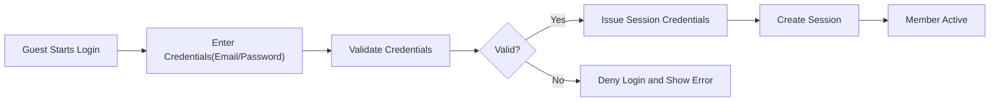
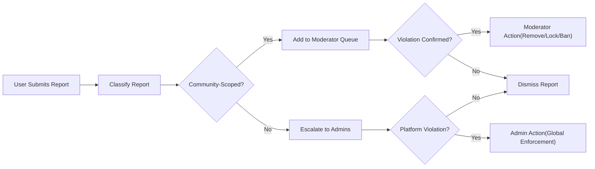

# communityPlatform — User Actors and Permissions Requirements

Actor roles, authentication lifecycle, authorization boundaries, and moderation scopes for the communityPlatform service. Requirements are expressed in business terms using EARS for testability. Technical implementation (APIs, schemas, storage) remains at the development team’s discretion.

## Actor Definitions and Responsibilities

### Global Actors (Platform-Wide)
- Guest (Unauthenticated)
  - May browse public communities and public content.
  - May view public portions of user profiles.
  - May read comments on public posts.
  - May initiate registration or login.
  - May submit reports only where policy permits and after human-verification (policy-configurable).
  - May not create communities, posts, comments, or votes.
- Member (Authenticated)
  - May manage own profile and preferences.
  - May create communities (subject to eligibility and policy limits).
  - May subscribe/unsubscribe to communities.
  - May create posts (text/link/image) where allowed by community rules.
  - May upvote/downvote posts and comments once per item, with ability to change the vote.
  - May comment with nested replies.
  - May report inappropriate content.
  - May be assigned as a community-level moderator for specific communities.
- Admin (Platform Administrator)
  - May enforce platform-wide policies, review escalations, and apply global sanctions.
  - May access administrative queues and audit views across communities.

### Community-Level Roles (Assigned to Members per Community)
- Community Owner
  - Ultimate authority within the community except where superseded by platform policy or admin action.
  - May configure rules, visibility, and posting eligibility within policy.
  - May appoint/remove moderators and transfer ownership with acceptance.
- Community Moderator
  - May review reports and take actions (remove content, lock threads, warn/ban within community scope).
  - May correct policy flags (e.g., NSFW, Spoiler) and pin posts within community limits.

Core actor principles (EARS):
- THE platform SHALL restrict actions based on actor identity (guest, member, admin) and community-level roles (owner, moderator).
- THE platform SHALL scope community-level roles to a single community and SHALL prevent authority outside that scope.
- THE platform SHALL subordinate community powers to platform policy and admin authority.

## Authentication and Account Lifecycle (Business-Level)

### Registration and Verification
- WHEN a guest registers with email and password, THE platform SHALL create a pending account in "email-unverified" state and send verification instructions within 10 seconds.
- WHEN the member completes verification, THE platform SHALL activate the account to "active" and record activation time.
- IF verification is not completed within 14 days, THEN THE platform SHALL restrict posting, voting, and community creation until verified.
- WHERE policy requires, THE platform SHALL require human-verification and/or rate limits during registration to deter abuse.

### Login, Sessions, and Logout
- WHEN a user submits valid credentials, THE platform SHALL authenticate and establish a session within 2 seconds under normal load.
- THE platform SHALL issue short-lived access credentials and longer-lived refresh credentials to sustain sessions.
- WHEN a user logs out, THE platform SHALL invalidate active session tokens and prevent further use within 60 seconds.
- WHERE multiple devices are used, THE platform SHALL manage independent sessions per device and SHALL allow per-device revocation.
- WHEN suspicious activity is detected (e.g., new device, sensitive actions), THE platform SHALL require step-up verification (e.g., recent password re-confirmation or equivalent) before proceeding.

### Password and Account Recovery
- WHEN a member requests password reset, THE platform SHALL send a secure reset process and SHALL invalidate existing access credentials upon password change.
- IF a password reset token is invalid or expired, THEN THE platform SHALL deny the reset and provide a way to initiate a new request.

### Account States
- THE platform SHALL maintain the following states: "email-unverified", "active", "suspended", "deleted".
- IF an account is "suspended", THEN THE platform SHALL disable posting, commenting, voting, and community creation; browsing of public content remains permitted unless further sanctioned.
- IF an account is "deleted", THEN THE platform SHALL remove interactive access and handle content per data lifecycle policies (e.g., anonymization/tombstoning).

### Device and Session Management
- WHEN a member reviews active sessions, THE platform SHALL list device-level sessions with last activity timestamps.
- WHEN a member revokes a session, THE platform SHALL immediately invalidate credentials associated with that session and reflect the change within 60 seconds on subsequent reads.

## Permission Hierarchy and Access Rules

### Principles
- THE platform SHALL apply deny-by-default to any action not explicitly allowed by actor role or community role.
- THE platform SHALL evaluate permissions in order of precedence: admin > platform policy > community owner > community moderator > community configuration > member > guest.
- WHERE multiple rules apply, THE platform SHALL apply the most restrictive rule unless a higher authority explicitly grants an exception aligned with policy.

### Discovery and Viewing
- THE platform SHALL allow guests and members to view public communities and content without authentication.
- WHERE a community is private or restricted, THE platform SHALL require membership or authorization to view content.
- IF a post or comment is removed or deleted, THEN THE platform SHALL limit visibility per visibility rules below while preserving audit access to authorized roles.

### Community Creation and Configuration
- WHEN a member attempts to create a community, THE platform SHALL enforce naming uniqueness and policy compliance.
- WHERE a member is email-unverified, THE platform SHALL disallow community creation until verified.
- WHERE quotas or karma thresholds apply, THE platform SHALL verify eligibility before creating the community.

### Posting and Interactions
- WHEN a member submits a post in a community that allows posting, THE platform SHALL validate type and community rules before publication.
- THE platform SHALL allow one active vote per item per member with ability to change the vote.
- WHERE post approval is required, THE platform SHALL keep posts non-public until approved by moderators/owner.
- IF a member is community-banned, THEN THE platform SHALL deny posting, commenting, and voting in that community.

### Commenting and Threads
- WHEN a member comments on a post, THE platform SHALL support nested replies up to the platform-defined depth and SHALL honor locked/archived states.
- WHERE a thread is locked by a moderator/owner, THE platform SHALL disallow new comments while retaining visibility of existing ones.

### Reporting and Safety Actions
- WHEN a user reports content, THE platform SHALL capture a reason and route it to the appropriate moderation queue (community or platform escalation).
- WHERE report thresholds or severity indicate escalation, THE platform SHALL notify or route to admins for review.
- IF content violates rules, THEN THE platform SHALL enable moderators/owners to remove it within scope; admins may enforce globally.

### Voting Integrity and Rate Limits (Business-Level)
- THE platform SHALL enforce one vote per item per member and SHALL support vote changes.
- WHERE abnormal voting patterns are detected, THE platform SHALL rate-limit or temporarily block voting actions and present clear messaging.
- WHERE new accounts are under trust thresholds, THE platform SHALL apply stricter posting/commenting frequency limits.

## Community-Level Moderator Role Model

### Ownership
- WHEN a member creates a community, THE platform SHALL designate that member as the owner.
- THE platform SHALL allow ownership transfer to an eligible member subject to acceptance within a defined window (e.g., 7 days).

### Moderator Assignment and Removal
- WHEN an owner assigns a moderator, THE platform SHALL grant community-scoped permissions to that member.
- WHEN an owner removes a moderator, THE platform SHALL revoke permissions immediately.
- WHERE the owner is inactive or unavailable, THE platform SHALL allow backup designation or admin intervention to manage assignments per policy.

### Capabilities and Boundaries
- THE platform SHALL allow moderators to: review reports, remove content, lock threads, approve/deny posts (if enabled), pin posts, and apply community-level sanctions (e.g., temporary bans).
- THE platform SHALL prevent moderators from acting outside assigned communities or altering platform policies.
- WHERE conflicts arise (e.g., moderator’s own content is reported), THE platform SHALL require adjudication by a different moderator, owner, or admin.

### Escalation and Appeals
- WHERE platform-level violations or legal risks are indicated, THE platform SHALL escalate cases to admins.
- WHEN a user appeals a community-level sanction, THE platform SHALL route the appeal to the owner or to admins if conflict of interest exists or no timely response occurs.

## Content Ownership and Visibility Rules

### Ownership
- THE platform SHALL attribute ownership of posts and comments to the creating member, regardless of role at creation time, while tracking role-at-action for audit.

### Visibility States
- THE platform SHALL support these states: "public", "pending-approval", "removed", "deleted", "locked", "quarantined", "archived".
- WHEN state is "public", THE platform SHALL display content to any viewer authorized for the community.
- WHEN state is "pending-approval", THE platform SHALL display to the author and moderators/owner only.
- WHEN state is "removed", THE platform SHALL hide from general viewers and retain audit visibility for moderators/owner and admins.
- WHEN state is "deleted" by the author, THE platform SHALL tombstone content while preserving discussion structure.
- WHEN state is "locked", THE platform SHALL prevent new comments while preserving visibility of existing content.
- WHEN state is "quarantined", THE platform SHALL restrict visibility according to platform safety policies.
- WHEN state is "archived", THE platform SHALL disallow edits and new comments while keeping the content readable.

### Editing and Deletion Windows
- WHERE an editing window exists (e.g., 15 minutes), THE platform SHALL allow edits within that window unless locked or archived.
- AFTER the editing window, THE platform SHALL restrict edits per policy (e.g., flair only) or disallow edits entirely.
- WHEN authors delete their content, THE platform SHALL hide the body from general viewers and retain a placeholder to preserve thread readability.

### Shadow Restrictions and Bans
- WHERE abuse patterns are detected, THE platform MAY apply shadow restrictions (e.g., reduced visibility or stricter limits) within policy and legal constraints.
- WHEN a community-level ban is active, THE platform SHALL block interactions in that community and inform the member of duration and reason where policy allows.

## Mermaid Diagrams (Business Flows)

### Authentication Flow (Business-Level)

### Community Report Handling and Escalation

## Error Handling and Unwanted Behavior (Business Rules)
- IF an unauthenticated user attempts to create content, THEN THE platform SHALL deny the action and prompt for authentication, preserving user intent for a seamless retry after login where safe.
- IF a member attempts an action outside community rules (e.g., posting in read-only), THEN THE platform SHALL deny and indicate the applicable restriction.
- IF a moderator attempts to act outside assigned communities, THEN THE platform SHALL deny the action and record the attempt for audit.
- IF an admin action conflicts with policy safeguards (e.g., mass deletion without reason), THEN THE platform SHALL require explicit justification and log the action for audit.
- IF rate limits are exceeded, THEN THE platform SHALL block the action temporarily and inform the user of the cooling period and next eligible time.

## Performance and Auditability Expectations (Business-Level)
- THE platform SHALL authenticate users and respond to login within 2 seconds under normal load.
- THE platform SHALL evaluate permission checks within 200 milliseconds during request handling under normal load.
- THE platform SHALL log all moderation and administrative actions with actor, target, timestamp, reason, and scope for auditability.
- THE platform SHALL retain audit logs for a policy-defined duration sufficient to support appeals and compliance.

## Permission Matrix by Actor

Legend: ✅ Allowed, ❌ Not allowed, ⚠️ Conditional (see Notes)

| Action | Guest | Member | Community Moderator | Community Owner | Admin |
|--------|-------|--------|---------------------|------------------|-------|
| Browse public communities | ✅ | ✅ | ✅ | ✅ | ✅ |
| View private/restricted community content | ❌ | ⚠️ | ✅ | ✅ | ✅ |
| Register | ✅ | ❌ | ❌ | ❌ | ❌ |
| Verify email | ⚠️ | ✅ | ✅ | ✅ | ✅ |
| Login/Logout | ⚠️ | ✅ | ✅ | ✅ | ✅ |
| Create community | ❌ | ⚠️ | ⚠️ | ⚠️ | ✅ |
| Transfer community ownership | ❌ | ❌ | ❌ | ⚠️ | ✅ |
| Assign/remove moderators | ❌ | ❌ | ❌ | ✅ | ✅ |
| Subscribe/Unsubscribe | ❌ | ✅ | ✅ | ✅ | ✅ |
| Create post (text/link/image) | ❌ | ✅ | ✅ | ✅ | ✅ |
| Edit own post (within window) | ❌ | ✅ | ✅ | ✅ | ✅ |
| Delete own post | ❌ | ✅ | ✅ | ✅ | ✅ |
| Upvote/Downvote | ❌ | ✅ | ✅ | ✅ | ✅ |
| Comment on posts | ❌ | ✅ | ✅ | ✅ | ✅ |
| Edit own comment (within window) | ❌ | ✅ | ✅ | ✅ | ✅ |
| Delete own comment | ❌ | ✅ | ✅ | ✅ | ✅ |
| Report content | ⚠️ | ✅ | ✅ | ✅ | ✅ |
| Remove posts/comments in community | ❌ | ❌ | ✅ | ✅ | ✅ |
| Lock/Unlock threads | ❌ | ❌ | ✅ | ✅ | ✅ |
| Approve/Reject pending posts | ❌ | ❌ | ✅ | ✅ | ✅ |
| Pin/Unpin posts | ❌ | ❌ | ✅ | ✅ | ✅ |
| Apply community-level bans | ❌ | ❌ | ✅ | ✅ | ✅ |
| View moderation queue (community) | ❌ | ❌ | ✅ | ✅ | ✅ |
| Escalate to admins | ❌ | ❌ | ✅ | ✅ | ✅ |
| Global content removal | ❌ | ❌ | ❌ | ❌ | ✅ |
| Suspend member globally | ❌ | ❌ | ❌ | ❌ | ✅ |
| Deactivate/Quarantine community | ❌ | ❌ | ❌ | ⚠️ | ✅ |
| Manage platform policies | ❌ | ❌ | ❌ | ❌ | ✅ |
| View user public profile | ✅ | ✅ | ✅ | ✅ | ✅ |
| View private account data (others) | ❌ | ❌ | ❌ | ❌ | ✅ |

### Notes (Conditions in EARS)
- WHERE a community is private or restricted, THE platform SHALL allow content viewing only to authorized members, moderators, owners, and admins.
- WHERE email is unverified, THE platform SHALL disallow community creation, image posting, or outbound notifications besides verification.
- WHERE quotas or karma thresholds apply, THE platform SHALL enforce limits on community creation, posting frequency, and voting rates.
- WHERE abuse risk is high (e.g., brand-new accounts), THE platform SHALL apply stricter rate limits.
- WHERE a user is community-banned, THE platform SHALL deny posting, commenting, and voting in that community while allowing browsing elsewhere as policy allows.

## Comprehensive EARS Requirements Catalog

### Authentication and Identity
- THE platform SHALL uniquely identify users by a persistent userId.
- WHEN a user logs in successfully, THE platform SHALL establish a session with short-lived access credentials and longer-lived refresh credentials.
- WHEN a user logs out, THE platform SHALL revoke credentials for the active session.
- IF credentials are invalid, THEN THE platform SHALL deny login and inform the user without revealing which field failed beyond policy-compliant messaging.

### Authorization and Permissions
- THE platform SHALL evaluate permissions per action using actor identity and community roles.
- WHEN a moderator performs an action, THE platform SHALL ensure the target belongs to the moderator’s assigned community.
- IF a permission check fails, THEN THE platform SHALL deny the action and provide a policy-compliant reason.

### Community Governance
- THE platform SHALL allow owners to appoint/remove moderators.
- WHEN ownership transfer is initiated, THE platform SHALL require acceptance by the recipient before completion.
- IF an owner is inactive past policy-defined thresholds, THEN THE platform SHALL enable admin-assisted governance interventions.

### Content Lifecycle
- WHEN authors edit within the allowed window, THE platform SHALL validate and apply changes while preserving moderation state.
- IF content is removed by moderation, THEN THE platform SHALL restrict visibility to moderators/owner and admins while hiding it from general viewers.
- WHEN content is archived, THE platform SHALL disable new comments and edits.

### Reporting and Enforcement
- WHEN content is reported, THE platform SHALL route it to the correct queue and SHALL enforce processing SLAs per policy.
- IF repeated violations occur, THEN THE platform SHALL escalate sanctions progressively (warnings → temporary bans → permanent bans) in line with policy.

### Audit and Transparency
- THE platform SHALL record actor, action, target, timestamp, reason, and scope for moderation/admin actions.
- WHERE appeals occur, THE platform SHALL retain records necessary to review decisions and outcomes.

## Non-Exhaustive Business Constraints and Validation
- THE platform SHALL enforce uniqueness for community names and forbid deceptive look-alikes per policy.
- THE platform SHALL restrict image posts to verified members where policy requires.
- THE platform SHALL prevent multiple votes from the same member on the same item; vote changes replace the prior vote.
- THE platform SHALL prevent posting/commenting in locked or archived threads.
- THE platform SHALL prevent any action that violates documented community rules or platform policies.

## Testable Acceptance Examples (Business-Level)
- WHEN an unauthenticated guest attempts to upvote a post, THE platform SHALL deny the action and prompt login.
- WHEN a verified member with sufficient eligibility creates a community using an available name, THE platform SHALL create the community and assign ownership to the creator within 2 seconds under normal load.
- WHEN a moderator removes a comment within their community, THE platform SHALL hide it from general viewers while keeping it visible to moderators/owner and admins for audit.
- WHEN an admin suspends a member globally, THE platform SHALL prevent that member from posting, commenting, voting, and creating communities platform-wide immediately.
- WHEN a user logs out from one device, THE platform SHALL invalidate that device’s session within 60 seconds.
- WHEN a user attempts to view a private community without membership, THE platform SHALL deny access and present a policy-compliant message without disclosing sensitive details.

## Scope and Implementation Autonomy
Business requirements only. Technical implementation decisions (architecture, APIs, data models, storage, protocols) are at the development team’s discretion and must align with platform-wide policies.