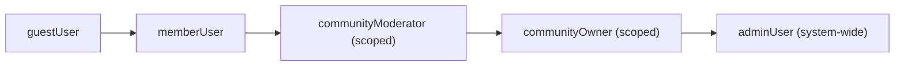
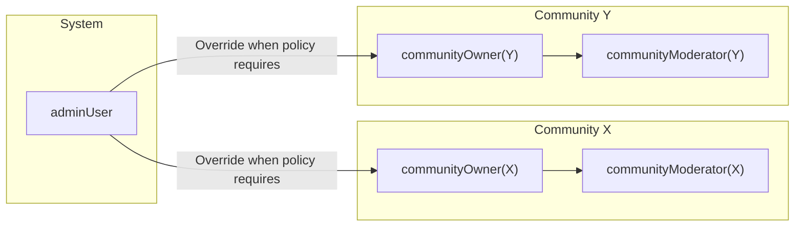
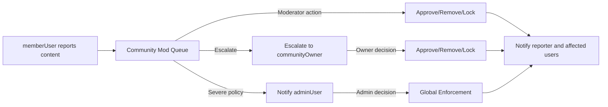

# 03 — communityPlatform User Roles and Permissions (Business Requirements)

## 1. Introduction and Scope
The purpose of this document is to define the complete set of user roles and their permissions, restrictions, and accountability obligations for the communityPlatform service (a Reddit-like community platform). The document specifies business requirements, not technical implementations, and uses EARS syntax where applicable to ensure unambiguous, testable statements. The scope covers:
- System-wide roles and community-scoped roles
- Permission boundaries for creating and moderating communities, posting and commenting, voting, reporting, and managing user profiles and subscriptions
- Enforcement responsibilities, escalation to administrators, and audit obligations
- High-level authentication and session business rules necessary to support role-based access control (RBAC)

This document describes WHAT the system must do from a business perspective. All technical implementation decisions (architecture, APIs, database design) are at the discretion of the development team.

## 2. Definitions and Glossary
- communityPlatform: The service that hosts communities, posts, comments, voting, reporting, and moderation features.
- Role: A set of permissions and restrictions applied to a user in the platform. Roles may be system-wide or scoped to a specific community.
- Kind: A classification grouping roles into guest (unauthenticated), member (authenticated), or admin (platform-wide administration).
- Community: A user-created forum (similar to a subreddit) with its own rules, moderators, and owner.
- Community Owner: The creator of a community; has the highest authority within that community.
- Community Moderator: A user appointed by a Community Owner to moderate a specific community.
- Member: An authenticated user without special moderation powers unless appointed in a community.
- Guest: An unauthenticated visitor with read-only access to public content.
- Admin: A platform-wide administrator with authority across all communities for trust & safety and platform governance.
- Privileged Action: Any action that changes another user’s participation or content visibility beyond one’s own content.
- Sensitive Action: Actions that affect safety, privacy, or platform integrity (e.g., bans, escalations, irreversible removals).
- Report: A user-submitted flag that content or behavior may violate community rules or platform policies.
- Appeal: A user’s request to overturn or review a moderation or enforcement decision.

## 3. Role Overview and Hierarchy

### 3.1 Role Catalog and Kinds
The following roles MUST be implemented, each classified under a required kind:

| Role Identifier | Display Name | Kind   | Scope            | Summary |
|-----------------|--------------|--------|------------------|---------|
| guestUser       | Guest        | guest  | System-wide      | Read-only access to public content and profiles. |
| memberUser      | Member       | member | System-wide      | Authenticated user with ability to participate and curate. |
| communityOwner  | Community Owner | member | Community-specific | Creator and highest authority of a specific community. |
| communityModerator | Community Moderator | member | Community-specific | Appointed moderator of a specific community. |
| adminUser       | Administrator | admin  | System-wide      | Site-wide governance, trust & safety, and escalations. |

### 3.2 Hierarchical Relationships
- guestUser has no write privileges.
- memberUser has baseline write privileges for their own content and subscriptions.
- communityModerator > memberUser capabilities within their moderated community scope only.
- communityOwner > communityModerator capabilities within their owned community scope only.
- adminUser supersedes all community-scoped roles across all communities for platform policy enforcement.

Mermaid — Role Hierarchy (conceptual)

## 4. Permission Matrix by Role
The matrix below enumerates business actions and whether a role is permitted. Where conditions apply, see notes and EARS requirements in Sections 5–7.

| Business Action | guestUser | memberUser | communityModerator | communityOwner | adminUser |
|-----------------|-----------|------------|--------------------|----------------|-----------|
| View public communities and posts | ✅ | ✅ | ✅ | ✅ | ✅ |
| Register account | ✅ | ❌ | ❌ | ❌ | ❌ |
| Login/Logout | ❌ | ✅ | ✅ | ✅ | ✅ |
| Verify email | ❌ | ✅ | ✅ | ✅ | ✅ |
| Create community | ❌ | ✅ | ✅ | ✅ | ✅ |
| Edit community settings (own community) | ❌ | ❌ | ❌ | ✅ | ✅ |
| Appoint/remove moderators (own community) | ❌ | ❌ | ❌ | ✅ | ✅ |
| Subscribe/Unsubscribe to communities | ❌ | ✅ | ✅ | ✅ | ✅ |
| Post text/link/image in a community | ❌ | ✅ | ✅ | ✅ | ✅ |
| Edit/delete own posts (within policy) | ❌ | ✅ | ✅ | ✅ | ✅ |
| Comment and nested replies | ❌ | ✅ | ✅ | ✅ | ✅ |
| Edit/delete own comments (within policy) | ❌ | ✅ | ✅ | ✅ | ✅ |
| Upvote/Downvote posts and comments | ❌ | ✅ | ✅ | ✅ | ✅ |
| Report content or users | ❌ | ✅ | ✅ | ✅ | ✅ |
| View moderator queues (in scoped community) | ❌ | ❌ | ✅ | ✅ | ✅ |
| Remove/approve posts (scoped) | ❌ | ❌ | ✅ | ✅ | ✅ |
| Remove/approve comments (scoped) | ❌ | ❌ | ✅ | ✅ | ✅ |
| Lock posts or comments (scoped) | ❌ | ❌ | ✅ | ✅ | ✅ |
| Sticky/pin posts (scoped) | ❌ | ❌ | ✅ | ✅ | ✅ |
| Ban/unban user from community (scoped) | ❌ | ❌ | ✅ | ✅ | ✅ |
| Override community rules (system policy precedence) | ❌ | ❌ | ❌ | ❌ | ✅ |
| Site-wide enforcement (global bans, takedowns) | ❌ | ❌ | ❌ | ❌ | ✅ |
| View platform-wide audit logs | ❌ | ❌ | ❌ | ❌ | ✅ |
| Access private user data beyond public profile | ❌ | ❌ | ❌ | ❌ | ✅ (need-to-know) |
| Restore content after removal (scoped/system) | ❌ | ❌ | ✅ (scoped) | ✅ (scoped) | ✅ (system) |

Notes:
- Moderation permissions for communityModerator and communityOwner apply only within their scoped community.
- Admin powers apply across all communities and supersede community rules where platform policy requires intervention.

## 5. Role-specific Capabilities and Restrictions

### 5.1 guestUser (Kind: guest)
Capabilities:
- View publicly visible communities, posts, comments, and user profiles that are set to public visibility.

Restrictions and Business Rules:
- THE communityPlatform SHALL restrict guestUser to read-only access to public content.
- WHEN a guestUser attempts to perform actions requiring authentication (post, comment, vote, report, subscribe, create community), THE communityPlatform SHALL deny and present the reason and available next steps (e.g., register or login).
- IF content is marked as restricted (e.g., NSFW or age-gated) and guestUser lacks affirmation of eligibility, THEN THE communityPlatform SHALL hide or blur the content and withhold access until conditions are met.

### 5.2 memberUser (Kind: member)
Capabilities:
- Create communities, subscribe to communities, post text/link/image, comment with nesting, vote, and report content.
- Manage and delete own content within policy limits.

Restrictions and Business Rules:
- WHERE the email is not verified, THE communityPlatform SHALL limit memberUser from posting, commenting, or voting until verified.
- WHEN a memberUser attempts to edit or delete own content beyond permitted time or state boundaries (e.g., locked/archived), THE communityPlatform SHALL deny and indicate the specific policy reason.
- WHERE rate limiting applies to deter abuse (e.g., rapid posting, voting), THE communityPlatform SHALL enforce limits consistently and communicate cooldowns.
- IF a memberUser is banned from a community, THEN THE communityPlatform SHALL deny scoped participation in that community while allowing activity elsewhere.

### 5.3 communityModerator (Kind: member; Scope: specific community)
Capabilities (scoped to assigned community):
- View and process reports, review mod queues.
- Approve/remove posts and comments, lock threads, pin posts.
- Temporarily or permanently ban/unban users from the community per rules.
- Restore content that was removed by moderators in the community, subject to policy.

Restrictions and Business Rules:
- WHERE moderation actions are taken, THE communityPlatform SHALL require recording of reason codes and optional free-text notes.
- WHEN a communityModerator attempts actions outside their assigned community, THE communityPlatform SHALL deny with scoped permission notification.
- IF a communityModerator is removed from role, THEN THE communityPlatform SHALL immediately revoke associated permissions and retain the audit history.
- WHERE conflicts of interest arise (e.g., moderator acts on own content), THE communityPlatform SHALL require an additional moderator or owner review before finalizing sensitive actions.

### 5.4 communityOwner (Kind: member; Scope: owned community)
Capabilities (scoped to owned community):
- All communityModerator capabilities.
- Edit community settings (name, description, rules, labels, moderation policies).
- Appoint or remove communityModerators.

Restrictions and Business Rules:
- WHERE ownership is transferred, THE communityPlatform SHALL require explicit acceptance by the recipient before effect.
- WHEN a communityOwner attempts to delete a community, THE communityPlatform SHALL validate that deletion criteria are met and warn of irreversible consequences and data retention policies.
- IF a communityOwner violates platform policy, THEN THE communityPlatform SHALL allow adminUser to override communityOwner decisions and apply enforcement actions as needed.

### 5.5 adminUser (Kind: admin; System-wide)
Capabilities:
- Override community decisions when platform policy or law requires.
- Site-wide enforcement actions (global bans, takedowns, rate-limit overrides, quarantines).
- Access platform-wide audit logs and certain private user data under need-to-know and lawful basis.
- Configure platform-wide safety policies and category definitions used for reports and moderation.

Restrictions and Business Rules:
- WHERE sensitive data access is requested, THE communityPlatform SHALL enforce need-to-know checks and record purpose of access for auditing.
- WHEN an adminUser takes irreversible actions (e.g., permanent takedown), THE communityPlatform SHALL require explicit confirmation and justification with a policy reference.
- IF an adminUser account is compromised or privileges are removed, THEN THE communityPlatform SHALL immediately invalidate active admin sessions and block further privileged actions.

## 6. Community-level Roles vs. System-level Roles
Scope Separation:
- THE communityPlatform SHALL strictly scope communityModerator and communityOwner permissions to their specific communities.
- THE communityPlatform SHALL enforce that system-level adminUser permissions are not restricted by community settings where platform policy requires action.
- WHEN a user holds multiple community roles across different communities, THE communityPlatform SHALL evaluate permissions per community context independently.
- WHERE an action affects multiple communities (e.g., cross-posts), THE communityPlatform SHALL apply the most restrictive applicable rule for any moderation action initiated by a community role.

Mermaid — Scope Separation

## 7. Authentication and Session Requirements (Business Rules)
This section establishes business behaviors necessary to support RBAC. Technical implementations are at developer discretion.

### 7.1 Core Authentication Functions
- THE communityPlatform SHALL allow users to register with email and password.
- THE communityPlatform SHALL allow authenticated login and secure logout.
- THE communityPlatform SHALL require email verification before enabling posting, commenting, and voting privileges.
- THE communityPlatform SHALL support password reset, password change, and session revocation across devices.
- WHEN authentication fails, THE communityPlatform SHALL provide a clear, localized explanation without exposing sensitive details.

### 7.2 Session and Token Management (Business Constraints)
- THE communityPlatform SHALL use JWT to represent authenticated sessions and embed the minimal claims needed for authorization decisions.
- THE communityPlatform SHALL include in JWT payload: userId, primaryRole (system-level), permissions array (derived, may include scoped indicators), and token expiry.
- THE communityPlatform SHALL set access token expiry to 20 minutes and refresh token expiry to 14 days.
- WHERE a user’s role or permissions change, THE communityPlatform SHALL invalidate or re-issue tokens to reflect new permissions on next request cycle.
- IF a refresh token is revoked (e.g., user-initiated or admin action), THEN THE communityPlatform SHALL deny future refresh attempts and require re-authentication.

### 7.3 Role Resolution Rules
- WHEN a user is authenticated, THE communityPlatform SHALL resolve effective permissions based on:
  1) system-level role (guestUser/memberUser/adminUser), and
  2) community-scoped roles for the target community.
- WHERE multiple roles apply (e.g., memberUser + communityModerator in Community A), THE communityPlatform SHALL compute a union of permitted actions within that scope, subject to explicit denials and platform policy precedence.
- IF a user is suspended platform-wide, THEN THE communityPlatform SHALL treat the account as authenticated but in a restricted state that denies participation actions.

## 8. Escalation and Appeals Responsibilities

### 8.1 Reporting and Triage Flow
- THE communityPlatform SHALL enable memberUser and above to report posts, comments, communities, or users.
- WHERE a report concerns a specific community, THE communityPlatform SHALL route it to that community’s moderators and owner.
- WHERE a report alleges severe policy violations (e.g., platform-wide safety risk), THE communityPlatform SHALL surface it to adminUser for priority review.

Mermaid — Escalation Flow (Conceptual)

### 8.2 Appeals
- THE communityPlatform SHALL provide an appeal path for users affected by moderation or enforcement actions.
- WHERE the action was taken by a communityModerator, THE communityPlatform SHALL route the initial appeal to the communityOwner, with possible escalation to adminUser if unresolved or alleging policy misapplication.
- WHERE the action was taken by adminUser, THE communityPlatform SHALL route appeals to a designated admin review queue separate from the original decision maker.
- IF an appeal results in reversal, THEN THE communityPlatform SHALL restore content or privileges where possible and notify involved parties of the outcome.

### 8.3 Notifications and Timelines (Business Expectations)
- THE communityPlatform SHALL notify reporters when their report is received and when a decision is made.
- THE communityPlatform SHALL notify content owners when their content is removed, locked, or restored, including reason codes.
- WHERE community policies define response targets, THE communityPlatform SHALL display estimated timelines; platform policies may define minimum expectations for timely handling.

## 9. Auditability and Accountability Requirements
- THE communityPlatform SHALL maintain an immutable audit trail of privileged actions, including: actor identity, role at time of action, target, action type, reason code, free-text notes (optional), timestamp, and scope (community/system).
- THE communityPlatform SHALL provide adminUser with access to platform-wide audit logs and provide communityOwner and communityModerator with scoped audit visibility for their community.
- WHERE sensitive personal data access occurs, THE communityPlatform SHALL record lawful basis and purpose of access and restrict viewing of these details to adminUser.
- WHEN a role assignment changes (e.g., moderator appointed/removed), THE communityPlatform SHALL log the change and the initiator.
- IF audit logs fail to record an action, THEN THE communityPlatform SHALL prevent the action from completing or queue it until it can be reliably recorded.
- WHERE appeals overturn a decision, THE communityPlatform SHALL link the appeal record to the original action in the audit trail.

## 10. Error Handling for Authorization Denials (Business Semantics)
- WHEN a user attempts an action they are not permitted to perform, THE communityPlatform SHALL communicate the denial with a specific reason (e.g., scope restriction, missing verification, ban status) and guidance to resolve when applicable.
- WHEN an action is denied due to community ban, THE communityPlatform SHALL continue to allow system-wide features not restricted by the ban.
- IF the user’s session is expired or revoked, THEN THE communityPlatform SHALL prompt re-authentication before allowing restricted actions.
- WHERE rate limits are exceeded, THE communityPlatform SHALL indicate the remaining cooldown time and which action type is limited.

## 11. Compliance, Privacy, and Data Minimization in Role Context
- THE communityPlatform SHALL ensure that communityModerator and communityOwner do not receive access to personal data beyond what is necessary to manage community participation and enforcement.
- THE communityPlatform SHALL restrict adminUser’s access to sensitive data by need-to-know and log such access for auditing.
- WHERE content includes sensitive labels (e.g., NSFW), THE communityPlatform SHALL enforce age-gating and visibility constraints consistently across roles.
- WHERE legal or policy obligations require content retention or removal, THE communityPlatform SHALL prioritize compliance over community-level preferences.

## 12. Success Criteria and Acceptance Tests (Business-focused)
The following acceptance criteria validate correct implementation of role permissions and responsibilities.

### 12.1 Role Creation and Assignment
- WHEN a memberUser creates a community, THE communityPlatform SHALL assign communityOwner role for that community to the creator and log the assignment.
- WHEN a communityOwner appoints a communityModerator, THE communityPlatform SHALL assign the role scoped to that community and log the reason.
- IF a communityOwner removes a moderator, THEN THE communityPlatform SHALL immediately revoke moderator permissions for that community and record the action.

### 12.2 Posting and Moderation Boundaries
- WHEN a communityModerator removes a post in their community, THE communityPlatform SHALL prevent that moderator from removing posts in other communities where they lack role assignment.
- WHEN an adminUser performs a global takedown, THE communityPlatform SHALL reflect removal across all communities and create a platform-level audit entry.

### 12.3 Voting and Karma Eligibility
- WHERE email is unverified, THE communityPlatform SHALL block voting and posting for that account until verification is completed.
- WHEN a banned user visits the banned community, THE communityPlatform SHALL allow read-only access if the community is public and deny participation actions.

### 12.4 Reporting, Escalation, and Appeals
- WHEN a report is filed on content in a community, THE communityPlatform SHALL deliver it to that community’s mod queue and notify the reporter of receipt.
- WHERE a report meets severe policy criteria, THE communityPlatform SHALL surface it to adminUser for priority handling.
- WHEN an appeal reverses a decision, THE communityPlatform SHALL restore content visibility and notify all parties of the outcome.

### 12.5 Audit and Notifications
- WHEN any privileged action occurs (ban, lock, removal, restoration, role change), THE communityPlatform SHALL create an audit log entry with reason code and timestamp before finalizing the action.
- WHEN a user’s permission set changes (e.g., moderator becomes member), THE communityPlatform SHALL cause subsequent actions to be evaluated with the new permissions without delay.

## Appendices

### A. Mapping of Capabilities to Feature Areas
- Authentication and account lifecycle: registration, login, verification, password reset, session revocation.
- Community lifecycle: create, configure, appoint moderators, enforce rules, delete/transfer ownership.
- Content lifecycle: post submission, edit/delete own content within policy, moderation removal/approval, locking, pinning, archiving.
- Voting and karma: upvotes/downvotes on posts and comments; eligibility depends on verification and ban status.
- Reporting and safety: user-submitted reports, mod/admin triage, enforcement, appeals.
- Profiles and subscriptions: profile visibility, activity listings, subscribe/unsubscribe to communities.

### B. Related Documents
- See the [Authentication and Account Lifecycle Requirements](./04-communityPlatform-authentication-and-account-lifecycle.md) for account states and transitions.
- See the [Community and Moderation Rules](./05-communityPlatform-community-and-moderation-rules.md) for detailed moderation workflows.
- See the [Posting and Content Requirements](./06-communityPlatform-posting-and-content-requirements.md) for content behaviors and validations.
- See the [Voting and Karma System Requirements](./07-communityPlatform-voting-and-karma-system.md) for reputation and ranking rules.
- See the [Commenting and Nested Replies Requirements](./08-communityPlatform-commenting-and-nested-replies.md) for discussion behaviors.
- See the [Feed Sorting and Discovery Requirements](./09-communityPlatform-feed-sorting-and-discovery.md) for sort definitions and expectations.
- See the [User Profiles and Subscriptions Requirements](./10-communityPlatform-user-profiles-and-subscriptions.md) for identity and curation.
- See the [Reporting, Safety, and Trust Requirements](./11-communityPlatform-reporting-safety-and-trust.md) for enforcement processes.
- See the [Nonfunctional Requirements](./12-communityPlatform-nonfunctional-requirements.md) for performance and reliability expectations.
- See the [Exception Handling and Error Model](./13-communityPlatform-exception-handling-and-error-model.md) for standardized error semantics.
- See the [Data Lifecycle and Governance Requirements](./14-communityPlatform-data-lifecycle-and-governance.md) for data retention and audit concepts.

This document provides business requirements only. All technical implementation decisions belong to developers. The document describes WHAT the system must do, not HOW to build it.