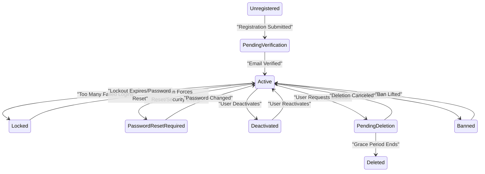
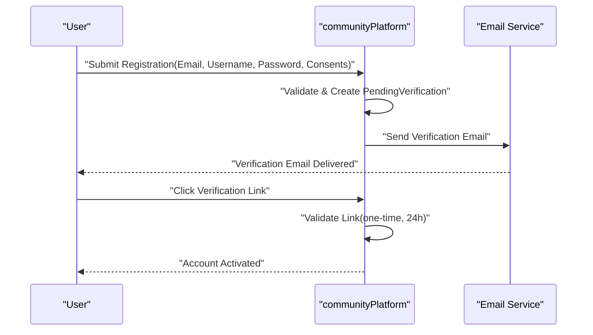
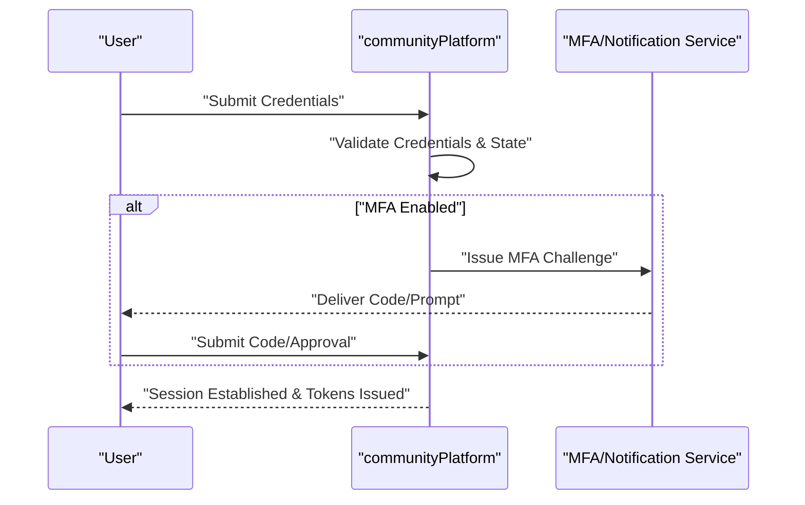
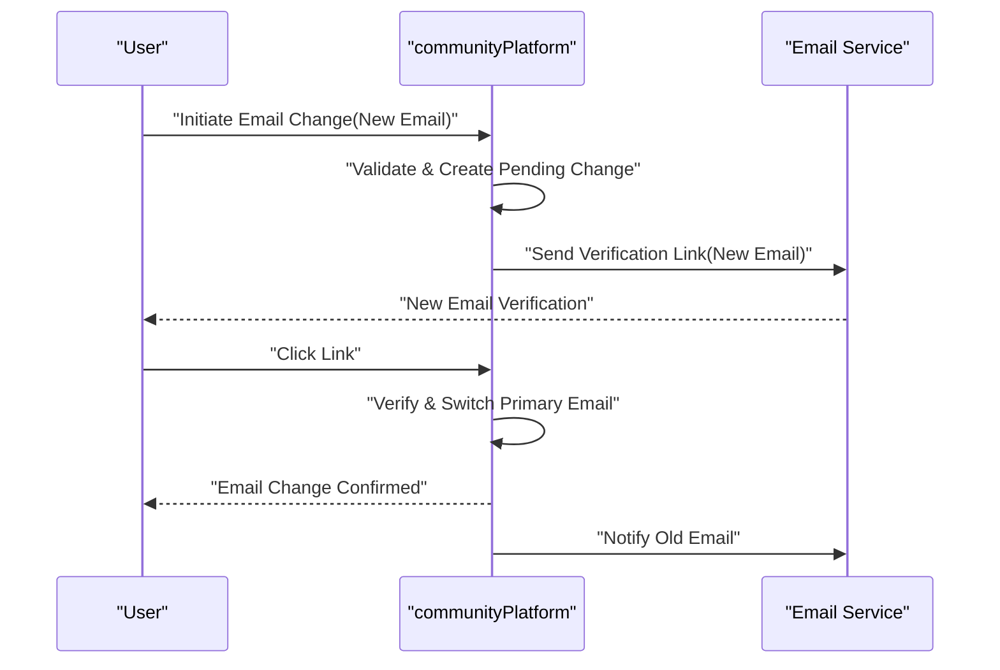
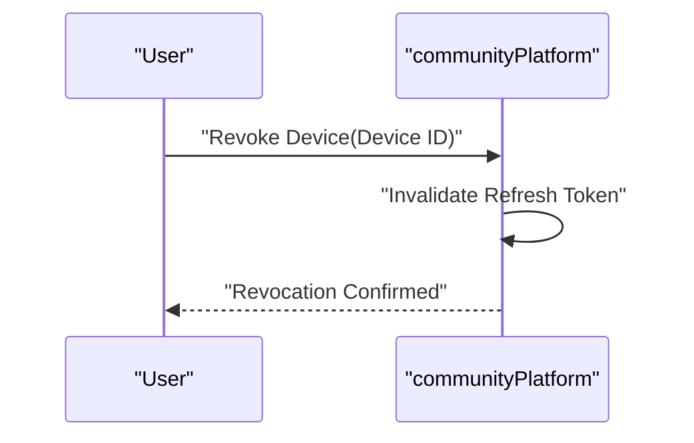

# communityPlatform Authentication and Account Lifecycle Requirements

This specification defines end-to-end business requirements for authentication and account lifecycle in communityPlatform, a Reddit-like community platform. It describes WHAT the system must do and deliberately avoids HOW to implement it. No API endpoints, database schemas, HTTP codes, vendor selections, or UI wireframes are prescribed. Requirements use EARS syntax for clarity and testability.

## Purpose and Scope
- Provide complete, testable business rules for registration, login, verification, password reset/change, email change, session and device management, suspicious activity detection, account deactivation/deletion, and administrative bans.
- Define account states and transitions and their business effects across the platform.
- Specify privacy, consent, localization/timezone handling, performance expectations, and auditability consistent with platform-wide policies.

Out of scope
- Technical architectures, API contracts, database design, cryptographic algorithms, infrastructure, or third-party provider choices.

## Definitions and Roles
- Account: A unique identity representing a user in communityPlatform.
- Session: A period during which a user’s authenticated state persists across requests/devices.
- Device: A logical identifier representing a client environment associated with a session.
- Verification: Confirming control of an email address by the account holder.
- MFA: Multi-Factor Authentication; optional step-up capability.
- Deactivation: Temporarily disabling an account while preserving data for reactivation.
- Deletion: Permanent removal/anonymization of personal data after a grace period.
- Legal Hold: A constraint that pauses deletion due to compliance or investigations.
- Roles: guestUser (unauthenticated), memberUser (authenticated), communityOwner and communityModerator (community-scoped powers in addition to memberUser), adminUser (platform-wide governance). See User Roles and Permissions for full details.

## Account States and Transitions
State list (conceptual):
- Unregistered
- PendingVerification
- Active
- Locked (temporary security lockout)
- PasswordResetRequired
- Deactivated
- PendingDeletion (grace period)
- Deleted (final)
- Banned (administrative enforcement)

State semantics (business effects):
- PendingVerification: Sign-in permitted with restricted capabilities; posting/commenting/voting disabled until email is verified.
- Active: Full platform access per role permissions.
- Locked: Authentication attempts blocked except recovery flows; lockout expires or resets via password reset.
- PasswordResetRequired: Must change password before continuing to use the platform.
- Deactivated: Profile hidden; participation disabled; reactivation available by login and explicit confirm.
- PendingDeletion: Same as Deactivated; irreversible deletion scheduled after grace period unless canceled.
- Deleted: Identity removed/anonymized; public content handling per data governance (e.g., author shown as "[deleted]").
- Banned: Access fully revoked; appeal path governed by safety policy.

State diagram


## Core Functional Requirements (EARS)

### Registration and Onboarding
Business rules and validations
- THE platform SHALL require a unique email address (case-insensitive) and a unique username (case-insensitive, 3–20 characters, letters, numbers, underscores only).
- THE platform SHALL require a password meeting strength rules: 8–64 characters, at least one letter and one number, and SHALL reject passwords found in a commonly breached list.
- THE platform SHALL require acceptance of Terms of Service and Privacy Policy at registration with timestamps.
- WHERE marketing communications consent is offered, THE platform SHALL record explicit opt-in with timestamp and source.
- WHERE age gating applies, THE platform SHALL collect affirmative confirmation that the user meets minimum age requirements.

Event-driven behaviors
- WHEN a guestUser submits valid registration details and required consents, THE platform SHALL create an account in "PendingVerification" and SHALL dispatch a verification email within 10 seconds.
- WHEN duplicates for email or username exist, THE platform SHALL reject registration and SHALL indicate which field(s) conflict.
- WHEN password or username format is invalid, THE platform SHALL reject registration and SHALL specify violated rule(s).
- WHEN in "PendingVerification" and the user requests resending verification, THE platform SHALL allow once every 5 minutes and no more than 5 per 24 hours.

Abuse controls
- IF automated/abusive signup is suspected, THEN THE platform SHALL require an additional challenge step or temporarily block registration.
- WHERE bot risk is high, THE platform SHALL impose stricter velocity limits for repeated registrations from the same network.

Optional
- WHERE MFA enrollment is enabled, THE platform SHALL offer enrollment immediately after first successful verification.

### Login and Logout
Business rules
- THE platform SHALL allow login using email or username plus password for accounts in "Active" state.
- THE platform SHALL deny login for accounts in "Locked", "Deactivated", "PendingDeletion", "Deleted", or "Banned" with state-appropriate guidance.
- THE platform SHALL maintain per-account and per-source rate limits for failed logins.

Event-driven behaviors
- WHEN a memberUser submits valid credentials, THE platform SHALL establish an authenticated session and SHALL issue session tokens within 2 seconds for 95% of attempts under normal load.
- WHEN MFA is enabled, THE platform SHALL require successful second factor completion before establishing the session.
- WHEN credentials are invalid, THE platform SHALL reject login without disclosing whether the email/username exists.
- WHEN a memberUser logs out, THE platform SHALL terminate the current session and SHALL prevent further use of that session.
- WHEN a memberUser requests "logout from all devices", THE platform SHALL terminate all active sessions for that account within 60 seconds.

Abuse controls and notifications
- IF 10 failed logins occur within 15 minutes, THEN THE platform SHALL place the account in "Locked" for 15 minutes and SHALL notify the account email of the lock event.
- IF a successful login occurs from a new device or new location, THEN THE platform SHALL notify the account email within 60 seconds.

Optional
- WHERE "remember this device" is enabled, THE platform SHALL suppress MFA challenges on that device for 30 days.

### Email Verification
Business rules
- THE platform SHALL require email verification before enabling posting, commenting, and voting.
- THE platform SHALL make verification links one-time use and SHALL expire them after 24 hours.

Event-driven behaviors
- WHEN a user follows a valid verification link, THE platform SHALL mark the email as verified and SHALL transition the account to "Active" within 5 seconds.
- WHEN a user follows an expired or already-used link, THE platform SHALL inform the user and SHALL offer resending a new verification message if appropriate.

Abuse controls
- IF a verification message bounces permanently, THEN THE platform SHALL invalidate the verification link and SHALL prompt the user to update the email address.

### Password Reset and Change
Business rules
- THE platform SHALL allow any user to request a password reset by providing their email address.
- THE platform SHALL treat non-existent email addresses indistinguishably by acknowledging the request without confirming existence.
- THE platform SHALL make password reset links one-time use and SHALL expire them after 60 minutes.
- THE platform SHALL require the new password to meet strength rules and SHALL prevent reuse of the last 5 passwords.

Event-driven behaviors
- WHEN a user requests a password reset, THE platform SHALL send a reset email within 10 seconds if the email corresponds to an account not in "Deleted" or "Banned".
- WHEN a user follows a valid reset link and submits a compliant new password, THE platform SHALL set the new password and SHALL revoke all active sessions within 60 seconds.
- WHEN a logged-in memberUser changes password, THE platform SHALL require the current password and SHALL apply the new password immediately upon validation.

Abuse controls
- IF multiple password reset requests are made for the same account, THEN THE platform SHALL honor only the most recent valid request and SHALL invalidate prior tokens.
- IF a reset link is used after expiration, THEN THE platform SHALL reject it and SHALL offer initiation of a new reset.

Optional
- WHERE high-risk activity is detected, THE platform SHALL place the account in "PasswordResetRequired" and SHALL force a password change at next login.

### Email Address Management (Change Email)
Business rules
- THE platform SHALL allow a logged-in memberUser to change the primary email address.
- THE platform SHALL require verification of the new email via a one-time link valid for 24 hours.
- THE platform SHALL notify the old email address of the change request immediately and upon completion.
- THE platform SHALL prevent changing to an email already in use by another account.

Event-driven behaviors
- WHEN a user initiates an email change, THE platform SHALL set a pending state and SHALL continue using the old email until the new email is verified.
- WHEN the new email is verified, THE platform SHALL switch the primary email and SHALL invalidate the pending token.
- IF the new email is not verified within 24 hours, THEN THE platform SHALL cancel the change and retain the original email unchanged.

Security and abuse controls
- WHERE suspicious activity is detected around email change (e.g., recent lockout), THE platform SHALL require step-up verification before allowing the change.

### Username Management
- THE platform SHALL treat username as immutable after creation.
- WHERE a safety or legal policy requires a change, THE platform SHALL allow adminUser to enforce a rename with audit logging and user notification.

### Session and Device Management
Business rules
- THE platform SHALL issue access tokens with a validity of 20 minutes and refresh tokens with a validity of 14 days.
- THE platform SHALL implement a sliding window for refresh tokens such that refresh extends session availability up to the refresh token’s expiry.
- THE platform SHALL associate each refresh token to a specific device context and SHALL allow per-device revocation.
- THE platform SHALL present to the memberUser a list of active devices including a device label, approximate location (city-level where permissible), and last activity timestamp.
- THE platform SHALL expire inactive sessions after 30 days of inactivity.

Event-driven behaviors
- WHEN an access token expires, THE platform SHALL require a valid refresh token to obtain a new access token.
- WHEN a memberUser revokes a specific device, THE platform SHALL invalidate that device’s refresh token immediately and SHALL end its sessions within 60 seconds.
- WHEN a memberUser renames a device label, THE platform SHALL update the label for future reference without affecting the session.
- WHEN concurrent refresh attempts from distinct locations are detected for the same device context, THE platform SHALL revoke the refresh token and SHALL require re-authentication.

Abuse controls
- IF a refresh token is used after revocation, THEN THE platform SHALL deny the attempt and SHALL notify the account email of suspicious activity within 60 seconds.
- IF concurrent refresh attempts suggest token theft, THEN THE platform SHALL revoke all refresh tokens and SHALL require re-authentication on all devices.

Optional
- WHERE enterprise or advanced controls are enabled in the future, THE platform SHALL allow administrators to set organization-level session durations and device restrictions.

### Suspicious Activity Detection and Response
- THE platform SHALL detect suspicious patterns such as unusual device/location combos, rapid credential attempts, and atypical session behavior.
- WHEN suspicious activity is detected, THE platform SHALL apply step-up verification or temporary holds that restrict sensitive actions until resolved.
- WHERE account takeover is suspected, THE platform SHALL force logout of all sessions, set "PasswordResetRequired", and notify the user with recovery instructions.

### Account Deactivation and Deletion
Business rules
- THE platform SHALL allow a logged-in memberUser to deactivate their account; reactivation requires login and explicit confirmation.
- THE platform SHALL allow a logged-in memberUser to request deletion, SHALL enter "PendingDeletion" with a 30-day grace period, and SHALL finalize deletion at the end of the period.
- THE platform SHALL remove personal profile data upon final deletion and SHALL preserve public content per data governance while attributing to an anonymized identity (e.g., "[deleted]").
- THE platform SHALL allow a memberUser to cancel deletion during the grace period.

Event-driven behaviors
- WHEN a memberUser deactivates, THE platform SHALL end all active sessions and SHALL hide the profile from public view.
- WHEN a memberUser reactivates, THE platform SHALL restore the account to "Active" and SHALL require email verification if it is not current.
- WHEN deletion is finalized, THE platform SHALL end all remaining sessions, SHALL remove personal data, and SHALL send a final confirmation to the registered email where permissible.

Constraints
- IF an account is under administrative hold due to investigations, THEN THE platform SHALL block deletion until the hold is released and SHALL inform the user of limited availability of deletion.
- IF an account is "Banned", THEN THE platform SHALL disallow self-service reactivation and deletion; requests are processed by adminUser per policy.

### Abuse Prevention and Rate Limiting
Business defaults (illustrative; communities may set stricter values)
- THE platform SHALL limit registration attempts to 5 per IP per hour and 2 per email per day.
- THE platform SHALL limit login attempts to 10 failures per account per 15 minutes and 50 failures per IP per hour.
- THE platform SHALL limit verification resend to once per 5 minutes and 5 per day.
- THE platform SHALL limit password reset requests to 3 per account per hour and 10 per IP per hour.

Runtime behaviors
- WHEN rate limits are exceeded, THE platform SHALL delay or block subsequent attempts for the limit window and SHALL communicate retry guidance.
- WHEN abuse is detected post hoc, THE platform SHALL invalidate impacted sessions and SHALL require step-up verification.

### Privacy, Consent, and Localization
- THE platform SHALL record timestamps and versions of accepted Terms of Service and Privacy Policy at registration and upon re-consent.
- THE platform SHALL provide controls to withdraw marketing consent without affecting service emails.
- THE platform SHALL minimize data collection to only what is necessary for authentication and account lifecycle.
- WHEN legal texts change materially, THE platform SHALL require re-consent at next sign-in before restoring "Active" capabilities.
- WHEN a user requests data export or erasure, THE platform SHALL route the request into data governance processes.
- THE platform SHALL localize user-facing messages and emails to the user’s selected language (default en-US) and SHALL display times in the user’s timezone.

## Error and Recovery Behaviors (Business Semantics)
- THE platform SHALL present user-understandable, localized messages that describe what happened and any required action.
- WHEN an operation is blocked by state (e.g., login while Deactivated), THE platform SHALL indicate the state and provide recovery options (reactivate, contact support, or wait for lockout expiry).
- WHEN rate limits are hit, THE platform SHALL provide a remaining time estimate or retry-after guidance.
- WHEN a sensitive action completes (password changed, email changed, session revoked, new device login), THE platform SHALL send a security notification to the primary email within 60 seconds.
- Error categories and phrasing SHALL align with the Exception Handling and Error Model.

## Performance and Responsiveness Expectations
Targets (server-side processing under normal load)
- Registration creation and verification dispatch: within 10 seconds for 95% of requests.
- Login session establishment: within 2 seconds for 95% of requests.
- Listing active sessions: within 2 seconds for 95% of requests.
- Logout-all completion: within 60 seconds.
- Rate-limits and lockouts: enforced in real time.

## Auditability, Observability, and Security Expectations
- THE platform SHALL record auditable events for registration, verification sent/success/failure, login success/failure, lockout, password reset requested/success, password change, email change requested/completed, session created/revoked, logout-all, deactivation, reactivation, deletion requested/canceled/finalized, admin ban/unban, admin-forced password reset.
- THE platform SHALL retain audit logs for at least 180 days unless superseded by legal requirements.
- THE platform SHALL protect tokens and session identifiers from disclosure and SHALL store passwords in a non-reversible format.
- THE platform SHALL prevent user enumeration by providing indistinguishable responses where applicable (e.g., login failure, password reset request).
- THE platform SHALL provide administrators with search and filter capabilities over audit events for investigations while respecting least-privilege access.

## Localization, Timezone, and Accessibility Considerations
- THE platform SHALL localize all user-facing messages and emails to the user’s selected language, defaulting to English when undetermined.
- THE platform SHALL display times in the user’s selected timezone and SHALL include clear relative and absolute time expressions where appropriate.
- THE platform SHALL ensure security emails include clear subject lines, event descriptions, and support links.
- THE platform SHALL ensure error and success messages are accessible and perceivable by assistive technologies.

## Success Criteria and KPIs (Auth-related)
- Verification completion rate: > 90% of new accounts verify within 24 hours.
- Login success rate: > 95% for users entering valid credentials.
- Confirmed account takeover rate: < 0.1% of accounts per month.
- Average time to logout-all completion: < 30 seconds median, < 60 seconds p95.
- Rate-limit false-positive rate: < 1% of legitimate users per day.
- Email change completion rate (when initiated legitimately): > 95% within 24 hours.

## Mermaid Sequence Flows

Registration and Verification


Login with Optional MFA


Password Reset
```mermaid
sequenceDiagram
  participant U as "User"
  participant P as "communityPlatform"
  participant E as "Email Service"
  U->>P: "Request Password Reset(Email)"
  P->>P: "Issue One-Time 60m Reset Link"
  P->>E: "Send Reset Email"
  E-->>U: "Reset Email Delivered"
  U->>P: "Open Link & Submit New Password"
  P->>P: "Validate & Set Password; Revoke Sessions"
  P-->>U: "Password Reset Successful"
```

Email Change


Device Revocation


## Related Documents
- User Roles and Permissions Specification
- Community and Moderation Rules Requirements
- Posting and Content Requirements
- Voting and Karma System Requirements
- Commenting and Nested Replies Requirements
- Feed Sorting and Discovery Requirements
- User Profiles and Subscriptions Requirements
- Reporting, Safety, and Trust Requirements
- Nonfunctional Requirements and Service Expectations
- Exception Handling and Error Model
- Data Lifecycle and Governance Requirements

---
This specification focuses on business requirements only and grants full autonomy to developers for implementation details. It describes what the system must do, not how to build it.