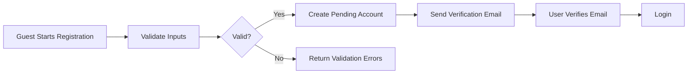
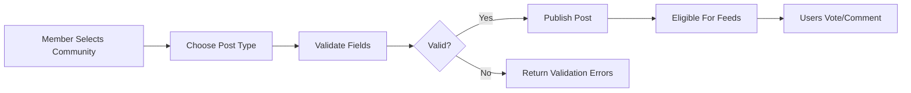
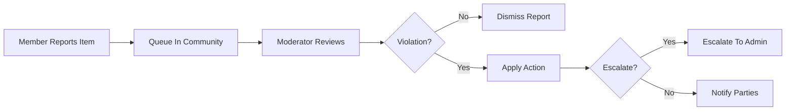
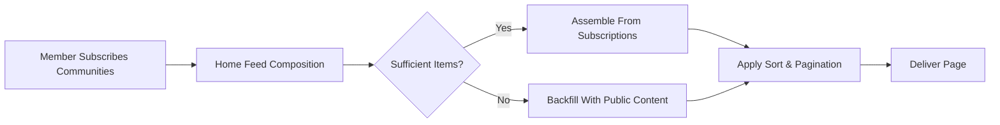

# communityPlatform — User Personas and Primary Scenarios

This document defines the target user personas and end-to-end business scenarios for a Reddit-like community service. It focuses on real-world workflows and acceptance criteria for backend developers. All content is business requirements in natural language, not UI design or technical implementation. EARS keywords are kept in English; all descriptions use en-US.

## User Personas

### Guest (Unauthenticated Visitor)
- Role summary: Can browse public communities and content, view user profiles with limited information, read comments, view aggregated feeds of public posts, and initiate registration or login. Cannot create or interact with content beyond viewing.
- Goals
  - Discover interesting communities and content without friction.
  - Evaluate platform value before registering.
- Behaviors
  - Browses home feed (public content only) and specific community feeds.
  - Attempts to follow links to detailed content and author profiles.
- Success indicators
  - Can access public content without error.
  - Clear call to register when interacting is attempted.

### Member (Registered User)
- Role summary: Authenticated user who can create communities, subscribe/unsubscribe, create posts (text/link/image), upvote/downvote posts and comments, comment with nested replies, report inappropriate content, and manage personal notification preferences.
- Goals
  - Share content and engage in discussions.
  - Curate a personalized feed by subscribing to communities.
  - Build reputation via karma.
- Behaviors
  - Subscribes to communities, posts, comments, votes, reports.
  - Adjusts preferences for notifications and content policy flags.
- Success indicators
  - Seamless creation and interaction with content.
  - Feeds reflect subscriptions and sorting options.

### Moderator (Community-Level Role of Member)
- Role summary: A Member designated as a moderator for specific communities. Can review reported content within those communities, enforce community rules, take moderation actions (e.g., remove content, warn, or temporarily restrict contributors) per business policies.
- Goals
  - Maintain healthy discussions and enforce community rules consistently.
  - Resolve reports efficiently and transparently.
- Behaviors
  - Reviews a moderation queue, applies actions with reasons, communicates outcomes.
- Success indicators
  - Reports are resolved within defined timeframes.
  - Community rule violations are reduced and repeat offenders identified.

### Administrator (Platform Admin)
- Role summary: Platform-level administrator. Manages users, communities, reported content escalations, platform-wide policies, and enforcement. Can apply sanctions that span all communities.
- Goals
  - Ensure platform safety and policy compliance.
  - Support moderators with escalations and appeals.
- Behaviors
  - Reviews escalations, audits decisions, applies sanctions consistent with policy.
- Success indicators
  - Timely resolution of escalations and consistent policy application.

### Behavioral Archetypes (Cross-Cutting)
- Lurker: Reads extensively, seldom posts or comments. Primary needs are discovery and quality sorting.
- New Contributor: Recently registered; needs gentle onboarding, clear validation messages, and transparent rules.
- Power User: High-frequency poster/commenter/voter; needs responsive performance and predictable rate limits.
- Community Builder: Creates and moderates communities; needs robust creation and governance flows.

## Primary Success Scenarios

The following scenarios describe the expected end-to-end outcomes with business rules and success criteria. Performance windows are expressed from a user-perceived standpoint.

### 1) Registration, Email Verification, and Login
- Narrative
  1. Guest initiates registration by providing required attributes (email and password) and consents.
  2. System validates inputs and creates a pending account.
  3. System dispatches a verification email and marks the account as unverified.
  4. User verifies email via a verification action.
  5. User logs in and accesses a personalized experience.
- Key business rules
  - Email must be unique across active accounts.
  - Password must meet minimum complexity policy.
  - Unverified accounts cannot create content or vote.
- Mermaid — Registration Flow

### 2) Community Creation and Initial Setup
- Narrative
  1. Member initiates community creation by proposing a unique name, description, and optional settings.
  2. System validates name, uniqueness, and reserved words policy.
  3. System creates the community; the creator becomes owner and initial moderator.
  4. Owner may add additional moderators and publish community rules.
- Key business rules
  - Community names must be unique and meet naming policy (length and allowed characters).
  - Community owner is a moderator by default.

### 3) Subscribing/Unsubscribing to Communities
- Narrative
  1. Member views a community and subscribes.
  2. System updates subscription list and adjusts home feed composition.
  3. Member may unsubscribe at any time.
- Key business rules
  - Subscriptions adjust home feed composition immediately for subsequent page loads.
  - Subscription is not required to post in a public community unless the community sets stricter posting rules.

### 4) Posting Content (Text/Link/Image)
- Narrative
  1. Member selects a target community and post type (text, link, or image).
  2. System validates title and type-specific fields.
  3. On success, the post becomes visible in the target community feed and eligible for ranking.
- Key business rules
  - Title required, with measurable length limits.
  - Text body optional for text posts; link must be a valid URL for link posts; image must meet file size/type constraints for image posts.
  - Optional policy flags (NSFW/Spoiler) influence visibility by preference.
- Mermaid — Posting and Voting Overview

### 5) Commenting and Nested Replies
- Narrative
  1. Member opens a post and writes a comment.
  2. System validates comment content and associates it to the post.
  3. Other members may reply to the comment, forming nested threads.
- Key business rules
  - Nested replies are allowed up to a defined maximum depth.
  - Comments can be edited or deleted within defined windows; deletions leave tombstones preserving thread readability.

### 6) Voting on Posts and Comments
- Narrative
  1. Member casts an upvote or downvote on a post or comment.
  2. System records the vote and adjusts the item’s aggregate score and user karma implications.
- Key business rules
  - A user can have at most one active vote per item, which can be changed or cleared.
  - Vote rate limiting applies to prevent abuse.

### 7) Browsing and Sorting Feeds (Hot/New/Top/Controversial)
- Narrative
  1. User opens a community or home feed.
  2. User selects a sort mode.
  3. System returns a page of results according to sort definition and pagination policy.
- Key business rules
  - Supported sorts: hot, new, top, controversial.
  - Page size is consistent across feeds unless overridden by user preference within policy limits.

### 8) Viewing User Profiles and Karma
- Narrative
  1. User views a member’s profile.
  2. System displays public profile fields, recent posts and comments, and karma totals.
  3. Profile owner can see private fields and adjust privacy settings.
- Key business rules
  - Karma reflects contributions from posts and comments based on community feedback.
  - Block/Hide rules restrict visibility between specific users as configured.

### 9) Reporting Inappropriate Content
- Narrative
  1. Member initiates a report on a post or comment with a selected reason and optional notes.
  2. System records the report and queues the item for moderator review in its community.
- Key business rules
  - Duplicate reports from the same member on the same item are deduplicated.
  - Certain reasons may trigger higher priority or expedited handling.

### 10) Moderator Review and Action on Reports
- Narrative
  1. Moderator opens the community’s moderation queue.
  2. Moderator reviews reported items, history, and report reasons.
  3. Moderator applies an action: dismiss, remove content, warn user, or temporarily restrict user.
- Key business rules
  - All actions require a reason recorded for audit.
  - Actions are reversible where policy allows; appeals escalate beyond moderator level.
- Mermaid — Reporting and Moderation Flow

### 11) Admin Oversight and Escalation Handling
- Narrative
  1. Admin reviews escalated items and context.
  2. Admin applies platform-wide actions where necessary.
- Key business rules
  - Admin actions supersede moderator actions and are logged for audit.

### 12) Daily Engagement Home Feed Loop
- Narrative
  1. Member opens the home feed, composed from subscribed communities with potential global/public content when subscriptions are sparse.
  2. Member scrolls through pages, interacts (votes/comments), and navigates into communities.
  3. System maintains sort choice consistency during the session and remembers preferences per policy.
- Mermaid — Subscriptions and Feed Composition

### 13) Notifications (Business-Level Triggers Only)
- Narrative
  1. System triggers notifications on replies, mentions, moderation actions, and subscription changes, subject to user preferences.
- Key business rules
  - Users can opt-in/out and choose frequency per channel.

## Alternative and Edge Scenarios

- Registration and Login
  - Invalid email format or duplicate email: system rejects with specific validation messages.
  - Verification expired or invalid: system provides a safe re-verification path.
  - Password complexity not met: system rejects with policy-specific guidance.
- Community Creation
  - Duplicate community name or reserved keyword: creation is refused with guidance to choose a different name.
  - Excessive creation attempts: community creation rate limited with cooling-off messaging.
  - Owner transfer and deactivation policies are respected when ownership changes or community is deactivated.
- Posting (Text/Link/Image)
  - Title missing/too short/too long: rejected with exact length constraints stated.
  - Link unreachable/unsupported scheme/blocked domain: rejected with reason.
  - Image over size/type limit or suspected malware: rejected with reason; safe failure without data retention.
  - NSFW/Spoiler flags propagate to feeds; users with stricter preferences do not see flagged content.
  - Posting in restricted communities requires role/tenure; otherwise rejected with reason.
- Commenting and Threads
  - Reply exceeds maximum depth: rejected with guidance to continue at a higher level.
  - Comment edited/deleted outside allowed window: rejected; deletions after window may be moderator-only.
  - Collapsing behavior for very long threads is applied at the business level for readability.
- Voting
  - Multiple votes by the same user on the same item: last action wins; one active vote state per item.
  - Rapid voting bursts trigger soft rate limits with user-facing cool-down messages.
  - Self-voting policy: allowed or disallowed per business rule; if disallowed, reject with message.
- Sorting and Feeds
  - Hot/New/Top/Controversial definitions determine ordering; ties are deterministic using secondary keys.
  - Pagination uses consistent page size; requests beyond available pages return empty results without error.
- Profiles and Karma
  - Viewing blocked user profile: limited visibility; user informed per policy without revealing private data.
  - Karma accrual/decay adheres to business rules; karma cannot be directly edited by users.
- Reporting and Moderation
  - Duplicate reports from the same member merged; report spamming rate-limited.
  - Moderator conflict of interest (report about own content): flagged for peer review or auto-escalation.
  - Appeals respected; users can view appeal status.
- Administrative
  - Banned or suspended users receive clear reasons and durations; actions are proportionate and auditable.
  - Community deactivation hides content from discovery but preserves data according to retention policy.

## Acceptance Criteria (Business-Level)

The following EARS requirements define measurable, testable outcomes. Times are end-to-end user-perceived unless stated.

### Registration and Login
- WHEN a guest submits valid registration data, THE platform SHALL create a pending account and send a verification email within 10 seconds.
- IF registration data is invalid, THEN THE platform SHALL return field-specific validation errors indicating the violated rule.
- WHEN a user verifies their email via a valid token, THE platform SHALL activate the account immediately and permit login.
- IF a verification token is expired or invalid, THEN THE platform SHALL reject verification and offer a re-verification path.
- WHEN a user submits correct login credentials, THE platform SHALL establish an authenticated session within 2 seconds.
- IF login fails due to invalid credentials, THEN THE platform SHALL deny access with a generic failure message without revealing which field failed.

### Community Creation
- WHEN a member submits a community name and required fields that satisfy policy, THE platform SHALL create the community and assign the creator as owner and moderator within 2 seconds.
- IF the proposed community name is already taken or violates naming policy, THEN THE platform SHALL reject creation with a specific reason.
- WHERE community creation limits are exceeded, THE platform SHALL enforce rate limits and inform the user of the earliest time to retry.

### Subscriptions and Home Feed
- WHEN a member subscribes to a community, THE platform SHALL add it to the member’s subscription list and include it in home feed composition for subsequent loads within 2 seconds.
- WHEN a member unsubscribes from a community, THE platform SHALL remove it from the subscription list and exclude it from home feed composition for subsequent loads.
- WHERE a member has too few subscriptions, THE platform SHALL backfill the home feed with public content according to policy.

### Posting
- WHEN a member submits a text post with valid title and optional body, THE platform SHALL publish it to the chosen community feed within 2 seconds.
- WHEN a member submits a link post with a valid URL, THE platform SHALL publish it and store the URL while enforcing blocked-domain policies.
- WHEN a member submits an image post meeting size and type constraints, THE platform SHALL publish it and mark any content flags as provided.
- IF a post fails validation, THEN THE platform SHALL reject it with specific error messages for each violating field.
- WHERE NSFW/Spoiler flags are set, THE platform SHALL restrict visibility to users whose preferences allow such content.

### Commenting and Threads
- WHEN a member submits a comment within allowed depth and content rules, THE platform SHALL publish it within 2 seconds and position it under the correct parent.
- IF a comment exceeds maximum nesting depth, THEN THE platform SHALL reject it with guidance to comment at a higher level.
- WHERE a comment is edited within the allowed window, THE platform SHALL update the content and retain an edit marker.
- WHEN a comment is deleted by its owner within allowed policy, THE platform SHALL replace it with a tombstone preserving thread structure.

### Voting
- WHEN a member casts an upvote or downvote on an item they have not voted on, THE platform SHALL record the vote and update the item’s score within 1 second.
- WHEN a member changes their vote state on an item, THE platform SHALL reflect the new state and score within 1 second.
- IF a member exceeds voting rate limits, THEN THE platform SHALL temporarily block voting and indicate the cool-down period.

### Sorting
- WHEN a user requests feed sorted by hot, THE platform SHALL return a page of items calculated per hot ranking policy within 2 seconds.
- WHEN a user requests feed sorted by new, THE platform SHALL return the newest items first within 2 seconds.
- WHEN a user requests feed sorted by top, THE platform SHALL return items ordered by total score for the selected time window within 2 seconds.
- WHEN a user requests feed sorted by controversial, THE platform SHALL return items with high disagreement per policy within 2 seconds.
- WHERE multiple items tie, THE platform SHALL apply deterministic tie-breakers to ensure stable ordering across requests.

### Profiles and Karma
- WHEN a user views a member profile, THE platform SHALL display public profile fields, recent posts and comments, and karma totals within 2 seconds.
- WHERE profile privacy is restricted, THE platform SHALL hide fields not visible to the viewer while indicating restricted visibility.
- WHEN votes accrue on a member’s content, THE platform SHALL update the member’s karma totals according to policy within a reasonable delay not exceeding 60 seconds.

### Reporting and Moderation
- WHEN a member reports an item with a valid reason, THE platform SHALL record the report and enqueue the item for moderation within 2 seconds.
- IF a member submits duplicate reports on the same item, THEN THE platform SHALL deduplicate and count a single active report from that member.
- WHEN a moderator resolves a report with an action, THE platform SHALL record the action, reason, and affected parties for audit within 2 seconds.
- WHERE a report requires escalation, THE platform SHALL route it to administrators and flag it for priority handling.

### Notifications (Business-Level)
- WHEN a user is mentioned or receives a reply, THE platform SHALL generate a notification subject to user preferences within 60 seconds.
- WHEN moderation actions affect a user’s content, THE platform SHALL notify the user of the action and reason, respecting privacy and policy.

### Performance and Pagination Expectations
- THE platform SHALL return feed and detail pages in pages of 20 items by default, unless user preference within allowed limits specifies otherwise.
- THE platform SHALL respond to interactive actions (login, vote, post, comment) within 1–2 seconds under normal load as specified above.
- WHERE a page request exceeds available items, THE platform SHALL return an empty result set without error.

### Error Handling and Recovery (User-Facing)
- IF input validation fails, THEN THE platform SHALL return explicit, field-level error messages stating the violated rule.
- IF a required resource is deactivated or removed, THEN THE platform SHALL present a not-available message without revealing sensitive details.
- IF a user is restricted from an action, THEN THE platform SHALL state the restriction and provide the earliest time or conditions to regain access.

## Glossary (Business Terms)
- Home Feed: Aggregated list of posts from communities a member subscribes to, optionally backfilled.
- Community: A user-created space with a unique name and its own rules and moderators.
- Karma: A reputation signal derived from community feedback on posts and comments.
- NSFW/Spoiler Flags: Content policy flags controlling visibility per user preferences.
- Tombstone: A placeholder indicating deleted content so thread readability is preserved.

## Non-Goals
- No UI, wireframes, or visual layouts.
- No API specifications, database schemas, or infrastructure details.
- No algorithmic formulas for ranking; only business-level definitions and expectations.