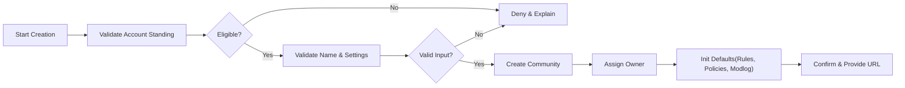
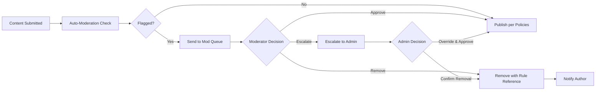
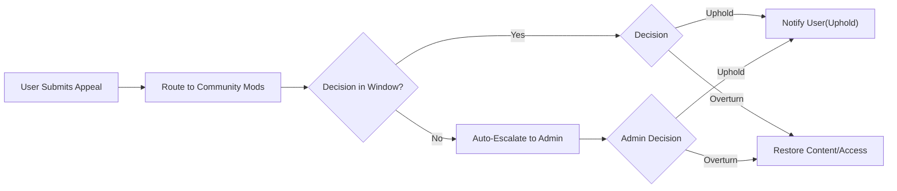

# 05 — communityPlatform — Community and Moderation Rules (Business Requirements)

This specification defines WHAT the community and moderation domain must achieve for communityPlatform, a Reddit-like service. Requirements use EARS format and avoid prescribing technical architectures, APIs, or data schemas. System user roles and scopes are referenced to ensure clear authorization boundaries.

## 1. Overview and Scope
- Purpose: Establish complete business rules for community creation and governance, moderator lifecycle, moderation actions and workflows, enforcement, escalation and appeals, transparency, and auditability.
- Scope: Applies to all communities hosted on communityPlatform. Community rules must align with sitewide policy; sitewide policy supersedes community rules where conflicts exist.
- Principle of autonomy and accountability: Communities are self-governed within platform guardrails. Admin intervention occurs when sitewide policy or law requires.
- Non-goal: No technical specifications (APIs, DB schemas, HTTP codes) are provided here.

## 2. Definitions and Role Context
- Community: A user-created space with its own name, description, rules, labels, moderators, and owner.
- Owner (communityOwner): The highest authority within a community, accountable for configuration, rules, and moderator management.
- Moderator (communityModerator): An appointed member who enforces community rules and manages content within a specific community.
- Member (memberUser): An authenticated user eligible to participate per community and platform rules.
- Guest (guestUser): An unauthenticated visitor. Read-only access to public content.
- Admin (adminUser): Sitewide trust & safety authority with override powers for policy and legal compliance.
- Enforcement Action: An action that changes content visibility or user participation (e.g., remove, lock, ban).
- Modlog: A community-scoped record of moderation and configuration actions.

## 3. Community Creation and Ownership
### 3.1 Eligibility and Limits
- THE communityPlatform SHALL allow memberUser accounts in good standing to create communities.
- WHERE an account is newly registered (account age < 24 hours) OR email is unverified, THE communityPlatform SHALL deny community creation until thresholds are met.
- WHERE platform-configured karma thresholds apply (e.g., total karma ≥ 50), THE communityPlatform SHALL enforce the threshold prior to community creation.
- WHERE per-account quotas apply (e.g., 3 communities per 30 days), THE communityPlatform SHALL enforce quotas and display remaining allowance.
- IF a user is sitewide suspended/banned, THEN THE communityPlatform SHALL prohibit community creation.

### 3.2 Naming, Identity, and Uniqueness
- THE communityPlatform SHALL require a globally-unique handle (e.g., "c/<handle>") and a display name.
- THE communityPlatform SHALL validate handles for allowed characters, length, non-reserved words, and non-impersonation of brands/people per policy.
- IF a naming conflict or restricted term is detected, THEN THE communityPlatform SHALL deny creation and indicate the conflict category.
- THE communityPlatform SHALL require a description and allow an extended rules/about section configurable post-creation.
- WHERE safety labels (e.g., NSFW) are relevant, THE communityPlatform SHALL require appropriate labels at creation with later updates allowed by Owner/Moderator.

### 3.3 Creation Workflow and Defaults
- WHEN a qualified memberUser submits valid inputs, THE communityPlatform SHALL:
  - Create the community in active state.
  - Assign ownership to the creator.
  - Initialize a rules template, default posting policy (open to members unless changed), zero moderators (besides Owner), and an empty ban list.
  - Record creation in the modlog.
- IF input validation fails, THEN THE communityPlatform SHALL present all violations with human-readable reasons.
- WHEN creation succeeds, THE communityPlatform SHALL provide the canonical community URL and identifiers to the Owner.

Mermaid — Community Creation Flow

### 3.4 Ownership Rights and Transfer
- THE communityPlatform SHALL grant Owners full community configuration rights within sitewide policy.
- WHEN ownership transfer is initiated by the Owner, THE communityPlatform SHALL require acceptance by the designated recipient within 7 days and record both request and acceptance.
- IF the recipient declines or does not respond within the window, THEN THE communityPlatform SHALL cancel the transfer and retain current ownership.
- WHERE an Owner is inactive or in violation of sitewide policy, THE communityPlatform SHALL allow adminUser to perform a forced ownership transfer with audit logging.

### 3.5 Community Deletion, Quarantine, and Abandonment
- WHEN an Owner requests deletion, THE communityPlatform SHALL place the community in pending deletion for 30 days and restrict new content creation during this window.
- IF deletion is canceled within the window, THEN THE communityPlatform SHALL restore full functionality.
- WHERE sitewide policy requires preservation, THE communityPlatform SHALL allow quarantine as an alternative to deletion and restrict discovery surfaces accordingly.
- WHERE a community has no active Owner or Moderator for 60 days, THE communityPlatform SHALL allow adminUser to appoint a successor Owner or close the community.

## 4. Community Settings and Policies
### 4.1 Visibility, Access, and Safety Labels
- THE communityPlatform SHALL support visibility modes: public, restricted (readable by all; post/comment limited), and private (membership approval required to read and participate).
- WHEN a community is labeled NSFW, THE communityPlatform SHALL apply age and preference gates consistently across feeds and profiles.
- WHEN visibility mode changes reduce access, THE communityPlatform SHALL notify subscribers using their notification preferences.

### 4.2 Posting Policies and Participation Rules
- THE communityPlatform SHALL allow communities to set who may submit posts and comments: anyone, subscribers only, approved members only.
- WHERE mandatory flairs/tags are configured, THE communityPlatform SHALL enforce their presence at submission.
- WHERE community rate limits are configured, THE communityPlatform SHALL enforce limits and communicate cooldown windows.
- WHERE specific content types are disallowed (e.g., images), THE communityPlatform SHALL block disallowed types at submission time.
- THE communityPlatform SHALL allow auto-archive windows (e.g., 180 days) after which posts lock automatically.

### 4.3 Language/Region Defaults
- THE communityPlatform SHALL allow Owners to set default language and region preferences to inform moderation and discovery.
- WHERE a default language is set, THE communityPlatform SHALL apply language-aware filters consistently.

### 4.4 Rule Publication and Transparency
- THE communityPlatform SHALL require communities to publish a clear rules list with titles, descriptions, and examples.
- WHEN rules are updated, THE communityPlatform SHALL version them, log changes in the modlog, and display the effective date.
- IF a rule conflicts with sitewide policy, THEN THE communityPlatform SHALL prevent publishing until conflict is resolved.

## 5. Auto-Moderation and Moderation Queues
### 5.1 Policy-Driven Filters
- THE communityPlatform SHALL allow communities to configure auto-moderation policies (keywords, domain allow/deny, minimum account age/karma, link limits).
- WHEN a submission violates auto-moderation policies, THE communityPlatform SHALL send it to held-for-review or reject with a rule reference per community configuration.
- WHERE auto-moderation rejects, THE communityPlatform SHALL inform the submitter with rule references and optional guidance.

### 5.2 Queue Behavior and Access
- THE communityPlatform SHALL present a community moderation queue containing new, reported, and held-for-review items.
- THE communityPlatform SHALL allow communityModerator/communityOwner to filter, sort, and bulk act within community-configured safeguards.
- THE communityPlatform SHALL record queue actions in the modlog with actor, action, targets, and reason codes.

### 5.3 Performance Expectations (Queues)
- THE communityPlatform SHALL load moderation queues within 2 seconds (p95) under normal conditions for up to 100 items.
- THE communityPlatform SHALL apply approve/remove/lock actions within 2 seconds (p95), reflecting state across feeds and profiles within 5 seconds.

Mermaid — Moderation Workflow

## 6. Moderator Appointment and Tenure
### 6.1 Appointment and Acceptance
- THE communityPlatform SHALL allow Owners to appoint Moderators by inviting eligible memberUsers.
- WHEN appointed, THE communityPlatform SHALL notify the appointee and require acceptance within 7 days.
- IF the appointee declines or fails to respond, THEN THE communityPlatform SHALL cancel the appointment and record the outcome.

### 6.2 Tiered Roles and Scope
- THE communityPlatform SHALL support tiered moderator capabilities (e.g., junior moderator limited to queue triage; full moderator with sanction powers) configured by the Owner.
- THE communityPlatform SHALL restrict moderator powers strictly to their assigned community.
- WHILE a user holds moderator role, THE communityPlatform SHALL display a role indicator on their official actions where appropriate.

### 6.3 Removal and Overrides
- THE communityPlatform SHALL allow Owners to remove Moderators at any time with modlog recording.
- THE communityPlatform SHALL allow Moderators to resign.
- THE communityPlatform SHALL allow adminUser to remove or suspend a Moderator or Owner for policy violations or inactivity with audit logging.

### 6.4 Conflict of Interest Safeguards
- WHERE a moderator attempts to enforce on their own content, THE communityPlatform SHALL require an additional moderator or Owner to confirm the action before finalization.
- WHERE no alternate moderator is available, THE communityPlatform SHALL route the action to adminUser for review.

## 7. Moderation Actions and User Sanctions
### 7.1 Action Catalog
- Approve content (post/comment)
- Remove content (post/comment) with rule reference
- Lock/Unlock thread
- Sticky/Unpin post
- Apply/Remove flair or required tags
- User-level sanctions: warn, mute (temporary), ban (temporary or permanent), approve-list (allowlist), restrict posting rate
- Restore content where policy allows

### 7.2 EARS Requirements for Actions
- WHEN a Moderator approves content, THE communityPlatform SHALL mark it visible and remove it from moderation queues.
- WHEN a Moderator removes content, THE communityPlatform SHALL set state to "Removed by Moderation" and require selection of rule references.
- WHEN an Owner/Moderator locks a thread, THE communityPlatform SHALL prevent new comments and vote changes while preserving visibility.
- WHEN a Moderator issues a user warning, THE communityPlatform SHALL notify the user with rule references and log the action.
- WHERE a temporary ban is applied, THE communityPlatform SHALL enforce participation restrictions for the duration and auto-lift at expiry.
- WHERE a user is on approve-list, THE communityPlatform SHALL bypass configured rate limits for that user where allowed.

### 7.3 Evidence, Rationale, and Notifications
- THE communityPlatform SHALL require categorical reasons and optional notes for removals, locks, and bans.
- THE communityPlatform SHALL notify affected users (author or sanctioned user) with action details and available appeal paths.
- THE communityPlatform SHALL preserve immutable records of rationale and actor in the modlog.

### 7.4 State Propagation and Timeliness
- THE communityPlatform SHALL reflect moderation state changes in feeds, profiles, and activity views within 5 seconds under normal load.

## 8. Rule Violations, Severity, and Enforcement Ladder
### 8.1 Categories and Severity
Categories may include spam/manipulation, harassment/hate, sexual content and minors safety, violence/threats, self-harm risk, doxxing/privacy, illegal content, misinformation (as defined), and off-topic/low-quality.

- WHEN minor violations occur, THE communityPlatform SHALL remove the content and issue a warning with guidance.
- WHEN moderate violations occur (e.g., repeat within 30 days), THE communityPlatform SHALL apply a temporary ban aligned with community policy.
- WHEN severe violations occur (e.g., illegal content, child safety), THE communityPlatform SHALL immediately remove from public visibility, restrict the account, and escalate to adminUser.

### 8.2 Enforcement Ladder
- Warn → Temporary Mute → Temporary Ban → Permanent Ban
- THE communityPlatform SHALL support duration presets (24h, 7d, 30d) and custom durations within policy bounds.
- WHEN a duration elapses, THE communityPlatform SHALL automatically lift restrictions and notify the user.

### 8.3 Cross-Posting and Propagation
- WHERE content is cross-posted, THE communityPlatform SHALL treat each destination as a distinct moderation context.
- WHERE source content is removed by platform policy, THE communityPlatform SHALL evaluate removing or quarantining cross-posts and record linked decisions in modlogs.

### 8.4 Quarantine Behavior
- WHEN a community is quarantined by adminUser, THE communityPlatform SHALL restrict discovery surfaces and display a quarantine notice prior to entry.

## 9. Appeals and Escalations
### 9.1 Eligibility and Submission Windows
- THE communityPlatform SHALL allow authors and sanctioned users to appeal moderation decisions that affect them unless non-appealable per sitewide policy (e.g., illegal content).
- THE communityPlatform SHALL set a default appeal window of 14 days from notification.

### 9.2 Appeal Flow and SLAs
Mermaid — Appeals Workflow

- WHEN an appeal is submitted, THE communityPlatform SHALL acknowledge receipt immediately and provide the expected decision window.
- WHERE a community does not respond within the window (e.g., 7 days), THE communityPlatform SHALL auto-escalate to adminUser.
- WHEN an appeal is overturned, THE communityPlatform SHALL restore content/access, annotate modlogs, and notify affected parties.
- WHERE retaliation risk exists, THE communityPlatform SHALL restrict immediate reapplication of the same enforcement absent new evidence.

## 10. Permission Matrix (Business-Level)
| Action | guestUser | memberUser | communityModerator | communityOwner | adminUser |
|--------|-----------|------------|--------------------|----------------|-----------|
| View public community | ✅ | ✅ | ✅ | ✅ | ✅ |
| View private community | ❌ | WHERE approved: ✅ | WHERE approved: ✅ | ✅ | ✅ |
| Subscribe to community | ❌ | ✅ | ✅ | ✅ | ✅ |
| Create community | ❌ | WHERE thresholds met: ✅ | ✅ (as member) | ✅ (as member) | ✅ |
| Edit community settings | ❌ | ❌ | WHERE tier permits: ✅ | ✅ | ✅ |
| Define/update community rules | ❌ | ❌ | ✅ | ✅ | ✅ |
| Appoint/remove moderators | ❌ | ❌ | ❌ | ✅ | ✅ |
| Transfer ownership | ❌ | ❌ | ❌ | ✅ | ✅ (force) |
| Approve/remove content | ❌ | ❌ | ✅ | ✅ | ✅ |
| Lock/unlock threads | ❌ | ❌ | ✅ | ✅ | ✅ |
| Pin/unpin posts | ❌ | ❌ | ✅ | ✅ | ✅ |
| Apply user sanctions | ❌ | ❌ | ✅ | ✅ | ✅ |
| View community modlog (sanitized) | ✅ | ✅ | ✅ | ✅ | ✅ |
| View full audit log | ❌ | ❌ | ❌ | ❌ | ✅ |
| Delete community | ❌ | ❌ | ❌ | WHERE allowed: ✅ | ✅ |

Notes:
- "WHERE thresholds met" includes account age, verification, and karma. "WHERE tier permits" refers to Owner-defined moderator tiers.
- Admin overrides are reserved for safety, policy, and legal compliance and are always audited.

## 11. Error Handling and Edge Cases
- IF a non-eligible user attempts to create a community, THEN THE communityPlatform SHALL deny with specific reasons (e.g., account age, karma, quota, sanctions).
- IF a user attempts an action without permission (e.g., non-Moderator removes content), THEN THE communityPlatform SHALL deny with PERM_INSUFFICIENT_ROLE semantics and the required role context.
- IF a community handle is invalid or taken, THEN THE communityPlatform SHALL deny and provide corrective guidance.
- WHEN moderation actions occur, THE communityPlatform SHALL notify affected users with action, reason categories, impacts, and appeal options.
- IF an appeal is submitted after the window, THEN THE communityPlatform SHALL deny and indicate the elapsed deadline.
- WHEN temporary sanctions expire, THE communityPlatform SHALL notify the user that access is restored.
- WHERE a community transitions to private, THE communityPlatform SHALL adjust feed eligibility and explain access restrictions to non-members.
- WHERE a community lacks active moderators, THE communityPlatform SHALL allow adminUser to appoint successors or close the community.

## 12. Non-Functional Expectations (Moderation-Relevant)
- WHEN a user or moderator acts, THE communityPlatform SHALL reflect resulting state across feeds, queues, and profiles within 5 seconds (p95) under normal load.
- THE communityPlatform SHALL load moderation queues and process basic actions (approve/remove/lock/ban) within 2 seconds (p95) under normal conditions.
- THE communityPlatform SHALL log all privileged actions atomically; actions without logs SHALL not finalize.
- THE communityPlatform SHALL deliver localized notifications for moderation actions reliably, consistent with [Exception Handling and Error Model](./13-communityPlatform-exception-handling-and-error-model.md).
- THE communityPlatform SHALL retain modlogs and audit records per [Data Lifecycle and Governance](./14-communityPlatform-data-lifecycle-and-governance.md).

## 13. User Scenarios and Acceptance Criteria
### Scenario A: Create Community (Successful)
- WHEN a verified memberUser with account age ≥ 24 hours and karma ≥ threshold submits valid community details, THE communityPlatform SHALL create the community, assign ownership, initialize defaults, and provide the canonical URL within seconds.

Acceptance:
- Community visible with default rules; creation recorded in modlog; Owner can update settings.

### Scenario B: Create Community (Denied for Thresholds)
- GIVEN an unverified account with age < 24 hours, WHEN attempting creation, THEN denial cites verification and age thresholds.

Acceptance:
- No community created; denial includes guidance to verify and wait until eligible; audit entry of denied attempt.

### Scenario C: Auto-Moderation Hold and Approval
- WHEN a new post matches a banned keyword, THE communityPlatform SHALL place it in held-for-review and notify moderators.
- WHEN a moderator approves with a reason code, THE communityPlatform SHALL publish and remove from the queue.

Acceptance:
- State transitions visible in ≤ 5 seconds; modlog includes rule reference and actor.

### Scenario D: Moderator Removes Content with Rule Reference
- WHEN a moderator removes harassing content, THE communityPlatform SHALL set state to Removed by Moderation with reason and notify the author.

Acceptance:
- Placeholder visible to general users; author sees notice; modlog entry recorded.

### Scenario E: Temporary Ban and Auto-Lift
- WHEN a user receives a 7-day ban for repeated spam, THE communityPlatform SHALL disallow posting/commenting in that community and auto-lift after 7 days.

Acceptance:
- Post/Comment attempts denied during ban; access restored at expiry; notifications sent on both actions.

### Scenario F: Appeal Auto-Escalation
- WHEN a user appeals a removal and the community does not respond in 7 days, THE communityPlatform SHALL auto-escalate to adminUser.

Acceptance:
- Admin decision delivered; outcomes recorded; content restored if overturned.

### Scenario G: Conflict of Interest Safeguard
- WHEN a moderator attempts to remove their own post, THE communityPlatform SHALL require second-moderator confirmation or admin review.

Acceptance:
- Action blocked until confirmation; modlog reflects dual-actor confirmation or admin override.

## 14. Related Documents
- [User Roles and Permissions](./03-communityPlatform-user-roles-and-permissions.md)
- [Authentication and Account Lifecycle](./04-communityPlatform-authentication-and-account-lifecycle.md)
- [Posting and Content Requirements](./06-communityPlatform-posting-and-content-requirements.md)
- [Voting and Karma System](./07-communityPlatform-voting-and-karma-system.md)
- [Commenting and Nested Replies](./08-communityPlatform-commenting-and-nested-replies.md)
- [Feed Sorting and Discovery](./09-communityPlatform-feed-sorting-and-discovery.md)
- [Reporting, Safety, and Trust](./11-communityPlatform-reporting-safety-and-trust.md)
- [Non-Functional Requirements](./12-communityPlatform-nonfunctional-requirements.md)
- [Exception Handling and Error Model](./13-communityPlatform-exception-handling-and-error-model.md)
- [Data Lifecycle and Governance](./14-communityPlatform-data-lifecycle-and-governance.md)

End of business requirements for community and moderation rules on communityPlatform.