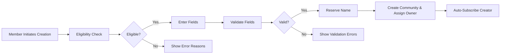
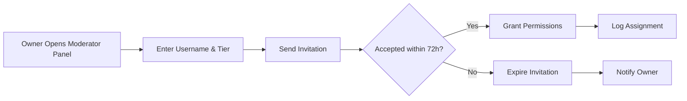
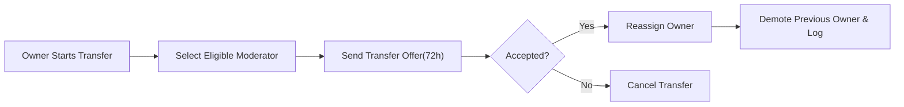
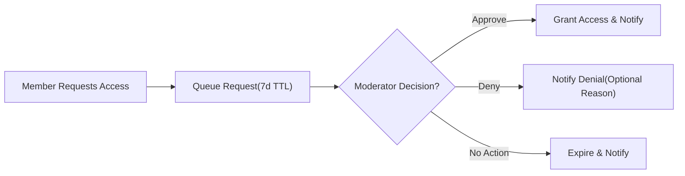
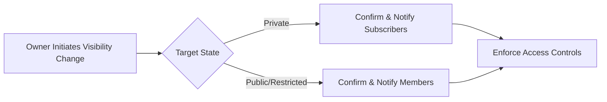
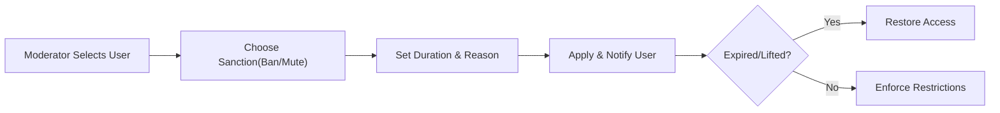
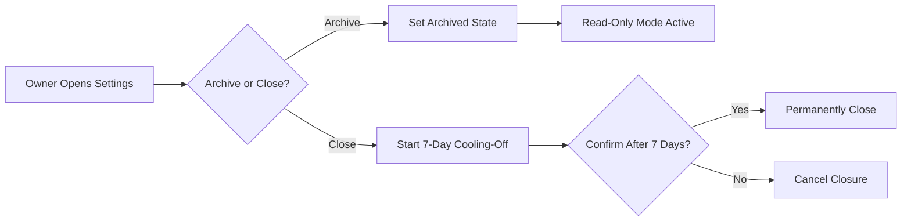

# communityPlatform – Community Management Requirements

## 1) Overview and Scope
- Objective: Provide complete, measurable business rules for the lifecycle of communities from creation through operation, governance changes, transfer, and deactivation/closure.
- In scope: Community creation and configuration, naming constraints, ownership and moderator models, rules and guidelines, posting eligibility, subscriptions, visibility states and transitions, join approvals, governance appeals, sanctions at the community level, performance expectations, rate limits, auditability, transparency, and error handling.
- Out of scope: UI design, API endpoints, database schemas, storage models, algorithms. Technical solutions are at the discretion of the development team.
- Actors considered: guest, member, community owner (member-level role), community moderator (member-level role with tiers), admin (platform-level). See full actor definitions in the User Actors and Permissions requirements.

EARS high-level goals
- THE platform SHALL enable members to create and manage communities subject to eligibility, naming, and policy constraints.
- THE platform SHALL preserve community autonomy within the bounds of platform policy and admin authority.
- THE platform SHALL provide consistent governance workflows (assignment, removal, transfer, visibility changes) with audit and appeal pathways.

## 2) Actors and Permissions (Community Management Context)

| Action (Community Management) | Guest | Member | Moderator (of community) | Owner (of community) | Admin |
|---|---|---|---|---|---|
| Browse public communities | ✅ | ✅ | ✅ | ✅ | ✅ |
| View private community content | ❌ | ⚠️ (if approved) | ✅ | ✅ | ✅ |
| Create community | ❌ | ✅ (eligible) | ✅ (as member) | ✅ (as member) | ✅ |
| Edit community settings | ❌ | ❌ | ✅ (scoped) | ✅ (full) | ✅ |
| Configure rules/guidelines | ❌ | ❌ | ✅ | ✅ | ✅ |
| Assign/remove moderators | ❌ | ❌ | ❌ | ✅ | ✅ |
| Transfer ownership | ❌ | ❌ | ❌ | ✅ | ✅ |
| Deactivate/archive/close community | ❌ | ❌ | ❌ | ✅ | ✅ |
| Approve/deny membership (private) | ❌ | ❌ | ✅ | ✅ | ✅ |
| Ban/unban users from community | ❌ | ❌ | ✅ | ✅ | ✅ |
| View governance audit log (community) | ❌ | ❌ | ✅ | ✅ | ✅ |

Principles (EARS)
- THE platform SHALL scope moderator and owner powers to their community.
- THE platform SHALL apply platform policy precedence over community configuration.
- IF a privilege is not explicitly granted for the actor and scope, THEN THE platform SHALL deny the action.

## 3) Community Creation and Fields

### 3.1 Eligibility and Anti-spam
- WHEN a member attempts to create a community, THE platform SHALL require: verified email, account age ≥ 7 days, and good standing (no active platform bans).
- THE platform SHALL limit creation to 3 communities per 24 hours per member by default and 50 total owned communities per member.
- WHERE admin policy adjusts limits, THE platform SHALL apply configured values consistently.

### 3.2 Required and Optional Fields (Creation)
- Required: Name (unique, immutable), Display Name, Visibility (Public/Restricted/Private), Allowed Post Types (Text/Link/Image), Post Eligibility configuration.
- Optional: Description, Topics/Tags (≤ 5), NSFW flag, Language, Region, Icon, Banner, External Links (≤ 5), Community Rules (can be added later).

### 3.3 Validation Rules (Creation)
- Name
  - THE platform SHALL validate length 3–21 characters, allowed characters [a–z0–9_-], no leading/trailing separators, no consecutive separators, no periods.
  - THE platform SHALL enforce case-insensitive uniqueness.
  - THE platform SHALL block reserved prefixes and impersonation patterns.
- Display Name: 3–40 characters; trim leading/trailing spaces.
- Description: 0–500 characters; URLs permitted.
- Tags: 0–5, each 1–30 characters; alphanumeric plus spaces and hyphen.
- Icon: ≤ 1 MB, ≥ 128×128 px; Banner: ≤ 3 MB, ≥ 1200×256 px.
- Allowed Post Types: at least one of Text/Link/Image.

### 3.4 Creation Flow (Business-Level)

EARS
- WHEN creation passes validation, THE platform SHALL create the community, assign the creator as owner, and auto-subscribe the creator.
- IF validation fails, THEN THE platform SHALL present field-level errors and prevent creation.

## 4) Naming and Uniqueness Rules
- THE platform SHALL enforce unique, case-insensitive names.
- THE platform SHALL block profanity, hate, impersonation, reserved names/prefixes (e.g., "admin", "official", "support", "communityplatform").
- THE platform SHALL keep the name immutable post-creation; display name and description remain editable.
- WHEN a community is permanently closed, THE platform SHALL hold its name for 180 days before possible release.

## 5) Ownership and Moderator Assignment

### 5.1 Roles and Tiers
- Owner: full community control (except platform policy and admin overrides).
- Moderator tiers:
  - Full Moderator: content actions, user sanctions, settings within scope, no ownership transfer.
  - Content Moderator: content actions and user discipline (warn/ban/mute), no settings or role assignments.
  - Limited Moderator: approve/remove content only.

### 5.2 Assignment and Removal
- WHEN an owner invites a member as moderator, THE platform SHALL send an invitation that expires in 72 hours.
- WHEN an invite is accepted, THE platform SHALL grant specified tier immediately and log the event.
- WHEN an owner removes a moderator or a moderator resigns, THE platform SHALL revoke permissions immediately and log the event.

### 5.3 Moderator Assignment Flow

### 5.4 Ownership Transfer
- WHEN an owner initiates a transfer to a Full Moderator (account age ≥ 30 days, good standing), THE platform SHALL require acceptance within 72 hours.
- WHEN accepted, THE platform SHALL change ownership, demote the prior owner to Full Moderator, and log the event.
- WHERE the owner is inactive ≥ 90 days, THE platform SHALL allow admin-facilitated transfer after review.

Ownership Transfer Flow

## 6) Community Rules, Flair, and Templates

### 6.1 Rules and Guidelines
- THE platform SHALL allow up to 50 rules with title (3–100 chars) and optional description (0–500 chars).
- THE platform SHALL allow reordering and pinning of up to 3 rules.
- WHEN a rule changes materially, THE platform SHALL timestamp the change and optionally notify subscribers per user preferences.

### 6.2 Flair and Post Templates (Business-Level)
- THE platform SHALL allow community-defined flairs (labels) for posts with a maximum of 50 active flairs.
- THE platform SHALL allow optional required templates for posts with up to 10 fields (e.g., required tags or checkboxes) defined in business terms.
- WHERE templates are required, THE platform SHALL reject posts lacking required template fields with specific error messages.

### 6.3 Automoderation (Business-Level)
- THE platform SHALL allow communities to specify business-level automod rules such as domain allow/deny lists, keyword filters, and minimum account age for posting.
- WHERE automod conditions are met, THE platform SHALL either hold the post for moderator review or auto-remove according to community configuration and platform policy.

EARS
- WHEN a post violates a community rule, THE platform SHALL allow moderators to warn, remove, lock, or ban according to policy.
- WHERE a template is required and missing, THE platform SHALL block publication and list missing fields.

## 7) Subscription Model, Visibility, and Join Requests

### 7.1 Visibility States
- Public: visible to all; posting per configured eligibility.
- Restricted: visible to all; posting/commenting limited to approved contributors.
- Private: visible only to approved members; not publicly discoverable.

### 7.2 Posting Eligibility Options
- Public communities: subscribers-only posting; all-members posting; approved contributors only.
- Restricted: approved contributors only.
- Private: approved members only.

### 7.3 Subscribe/Unsubscribe
- WHEN a member subscribes, THE platform SHALL add the community to the member’s subscriptions immediately.
- WHEN a member unsubscribes, THE platform SHALL remove it immediately and stop non-critical notifications.
- WHERE a member is banned, THE platform SHALL revoke subscription silently and prevent resubscription until unbanned.

### 7.4 Join Requests (Private/Restricted)
- WHEN a member requests access to a Private community, THE platform SHALL enqueue the request for moderator/owner decision with a 7-day expiry.
- WHEN a decision is made (approve/deny), THE platform SHALL notify the requester with outcome and—if denied—an optional reason chosen from predefined categories.
- IF no decision occurs within 7 days, THEN THE platform SHALL expire the request and notify the requester.

Join Request Flow

### 7.5 Visibility Changes
- WHEN changing from Public/Restricted to Private, THE platform SHALL require owner confirmation and notify current subscribers that future access requires approval.
- WHEN changing from Private to Public/Restricted, THE platform SHALL preserve existing approvals and notify members of the change.

Visibility Change Flow

## 8) Sanctions at Community Scope (Ban/Unban)
- WHEN moderators ban a user from the community (1/7/30 days or permanent), THE platform SHALL block posting, commenting, and voting in that community and remove the user’s subscription.
- WHEN a ban expires or is lifted, THE platform SHALL restore access consistent with standard eligibility rules.
- WHEN a user is muted, THE platform SHALL block posting and commenting while allowing read access unless the community is private and membership was revoked.

Ban/Unban Flow

EARS
- WHEN a ban is applied, THE platform SHALL immediately enforce restrictions and record scope, start/end, and reason.
- WHEN a ban ends, THE platform SHALL restore interaction abilities without restoring prior subscriptions automatically unless re-subscribed by the user.

## 9) Transfer, Deactivation, and Closure

### 9.1 Archival (Read-Only)
- WHEN the owner archives a community, THE platform SHALL prevent new posts, comments, votes, and subscriptions while preserving readability per visibility rules.

### 9.2 Permanent Closure
- WHEN the owner requests closure, THE platform SHALL start a 7-day cooling-off period, after which closure proceeds if confirmed.
- WHEN closed, THE platform SHALL delist the community and tombstone the page, retaining content per data retention policy.

### 9.3 Administrative Interventions
- WHERE severe policy violations occur, THE platform SHALL allow admins to quarantine, freeze, archive, or close communities with notifications to owners/moderators unless legally prohibited.

Deactivation and Closure Flow

## 10) Governance Appeals and Disputes
- WHEN a member disputes a community-level sanction (ban/mute), THE platform SHALL allow an appeal to the moderator team with an expected response within 7 days.
- WHEN the appeal alleges moderator misconduct or remains unanswered after 7 days, THE platform SHALL allow escalation to admins.
- WHEN a moderator removal or ownership transfer is disputed, THE platform SHALL allow admin review subject to platform policy and available audit logs.

EARS
- WHEN an appeal is filed, THE platform SHALL acknowledge immediately and track status until resolution.
- WHEN a decision is made, THE platform SHALL notify the appellant with outcome (uphold/modify/overturn) and rationale category.

## 11) Error Handling and Validation Messages (Selected)
- IF a member is ineligible to create a community, THEN THE platform SHALL state specific reasons (e.g., “Email verification required”, “Account age must be ≥ 7 days”, “Creation limit reached”).
- IF a community name is invalid, THEN THE platform SHALL state the violated rule (e.g., invalid character, reserved prefix, already taken) and present allowed patterns.
- IF visibility changes would revoke access, THEN THE platform SHALL require owner confirmation and present a summary of impacts before applying.
- IF a moderator invitation expires, THEN THE platform SHALL notify the owner of expiration.
- IF an ownership transfer is not accepted within 72 hours, THEN THE platform SHALL cancel and inform both parties.

## 12) Performance, Rate Limits, and Quotas (Community Scope)
- THE platform SHALL complete community creation (post-validation) within 2 seconds P50 and 4 seconds P95 under normal load.
- THE platform SHALL reflect subscription/unsubscription within 5 seconds in subsequent feed compositions.
- THE platform SHALL process moderator invitation acceptance or revocation within 1 second of action.
- THE platform SHALL publish changes to visibility/rules within 30 seconds across relevant views.
- THE platform SHALL enforce: up to 10 name checks per minute per user; excessive checks SHALL be throttled with retry-after.

Rate Limits (defaults)
- Creation: ≤ 3 communities per 24 hours per member; ≤ 50 total owned.
- Join requests: ≤ 20 active pending requests per community; older pending requests beyond 7 days SHALL expire.
- Moderator invites: ≤ 10 outstanding invites per community; each expires in 72 hours.

## 13) Auditability and Transparency
- THE platform SHALL maintain an immutable, append-only governance log for: creation, settings changes, rule changes, visibility changes, moderator assignments/removals, ownership transfers, bans/mutes, archival/closure, and admin interventions.
- THE platform SHALL record actor, action, target, timestamp, and rationale category for each entry.
- THE platform SHALL allow owner and moderators to view community-level audit entries; admins may view platform-wide logs.

## 14) Compliance, Safety, and Abuse Prevention
- THE platform SHALL enforce platform-wide content policy; community rules cannot override platform policy.
- WHERE NSFW is enabled, THE platform SHALL enforce age gating and preference-based visibility.
- WHERE legal holds or takedown requests exist, THE platform SHALL preserve relevant community data and block destructive actions until release.
- WHERE coordinated manipulation or spam is detected, THE platform SHALL allow temporary heightened restrictions (reduced posting limits, approval-only mode) and notify moderators.

## 15) Acceptance Criteria (Business-Level, Selected)
- WHEN a verified member with account age ≥ 7 days submits valid fields and an available name, THE platform SHALL create the community and assign ownership within 2 seconds P50.
- WHEN changing visibility from Public to Private, THE platform SHALL require explicit confirmation and SHALL notify subscribers; future access SHALL require approval.
- WHEN a moderator invite is accepted within 72 hours, THE platform SHALL grant permissions immediately and log the assignment.
- WHEN a user banned for 7 days reaches ban end, THE platform SHALL restore interaction abilities in that community automatically.
- WHEN a private join request is pending for 7 days without decision, THE platform SHALL expire the request and notify the requester.
- WHEN an owner initiates closure and confirms after 7 days, THE platform SHALL close and tombstone the community.
- WHEN a governance appeal is submitted, THE platform SHALL acknowledge immediately and provide a decision within 7 days at moderator level or escalate thereafter.

## 16) Glossary
- Archived: Read-only state preventing new content or interactions.
- Owner: Member with ultimate control over a specific community.
- Moderator: Member designated to enforce rules and manage content within a community; may have tiered capabilities.
- Private: Community visible only to approved members.
- Restricted: Community visible to all but writable by approved contributors only.
- Public: Community visible to and readable by all.
- Quarantine: Policy-based restriction reducing visibility pending remediation.

## 17) Related Requirement Documents
- User Actors and Permissions: actor definitions, authentication, and global access control
- Posting and Content Requirements: post types, validations, flags, and visibility states
- Comments and Threads Requirements: nesting, editing, deletion, sorting, and abuse controls
- Voting and Ranking Requirements: vote rules and ranking sorts
- Subscriptions and Feeds Requirements: subscription flows and feed composition
- Reporting and Moderation Process: reporting workflows, enforcement, escalation, and appeals
- Non-Functional Requirements: global performance, availability, security, and compliance
- Data Lifecycle and Retention: retention, deletion, legal holds, and backups