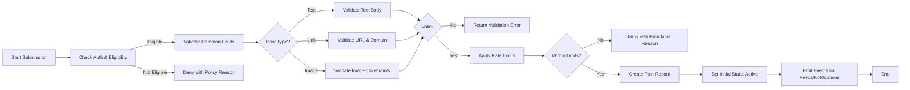
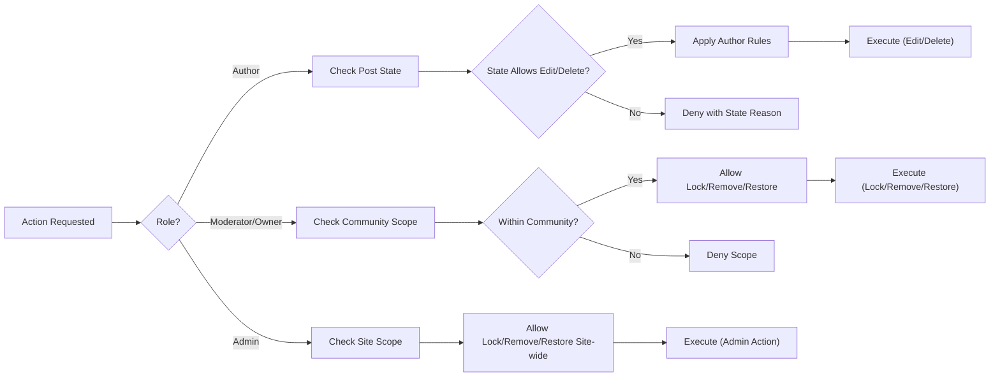
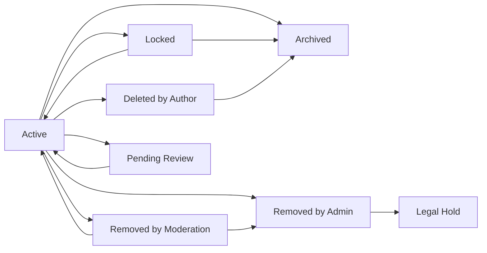

# communityPlatform – Posting and Content Requirements (Text, Link, Image)

## 1. Introduction and Scope
Defines business requirements for creating, validating, editing, deleting, locking, labeling, duplicating, and controlling visibility of posts on communityPlatform. Covers three post types: Text, Link, and Image. Excludes technical architectures, API definitions, database schemas, vendor choices, or UI wireframes. Uses EARS to ensure clarity and testability. Role capabilities reference the User Roles and Permissions specification.

Scope boundaries:
- In scope: post submission flows, validations, rate limiting, labels/tags, moderation interactions on posts, visibility/removal states, archiving, locking, performance/latency expectations, error semantics, auditability, and accessibility.
- Out of scope: multi-image galleries, video/livestreams, polls, marketplace/commerce, private messaging, and UI visual design.

## 2. Post Types and Use Cases
### 2.1 Type definitions and constraints
- Text Post: Purely textual content authored within the platform.
  - Use cases: Announcements, discussions, guides, Q&A, opinions.
- Link Post: A hyperlink to an external resource.
  - Use cases: Sharing articles, research, media, references.
- Image Post: A single uploaded image with title and optional description/alt text.
  - Use cases: Artwork, photography, memes, infographics.

EARS requirements:
- THE platform SHALL support exactly three post types: "Text", "Link", and "Image".
- THE platform SHALL associate each post with exactly one community and exactly one author.
- WHERE a community restricts allowed post types, THE platform SHALL enforce the community configuration and deny disallowed types.

### 2.2 Role-based access summary (posting capabilities)

| Action | guestUser | memberUser | communityOwner | communityModerator | adminUser |
|---|---|---|---|---|---|
| Create post in public community (if type allowed) | ❌ | ✅ | ✅ | ✅ | ✅ |
| Create post in restricted/private community | ❌ | WHERE approved: ✅ | WHERE approved: ✅ | WHERE approved: ✅ | ✅ |
| Edit/delete own post (subject to rules) | ❌ | ✅ | ✅ | ✅ | ✅ |
| Lock/Unlock a post | ❌ | ❌ | ✅ (owned community) | ✅ (assigned community) | ✅ (site-wide) |
| Apply/remove tags/flairs | ❌ | WHERE permitted | ✅ | ✅ | ✅ |
| Mark/Unmark NSFW or Spoiler | ❌ | ✅ (own) | ✅ (scoped) | ✅ (scoped) | ✅ (any) |
| Remove others' posts | ❌ | ❌ | ✅ (scoped) | ✅ (scoped) | ✅ (site-wide) |

EARS role gating:
- WHERE a user is guestUser, THE platform SHALL deny all posting, editing, and deletion actions.
- WHERE a user is memberUser admitted to a community, THE platform SHALL permit creating posts within allowed post types for that community.
- WHERE a user holds communityOwner/communityModerator, THE platform SHALL permit locking/unlocking and removing posts within that scoped community.
- WHERE a user is adminUser, THE platform SHALL permit performing all moderation actions on any community.

## 3. Content Submission Rules and Validation
### 3.1 Common fields and validations (all post types)
Required fields (conceptual):
- Title: headline text, 1–300 characters inclusive.
- Community: destination community identifier.
- Post Type: one of Text, Link, Image.
- Author: implied from authenticated session (memberUser+).

Optional fields (conceptual):
- Tags/Flairs: community-defined labels.
- Labels: NSFW, Spoiler.
- Language/Warnings: optional community policy.

Common validation rules:
- THE platform SHALL require title length 1–300 characters inclusive and reject titles comprised solely of whitespace or repeated punctuation.
- THE platform SHALL reject posts if the destination community disallows the selected post type per configuration.
- THE platform SHALL allow up to 5 tags per post by default unless the community sets a stricter limit and SHALL reject tags not defined by that community.
- WHERE a post is labeled NSFW or Spoiler, THE platform SHALL enforce downstream visibility preferences and gating per sensitive content policies.
- WHERE rate limits or eligibility gating apply, THE platform SHALL evaluate them prior to content validation and provide business reasons upon denial.

Privacy and safety (business):
- THE platform SHALL prevent exposure of sensitive creator metadata embedded in submissions (e.g., image EXIF GPS) in public contexts and SHALL apply platform policies to sanitize or withhold such metadata from public display.

### 3.2 Type-specific validations (Text, Link, Image)
Text Post:
- THE platform SHALL require body text length between 1 and 40,000 Unicode characters inclusive after trimming.
- THE platform SHALL treat content as plain text with preserved line breaks (rendering specifics are out of scope).
- WHERE body contains prohibited terms per community/site policy, THE platform SHALL block submission with a rule reference and recovery guidance.

Link Post:
- THE platform SHALL require a valid http(s) URL up to 2,048 characters inclusive.
- THE platform SHALL canonicalize URLs for duplicate detection and domain checks in business terms (implementation is out of scope).
- IF the link’s domain is disallowed by community or platform policy, THEN THE platform SHALL block submission with a policy reason.
- IF the submitted link duplicates an existing link post in the same community within the last 30 days after canonicalization, THEN THE platform SHALL block submission and reference the existing post.
- WHERE link preview enrichment fails, THE platform SHALL still accept a valid post and SHALL allow preview to be attached asynchronously when available.

Image Post:
- THE platform SHALL allow JPEG, PNG, GIF formats only.
- THE platform SHALL enforce maximum file size of 10 MB and minimum dimensions 320x320 pixels.
- THE platform SHALL reject images that are corrupt or contain only transparent pixels.
- WHERE animated GIFs are submitted, THE platform SHALL enforce a maximum duration of 15 seconds or file size of 10 MB, whichever limit is reached first.
- WHERE alt text is provided, THE platform SHALL allow up to 500 characters; WHERE a community requires alt text, THE platform SHALL enforce its presence at submission.
- WHERE image orientation metadata exists, THE platform SHALL display imagery correctly oriented without exposing sensitive EXIF data as public content.

### 3.3 Submission workflow (Mermaid)

## 4. Editing, Deleting, Locking, and Archiving
### 4.1 Editing rules and history
Editorial constraints:
- THE platform SHALL prohibit changing the post type after submission.
- THE platform SHALL prohibit changing the URL of a Link Post post-submission to prevent bait-and-switch.
- THE platform SHALL prohibit replacing the image file of an Image Post post-submission; metadata edits may be allowed per below.

Author editing privileges:
- THE platform SHALL allow authors to edit Text Post bodies at any time the post is neither locked, archived, nor removed.
- THE platform SHALL allow authors to edit titles for any post within 15 minutes of submission provided the post has fewer than 5 votes and 0 comments; otherwise deny title edits.
- THE platform SHALL allow authors to edit tags/flairs, NSFW, and Spoiler on their own posts unless locked, archived, or removed.
- WHERE alt text exists on an Image Post, THE platform SHALL allow the author to edit alt text any time unless locked, archived, or removed.

Edit transparency:
- WHEN a post is edited, THE platform SHALL record an edit timestamp and increment an edit count.
- WHERE prior content is material to moderation, THE platform SHALL retain an immutable history visible to moderators/admins but not public.
- THE platform SHALL display an "edited" indicator with latest edit timestamp to viewers.

### 4.2 Deletion semantics and recovery
Author-initiated deletion:
- THE platform SHALL allow authors to delete their own post at any time unless under legal hold.
- WHEN an author deletes a post, THE platform SHALL replace content with a "[deleted by author]" marker, remove it from feeds, and retain for audit per retention policy.
- THE platform SHALL preserve comments under a deleted post unless separate policies remove or collapse them.

Moderator/Admin removals:
- THE platform SHALL allow communityOwner/communityModerator to remove any post within scope, and adminUser to remove site-wide.
- WHEN a moderator removes a post, THE platform SHALL set state to "Removed by Moderation", hide content from general viewers, and retain visibility to the author, moderators, and administrators.
- WHEN an admin removes a post for platform policy, THE platform SHALL set state to "Removed by Admin", hide content from all but administrators, and notify the author with the policy reason.

Recovery:
- WHERE a post was removed by a community moderator, THE platform SHALL allow restoration by communityOwner/communityModerator within 30 days unless superseded by adminUser or legal hold.
- WHERE a post was deleted by the author, THE platform SHALL not allow restoration by the author via self-service; moderators may not restore author-deleted content.

### 4.3 Locking and archiving
Locking:
- THE platform SHALL allow moderators/owners/admins to lock a post, preventing new comments and vote changes.
- WHEN a post is locked, THE platform SHALL keep it visible but disallow new comments and vote changes.
- WHERE a post is locked, THE platform SHALL allow unlocking by eligible roles.

Archiving:
- THE platform SHALL automatically archive posts 180 days after creation unless the community sets a stricter threshold not less than 30 days.
- WHEN a post is archived, THE platform SHALL prevent new comments and votes and disallow any edits; content remains visible.
- THE platform SHALL exclude archived posts from "Hot" sorting and from promotion in discovery contexts while keeping them available by direct link and historical browsing.

### 4.4 Decision flow (Mermaid)

## 5. Content Labels (NSFW, Spoilers) and Tags
### 5.1 Label definitions and defaults
- NSFW: content inappropriate for minors or professional settings.
- Spoiler: content revealing critical plot/game/event details.

EARS requirements:
- THE platform SHALL default NSFW=false and Spoiler=false unless overridden by policy or community defaults.
- WHERE a post is labeled NSFW, THE platform SHALL restrict previews and demand explicit user choice to view based on user preferences and age-gating.
- WHERE a post is labeled Spoiler, THE platform SHALL shield thumbnails and excerpts in discovery contexts until the user opts to reveal.

### 5.2 Community configurations and enforcement
- WHERE a community is marked NSFW, THE platform SHALL default new posts NSFW=true unless a moderator explicitly clears the label.
- WHERE a community disallows NSFW, THE platform SHALL block posts marked NSFW.
- WHEN moderators change labels, THE platform SHALL notify the author with updated labels and reason category.
- IF repeated mislabeling is detected for an author (e.g., 3 NSFW mislabels within 30 days), THEN THE platform SHALL restrict that author’s posting eligibility for 7 days in that community and notify both author and moderators.

### 5.3 Flair/Tags rules
- THE platform SHALL support 0–5 tags per post by default; communities may reduce this maximum.
- THE platform SHALL ensure only community-defined tags can be applied.
- WHERE communities grant tagging rights to members, THE platform SHALL allow members to apply tags at submission and during the edit window.
- THE platform SHALL allow moderators and owners to change tags at any time.

## 6. Spam, Duplicate, and Anti-manipulation Policies
### 6.1 Rate limits and eligibility gating
- THE platform SHALL enforce minimum account age of 24 hours and verified email before allowing posting unless a community explicitly waives this.
- WHERE an account has negative karma or fewer than 10 total karma points, THE platform SHALL restrict posting to 1 post per community per 12 hours.
- THE platform SHALL enforce a default limit of 5 posts per user per 24 hours across the site and 3 per 24 hours per community; communities may configure stricter limits.
- THE platform SHALL apply 50% tighter limits for 30 days after confirmed spam violations.

### 6.2 Duplicate detection and cross-posting
- THE platform SHALL treat Link Post duplicates within the same community within 30 days as disallowed and SHALL reference the prior submission.
- WHERE cross-posting is enabled, THE platform SHALL allow a post to be cross-posted to another community by referencing the original post with attribution and link back to source.
- THE platform SHALL allow at most one cross-post per destination community per original post.
- THE platform SHALL flag potential duplicate Text Posts when title+body match an author’s own prior submission in the same community within 24 hours; authors may proceed only if moderators allow duplicates.
- THE platform SHALL flag potential duplicate Image Posts via perceptual similarity concepts and route to moderator review where configured.

### 6.3 Anti-manipulation safeguards
- IF a user rapidly deletes and recreates similar posts to reset votes within 60 minutes, THEN THE platform SHALL block recreation for 60 minutes.
- IF a domain accumulates 3 spam removals across 2 communities within 7 days, THEN THE platform SHALL add the domain to a temporary watchlist for 14 days requiring moderator approval for new link posts to that domain.
- WHERE automated signals exceed spam thresholds (community-configured), THE platform SHALL route submission to a "Pending Review" queue visible to moderators and the author until actioned.

## 7. Content Visibility and Removal States
### 7.1 Conceptual states and transitions
States:
- Active: visible, open to comments and votes.
- Locked: visible; new comments and vote changes disabled.
- Archived: visible; comments, votes, and edits disabled.
- Removed by Moderation: hidden from general viewers; visible to author, moderators, admins.
- Removed by Admin: hidden from all but admins.
- Deleted by Author: hidden from general viewers; marker shown to the author; comments treated per commenting policy.
- Pending Review: temporarily limited visibility pending moderation.
- Legal Hold: preserved and non-editable; visibility per policy direction.

EARS requirements:
- WHEN a new post is created, THE platform SHALL set state to Active unless policy routes to Pending Review.
- WHERE a post is Locked, THE platform SHALL prevent new comments and vote changes and allow unlocking by eligible roles.
- WHERE a post is Archived, THE platform SHALL prevent edits, comments, and votes, and keep visibility unchanged.
- WHERE a post is Removed by Moderation, THE platform SHALL restrict visibility to author, moderators of that community, and administrators.
- WHERE a post is Removed by Admin, THE platform SHALL restrict visibility to administrators only and SHALL notify the author with a policy reason.
- WHERE a post is Deleted by Author, THE platform SHALL hide content from others and keep an audit marker for authorized viewers.

### 7.2 Who can see what (by state)
- Active/Locked/Archived: everyone with access to the community (guests if public; members if private/restricted).
- Pending Review: author, scoped moderators/owners, administrators.
- Removed by Moderation: author, scoped moderators/owners, administrators.
- Removed by Admin: administrators only.
- Deleted by Author: author, moderators/owners, administrators (with marker and prior content redacted to general viewers).
- Legal Hold: visibility directed by legal instruction; default to moderators/owners and administrators; exclude general viewers.

### 7.3 Notifications and transparency
- WHEN moderators/admins change a post’s state, THE platform SHALL notify the author with action, reason category, and appeal path if applicable.
- WHERE visibility state changes, THE platform SHALL adjust feed eligibility immediately to prevent surfacing in general listings.
- THE platform SHALL maintain public indicators for locked/archived states so users understand interaction limits (display specifics are out of scope).

### 7.4 Lifecycle state transitions (Mermaid)

## 8. Error Handling and Recovery (business semantics)
Error categories (business keys map to the Exception Handling and Error Model):
- POST_VALIDATION_FAILED, POST_DUPLICATE_DETECTED, POST_QUOTA_EXCEEDED, POST_SPAM_SUSPECTED, POST_LOCKED, POST_ARCHIVED, COMMUNITY_RULE_VIOLATION, LINK_UNREACHABLE, IMAGE_POLICY_VIOLATION.

EARS requirements:
- WHEN an error occurs, THE platform SHALL present a human-readable summary, a stable error key, and recovery guidance consistent with the exception model.
- WHERE recovery is possible (e.g., retry-after), THE platform SHALL include the earliest local-time retry estimate.
- IF multiple validation failures occur, THEN THE platform SHALL prioritize the most critical failure and MAY include secondary hints.
- WHEN link fetching fails, THE platform SHALL allow submission without preview and SHALL attempt preview enrichment later.
- WHEN rate limits are exceeded, THE platform SHALL communicate the applicable window and earliest retry time.

## 9. Performance and Experience Expectations
- WHEN a valid post is submitted, THE platform SHALL complete creation and respond within 2 seconds for 95% of requests measured at the service boundary, excluding image upload transfer time.
- WHERE an image upload is required, THE platform SHALL provide upload progress feedback and finalize the post within 3 seconds after the image is received for 95% of requests.
- WHEN a post is created, THE platform SHALL make it discoverable in community feeds within 5 seconds and in home feeds within 10 seconds.
- WHEN locking, removing, or restoring a post, THE platform SHALL reflect the state change in feeds within 5 seconds.

## 10. Auditability, Logging, Privacy, and Accessibility
Audit and logging:
- THE platform SHALL log post lifecycle actions: create, edit, label/tag changes, lock/unlock, remove/restore, delete, archive transitions, and moderator/admin actions with actor, reason category, and timestamp.
- WHERE a post is removed or restored, THE platform SHALL require a reason category selected from a standardized policy taxonomy.
- THE platform SHALL preserve audit logs for at least 365 days or per legal requirement, whichever is greater.

Privacy and metadata:
- THE platform SHALL avoid exposing sensitive media metadata (e.g., GPS EXIF) in public contexts and SHALL align with privacy policy regarding retention and sanitization.

Accessibility:
- WHERE alt text is required by community or platform policy, THE platform SHALL block image submission without alt text and SHALL provide guidance.
- WHERE Spoiler is true, THE platform SHALL ensure previews do not reveal spoilered content in discovery contexts.
- THE platform SHALL uphold localization and timezone display expectations per non-functional requirements.

## 11. Dependencies and Related Documents
- [Service Overview](./01-communityPlatform-service-overview.md)
- [User Roles and Permissions](./03-communityPlatform-user-roles-and-permissions.md)
- [Authentication and Account Lifecycle](./04-communityPlatform-authentication-and-account-lifecycle.md)
- [Community and Moderation Rules](./05-communityPlatform-community-and-moderation-rules.md)
- [Voting and Karma System](./07-communityPlatform-voting-and-karma-system.md)
- [Commenting and Nested Replies](./08-communityPlatform-commenting-and-nested-replies.md)
- [Feed Sorting and Discovery](./09-communityPlatform-feed-sorting-and-discovery.md)
- [User Profiles and Subscriptions](./10-communityPlatform-user-profiles-and-subscriptions.md)
- [Reporting, Safety, and Trust](./11-communityPlatform-reporting-safety-and-trust.md)
- [Non-functional Requirements](./12-communityPlatform-nonfunctional-requirements.md)
- [Exception Handling and Error Model](./13-communityPlatform-exception-handling-and-error-model.md)
- [Data Lifecycle and Governance](./14-communityPlatform-data-lifecycle-and-governance.md)

## 12. Acceptance Criteria (business-focused)
- GIVEN guestUser, WHEN attempting to submit a post, THEN submission is denied with guidance to register/login.
- GIVEN memberUser with unverified email, WHEN attempting to submit a post, THEN submission is denied with AUTH_EMAIL_NOT_VERIFIED and resend option.
- GIVEN memberUser admitted to a community that disallows Image posts, WHEN submitting an Image post, THEN POST_VALIDATION_FAILED with community policy reference.
- GIVEN a Link Post duplicate within 30 days (canonicalized), WHEN author submits, THEN POST_DUPLICATE_DETECTED and reference to existing post is presented.
- GIVEN an Image Post of 12 MB, WHEN author submits, THEN POST_VALIDATION_FAILED with IMAGE_POLICY_VIOLATION and size guidance.
- GIVEN a Text Post with prohibited terms, WHEN author submits, THEN COMMUNITY_RULE_VIOLATION with rule reference.
- GIVEN a post labeled NSFW and viewer without opt-in, WHEN the viewer encounters the post in discovery, THEN content is gated until opt-in.
- GIVEN a locked post, WHEN any user tries to comment or change votes, THEN POST_LOCKED denial occurs and state is indicated.
- GIVEN a post archived after 180 days, WHEN author attempts to edit or label, THEN POST_ARCHIVED denial occurs.
- GIVEN a moderator removes a post, WHEN author views it, THEN the state is "Removed by Moderation" with appeal path visible to the author.
- GIVEN a community-level rate limit exceeded, WHEN author attempts new submission, THEN POST_QUOTA_EXCEEDED with retry-after is shown.
- GIVEN a watchlisted domain, WHEN a new Link Post is submitted, THEN submission is placed in Pending Review and the author is informed.
- GIVEN restoration by a moderator within 30 days, WHEN the post is restored, THEN it reappears in feeds within 5 seconds and notifications are sent.
