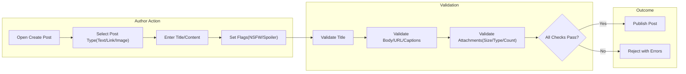
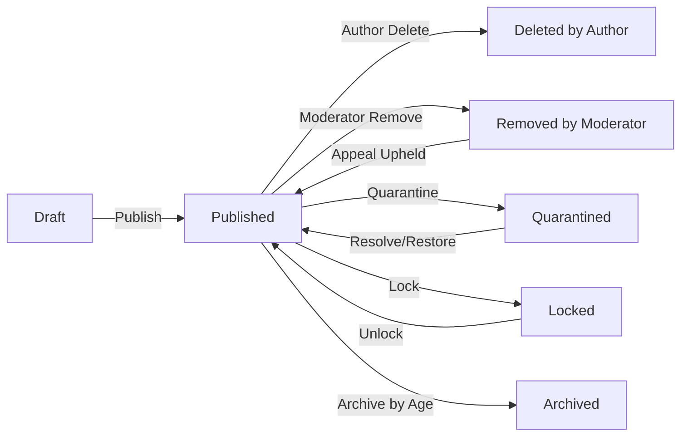

# communityPlatform — Posting and Content Requirements

This document provides business-level requirements for creating, validating, and governing the lifecycle of posts within communities on the communityPlatform service. It defines what content can be posted, the constraints and flags that apply to different post types, and how edits and deletions impact visibility. It does not prescribe technical implementation, APIs, or storage details.

Related context is defined in the following documents:
- See the [Community Management Requirements](./05-communityPlatform-community-management.md) for community creation, ownership, moderator roles, and community-level rules.
- See the [Comments and Threads Requirements](./07-communityPlatform-comments-and-threads.md) for comment behaviors on posts.
- See the [Voting and Ranking Requirements](./08-communityPlatform-voting-and-ranking.md) for vote rules and sort semantics including hot, new, top, and controversial.
- See the [Subscriptions and Feeds Requirements](./09-communityPlatform-subscriptions-and-feeds.md) for feed assembly rules involving posts.
- See the [User Profile and Karma Requirements](./10-communityPlatform-user-profile-and-karma.md) for how posts contribute to karma and profile displays.
- See the [Reporting and Moderation Process Requirements](./11-communityPlatform-reporting-and-moderation-process.md) for report handling and enforcement actions that affect post visibility.
- See the [Non-Functional Requirements](./13-communityPlatform-non-functional-requirements.md) for global performance, reliability, and security constraints.
- See the [Exception Handling and Abuse Prevention Requirements](./14-communityPlatform-exception-handling-and-abuse-prevention.md) for anti-spam and abuse policies that intersect with posting.
- See the [Data Lifecycle and Retention Requirements](./15-communityPlatform-data-lifecycle-and-retention.md) for deletion, archival, and legal hold behaviors.

## 1. Scope and Definitions

- “Post” refers to a top-level content item created within a specific community by a member. Post types supported are Text, Link, and Image.
- “Author” refers to the member who created the post.
- “Moderator” refers to a member granted moderation privileges for a specific community.
- “Admin” refers to a platform administrator.
- “Guest” refers to unauthenticated users who can view public content but cannot post or interact.
- “NSFW” refers to content not suitable for work and requiring age/consent gates.
- “Spoiler” refers to content that reveals plot or outcome details and should be masked.
- “Soft delete” refers to hiding a post from public view while retaining a tombstone for context and audit per business policies.
- “Archive” refers to a state where posting interactions (e.g., votes, comments, edits) are disabled due to age or policy.

EARS Ubiquitous Requirements (general constraints)
- THE platform SHALL allow the following post types: text, link, image.
- THE platform SHALL restrict posting actions to authenticated members with permission to post in the target community.
- THE platform SHALL record community association and author ownership for each post.
- THE platform SHALL treat all posts as public within the visibility of their community unless restricted by flags or state.

## 2. Post Types (Text/Link/Image)

### 2.1 Text Post
- THE platform SHALL require a title and may include an optional text body.
- THE platform SHALL allow zero attachments for text posts.
- THE platform SHALL allow Markdown or plain text in the body as content, with allowed features defined as business policy; any disallowed features SHALL be rejected.

EARS
- WHEN a member creates a text post, THE platform SHALL require a title meeting the validation limits in Section 3.
- WHEN a member includes a body, THE platform SHALL validate body length and content rules per Section 3.

### 2.2 Link Post
- THE platform SHALL require a title and a single destination URL.
- THE platform SHALL prohibit body content for link posts beyond an optional short summary up to 280 characters.
- THE platform SHALL allow zero attachments for link posts.

EARS
- WHEN a member creates a link post, THE platform SHALL validate the URL per Section 3 (URL format and length) and restrict summaries per Section 3.
- IF the URL violates community-level banned domains, THEN THE platform SHALL reject the post with a specific error message.

### 2.3 Image Post
- THE platform SHALL require a title and at least one image attachment.
- THE platform SHALL allow up to 10 image attachments per post.
- THE platform SHALL prohibit a separate body for image posts beyond optional captions on each image (up to 280 characters per image caption).

EARS
- WHEN a member uploads images for an image post, THE platform SHALL validate file type and size limits per Section 4 before accepting the post.
- IF any image fails validation, THEN THE platform SHALL reject the post and enumerate failing attachments.

## 3. Title and Body Validation Rules

### 3.1 Title Validation
- THE platform SHALL require a non-empty title for all post types.
- THE platform SHALL enforce title length between 1 and 300 Unicode characters.
- THE platform SHALL allow Unicode characters, excluding control characters other than standard whitespace.
- THE platform SHALL disallow titles that consist solely of whitespace.
- THE platform SHALL disallow titles that match known spam or prohibited patterns per policy in the [Exception Handling and Abuse Prevention Requirements](./14-communityPlatform-exception-handling-and-abuse-prevention.md).

EARS
- WHEN a title exceeds 300 characters, THE platform SHALL reject with an error specifying the maximum limit and the observed length.
- IF a title is empty or whitespace-only, THEN THE platform SHALL reject with an error indicating the requirement for at least one non-whitespace character.

### 3.2 Body Validation (Text Posts)
- THE platform SHALL allow an optional body up to 40,000 Unicode characters.
- THE platform SHALL allow newlines and standard whitespace; disallow embedded control characters.
- THE platform SHALL disallow executable code, script injection, and tracking pixels by policy (see abuse prevention).
- THE platform SHALL strip or reject unsupported formatting per business policy; validation SHALL indicate which parts are disallowed.

EARS
- WHEN a body exceeds 40,000 characters, THE platform SHALL reject the post and report the limit.
- IF disallowed content patterns are detected, THEN THE platform SHALL reject and enumerate the violations.

### 3.3 URL Validation (Link Posts)
- THE platform SHALL accept only HTTP or HTTPS URLs.
- THE platform SHALL enforce a maximum URL length of 2,048 characters.
- THE platform SHALL require a valid host and path; data URIs and file URIs SHALL be rejected.
- THE platform SHALL normalize and compare URLs for duplicate detection per Section 10.
- THE platform SHALL reject self-referential URLs that point to the platform’s own post permalink to prevent loops.

EARS
- WHEN a URL is not HTTP or HTTPS, THE platform SHALL reject with an “unsupported scheme” error.
- IF a URL exceeds 2,048 characters, THEN THE platform SHALL reject and report the limit.

### 3.4 Caption/Summary Limits
- THE platform SHALL limit link post summaries and image captions to 280 characters per item.
- THE platform SHALL reject any summary or caption exceeding 280 characters and indicate the overage.

## 4. Attachments and Size Constraints

- THE platform SHALL allow attachments only for image posts and SHALL restrict to image formats: JPEG (.jpg/.jpeg), PNG (.png), and GIF (.gif).
- THE platform SHALL enforce per-image maximum size of 10 MB and minimum size of 1 KB.
- THE platform SHALL enforce an image dimension limit of up to 10,000 pixels on the longest side; images exceeding this dimension SHALL be rejected.
- THE platform SHALL limit the number of images per post to 10.
- THE platform SHALL compute total attachment size per post and SHALL reject posts exceeding 50 MB aggregate.
- THE platform SHALL reject corrupted or unreadable files with a specific error.

EARS
- WHEN any attachment exceeds 10 MB, THE platform SHALL reject the post and identify the failing file(s).
- IF total image size exceeds 50 MB, THEN THE platform SHALL reject with an aggregate size error.
- WHERE the community disallows GIFs, THE platform SHALL reject GIF attachments with an appropriate message.

## 5. Content Policy Flags (NSFW/Spoiler)

### 5.1 NSFW Flag
- THE platform SHALL support an NSFW flag at the post level.
- THE platform SHALL require explicit user confirmation that the content is NSFW when posting NSFW content.
- THE platform SHALL inherit NSFW default = true for posts created in communities designated NSFW by policy in the [Community Management Requirements](./05-communityPlatform-community-management.md).
- THE platform SHALL restrict NSFW post visibility to age-verified members who have opted in to view NSFW content.
- THE platform SHALL hide NSFW thumbnails and previews from guests and non-opted-in members.

EARS
- WHEN a post is created in an NSFW community without an explicit NSFW flag, THE platform SHALL auto-apply the NSFW flag.
- IF a non-age-verified member attempts to view an NSFW post, THEN THE platform SHALL deny access and present an age gate requirement.

### 5.2 Spoiler Flag
- THE platform SHALL support a Spoiler flag at the post level.
- THE platform SHALL require explicit spoiler labeling when the content reveals plot or outcome details.
- THE platform SHALL mask spoiler content in feeds and post views until a user explicitly reveals it.

EARS
- WHEN a post is marked Spoiler, THE platform SHALL mask previews and defer content reveal until user confirmation.
- IF a post is incorrectly flagged or not flagged per community rules, THEN THE platform SHALL allow moderators to correct the flag per [Reporting and Moderation Process Requirements](./11-communityPlatform-reporting-and-moderation-process.md).

### 5.3 Flag Interactions
- THE platform SHALL allow NSFW and Spoiler flags to co-exist.
- THE platform SHALL ensure flags propagate to all derivative displays (feeds, search results, embeds) as visibility constraints.

## 6. Creation Workflow and Validation

The creation process must validate inputs and flags before publishing.

```mermaid
graph LR
  subgraph "Author Action"
    A1["Open Create Post"] --> A2["Select Post Type(Text/Link/Image)"]
    A2 --> A3["Enter Title/Content"]
    A3 --> A4["Set Flags(NSFW/Spoiler)"]
  end
  subgraph "Validation"
    V1["Validate Title"] --> V2["Validate Body/URL/Captions"]
    V2 --> V3["Validate Attachments(Size/Type/Count)"]
    V3 --> V4{"All Checks Pass?"}
  end
  subgraph "Outcome"
    O1["Publish Post"]
    O2["Reject with Errors"]
  end
  A4 --> V1
  V4 -->|"Yes"| O1
  V4 -->|"No"| O2
```

EARS
- WHEN a member submits a post for creation, THE platform SHALL validate title, content, attachments, and flags according to Sections 3–5.
- IF any validation fails, THEN THE platform SHALL reject creation and return all validation errors in a single response.
- WHILE validation errors persist, THE platform SHALL prevent publication.

## 7. Editing and Deletion Windows

### 7.1 Editing
- THE platform SHALL allow authors to edit their posts within 2 hours of publication for all editable fields of the given post type.
- THE platform SHALL allow authors to edit only the following after 2 hours: text body (for text posts) and image captions (for image posts); title edits SHALL be locked after 2 hours unless a moderator unlocks.
- THE platform SHALL prohibit URL changes for link posts after 15 minutes of publication.
- THE platform SHALL allow moderators and admins to edit titles and flags at any time for policy compliance.
- THE platform SHALL record an edit timestamp and SHALL indicate that a post has been edited in the post metadata.

EARS
- WHEN an author edits a post within 2 hours, THE platform SHALL accept changes subject to the same validations as on creation.
- IF an author attempts to change a link URL after 15 minutes, THEN THE platform SHALL reject the change and retain the original URL.
- WHERE a moderator unlocks title edits, THE platform SHALL allow the author a 30-minute window to update the title once.

### 7.2 Deletion
- THE platform SHALL allow authors to delete their own posts at any time.
- THE platform SHALL soft-delete author-deleted posts, replacing content with a tombstone message visible where applicable.
- THE platform SHALL preserve comment threads under a deleted post in a readable state unless removed by moderation policy (see comments doc).
- THE platform SHALL allow moderators and admins to remove posts for policy violations, placing them into “Removed” visibility state.
- THE platform SHALL allow admins to hard-delete posts only under legal/compliance directives (see data lifecycle doc).

EARS
- WHEN an author deletes a post, THE platform SHALL transition it to the “Deleted by Author” state and hide original content from all users except where policy requires retention for audit.
- IF a moderator removes a post, THEN THE platform SHALL transition it to the “Removed by Moderator” state and display an appropriate notice.

## 8. Visibility States and Restrictions

### 8.1 State Definitions
- Draft: An optional pre-publication state; not visible to other users.
- Published: Visible according to community visibility and flags; fully interactive.
- Deleted by Author (Soft Deleted): Not visible to general users; tombstone may appear where needed for context.
- Removed by Moderator: Not visible in public feeds; may be visible to moderators/admins for case handling.
- Quarantined: Limited visibility due to policy review; not shown in general feeds or search; accessible via direct link to moderators/admins.
- Locked: Readable but new comments and votes are disallowed.
- Archived: Readable but votes, comments, and edits disabled due to age/policy.

### 8.2 State Transitions

```mermaid
graph LR
  P1["Draft"] -->|"Publish"| P2["Published"]
  P2 -->|"Author Delete"| P3["Deleted by Author"]
  P2 -->|"Moderator Remove"| P4["Removed by Moderator"]
  P2 -->|"Quarantine"| P5["Quarantined"]
  P2 -->|"Lock"| P6["Locked"]
  P6 -->|"Unlock"| P2
  P2 -->|"Archive by Age"| P7["Archived"]
  P5 -->|"Resolve/Restore"| P2
  P4 -->|"Appeal Upheld"| P2
```

### 8.3 Interactions by State

| Capability | Draft | Published | Deleted by Author | Removed by Moderator | Quarantined | Locked | Archived |
|------------|-------|----------|-------------------|----------------------|-------------|--------|----------|
| Visible to guests | ❌ | ✅ (subject to flags) | ❌ | ❌ | ❌ | ✅ (subject to flags) | ✅ (subject to flags) |
| Visible to members | ❌ | ✅ (subject to flags) | ❌ | ❌ | ❌ | ✅ (subject to flags) | ✅ (subject to flags) |
| Visible to moderators/admins | ✅ (author only for Draft; mods/admins not by default) | ✅ | ✅ | ✅ | ✅ | ✅ | ✅ |
| New comments allowed | ❌ | ✅ | ❌ | ❌ | ❌ | ❌ | ❌ |
| New votes allowed | ❌ | ✅ | ❌ | ❌ | ❌ | ❌ | ❌ |
| Author edits allowed | ✅ | ✅ (per Section 7.1 windows) | ❌ | ❌ | ❌ | ❌ | ❌ |

EARS
- WHILE a post is Locked, THE platform SHALL prevent new comments and votes but SHALL allow reading where visibility rules permit.
- WHILE a post is Archived, THE platform SHALL prevent edits, comments, and votes for all users including moderators, except admins who may alter state for compliance.
- WHERE a post is Quarantined, THE platform SHALL exclude it from public feeds and search and restrict access to moderators/admins.

### 8.4 Archival Policy
- THE platform SHALL archive posts 180 days after the later of publication date or last comment activity.
- THE platform SHALL display an “archived” indicator when posts reach Archived state.

EARS
- WHEN a post reaches 180 days without new activity, THE platform SHALL transition it to Archived state and disable new interactions.

## 9. Community-Level Controls and Overrides

- THE platform SHALL allow communities to restrict allowed post types (e.g., link-only) per community rules defined in the [Community Management Requirements](./05-communityPlatform-community-management.md).
- THE platform SHALL allow communities to enforce required tags or templates (business-level) for titles or text bodies.
- THE platform SHALL allow communities to ban specific domains for link posts.
- THE platform SHALL allow communities to disallow GIF attachments.

EARS
- WHERE a community disallows text posts, THE platform SHALL reject attempts to create text posts in that community with a rule-specific message.
- WHEN a post uses a banned domain, THE platform SHALL reject creation and name the domain in the error.

## 10. Duplicate and Low-Value Content Rules

- THE platform SHALL prevent immediate duplicates by the same author within the same community.
- THE platform SHALL prevent link duplicate submissions of the same normalized URL within the same community for 7 days, regardless of author.
- THE platform SHALL flag potential duplicates within the last 30 days to authors before publication, allowing override with justification where community permits.
- THE platform SHALL prevent title-only near-duplicates by the same author within 24 hours in the same community (case-insensitive match ignoring punctuation).

EARS
- WHEN a link post URL matches a normalized URL of a recent submission within 7 days, THE platform SHALL reject the post with a duplicate message including a reference to the prior submission.
- WHERE a community permits duplicate overrides, THE platform SHALL accept the post only when the author provides a justification up to 500 characters.

## 11. Rate Limits and Anti-Spam Controls (Posting Scope)

- THE platform SHALL enforce a baseline posting rate limit per member: maximum 10 posts per hour across all communities.
- THE platform SHALL enforce a per-community rate limit per member: maximum 5 posts per hour in a single community.
- THE platform SHALL apply stricter limits to new accounts: accounts under 7 days old are limited to 3 posts per hour across all communities.
- THE platform SHALL enforce a per-IP safety cap for unauthenticated creation attempts (e.g., failures): maximum 20 failed attempts per hour.

EARS
- WHEN a member exceeds rate limits, THE platform SHALL reject additional posting attempts with a rate limit error including reset timing.
- WHERE an account is under 7 days old, THE platform SHALL apply the stricter limit regardless of global limits.

## 12. Error Handling and User-Facing Outcomes

Validation Errors
- WHEN validation fails (title, body, URL, attachments, flags), THE platform SHALL return a list of specific issues including field, rule, and measured value.

Permission Errors
- IF a guest attempts to create a post, THEN THE platform SHALL deny with an authentication required message.
- IF a member is banned from a community, THEN THE platform SHALL deny posting with a community-ban message.

Flag/Policy Errors
- IF NSFW content is detected without NSFW flag, THEN THE platform SHALL require the author to add the flag before publishing.
- IF Spoiler content is detected without Spoiler flag where community rules require it, THEN THE platform SHALL require spoiler labeling.

State Errors
- IF an author attempts to edit a post outside allowed windows, THEN THE platform SHALL deny the edit and indicate the rule preventing it.
- IF an author attempts to delete an already deleted post, THEN THE platform SHALL indicate the post’s current state without changing it.

## 13. Performance and Responsiveness Expectations (Posting Scope)

- THE platform SHALL validate and respond to post creation requests within 2 seconds for posts without attachments under normal load.
- THE platform SHALL validate and respond to post creation with attachments within 5 seconds after upload completion for up to 10 images totaling 50 MB under normal load.
- THE platform SHALL reflect successful edits and deletions in feeds and profile views within 5 seconds of confirmation.

EARS
- WHEN a valid post is submitted, THE platform SHALL confirm creation within 2 seconds (no attachments) or 5 seconds (with attachments) under normal load.

## 14. Acceptance Criteria and Examples

Post Types
- WHEN creating a text post with title length 50 and body length 10,000, THE platform SHALL accept if all other rules pass.
- WHEN creating a link post with URL length 150 and summary length 200, THE platform SHALL accept if the URL scheme is HTTPS and the domain is not banned.
- WHEN creating an image post with 3 PNG images (2 MB each) and captions 120 characters each, THE platform SHALL accept.

Validation Failures
- IF a title is 0 characters, THEN THE platform SHALL reject with “Title must be 1–300 characters.”
- IF a URL uses ftp://, THEN THE platform SHALL reject with “Only http and https schemes are allowed.”
- IF an image is 12 MB, THEN THE platform SHALL reject with “Image exceeds 10 MB limit.”

Flags
- WHEN posting in an NSFW community without setting NSFW flag, THE platform SHALL auto-apply NSFW and proceed; visibility remains restricted per Section 5.
- WHEN marking a post as Spoiler, THE platform SHALL mask previews until user reveal.

State and Lifecycle
- WHEN a post reaches 180 days of inactivity, THE platform SHALL archive it and disable new comments and votes.
- IF a moderator removes a post, THEN THE platform SHALL transition to “Removed by Moderator” and hide from public feeds while retaining for case handling.

Compliance and Ownership
- THE platform SHALL preserve authorship and timestamps for audit and display across post lifecycle states.
- THE platform SHALL ensure that community-level posting rules are enforced uniformly and deterministically.

This document defines business requirements only. All technical implementation decisions (architecture, APIs, and storage) are the responsibility of the development team and are intentionally left unspecified here.