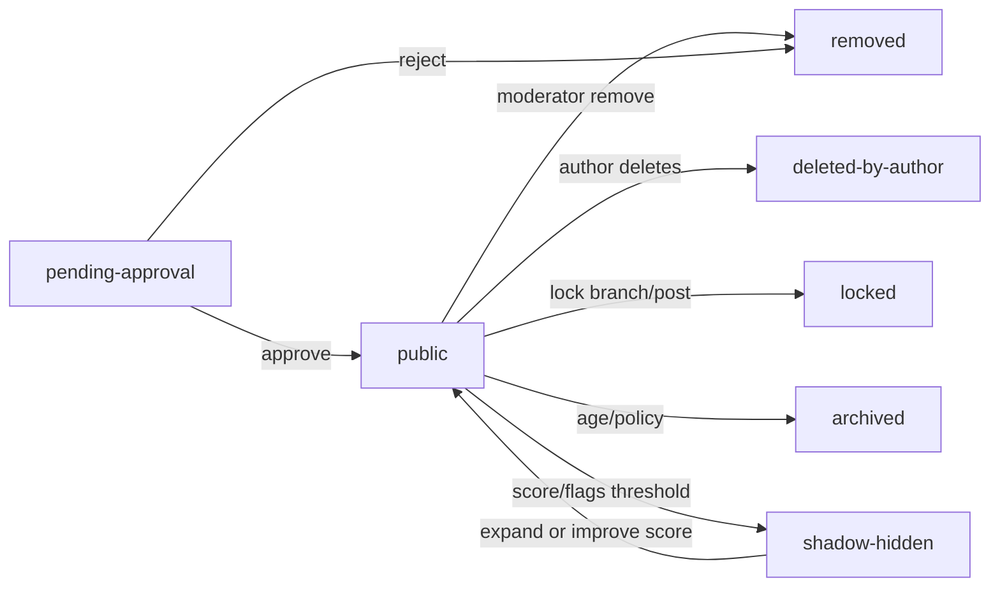
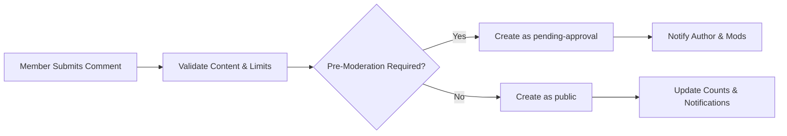
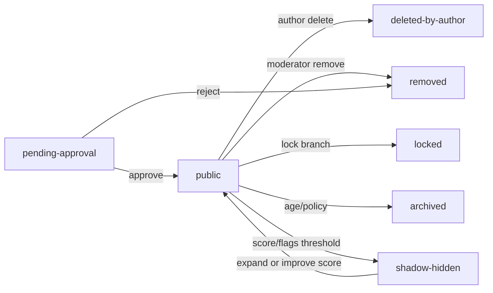
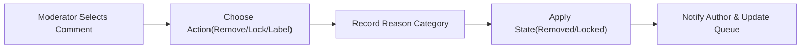
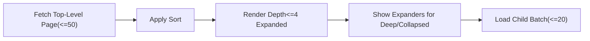

# communityPlatform — Comments and Threads Requirements (Enhanced)

This specification defines WHAT the comment and threaded discussion system must do across communities in business terms. It focuses on user-visible behavior and policy enforcement without prescribing technical implementation (no APIs, schemas, or algorithms). Requirements use EARS format where applicable and align with platform-wide policies.

## 1. Scope and Actors
- Scope: Comment creation, validation, visibility, nesting, editing, deletion, sorting, pagination, mentions, notifications triggers, abuse controls, and performance expectations from a user perspective.
- Out of Scope: Post creation rules (see Posting), detailed voting aggregation formulas (see Voting and Ranking), transport/infra specifics, and UI design.
- Actors:
  - guest: Unauthenticated visitor.
  - member: Authenticated user; can be a moderator in specific communities.
  - moderator: Member with community-scoped moderation powers.
  - admin: Platform administrator with global authority.

EARS scope statements:
- THE comment system SHALL apply uniformly across all community visibility types (public, restricted, private) consistent with access rights.
- THE comment system SHALL respect platform-wide content policy flags (NSFW/Spoiler) when determining preview and visibility.

## 2. Actor Permissions (Comment-Specific)

| Action | guest | member | moderator (in assigned community) | admin |
|---|---|---|---|---|
| View public comments | ✅ | ✅ | ✅ | ✅ |
| View comments in private communities | ❌ | ✅ (where member has access) | ✅ | ✅ |
| Create top-level comment on unlocked post | ❌ | ✅ | ✅ | ✅ |
| Reply to a comment (unlocked branch) | ❌ | ✅ | ✅ | ✅ |
| Edit own comment (within window) | ❌ | ✅ | ✅ | ✅ |
| Delete own comment (soft delete) | ❌ | ✅ | ✅ | ✅ |
| Remove another user’s comment | ❌ | ❌ | ✅ (scope-limited) | ✅ |
| Lock thread or branch | ❌ | ❌ | ✅ (scope-limited) | ✅ |
| Distinguish moderator comment | ❌ | ❌ | ✅ | ✅ |
| Sticky top-level moderator comment | ❌ | ❌ | ✅ | ✅ |
| View removed content (for audit) | ❌ | ❌ | ✅ | ✅ |

EARS permission rules:
- THE comment system SHALL restrict comment-creation actions to authenticated members with posting rights in the target community.
- WHERE a member is banned or muted in a community, THE comment system SHALL deny comment creation and replies within that community.
- WHEN a moderator acts, THE comment system SHALL scope their powers to the communities they moderate.

## 3. Comment Lifecycle and States

### 3.1 State Definitions
- "public": Visible to authorized viewers; interactive if post/thread is unlocked and not archived.
- "pending-approval": Visible to author and moderators/admins while awaiting review (used for pre-moderation policies).
- "removed": Hidden from general viewers due to moderation; visible to moderators/admins for audit; author sees a removal notice.
- "deleted-by-author": Comment body hidden; a tombstone placeholder is shown to preserve thread structure.
- "locked": Readable but not replyable under the locked node (post-level or branch-level lock).
- "archived": Readable but not editable or replyable due to age-based or policy-based archival.
- "shadow-hidden": Soft-suppressed from default views (e.g., below-score threshold) but retrievable on explicit expansion where policy allows.

EARS state rules:
- WHEN a comment enters "pending-approval", THE comment system SHALL restrict visibility to the author and community moderators/admins until approval.
- WHEN a comment is "removed", THE comment system SHALL hide the content body for general viewers and display a removal placeholder with a reason category to the author.
- WHILE a comment is "locked", THE comment system SHALL prevent new replies under that node while preserving visibility.
- WHEN a comment transitions to "archived", THE comment system SHALL disable edits and replies for all actors except admins who may alter state for compliance reasons.
- WHILE a comment is "shadow-hidden", THE comment system SHALL keep it collapsed by default for guests and non-participating members, with an option to expand where policy permits.

### 3.2 State Transitions (Business)

## 4. Creation, Validation, and Nesting

### 4.1 Preconditions and Eligibility
- THE comment system SHALL require a valid, viewable post and a community that permits commenting for the actor.
- WHERE a post is locked or archived, THE comment system SHALL deny new comments and replies with a clear reason.
- WHERE an account is suspended globally, THE comment system SHALL deny comment creation platform-wide.

### 4.2 Validation Rules
- THE comment system SHALL require a minimum of 1 visible character and allow up to 10,000 characters per comment.
- THE comment system SHALL limit distinct URLs to 10 and @mentions to 10 unique users per comment.
- THE comment system SHALL reject disallowed content per platform policy (illegal content, hate, sexual content involving minors) with policy-specific messaging.
- THE comment system SHALL support optional pre-moderation based on account risk signals or community rules, placing comments into "pending-approval".

EARS validation:
- IF a comment exceeds size or link/mention limits, THEN THE comment system SHALL reject submission and enumerate which limits were exceeded.
- WHERE pre-moderation is enabled, THE comment system SHALL place the comment into "pending-approval" and notify the author of expected review windows.

### 4.3 Nesting and Ordering
- THE comment system SHALL support hierarchical replies up to depth 8 beneath the post (level 1 = top-level comment).
- THE comment system SHALL preserve chronological order within the same depth when sort weights are equal.
- THE comment system SHALL auto-collapse levels deeper than 4 on initial render with expand controls.

### 4.4 Creation Flow (Mermaid)

## 5. Editing and Deletion Policies

### 5.1 Editing
- THE comment system SHALL allow authors to edit their comments for 120 minutes from submission.
- WHILE within the edit window, THE comment system SHALL record an "edited" timestamp and show an edited indicator to viewers.
- WHERE a comment is pending moderation, THE comment system SHALL allow the author to edit within the window; the edited comment remains pending until re-evaluated.

EARS editing:
- WHEN a member edits a comment within 120 minutes, THE comment system SHALL save the update and retain an edited marker.
- IF a member attempts to edit after the window, THEN THE comment system SHALL deny the edit and cite the policy window.

### 5.2 Deletion and Removal
- THE comment system SHALL allow authors to soft-delete their comments at any time, replacing text with a tombstone while preserving child replies.
- THE comment system SHALL allow moderators within scope and admins platform-wide to remove comments for policy violations.
- THE comment system SHALL support hard deletion by admins for legal compliance, with audit and retention handled per data lifecycle policy.

EARS deletion/removal:
- WHEN an author deletes a comment, THE comment system SHALL transition it to "deleted-by-author" and display a placeholder (e.g., "[deleted]").
- WHEN a moderator removes a comment, THE comment system SHALL transition it to "removed" and notify the author with a reason category and appeal guidance.

## 6. Sorting and Pagination (Business-Level)

### 6.1 Sort Options
- "best": Prioritizes high-quality recent comments without disclosing formulas.
- "top": Orders by net score descending with deterministic tie-breakers.
- "new": Orders by creation time descending.
- "old": Orders by creation time ascending.
- "controversial": Prioritizes balanced high-engagement items meeting a minimum total votes threshold.

EARS sorting:
- WHEN a user selects "new", THE comment system SHALL order by creation time descending.
- WHEN a user selects "top", THE comment system SHALL order by net score descending and break ties by total votes, recency, then stable ID.
- WHEN a user selects "controversial", THE comment system SHALL include only comments meeting a minimum of 5 total votes and order by disagreement level, then by total votes and recency.

### 6.2 Pagination and Expansion
- THE comment system SHALL return up to 50 top-level comments for the initial load of a post.
- THE comment system SHALL page additional top-level comments and load child batches in increments of up to 20 per expansion.
- THE comment system SHALL present total counts and indicators when more content is available.

EARS pagination:
- WHEN a thread exceeds 50 top-level comments, THE comment system SHALL provide pagination controls for additional pages.
- WHEN expanding a deep branch, THE comment system SHALL fetch up to 20 child comments per expansion action.

## 7. Mentions, Notifications, and Privacy

### 7.1 Mentions
- THE comment system SHALL support @mentions of registered users, limited to 10 unique mentions per comment submission.
- THE comment system SHALL ignore unresolvable usernames for mention notifications without blocking comment submission.

### 7.2 Notifications Triggers (Business-Level)
- WHEN a user receives a direct reply to their post or comment, THE notifications service SHALL create an immediate notification subject to preferences and quiet hours.
- WHEN a user is @mentioned, THE notifications service SHALL create an immediate notification subject to preferences and blocks.
- WHERE a comment is removed or approved after review, THE notifications service SHALL inform the author of the outcome.

### 7.3 Privacy and Access
- THE comment system SHALL hide comments from viewers who lack access to the hosting community (e.g., private communities).
- THE comment system SHALL obey NSFW/Spoiler preferences and mask previews accordingly.
- THE comment system SHALL suppress notifications and direct mentions to/from blocked users.

## 8. Abuse Controls and Rate Limiting

### 8.1 Velocity and Frequency Controls
- THE comment system SHALL limit each member to at most 10 comments per 1-minute window and 60 comments per 10-minute window platform-wide.
- THE comment system SHALL block reposting substantially duplicate comment text by the same author on the same post within 30 seconds.

### 8.2 Visibility Thresholds and Shadow-Hiding
- THE comment system SHALL default-collapse comments scoring below -5 for guests and non-participating members.
- THE comment system SHALL hide by default comments scoring below -10 for guests and non-participating members, retaining expand-on-demand where policy permits.

### 8.3 Pre-Moderation and Risk Controls
- WHERE a member’s account age, karma, or recent behavior indicates elevated risk, THE comment system SHALL queue comments for pre-moderation.
- WHERE coordinated abuse is suspected (e.g., many accounts repeating the same message), THE comment system SHALL reduce per-account limits on the affected post/community and notify moderators via their queue.

### 8.4 Moderator Tools (Boundaries)
- THE comment system SHALL allow moderators to lock post-level threads or specific branches, to distinguish official moderator comments, and to sticky top-level moderator comments.
- THE comment system SHALL prevent moderators from acting outside their assigned communities and SHALL log all actions for audit.

## 9. Error Handling and Edge Cases

EARS user-facing outcomes:
- IF a guest attempts to comment, THEN THE comment system SHALL deny the action and prompt authentication.
- IF a member lacks access to a private/restricted community, THEN THE comment system SHALL deny comment creation and explain access prerequisites.
- IF a post is locked or archived, THEN THE comment system SHALL deny new comments and show the lock/archive state.
- IF validation fails (empty text, too long, too many links/mentions), THEN THE comment system SHALL identify each violated rule in the response.
- IF rate limits are exceeded, THEN THE comment system SHALL deny the action and indicate the next eligible time window.
- IF a parent comment is removed or deleted, THEN THE comment system SHALL preserve child replies and attach them under a placeholder representing the parent.
- IF a user is community-banned or muted, THEN THE comment system SHALL deny commenting in that community and display the sanction scope and duration where policy allows.
- IF a mention target has blocked the author, THEN THE comment system SHALL suppress the mention notification and allow submission unless policy forbids interaction.

## 10. Performance and SLO Expectations (User-Perceived)
- WHEN a member submits a valid comment, THE comment system SHALL confirm success within 2 seconds at p95 under normal load.
- WHEN initially loading a post’s comments, THE comment system SHALL return up to 50 top-level comments with their first 10 children per branch within 1.5 seconds at p95.
- WHEN expanding a collapsed branch, THE comment system SHALL return up to 20 additional children within 1.0 second at p95.
- WHEN switching sort order, THE comment system SHALL update the ordering within 2 seconds at p95.

## 11. Acceptance Criteria (Consolidated EARS)

Creation and validation:
- WHEN a member submits a comment of 10,000 characters with ≤10 links and ≤10 mentions, THE comment system SHALL accept it unless other policy constraints apply.
- WHEN a member submits a comment exceeding limits, THE comment system SHALL reject and enumerate which limits were exceeded.
- WHERE pre-moderation is active, THE comment system SHALL place the comment into pending-approval and notify the author.

Editing and deletion:
- WHEN a member edits within 120 minutes, THE comment system SHALL save the update and show an edited marker.
- IF an edit is attempted after 120 minutes, THEN THE comment system SHALL deny with a clear reason.
- WHEN a member deletes their comment, THE comment system SHALL show a tombstone and preserve child replies.

Sorting and pagination:
- WHEN a user selects "top", THE comment system SHALL order siblings by net score with deterministic tie-breakers.
- WHEN a thread has more than 50 top-level comments, THE comment system SHALL provide pagination.
- WHEN a user expands a deep branch, THE comment system SHALL load up to 20 child comments per expansion.

Abuse controls and visibility:
- WHEN a comment’s score drops below -5, THE comment system SHALL default to collapsed for guests and non-participating members.
- WHEN a comment’s score drops below -10, THE comment system SHALL hide by default for guests and non-participating members while allowing expansion where policy permits.
- WHERE coordinated abuse is suspected, THE comment system SHALL reduce applicable limits and notify moderators.

Notifications and privacy:
- WHEN a user is @mentioned, THE notifications service SHALL notify the user unless blocked or suppressed by preferences.
- WHEN a comment is removed or restored, THE notifications service SHALL notify the author with the outcome.

Performance:
- WHEN loading initial comments, THE comment system SHALL meet the latency targets in Section 10 at p95.

## 12. Mermaid Diagrams

### 12.1 Comment Lifecycle (States)

### 12.2 Moderation Removal Flow

### 12.3 Thread Rendering and Expansion

## 13. Cross-References and Glossary
- See Posting and Content requirements for post-level rules that enable or restrict commenting in communities.
- See Voting and Ranking requirements for score semantics and sort definitions used by comment sorts.
- See Reporting and Moderation Process for removal workflows, reason categories, appeals, and audit.
- See Notifications and Communications for triggers, quiet hours, and user preferences affecting reply/mention notices.
- See Non-Functional Requirements for platform-wide performance, availability, and rate-limiting baselines.
- See Data Lifecycle and Retention for deletion, anonymization, audit log retention, and legal holds.

Glossary:
- Tombstone: Placeholder indicating a deleted comment to preserve thread continuity.
- Shadow-hidden: Business state indicating reduced default visibility while preserving access via explicit expansion.
- Distinguish: Mark a moderator’s comment with a role indicator.
- Sticky: Pin a top-level moderator comment to the top of the comment list for the post.

This document states business requirements only. Implementation details are intentionally unspecified and left to the development team for execution aligned with these rules.