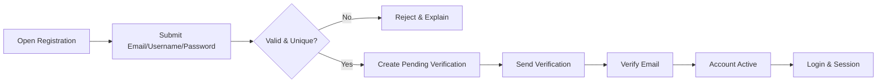
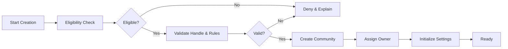
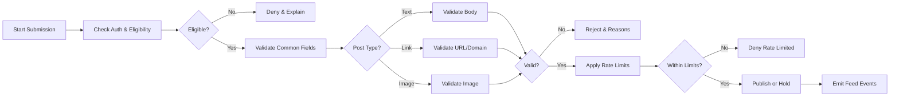
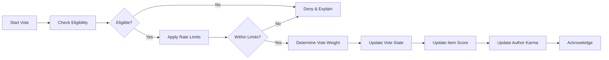
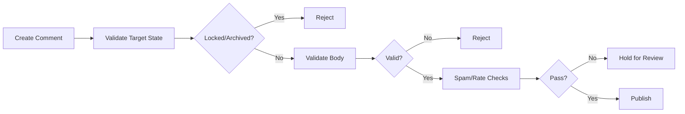
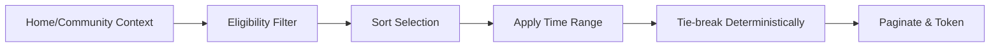
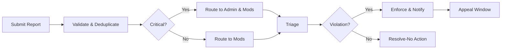
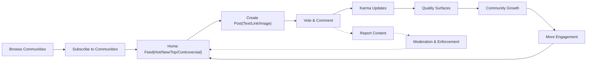

# communityPlatform — Requirements Analysis Report (Business Requirements)

## 1) Title and Scope
communityPlatform enables topic-based communities where members publish posts (text, link, image), vote and comment with nested replies, discover content through transparent sorting (Hot, New, Top, Controversial), subscribe to communities, maintain user profiles with karma, and protect community health via reporting and moderation. Content is stated as business requirements only; implementation details (APIs, schemas, infrastructure) are intentionally excluded.

EARS scope statements:
- THE service SHALL support public communities, restricted/private memberships, and configurable community rules consistent with site-wide policy.
- THE service SHALL allow authenticated users to create communities, publish posts, comment with nesting, vote, subscribe, view profiles, and report inappropriate content.
- WHERE moderation is required, THE service SHALL provide community-scoped and platform-wide enforcement paths with audit logs and appeals.

## 2) Roles and Responsibility Model
Roles (system-wide):
- guestUser: Unauthenticated; read-only access to public content.
- memberUser: Authenticated; can subscribe, post, comment, vote, report, and manage a profile.
- communityOwner: Member who owns a specific community; configures rules; appoints moderators; full local moderation powers.
- communityModerator: Member appointed to moderate within a specific community; scoped moderation powers.
- adminUser: Site-wide safety and governance; can enforce platform policy across all communities.

EARS role guardrails:
- THE platform SHALL restrict guestUser to read-only access on public resources.
- WHERE a user lacks verification or is banned/restricted, THE platform SHALL deny posting, commenting, voting, and community creation accordingly.
- THE platform SHALL scope communityModerator and communityOwner powers to their community; adminUser powers supersede for platform policy.

## 3) Core User Journeys (Overview)
- Browse and read content as a guest; decide to register.
- Register, verify email, log in, and subscribe to communities.
- Create a community with rules; appoint moderators.
- Submit posts (text, link, image) to communities; edit per policy.
- Vote and discuss via nested comments; earn karma.
- Sort feeds by Hot, New, Top, Controversial; paginate predictably.
- View profiles; see posts, comments, and karma per privacy settings.
- Report inappropriate content; moderation and admin enforcement with appeals.

## 4) Global Business Rules and Guardrails
- THE platform SHALL enforce site-wide policies across all communities (e.g., safety, legal) and SHALL allow communities to add stricter rules locally.
- WHERE site-wide policy conflicts with a community rule, THE platform SHALL prioritize the site-wide policy and flag the conflict.
- THE platform SHALL localize user-facing messages, displaying times in the viewer’s timezone preference; absent a preference, THE platform SHALL reasonably infer a timezone and default to Asia/Seoul for system defaults in this project context.
- THE platform SHALL maintain immutable audit records for privileged actions.

## 5) Authentication & Account Lifecycle (Summary)
- THE platform SHALL require unique username and email, password of defined strength, and acceptance of legal terms at registration.
- WHEN a user verifies their email, THE platform SHALL grant full participation privileges per role.
- WHERE an account is locked, deactivated, banned, or pending deletion, THE platform SHALL apply the corresponding restrictions (e.g., deny votes, posts, comments) and present recovery guidance.
- THE platform SHALL allow password reset flows that revoke active sessions on completion.

Mermaid — Sign-up and Login

## 6) Communities: Creation, Settings, Moderation
Creation and Ownership:
- WHEN a verified memberUser submits valid community details (unique handle, display name, description), THE platform SHALL create the community and assign communityOwner to the creator.
- WHERE an account is too new, below karma thresholds, or under restriction, THE platform SHALL deny creation and provide reasons.
- THE platform SHALL allow communityOwner to transfer ownership with recipient acceptance.

Settings and Policies:
- THE platform SHALL support visibility modes: public, restricted, private.
- THE platform SHALL allow owners/moderators to define local rules, labels (NSFW/spoiler policy), post-type allowances, rate limits, and auto-moderation filters (keywords, domain lists, account age gates).
- WHEN rules are updated, THE platform SHALL version and log changes.

Moderation Powers:
- THE platform SHALL allow owners/moderators to approve/remove content, lock/unlock threads, pin posts, manage user sanctions (warn/mute/ban), and manage queues (reported/held submissions).
- WHERE severe policy is implicated, THE platform SHALL enable escalation to adminUser for site-wide action.

Mermaid — Community Creation Flow

## 7) Posting: Text, Link, Image
Eligibility and Limits:
- THE platform SHALL allow posting by verified memberUser and above, subject to community rate limits, post-type allowances, and account trust.
- WHERE a user is banned/restricted in a community, THE platform SHALL deny posting in that community.

Validations:
- Text: THE platform SHALL require 1–40,000 characters.
- Link: THE platform SHALL require http/https URL up to 2,048 characters; domain must not violate policy; duplicates within 30 days per community SHALL be disallowed and referenced.
- Image: THE platform SHALL allow JPEG/PNG/GIF up to 10 MB; minimum 320×320; animated GIFs up to 15 seconds or 10 MB.

Labels and Tags:
- THE platform SHALL support NSFW and Spoiler labels; communities may enforce defaults or prohibit NSFW.
- THE platform SHALL allow up to 5 tags by default; communities may set stricter limits.

States and Transitions:
- THE platform SHALL model states: Active, Locked, Archived, Pending Review, Removed by Moderation, Removed by Admin, Deleted by Author, Legal Hold.
- WHEN a moderator/admin changes state, THE platform SHALL notify the author with categorized reasons and appeal options where applicable.

Mermaid — Post Submission

## 8) Voting & Karma
Eligibility and Limits:
- THE platform SHALL restrict voting to authenticated, verified accounts in good standing with access to the target community.
- THE platform SHALL prevent self-voting and allow one active vote per user per item.
- THE platform SHALL enforce rate limits (per 10 minutes/per day) and reduce limits for low-trust accounts.

Vote Effects & Weights:
- THE platform SHALL support upvote, downvote, and neutral state; default weight ±1.
- WHERE trust is low (e.g., account age < 24h or negative karma), THE platform SHALL cap vote weight (e.g., 0.5 or less) per policy.
- WHERE shadowban is applied, THE platform SHALL set vote weight to 0 without user-visible difference.

Anti-Manipulation:
- WHEN surge patterns suggest brigading, THE platform SHALL apply protective measures (slow/freeze, weight reduction) and flag for review.
- WHEN fraud is confirmed, THE platform SHALL retroactively remove effects on scores and karma and apply sanctions.

Karma Rules:
- THE platform SHALL maintain separate post, comment, and total karma; karma updates SHALL occur within 10 seconds under normal load.
- WHERE content is removed or deleted, THE platform SHALL remove that content’s karma from totals.
- THE platform SHALL track recent karma (rolling 90 days) for trust calculations; historical totals remain visible unless hidden by privacy.

Mermaid — Voting Flow

## 9) Commenting & Nested Replies
Creation and Structure:
- THE platform SHALL allow comments and nested replies within a maximum depth of 8 levels; replies beyond max SHALL attach at max depth with a flag.
- THE platform SHALL deny comments on locked or archived posts/threads.

Editing and Deletion:
- THE platform SHALL allow authors to edit active comments; edits SHALL record timestamps and display an “edited” indicator after 2 minutes.
- THE platform SHALL allow author soft-delete; placeholders remain to preserve thread integrity.

Moderation:
- THE platform SHALL allow owners/moderators to remove or restore comments; reasons SHALL be recorded; placeholders SHALL be shown to general users per policy.
- THE platform SHALL support held-for-review queues based on filters or reports.

Mermaid — Comment Flow

## 10) Feeds & Sorting
Eligibility and Composition:
- THE platform SHALL assemble Community feeds from a single community and Home feeds primarily from subscribed communities, supplementing with safe recommendations when needed.
- THE platform SHALL exclude ineligible content (removed, admin-removed, NSFW without opt-in, muted communities, blocked users).

Sorting Definitions (business rules):
- New: THE platform SHALL order by creation time descending.
- Top: THE platform SHALL order by net approval within selected time ranges (24h, 7d, 30d, 1y, all-time) with minimum net vote thresholds.
- Hot: THE platform SHALL prioritize recent, engaging posts with recency decay; items with fewer than a minimal total vote threshold SHALL be suppressed.
- Controversial: THE platform SHALL prioritize high total votes with near-balanced ratios within a time range and exclude policy-removed items.

Pagination & Determinism:
- THE platform SHALL return deterministic pages (default 25 items) without duplicates across consecutive pages for identical parameters and SHALL provide stable continuation tokens.

Mermaid — Feed Assembly

## 11) Subscriptions & Personalization
- WHEN a member subscribes to a community, THE platform SHALL include its new content in the Home feed within 60 seconds.
- WHEN a member unsubscribes, THE platform SHALL remove future content from that community in Home feeds immediately.
- THE platform SHALL support muting communities (suppresses delivery without unsubscribing) and blocking users (suppresses interactions and visibility where applicable).
- THE platform SHALL cap subscription toggles to prevent abuse and SHALL persist timestamps for audit.

## 12) User Profiles
Visibility and Privacy:
- THE platform SHALL provide Public, Limited, and Private visibility modes; blocked viewers SHALL see the profile as Private regardless of general settings.
- THE platform SHALL allow owners to show/hide subscriptions and activity lists; adminUser override is strictly for enforcement with audit logging.

Displayed Elements:
- THE platform SHALL display username, display name, avatar, bio, join date, and karma (if not hidden) and SHALL paginate authored posts/comments with sort options (new/top).

Performance:
- THE platform SHALL return profile headers within 500 ms p95 and full profiles within 2 seconds p95 under normal load.

## 13) Reporting, Safety & Trust
Reporting:
- THE platform SHALL allow members to report posts, comments, communities, and user accounts; category selection is required; “Other” requires free-text (20–1,000 chars).
- THE platform SHALL deduplicate reports by item+category+reporter within 24 hours and aggregate counts for triage.

Triage & Enforcement:
- THE platform SHALL route community reports to local moderators/owners and critical categories to adminUser as well.
- WHEN enforcement occurs (remove, lock, ban), THE platform SHALL require reason codes, notify affected users, and record audit entries.

Appeals:
- THE platform SHALL allow eligible appeals within defined windows and ensure review by someone other than the original enforcer when possible; overturned decisions SHALL restore content/access and annotate mod logs.

Mermaid — Report Processing

## 14) Nonfunctional Requirements (Business)
Performance & Freshness:
- THE platform SHALL return first-page feed results within 2 seconds p95 and re-rank feeds within 10 seconds of impactful events under normal load.
- THE platform SHALL confirm votes within 400 ms p95 and post/comment submissions within 900–1,000 ms p95 (excluding upload time).

Availability & Reliability:
- THE platform SHALL meet 99.9% monthly uptime for core actions and SHALL provide status updates within 30 minutes of incidents and hourly thereafter until resolved.

Security & Privacy:
- THE platform SHALL protect personal data, mask sensitive elements in logs/errors, and terminate idle sessions per policy.
- THE platform SHALL apply progressive rate limits and verification when abuse signals are detected.

Observability & Auditability:
- THE platform SHALL maintain service metrics, tracing, and immutable audit logs for privileged actions with 12+ months retention where required.

Localization & Timezone:
- THE platform SHALL localize messages and display timestamps in the viewer’s timezone; unsupported locales SHALL fall back to en-US.

## 15) Error Semantics and Recovery
Standardized user-facing outcomes:
- Authentication: AUTH_INVALID_CREDENTIALS, AUTH_EMAIL_NOT_VERIFIED, AUTH_ACCOUNT_LOCKED, AUTH_SESSION_EXPIRED.
- Authorization: PERM_INSUFFICIENT_ROLE, PERM_COMMUNITY_BAN, PERM_SITEWIDE_BAN.
- Posting: POST_VALIDATION_FAILED, POST_DUPLICATE_DETECTED, POST_QUOTA_EXCEEDED, POST_SPAM_SUSPECTED, POST_LOCKED, POST_ARCHIVED.
- Comments: COMMENT_VALIDATION_FAILED, COMMENT_DEPTH_LIMIT, COMMENT_RATE_LIMITED, COMMENT_LOCKED, COMMENT_ARCHIVED.
- Voting: VOTE_SELF_NOT_ALLOWED, VOTE_TARGET_LOCKED, VOTE_RATE_LIMITED.
- Feeds: FEED_EMPTY_FOR_FILTERS, SORT_UNSUPPORTED.
- Subscriptions: SUB_ALREADY_SUBSCRIBED, SUB_NOT_SUBSCRIBED, SUB_LIMIT_REACHED.
- Profiles: PROFILE_PRIVATE, PROFILE_NOT_FOUND.
- Safety: REPORT_INVALID_CATEGORY, REPORT_DUPLICATE_OPEN, REPORT_RATE_LIMITED.
- System: SYS_TEMPORARY_UNAVAILABLE, SYS_TIMEOUT, SYS_UNKNOWN_ERROR.

EARS recovery:
- WHEN rate limits are hit, THE platform SHALL return retry-after guidance in user terms (e.g., minutes to wait).
- WHEN duplicates are detected, THE platform SHALL reference prior items without exposing sensitive information.
- WHEN content is locked/archived, THE platform SHALL clearly state interaction is unavailable.

## 16) Auditability, Data Lifecycle, and Retention (Conceptual)
- THE platform SHALL classify data (personal, content, behavioral, governance, audit) and track ownership and state transitions with timestamps and actors.
- THE platform SHALL support soft-delete states, legal holds, and retention windows (e.g., reports/actions retained ≥12 months; audit logs ≥12 months) and SHALL purge or anonymize beyond maxima absent legal holds.
- WHEN users request export/erasure, THE platform SHALL verify identity, deliver exports within 30 days, and complete erasure/anonymization except where governance data requires retention with severed identifiers.

## 17) Acceptance Criteria Summary and KPIs
Acceptance (samples):
- GIVEN verified memberUser, WHEN posting a valid image within limits, THEN publish succeeds and appears in community feed within 5 seconds.
- GIVEN new account < 24 hours, WHEN casting a vote, THEN vote weight is capped per policy and acknowledged within 400 ms p95.
- GIVEN locked post, WHEN attempting to comment or change vote, THEN system denies with clear business reason.
- GIVEN report in critical category, WHEN submitted, THEN case routes to adminUser immediately and acknowledges within 2 seconds.
- GIVEN subscription toggle, WHEN subscribed/unsubscribed, THEN Home feed reflects change within 60 seconds.

KPIs (illustrative):
- Feed p95 latency ≤ 2 seconds across Hot/New/Top/Controversial.
- Report median resolution (community-level) ≤ 24 hours; severe categories ≤ 1 hour to first action.
- Vote acknowledgment p95 ≤ 400 ms; re-rank within 10 seconds.
- Error-rate budgets and 99.9% monthly uptime for core actions maintained.

## 18) Mermaid Diagrams (Core Flows Consolidated)

End-to-End Value Loop

## 19) Related Requirements Documents
- User roles and permissions: see “User Roles and Permissions Specification”.
- Authentication: see “Authentication and Account Lifecycle Requirements”.
- Communities and moderation: see “Community and Moderation Rules”.
- Posting: see “Posting and Content Requirements (Text, Link, Image)”.
- Voting and reputation: see “Voting and Karma System Requirements”.
- Comments: see “Commenting and Nested Replies Requirements”.
- Feeds: see “Feed Sorting and Discovery Requirements”.
- Profiles and subscriptions: see “User Profiles and Subscriptions Requirements”.
- Safety & trust: see “Reporting, Safety, and Trust Requirements”.
- Nonfunctional: see “Nonfunctional Requirements (NFR)”.
- Errors: see “Exception Handling and Error Model”.

All content above is expressed in business terms using EARS for clarity and testability; no APIs, schemas, or implementation details are prescribed.