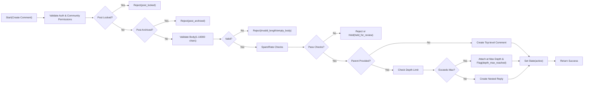
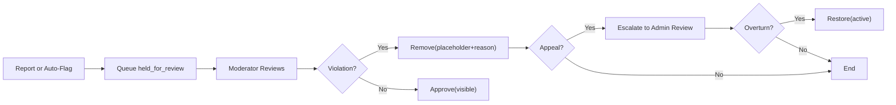
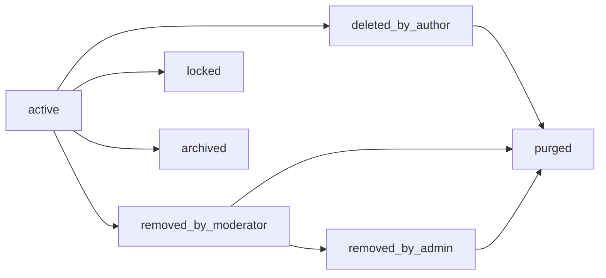
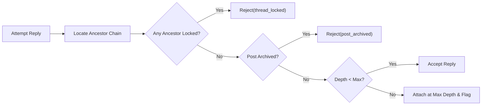

# communityPlatform — Commenting and Nested Replies Requirements

This specification defines business requirements for comment functionality on communityPlatform. It focuses on WHAT the system must do, not HOW to implement it. Technical architectures, API designs, data schemas, or storage choices are intentionally out of scope.

## Scope, Audience, and Non-goals
- Scope: Business behaviors for comments on posts within communities, including creation, validation, nesting, editing/deleting, collapsing hints, locking, archiving, moderation, rate limits, anti-spam, pagination/sorting, performance targets, error semantics, auditing/metrics, and acceptance criteria.
- Audience: Backend developers, trust & safety operators, and service owners.
- Non-goals: UI/UX design, API routes or payloads, database schemas/ERDs, or vendor/tool selection.

## Role Context and Permissions Summary (comment-related)
The following roles exist system-wide and are relevant to comment features: guestUser, memberUser, communityModerator, communityOwner, adminUser.

Permission Matrix (comment-specific, business-level)
- View public comments: guestUser ✅, memberUser ✅, communityModerator ✅, communityOwner ✅, adminUser ✅
- Create comment on unlocked, non-archived post: guestUser ❌, memberUser ✅, communityModerator ✅ (as user), communityOwner ✅ (as user), adminUser ✅ (as user)
- Reply to a comment (within depth limit): guestUser ❌, memberUser ✅, communityModerator ✅ (as user), communityOwner ✅ (as user), adminUser ✅ (as user)
- Edit/delete own comment (soft delete): guestUser ❌, memberUser ✅ (own only), communityModerator ✅ (own only), communityOwner ✅ (own only), adminUser ✅ (own only)
- Remove/restore others’ comments (moderation): guestUser ❌, memberUser ❌, communityModerator ✅ (scoped), communityOwner ✅ (scoped), adminUser ✅ (global)
- Lock comment thread: guestUser ❌, memberUser ❌, communityModerator ✅ (scoped), communityOwner ✅ (scoped), adminUser ✅ (global)
- Approve held-for-review comment: guestUser ❌, memberUser ❌, communityModerator ✅ (scoped), communityOwner ✅ (scoped), adminUser ✅ (global)
- View removed content text: guestUser ❌, memberUser ❌, communityModerator ✅ (scoped), communityOwner ✅ (scoped), adminUser ✅ (global)
- Report a comment: guestUser ❌, memberUser ✅, communityModerator ✅, communityOwner ✅, adminUser ✅

EARS universal role constraints
- THE communityPlatform SHALL deny commenting, replying, voting on comments, and reporting to guestUser.
- WHERE a user is banned, muted, or restricted in a community, THE communityPlatform SHALL deny commenting and replying in that community with a business reason.
- WHERE a post is private or restricted, THE communityPlatform SHALL allow comments only for viewers who meet the community’s access rules.

## Conceptual Data and States (business-level)
Business-level identifiers and linkages (no schemas): a comment belongs to exactly one post and one community; a comment optionally has a parent comment; authorship is one user; comments have scores (from votes) and timestamps; comments have state.

Comment lifecycle states (business semantics)
- active: visible, interactable.
- deleted_by_author: content replaced by placeholder; replies and votes remain; author cannot interact further.
- removed_by_moderator: hidden from general users; placeholder shown; visible to moderators/owners/admins with remove reason.
- removed_by_admin: hidden from all but admins; reasons may include legal or policy.
- locked: no new replies; editing restrictions apply.
- archived: inherited from post archival; no new comments or edits; votes restricted per voting policy.
- held_for_review: temporarily hidden pending moderation review (auto or manual triggers).
- purged: exceptional hard removal (e.g., legal compliance); metadata minimized per governance policies.

## Comment Creation and Validation
EARS requirements
- THE communityPlatform SHALL allow memberUser, communityModerator, communityOwner, and adminUser to create top-level comments on posts that are visible to them and not locked or archived.
- WHERE a parent comment is specified, THE communityPlatform SHALL create a nested reply under that parent within the same post and community.
- THE communityPlatform SHALL require comment body length between 1 and 10,000 Unicode characters after trimming whitespace.
- THE communityPlatform SHALL normalize whitespace (trim leading/trailing spaces, normalize line endings) without altering user-intended content.
- THE communityPlatform SHALL reject comments that contain only whitespace or non-printable characters.
- WHERE a community has posting rules (e.g., banned words, NSFW restrictions), THE communityPlatform SHALL validate comments against those rules and set the enforcement path (allow, held_for_review, or remove).
- IF the target post is locked, THEN THE communityPlatform SHALL reject new comments with business reason "post_locked".
- IF the target post is archived, THEN THE communityPlatform SHALL reject new comments with business reason "post_archived".
- IF the author is banned or restricted in the community, THEN THE communityPlatform SHALL reject comment creation with business reason "author_restricted".
- WHEN a comment is successfully created, THE communityPlatform SHALL timestamp creation and associate it with the author, post, community, and optional parent.
- THE communityPlatform SHALL assign an initial visibility of active unless enforcement rules set held_for_review.
- THE communityPlatform SHALL support optional comment labels (e.g., spoiler) if allowed by community policy; labels inherit behavior from post/community policy.

Validation addenda
- Allowed content: text only; links permitted as plain text; unsafe markup treated as text.
- Link safety: unsafe or disallowed domains per policy cause held_for_review or removal based on community settings.
- Maximum outbound links per comment for low-trust accounts: 5 (configurable by policy layer).

## Nested Replies and Depth Limits
EARS requirements
- THE communityPlatform SHALL support hierarchical comments with a maximum nesting depth of 8 levels (depth 0 = top-level comment).
- IF a user attempts to reply beyond the maximum depth, THEN THE communityPlatform SHALL attach the reply at depth 8 under the deepest valid ancestor and mark with flag "depth_max_reached".
- THE communityPlatform SHALL preserve parent-child relationships and ensure all replies are within the same post and community as their parent.
- THE communityPlatform SHALL return structural metadata for each comment including depth, child count, and whether additional children exist beyond the current page.
- WHERE a parent comment is removed or deleted, THE communityPlatform SHALL retain the nested replies and show a placeholder for the missing parent according to visibility rules.
- WHERE an ancestor comment is locked, THE communityPlatform SHALL deny replies anywhere under that ancestor with business reason "thread_locked".

Conceptual display semantics (for clients)
- Sibling ordering is defined by the chosen sort; structural metadata enables clients to collapse/expand branches without server prescribing UI.

## Editing and Deleting Comments
EARS requirements
- THE communityPlatform SHALL allow comment authors to edit their own active comments at any time unless the comment is in locked, archived, removed_by_moderator, removed_by_admin, held_for_review, or purged state.
- WHEN a comment is edited, THE communityPlatform SHALL update an "edited_at" timestamp and retain an edit history accessible to the author, community moderators/owners for that community, and adminUser.
- WHERE a comment is edited more than 2 minutes after creation, THE communityPlatform SHALL expose an "edited" indicator with the last edited timestamp in user-visible metadata.
- IF a comment is held_for_review, THEN THE communityPlatform SHALL disallow author edits until moderation outcome is determined.
- THE communityPlatform SHALL allow authors to soft-delete their own comments, replacing the body with placeholder "deleted_by_author", retaining timestamps, score, and position in the thread.
- WHERE a comment is soft-deleted by the author, THE communityPlatform SHALL allow undo within 10 minutes, provided the comment has not been locked, archived, or acted upon by moderation.
- IF a comment is soft-deleted, THEN THE communityPlatform SHALL deny new replies under that comment unless a moderator or admin applies a lock override policy.
- THE communityPlatform SHALL prohibit hard deletion by authors; only moderators or admins may purge per governance rules.

Additional business rules
- Editing validation mirrors creation validation (length, rules) and may be rejected on violation.
- Replies to a comment remain intact after the parent is deleted or removed; threading is preserved by placeholders and pointers.

## Collapsing, Locking, and Archiving
Collapsing (client-hint semantics)
- WHERE a comment’s score is less than or equal to -5, THE communityPlatform SHALL mark the comment with a "collapse_hint_low_score" flag.
- WHERE a comment branch exceeds 50 total descendants, THE communityPlatform SHALL mark the top node of that branch with a "collapse_hint_large_branch" flag.
- THE communityPlatform SHALL provide a "replies_truncated" flag when not all children are included in the current page.

Locking
- THE communityPlatform SHALL allow communityModerator, communityOwner, and adminUser to lock a comment thread (at any node), preventing new replies beneath that node by non-privileged users.
- WHEN a comment thread is locked, THE communityPlatform SHALL allow moderators/owners/admins to post official notices if community policy allows.
- IF a post is locked, THEN THE communityPlatform SHALL treat all of its comment threads as locked for replies and editing constraints.

Archiving
- THE communityPlatform SHALL treat comments on archived posts as read-only: no new comments, no replies, no edits for non-privileged users.
- WHERE archival rules are triggered by post age (default 180 days unless overridden by policy), THE communityPlatform SHALL apply archival state consistently to all comments under that post.

## Moderation of Comments
EARS requirements
- THE communityPlatform SHALL enable communityModerator and communityOwner to remove or restore comments within their communities, and adminUser to do so platform-wide.
- WHEN a comment is removed, THE communityPlatform SHALL retain the content and metadata for authorized roles and show a public placeholder (e.g., "removed_by_moderator") per removal actor.
- THE communityPlatform SHALL require moderators to provide a categorical reason (e.g., spam, harassment, off-topic) and optional free-text note stored for audit and appeals.
- WHERE automated filters flag a comment, THE communityPlatform SHALL place it in held_for_review and notify moderators of the queue.
- THE communityPlatform SHALL support escalating a comment from community moderation to adminUser for policy or legal review and record the escalation path.
- THE communityPlatform SHALL record all moderation actions with actor, action, target, reason, and timestamps for audit.

Visibility by state (business semantics)
- active: body shown to all permitted viewers; author/mods/admins see body.
- deleted_by_author: placeholder shown to general viewers; body hidden; author sees confirmation; mods/admins may see body per policy.
- removed_by_moderator: placeholder shown to general viewers; author sees placeholder; mods/owners/admins see original content and reason.
- removed_by_admin: placeholder shown to general viewers; details hidden; admins see body and reason; mods see limited reason where allowed.
- locked/archived: body shown; interactions disabled; eligible roles manage lock/archive.
- held_for_review: hidden from general viewers; visible in queue to mods/admins and optionally the author as pending.
- purged: not listed; minimal metadata for admins only.

Appeals and restoration
- THE communityPlatform SHALL allow authors to request review of removals via the reporting/appeals flow governed by safety & trust policies.
- WHEN a removal is overturned, THE communityPlatform SHALL restore the comment to active and clear any held/removed flags, adjusting logs to link the appeal outcome.

## Rate Limiting and Anti-spam
EARS requirements
- THE communityPlatform SHALL enforce per-user comment creation limits of 20 comments per 10 minutes and 200 comments per 24 hours across the platform.
- WHERE an account is low-trust (account age < 24 hours OR total karma < 10), THE communityPlatform SHALL enforce stricter limits of 5 comments per 10 minutes and 50 per 24 hours.
- THE communityPlatform SHALL enforce a minimum interval of 5 seconds between consecutive comments from the same user.
- THE communityPlatform SHALL block identical comment bodies by the same user on the same post within 2 minutes.
- THE communityPlatform SHALL detect and block mass-duplicate posting of substantially similar content across multiple posts within 10 minutes, placing further attempts into held_for_review.
- WHERE a comment contains more than 5 hyperlinks and the author is low-trust, THE communityPlatform SHALL hold the comment for review.
- WHERE a community has stricter rules configured (e.g., zero links), THE communityPlatform SHALL apply the stricter rule.
- THE communityPlatform SHALL provide business reasons when rate limits or spam rules prevent submission (e.g., "rate_limited", "duplicate_content", "excessive_links").

Abuse mitigation additions
- THE communityPlatform SHALL prevent commenting by users muted, banned, or temporarily restricted in the community.
- THE communityPlatform SHALL throttle users experiencing high volumes of reports on recent comments, subject to trust & safety guidelines, and surface generic messaging without revealing signals.

## Pagination, Sorting, and Performance Expectations
Pagination
- THE communityPlatform SHALL return top-level comments in pages of 20 items by default and allow 10–100 range when configured by policy.
- THE communityPlatform SHALL return replies for a given parent in pages of 20 items by default and allow 10–100 range when configured by policy.
- WHERE more comments exist, THE communityPlatform SHALL indicate continuation via business-level paging tokens or positional hints (no API specifics).

Sorting (business definitions)
- THE communityPlatform SHALL support sorting comments by “top” (highest score), “new” (newest first), “old” (oldest first), and “controversial” (high disagreement). Detailed formulae are out of scope; expected outcomes mirror common community platforms.
- WHERE a sort is not specified, THE communityPlatform SHALL default to “top” for top-level comments and preserve sibling order under the chosen sort.
- WHERE content is locked or archived, THE communityPlatform SHALL exclude new interactions from affecting sort positions after the lock/archive time.

Performance targets
- WHEN a user submits a valid comment, THE communityPlatform SHALL confirm creation within 2 seconds (p95) under normal conditions.
- WHEN retrieving a page of 20 top-level comments with their first 5 replies each, THE communityPlatform SHALL respond within 2 seconds (p95) under normal conditions.
- THE communityPlatform SHALL process moderation actions (remove/restore/lock) within 2 seconds (p95) and reflect changes in subsequent reads.

## Error Handling and User-facing Outcomes (business semantics)
EARS requirements
- IF validation fails (length, whitespace-only), THEN THE communityPlatform SHALL reject the submission with business reason (e.g., "invalid_length", "empty_body").
- IF authorization fails (banned, restricted, insufficient role), THEN THE communityPlatform SHALL reject with a business reason (e.g., "author_restricted").
- IF the target post is locked or archived, THEN THE communityPlatform SHALL reject with the corresponding business reason ("post_locked", "post_archived").
- IF rate limits are exceeded, THEN THE communityPlatform SHALL reject with business reason "rate_limited" and include retry-after guidance in human-readable form.
- IF duplicate or near-duplicate content is detected, THEN THE communityPlatform SHALL reject with business reason "duplicate_content" or place into held_for_review with "spam_suspected".
- IF a comment or ancestor is locked, THEN THE communityPlatform SHALL reject replies with reason "thread_locked".

Recovery guidance (conceptual)
- Users can wait for the retry window, reduce links, or adjust content to comply with rules.
- Moderators can review held_for_review and approve or remove with reason.

## Auditing, Transparency, and Metrics
EARS requirements
- THE communityPlatform SHALL log comment creation, edit, delete, remove/restore, lock/unlock, archival state changes, and label changes with actor and timestamps for audit purposes.
- THE communityPlatform SHALL maintain an immutable history of edits accessible to the author, community moderators/owners for that community, and adminUser.
- THE communityPlatform SHALL expose aggregate metrics per community and globally (e.g., comments/day, removal rates, held_for_review counts) for operational visibility.
- THE communityPlatform SHALL display transparent placeholders and high-level reasons for content unavailability, consistent with trust & safety guidelines.

## Diagrams

Comment Creation and Validation Flow

Moderation Flow for Comments

Comment Lifecycle States (Conceptual)

Reply Eligibility from Ancestors (Deep Lock Check)

## Acceptance Criteria and Success Measures
Functional acceptance (samples)
- GIVEN a visible, unlocked post, WHEN a verified member submits a 10-character comment, THEN the comment SHALL be created as active and visible to eligible viewers within 2 seconds (p95).
- GIVEN a post in locked state, WHEN any user attempts to comment, THEN the attempt SHALL be rejected with business reason "post_locked".
- GIVEN a parent comment at depth 8, WHEN a user replies, THEN the system SHALL attach the reply at depth 8 and flag "depth_max_reached".
- GIVEN a user with account age 6 hours and total karma 5, WHEN that user submits 6 comments in 10 minutes, THEN the 6th attempt SHALL be rejected with business reason "rate_limited".
- GIVEN a comment with 6 hyperlinks from a low-trust account, WHEN submitted, THEN the comment SHALL be placed into held_for_review.
- GIVEN a moderator removes a comment with reason "harassment", WHEN the author views the comment, THEN the author SHALL see a placeholder and a generic reason where policy allows.
- GIVEN a removal is overturned on appeal, WHEN restoration completes, THEN the comment SHALL return to active state and an audit entry SHALL link the appeal to the original action.

Performance acceptance
- Feed of 20 top-level comments with first 5 replies each returns within 2 seconds (p95) under normal load.
- Moderation remove/restore actions reflect in reads within 2 seconds (p95).

Safety and transparency acceptance
- Placeholders and reason categories are shown consistently per state and role visibility.
- Edit history is retained and accessible to authorized roles without exposing sensitive data publicly.

## Dependencies and Relationships with Other Documents
- Posting rules, content labels, and visibility interactions align with [Posting and Content Requirements](./06-communityPlatform-posting-and-content-requirements.md).
- Voting effects on comment score and karma follow the [Voting and Karma System](./07-communityPlatform-voting-and-karma-system.md).
- Comment sorting expectations conform to [Feed Sorting and Discovery](./09-communityPlatform-feed-sorting-and-discovery.md).
- Profile displays for comment activity are defined in [User Profiles and Subscriptions](./10-communityPlatform-user-profiles-and-subscriptions.md).
- Reporting, triage, and enforcement processes integrate with [Reporting, Safety and Trust](./11-communityPlatform-reporting-safety-and-trust.md).
- Performance, availability, and security expectations are elaborated in [Nonfunctional Requirements](./12-communityPlatform-nonfunctional-requirements.md).
- Consistent business error semantics and recovery guidance align with [Exception Handling and Error Model](./13-communityPlatform-exception-handling-and-error-model.md).
- Retention, archival, and purging semantics follow [Data Lifecycle and Governance](./14-communityPlatform-data-lifecycle-and-governance.md).

---
End of business requirements for commenting and nested replies on communityPlatform.