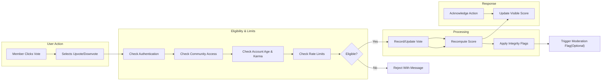
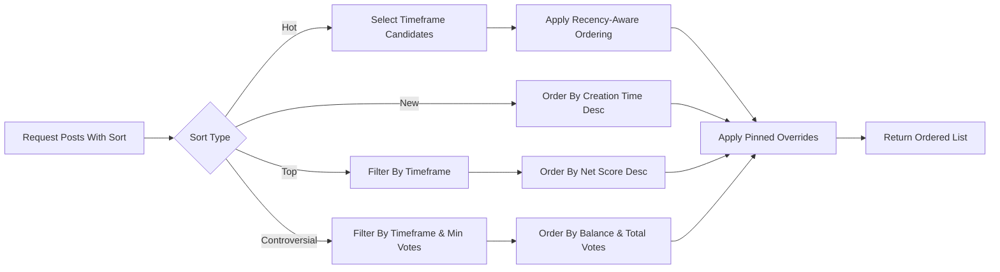

# communityPlatform Voting and Ranking Requirements

## 1. Introduction and Scope
Defines WHAT must happen for voting (upvotes/downvotes) on posts and comments and HOW ranked lists are produced in business terms. Avoids APIs, database schemas, algorithms, or implementation formulas. Aligns with communityPlatform actors, content lifecycle, moderation, and feeds.

Business objectives
- Surface high-quality, relevant content fairly and predictably.
- Resist manipulation (brigading, sockpuppets, automation) while preserving legitimate participation.
- Provide clear, testable rules for user-facing behavior across voting and ranking.

Assumptions
- Actors and permissions are defined in User Actors and Permissions.
- Post and comment lifecycles are defined in Posting and Content Requirements and Comments and Threads Requirements.
- Moderation flows are defined in Reporting and Moderation Process Requirements.

## 2. Terminology and Concepts
- Post: A content item created within a community (text/link/image).
- Comment: A reply to a post or another comment (nested).
- Vote: A member’s signal on a post/comment (upvote = +1, downvote = −1, neutral = none).
- Score: Net result of valid votes at retrieval time (upvotes − downvotes).
- Total votes: Upvotes + downvotes for the item.
- Sort: The ordering logic for lists of posts/comments (Hot, New, Top, Controversial for posts; Top, New, Controversial, Old for comments).
- Timeframe: Business filter window such as Today, This Week, This Month, This Year, All Time; applies to Top and Controversial and may apply to Hot.
- Pinned: Moderator/admin override placing items above ranked lists within scope.
- Locked: Interaction disabled; no new votes/comments.
- Archived: Interaction disabled due to age; no new votes/comments/edits.
- Quarantined: Restricted visibility pending policy review; excluded from public rankings and feeds.

EARS ubiquitous requirements
- THE system SHALL apply voting and ranking rules consistently for all eligible items and actors.
- WHERE content state is locked, archived, removed, or quarantined, THE system SHALL enforce the restrictions defined for that state before evaluating votes or rankings.

## 3. Actors, Eligibility, and Permissions
Actors
- Guest: May view public scores; cannot vote.
- Member: May vote where community access allows and account meets eligibility.
- Moderator (scoped): May lock content in their communities and trigger integrity actions per policy.
- Admin: May enforce platform-wide overrides and invalidations.

Eligibility rules (business)
- THE system SHALL allow only authenticated members to vote on content they are permitted to view.
- WHERE a community is private/restricted, THE system SHALL require membership to vote on its content.
- THE system SHALL prohibit authors from voting on their own posts or comments.
- WHERE content is locked or archived, THE system SHALL prohibit new votes.
- WHERE a user is banned (community/platform) or suspended, THE system SHALL prohibit votes within sanction scope for the duration.

Visibility of scores
- THE system SHALL display vote-derived scores according to visibility rules and masking windows in Section 8.
- WHERE masking applies, THE system SHALL replace precise scores with limited feedback until conditions are met.

## 4. Upvote/Downvote Rules
Casting and changing
- WHEN a member casts an upvote on an eligible item, THE system SHALL record a +1 from that member for that item.
- WHEN a member casts a downvote on an eligible item, THE system SHALL record a −1 from that member for that item.
- WHEN a member removes their vote, THE system SHALL return their contribution to 0 for that item.
- THE system SHALL allow at most one active vote per member per item; changes replace prior state.

Prohibitions and constraints
- THE system SHALL prohibit guest votes and self-votes by authors.
- WHERE content is archived or locked, THE system SHALL reject new voting attempts.
- WHERE sanctions apply, THE system SHALL block voting within the sanction scope.

Business state transitions
- WHEN content transitions to locked/archived, THE system SHALL stop accepting votes immediately.
- WHEN sanctions end, THE system SHALL restore normal eligibility for new votes without retroactive effects unless integrity policies invalidate prior votes.

## 5. Score Aggregation Principles
- THE system SHALL compute an item’s score as net of all valid votes at retrieval time.
- THE system SHALL maintain both net score and total votes as business concepts for ranking and display.
- WHERE moderation invalidates vote sets for integrity reasons, THE system SHALL exclude those votes from net score, total votes, sorts, and karma.
- WHERE content is deleted/removed/quarantined, THE system SHALL exclude it from public rankings, feeds, and karma accrual.
- WHERE accounts are deleted, THE system SHALL anonymize historical votes in aggregates and exclude their influence if later invalidated by integrity decisions.

Acceptance examples
- WHEN 12 upvotes and 5 downvotes are valid for a post, THE system SHALL present net score = 7 and total votes = 17 subject to masking rules.
- WHEN a moderator invalidates 3 upvotes as manipulation, THE system SHALL recompute the net score and total votes excluding those votes.

## 6. Sorting Definitions (Posts)
Determinism and stability
- THE system SHALL ensure sorts are deterministic given the same snapshot and tie-breakers and SHALL apply stable, documented tie-breakers.

Hot (recency-weighted with score emphasis)
- THE system SHALL prioritize higher-scoring recent posts over older posts with similar scores.
- WHERE posts exceed 7 days of age, THE system SHALL de-emphasize them so similarly scored newer posts rank higher by default.
- WHERE timeframe filters are selected, THE system SHALL restrict Hot candidates to that timeframe and order them using recency-aware logic.
- WHERE a post’s net score is below 1, THE system SHALL exclude it from the default Hot list within the Today timeframe.
- WHERE posts are pinned, THE system SHALL place them above Hot results within community scope.

New (chronological)
- THE system SHALL order posts by creation time descending.
- WHERE timestamps match, THE system SHALL break ties by a stable unique identifier.

Top (highest net score within timeframe)
- THE system SHALL order posts by net score descending within the selected timeframe.
- WHERE two posts tie on net score, THE system SHALL break ties by total votes descending, then by most recent creation time, then by a stable unique identifier.
- WHERE no timeframe is selected, THE system SHALL default Top to This Week.

Controversial (high, mixed engagement)
- THE system SHALL include only posts with at least 10 total votes within the selected timeframe.
- THE system SHALL prioritize posts with upvote/downvote balance closest to even; items with ≥ 80% upvotes or ≥ 80% downvotes SHALL rank lower than balanced items.
- WHERE ties remain, THE system SHALL order by higher total votes, then by recency, then by a stable unique identifier.

Timeframe definitions (business)
- Today: rolling last 24 hours.
- This Week: rolling last 7 days.
- This Month: rolling last 30 days.
- This Year: rolling last 365 days.
- All Time: no upper bound.

## 7. Sorting Definitions (Comments)
Top
- THE system SHALL order sibling comments by net score descending; ties break by total votes descending, recency, then a stable unique identifier.

New
- THE system SHALL order sibling comments by creation time descending.

Controversial
- THE system SHALL include only comments with at least 5 total votes within the selected timeframe.
- THE system SHALL prioritize more balanced vote distributions; ties break by total votes, then recency, then stable ID.

Old
- THE system SHALL order sibling comments by creation time ascending.

## 8. Vote Rate Limits and Eligibility Constraints
Account-level eligibility
- WHERE email is unverified, THE system SHALL prohibit downvotes and allow upvotes only after verification.
- WHERE account age < 1 hour, THE system SHALL prohibit all voting.
- WHERE account age < 7 days AND total karma < 20, THE system SHALL prohibit downvotes and allow upvotes.
- WHERE a member is community-banned, THE system SHALL prohibit voting in that community.

Rate limits (per member)
- THE system SHALL allow at most 1 voting action per second instantaneous.
- THE system SHALL allow at most 60 voting actions per minute and 1,000 per 24 hours platform-wide.
- THE system SHALL allow at most 300 votes per 24 hours within a single community.
- WHERE a member toggles votes on the same item more than 3 times within 10 minutes, THE system SHALL block further toggles on that item for 60 minutes.

Content-state constraints
- WHERE a post or comment is older than 180 days, THE system SHALL treat it as archived and prohibit new votes.
- WHERE locked by moderator/admin, THE system SHALL prohibit new votes until unlocked.

User experience
- WHEN a vote is rate-limited, THE system SHALL present remaining wait time accurate to ±5 seconds.

## 9. Anti-Manipulation and Integrity Rules
General integrity
- THE system SHALL count only valid votes from eligible members.
- WHERE unusual voting surges occur inconsistent with community baselines, THE system SHALL throttle voting on the affected content and flag it for moderator review.

Brigading and coordinated behavior
- WHEN a post experiences > 300% increase in voting rate within 30 minutes primarily from non-subscribed members, THE system SHALL flag “suspected brigading” and limit voting to members with account age ≥ 7 days or karma ≥ 50 until cleared.
- WHEN flagged for brigading, THE system SHALL notify community moderators via moderation tools.

Duplicate and sockpuppet voting
- IF multiple prohibited-related accounts vote on the same content within 24 hours, THEN THE system SHALL invalidate those votes and flag accounts for sanctions flow.

Automation and high-frequency activity
- IF > 10 voting actions per second are attempted for 10 consecutive seconds by a member, THEN THE system SHALL halt further voting for 15 minutes and require verification before lifting limits.

Score masking (bandwagon reduction)
- WHILE a post is younger than 2 minutes, THE system SHALL hide exact net score from non-authors and display limited feedback.
- WHILE a comment is younger than 5 minutes, THE system SHALL hide exact net score from non-authors and display limited feedback.
- WHERE integrity flags are active, THE system MAY extend masking windows for the affected items per policy.

Moderator/admin overrides
- WHERE manipulation is verified, THE system SHALL allow invalidation of affected votes, content locking, or stricter local rate limits and SHALL recompute scores and karma accordingly within 60 seconds.

## 10. Visibility Interactions and Edge Cases
Removed or deleted content
- WHEN a post/comment is soft-deleted or removed, THE system SHALL exclude it from public rankings regardless of score.
- WHERE removed for policy, THE system SHALL exclude associated votes from author karma and statistics within 24 hours.

Deleted or banned accounts
- WHEN an account is deleted, THE system SHALL anonymize prior votes and exclude them from future recalculations if later invalidated.
- WHEN an account is banned, THE system SHALL prohibit new votes during ban; existing votes remain unless invalidated by moderation.

Content migrations and transfers
- WHEN a post is moved between communities by authorized action, THE system SHALL preserve its votes and recompute its ranking within the destination community context and timelines.

Pinned and announcements
- WHERE content is pinned, THE system SHALL present pinned content above ranked results within scope until unpinned.

Shadow restrictions
- WHERE shadow restrictions apply per policy, THE system MAY reduce vote impact and default visibility on affected items; any reductions SHALL not be reflected as public penalties but SHALL be auditable by authorized roles.

## 11. Performance, Freshness, and Audit (Business-Level)
Latency and freshness
- WHEN a vote is submitted, THE system SHALL acknowledge within 800 ms at p95 under normal conditions.
- THE system SHALL update visible scores and standard feed rankings within 5 seconds of a vote under normal conditions.
- WHERE integrity or moderation invalidates votes, THE system SHALL reflect updates in scores, sorts, and karma within 60 seconds.

Update cadence
- THE system SHALL compute sort snapshots per request with freshness windows aligned to above targets; Hot ranking may leverage an update cadence of up to 60 seconds without violating correctness.

Auditability
- THE system SHALL record moderation and integrity decisions affecting votes, including invalidations and overrides, with actor, reason, and timestamps, sufficient for appeals.

Observability
- THE system SHALL emit metrics for vote volumes, toggle frequencies, masking windows in effect, and manipulation flags to support policy tuning.

## 12. Mermaid Diagrams

### 12.1 Vote Casting and Validation Flow

### 12.2 Post Ranking Selection (Hot/New/Top/Controversial)

## 13. Acceptance Criteria (Consolidated EARS)
Voting actions
- WHEN a member casts a valid upvote/downvote, THE system SHALL acknowledge within 800 ms p95 and update visible scores within 5 seconds.
- IF a member exceeds vote toggling on the same item more than 3 times within 10 minutes, THEN THE system SHALL block further toggles on that item for 60 minutes and present the next eligible time.
- IF a guest attempts to vote, THEN THE system SHALL deny the action and prompt authentication.
- IF an author attempts to vote on their own item, THEN THE system SHALL deny the action and present a policy notice.

Sorting
- WHEN a user selects Hot, THE system SHALL prefer recent higher-scoring posts and exclude posts with net score < 1 from Today by default.
- WHEN a user selects Top without timeframe, THE system SHALL default to This Week.
- WHEN a user selects Controversial, THE system SHALL restrict candidates to items meeting minimum total votes and rank by balance then total votes then recency.

Integrity and masking
- WHEN a post’s age is < 2 minutes, THE system SHALL mask exact scores for non-authors; WHEN a comment’s age is < 5 minutes, the same SHALL apply.
- WHEN suspected brigading is detected per threshold, THE system SHALL limit voting eligibility to higher-trust members and notify moderators.
- WHEN vote sets are invalidated for manipulation, THE system SHALL recompute scores, sorts, and karma within 60 seconds.

Visibility and states
- WHEN content is removed, deleted, locked, or archived, THE system SHALL exclude it from public rankings and prohibit new votes as applicable.

Performance and audit
- THE system SHALL meet the latency and freshness targets in Section 11 under normal load and SHALL log integrity actions for audit and appeals.

## 14. Related Business Documents
- Posting and Content Requirements (post creation rules, flags)
- Comments and Threads Requirements (nesting, visibility, sorting of comments)
- Subscriptions and Feeds Requirements (feed assembly and sort availability)
- Reporting and Moderation Process Requirements (invalidation, enforcement, escalations)
- User Profile and Karma Requirements (karma effects from votes and invalidations)
- Non-Functional Requirements (platform-wide performance, availability, rate limits)

End of document.