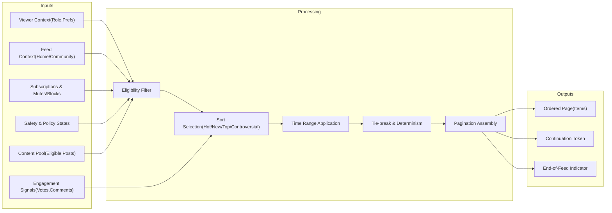
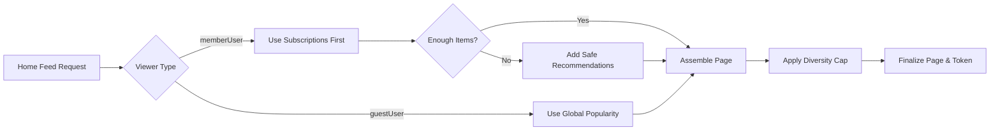
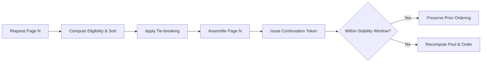

# communityPlatform — Feed Sorting and Discovery Requirements

This specification defines business requirements for assembling, filtering, sorting, paginating, and discovering posts across Home and Community feeds in communityPlatform. It describes WHAT the system SHALL do in business terms without prescribing APIs, databases, algorithms, or infrastructure.

## 1) Scope and Principles
- Scope covers: Home vs Community feed composition; sorting modes (Hot, New, Top, Controversial); time range filters; eligibility and safety gating; pagination and determinism; diversity and redundancy limits; pinned/sticky handling; discovery/recommendations; stability windows; performance and error semantics.
- Non-goals: API shapes, storage schemas, ranking formulas, vendor/tool selection, or UI/visual design.

Guiding Principles
- Relevance: Show content consistent with user permissions, subscriptions, and safety preferences.
- Predictability: Sorting and pagination produce deterministic and testable results.
- Safety-first: Exclude content disallowed by role, policy, or preference; honor quarantines and legal holds.
- Efficiency: Respond within established performance targets and keep feeds fresh after new signals.

## 2) Roles and Access Context
Roles referenced for business constraints:
- guestUser: Unauthenticated viewer; access only public communities and eligible public content.
- memberUser: Authenticated viewer; personalized Home feed from subscriptions and eligible discovery; respects preferences and bans.
- communityModerator/communityOwner: Same viewing rights as memberUser plus privileged access to restricted states within their community where policy allows.
- adminUser: Platform-wide authority; may view restricted states as required for trust & safety.

EARS
- THE feed assembler SHALL evaluate eligibility based on viewer role and community/content policies before sorting.
- WHERE the viewer is guestUser, THE Home feed assembler SHALL source only from publicly visible communities and eligible content.
- WHERE the viewer is memberUser, THE Home feed assembler SHALL prioritize subscribed community content before recommended non-subscribed items.

## 3) Visibility and Eligibility Rules
Eligibility filters apply prior to sorting and pagination.

Content states considered: active, locked, archived, removed_by_moderator, removed_by_admin, deleted_by_author, pending_review, quarantined (community-level), legal_hold.

Viewer preferences considered: NSFW opt-in, spoiler reveal preference, language/region, muted communities, blocked users.

EARS
- THE feed assembler SHALL exclude items the viewer is not permitted to see due to community visibility, bans, or privacy.
- WHERE a post is removed_by_moderator or removed_by_admin, THE feed assembler SHALL exclude it from feeds except where policy grants review visibility to authorized roles.
- WHERE a post is deleted_by_author, THE feed assembler SHALL exclude it from general feeds and avoid placeholders in public feeds.
- WHERE a community is quarantined, THE feed assembler SHALL exclude its posts from Home feeds for guests and for members who have not acknowledged the quarantine unless policy states otherwise.
- WHERE content is labeled NSFW and the viewer has not opted in or is ineligible by age, THE feed assembler SHALL exclude the item from all feeds.
- WHERE the viewer has muted a community or blocked an author, THE feed assembler SHALL exclude corresponding items from that viewer’s feeds.

## 4) Home Feed vs Community Feed
Home Feed (memberUser and guestUser)
- memberUser: Prioritize subscribed communities with optional discovery backfill.
- guestUser: Global popularity and safety-filtered public posts only; no personalization beyond generic session context.

Community Feed
- Posts solely from the selected community honoring viewer permissions and preferences.

EARS
- THE feed assembler SHALL distinguish Home and Community contexts and apply source rules accordingly.
- WHERE subscribed sources are insufficient to fill a page, THE Home feed assembler SHALL backfill with safe, relevant recommendations from non-subscribed communities.
- THE Home feed assembler SHALL apply a diversity cap so that no single community occupies more than 40% of any page when sufficient variety exists.
- THE Community feed assembler SHALL include only posts from the target community that the viewer can access.

Pinned/Sticky and Promoted Placement
- Pinned/Sticky: Community-scoped editorial placement by moderators/owners.
- Promoted: Paid placements labeled clearly as sponsored (business model controlled by policy; not active by default).

EARS
- WHERE a community has pinned posts, THE Community feed assembler SHALL place pinned posts above sorted organic results for that community.
- WHERE a page contains pinned posts, THE Community feed assembler SHALL limit pinned items to at most 3 per page by default and SHALL indicate pinning status.
- THE Home feed assembler SHALL not surface community-level pinned posts unless a platform policy explicitly enables cross-surface pins.
- WHERE promoted placements are enabled by policy, THE feed assembler SHALL clearly separate and label them as sponsored and SHALL not let them displace organic pinned posts.

## 5) Sorting Definitions
Sorting applies after eligibility filtering.

Common expectations
- Deterministic ordering for identical inputs and request parameters.
- Tie-breaking rules applied consistently (see Section 9).

5.1 New
- Definition: Strict reverse chronological order by creation time.

EARS
- THE sorting engine SHALL order items by creation time descending for New.
- WHERE two items share identical creation times at system precision, THE sorting engine SHALL apply tie-breaking.

5.2 Top
- Definition: Highest net approval (positive minus negative votes) within a selected time range.

EARS
- THE sorting engine SHALL order items for Top by approval standing computed within the selected time range.
- WHERE a time range is specified, THE sorting engine SHALL include only items created within that range.
- WHERE two items have equal approval standing, THE sorting engine SHALL apply tie-breaking.

5.3 Controversial
- Definition: High total voting activity with near-balanced polarity within a selected time range.

EARS
- THE sorting engine SHALL prioritize items with high total votes and upvote ratios between 0.3 and 0.7 for Controversial within the range.
- WHERE total voting activity is low, THE sorting engine SHALL rank such items lower than items with higher activity in Controversial.
- THE sorting engine SHALL exclude items removed for policy violations from Controversial.

5.4 Hot
- Definition: Recency-weighted engagement that favors recent items with strong signals; older items decline unless engagement is exceptional.

EARS
- THE sorting engine SHALL prioritize recent items with strong engagement for Hot with age-based attenuation.
- WHILE an item ages, THE sorting engine SHALL reduce its Hot standing unless it continues receiving exceptional engagement.
- THE sorting engine SHALL require a minimum engagement threshold (e.g., at least 3 total votes) before an item appears in Hot.

Edge Cases and States

EARS
- WHERE items are archived, THE sorting engine SHALL preserve their final standing for historical sorts and SHALL not advance them based on new activity.
- WHERE items are locked, THE sorting engine SHALL ignore new comments for Controversial and Hot calculations while preserving allowed vote effects per voting rules.
- WHERE contest mode is enabled for a thread, THE sorting engine SHALL continue accepting votes but MAY hide or delay visible scores without altering underlying ranking acceptance.

## 6) Time Ranges and Windows
Supported ranges for Top and Controversial: past hour, past 24 hours, past week, past month, past year, all time.

EARS
- WHERE a viewer selects Top or Controversial without a range, THE feed assembler SHALL default to past 24 hours for Home and all time for Community.
- THE feed assembler SHALL compute server-side inclusions deterministically while presenting user-facing time boundaries in the viewer’s timezone.
- THE sorting engine SHALL treat ranges as inclusive of the start boundary and exclusive of the next boundary.
- WHERE Hot is selected, THE sorting engine SHALL primarily favor content from the last 48 hours while permitting exceptional older items to appear.

## 7) Pagination and Result Limits
Page composition is deterministic and free of duplicates across a single request sequence.

Limits
- Default page size: 25 items; permitted range: 5–100 items.
- Maximum pagination depth: up to 1,000 items or until pool exhaustion.

EARS
- THE feed assembler SHALL return up to 25 items per page by default and SHALL cap specified sizes at 100 and floor at 5.
- THE feed assembler SHALL ensure items in page N are not repeated in page N+1 for identical parameters within the same sequence.
- THE feed assembler SHALL provide a continuation token that preserves deterministic ordering across pages within a stability window.
- WHEN fewer items than requested remain, THE feed assembler SHALL return remaining items and indicate end-of-feed.

## 8) Discovery and Recommendations
Goals
- Help members and guests discover relevant communities and posts while preserving safety and variety.

Conceptual inputs (non-exhaustive): subscriptions, topical similarity, platform trends, engagement signals, language/region preferences, and safety states.

EARS
- THE discovery engine SHALL exclude content failing safety and policy checks.
- WHERE a memberUser demonstrates consistent interest in a topic, THE discovery engine SHALL consider posts from related communities not yet subscribed to, subject to safety constraints.
- WHERE platform trends indicate high-quality posts, THE discovery engine SHALL consider including representative posts for guest Home feeds.
- THE discovery engine SHALL avoid showing multiple posts with the same canonical external link on the same page.
- THE discovery engine SHALL avoid over-concentration by limiting items from the same non-subscribed community to promote variety.

## 9) Tie-breaking and Determinism
Tie-breaking keys in order until resolved:
1) Primary sort key (per selected sort)
2) Creation time (newest first except for New where it is the primary)
3) Stable unique post identifier

EARS
- THE sorting engine SHALL apply the tie-breaking sequence consistently to ensure deterministic order for identical inputs.
- THE feed assembler SHALL produce identical ordered results for identical request parameters and pools within the stability window.

## 10) Real-time Updates and Stability Windows
User experience goals
- Maintain ordering stability while paginating to prevent reshuffling.

EARS
- WHILE a user paginates within a single request sequence, THE feed assembler SHALL maintain a stability window of at least 5 minutes during which re-ranking does not reorder previously delivered pages.
- WHEN a new sequence starts or the stability window elapses, THE feed assembler SHALL recompute ordering using the latest inputs.
- IF items become ineligible mid-sequence, THEN THE feed assembler SHALL exclude them from subsequent pages without backfilling prior pages.

## 11) Performance and Freshness Targets
Business expectations (see Non-Functional Requirements for broader targets):

EARS
- WHEN a user requests the first page of a feed, THE system SHALL return results within 2 seconds under normal conditions (p50) and within 3 seconds for 95% (p95).
- WHILE paginating, THE system SHALL deliver subsequent pages within 2 seconds p50 and 3 seconds p95.
- WHEN a user votes or comments, THE system SHALL reflect re-ranking effects in relevant feeds within 10 seconds under normal load.
- WHEN a new post is created, THE system SHALL make it eligible in Community feeds within 5 seconds and in Home feeds within 10 seconds.

## 12) Error Handling and Empty States
Business semantics

EARS
- IF no eligible content is available, THEN THE feed assembler SHALL return an empty result with an end-of-feed indicator.
- IF the viewer lacks permission for a community, THEN THE feed assembler SHALL deny access without leaking sensitive details.
- IF a selected time range yields zero results, THEN THE feed assembler SHALL indicate zero results and suggest relaxing filters conceptually.
- IF request rate limits are exceeded, THEN THE system SHALL return a clear rate-limited business message with a recommended retry-after duration.

## 13) User Preferences and Local Defaults
EARS
- THE system SHALL allow members to set a preferred default sort per community (e.g., New) and SHALL honor it on subsequent visits when not explicitly overridden.
- THE system SHALL remember the viewer’s last-used sort and time range per feed context for at least the current session.
- THE system SHALL present user-facing time boundaries and timestamps in the viewer’s selected timezone and locale while evaluating server logic deterministically.

## 14) Diagrams (Mermaid)

Feed Assembly Overview

Home Feed Composition (Members vs Guests)

Pagination and Determinism Flow

## 15) Acceptance Criteria and Success Metrics
Acceptance Criteria
- New: Items appear strictly newest first with deterministic tie-breakers.
- Top: Items appear by net approval within selected range; defaults applied by context; deterministic ties.
- Controversial: Items exhibit high total votes and near-balanced ratios; items removed for policy do not appear.
- Hot: Recent, engaging items rise; aging reduces position absent exceptional engagement; minimum signals enforced.
- Pagination: No duplicates across consecutive pages; deterministic continuation; end-of-feed signaled.
- Diversity: No more than 40% of a page from a single community when the pool allows variety.
- Pinned: Community pinned posts appear above organic results in Community feeds and do not appear in Home unless policy enables cross-surface pins.
- Performance: First page p50 ≤ 2 s and p95 ≤ 3 s; subsequent pages within the same targets.

Success Metrics (Business Examples)
- At least 80% of member sessions see content from ≥ 3 subscribed communities in the first two Home pages under normal conditions.
- At least 90% of first-page Home feed requests complete within 2 seconds p50 and 3 seconds p95 under normal conditions.
- Duplicate rate across consecutive pages for identical parameters ≤ 2%.
- Zero policy-violating posts in guest Home feeds.

## 16) References
- Posting and Content Requirements — content states, labels, and moderation interactions.
- Voting and Karma System Requirements — engagement signals and thresholds.
- Commenting and Nested Replies Requirements — comment activity effects and states.
- User Profiles and Subscriptions Requirements — subscriptions, mutes, blocks, and preferences.
- Reporting, Safety, and Trust Requirements — quarantines, removed states, and visibility.
- Non-Functional Requirements — performance and freshness targets used here.
- Exception Handling and Error Model — user-facing errors and empty-state semantics.
