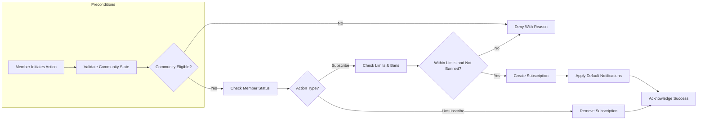
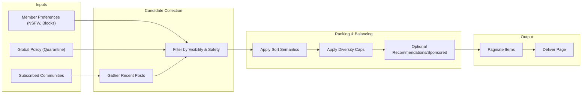

# Subscriptions and Feeds Requirements (communityPlatform)

This document defines business requirements for community subscriptions and feed composition across the platform. It specifies WHAT the system shall do in business terms and does not prescribe HOW to implement it. All technical design and implementation details (architecture, APIs, database design, infrastructure) are at the discretion of the development team.

## 1) Scope and Intent
- Define end-to-end rules for subscribing and unsubscribing to communities.
- Specify home feed and community feed composition, ordering, filtering, and personalization behaviors.
- Establish pagination, freshness, and performance expectations as experienced by users.
- Provide integrity and safety rules that govern eligible content in feeds.
- Exclude UI/visual design, API contracts, database schemas, and infrastructure choices.

## 2) Terminology and Concepts
- Community: A user-created forum where posts are published and moderated, sometimes called a subreddit analog.
- Subscription: A member’s opt-in relationship to receive a community’s posts on the member’s home feed.
- Home Feed: A personalized stream of posts primarily sourced from communities the member subscribes to.
- Community Feed: A stream of posts within a specific community, visible according to community visibility and user permissions.
- Sort Orders: Hot, New, Top, Controversial (see the [Voting and Ranking Requirements](./08-communityPlatform-voting-and-ranking.md)).
- Personalization: Business-level adjustments to a feed based on a member’s preferences and blocks/mutes.
- Visibility State: A post’s display eligibility based on moderation status, user blocks, community rules, and content policy flags (see the [Posting and Content Requirements](./06-communityPlatform-posting-and-content-requirements.md)).
- Guest: Unauthenticated visitor.
- Member: Authenticated user (may be a moderator in some communities).
- Admin: Platform administrator with system-wide oversight.

## 3) Actors and Permission Context (Business-Level)
- Guest:
  - Can view public community feeds and the global “popular” experience where applicable.
  - Cannot subscribe or personalize; cannot access private or restricted content.
- Member:
  - Can subscribe/unsubscribe to communities that allow members.
  - Can view home feed and community feeds per visibility rules.
  - Personalization options apply (e.g., NSFW preferences, blocked users/communities).
- Admin:
  - Can perform compliance oversight actions that affect feed eligibility globally (e.g., quarantines), without altering personal subscriptions of members.

EARS Requirements (permissions):
- THE platform SHALL allow only members to create and manage subscriptions.
- THE platform SHALL allow guests to view only public feeds and the global popular experience where permitted.
- WHERE a community is private or restricted, THE platform SHALL require appropriate membership or invitation before content appears in a feed for that user.
- WHERE a community is quarantined or deindexed by policy, THE platform SHALL exclude its posts from home feeds of non-members and apply policy-specific visibility rules for members.

## 4) Subscribe/Unsubscribe Flows
### 4.1 Business Rules
- Subscription State: Each member has at most one subscription state per community (subscribed or not subscribed).
- Auto-Subscribes: Community creators are auto-subscribed to the communities they create.
- Limits: Platform-level limit on the number of communities a member can subscribe to concurrently: default maximum 2,000 communities per member.
- Rate Limits: Subscriptions and unsubscriptions are rate-limited to deter abuse (see the [Exception Handling and Abuse Prevention](./14-communityPlatform-exception-handling-and-abuse-prevention.md)).
- Notification Defaults: On subscribe, default notification preferences are applied per platform policy; users can later adjust (see the [Notifications and Communications Requirements](./12-communityPlatform-notifications-and-communications.md)).
- Visibility Impact: Unsubscribing removes the community’s posts from the home feed going forward without retroactive deletions of previously viewed items.
- Blocks and Mutes: Blocking a community or user takes precedence over subscription (i.e., blocks exclude content even if subscribed).

EARS Requirements (flows):
- WHEN a member initiates a subscribe action on a community that permits subscription, THE platform SHALL create the subscription immediately and reflect the state change.
- IF a member attempts to subscribe to a community that is at capacity or restricted by policy, THEN THE platform SHALL deny the action with a clear reason.
- WHEN a member initiates an unsubscribe action, THE platform SHALL remove the subscription immediately and exclude future posts from that community in the member’s home feed.
- WHERE limits are exceeded (e.g., more than 2,000 subscriptions), THE platform SHALL prevent additional subscriptions and inform the member of the limit.
- WHEN a creator publishes a community, THE platform SHALL auto-subscribe the creator to that community.
- IF a member is banned from a community, THEN THE platform SHALL revoke or disable the subscription silently and exclude that community’s posts from the member’s home feed.
- IF a community is deactivated or deleted, THEN THE platform SHALL invalidate all active subscriptions to that community and exclude the community from all feeds.

### 4.2 Business Validation
- Community must exist and not be deactivated or globally banned.
- Member must be in good standing (not suspended/banned platform-wide).
- Community-level bans override subscription intent.
- Subscriptions cannot be duplicated.

## 5) Home Feed Composition Rules
### 5.1 Primary Source of Content
- Default Source: The home feed is primarily composed of posts from communities the member is subscribed to.
- Fallback for Zero Subscriptions: If a member has zero subscriptions, the home feed defaults to a global popular feed derived from eligible public content.
- Low-Volume Fallback: If a member’s subscribed communities produce insufficient content for the selected time window, the platform may supplement with recommended content from policy-eligible communities.

EARS Requirements (primary sourcing):
- THE home feed SHALL consist of posts from subscribed communities for the requesting member.
- WHERE a member has no subscriptions, THE home feed SHALL default to a global popular feed compliant with safety and policy filters.
- WHERE subscribed content volume is insufficient, THE home feed MAY include recommended eligible posts as configured by platform policy.

### 5.2 Eligibility and Exclusions
- Visibility: Posts must be visible to the requesting user considering moderation status, community privacy, and account state.
- Safety Policies: NSFW, spoiler, quarantined, or other policy-labeled content must respect the member’s preferences and global policy constraints.
- Blocks/Mutes: Posts authored by blocked users or from blocked communities are excluded.
- Removals: Deleted or removed posts are excluded from feed results; tombstones may appear only where policy requires transparency (see [Reporting and Moderation Process](./11-communityPlatform-reporting-and-moderation-process.md)).
- Duplicates: The same post must not appear multiple times within the same page of the home feed.

EARS Requirements (eligibility):
- THE platform SHALL exclude posts outside the requester’s visibility rights.
- WHERE a member has disabled NSFW in preferences, THE platform SHALL exclude posts marked NSFW.
- IF an author or community is blocked by the member, THEN THE platform SHALL exclude their posts from the member’s home feed.
- IF a post has been removed or deleted, THEN THE platform SHALL exclude it from feed composition.

### 5.3 Diversity and Balance
- Community Concentration Cap: To avoid overrepresentation, no single community should occupy more than 60% of a single page of the home feed by default.
- Recentness Guardrail: The home feed should prefer more recent content within the chosen sort semantics when ties or near-ties occur.

EARS Requirements (diversity):
- THE platform SHALL limit any single community to at most 60% of items on a home feed page, unless the subscribed set contains only one community.
- WHERE only one community is subscribed, THE platform SHALL allow 100% of items to originate from that community.

### 5.4 Sponsored and Recommended Content (Optional)
- Sponsored: Sponsored content appears only where permitted by policy and user consent.
- Recommendations: Recommended posts may be infused up to a configurable cap when subscribed volume is low.

EARS Requirements (optional infusion):
- WHERE sponsored content is enabled and consented, THE platform SHALL cap sponsored items to at most 1 item per 20 organic items in the home feed by default.
- WHERE recommendations are enabled, THE platform SHALL cap recommendations to at most 10% of items per page unless subscribed volume is insufficient.

## 6) Community Feed Behavior
### 6.1 Scope
- Community Feed is the canonical view of a single community’s posts.
- Pinned/Sticky Posts: Communities may mark posts as pinned; pinned items appear above organic lists within the community feed only.

EARS Requirements (community feed):
- THE community feed SHALL show only posts belonging to the selected community and visible to the requesting user.
- WHERE a post is pinned in a community, THE community feed SHALL place the pinned post(s) ahead of non-pinned items, within configured limits (e.g., up to 3 pinned posts).
- THE community feed SHALL honor the selected sort order semantics consistent with platform definitions.

### 6.2 Eligibility and Safety
- Same exclusions as home feed (visibility, blocks, NSFW per preference, removals).
- Community-specific rules may restrict certain content types (see [Posting and Content Requirements](./06-communityPlatform-posting-and-content-requirements.md)).

EARS Requirements (eligibility):
- THE platform SHALL exclude ineligible posts per visibility and safety policies from the community feed.
- WHERE a member is banned from a community, THE community feed SHALL not show that community’s posts to that member.

## 7) Sorting, Filtering, and Personalization (Business-Level)
### 7.1 Sort Orders
- Hot: Business-level popularity adjusted by recency (see [Voting and Ranking Requirements](./08-communityPlatform-voting-and-ranking.md)).
- New: Strict reverse chronological by creation time.
- Top: Highest-scoring content within an optional time window (e.g., day, week, month, year, all).
- Controversial: Content with high disagreement/variance within an optional time window.

EARS Requirements (sort availability):
- THE platform SHALL support Hot, New, Top, and Controversial sort orders for home and community feeds.
- WHERE a time range filter is selected for Top or Controversial, THE platform SHALL restrict candidates to that window before ranking.
- THE platform SHALL implement strictly reverse chronological ordering for New.

### 7.2 Filtering
- Time Range: Past 24 hours, week, month, year, all-time for Top and Controversial.
- Content Flags: NSFW, spoiler, and other policy flags must obey preference controls.
- Source Filters: Allow users to include/exclude individual subscribed communities from their home feed view without altering subscription state (session-scoped or preference-scoped per platform policy).

EARS Requirements (filters):
- THE platform SHALL provide time range filters for Top and Controversial sorts.
- WHERE a member disables NSFW, THE platform SHALL exclude NSFW-marked posts across all sorts.
- WHERE a member hides a subscribed community from the home feed, THE platform SHALL exclude that community’s posts from the home feed while preserving the subscription.

### 7.3 Personalization Rules
- Blocks and Mutes: Take precedence over subscription.
- Hidden Posts: Members may hide individual posts; hidden posts should not reappear in the member’s feed.
- History-Aware De-duplication: Posts previously hidden or dismissed should not be resurfaced unless explicitly unhidden.

EARS Requirements (personalization):
- THE platform SHALL exclude posts from blocked users and blocked communities.
- WHERE a post is hidden by a member, THE platform SHALL suppress it from future feed pages for that member unless unhidden.

## 8) Pagination and Page Size Policies
### 8.1 Page Size
- Default Page Size: 20 items per page.
- Allowed Range: 10 to 50 items per page per user preference.
- Maximum Hard Cap: 100 items per page as a platform hard limit.

EARS Requirements (page size):
- THE platform SHALL return 20 items by default for feed pages.
- WHERE a user-selected page size is between 10 and 50, THE platform SHALL honor it.
- WHERE a requested page size exceeds 100, THE platform SHALL cap the result set to 100 items.

### 8.2 Navigation and Stability
- Stable Ordering: Within a single page request, ordering is stable and consistent with the selected sort semantics.
- Snapshot Consistency: Each page response reflects a consistent snapshot for the purpose of sorting and pagination.
- Refresh Behavior: Refreshing the feed obtains a fresh snapshot and may reorder or replace items according to the selected sort semantics.
- No Duplicates Within a Page: A post must appear at most once per page.

EARS Requirements (navigation):
- THE platform SHALL maintain stable ordering within a page response for a given request.
- WHEN a member refreshes the feed, THE platform SHALL produce a fresh snapshot consistent with sort semantics and current visibility rules.
- THE platform SHALL prevent duplicate appearances of the same post within a single page.

## 9) Performance and Freshness Expectations
- Response Time Targets (business-level): Home feed first page should complete within 2.0 seconds (P50) and 3.5 seconds (P95) under normal load; subsequent pages within 2.5 seconds (P95). See [Non-Functional Requirements](./13-communityPlatform-non-functional-requirements.md) for global targets.
- Freshness: New posts eligible for the selected feed should become visible within 10 seconds of creation under normal conditions for New and within the next ranking update cycle for other sorts.
- Throughput: The system should support frequent home feed refreshes without rate-limit breaches for typical usage (e.g., up to 20 refreshes per minute per member) while applying platform-wide rate limits to deter abuse.

EARS Requirements (performance):
- THE platform SHALL deliver the first page of the home feed within 3.5 seconds P95 under normal load.
- THE platform SHALL surface newly eligible posts in the New sort within 10 seconds under normal conditions.

## 10) Integrity, Abuse Prevention, and Safety Constraints
- Anti-Gaming: Exclude posts and votes identified as manipulative per platform policy; adhere to quarantines and deindexing.
- Rate Limits: Apply rate limits to subscription changes and feed refreshes (business defaults suggested in this document) to deter automation abuse.
- Adult/NSFW Controls: Strictly obey user preferences and applicable policies; do not surface NSFW to users who have it disabled.
- Community and User Sanctions: Respect bans, mutes, and suspensions immediately in feed eligibility calculations.

EARS Requirements (integrity):
- IF a community or user is sanctioned by policy, THEN THE platform SHALL exclude their content from feeds according to the sanction’s scope and duration.
- WHERE suspicious or abusive behavior is detected, THE platform SHALL apply configured suppression rules to affected content in feeds.

## 11) Error Handling and Edge Cases
- Community Deleted/Deactivated: Subscriptions become invalid; feeds exclude content from that community.
- Private Community Without Access: Do not display content; optionally present an access-restricted indication consistent with policy (no content exposure).
- Post Deleted/Removed: Exclude from feeds; where policy demands transparency, show a placeholder only if allowed by policy text.
- Member Suspended: Home feed access may be restricted; no subscription changes permitted during suspension.
- Network/Temporary Failures: Present a clear, retryable error (see [Exception Handling and Abuse Prevention](./14-communityPlatform-exception-handling-and-abuse-prevention.md)).

EARS Requirements (errors):
- IF a member is suspended, THEN THE platform SHALL deny subscription changes and prevent access to personalized feeds until reinstatement.
- IF a requested community does not exist or is deactivated, THEN THE platform SHALL return a clear error on subscribe requests and exclude it from feeds.

## 12) Compliance, Privacy, and Preferences Interactions
- Consent: Sponsored and notification-related behaviors require consent per policy (see [Notifications and Communications Requirements](./12-communityPlatform-notifications-and-communications.md)).
- Privacy Preferences: Respect user controls for NSFW, spoilers, and profile visibility.
- Data Minimization: Only the minimum necessary data for feed eligibility and personalization is used at decision time (business principle; no storage details).

EARS Requirements (privacy):
- WHERE user consent is required for sponsored content, THE platform SHALL refrain from showing sponsored items without explicit consent.

## 13) Visual Diagrams (Mermaid)

### 13.1 Subscribe/Unsubscribe Flow

### 13.2 Home Feed Composition

## 14) Acceptance Criteria and Measurable Success Indicators
- Subscription State Changes
  - WHEN a member subscribes to an eligible community, THE platform SHALL reflect subscribed state immediately and include future posts from that community in the home feed.
  - WHEN a member unsubscribes, THE platform SHALL exclude new posts from that community from the member’s home feed going forward.

- Home Feed Assembly
  - THE home feed SHALL include only posts from subscribed communities or policy-allowed recommendations and sponsored items within caps.
  - WHERE a member has zero subscriptions, THE home feed SHALL default to a global popular feed consistent with safety policies.
  - THE home feed SHALL respect blocks, mutes, NSFW preferences, and visibility constraints consistently across pages.

- Sorting and Filtering
  - THE platform SHALL provide Hot, New, Top, and Controversial sorts for both home and community feeds, with time range filters for Top and Controversial.
  - THE platform SHALL implement strict reverse chronological order for New.

- Pagination
  - THE platform SHALL return 20 items by default per page and allow 10–50 per user preference up to a maximum of 100.
  - THE platform SHALL ensure no duplicates within a page and maintain stable ordering within a page response.

- Performance
  - THE home feed first page SHALL complete within 3.5 seconds P95 under normal load; new posts SHALL appear in New within 10 seconds under normal conditions.

- Safety and Integrity
  - THE platform SHALL exclude content from blocked users/communities, removed/deleted posts, and content disallowed by policy.

References
- See the [Community Management Requirements](./05-communityPlatform-community-management.md) for community ownership and visibility constraints.
- See the [Posting and Content Requirements](./06-communityPlatform-posting-and-content-requirements.md) for post types and flags that affect eligibility.
- See the [Comments and Threads Requirements](./07-communityPlatform-comments-and-threads.md) for comment-related visibility impacts that may affect engagement metrics.
- See the [Voting and Ranking Requirements](./08-communityPlatform-voting-and-ranking.md) for definitions of Hot/New/Top/Controversial.
- See the [User Profile and Karma Requirements](./10-communityPlatform-user-profile-and-karma.md) for how engagement influences reputation.
- See the [Reporting and Moderation Process](./11-communityPlatform-reporting-and-moderation-process.md) for content removals and quarantines.
- See the [Notifications and Communications Requirements](./12-communityPlatform-notifications-and-communications.md) for default notification behaviors following subscription.
- See the [Non-Functional Requirements](./13-communityPlatform-non-functional-requirements.md) for performance baselines and SLOs.
- See the [Exception Handling and Abuse Prevention](./14-communityPlatform-exception-handling-and-abuse-prevention.md) for rate limits and anti-abuse policies.
