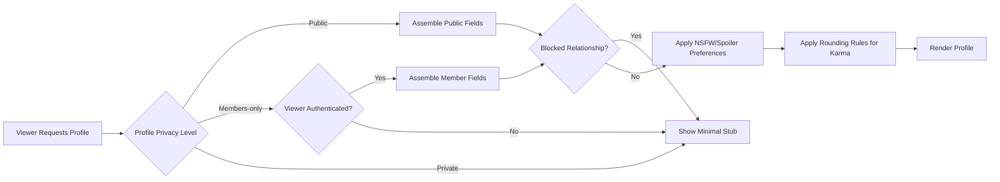
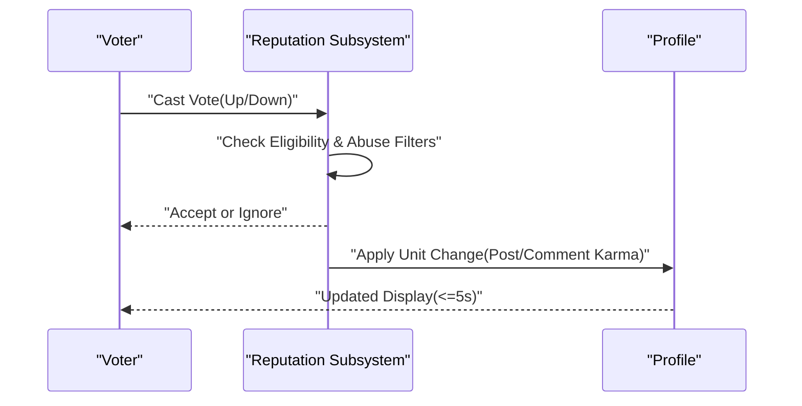
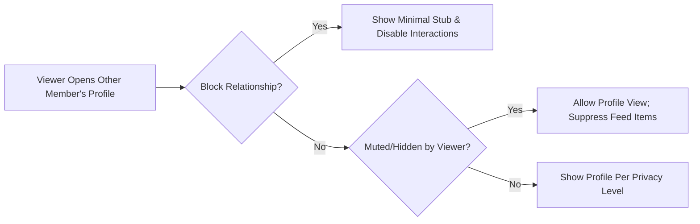

# communityPlatform — User Profile and Karma Requirements

## 1. Scope and Objectives
- Define WHAT the profile and reputation (karma) subsystems must do across visibility, privacy, accrual, display, and usage in feature gating.
- Specify viewer-dependent behavior for guests, members, moderators (community-scoped role), and admins.
- Establish business rules for profile fields, avatar/banner content constraints, karma sources, anti-abuse, and presentation norms.
- Provide testable requirements using EARS with measurable limits and time bounds, remaining implementation-agnostic.

EARS, scope, and compliance guardrails
- THE specification SHALL avoid APIs, storage schemas, algorithms, or implementation details.
- THE specification SHALL use the service prefix communityPlatform consistently and align terminology (profile, karma, NSFW, spoiler, blocked, muted, tombstone, archived).
- THE specification SHALL express normative behaviors using EARS constructs where applicable.

## 2. Definitions and Key Concepts
- Profile: The user-facing identity page for a member including fields, reputation, and authored content listings within visibility rules.
- Karma: A reputation signal derived from valid community votes on authored posts and comments, tracked as post karma, comment karma, and total karma.
- Viewer Types: guest (unauthenticated), member (authenticated), moderator (member with community-scoped role), admin (platform operator).
- Privacy Levels: Public (visible to all), Members-only (visible to authenticated users), Private (visible only to owner and admins).
- Tombstone: Minimal placeholder shown after deletion to preserve thread integrity without exposing original content.
- Quarantine: Restricted-visibility state applied to a community or content for safety review.
- Block: Mutual interaction restriction between two members; suppresses notifications and visibility according to policy.
- Mute/Hide: One-way suppression that reduces feed presence without fully blocking profile access unless combined with block.
- Sensitive Flags: NSFW and Spoiler indicators that control previews and access per user preferences and age/consent.

## 3. User Actors and Viewing Contexts
- guest: May view public profiles and public content in accordance with community visibility; cannot view Members-only or Private profiles beyond a minimal stub.
- member: May view Members-only profiles and public content; may interact (follow, report content) according to platform rules.
- moderator: Within assigned communities, may view moderation-relevant indicators on profile content tied to that community only; no additional access to private profile fields.
- admin: May access audit-relevant fields and visibility necessary for enforcement and compliance according to policy.

EARS
- THE profile system SHALL evaluate visibility based on viewer type and the profile owner’s privacy level before assembling any profile response.
- WHERE a viewer lacks access, THE profile system SHALL return only a minimal stub without revealing private fields or sensitive history.

## 4. Profile Fields and Visibility

### 4.1 Core Identity Fields (Business-Level)
- Username (unique, immutable handle)
- Display name (optional, editable)
- Avatar image (optional)
- Banner image (optional)
- Bio/description (optional text)
- Join date (account creation date)
- Account status badge (e.g., active, suspended, deleted)
- Community affiliation highlights (top 3 communities by recent activity or subscriptions)

EARS
- THE profile system SHALL present only fields permitted by the owner’s privacy level and by viewer permissions.
- WHERE fields are unset, THE profile system SHALL omit them or show a neutral placeholder without implying non-existence of the profile.

### 4.2 Reputation and Activity Indicators
- Total karma; Post karma; Comment karma
- Recent activity summary (last 30 days): counts for posts, comments, received upvotes, received reports (aggregated)
- Badges/achievements (if awarded by policy)

EARS
- WHERE the owner enables “hide totals”, THE profile system SHALL display rounded karma to non-owners and exact values to owner and admins.
- WHERE the profile is Private, THE profile system SHALL suppress activity summaries and badges for non-owners while preserving admin visibility per policy.

### 4.3 Username and Display Name Policy
Business constraints
- Uniqueness and immutability of username; case-insensitive uniqueness; reserved terms (e.g., admin, official) disallowed.
- Display name is user-editable and not required to be unique.

EARS
- THE profile system SHALL enforce case-insensitive uniqueness for usernames and SHALL prohibit usernames containing reserved terms or impersonation risks.
- WHEN a display name is updated, THE profile system SHALL reflect the change immediately and preserve audit history accessible to admins for 2 years.

### 4.4 Avatar and Banner Content Rules (Business-Level)
- Content suitability: no hate symbols, illegal content, or explicit imagery without NSFW gating.
- Sensitive visibility: NSFW imagery not permitted for avatars or banners regardless of user NSFW preference.
- Size and format (business constraints only): up to 1 MB for avatars, up to 3 MB for banners; common image types (JPEG/PNG/GIF) permitted; animated avatars optional per policy.

EARS
- THE profile system SHALL reject avatar/banner images that violate platform policies or exceed business limits and SHALL provide specific reason codes.
- WHERE an image is rejected, THE profile system SHALL preserve prior image if available and show a neutral placeholder if not.

### 4.5 Visibility Matrix by Viewer Type
| Field | guest | member | moderator (in-scope) | admin |
|------|:-----:|:------:|:--------------------:|:-----:|
| Username | ✅ | ✅ | ✅ | ✅ |
| Display name | ✅ | ✅ | ✅ | ✅ |
| Avatar/Banner | ✅ | ✅ | ✅ | ✅ |
| Bio | ✅ | ✅ | ✅ | ✅ |
| Join date | ✅ | ✅ | ✅ | ✅ |
| Account status badge | ✅ (limited) | ✅ | ✅ (in-scope) | ✅ (full) |
| Community highlights | ✅ | ✅ | ✅ | ✅ |
| Karma totals | ✅ (rounded) | ✅ | ✅ | ✅ |
| Activity summary | ❌ | ✅ (aggregated) | ✅ (in-scope) | ✅ (full) |
| Badges/achievements | ✅ | ✅ | ✅ | ✅ |
| Privacy level indicator | n/a | owner-only | owner-only | admin-only |
| Messaging preferences | ❌ | ✅ (if self or allowed) | ❌ | ✅ |

Notes: “In-scope” for moderators applies only to content and indicators for communities they moderate.

EARS
- WHERE the viewer is a guest and the profile is Members-only or Private, THE profile system SHALL show a minimal stub (username and join date, if permitted) with a privacy message.

## 5. Karma System

### 5.1 Components and Sources
- Post karma: net influence from valid votes on posts authored by the member.
- Comment karma: net influence from valid votes on comments authored by the member.
- Total karma: sum of post and comment karma.

EARS
- WHEN a valid upvote is recorded on authored content, THE reputation subsystem SHALL increase the corresponding karma component by one unit.
- WHEN a valid downvote is recorded, THE reputation subsystem SHALL decrease the corresponding karma component by one unit.
- THE reputation subsystem SHALL update the displayed aggregate within 5 seconds for the owner and within 60 seconds for other viewers under normal load.

### 5.2 Eligibility and Anti-Abuse Conditions
- Self-votes do not affect karma.
- Votes from accounts below minimum age thresholds or under sanctions do not affect karma.
- Brigading, sockpuppets, and coordinated manipulation invalidate affected votes for karma and may trigger sanctions.

EARS
- WHERE a voter is the author, THE reputation subsystem SHALL ignore the vote for karma effects.
- WHERE a voter account age is under 72 hours or the account is sanctioned, THE reputation subsystem SHALL ignore the vote for karma.
- WHERE a set of votes is invalidated by moderation or integrity review, THE reputation subsystem SHALL remove the set’s effects from karma within 60 seconds of the decision.

### 5.3 Accrual, Reversals, and Decay vs. Display Totals
- Accrual applies immediately on valid votes; reversals and vote changes adjust karma by ±1 or ±2 as appropriate.
- Historical totals are preserved for display; freshness-sensitive features may use recent karma (e.g., last 365 days) without rewriting displayed totals.

EARS
- WHEN a vote is reversed, THE reputation subsystem SHALL negate the prior unit effect.
- WHEN a vote changes from upvote to downvote, THE reputation subsystem SHALL apply a net change of minus two units; inverse applies for downvote to upvote.
- THE reputation subsystem SHALL compute a separate recent karma signal (last 365 days) for freshness-sensitive feature gates.

### 5.4 Platform Usages and Feature Gates (Default Policy)
- Community creation eligibility: total karma ≥ 50 and account age ≥ 7 days.
- Link posting in communities with stricter policies: total karma ≥ 10.
- Downvote eligibility: total karma ≥ 1 and verified email.
- Moderator application eligibility: total karma ≥ 100 and no active sanctions in last 90 days.

EARS
- WHERE total karma is below the configured threshold, THE platform policies SHALL prevent the gated action and SHALL present a clear reason.

## 6. Profile Content Surfacing

### 6.1 Inclusion and Exclusion Rules
- Include authored posts and comments that remain visible to the viewer under community visibility and content states.
- Exclude content from private communities when the viewer lacks access, and exclude removed/deleted content except tombstones as permitted.

EARS
- WHERE the viewer lacks access to a community, THE profile system SHALL hide content from that community on the profile.
- WHERE content is deleted by the author, THE profile system SHALL show a tombstone to owner and admins and hide it from others.
- WHERE content is removed by moderation, THE profile system SHALL show a removal indicator and reason category to moderators (in-scope) and admins and hide details from unauthorized viewers.

### 6.2 Sorting, Filtering, and Pagination
- Sorts: New (most recent first), Top (highest net score within time range), Controversial (high disagreement).
- Time filters: 24h, 7d, 30d, 365d, All time.
- Pagination: default 20 items per page; maximum 100 items per page.

EARS
- THE profile system SHALL support New, Top, and Controversial sorts and time range filters.
- THE profile system SHALL paginate results with 20 items by default and 100 maximum per page.

### 6.3 Quarantined and Archived Content
- Quarantined content requires explicit consent where allowed; archived content is read-only and may be subject to visibility caps.

EARS
- WHERE a community is quarantined, THE profile system SHALL require explicit user consent before listing associated content.
- WHERE content is archived, THE profile system SHALL present it read-only and SHALL not allow edits or new comments via profile views.

## 7. Privacy Controls and Social Boundaries

### 7.1 Profile Privacy Levels
- Public: Profile fields and public content are available to all viewers.
- Members-only: Profile fields and content available to authenticated members only; guests see minimal stub.
- Private: Full profile visible only to owner and admins.

EARS
- WHEN privacy is set to Private, THE profile system SHALL restrict full profile view to owner and admins and SHALL show a minimal stub to everyone else.

### 7.2 Block, Mute/Hide Behaviors
- Block: Suppresses mutual interactions (replies, mentions, direct messages) and hides profile content lists to the blocked party; public stubs remain.
- Mute/Hide: Suppresses a user’s items in feeds but does not restrict profile access unless combined with block.

EARS
- WHEN member A blocks member B, THE platform policies SHALL prevent B from initiating interactions with A and SHALL hide A’s profile content lists from B, showing only a public stub.
- WHERE a viewer has muted an author, THE profile system SHALL suppress that author’s items in the viewer’s feeds while preserving profile access unless blocked.

### 7.3 Mentions and Visibility Suppression
- Mentions from blocked users are suppressed; mentions from muted users may be suppressed per preference.

EARS
- WHERE a user blocks another user, THE notifications subsystem SHALL suppress mention notifications between them.

## 8. Error Handling and Exceptional States (Business-Level)
- Not found: nonexistent profiles return neutral not-found without PII exposure.
- Private/Members-only: restricted visibility returns minimal stub with reason.
- Suspended: profile shows suspension badge; recent content and interactions are limited.
- Rate-limited: profile actions constrained with retry-after guidance.
- Compliance: NSFW previews redacted unless user opted-in; personal data of others is never exposed.

EARS
- IF a profile does not exist, THEN THE profile system SHALL return a not-found state with no PII.
- IF a viewer is blocked by the profile owner, THEN THE profile system SHALL display a minimal stub and disable interactions.
- WHERE NSFW previews are disabled by the viewer, THE profile system SHALL blur or withhold sensitive previews.

## 9. Performance and Experience Expectations
- Profile read: median ≤ 500 ms; p95 ≤ 1.5 s for cached public data.
- Profile content list: first page median ≤ 1.0 s; p95 ≤ 2.5 s.
- Karma updates reflected on profile within 5 seconds of valid vote; within 60 seconds for other viewers.

EARS
- THE profile system SHALL meet the latency targets above under normal load and SHALL surface degraded-state messaging if targets cannot be met.

## 10. Mermaid Diagrams (Flows)

### 10.1 Profile View Flow

### 10.2 Karma Accrual Flow

### 10.3 Block/Hide Decision Flow

## 11. Acceptance Criteria and Testable EARS Requirements

Visibility and Privacy
- WHERE profile privacy is Public, THE profile system SHALL allow guests to view public fields and content within community access.
- WHERE profile privacy is Members-only, THE profile system SHALL require authentication for full view and SHALL show a minimal stub to guests.
- WHERE profile privacy is Private, THE profile system SHALL restrict full access to owner and admins and show a minimal stub to others.
- WHEN a viewer is blocked by the profile owner, THE profile system SHALL show only a minimal stub and SHALL disable interactions.

Karma Accrual and Usage
- WHEN a valid upvote is cast on a post, THE reputation subsystem SHALL increase post karma by one unit.
- WHEN a valid downvote is cast on a comment, THE reputation subsystem SHALL decrease comment karma by one unit.
- WHEN a vote is reversed or changed, THE reputation subsystem SHALL apply the correct net adjustment and reflect on profile within 5 seconds for the owner.
- WHERE total karma is below configured thresholds for feature gates, THE platform policies SHALL prevent the action and present a reason.

Content Inclusion and Sorting
- THE profile system SHALL include only content visible to the viewer based on community access and content state.
- THE profile system SHALL support sorting by New, Top, and Controversial and SHALL support time range filters.
- THE profile system SHALL paginate with 20 items by default, up to 100 items per page.

Error and Performance
- IF a profile is not found, THEN THE profile system SHALL return a not-found state without PII exposure.
- THE profile system SHALL render public profile reads within 500 ms median and 1.5 s p95 under normal load.
- THE reputation subsystem SHALL reflect karma changes within 5 seconds to the owner and within 60 seconds to other viewers.

Avatar/Banner Constraints
- WHEN a user uploads an avatar that exceeds size limits or violates content policy, THE profile system SHALL reject it and preserve the prior image or show a neutral placeholder with specific reason codes.

Block/Mute and Mentions
- WHEN member A blocks member B, THE platform policies SHALL suppress mentions and replies between them and SHALL hide A’s profile content lists from B.
- WHERE a viewer has muted an author, THE profile system SHALL allow profile viewing and suppress feed items from the muted author.

## 12. Cross-Document References and Constraints Statement
- For actor definitions and permissions, refer to the User Actors and Permissions requirements.
- For moderation and reporting impacts on content visibility and vote invalidation, refer to the Reporting and Moderation Process requirements.
- For posting/content rules that affect profile listings and flags, refer to the Posting and Content requirements and Comments and Threads requirements.
- For ranking and vote semantics used by profile sorting, refer to the Voting and Ranking requirements.
- For notification behaviors (mentions, moderation outcomes) referenced by privacy controls, refer to the Notifications and Communications requirements.
- For platform-wide performance, reliability, security, and compliance targets, refer to the Non-Functional Requirements.
- For deletion, anonymization, tombstoning, and retention, refer to the Data Lifecycle and Retention requirements.

Business-only constraint
- All behaviors stated are business requirements; technical design (APIs, data models, storage, algorithms) is left to the development team within these constraints.
