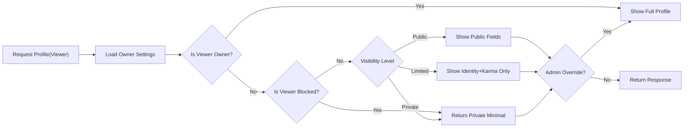
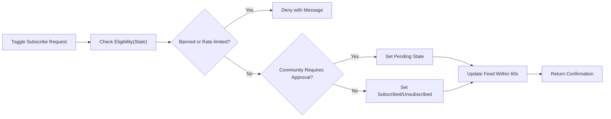
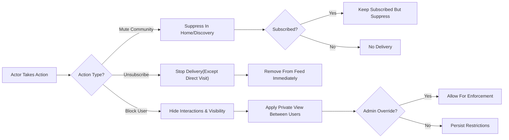
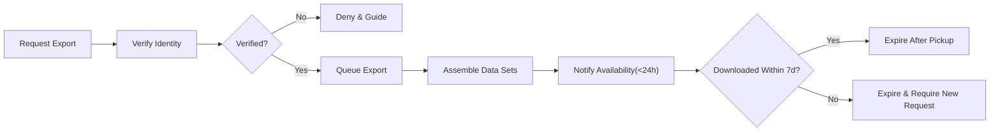

# communityPlatform – User Profiles, Subscriptions, Privacy, Muting, and Blocking (Business Requirements)

## 1) Purpose, Scope, and Principles
- Purpose: Define WHAT communityPlatform must do for user identity surfaces (profiles) and curation mechanics (subscriptions, muting, blocking), including privacy controls and conceptual exports, so backend teams can implement predictable behavior.
- Scope: Business rules only for profile data, privacy and visibility, displayed activity (posts, comments, karma), subscription lifecycle, mute/block semantics, performance targets, error semantics, auditing, and workflows. No technical APIs, schemas, or UI design.
- Principles:
  - THE platform SHALL protect user privacy and safety by default with enforceable, auditable visibility rules.
  - THE platform SHALL provide predictable behavior and clear recovery paths for users across identity and curation features.
  - THE platform SHALL integrate with feeds, voting/karma, moderation, and exception models through clearly referenced business contracts.

## 2) Definitions and Role Context
- Profile: Public-facing identity page of a user summarizing selected attributes and activity.
- Profile Owner: The user whose profile is being viewed.
- Viewer: The entity (guest or authenticated user) requesting to view a profile.
- Visibility Levels: Public, Limited, Private – determine which profile elements are shown.
- Subscription: Opt-in to receive a community’s content in the home feed and lists.
- Mute (Community): Suppression of a community’s content from feeds/recommendations for the user.
- Block (User): Prevents interactions and visibility with another user where policy allows.
- Activity: Posts and comments authored by the profile owner.
- Karma: Reputation points derived from votes per [Voting and Karma System Requirements](./07-communityPlatform-voting-and-karma-system.md).
- Removal State: Content visibility statuses (removed, deleted, archived) per [Posting and Content Requirements](./06-communityPlatform-posting-and-content-requirements.md) and [Commenting and Nested Replies Requirements](./08-communityPlatform-commenting-and-nested-replies.md).
- Roles: guestUser, memberUser, communityOwner, communityModerator, adminUser per [User Roles and Permissions Specification](./03-communityPlatform-user-roles-and-permissions.md).

## 3) Privacy Model and Visibility Levels
### 3.1 Visibility Levels and Owner Controls
- THE communityPlatform SHALL provide owner-selectable profile visibility: Public (default), Limited, Private.
- THE communityPlatform SHALL provide owner toggles for: show/hide aggregate karma, show/hide subscriptions list, show/hide activity (posts/comments), show/hide visible moderation roles.
- THE communityPlatform SHALL allow the owner to set who may view subscriptions: everyone, only authenticated users, only self.
- THE communityPlatform SHALL allow the owner to set who may view activity: everyone, only authenticated users, only self.

### 3.2 Precedence and Overrides
- WHEN block, privacy, and legal/admin overrides interact, THE communityPlatform SHALL apply the most restrictive outcome except where lawful/admin overrides are required for safety and compliance.
- IF the viewer is blocked by the owner, THEN THE communityPlatform SHALL treat the profile as Private to that viewer regardless of other settings.
- WHERE adminUser overrides privacy for enforcement, THE communityPlatform SHALL log the override with who, why, when, and scope, and SHALL limit visibility to enforcement tasks.

### 3.3 Timezone and Localization
- THE communityPlatform SHALL render profile-related timestamps in the viewer’s selected timezone, defaulting to the user’s preference or a sensible default; displays SHALL honor locale formatting as per [Non-Functional Requirements](./12-communityPlatform-nonfunctional-requirements.md).

## 4) Profile Fields and Constraints
### 4.1 Identity and Reputation
- THE communityPlatform SHALL display: username (immutable), display name (mutable), avatar image, bio, join date, and karma summaries (total, post, comment) respecting owner preferences.
- THE communityPlatform SHALL allow display name length 3–40 characters with Unicode letters, numbers, spaces, and basic punctuation (.,-_' ).
- THE communityPlatform SHALL limit bio to a maximum of 300 characters, plain text only with line breaks preserved; URLs permitted as plain text.
- THE communityPlatform SHALL validate avatar content against policy and enforce a maximum size of 5 MB (animated avatars per global policy).

### 4.2 Activity Summaries
- THE communityPlatform SHALL provide recent posts and recent comments lists with configurable sorts (New, Top with ranges, optional Controversial) consistent with [Feed Sorting and Discovery](./09-communityPlatform-feed-sorting-and-discovery.md).
- WHERE content was removed or deleted, THE communityPlatform SHALL display a redacted entry or placeholder as allowed by policy, preserving timestamps and minimal metadata.

### 4.3 Field Editing and Limits
- WHEN the owner edits profile fields (display name, bio, avatar), THE communityPlatform SHALL validate against constraints and SHALL limit successful edits to 10 per hour per account.
- WHEN a policy violation is detected in profile fields, THE communityPlatform SHALL remove or mask the violating field and SHALL notify the owner with reason and recovery steps per [Reporting, Safety, and Trust](./11-communityPlatform-reporting-safety-and-trust.md).

## 5) Role-based Permission Matrix (Business-level)
| Capability | guestUser | memberUser | communityModerator | communityOwner | adminUser |
|---|---|---|---|---|---|
| View public profile elements | ✅ | ✅ | ✅ | ✅ | ✅ |
| View limited/private elements | ❌ | ❌ | ❌ | ❌ | ✅ (for enforcement only) |
| Edit own profile | ❌ | ✅ (self) | ✅ (self) | ✅ (self) | ✅ (self) |
| View a user’s activity list (respecting privacy) | ✅ | ✅ | ✅ | ✅ | ✅ |
| View owner’s subscriptions list (respecting privacy) | IF allowed | IF allowed | IF allowed | IF allowed | ✅ (override) |
| Subscribe/Unsubscribe | ❌ | ✅ | ✅ | ✅ | ✅ |
| Mute communities | ❌ | ✅ | ✅ | ✅ | ✅ |
| Block users | ❌ | ✅ | ✅ | ✅ | ✅ |
| Admin privacy override | ❌ | ❌ | ❌ | ❌ | ✅ (audited) |

Notes: communityOwner and communityModerator have no system-wide profile inspection powers beyond their personal accounts; adminUser overrides are strictly for safety and are auditable.

## 6) Activity Display Rules
- THE communityPlatform SHALL provide two distinct lists on eligible profiles: posts authored and comments authored.
- THE communityPlatform SHALL support sorts: "new" (most recent first), "top" (highest approval within 24h, 7d, 30d, all-time), and "controversial" (where enabled) consistent with [Feed Sorting and Discovery](./09-communityPlatform-feed-sorting-and-discovery.md).
- IF the owner hides activity via privacy, THEN THE communityPlatform SHALL suppress activity to all viewers except the owner and adminUser.
- IF content is from a quarantined or private community, THEN THE communityPlatform SHALL redact sensitive details while preserving permissible placeholders.
- THE communityPlatform SHALL paginate activity with default 20 items per page and SHALL respond within 2 seconds p95 under normal load.

## 7) Subscription Lifecycle
### 7.1 Eligibility and States
- THE communityPlatform SHALL maintain per-user per-community state: not-subscribed, pending (approval required), subscribed, muted, banned (ineligible), and blocked (by community or policy).
- WHERE a community is public, THE communityPlatform SHALL allow any memberUser to subscribe.
- WHERE a community is private or restricted, THE communityPlatform SHALL require approval by community moderators/owner before subscription is active.

### 7.2 Business Rules (EARS)
- WHEN a memberUser subscribes to an eligible community, THE communityPlatform SHALL activate the subscription immediately and SHALL reflect the change in the home feed within 60 seconds.
- IF a memberUser is banned in the community, THEN THE communityPlatform SHALL deny subscription with a business reason and SHALL not create a pending state.
- WHEN a memberUser unsubscribes, THE communityPlatform SHALL stop including new content from that community in the home feed immediately and SHALL retain a timestamped record for audit within retention limits.
- WHERE subscription changes exceed 60 toggles per minute, THE communityPlatform SHALL rate-limit further changes and SHALL communicate cooldown timing.
- WHERE a community requires approval, THE communityPlatform SHALL set subscription to pending and SHALL notify the user upon decision.

### 7.3 Discovery and Diversity
- WHERE the home feed composes content, THE communityPlatform SHALL prioritize subscribed communities and SHALL apply a diversity cap of 40% per community per page when content supply permits per [Feed Sorting and Discovery](./09-communityPlatform-feed-sorting-and-discovery.md).

## 8) Muting and Blocking
### 8.1 Muting Communities
- WHEN a memberUser mutes a community, THE communityPlatform SHALL exclude its posts from the user’s home feed and recommendations while preserving the ability to visit the community directly.
- WHERE the user is subscribed to a muted community, THE communityPlatform SHALL retain subscription state but SHALL suppress delivery in home feed and discovery.
- THE communityPlatform SHALL allow listing and unmuting of muted communities with default pagination of 50 items per page.

### 8.2 Blocking Users
- WHEN a memberUser blocks another user, THE communityPlatform SHALL prevent direct interactions (replies, mentions where applicable, messaging where implemented) and SHALL suppress each other’s content in feeds and profile views consistent with policy.
- IF the viewer is blocked by the profile owner, THEN THE communityPlatform SHALL present the owner’s profile as Private to that viewer.
- WHERE mutual blocks exist, THE communityPlatform SHALL hide each party’s profile details and activity from the other.

### 8.3 Precedence and Conflict Resolution
- THE communityPlatform SHALL apply the most restrictive outcome among: profile privacy settings, muting, blocking, community visibility (private/quarantined), and legal/admin holds.
- WHERE adminUser views content for enforcement, THE communityPlatform SHALL allow necessary access and SHALL audit the override.

## 9) Data Export and Portability (Conceptual)
- WHEN a memberUser requests a profile and subscriptions export, THE communityPlatform SHALL include: profile fields (identity, bio, avatar reference), privacy settings, list of subscribed communities with timestamps, list of muted communities, list of blocked users, and summary counts of posts/comments/karma.
- THE communityPlatform SHALL provide exports within 24 hours under normal load and SHALL make them available for secure download for 7 days.
- THE communityPlatform SHALL throttle exports to one active export at a time and at most one completed export every 7 days per user.

## 10) Performance, Rate Limits, and Propagation
- THE communityPlatform SHALL respond to profile header requests within 500 ms p95 and full profile (with visible activity preview) within 2 seconds p95.
- THE communityPlatform SHALL paginate: activity lists at 20 items/page; subscriptions, muted communities, and blocked users lists at 50 items/page.
- THE communityPlatform SHALL reflect subscription state changes in the home feed within 60 seconds and profile privacy updates within 60 seconds globally under normal load.
- THE communityPlatform SHALL enforce abuse protections: 60 subscription toggles/minute, 30 profile activity fetches/minute, 10 profile edits/hour.

## 11) Error Handling and Recovery (Business Semantics)
- IF a profile does not exist or is deleted, THEN THE communityPlatform SHALL return PROFILE_NOT_FOUND with a neutral message and no PII.
- IF a profile is deactivated, THEN THE communityPlatform SHALL indicate limited availability and suppress activity and subscriptions to non-admin viewers.
- IF subscriptions visibility is hidden by the owner, THEN THE communityPlatform SHALL deny visibility with PROFILE_PRIVATE or a specific privacy key and SHALL explain that visibility is restricted.
- IF a user is banned from a community and attempts to subscribe, THEN THE communityPlatform SHALL return PERM_COMMUNITY_BAN with appeal guidance where allowed.
- IF rate limits are exceeded, THEN THE communityPlatform SHALL return a rate-limited error (e.g., SUB_LIMIT_REACHED or PROFILE_RATE_LIMITED) with earliest retry guidance.
- IF a block prevents viewing a profile, THEN THE communityPlatform SHALL present the Private view without leaking block existence beyond minimal necessary messaging.

Error keys and semantics align with [Exception Handling and Error Model](./13-communityPlatform-exception-handling-and-error-model.md).

## 12) Security, Audit, and Compliance Hooks
- THE communityPlatform SHALL honor least-privilege: communityOwner/communityModerator have no additional access to private profile data beyond their own accounts.
- THE communityPlatform SHALL audit: profile edits, privacy setting changes, subscription toggles, mute/unmute actions, block/unblock actions, admin overrides, and export requests/completions.
- THE communityPlatform SHALL retain audit records per [Data Lifecycle and Governance](./14-communityPlatform-data-lifecycle-and-governance.md) and SHALL minimize PII in logs.
- WHERE a legal hold applies, THE communityPlatform SHALL suspend deletion of relevant records and SHALL record the hold metadata.

## 13) Workflows and Diagrams (Mermaid)

### 13.1 Profile Visibility Decision Flow

### 13.2 Subscription Toggle Flow

### 13.3 Mute vs Unsubscribe vs Block Precedence

### 13.4 Profile and Subscriptions Export Flow

## 14) Acceptance Criteria and Success Measures
### 14.1 Functional Acceptance
- WHEN a profile is set to Private, THE platform SHALL return only username and a privacy notice to non-owners and non-admins.
- WHEN a memberUser subscribes to a public community, THE platform SHALL show new content from that community in the home feed within 60 seconds.
- WHEN a memberUser mutes a subscribed community, THE platform SHALL suppress that community from the user’s home feed without removing the subscription.
- WHEN a memberUser blocks another user, THE platform SHALL hide each party’s content and profile details from the other.
- WHEN an admin override is used to view a Private profile, THE platform SHALL log who, when, why, and scope of access.

### 14.2 Performance Acceptance
- Profile header requests SHALL complete within 500 ms p95; full profile with visible activity SHALL complete within 2 seconds p95 under normal load.
- Subscription toggles SHALL be reflected in feeds within 60 seconds under normal load.
- Export jobs SHALL complete within 24 hours for average profile sizes under normal load.

### 14.3 Integrity and Safety Acceptance
- Privacy settings SHALL be enforced consistently across profile views, feeds, and discovery surfaces 100% of the time in acceptance testing.
- Blocks and mutes SHALL apply precedence rules consistently with no leaks of private details.
- All privacy overrides by adminUser SHALL be recorded with immutable audit entries.

## 15) References to Related Specifications
- Roles and permissions: [User Roles and Permissions Specification](./03-communityPlatform-user-roles-and-permissions.md)
- Authentication and account states: [Authentication and Account Lifecycle Requirements](./04-communityPlatform-authentication-and-account-lifecycle.md)
- Community governance: [Community and Moderation Rules](./05-communityPlatform-community-and-moderation-rules.md)
- Posting rules: [Posting and Content Requirements](./06-communityPlatform-posting-and-content-requirements.md)
- Voting and reputation: [Voting and Karma System Requirements](./07-communityPlatform-voting-and-karma-system.md)
- Comments and threads: [Commenting and Nested Replies Requirements](./08-communityPlatform-commenting-and-nested-replies.md)
- Feeds: [Feed Sorting and Discovery Requirements](./09-communityPlatform-feed-sorting-and-discovery.md)
- Safety and trust: [Reporting, Safety, and Trust Requirements](./11-communityPlatform-reporting-safety-and-trust.md)
- Non-functional expectations: [Non-Functional Requirements](./12-communityPlatform-nonfunctional-requirements.md)
- Exceptions: [Exception Handling and Error Model](./13-communityPlatform-exception-handling-and-error-model.md)
- Data lifecycle: [Data Lifecycle and Governance Requirements](./14-communityPlatform-data-lifecycle-and-governance.md)

---
Business requirements only. Technical implementations (architecture, APIs, database designs, infrastructure, or UI wireframes) are intentionally excluded. Developers have full autonomy to realize these outcomes.