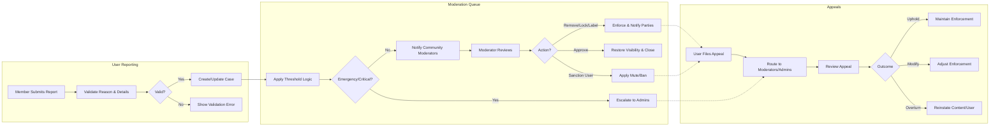
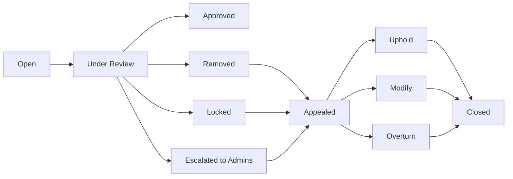

# communityPlatform Reporting and Moderation Process Requirements

This document specifies business requirements for reporting, moderation, escalation, appeals, and transparency within the communityPlatform service. It defines WHAT the system must do in business terms and does not prescribe technical implementations, APIs, database schemas, or UI layouts. All technical implementation decisions, including architecture, APIs, storage design, and transport mechanisms, are at the discretion of the development team.

## 1) Introduction and Scope

The reporting and moderation capability upholds community safety and policy compliance across posts and comments in communities. It enables members to report inappropriate content, moderators to review and act within their communities, and platform administrators to handle escalations and enforce platform-wide policies. This document covers:
- Reportable content types and valid report reasons
- How users submit reports and how the system ingests, aggregates, and prioritizes them in business terms
- Moderator workflows and available actions
- Escalation triggers and platform administrator actions
- Appeal rights and processes for content owners and sanctioned users
- Auditability and transparency obligations, balancing privacy and due process

Business Objectives:
- Protect users from harmful content while preserving legitimate expression
- Provide consistent, fair, and timely enforcement
- Ensure due process through notifications and appeal mechanisms
- Maintain auditable trails and transparent aggregate reporting

Assumptions:
- Actor roles exist: guest, member, community-level moderator (designated member), and platform admin. Refer to [User Actors and Permissions](./03-communityPlatform-user-actors-and-permissions.md).
- Reportable entities in scope: posts and comments; community-level actions apply to communities as containers; user sanctions apply to user accounts in scope of a community or globally.

## 2) Reportable Content and Reasons

### 2.1 Reportable Entities
- Posts (text, link, image) within a community
- Comments and nested replies attached to posts
- Communities as a whole for systemic issues (e.g., rule evasion, widespread policy violations) for admin review

### 2.2 Standard Report Reasons

Each report requires a single primary reason and optional free-text details capped for brevity and safety.

| Reason Category | Definition (Business) | Default Severity | Examples |
|-----------------|-----------------------|------------------|----------|
| Spam | Unsolicited promotional or repetitive content | Medium | Link farms, repeated ads |
| Harassment/Abuse | Targeted insults, threats, bullying | High | Slurs, direct threats |
| Hate | Dehumanizing or violent content against protected groups | Critical | Calls for violence, slurs targeting protected classes |
| Sexual Content (Adult) | Pornographic or explicit sexual content | Medium | NSFW images |
| Sexual Content (Minors) | Sexual content involving minors or sexualization of minors | Emergency | Any sexual content involving minors |
| Graphic Violence | Gore or explicit violence | High | Violent images |
| Self-Harm/Suicide | Expressions of self-harm intent or instructions | Critical | Suicide notes, instruction |
| Personal Information (Doxxing) | Sharing private personally identifiable information | Critical | Home address, phone |
| Illegal Activity | Content facilitating or celebrating illegal acts | High | Selling drugs, how-to illegal instructions |
| Copyright/Trademark | IP infringement claims | Medium | Unauthorized reproductions |
| Off-Topic/Rule Violation | Violates community-specific rules | Low | Wrong flair, off-topic |
| Mislabeling NSFW/Spoiler | Missing or incorrect content flags | Low | Spoilers without tag |
| Impersonation | Pretending to be another person/entity | High | Fake official posts |
| Other | Not covered above; requires details | Variable | Context-specific |

Validation rules for report payloads:
- THE reporting feature SHALL require a selected reason from the supported categories.
- THE reporting feature SHALL allow optional free-text details up to 1,000 characters with profanity and PII filters applied.
- THE reporting feature SHALL capture whether the reporter is a community member or subscriber for prioritization.

Privacy and safety constraints:
- THE reporting feature SHALL keep the reporter anonymous to other users and to the content owner.
- WHERE the reporter consents to follow-up, THE reporting feature SHALL allow moderators to send templated messages without exposing reporter identity.

## 3) Reporting Flow and Thresholds

### 3.1 Submission and Acknowledgment
- WHEN a member submits a report on a post or comment, THE system SHALL record the report with timestamp, reason, and reporter identity.
- WHEN a report is successfully submitted, THE system SHALL acknowledge submission to the reporter within 1 second perceived time with a confirmation message.
- IF report submission fails due to validation, THEN THE system SHALL present clear errors and preserve entered text for resubmission.

### 3.2 Aggregation and De-duplication
- THE system SHALL aggregate multiple reports for the same entity into a single case with a cumulative view of reasons and reporter counts.
- THE system SHALL count only unique reporters per entity towards thresholds.
- WHERE the same reporter files multiple reports on the same entity, THE system SHALL retain only the most recent report and reason for threshold calculations.

### 3.3 Auto-Action Thresholds (Business-Level)
- WHEN an entity receives 5 unique reports from members of the hosting community within 60 minutes, THE system SHALL soft-hide the entity from non-subscribed users and from community listing pages pending review.
- WHEN an entity receives 10 unique reports from members of the hosting community within 24 hours, THE system SHALL place the entity into "Under Review" state and remove it from default feeds pending moderation.
- WHERE a report reason with severity Critical or Emergency is present, THE system SHALL immediately mark the entity "Under Review" and surface the case at the top of the moderator queue.
- WHILE an entity is "Under Review", THE system SHALL continue counting new reports but SHALL NOT apply additional automated visibility changes beyond those defined above.

### 3.4 Reporter Rate Limits and Abuse Prevention
- THE system SHALL limit each member to a maximum of 10 report submissions per 24 hours across the platform.
- IF a member exceeds daily report limits, THEN THE system SHALL block further reports and inform the member of the limit reset time.
- WHERE a member’s reports are repeatedly rejected as bad-faith (e.g., 20 rejected reports in 30 days), THE system SHALL flag the account for moderator review and potential sanctions under platform abuse policies.

### 3.5 Timeliness and SLAs (Business Expectations)
- THE system SHALL notify community moderators of new Critical/Emergency cases immediately and standard cases within 5 minutes of submission.
- THE system SHALL aim for initial moderator triage within 24 hours for standard cases and within 1 hour for Critical/Emergency cases.
- IF no moderator action occurs within 48 hours on a case in "Under Review", THEN THE system SHALL escalate the case to platform admins.

## 4) Moderator Queue and Actions

### 4.1 Queue Intake and Prioritization
- THE system SHALL present a single case per entity with aggregated reports, showing counts by reason category in business terms for prioritization.
- THE system SHALL prioritize cases by (1) severity (Emergency > Critical > High > Medium > Low), (2) recency, and (3) volume of unique reports.
- WHERE multiple cases tie on priority, THE system SHALL break ties by oldest untriaged timestamp first.

### 4.2 Moderator Eligibility
- THE system SHALL allow community-designated moderators to review and act only within their assigned communities.
- THE system SHALL prevent non-moderator members from accessing the moderation queue.
- WHERE a community has no active moderators, THE system SHALL route all cases to platform admins.

### 4.3 Available Moderator Actions (Community Scope)
- Approve: THE system SHALL allow moderators to approve content and clear report flags.
- Remove: THE system SHALL allow moderators to remove content from public visibility within their community.
- Lock Discussion: THE system SHALL allow moderators to close further comments on a post while retaining existing content.
- Distinguish/Label: THE system SHALL allow moderators to add or correct content flags (e.g., NSFW, Spoiler) and community-specific rule labels.
- Warn User: THE system SHALL allow moderators to issue a formal warning to the content owner for community rule violations.
- Mute User (Community): THE system SHALL allow moderators to mute a user from posting or commenting in the community for 1 day, 7 days, 30 days, or permanently.
- Ban User (Community): THE system SHALL allow moderators to ban a user from the community for 1 day, 7 days, 30 days, or permanently.
- Sticky Moderator Note: THE system SHALL allow moderators to attach a visible note explaining the action taken, visible to the content owner and community members where appropriate.

Constraints and safeguards:
- IF content is removed, THEN THE system SHALL preserve a tombstone marker visible to moderators and admins indicating removal reason category.
- IF a user is muted or banned, THEN THE system SHALL inform the user of scope and duration.
- WHERE removal is due to mislabeling, THE system SHALL prefer correction of labels over removal when appropriate.

### 4.4 Outcomes and State Transitions
- Approved: THE system SHALL return content to standard visibility and close the case.
- Removed: THE system SHALL keep content non-public; comments under removed content SHALL remain hidden in standard views unless otherwise required; moderators may optionally remove an entire thread where necessary.
- Locked: THE system SHALL prevent new comments but retain existing content; the case may remain open or close depending on moderator choice.
- Sanction Applied: THE system SHALL record sanctions with start and end times, scope, and reason category.

### 4.5 Communication and Due Process
- WHEN a moderator action is taken, THE system SHALL notify the content owner of the action, reason category, and applicable appeal window without exposing reporter identity.
- WHEN a moderator rejects the reports and approves content, THE system SHALL notify the reporters that their report led to a review and the case is closed, without disclosing moderator identities beyond role.

## 5) Escalation to Platform Admins

### 5.1 Automatic Escalation Triggers
- WHEN a report includes Emergency categories (e.g., sexual content involving minors), THE system SHALL immediately escalate to platform admins and place the content in "Under Review" with maximum priority.
- WHEN no moderator action occurs within 48 hours on a case in "Under Review", THE system SHALL escalate the case to platform admins.
- WHERE repeated violations by the same user occur across multiple communities (3 or more enforcement actions within 30 days), THE system SHALL escalate subsequent cases to platform admins for potential platform-wide sanctions.
- WHERE community-level moderators are absent or inactive for 14 days, THE system SHALL route all new cases from that community directly to platform admins until moderation resumes.

### 5.2 Admin Actions (Platform Scope)
- Global Remove: THE system SHALL allow admins to remove content platform-wide.
- Quarantine Community: THE system SHALL allow admins to restrict a community’s visibility pending remediation.
- Freeze Community: THE system SHALL allow admins to temporarily disable posting/commenting in a community.
- Platform Ban: THE system SHALL allow admins to suspend a user across the platform for 1 day, 7 days, 30 days, or permanently.
- Policy Exception/Override: THE system SHALL allow admins to override certain community actions where necessary to enforce platform policy.
- Legal/Law Enforcement Referral: THE system SHALL allow admins to flag a case for legal review and preservation.

### 5.3 Notifications and Timelines
- THE system SHALL notify community moderators when admin actions impact their community.
- THE system SHALL notify affected users of platform-level sanctions with reasons and appeal processes.
- WHERE legal holds are applied, THE system SHALL suppress user-facing details that could compromise investigations while confirming that an action has been taken.

## 6) Appeals and Resolution Outcomes

### 6.1 Eligibility and Windows
- THE system SHALL allow content owners to appeal content removal, locking, or labeling decisions within 14 days of notification.
- THE system SHALL allow sanctioned users to appeal mutes/bans within 14 days of notification.
- WHERE Emergency categories are involved, THE system SHALL allow appeals only after safety and legal checks conclude.

### 6.2 Appeal Submission and Handling
- WHEN an appeal is submitted, THE system SHALL create an appeal case linked to the original enforcement record and pause non-critical automated escalations for that case.
- WHERE the appealed action is community-scoped, THE system SHALL route the appeal to community moderators first; admins may review if moderators do not act within 7 days or if the appeal alleges moderator abuse.
- THE system SHALL restrict users to one active appeal per enforcement action; additional submissions SHALL be appended as supplemental statements within the same appeal case.

### 6.3 Outcomes
- Uphold: THE system SHALL maintain the original enforcement and close the appeal with rationale.
- Modify: THE system SHALL adjust the enforcement (e.g., reduce ban duration, change label) and notify involved parties.
- Overturn: THE system SHALL reinstate content, reverse sanctions, and restore standard visibility; the system SHALL notify reporters that the case is closed.

### 6.4 Due Process and Communications
- THE system SHALL notify the appellant of the outcome with a concise rationale summary, avoiding disclosure of reporter identities or sensitive internal notes.
- IF the appeal window expires without submission, THEN THE system SHALL close appeal eligibility and mark the original action as final.

## 7) Auditability and Transparency

### 7.1 Audit Logs
- THE system SHALL maintain an immutable audit trail of moderation and admin actions including actor role, action type, reason category, and timestamps.
- THE system SHALL allow community moderators to view a community-specific moderation log with appropriate redactions to protect reporter identities.
- THE system SHALL allow platform admins to view platform-wide logs, including escalations and cross-community sanctions.

### 7.2 Transparency Reporting
- THE system SHALL generate aggregated transparency reports at least quarterly, including counts by reason category, action types, appeal rates, and reversal rates.
- WHERE counts are below a minimal threshold that risks user reidentification, THE system SHALL aggregate at a higher level or suppress specific breakdowns.

### 7.3 Data Retention and Privacy
- THE system SHALL retain moderation audit logs per business retention schedules defined in [Data Lifecycle and Retention](./15-communityPlatform-data-lifecycle-and-retention.md).
- WHERE legal holds apply, THE system SHALL preserve relevant data and suspend standard deletion timelines.
- THE system SHALL restrict access to PII within reports to authorized roles and minimize exposure in notifications.

## 8) Permission Matrix (Reporting and Moderation)

| Action (Business) | Guest | Member | Community Moderator | Platform Admin |
|-------------------|:-----:|:------:|:-------------------:|:--------------:|
| Submit report on post/comment | ❌ | ✅ | ✅ | ✅ |
| View aggregated case details | ❌ | ❌ | ✅ (own communities) | ✅ (all) |
| Approve or remove content | ❌ | ❌ | ✅ (own communities) | ✅ (all) |
| Lock discussion | ❌ | ❌ | ✅ (own communities) | ✅ (all) |
| Correct labels (NSFW/Spoiler) | ❌ | ❌ | ✅ (own communities) | ✅ (all) |
| Warn user | ❌ | ❌ | ✅ (own communities) | ✅ (all) |
| Mute/Ban user (community scope) | ❌ | ❌ | ✅ (own communities) | ✅ (all communities) |
| Platform-wide ban | ❌ | ❌ | ❌ | ✅ |
| Quarantine/Freeze community | ❌ | ❌ | ❌ | ✅ |
| Submit appeals | ❌ | ✅ (if owner/sanctioned) | ✅ (manage) | ✅ (manage) |
| View modlog (redacted) | ❌ | ❌ | ✅ (own communities) | ✅ (all) |

Notes: Community moderators are designated members for specific communities as defined in [User Actors and Permissions](./03-communityPlatform-user-actors-and-permissions.md).

## 9) Business Rules and Validation Summary (EARS Consolidation)

Ubiquitous requirements:
- THE moderation subsystem SHALL preserve reporter anonymity from content owners and the general public.
- THE moderation subsystem SHALL record all enforcement actions and appeals in an audit trail.
- THE moderation subsystem SHALL prevent moderators from acting outside their assigned communities.

Event-driven requirements:
- WHEN a report is submitted, THE moderation subsystem SHALL acknowledge receipt within 1 second perceived time.
- WHEN report counts meet 5 unique reports in 60 minutes, THE moderation subsystem SHALL soft-hide the entity pending review.
- WHEN report counts meet 10 unique reports in 24 hours, THE moderation subsystem SHALL mark the entity "Under Review" and remove from default feeds.
- WHEN an Emergency reason is present, THE moderation subsystem SHALL immediately escalate to platform admins.
- WHEN a moderator takes action, THE moderation subsystem SHALL notify the content owner and reporters with appropriately redacted messages.
- WHEN an appeal is filed, THE moderation subsystem SHALL create an appeal case and pause non-critical escalations.

State-driven requirements:
- WHILE a case is "Under Review", THE moderation subsystem SHALL continue receiving and aggregating additional reports.
- WHILE a user is muted/banned, THE moderation subsystem SHALL block the user’s posting and commenting actions within the sanction scope.

Unwanted behavior requirements:
- IF report submission exceeds per-user limits, THEN THE moderation subsystem SHALL reject additional reports and inform the user of remaining wait time.
- IF a community lacks active moderators, THEN THE moderation subsystem SHALL route cases to platform admins.
- IF no moderator triage occurs within 48 hours, THEN THE moderation subsystem SHALL auto-escalate to admins.

Optional/conditional requirements:
- WHERE community rules define custom labels, THE moderation subsystem SHALL allow moderators to apply those labels without altering platform policy categories.
- WHERE legal constraints require data preservation, THE moderation subsystem SHALL suspend standard deletion timelines for affected cases.

Validation constraints:
- THE report details field SHALL accept up to 1,000 characters and SHALL reject attempts to include obvious PII (e.g., phone numbers, home addresses) unless the reason category specifically requires it (e.g., Doxxing evidence), in which case the data SHALL be stored with restricted access.
- THE system SHALL consider only unique reporters per entity when evaluating thresholds.

Performance and UX expectations:
- THE system SHALL deliver moderator notifications for Critical/Emergency cases immediately and standard cases within 5 minutes.
- THE system SHALL display prioritized queues that reflect severity first, then recency, then volume.

## 10) Diagrams

### 10.1 Reporting and Moderation Flow (Mermaid)

### 10.2 Case State Transitions (Mermaid)

## Compliance, Privacy, and Due Process Considerations
- THE system SHALL balance transparency with privacy by redacting reporter identities and sensitive PII from user-facing communications.
- THE system SHALL provide clear, consistent rationale categories in all notifications to support user understanding and appeal rights.
- THE system SHALL ensure that moderation and escalation behaviors integrate with platform-wide policies defined in [Non-Functional Requirements](./13-communityPlatform-non-functional-requirements.md) and enforcement guidelines in [Exception Handling and Abuse Prevention](./14-communityPlatform-exception-handling-and-abuse-prevention.md).

## Acceptance and Validation Criteria (Selected)
- WHEN a member submits a report with valid inputs, THE system SHALL acknowledge within 1 second and create/aggregate a case.
- WHEN a case reaches 5 unique community-member reports within 60 minutes, THE system SHALL soft-hide the content pending review and reflect that state in feeds.
- WHEN a case reaches 10 unique community-member reports within 24 hours, THE system SHALL mark the content "Under Review" and remove it from default feeds.
- WHEN an Emergency reason is present, THE system SHALL immediately flag the case, remove the content from feeds, and alert admins.
- WHEN 48 hours elapse without moderator action on an "Under Review" case, THE system SHALL escalate to admins automatically.
- WHEN a moderator takes any action, THE system SHALL notify the content owner and update the audit log.
- WHEN an appeal is filed, THE system SHALL create a linked appeal case and route it per scope within 1 hour; decisions SHALL be recorded with rationale.
- WHEN an appeal is overturned, THE system SHALL reinstate content or lift sanctions immediately and notify reporters that the case is closed.

End of document. 