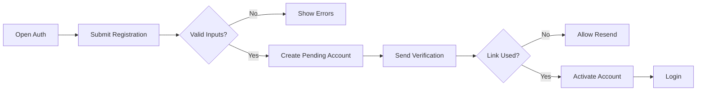
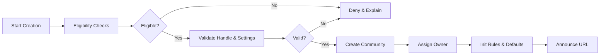
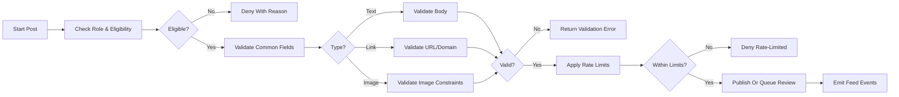
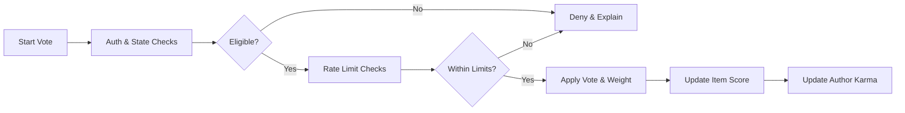
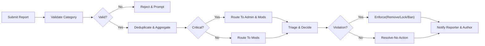
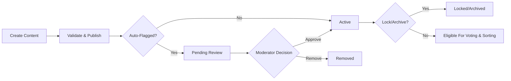
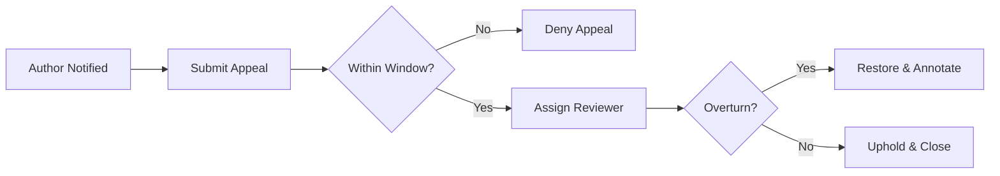

# communityPlatform — Requirements Analysis (Business Requirements)

## 1. Scope and Principles
- Purpose: Define business requirements for a Reddit-like community platform enabling registration/login, community creation, posting (text/link/image), nested commenting, voting with karma, feed sorting (Hot/New/Top/Controversial), subscriptions, profiles, and reporting of inappropriate content.
- Principles:
  - THE communityPlatform SHALL prioritize safety, transparency, and user control while enabling open discussion around interests.
  - THE communityPlatform SHALL specify business behaviors and outcomes only and SHALL avoid prescribing APIs, database schemas, infrastructure, or UI layouts.
  - THE communityPlatform SHALL use clear, testable requirements (EARS) with unambiguous workflows and error semantics.

## 2. Roles and Access Model
Roles (system-wide kinds):
- guestUser: Unauthenticated visitor; read-only on public content.
- memberUser: Authenticated user; participates by posting, commenting, voting, reporting, and subscribing.
- communityOwner: Member who created the community; highest authority within that community.
- communityModerator: Member appointed by communityOwner; moderates in assigned community scope.
- adminUser: Platform-wide administrator for trust & safety and escalations.

Role principles (business):
- THE communityPlatform SHALL enforce least privilege and scope-limited actions for community roles.
- THE communityPlatform SHALL allow adminUser to override community decisions for site-wide policy or legal compliance with audit logging.

## 3. End-to-End User Journeys (Happy Paths and Key Edge Cases)

### 3.1 Browse as Guest
- WHEN a guestUser visits public communities, THE communityPlatform SHALL allow viewing of communities, posts, and comments.
- IF a guestUser attempts to vote, comment, subscribe, or post, THEN THE communityPlatform SHALL require registration/login.

### 3.2 Register, Verify, and Login
- WHEN a guestUser submits valid registration details (email, username, password, consents), THE communityPlatform SHALL create a pending account and dispatch verification.
- WHEN the user verifies the email, THE communityPlatform SHALL mark the account active and allow participation per role.
- IF credentials are invalid during login, THEN THE communityPlatform SHALL deny without revealing whether the account exists.

### 3.3 Create a Community
- WHEN an eligible memberUser submits a unique handle, name, and baseline rules, THE communityPlatform SHALL create the community and assign ownership to the creator.
- IF eligibility thresholds are unmet (e.g., low account age/karma), THEN THE communityPlatform SHALL deny creation with reason and guidance.

### 3.4 Post and Discuss
- WHEN a memberUser submits a valid post (text, link, image) within an allowed community, THE communityPlatform SHALL publish it to the community feed.
- WHEN members comment and reply within depth limits, THE communityPlatform SHALL build nested threads and preserve structure on deletions/removals.

### 3.5 Vote and Karma
- WHEN a memberUser votes on content they do not own, THE communityPlatform SHALL update item score and the author’s karma per business rules.
- IF content is locked or archived, THEN THE communityPlatform SHALL deny new votes and replies.

### 3.6 Subscribe and Personalize
- WHEN a memberUser subscribes to a community, THE communityPlatform SHALL include that community’s content in the member’s home feed and reflect changes within 60 seconds.

### 3.7 Report and Moderate
- WHEN a memberUser reports content with a valid category, THE communityPlatform SHALL create a case, deduplicate within a time window, route to moderators (and admins for critical categories), and notify appropriate parties of outcomes.

## 4. Functional Requirements by Domain (EARS)

### 4.1 Registration and Login
- THE communityPlatform SHALL require unique email and username; SHALL require acceptance of Terms and Privacy Policy.
- WHEN registration is valid, THE communityPlatform SHALL create an account in PendingVerification and send verification within 10 seconds.
- WHEN verification succeeds, THE communityPlatform SHALL transition to Active and permit posting, commenting, voting, and reporting.
- WHERE login attempts exceed protective thresholds, THE communityPlatform SHALL lock the account for a cool-down period and notify the user.
- IF email is unverified, THEN THE communityPlatform SHALL deny participation actions and provide a resend-verification path.

Mermaid — Authentication Flow

### 4.2 Community Creation and Governance
- THE communityPlatform SHALL allow eligible memberUser to create communities with unique handles and required descriptions subject to naming policy.
- WHERE a community is created, THE communityPlatform SHALL assign the creator as communityOwner and initialize defaults (rules template, visibility, moderation settings).
- THE communityPlatform SHALL allow communityOwner to appoint communityModerators and configure participation rules (posting eligibility, rate limits, required flairs).
- WHEN a community changes visibility (public/restricted/private), THE communityPlatform SHALL apply access rules immediately and notify affected subscribers per preferences.
- IF community rules conflict with site-wide policy, THEN THE communityPlatform SHALL prevent publication and require correction.
- THE communityPlatform SHALL support moderation actions (approve, remove, lock, pin, warn, mute, ban) within community scope and SHALL log actions with reason codes.

Mermaid — Community Creation

### 4.3 Posting (Text, Link, Image)
- THE communityPlatform SHALL support text, link, and image posts and SHALL enforce type-specific validations (e.g., URL schemes, file size/format, body length).
- WHERE a community restricts post types or requires tags/flairs, THE communityPlatform SHALL enforce those configurations at submission.
- WHEN a post is created, THE communityPlatform SHALL set initial visibility (Active or PendingReview) and propagate to feeds within 10 seconds under normal load.
- WHEN a post is edited within policy windows, THE communityPlatform SHALL record an edited indicator and retain history for moderators and administrators.
- WHERE a post is deleted by its author, THE communityPlatform SHALL present a “[deleted by author]” marker and preserve comments unless other policies apply.
- WHERE a post is locked or archived, THE communityPlatform SHALL deny new comments and votes and SHALL keep visibility per policy.

Mermaid — Posting Flow

### 4.4 Voting and Karma
- THE communityPlatform SHALL allow authenticated members in good standing to upvote/downvote posts and comments except on their own content.
- WHERE email is unverified, THE communityPlatform SHALL deny voting.
- WHERE account age is under protective thresholds or karma is significantly negative, THE communityPlatform SHALL apply stricter vote rate limits and reduced vote weight.
- WHEN a vote is cast, THE communityPlatform SHALL confirm action within 500 ms and SHALL update visible scores within 2 seconds under normal load.
- WHERE manipulation is suspected (brigading or coordinated voting), THE communityPlatform SHALL throttle, freeze, or down-weight votes and SHALL flag for review without revealing detection methods.
- WHEN content is removed for policy or deleted by the author, THE communityPlatform SHALL exclude that content’s votes from contributor karma totals.

Mermaid — Voting Flow

### 4.5 Commenting and Nested Replies
- THE communityPlatform SHALL allow members to comment and reply with a maximum nesting depth of 8.
- WHEN a comment is created, THE communityPlatform SHALL validate body length and policy rules; SHALL create held_for_review state when applicable.
- WHERE a comment or parent is locked or archived, THE communityPlatform SHALL deny new replies and edits by non-privileged users.
- WHEN a comment is edited after a grace period, THE communityPlatform SHALL display an edited indicator and retain history for moderators and administrators.
- WHERE a comment is deleted by its author, THE communityPlatform SHALL show a placeholder and preserve replies for thread integrity.

### 4.6 Sorting (Hot, New, Top, Controversial)
- THE communityPlatform SHALL provide deterministic sorting modes with predictable outcomes:
  - New: ordered by creation time (descending).
  - Top: ordered by net approval within a selected time window (24h/7d/30d/year/all).
  - Hot: recency-weighted interest prioritizing recent engaging posts; older posts decline unless exceptionally engaging.
  - Controversial: high total votes with balanced polarity within a time window.
- WHERE content is archived, THE communityPlatform SHALL not increase Hot/Controversial standing based on new activity.
- WHERE content is locked, THE communityPlatform SHALL ignore new comments in Hot/Controversial calculations.

### 4.7 Subscriptions and Personalization
- THE communityPlatform SHALL allow members to subscribe/unsubscribe to communities and SHALL reflect changes in the home feed within 60 seconds.
- WHERE a community is private or restricted, THE communityPlatform SHALL require approval for an active subscription state.
- WHERE a user mutes a community, THE communityPlatform SHALL suppress that community’s content in the user’s home feed without altering subscription state.

### 4.8 Profiles and Identity
- THE communityPlatform SHALL provide public profiles with username, optional display name, avatar, bio, join date, and karma totals (post/comment/total) subject to privacy settings.
- WHERE a user sets profile visibility to Private or Limited, THE communityPlatform SHALL enforce restricted visibility accordingly.
- WHEN a user blocks another user, THE communityPlatform SHALL prevent direct interactions and treat the blocking user’s profile as Private to the blocked viewer.

### 4.9 Reporting, Moderation, and Trust & Safety
- THE communityPlatform SHALL allow members to report posts, comments, communities, or accounts using site-wide categories (spam, harassment/hate, sexual content/minors, violence/threats, self-harm risk, illegal content, doxxing, misinformation, copyright/IP, other with description) and community-specific categories when configured.
- WHEN a report is submitted, THE communityPlatform SHALL deduplicate by item, category, and reporter within 24 hours and SHALL aggregate counts.
- WHERE categories are critical (e.g., child safety, credible threats), THE communityPlatform SHALL immediately route cases to adminUser in addition to community moderators.
- WHEN enforcement action is applied, THE communityPlatform SHALL notify the author with reason code and appeal options and SHALL never reveal reporter identities.
- WHERE appeals are filed within the allowed window (e.g., 14 days), THE communityPlatform SHALL route to a reviewer not responsible for the original action and SHALL restore content/account if overturned.

Mermaid — Reporting and Moderation

## 5. Authentication, Authorization, and Sessions (Business Terms)
- THE communityPlatform SHALL require email verification for participation actions (post/comment/vote/report/subscribe/create community).
- THE communityPlatform SHALL allow device/session management: list active devices, revoke sessions, logout-all.
- WHERE role or privileges change (e.g., appointed moderator), THE communityPlatform SHALL evaluate permissions per community context and reflect changes without delay.
- IF a user is banned in a community, THEN THE communityPlatform SHALL deny participation only within that community while retaining platform access consistent with role and policy.

## 6. Error and Recovery Semantics (Business)
Standardized business error outcomes with actionable guidance:
- Authentication: AUTH_INVALID_CREDENTIALS, AUTH_EMAIL_NOT_VERIFIED, AUTH_ACCOUNT_LOCKED, AUTH_SESSION_EXPIRED.
- Authorization: PERM_INSUFFICIENT_ROLE, PERM_COMMUNITY_BAN, PERM_SITEWIDE_BAN.
- Posting: POST_VALIDATION_FAILED, POST_DUPLICATE_DETECTED, POST_RATE_LIMITED, POST_SPAM_SUSPECTED, POST_LOCKED, POST_ARCHIVED.
- Commenting: COMMENT_VALIDATION_FAILED, COMMENT_DEPTH_LIMIT, COMMENT_RATE_LIMITED, COMMENT_LOCKED, COMMENT_ARCHIVED.
- Voting: VOTE_SELF_NOT_ALLOWED, VOTE_RATE_LIMITED, VOTE_TARGET_LOCKED.
- Feeds: FEED_EMPTY_FOR_FILTERS, SORT_UNSUPPORTED.
- Subscriptions: SUB_ALREADY_SUBSCRIBED, SUB_NOT_SUBSCRIBED, SUB_LIMIT_REACHED.
- Profiles: PROFILE_PRIVATE, PROFILE_NOT_FOUND.
- Reporting: REPORT_INVALID_CATEGORY, REPORT_DUPLICATE_OPEN, REPORT_RATE_LIMITED, REPORT_NOT_ALLOWED.
- System: SYS_TEMPORARY_UNAVAILABLE, SYS_TIMEOUT, SYS_UNKNOWN_ERROR.

- WHEN a rate limit is exceeded, THE communityPlatform SHALL communicate remaining wait time and the affected action type.
- WHEN duplicate content is detected (e.g., same link in 30 days), THE communityPlatform SHALL surface the prior item and deny or reroute per policy.
- WHEN content is locked/archived, THE communityPlatform SHALL clearly state that further interactions are unavailable.

## 7. Non-Functional Requirements (Business Expectations)
- Performance targets (under normal load):
  - Home/community feed page p50 ≤ 350 ms, p95 ≤ 800 ms.
  - Vote action confirmation p95 ≤ 500 ms.
  - Post/comment creation acknowledgment p95 ≤ 900 ms (text/link), p95 ≤ 1,000 ms (image, excluding upload time).
  - Profile view p95 ≤ 700 ms.
- Freshness:
  - Feed inclusion of new posts within 10 seconds; home feed changes after subscribe/unsubscribe within 60 seconds.
  - Visible score updates within 2 seconds for most contexts.
- Availability:
  - Core actions monthly uptime ≥ 99.9%; incident status updates within 30 minutes of detection.
- Localization & Timezone:
  - THE communityPlatform SHALL render user-facing times in the user’s selected timezone, honoring Asia/Seoul where applicable, and localize user messages to the selected language (default en-US).
- Observability & Auditability:
  - THE communityPlatform SHALL log privileged actions, moderation events, state changes, and report lifecycle events with actor, timestamp, scope, and reason codes where applicable.

## 8. Permission Matrix (Business-Level Summary)

| Action | guestUser | memberUser | communityModerator | communityOwner | adminUser |
|---|---|---|---|---|---|
| View public content | ✅ | ✅ | ✅ | ✅ | ✅ |
| Register/login | ✅/❌ | ✅ | ✅ | ✅ | ✅ |
| Create community | ❌ | WHERE thresholds met: ✅ | ✅ (as member) | ✅ (as member) | ✅ |
| Post in allowed communities | ❌ | ✅ | ✅ | ✅ | ✅ |
| Comment and reply | ❌ | ✅ | ✅ | ✅ | ✅ |
| Vote on content | ❌ | ✅ | ✅ | ✅ | ✅ |
| Report content | ❌ | ✅ | ✅ | ✅ | ✅ |
| Remove/lock content (scoped) | ❌ | ❌ | ✅ | ✅ | ✅ (global) |
| Ban/mute users (scoped) | ❌ | ❌ | ✅ | ✅ | ✅ (global) |
| Override community policy | ❌ | ❌ | ❌ | ❌ | ✅ |

Notes:
- communityModerator/communityOwner actions are restricted to their community scope.
- adminUser may act across all communities under site-wide policy and legal obligations.

## 9. Diagrams (Mermaid)
All labels use double quotes; no spaces between brackets/braces and quotes.

### 9.1 End-to-End Content Lifecycle (Conceptual)

### 9.2 Appeals Flow

## 10. Acceptance Criteria and KPIs
Acceptance criteria (samples):
- GIVEN a verified memberUser, WHEN creating a text post with valid fields, THEN the post appears in the community feed within 10 seconds and is visible under New sorting immediately.
- GIVEN a memberUser, WHEN subscribing to a public community, THEN the home feed includes that community’s new content within 60 seconds.
- GIVEN a post locked by a moderator, WHEN attempting to comment or vote, THEN the action is denied with an explanation indicating lock state.
- GIVEN an unverified account, WHEN voting, THEN the action is denied with guidance to verify email.
- GIVEN a report with category “Harassment” on a post, WHEN multiple unique reporters submit within 10 minutes, THEN a single aggregated case exists in the mod queue with updated counts.
- GIVEN an appeal filed within 14 days, WHEN the reviewer overturns the removal, THEN the content is restored with original timestamps where allowed and notifications are sent to involved parties.

KPIs (illustrative):
- Report median time-to-first-review < 6 hours; critical categories < 1 hour.
- 95th percentile vote acknowledgment < 500 ms; feed re-rank visible ≤ 10 seconds.
- Duplicate link submissions reduced by ≥ 50% via detection and guidance within 3 months post-launch.

## 11. Glossary
- Active: Visible state allowing interactions per policy.
- Archived: Visible but closed to new votes/comments and edits.
- Contest Mode: Temporary thread mode hiding or randomizing visible scores to reduce bandwagoning.
- Held For Review: Temporary state pending moderator approval.
- Hot/New/Top/Controversial: Deterministic feed sorting modes with business expectations.
- Karma: Reputation scores accrued from community voting.
- Lock: Restriction preventing new comments (and optionally votes) on a post or comment.
- Moderator Log (Modlog): Community-scoped audit trail for moderator actions.
- NSFW: Content label indicating not safe for work; requires special visibility handling.
- PendingReview: Limited visibility state awaiting human decision.
- Placeholder: Public-visible marker indicating content removed or deleted without exposing sensitive details.
- Quarantine: Restricted discovery state for communities under policy action.
- Rate Limit: Business control limiting action frequency to prevent abuse.
- Removal: State where content is hidden due to rule or policy violation.
- Subscription: Member’s preference to see content from a community in the home feed.

End of business requirements for communityPlatform. 