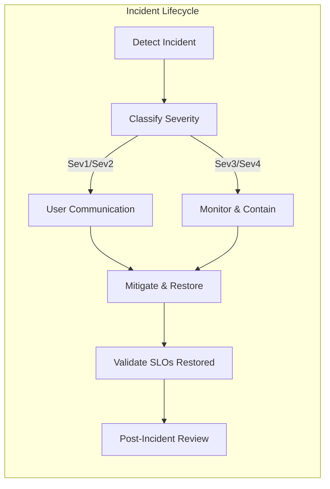
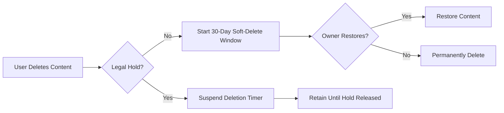

# communityPlatform Non-Functional Requirements (NFR)

## 1. Purpose, Scope, and Principles

### 1.1 Purpose
Define user-centric, measurable non-functional expectations for communityPlatform, a Reddit-like community platform. Requirements describe WHAT outcomes the service must provide, not HOW to implement them.

### 1.2 Scope
- In scope: performance and responsiveness; availability and reliability; security and privacy; scalability and capacity; observability and auditing; localization/timezone/accessibility; retention and compliance; acceptance and validation.
- Out of scope: technical architecture, APIs, schemas, infrastructure, vendor selections, UI layouts.

### 1.3 Guiding Principles
- THE platform SHALL prioritize predictable, fast interactions for browsing feeds, posting, voting, commenting, moderation, and profile actions.
- THE platform SHALL prefer graceful degradation over hard failure and communicate states clearly to users.
- THE platform SHALL protect user privacy and safety by default with auditable actions.
- THE platform SHALL support global usage with correct localization and timezone behavior.
- THE platform SHALL maintain measurability and transparency of service health and user-impacting incidents.

### 1.4 Related Specifications
- [Authentication and Account Lifecycle Requirements](./04-communityPlatform-authentication-and-account-lifecycle.md)
- [Community and Moderation Rules Requirements](./05-communityPlatform-community-and-moderation-rules.md)
- [Posting and Content Requirements](./06-communityPlatform-posting-and-content-requirements.md)
- [Voting and Karma System Requirements](./07-communityPlatform-voting-and-karma-system.md)
- [Commenting and Nested Replies Requirements](./08-communityPlatform-commenting-and-nested-replies.md)
- [Feed Sorting and Discovery Requirements](./09-communityPlatform-feed-sorting-and-discovery.md)
- [Reporting, Safety, and Trust Requirements](./11-communityPlatform-reporting-safety-and-trust.md)
- [Exception Handling and Error Model](./13-communityPlatform-exception-handling-and-error-model.md)
- [Data Lifecycle and Governance Requirements](./14-communityPlatform-data-lifecycle-and-governance.md)

## 2. Performance and Responsiveness

### 2.1 Latency Targets by Interaction
Targets are end-to-end application processing times as perceived by users, excluding client upload time for media and extreme network conditions.

| Interaction | Target (p50) | Target (p95) | Target (p99) | Notes |
|-------------|---------------|--------------|--------------|-------|
| Load community feed (Hot/New/Top/Controversial) | 300 ms | 700 ms | 1200 ms | Includes filtering by community policy and viewer permissions |
| Load home feed (personalized) | 350 ms | 800 ms | 1400 ms | Includes subscription aggregation and eligibility filtering |
| Open a post with first page of comments | 300 ms | 800 ms | 1400 ms | Includes initial comment tree slice |
| Submit text post | 300 ms | 800 ms | 1500 ms | Media-independent path |
| Submit link post (preview queued) | 300 ms | 900 ms | 1600 ms | Preview enrichment is asynchronous |
| Submit image post (after upload) | 400 ms | 1000 ms | 1800 ms | Upload transfer excluded; processing async allowed |
| Vote on post/comment | 150 ms | 400 ms | 800 ms | Immediate UI acknowledgement required |
| Add comment/reply | 250 ms | 700 ms | 1200 ms | Tree update may be incremental |
| Subscribe/unsubscribe community | 200 ms | 600 ms | 1000 ms | Home feed reflects within 60 s |
| Profile load (header + activity preview) | 300 ms | 700 ms | 1200 ms | Honors privacy settings |

EARS requirements:
- THE platform SHALL meet the latency targets above for 95% and 99% of requests as stated per interaction.
- WHEN a user votes, THE platform SHALL confirm the action outcome to the user within 400 ms at p95.
- WHEN a user submits a post or comment, THE platform SHALL return success or actionable error within 900 ms p95 for text/link and 1000 ms p95 for image publish acknowledgment (excluding upload duration).
- WHERE background enrichment (link preview, image processing) is pending, THE platform SHALL present a temporary state and finalize within 30 seconds for 95% of items.

### 2.2 Freshness and Consistency
- THE platform SHALL reflect a user’s own vote immediately and update aggregate counts visible to that user within 1 second, with propagation to others within 5 seconds under normal load.
- THE platform SHALL surface new posts in community feeds within 5 seconds and in home feeds within 10 seconds under normal load.
- THE platform SHALL apply moderation state changes (remove/lock/restore) to feeds and item views within 5 seconds under normal load.

### 2.3 Graceful Degradation
- IF capacity constraints occur, THEN THE platform SHALL reduce non-critical computations (e.g., recommendations depth, preview enrichment) before affecting core interactions.
- IF preview enrichment fails or is delayed, THEN THE platform SHALL publish the base post and attach enrichment when available.
- IF comment trees exceed thresholds, THEN THE platform SHALL paginate or collapse deeper levels to maintain target response times.

### 2.4 Validation and Monitoring
- THE platform SHALL continuously measure latency percentiles for the interactions listed and alert when p95 exceeds targets for 10 consecutive minutes.
- THE platform SHALL publish a monthly performance summary with trend lines for core interactions.

## 3. Availability and Reliability

### 3.1 Uptime Objectives and Maintenance
- THE platform SHALL target 99.9% monthly uptime for core actions: browse feeds, view posts, vote, comment, create posts, register/login.
- WHERE maintenance is necessary, THE platform SHALL schedule outside peak hours and announce at least 48 hours in advance on a public status page.

### 3.2 Recovery Objectives
- THE platform SHALL meet a Recovery Time Objective (RTO) of 30 minutes for core functions.
- THE platform SHALL meet a Recovery Point Objective (RPO) of 5 minutes for user-generated content and critical account data.

### 3.3 Resilience and Fallbacks
- IF a dependency is impaired, THEN THE platform SHALL serve last-known-good or cached feeds where feasible and label staleness to users.
- IF media delivery is degraded, THEN THE platform SHALL continue serving text and controls, labeling media as temporarily unavailable.
- IF sorting computation is delayed, THEN THE platform SHALL fall back to a deterministic order (e.g., New) and label the fallback.

### 3.4 Incident Communication and Error Budgets
- WHEN an incident affecting core actions is detected, THE platform SHALL publish a status update within 30 minutes and at least every 60 minutes until resolved.
- THE platform SHALL maintain error budgets aligned to the 99.9% uptime target and SHALL slow or pause risky launches when budgets are exhausted.

## 4. Security and Privacy Expectations

### 4.1 Confidentiality, Integrity, Availability (CIA)
- THE platform SHALL maintain confidentiality of personal data and private actions (e.g., reports, moderation notes, device/session details) and avoid exposing sensitive internals in user messages or logs.
- THE platform SHALL ensure integrity of votes, karma, content state transitions, and audit records.
- THE platform SHALL ensure availability of authentication, posting, and viewing per uptime targets.

### 4.2 Authentication and Session Behavior (Business)
- WHEN a user logs in, THE platform SHALL establish a secure session and expire access sessions within 15–30 minutes of inactivity, with refresh behavior per the authentication requirements.
- WHERE multiple devices are used, THE platform SHALL allow users to review and revoke individual device sessions.
- IF suspicious activity is detected (e.g., rapid login failures or anomalous device changes), THEN THE platform SHALL throttle and require additional verification without disclosing detection criteria.

### 4.3 Data Minimization and Masking
- THE platform SHALL collect only data necessary for features in scope and SHALL mask sensitive data in logs and user-facing errors.
- THE platform SHALL restrict access to personal data to need-to-know roles and SHALL audit such access.

### 4.4 Abuse Prevention and Rate Limiting
- WHEN repeated failed login attempts occur, THE platform SHALL apply graduated throttling and temporary lockouts per authentication policy.
- WHEN abnormal voting/posting/reporting patterns are detected, THE platform SHALL apply rate limits or challenges without blocking legitimate usage where possible.

### 4.5 Privacy-by-Design and User Rights
- THE platform SHALL provide clear privacy controls for profiles, subscriptions, and content visibility consistent with related documents.
- THE platform SHALL support user data export and deletion within timeframes in data governance requirements.

## 5. Scalability and Capacity Targets

### 5.1 Baselines and Growth
- Initial assumption: 50k DAU; 5k peak concurrent sessions; peaks: 10 posts/sec, 200 votes/sec, 50 comments/sec, 30 image uploads/min.
- THE platform SHALL sustain 10x growth within 12 months for core behaviors without re-architecting from a business capability perspective.

### 5.2 Headroom and Hotspots
- THE platform SHALL maintain at least 30% capacity headroom above the trailing 7-day peak for core actions.
- Likely hotspots: vote writes, feed reads, media ingestion; THE platform SHALL prioritize protecting user-perceived responsiveness for these flows.

### 5.3 Load Shedding and Elasticity
- IF load exceeds safe thresholds, THEN THE platform SHALL shed optional workloads (previews, deep recommendations) before impacting core reads/writes.
- WHERE abusive or anomalous traffic is detected, THE platform SHALL throttle offending sources before impacting general users.
- THE platform SHALL scale freshness jobs so that vote-driven re-ranking remains within the 10-second freshness target under normal and peak loads.

EARS acceptance:
- THE platform SHALL meet performance targets at baseline and maintain them during 10x growth for core interactions.
- WHEN thresholds are exceeded, THE platform SHALL degrade non-critical features first and maintain core flows within stated targets.

## 6. Observability, Auditing, and Incident Lifecycle

### 6.1 Logging, Metrics, and Tracing (Business Semantics)
- THE platform SHALL emit logs sufficient to reconstruct user-visible actions and system decisions without storing plaintext sensitive data.
- THE platform SHALL track latency percentiles, error rates, throughput, saturation, and freshness metrics for core actions.
- THE platform SHALL conceptually support request tracing to identify bottlenecks in cross-service operations.

### 6.2 SLOs and Error Budgets
- THE platform SHALL define SLOs aligned with the latency and availability targets in this document and SHALL track corresponding error budgets.
- WHEN an SLO is breached for a rolling 30-day window, THE platform SHALL enforce launch freezes or risk-reduction measures until budgets recover.

### 6.3 Incident Lifecycle and Communications

EARS requirements:
- THE platform SHALL classify incidents by severity and SHALL publish status updates within 30 minutes for Sev1/Sev2 incidents affecting core actions.
- WHEN service is restored, THE platform SHALL validate SLO conformance before closing the incident and SHALL perform a post-incident review with action items.

### 6.4 Auditability
- THE platform SHALL maintain immutable conceptual audit trails for: authentication events; content lifecycle (create/edit/delete/remove/lock/archive/restore); moderation actions; report triage states; role changes; data rights events.
- THE platform SHALL restrict audit visibility by role (adminUser has platform-wide; communityOwner/communityModerator have scoped visibility).

## 7. Localization, Timezone, and Accessibility

### 7.1 Language and Locale
- THE platform SHALL render user-facing text in the user’s selected language/locale, defaulting to en-US when undetermined.
- THE platform SHALL ensure message templates are translatable without concatenation that breaks grammar.

### 7.2 Timezone and Timestamp Rules
- THE platform SHALL display timestamps in the user’s selected timezone and provide clear relative and absolute forms.
- THE platform SHALL handle daylight saving time transitions correctly where applicable.

### 7.3 Content Labels and Policy Messaging
- THE platform SHALL localize content labels such as “NSFW” and “Spoiler” and user-facing policy notices while keeping EARS keywords in English within this documentation.

### 7.4 Accessibility (a11y)
- THE platform SHALL ensure errors, notifications, and dynamic updates are perceivable by assistive technologies.
- THE platform SHALL avoid relying on color alone for critical states and SHALL maintain readable contrast and focus management.

EARS acceptance:
- WHEN a user changes locale or timezone, THE platform SHALL apply changes to subsequent views with no mixed-locale artifacts.
- IF a locale is unsupported for a specific message, THEN THE platform SHALL fall back to en-US.

## 8. Content Retention, Deletion, and Compliance

### 8.1 Retention Policies (Business)
- THE platform SHALL retain content and governance data per the [Data Lifecycle and Governance Requirements](./14-communityPlatform-data-lifecycle-and-governance.md).
- THE platform SHALL respect soft-delete windows and purge schedules while preserving aggregates and audit trails as permitted.

### 8.2 Erasure and Legal Holds
- WHEN a user requests erasure and identity is verified, THE platform SHALL delete or anonymize personal data within 30 days except where legal holds apply.
- IF legal hold is placed, THEN THE platform SHALL suspend deletion timers and record the hold scope and reason in governance records.

### 8.3 Compliance Support
- THE platform SHALL support user rights (access/export/erasure) within documented timeframes and SHALL maintain records of requests and outcomes.

## 9. Validation and Acceptance

### 9.1 Performance Testing Mix
- THE platform SHALL validate latency and throughput targets with a representative mix: 70% feed reads, 15% post/comment reads, 10% votes, 5% content writes, with periodic media bursts.

### 9.2 Chaos/Resilience Scenarios
- WHEN dependency timeouts or partial outages occur, THE platform SHALL serve partial content with clear labels and avoid cascading failures through backoff and isolation strategies (business intent).
- WHEN region-level disruption is simulated, THE platform SHALL meet stated RTO/RPO for core actions.

### 9.3 Privacy/Security Validations
- THE platform SHALL demonstrate masking of sensitive fields in errors and logs during both normal operation and failure modes.
- THE platform SHALL demonstrate rate limiting and lockouts for credential stuffing and high-velocity voting or posting patterns.

### 9.4 Acceptance Criteria (Selected)
- Performance: p95 and p99 targets are met for interactions in Section 2 in pre-launch and monitored post-launch.
- Availability: 99.9% monthly uptime for core actions with incident communication SLAs met.
- Security/Privacy: Data minimization, masking, and access controls demonstrated in audit samples; anti-abuse protections effective with low false-positive rates.
- Scalability: 10x growth simulations hold latency/freshness targets; headroom maintained at 30%.
- Observability: SLOs and error budgets defined and enforced; incident lifecycle followed with PIRs completed.
- Localization/a11y: Locale, timezone, and accessibility behaviors verified.
- Retention/Compliance: Soft-delete, purge, export, and erasure flows validated end-to-end within timelines.

## 10. Appendices

### 10.1 Glossary
- Core actions: browse feeds, view posts, vote, comment, create posts, register/login.
- p50/p95/p99: latency percentiles for application processing.
- RTO/RPO: Recovery Time/Point Objectives for restoration speed and data loss tolerance.
- SLO/Error Budget: Target service level and allowable margin before corrective actions.
- Soft-delete: Reversible removal state before permanent deletion.

### 10.2 Additional Mermaid: Data Retention Decision Flow

### 10.3 EARS Requirement Index (Selected)
- THE platform SHALL meet the latency targets per interaction (Section 2.1).
- WHEN background enrichment is pending, THE platform SHALL present a temporary state and finalize within 30 seconds (Section 2.1).
- THE platform SHALL reflect self-visible vote changes immediately and global visibility within 5 seconds (Section 2.2).
- IF capacity constraints occur, THEN THE platform SHALL shed optional workloads before core flows (Section 2.3).
- THE platform SHALL target 99.9% monthly uptime and publish incident updates within 30 minutes (Section 3.1–3.4).
- THE platform SHALL meet RTO 30 minutes and RPO 5 minutes (Section 3.2).
- THE platform SHALL protect personal data and mask sensitive information (Section 4.3).
- WHEN abnormal behavior is detected, THE platform SHALL apply rate limits or challenges (Section 4.4).
- THE platform SHALL sustain 10x growth without violating core SLOs (Section 5.1–5.3).
- THE platform SHALL define and enforce SLOs and error budgets with launch controls (Section 6.2).
- THE platform SHALL render timestamps in the user’s timezone and handle DST (Section 7.2).
- THE platform SHALL process verified erasure requests within 30 days unless legally held (Section 8.2).
- THE platform SHALL validate performance, resilience, and privacy/security via scenarios in Section 9.

---
This NFR specifies business outcomes only. All technical implementation decisions (architecture, APIs, database design, infrastructure, vendors) are at the discretion of the development team.