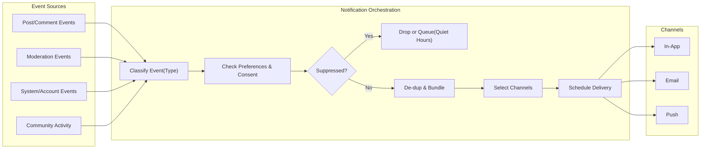
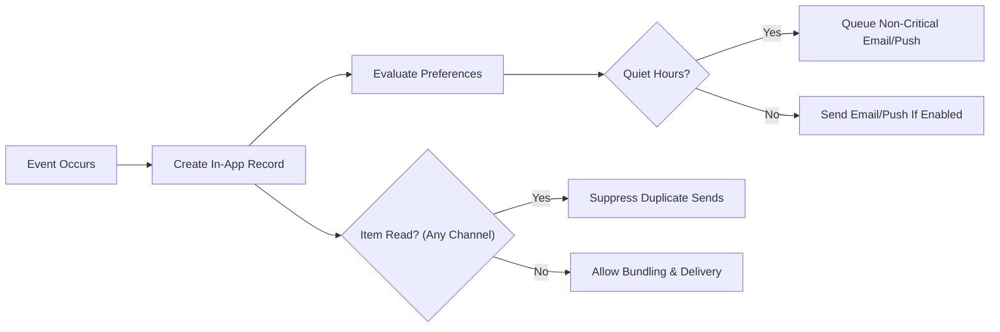
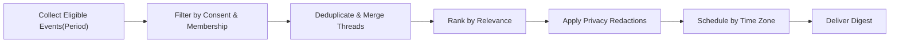

# communityPlatform — Notifications and Communications Requirements

Business requirements specifying notification triggers, delivery channels, user controls, frequency management, and compliance obligations for communityPlatform. All statements describe WHAT must happen in business terms; technical implementation choices remain with the development team.

## 1. Objective and Scope
- Objective: Ensure timely, relevant, and privacy-respecting notifications that increase meaningful engagement while giving members fine-grained control over how and when they are contacted.
- In scope: Event triggers, in-app/email/push channels, consent requirements, bundling/de-duplication, quiet hours, preferences (global and per-community), notification center behaviors, compliance, retention, performance SLOs, and auditability.
- Out of scope: API specifications, database schemas, transport providers, message templates, and UI layouts.

## 2. Definitions and Actors
- Notification: A user-directed message triggered by a platform event.
- Channel: The medium used to deliver a notification: in-app, email, or push.
- Digest: A scheduled summary communication (daily or weekly) that aggregates multiple events.
- Transactional communication: A service-necessary message (e.g., verification, password reset, moderation outcome).
- Marketing/bulk communication: Non-essential promotional messages; excluded from MVP unless later authorized.
- Quiet hours: User-defined time window during which non-critical email/push notifications are delayed.
- Time zone: User-configured time zone; default is UTC until set.

Actors
- Guest: Unauthenticated visitor; not eligible to receive notifications.
- Member: Registered user; eligible for in-app notifications by default and email/push upon consent and verification.
- Moderator: Member with community-scoped privileges; eligible for moderation notifications in those communities.
- Admin: Platform administrator; eligible for escalations and global safety communications.

## 3. Triggers and Categories
### 3.1 Replies and Mentions
- Post reply to author
- Comment reply to author
- @Mention of a member in a post or comment
- Thread activity summaries (bundled)

Exclusions
- Upvotes/downvotes do not create immediate notifications; they may appear as digest aggregates.

### 3.2 Moderation and Reporting
- Content removal, restoration, or relabeling affecting a user’s post/comment
- New report in a community (moderator queue)
- Report resolution notice to reporter (limited outcome)
- Admin escalation events

### 3.3 Community and Subscription Events
- New post in a subscribed community (per-community preference)
- Trending alerts for a subscribed community (opt-in only)
- Community announcements from moderators/owners (subject to user consent)

### 3.4 System and Account Events
- Email verification, password reset, session security alerts
- Policy/terms updates and mandatory compliance notices

### 3.5 Optional Summaries
- Daily/weekly karma summaries
- Daily/weekly subscription highlights

## 4. Delivery Channels and Consent
### 4.1 In-App
- Default channel for members with read/unread state tracking and a notification center. History retention: 90 days.

### 4.2 Email
- Allowed only after email verification and explicit consent. Includes one-click unsubscribe where required. Transactional emails (e.g., password reset, verification, legal updates) are mandatory and not suppressible where permitted by law.

### 4.3 Push
- Allowed only after explicit device-level opt-in. Mirrors a subset of immediate notifications. Respects quiet hours and per-user caps.

Consent and Identity
- Email requires a verified address and explicit consent for non-transactional messages.
- Push requires device opt-in consent for non-transactional messages.
- Transactional messages may be sent without marketing consent, as permitted by law.

## 5. Frequency, Bundling, Quiet Hours, and De-duplication
- Bundling window for replies and mentions in the same thread: 10 minutes.
- Per-user caps (defaults): email 10 immediate/day (non-transactional); push 30/day. In-app has no hard cap, but dedup and bundling apply.
- Quiet hours: user-configured; non-critical email/push delayed to the end of quiet hours; transactional communications bypass quiet hours.
- Cross-channel de-duplication: higher-priority channel per user preference wins; read state suppresses redundant channel sends for the same event.

## 6. Preferences and Suppression Rules
### 6.1 Default Preferences by Category
- Replies to my posts/comments: in-app on, email on, push off.
- Mentions: in-app on, email on, push off.
- Moderation outcomes (my content): in-app on, email on, push off.
- Moderator report alerts: in-app on, email off, push off.
- New posts in subscribed communities: in-app on, email off, push off.
- Trending alerts: all channels off by default.
- System/account security: in-app on, email on, push off; cannot be disabled for in-app/email where required by law.

### 6.2 Per-Community Overrides
- Members can override “new posts” and “announcements” per community.
- Moderation alerts configurable per community for moderators.

### 6.3 Muting, Blocking, and Hiding
- Muting a thread suppresses further notifications for that thread.
- Muting a community suppresses non-critical notifications for that community.
- Blocking a user suppresses replies/mentions from that user, except compliance messages.
- Leaving or removal from a community immediately suppresses community-scoped notifications.

## 7. Notification Center (Business Rules)
- Read/unread semantics: marking read in any channel marks the corresponding in-app item read and suppresses duplicate email/push sends during the bundling window.
- Pagination: default 20 items per page; user-configurable 10–50; hard cap 100.
- Ordering: Unread first, then newest first within category; stable ordering within a page.
- Retention: in-app history retained for at least 90 days; users can clear read items without affecting retention obligations.
- Search and filtering: filter by category (replies, mentions, moderation, community, system) and community; sort by newest or unread-first.

## 8. Compliance, Privacy, and Consent Management
- Consent capture and audit trail maintained with timestamp, channel, category, and source.
- Previews: limit external-channel previews to minimal necessary information; never include private community content for non-members; redact NSFW/spoilers unless the user opted to show.
- Jurisdictional rules: GDPR/CCPA/CASL-style compliance—clear consent, easy withdrawal, consent record retention, one-click unsubscribe for non-transactional email.
- Data export: include notification preferences and consent history in user data exports.

## 9. Performance, Reliability, and Observability (Business-Level)
- In-app immediacy: visible within 2 seconds of the event under normal conditions (p95).
- Email/push enqueue: within 10 seconds of the event under normal conditions; delivery subject to provider latency.
- Digest delivery: within 15 minutes of the scheduled time.
- Resilience: single-channel failure does not prevent in-app record creation; failures are retried once then marked failed without spamming.
- Metrics: emit counts for created/sent/failed, per-channel throttling, quiet-hour deferrals, and bundle rates; maintain 180-day audit of deliveries and consent state used at send time.

## 10. Error Handling and Edge Cases (User-Facing)
- Bounced email: suppress future email to that address until updated and re-verified; maintain in-app record.
- Invalid push token: suppress push to the device and prompt re-enrollment at next login.
- Private community content: never leak via notifications to non-members; show access-restricted indications only.
- Blocked relationships: suppress mentions/replies from blocked users.
- Sanctioned users: suppress non-critical notifications and prevent outbound community notifications for the sanctioned scope.
- Muted threads: suppress thread notifications after mute action.
- Thread or content deletion: link remains but resolves to a tombstone or not-available page consistent with policy.

## 11. Permission Matrix (Business-Level)
| Category | Guest | Member | Moderator (scoped) | Admin |
|---|---|---|---|---|
| Receive in-app notifications | ❌ | ✅ | ✅ | ✅ |
| Receive email/push (non-transactional) | ❌ | ✅ (consent) | ✅ (consent) | ✅ (consent) |
| Receive transactional email | ❌ | ✅ | ✅ | ✅ |
| Moderator queue alerts | ❌ | ❌ | ✅ (own communities) | ✅ (all) |
| Admin escalations | ❌ | ❌ | ❌ | ✅ |

Notes
- “Scoped” means only for communities where the member is a moderator.

## 12. EARS Requirements Catalog
Ubiquitous
- THE notifications service SHALL create an in-app record for eligible events regardless of external channel status.
- THE notifications service SHALL respect user preferences, blocks, mutes, and community membership before selecting channels.
- THE notifications service SHALL retain in-app history for at least 90 days and delivery/consent audit logs for at least 180 days.

Replies and Mentions
- WHEN a user receives a direct reply to their post, THE notifications service SHALL create an immediate in-app notification and evaluate external channels per preferences.
- WHEN a user receives a direct reply to their comment, THE notifications service SHALL notify the comment author using the same rules.
- WHEN a member is @mentioned, THE notifications service SHALL notify the mentioned member unless suppressed by block/mute.
- IF the recipient muted the thread, THEN THE notifications service SHALL suppress new notifications for that thread.
- WHERE quiet hours are active, THE notifications service SHALL delay non-critical email/push until quiet hours end.

Moderation and Reporting
- WHEN a moderator removes or restricts a user’s content, THE notifications service SHALL notify the content author with outcome and policy reference.
- WHEN removed/held content is approved or restored, THE notifications service SHALL notify the content author.
- WHEN a report is filed, THE notifications service SHALL put an item in the community’s moderator queue and notify moderators per preferences.
- WHEN a report is resolved, THE notifications service SHALL notify the reporter with a limited outcome.
- WHERE escalation thresholds are met, THE notifications service SHALL notify admins.

Community and Subscription Events
- WHERE a member subscribes to a community, THE notifications service SHALL enable in-app notifications for new posts by default for that community.
- WHEN a new post is created in a subscribed community, THE notifications service SHALL send notifications only if enabled by the member’s per-community setting.
- WHERE trending alerts are enabled, THE notifications service SHALL send alerts only for posts meeting platform trending criteria.

System and Account
- WHEN email verification is initiated, THE notifications service SHALL send a verification email to the provided address.
- WHEN a password reset is requested, THE notifications service SHALL send a transactional email to the account owner.
- WHEN legal terms updates require notice, THE notifications service SHALL deliver compliance messages in permitted channels.

Preferences and Controls
- THE notifications service SHALL provide per-category, per-channel preferences with defaults stated in Section 6.1.
- WHEN a user clicks a one-click unsubscribe in an email, THE notifications service SHALL disable that email category globally and confirm the change.
- WHEN a user leaves a community, THE notifications service SHALL disable community-level notifications for that community immediately.

Frequency, Throttling, and Bundling
- WHERE multiple reply or mention events occur within 10 minutes in the same thread, THE notifications service SHALL bundle them into a single notification with counts.
- WHERE a user exceeds the daily caps for email or push, THE notifications service SHALL defer non-critical notifications to the next day or to a digest per preference.
- WHILE quiet hours are enabled, THE notifications service SHALL queue non-critical email/push for later delivery.

Compliance and Privacy
- THE notifications service SHALL require explicit consent before activating email or push for non-transactional messages.
- IF consent is withdrawn, THEN THE notifications service SHALL stop non-transactional messages immediately and record the change.
- THE notifications service SHALL redact NSFW/spoiler previews unless the user opted in to show such previews.

Reliability and Errors
- WHEN delivery via email or push fails, THE notifications service SHALL keep the in-app record and avoid repeated spamming beyond a single retry per channel.
- IF an email bounces, THEN THE notifications service SHALL suppress further email to that address until updated and re-verified.
- IF a push token is invalid, THEN THE notifications service SHALL suppress push to that device and prompt re-enrollment at next login.

## 13. Mermaid Diagrams
### 13.1 Event-to-Delivery Flow

### 13.2 Quiet Hours and Read Suppression

### 13.3 Digest Composition

## 14. Acceptance Criteria and Success Indicators
Acceptance (selected)
- WHEN a direct comment reply is created, THE notifications service SHALL create an in-app notification within 2 seconds p95 and evaluate external channels per preferences.
- WHEN an email address bounces, THE notifications service SHALL suppress further email to that address until re-verified and mark the attempt as failed in audit logs within 60 seconds.
- WHEN multiple replies occur within 10 minutes in the same thread, THE notifications service SHALL bundle them into a single notification with counts in all enabled channels.
- WHEN a user enables quiet hours, THE notifications service SHALL delay non-critical email/push notifications until quiet hours end and deliver them within 15 minutes after the end.
- WHEN a user clicks one-click unsubscribe for a category, THE notifications service SHALL disable that category for email immediately and confirm the change via in-app record within 60 seconds.
- WHEN a moderator action removes content, THE notifications service SHALL notify the author with a reason code within 60 seconds and create a record in audit logs.

Success Metrics
- p95 in-app notification creation latency ≤ 2 seconds during normal load.
- p95 enqueue latency for email/push ≤ 10 seconds.
- Quiet-hour deferral accuracy ≥ 95% within configured user time zones.
- Complaint/bounce rate maintained below policy thresholds; automatic suppression applied within 60 seconds of bounce.
- Opt-out requests honored within 60 seconds for email; push suppression immediate on device opt-out.

## 15. Cross-Document Consistency
- Moderation workflows and report handling align with the Reporting and Moderation Process requirements.
- Community visibility and membership align with the Community Management requirements.
- Comment reply semantics align with the Comments and Threads requirements.
- Performance baselines, availability, security, and audit expectations align with the Non-Functional Requirements.
- Data retention, export, and legal hold behaviors align with the Data Lifecycle and Retention requirements.

End of requirements.