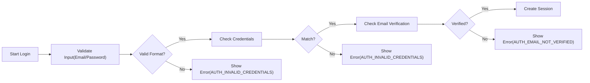
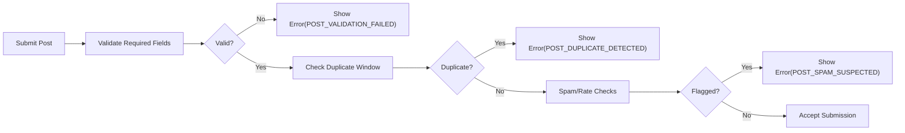
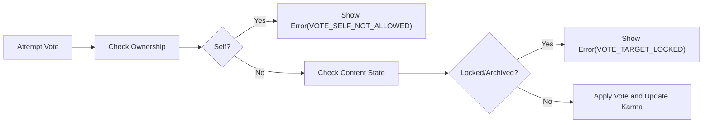

# communityPlatform Exception Handling and Error Model

This requirement standardizes user-centered exception handling and error behaviors across communityPlatform in business terms. It defines what must happen when things go wrong so experiences are predictable, respectful, accessible, localized, and safe. Technical implementations (APIs, HTTP codes, data models, infrastructure) remain at developer discretion and are intentionally excluded.

## 1. Scope, Principles, and Definitions

Scope
- Applies to all user-visible error conditions, warnings, and informational states across: authentication, authorization, communities, posting, commenting, voting/karma, feeds/sorting, subscriptions, profiles, reporting/safety, and system/network issues.
- Includes: rate-limiting and anti-abuse responses; content removed/locked/archived/quarantined placeholders; localization/timezone handling; accessibility; observability and auditing; acceptance criteria.
- Excludes: low-level technical details (API status codes, schemas, infrastructure design).

Guiding Principles
- Clarity: Plain, respectful language; one clear recovery action.
- Consistency: Same issue → same errorKey and structure everywhere.
- Safety and Privacy: Do not leak sensitive details; protect reporters and moderated users.
- Accessibility: Perceivable, operable, understandable, robust.
- Localization: Localized user messages and action hints; timezone-aware timestamps.
- Determinism: Predictable outcomes and placeholders for restricted content states.

Key Terms
- errorKey: Stable, locale-agnostic identifier (e.g., AUTH_INVALID_CREDENTIALS) used for localization, analytics, and QA.
- userMessage: Localized message derived from a template without sensitive data.
- actionHint: Localized, actionable guidance for recovery (e.g., “Verify your email”).
- context: Non-sensitive variables aiding recovery (e.g., community handle, minutes to wait).
- supportRef: Short token to help support correlate incidents without exposing internal IDs.
- visibility: Actor-only, moderator-visible, admin-visible, or public placeholder.

## 2. Standard Error Response Model (Structure)

EARS requirements
- THE platform SHALL include errorKey, userMessage, and actionHint in all user-facing errors.
- WHERE non-sensitive context improves recovery, THE platform SHALL include contextual values (e.g., retry-after minutes, community name).
- WHERE a support flow exists, THE platform SHALL include a supportRef usable by support teams and log it in observability tools.
- THE platform SHALL scope details based on visibility: actor-only, moderator-visible, admin-visible, or public placeholder.
- WHEN an error is presented, THE platform SHALL display it within 2 seconds under normal load for 95% of attempts.

## 3. Error Taxonomy by Domain

Authentication and Account State
- AUTH_INVALID_CREDENTIALS
- AUTH_EMAIL_NOT_VERIFIED
- AUTH_ACCOUNT_LOCKED
- AUTH_ACCOUNT_SUSPENDED
- AUTH_RATE_LIMITED
- AUTH_SESSION_EXPIRED
- AUTH_DEVICE_REVOKED

Authorization and Permissions
- PERM_FORBIDDEN_ACTION
- PERM_COMMUNITY_BAN
- PERM_SITEWIDE_BAN
- PERM_INSUFFICIENT_ROLE

Community and Moderation
- COMMUNITY_NOT_FOUND
- COMMUNITY_PRIVATE
- COMMUNITY_RESTRICTED_MODE
- COMMUNITY_CREATION_LIMIT
- COMMUNITY_RULE_VIOLATION
- COMMUNITY_QUARANTINED

Posting and Content Submission
- POST_VALIDATION_FAILED
- POST_DUPLICATE_DETECTED
- POST_QUOTA_EXCEEDED
- POST_SPAM_SUSPECTED
- POST_REMOVED_MODERATION
- POST_REMOVED_LEGAL
- POST_LOCKED
- POST_ARCHIVED
- LINK_UNREACHABLE
- IMAGE_POLICY_VIOLATION

Commenting and Replies
- COMMENT_VALIDATION_FAILED
- COMMENT_DEPTH_LIMIT
- COMMENT_RATE_LIMITED
- COMMENT_REMOVED_MODERATION
- COMMENT_LOCKED
- COMMENT_ARCHIVED

Voting and Karma
- VOTE_SELF_NOT_ALLOWED
- VOTE_OWNER_RATE_LIMITED
- VOTE_TARGET_LOCKED
- VOTE_REVOKE_WINDOW_EXPIRED
- KARMA_HIDDEN_NEW_ACCOUNT
- KARMA_UPDATE_DELAYED

Feeds and Sorting
- FEED_UNAVAILABLE
- SORT_UNSUPPORTED
- FEED_EMPTY_FOR_FILTERS

Subscriptions and Notifications
- SUB_ALREADY_SUBSCRIBED
- SUB_NOT_SUBSCRIBED
- SUB_LIMIT_REACHED
- SUB_MUTED_ENTITY

Profiles and Identity
- PROFILE_NOT_FOUND
- PROFILE_PRIVATE
- PROFILE_EDIT_CONSTRAINT

Reporting, Safety, and Trust
- REPORT_INVALID_CATEGORY
- REPORT_DUPLICATE_OPEN
- REPORT_RATE_LIMITED
- REPORT_NOT_ALLOWED
- SAFETY_CONTENT_RESTRICTED

System, Network, Unexpected
- SYS_TEMPORARY_UNAVAILABLE
- SYS_TIMEOUT
- SYS_UNKNOWN_ERROR

EARS requirements
- THE platform SHALL use the taxonomy above as canonical errorKey sources for user-visible errors across features.
- WHERE a single action implicates multiple issues, THE platform SHALL present the primary blocking error first and may include secondary hints.

## 4. Error Visibility and Permissions Matrix

Visibility definitions
- Actor-only: Visible to the actor who triggered the error.
- Moderator-visible: Visible to moderators/owners within their community.
- Admin-visible: Visible to site administrators.
- Public placeholder: Non-sensitive indicator visible to all viewers (e.g., “removed by moderators”).

Matrix (business rules, not technical access control)
- Authentication/Authorization errors: actor-only; logged for admins.
- Community policy errors (e.g., COMMUNITY_PRIVATE): actor-only; public pages use neutral gating notices.
- Posting/commenting validation errors: actor-only.
- Removal/legal states: public placeholders; moderator/admin see reason keys; authors see reason category when policy allows.
- Rate limit/abuse: actor-only; generic language; admins see aggregated analytics.
- Safety escalations: actor-only or moderator-visible; admins see full details.

EARS requirements
- THE platform SHALL map each errorKey to a default visibility and SHALL enforce scoping in all surfaces.
- WHERE community policy allows public placeholders, THE platform SHALL display non-sensitive placeholders without revealing reporter identities or internal notes.
- WHERE admin override is used for trust & safety, THE platform SHALL log the override with actor, purpose, and timestamp.

## 5. Common Failure Scenarios and Messages

Representative messages (localized; exact phrasing may vary by locale).

Authentication
- AUTH_INVALID_CREDENTIALS
  - Message: “The email or password is incorrect.”
  - Action: “Re-enter your credentials or reset your password.”
- AUTH_EMAIL_NOT_VERIFIED
  - Message: “Your email is not verified.”
  - Action: “Check your inbox for the verification link or request a new email.”
- AUTH_ACCOUNT_LOCKED
  - Message: “Your account is temporarily locked due to multiple failed attempts.”
  - Action: “Try again later or reset your password.”
- AUTH_SESSION_EXPIRED
  - Message: “Your session expired.”
  - Action: “Log in again to continue.”

Authorization
- PERM_FORBIDDEN_ACTION
  - Message: “You do not have permission to perform this action.”
  - Action: “Switch to an eligible account or contact moderators.”
- PERM_COMMUNITY_BAN
  - Message: “You are banned from this community.”
  - Action: “Review the rules and appeal if available.”

Community
- COMMUNITY_PRIVATE
  - Message: “This community is private.”
  - Action: “Request to join if requests are open.”
- COMMUNITY_RESTRICTED_MODE
  - Message: “Posting is restricted here.”
  - Action: “Follow the community rules or wait for approval.”

Posting
- POST_VALIDATION_FAILED
  - Message: “Your post has issues that need fixing.”
  - Action: “Review highlighted fields and resubmit.”
- POST_DUPLICATE_DETECTED
  - Message: “A similar post was recently submitted.”
  - Action: “Consider contributing to the existing post.”
- POST_SPAM_SUSPECTED
  - Message: “This submission looks like spam.”
  - Action: “Adjust content or try again later.”

Commenting
- COMMENT_DEPTH_LIMIT
  - Message: “Reply depth limit reached.”
  - Action: “Start a new top-level comment.”
- COMMENT_RATE_LIMITED
  - Message: “You are commenting too quickly.”
  - Action: “Wait before posting another comment.”

Voting/Karma
- VOTE_SELF_NOT_ALLOWED
  - Message: “You cannot vote on your own content.”
  - Action: “Vote on content by others.”
- VOTE_TARGET_LOCKED
  - Message: “Voting is locked on this item.”
  - Action: “No further action available.”

Feeds/Sorting
- SORT_UNSUPPORTED
  - Message: “This sort is not available here.”
  - Action: “Choose a supported sorting option.”

Subscriptions
- SUB_LIMIT_REACHED
  - Message: “You reached the subscription limit.”
  - Action: “Unsubscribe from another community to proceed.”

Profiles
- PROFILE_PRIVATE
  - Message: “This profile is private.”
  - Action: “No further action available.”

Reporting/Safety
- REPORT_INVALID_CATEGORY
  - Message: “Select a valid report category.”
  - Action: “Choose one of the allowed categories.”
- REPORT_DUPLICATE_OPEN
  - Message: “A similar report is already open.”
  - Action: “We’ll share updates when the case changes.”

System/Network
- SYS_TEMPORARY_UNAVAILABLE
  - Message: “The service is temporarily unavailable.”
  - Action: “Try again later.”
- SYS_TIMEOUT
  - Message: “The request timed out.”
  - Action: “Retry after checking your connection.”

EARS requirements
- THE platform SHALL localize userMessage and actionHint and avoid sensitive details or user enumeration.
- WHEN multiple validation failures occur, THE platform SHALL present the primary failure and may include secondary hints.

## 6. Recovery and Retry Guidance

EARS requirements
- WHEN authentication fails due to unverified email, THE platform SHALL offer to resend verification with a clear cooldown notice.
- WHEN rate limits are exceeded, THE platform SHALL show remaining wait time in minutes using the user’s timezone and locale formatting.
- WHEN duplicates are detected, THE platform SHALL present a reference to the existing post title and community without exposing sensitive data.
- WHEN link preview fetching fails, THE platform SHALL allow submission without preview and offer a retry option later.
- WHERE moderation approval is required, THE platform SHALL indicate pending status and estimated timelines when available.
- IF content is locked or archived, THEN THE platform SHALL clearly state that further edits or interactions are unavailable.

## 7. Rate Limiting and Abuse Responses

EARS requirements
- WHEN a user exceeds allowed frequency for an action (post/comment/vote/report), THE platform SHALL return a rate-limited error with the earliest retry window.
- WHERE anti-abuse heuristics trigger, THE platform SHALL present a neutral message without revealing thresholds or detection methods.
- WHEN automated restrictions apply, THE platform SHALL provide an appeal or clarification path where appropriate.

Representative actor-facing statements
- “You are performing actions too quickly. Please wait X minutes before trying again.”
- “This action is temporarily restricted to protect the community.”

## 8. Content Removed or Restricted States

States and behaviors
- Author-deleted (POST/COMMENT): placeholder visible; body hidden for others; author sees deletion confirmation.
- Moderator-removed: public placeholder indicates removal by moderators; rule reference shown to author and moderators where allowed.
- Admin-removed (legal/safety): public placeholder with generic policy reference; details restricted to admins.
- Locked: content visible; new comments and votes disabled.
- Archived: content visible; edits and votes disabled after archival window.
- Quarantined community: entry warning; certain features limited.
- Private community: access gated; non-members see a private notice.
- Banned user: blocked from interaction; neutral notices to others where applicable.

EARS requirements
- WHEN content is removed by moderation, THE platform SHALL show a non-sensitive placeholder, include reason category where configured, and conceal private details.
- WHEN content is author-deleted, THE platform SHALL confirm deletion to the author and show a placeholder to others.
- WHEN content is locked or archived, THE platform SHALL disable interactions and show a concise explanation.
- WHERE legal constraints apply, THE platform SHALL provide the most informative generic message allowed.

## 9. Localization, Timezone, and Accessibility

EARS requirements
- THE platform SHALL localize userMessage and actionHint to the user’s language preference while keeping errorKey stable.
- THE platform SHALL render time values in the user’s timezone and locale formatting in errors and notices.
- THE platform SHALL ensure messages use templates that support pluralization and variable substitution without breaking grammar.
- THE platform SHALL meet accessibility standards: ensure errors are perceivable by assistive technologies, provide sufficient contrast, avoid color-only signals, and manage focus to the error region.

## 10. Auditing, Observability, and Support Reference

EARS requirements
- THE platform SHALL generate a supportRef for user-facing errors and log it in observability systems with the errorKey.
- THE platform SHALL record errorKey occurrences with anonymized context for analytics and abuse monitoring.
- THE platform SHALL avoid logging sensitive personal data in error logs.
- THE platform SHALL retain operational logs and error analytics per data lifecycle and governance policies.

## 11. Performance Expectations for Error Delivery

EARS requirements
- THE platform SHALL present authentication error feedback within 2 seconds under normal load for 95% of requests.
- THE platform SHALL present posting, commenting, voting, and feed errors within 2 seconds under normal load for 95% of requests.
- THE platform SHALL ensure the error display does not block other accessible navigation or recovery options when feasible.

## 12. Mermaid Diagrams for Core Error Flows

Authentication Error Flow

Post Submission with Validation and Abuse Checks

Voting on Locked or Archived Content

## 13. Acceptance Criteria and Success Measures

Consistency and Clarity
- THE platform SHALL use the same errorKey for the same condition across all surfaces.
- THE platform SHALL provide one clear actionHint per error and avoid conflicting guidance.

Performance
- THE platform SHALL show errors within 2 seconds for 95% of requests in normal conditions.

Accessibility and Localization
- THE platform SHALL render errors accessible to assistive technologies and localized to user preferences.

Privacy and Safety
- THE platform SHALL avoid exposing sensitive data and ensure placeholders reveal no reporter identities or confidential details.

EARS acceptance
- THE platform SHALL maintain a canonical list of error keys and message templates for QA mapping and translation.
- THE platform SHALL ensure each error path has a documented recovery step available to eligible users.

## 14. Consolidated EARS Requirement Index (Selected)

- THE platform SHALL include errorKey, userMessage, actionHint in all user-facing errors.
- WHERE non-sensitive context helps recovery, THE platform SHALL include context values.
- THE platform SHALL scope details based on visibility roles.
- WHEN an error is presented, THE platform SHALL show it within 2 seconds (p95) under normal load.
- THE platform SHALL use canonical taxonomy errorKeys consistently.
- WHEN rate limits apply, THE platform SHALL include earliest retry window in human-readable terms.
- WHEN link preview fails, THE platform SHALL allow submission without preview and offer retry.
- WHEN content is removed by moderation, THE platform SHALL show placeholders and conceal sensitive details.
- THE platform SHALL localize messages and support pluralization and variable substitution.
- THE platform SHALL generate supportRef tokens and log errorKey occurrences privacy-safely.
- THE platform SHALL meet accessibility, localization, performance, and privacy constraints described above.

## 15. Related Documents

- User Roles and Permissions: ./03-communityPlatform-user-roles-and-permissions.md
- Authentication and Account Lifecycle: ./04-communityPlatform-authentication-and-account-lifecycle.md
- Community and Moderation Rules: ./05-communityPlatform-community-and-moderation-rules.md
- Posting and Content Requirements: ./06-communityPlatform-posting-and-content-requirements.md
- Voting and Karma System: ./07-communityPlatform-voting-and-karma-system.md
- Commenting and Nested Replies: ./08-communityPlatform-commenting-and-nested-replies.md
- Feed Sorting and Discovery: ./09-communityPlatform-feed-sorting-and-discovery.md
- Reporting, Safety, and Trust: ./11-communityPlatform-reporting-safety-and-trust.md
- Nonfunctional Requirements: ./12-communityPlatform-nonfunctional-requirements.md
- Data Lifecycle and Governance: ./14-communityPlatform-data-lifecycle-and-governance.md
