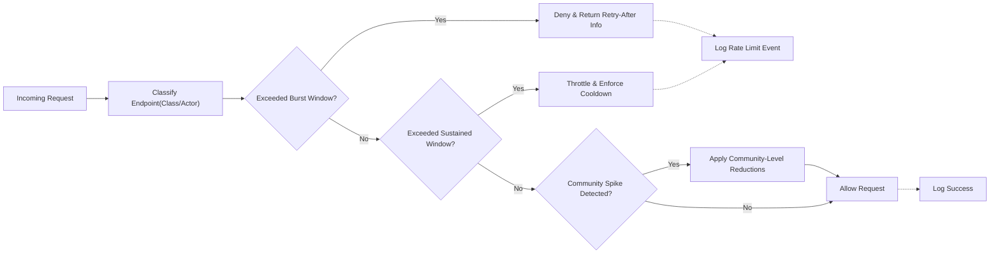
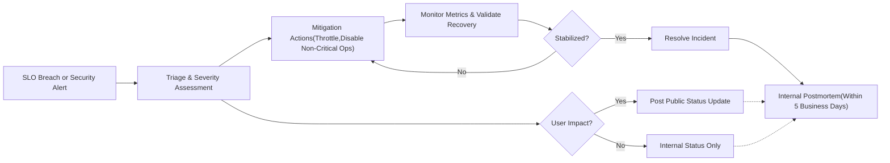

# communityPlatform Non-Functional Requirements (NFR)

This document defines business-level non-functional requirements for the Reddit-like community platform referred to as “communityPlatform”. It specifies measurable targets and policies that apply across all features, including registration and login, communities, posts (text/link/image), voting, comments with nested replies, user profiles, subscriptions, reporting, and moderation.

Scope and Intent (Business Requirements Only)
- This document describes WHAT the system must achieve from a performance, reliability, security, privacy, compliance, rate limiting, and observability perspective. It does not prescribe HOW to implement it. All technical implementation decisions (architecture, APIs, database design, protocols, components) belong to the development team.

Related Documents
- For strategic context: [Service Overview for communityPlatform](./01-communityPlatform-service-overview.md)
- For business model: [Business Model for communityPlatform](./02-communityPlatform-business-model.md)
- For roles and access: [User Actors and Permissions for communityPlatform](./03-communityPlatform-user-actors-and-permissions.md)
- For functional areas: [Community Management Requirements](./05-communityPlatform-community-management.md), [Posting and Content Requirements](./06-communityPlatform-posting-and-content-requirements.md), [Comments and Threads Requirements](./07-communityPlatform-comments-and-threads.md), [Voting and Ranking Requirements](./08-communityPlatform-voting-and-ranking.md), [Subscriptions and Feeds Requirements](./09-communityPlatform-subscriptions-and-feeds.md), [User Profile and Karma Requirements](./10-communityPlatform-user-profile-and-karma.md), [Reporting and Moderation Process](./11-communityPlatform-reporting-and-moderation-process.md), [Notifications and Communications](./12-communityPlatform-notifications-and-communications.md), [Exception Handling and Abuse Prevention](./14-communityPlatform-exception-handling-and-abuse-prevention.md), [Data Lifecycle and Retention](./15-communityPlatform-data-lifecycle-and-retention.md)

## Performance Targets and SLOs

### 2.1 Request Categories and SLI Definitions
- THE platform SHALL classify requests into business categories for measurement:
  - Read: viewing feeds, communities, posts, comments, profiles.
  - Write: registration, login, posting, commenting, voting, reporting, subscriptions, profile edits.
  - Media: image uploads and downloads.
  - Admin/Moderation: queues, actions, escalations.
- THE following Service Level Indicators (SLIs) SHALL be measured per category:
  - Latency: end-to-end server processing time per request until first byte of response is ready.
  - Availability: proportion of requests served without error.
  - Throughput: sustained requests per second and concurrent sessions supported.
  - Correctness: absence of data loss, duplication, or policy violations.

### 2.2 Latency Targets (p50/p95/p99)
- THE platform SHALL meet these latency SLOs under normal operating conditions with representative production traffic and data sizes:

| Request Category | p50 (ms) | p95 (ms) | p99 (ms) |
|------------------|----------|----------|----------|
| Read (simple: post detail, comments page) | 100 | 400 | 800 |
| Read (feed: home/community sorted views) | 150 | 500 | 900 |
| Write (vote, subscribe, report) | 120 | 450 | 900 |
| Write (post create, comment create) | 180 | 650 | 1200 |
| Auth (login, refresh) | 150 | 500 | 900 |
| Admin/Moderation (queue fetch, action) | 180 | 650 | 1200 |
| Media (image metadata ops) | 150 | 500 | 900 |

- WHEN load exceeds normal but remains within planned peak (see 2.3), THE platform SHALL maintain p95 latencies within 1.3x of the above targets.
- IF p95 latency exceeds targets for more than 15 consecutive minutes, THEN THE platform SHALL trigger a performance incident per section 7.5.

### 2.3 Throughput and Concurrency Expectations
- THE platform SHALL sustain, at a minimum:
  - 500 concurrent authenticated sessions performing read operations with p95 latency within targets.
  - 100 concurrent write operations (posts/comments/votes) with p95 latency within targets.
  - 20 concurrent media uploads without causing p95 latency regression across non-media categories.
- WHERE traffic spikes occur up to 2x the daily peak for 10-minute intervals, THE platform SHALL continue to meet availability SLOs and keep p95 latency within 1.5x targets.

### 2.4 Payload and Pagination Policies
- THE platform SHALL require pagination for all list endpoints that can exceed 50 items.
- THE default page size SHALL be 20 items; THE maximum page size SHALL be 100 items.
- WHERE clients request a page size above 100, THE platform SHALL cap the page size at 100 and include an explicit notice in the response payload.
- THE platform SHALL support forward pagination by default; backward pagination is optional per business need of each feature document.

### 2.5 Media Upload/Download Constraints
- THE platform SHALL accept image uploads up to 10 MB per file; larger uploads SHALL be rejected with a clear error and guidance.
- WHERE uploads are 10 MB, THE platform SHALL complete the upload workflow within 60 seconds under a client upstream of at least 10 Mbps.
- THE platform SHALL validate supported image formats as defined in [Posting and Content Requirements](./06-communityPlatform-posting-and-content-requirements.md).
- IF an upload is interrupted, THEN THE platform SHALL allow retry without duplicating media records.

### 2.6 Caching and Freshness (Business Expectations)
- WHILE content freshness is important, THE platform SHALL allow eventual consistency for aggregated views (e.g., home feed, “hot” ranking) such that visible updates may lag up to 60 seconds without violating correctness of underlying data.
- WHERE a user updates personal profile or deletes content, THE platform SHALL reflect owner-visible changes within 5 seconds on subsequent reads.
- WHEN a community rule or visibility setting changes, THE platform SHALL apply new access restrictions to new requests within 30 seconds.

### 2.7 Performance Degradation and Backpressure Rules
- IF system load approaches saturation (e.g., persistent p95 latency > 1.5x targets for 5 minutes), THEN THE platform SHALL apply backpressure by prioritizing read operations over non-critical write operations (e.g., bulk votes), while preserving data integrity.
- IF dependent external services degrade, THEN THE platform SHALL degrade gracefully by:
  - Queueing non-critical operations (e.g., notification dispatch) for later processing.
  - Returning clear, retriable errors for affected operations without data corruption.
- WHERE rate limits are exceeded, THE platform SHALL respond according to section 6 without side effects on protected resources.

## Availability and Reliability Expectations

### 3.1 Availability SLOs and Maintenance Windows
- THE platform SHALL provide 99.9% monthly availability for core user functions (browse, read, post, comment, vote, subscribe, login).
- WHERE planned maintenance is required, THE platform SHALL schedule it during a low-traffic window between 02:00–05:00 Asia/Seoul local time with at least 48 hours advance communication.
- IF availability drops below 99.9% in a calendar month, THEN THE platform SHALL publish an incident summary within 5 business days including impact, root cause, and corrective actions.

### 3.2 Durability, RTO/RPO Objectives
- THE platform SHALL ensure no acknowledged write is lost.
- THE Recovery Time Objective (RTO) for a regional failure SHALL be 4 hours or less.
- THE Recovery Point Objective (RPO) for user-generated content SHALL be 15 minutes or less.
- WHERE feasible, THE platform SHALL store user-generated content with redundancy sufficient to survive a single infrastructure fault without data loss.

### 3.3 Graceful Degradation and Dependency Failures
- WHEN dependent services (e.g., email delivery, image scanning) are unavailable, THE platform SHALL:
  - Continue serving reads from available data stores.
  - Queue or retry non-critical writes (e.g., outbound emails) without blocking unrelated operations.
  - Provide clear, actionable status messages to users for affected features.

### 3.4 Data Consistency Expectations
- THE platform SHALL provide read-after-write consistency to the actor who performed the write for their own content within 5 seconds.
- THE platform SHALL allow eventual consistency for aggregate counts (votes, comments) with a maximum display lag of 60 seconds, without misrepresenting the actor’s own actions (e.g., an upvote by the actor must appear immediately on their view).
- IF conflicting edits occur, THEN THE platform SHALL reject the later write with a clear conflict error, preserving the last confirmed state.

### 3.5 Time and Clock Requirements
- THE platform SHALL use a single authoritative time base for all server-side timestamps recorded in Coordinated Universal Time (UTC).
- THE platform SHALL display times to users localized per their preferences or locale; administrative reporting may additionally show Asia/Seoul local time where relevant.

## Security and Privacy Requirements

### 4.1 Identity, Session, and Token Policies (Business-Level)
- THE platform SHALL require email verification before enabling content creation features.
- THE platform SHALL support short-lived access tokens (30 minutes or less) and longer-lived refresh tokens (30 days or less) for session continuity, consistent with [User Actors and Permissions](./03-communityPlatform-user-actors-and-permissions.md).
- THE platform SHALL allow users to revoke all active sessions and tokens from their account settings, taking effect within 5 minutes.
- IF a session is idle for 30 consecutive days, THEN THE platform SHALL expire the session.

### 4.2 Access Control, Least Privilege, and Admin Safeguards
- THE platform SHALL enforce least-privilege access for all actors: guest, member, admin, and community-level moderators as defined in the related documents.
- WHERE sensitive actions are invoked (e.g., community transfer, account deletion, admin enforcement), THE platform SHALL require step-up verification (e.g., recent password confirmation or equivalent) within the last 5 minutes.
- IF a member is banned at platform or community level, THEN THE platform SHALL immediately block prohibited actions and return clear messaging.

### 4.3 Credential, Secret, and Key Management Expectations
- THE platform SHALL never log raw passwords, tokens, or secrets.
- THE platform SHALL require new passwords to meet minimum strength criteria: at least 10 characters, including at least 1 letter and 1 number, with rejection of commonly breached passwords.
- IF a password reset is initiated, THEN THE platform SHALL invalidate previously issued reset links and tokens.

### 4.4 Data Protection in Transit and At Rest
- THE platform SHALL protect user data in transit and at rest using encryption mechanisms aligned with current industry best practices and applicable regulations.
- THE platform SHALL rotate data protection keys or credentials on a regular cadence of 365 days or less, or immediately upon suspected compromise.
- WHERE data is exported for user download, THE platform SHALL generate time-limited links that expire within 24 hours.

### 4.5 Privacy, PII Handling, and Data Minimization
- THE platform SHALL collect only the minimum personal data required to provide core functionality (e.g., email for account management).
- THE platform SHALL provide user-accessible settings to manage data visibility as defined in related documents.
- IF a user requests data export or deletion, THEN THE platform SHALL handle the request per section 5.2 and [Data Lifecycle and Retention](./15-communityPlatform-data-lifecycle-and-retention.md).
- THE platform SHALL mask or redact PII in logs and analytics by default.

### 4.6 Abuse Prevention Security Controls (Business-Level)
- THE platform SHALL protect authentication against brute-force by limiting failed login attempts to 10 within 15 minutes per account and per network source, followed by a temporary lockout not exceeding 15 minutes.
- THE platform SHALL rate limit content creation actions (posts, comments, messages to moderators) per section 6 to reduce spam and abuse.
- IF suspicious patterns are detected (e.g., rapid voting across many posts), THEN THE platform SHALL throttle affected actions and surface a verification challenge where applicable, without incorrectly attributing actions to other users.

## Compliance and Legal Considerations

### 5.1 Consent, Age, and Terms
- THE platform SHALL require acceptance of Terms of Service and Privacy Notice during registration and upon material changes.
- WHERE local laws require age restrictions, THE platform SHALL restrict account creation to users aged 13 or older.
- THE platform SHALL provide consent capture for communications preferences consistent with [Notifications and Communications](./12-communityPlatform-notifications-and-communications.md).

### 5.2 User Rights (Access, Export, Deletion) and SLAs
- WHEN a verified user requests data export, THE platform SHALL provide a complete, machine-readable export within 30 days.
- WHEN a verified user requests account deletion, THE platform SHALL deprovision access immediately and complete deletion or anonymization processes within 30 days, subject to legal holds detailed in [Data Lifecycle and Retention](./15-communityPlatform-data-lifecycle-and-retention.md).
- WHERE retention is mandated by law or policy, THE platform SHALL clearly communicate any portions of data excluded from deletion and the retention timeline.

### 5.3 Law Enforcement and Legal Requests
- THE platform SHALL accept formally valid legal requests through designated channels and respond within 10 business days, or earlier if required by applicable law.
- THE platform SHALL document disclosure decisions and notify affected users unless legally prohibited.

### 5.4 Content Policy Enforcement Transparency
- THE platform SHALL provide clear, human-readable reasons for enforcement actions (post removal, account suspension) and offer an appeal path per [Reporting and Moderation Process](./11-communityPlatform-reporting-and-moderation-process.md).

## Rate Limiting and Quotas

### 6.1 Global Policies and Windows
- THE platform SHALL define both burst and sustained windows for rate limiting. Burst windows control short spikes; sustained windows prevent long-term abuse.
- THE following standard windows SHALL be used unless a feature specifies stricter limits: 10-second burst window and 1-hour sustained window.

### 6.2 Endpoint Class Quotas (Auth, Read, Write, Media, Admin)
- Auth (login, refresh, password reset):
  - WHERE attempts are successful or failed, THE platform SHALL allow up to 20 attempts per 10 seconds per IP and 10 attempts per 10 seconds per account; sustained 200 per hour per IP and 50 per hour per account.
- Read (feeds, post, comments, profiles):
  - THE platform SHALL allow up to 100 requests per 10 seconds per IP and 3000 per hour per IP; authenticated members may receive increased limits up to 6000 per hour per account.
- Write (votes):
  - THE platform SHALL allow up to 10 votes per 10 seconds per account and up to 600 votes per hour per account, with no more than 60 votes per hour in a single community to discourage brigading.
- Write (comments):
  - THE platform SHALL allow up to 5 comments per 10 seconds per account and up to 120 comments per hour per account; newly created accounts under 24 hours old are limited to 30 comments per hour.
- Write (posts):
  - THE platform SHALL allow up to 3 posts per 10 seconds per account and up to 60 posts per day per account, with a default community-level limit of 10 posts per day per account unless overridden by community rules.
- Reports:
  - THE platform SHALL allow up to 10 report submissions per 10 seconds per account and up to 200 per day per account.
- Media uploads:
  - THE platform SHALL allow up to 3 concurrent uploads per account and up to 30 uploads per hour per account; per-IP caps may be applied in addition to account caps.
- Admin/Moderation:
  - THE platform SHALL allow elevated but finite limits for administrative consoles: up to 60 moderation actions per 10 seconds per moderator and up to 5000 per hour, with stricter auditing as defined in section 7.4.

### 6.3 Community-Level Protections
- WHERE a community experiences a sudden influx of new content or votes exceeding 3x its 7-day average, THE platform SHALL automatically reduce per-account limits in that community by 50% for 60 minutes and notify moderators.
- IF a community is placed in restricted mode by moderators, THEN THE platform SHALL enforce community-specific posting and commenting caps defined in [Community Management Requirements](./05-communityPlatform-community-management.md).

### 6.4 Anti-Automation and Anomaly Responses
- IF the platform detects automated behavior inconsistent with typical human usage patterns, THEN THE platform SHALL introduce graduated friction (e.g., cooling-off delays) before full blocking.
- IF rate limit thresholds are exceeded, THEN THE platform SHALL return a clear error with a unique code and include the earliest time when the action can be retried.

## Observability and Audit Objectives

### 7.1 Logging, Metrics, and Tracing (Business Expectations)
- THE platform SHALL produce logs for security-relevant events (auth attempts, role changes, bans), content actions (post/comment creation, edits, deletions), moderation actions, configuration changes, and system errors.
- THE platform SHALL emit business metrics for active users, posting rates, voting rates, comment depth distribution, report counts, and moderation action counts.
- THE platform SHALL emit technical health metrics (error rates, latency percentiles, queue depth) sufficient to verify SLO compliance.

### 7.2 Request Identification and Correlation
- THE platform SHALL assign a unique request identifier to each inbound request and SHALL include this identifier in responses so users can reference it in support inquiries.
- THE platform SHALL be able to correlate related actions across services using a consistent contextual identifier propagated through internal operations.

### 7.3 Health, Readiness, and Synthetic Monitoring
- THE platform SHALL expose health and readiness indicators sufficient for automated orchestration and traffic management without revealing secrets.
- THE platform SHALL run synthetic transactions (read and write probes) at least every 5 minutes to verify critical paths: login, view community feed, create post in a test community, create comment, vote, and perform a moderation action in a sandbox community.

### 7.4 Audit Logging Scope and Retention
- THE platform SHALL maintain an append-only audit trail for sensitive actions: authentication lifecycle events, permission/role changes, community ownership transfers, content removals, bans, escalations, data exports, and deletions.
- THE audit trail SHALL be tamper-evident and retained for at least 1 year, with access restricted to authorized personnel.
- THE platform SHALL prevent deletion or alteration of audit records by regular administrative users.

### 7.5 Incident Management and Postmortems
- WHEN an SLO breach or critical security event is detected, THE platform SHALL initiate incident response within 15 minutes.
- THE platform SHALL provide periodic public status updates for major incidents at least every 60 minutes until resolution.
- WITHIN 5 business days after resolution, THE platform SHALL publish an internal postmortem including timeline, impact, root cause, corrective actions, and owners; a user-facing summary SHALL be published where user impact occurred.

## Mermaid Diagrams

### 8.1 Rate Limiting Decision Flow

### 8.2 Incident Response Process

## Acceptance and Validation Criteria
- WHEN observed p95 latency for each category remains within targets for 30 consecutive days under normal load, THE platform SHALL be deemed to meet performance SLOs.
- WHEN monthly availability for core functions is at or above 99.9%, THE platform SHALL be deemed to meet availability SLOs.
- WHEN security controls (password policies, token lifetimes, step-up verification, redaction) are verified through audits and penetration testing without critical findings, THE platform SHALL be deemed to meet security requirements.
- WHEN rate limiting and quotas are enforced as specified with accurate user messaging and retry guidance, THE platform SHALL be deemed to meet anti-abuse requirements.
- WHEN audit logs comprehensively capture sensitive actions with 1-year retention and access controls, THE platform SHALL be deemed to meet auditability requirements.

## Glossary
- Availability SLO: Target proportion of time the system successfully serves requests.
- Latency Percentiles: p50 (median), p95 (95th percentile), p99 (99th percentile) response times.
- RPO (Recovery Point Objective): Maximum acceptable data loss measured in time.
- RTO (Recovery Time Objective): Target time to restore service after an outage.
- PII: Personally Identifiable Information.
- Burst Window: Short interval used to cap sudden spikes of requests.
- Sustained Window: Longer interval used to cap ongoing traffic volume.

End of document.