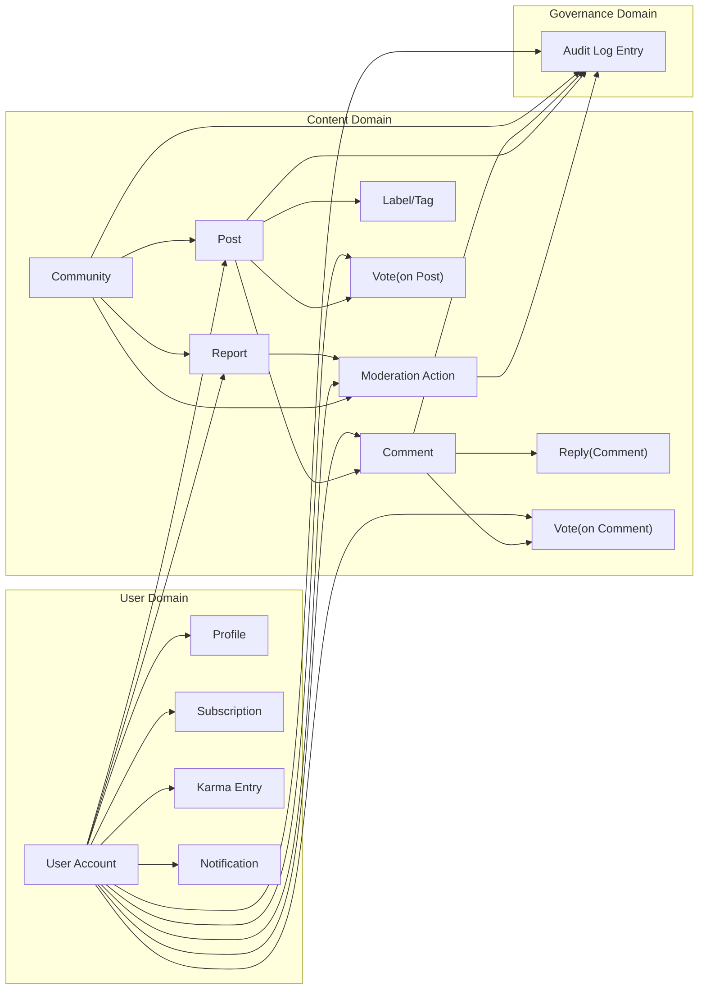
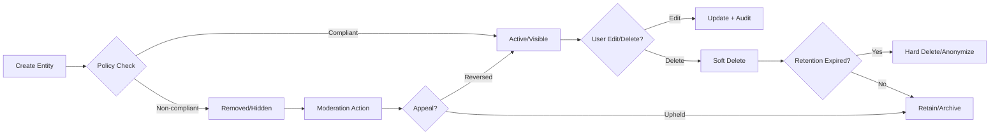
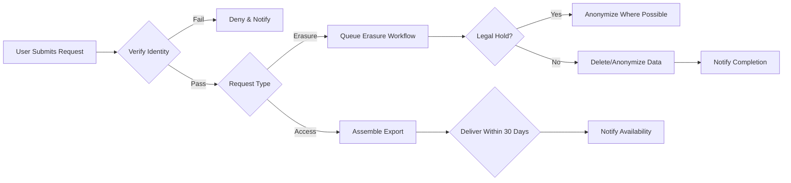

# communityPlatform Data Lifecycle and Governance Requirements

This document defines the conceptual data lifecycle and governance requirements for the communityPlatform service. It specifies WHAT the system must do in business terms to manage, retain, audit, and provide user rights over data. It does not prescribe HOW to implement these requirements; technical decisions (architecture, APIs, storage design) are at the discretion of the development team.

## 1. Introduction and Scope
The communityPlatform is a Reddit-like community service where users register and log in, create communities, post text/links/images, vote, comment with nested replies, subscribe to communities, manage profiles, and report inappropriate content. This document governs data across these capabilities, focusing on lifecycle, retention, auditability, and user rights.

Scope:
- Data categories included: personal data, pseudonymous identifiers, content data (posts, comments, votes), community governance data (reports, moderation actions), profile and subscription data, and audit records.
- States and flows from creation through updates, moderation, archival, deletion/anonymization, and export/portability.
- Compliance-focused obligations (e.g., data minimization, retention limits, access/erasure).

Out of Scope:
- Technical design, data models, schemas, API endpoints, or storage technologies.
- UI/UX specifications or visual layouts.

Assumptions:
- Legal frameworks such as GDPR/CCPA may apply; requirements are expressed in generic business terms to enable compliance without naming specific statutes.
- Communities may be public by default; private or restricted communities may impose additional business constraints captured in related documents.

## 2. Glossary and Definitions
- Personal Data: Information relating to an identified or identifiable natural person (e.g., email, IP-attribution if linked to an account).
- Pseudonymous Data: Data linked to an account identifier but not directly revealing identity (e.g., userId, usernames that are not legal names).
- Content Data: User-generated or system-generated artifacts visible to users (e.g., posts, comments, community descriptions, flairs, tags).
- Behavioral Data: Actions reflecting user interactions (e.g., votes, subscriptions, views where applicable, follows/mutes/blocks).
- Governance Data: Reports, moderation decisions, rule violations, community settings changes, rule records.
- Profile Data: User profile attributes exposed to others based on privacy settings (e.g., bio, avatar, visibility preferences), and activity summaries (e.g., karma).
- Audit Log: Immutable or tamper-evident records of critical actions and security-relevant events.
- Retention: Time period for which data must be kept before deletion or anonymization.
- Archival: Moving data to low-access storage or reduced accessibility state while preserving integrity for compliance reasons.
- Soft Delete: A change of state that hides content from normal presentation while retaining data for recovery or legal obligations.
- Hard Delete: Irreversible removal of data such that it is no longer stored in active systems or backups past their expiration.
- Anonymization: Irreversible removal of personal identifiers such that data can no longer be linked to a user.
- Pseudonymization: Replacement of identifiers with pseudonyms such that re-identification is possible with additional information.
- Data Subject: A user about whom personal data is processed (memberUser, communityOwner, communityModerator, adminUser); guestUser has no account and minimal personal data.

## 3. Conceptual Data Entities and Relationships
The platform manages multiple conceptual entities with high-level relationships. This section is conceptual and does not define schemas or ERDs.

### 3.1 Entities (Conceptual)
- User Account: Credentials, status, email verification state, account lifecycle state.
- Profile: Public-facing attributes, privacy settings, karma summaries.
- Community: Name, description, rules, settings, ownership and moderators.
- Post: Text/link/image post within a community; labels (NSFW, spoiler), tags.
- Comment: Nested reply to a post or another comment.
- Vote: Upvote/downvote applied to posts or comments by a user.
- Subscription: User follows/joins a community; unsubscribe or mute states.
- Report: User-initiated report on content or behavior, with categories.
- Moderation Action: Actions taken by moderators/admins (remove, approve, lock, ban, warn).
- Karma Entry: Ledger entries that accrue or decay reputation based on votes and other triggers.
- Notification: System user-facing notifications about events (mentions, replies, moderation decisions, reports outcome).
- Audit Log Entry: Security and governance events for accountability.

### 3.2 Conceptual Relationship Diagram

## 4. Data Creation, Update, and Deletion Lifecycle
This section describes the business lifecycle for major entities, including states and transitions.

### 4.1 General Lifecycle Rules (EARS)
- THE platform SHALL classify data into personal, content, behavioral, governance, and audit categories for governance decisions.
- THE platform SHALL track ownership or provenance for all entities (e.g., which user created a post or comment; which moderator performed an action).
- THE platform SHALL record state transitions for content visibility (e.g., created, edited, removed by author, removed by moderator, locked, archived).
- WHEN a state transition occurs for any governed entity, THE platform SHALL capture the transition timestamp and actor (user, moderator, system) in audit logs.
- WHERE content violates community or platform policies, THE platform SHALL support removal states that suppress visibility without immediate destruction of data (soft delete) according to retention rules.
- IF legal hold or platform compliance retention applies, THEN THE platform SHALL suspend deletion for affected items until the hold expires or is released by authorized personnel.

### 4.2 User Account and Profile
- WHEN a user registers, THE platform SHALL create a User Account with default privacy settings and empty Profile.
- THE platform SHALL maintain the account state among: pending_verification, active, suspended, deactivated, scheduled_for_deletion, deleted.
- WHEN a user verifies email, THE platform SHALL transition the account to active.
- IF an account is suspended by trust & safety, THEN THE platform SHALL restrict actions while preserving data for investigation.
- WHEN a user requests account deletion, THE platform SHALL transition to scheduled_for_deletion and initiate erasure workflows per Section 6.
- WHERE a user edits Profile data, THE platform SHALL record prior values only where necessary for auditability and safety, not for indefinite versioning.

### 4.3 Communities
- WHEN a memberUser creates a community, THE platform SHALL create a Community entity and set the creator as communityOwner.
- THE platform SHALL allow communityOwner to appoint communityModerator roles and update Community settings and rules.
- WHEN Community settings or rules change, THE platform SHALL record the change, actor, and timestamp in audit logs.
- IF a Community is abandoned or requested for deletion by its owner, THEN THE platform SHALL define content handling consistent with retention and archival policies (e.g., archival prior to deletion) without orphaning moderation records.

### 4.4 Posts
- WHEN a user submits a post, THE platform SHALL create a Post with its initial visibility and labels based on community rules.
- WHERE a user edits a post, THE platform SHALL allow edits according to content policy windows and label requirements, recording edit timestamps.
- IF a post is removed by author, THEN THE platform SHALL mark the Post as removed_by_author and conceal content from standard views while retaining minimal metadata for thread integrity and auditability.
- IF a post is removed by moderators, THEN THE platform SHALL mark the Post as removed_by_moderator and preserve moderator rationale, category, and timestamp in governance data.
- WHERE a post is locked, THE platform SHALL disallow new comments and votes while preserving existing content.
- WHERE a post is archived, THE platform SHALL prevent edits and new interactions while preserving display per policy.

### 4.5 Comments
- WHEN a user submits a comment, THE platform SHALL create a Comment linked to a Post or parent Comment.
- WHERE a user edits a comment, THE platform SHALL allow edits according to policy windows and record edit timestamps.
- IF a comment is removed by author, THEN THE platform SHALL mark it removed_by_author and conceal content while retaining minimal placeholders to preserve thread structure.
- IF a comment is removed by moderators, THEN THE platform SHALL mark it removed_by_moderator and preserve moderation rationale.
- WHERE a comment thread is locked or archived via parent Post state, THE platform SHALL apply the same interaction restrictions to child comments.

### 4.6 Votes
- WHEN a user upvotes or downvotes, THE platform SHALL create or update a Vote associated to the target Post or Comment.
- WHERE a user changes their vote, THE platform SHALL reflect the updated vote and adjust karma per business rules.
- IF a target content is removed or archived, THEN THE platform SHALL preserve vote impact on historical karma calculations according to Section 7 in [Voting and Karma System](./07-communityPlatform-voting-and-karma-system.md).

### 4.7 Subscriptions
- WHEN a user subscribes to a community, THE platform SHALL record a Subscription.
- WHEN a user unsubscribes or mutes, THE platform SHALL update Subscription state and preserve historical changes for auditability for a limited period.

### 4.8 Reports and Moderation Actions
- WHEN a user files a report, THE platform SHALL create a Report with category, target, and timestamp.
- WHEN moderators act (remove, approve, lock, ban, warn), THE platform SHALL create a Moderation Action with actor, rationale, and scope.
- THE platform SHALL ensure that Reports and Moderation Actions remain available for governance review beyond the lifecycle of the content, adhering to retention limits.

### 4.9 Notifications
- WHEN a system event occurs that warrants user notification, THE platform SHALL create a Notification addressed to the recipient.
- WHERE a user clears a notification, THE platform SHALL mark it read/dismissed but retain a bounded history per retention policy.

### 4.10 Lifecycle Diagram (High-Level)

## 5. Retention and Archival Policies
Retention durations are measured in calendar days from the triggering event. Archival refers to reduced-access storage and does not change deletion timelines unless otherwise noted.

### 5.1 Retention Table
| Data Category | Trigger Event | Minimum Retention | Maximum Retention | Notes |
|---|---|---|---|---|
| User Account (active) | Account activation | While account remains active | N/A | Managed by user lifecycle |
| User Account (deleted) | Erasure request confirmed | 30 days | 90 days | Buffer for fraud prevention and recovery; backups expire per policy |
| Profile Data | Creation/update | While account active | 30 days post-erasure | Remove or anonymize on erasure |
| Posts (active) | Post creation | While not removed/archived | N/A | Community policy may archive after window |
| Posts (removed_by_author) | Author removal | 30 days | 180 days | Placeholder retained indefinitely; content purged per max |
| Posts (removed_by_moderator) | Moderator removal | 90 days | 3 years | Governance need; rationale retained per moderation records |
| Comments (active) | Comment creation | While not removed/archived | N/A | Mirrors Posts |
| Comments (removed) | Removal | 30–90 days | 3 years | Governance need |
| Votes | Vote cast/changed | 180 days | 2 years | Aggregates may persist as pseudonymous stats beyond raw retention |
| Subscriptions | Change of state | 180 days | 2 years | Historical changes for abuse analysis |
| Reports | Report creation | 1 year | 3 years | To support investigations and appeals |
| Moderation Actions | Action timestamp | 1 year | 3 years | Required for accountability and appeals |
| Audit Logs (security) | Event timestamp | 1 year | 2 years | Tamper-evident; access restricted |
| Notifications | Creation | 30 days | 180 days | Read/dismissed status retained 30 days |

### 5.2 Retention Rules (EARS)
- THE platform SHALL enforce retention windows per the Retention Table with automated review and purge processes.
- WHEN minimum retention is not yet met, THE platform SHALL deny destruction requests except where legal erasure supersedes.
- WHERE maximum retention is reached and no legal hold applies, THE platform SHALL hard delete or anonymize data within 7 days.
- IF data falls under ongoing investigation or legal hold, THEN THE platform SHALL pause purge and document the hold in governance records.
- WHERE content is soft deleted, THE platform SHALL exclude it from standard discovery and feeds while counting down to purge per policy.
- WHERE aggregated statistics depend on raw data (e.g., vote counts), THE platform SHALL preserve aggregates while purging raw identifiers when their retention period ends.

### 5.3 Archival Behavior
- THE platform SHALL archive older content according to community or platform-wide policies without altering retention deadlines.
- WHEN content is archived, THE platform SHALL prevent edits and new interactions while allowing read access based on visibility rules.

## 6. Right to Access and Right to Erasure
This section defines user rights to access their data and request erasure, including verification, scope, exclusions, and timelines.

### 6.1 Identity Verification (EARS)
- WHEN a user submits a data access or erasure request, THE platform SHALL verify account control through current login and secondary confirmation (e.g., email verification) before processing.
- IF verification fails, THEN THE platform SHALL deny the request and notify the user with instructions to re-verify identity.

### 6.2 Right to Access (DSAR)
Scope:
- Includes: profile data, account metadata, posts, comments, vote history (subject to retention), subscriptions, reports filed by the user, moderation actions performed by the user (if moderator), and notifications addressed to the user.
- Excludes: other users’ personal data, confidential moderation notes not about the requester, and tamper-evident audit internals beyond the requester’s own events summary.

Timelines and Delivery (EARS):
- WHEN a valid access request is received, THE platform SHALL prepare a machine-readable export available within 30 days.
- WHERE the request scope is unusually large, THE platform SHALL provide a staged export, with the first stage available within 30 days and subsequent stages within an additional 30 days each.
- IF the request rate exceeds reasonable limits (e.g., repeated requests within 30 days), THEN THE platform SHALL throttle and inform the user of the next eligible date.

### 6.3 Right to Erasure
Scope and Effects:
- Includes: personal data in profile, account identifiers, direct messages to the extent applicable, and direct links between the user and behavioral events within retention bounds.
- Excludes: governance records (reports, moderation actions) required for platform integrity; public content that must remain for thread integrity will be anonymized rather than destroyed.

EARS Rules:
- WHEN a valid erasure request is confirmed, THE platform SHALL transition the account to scheduled_for_deletion and start the erasure workflow immediately.
- WHERE public content authored by the user would break thread integrity if removed, THE platform SHALL replace author attributions with anonymized placeholders and hide content text while retaining minimal non-identifying placeholders (e.g., “deleted”).
- IF legal obligations require retention of certain records, THEN THE platform SHALL retain those records and sever personal identifiers via anonymization where possible.
- WHERE erasure is completed, THE platform SHALL notify the user and finalize the account as deleted; residual backups SHALL expire within the backup retention period.

### 6.4 DSAR and Erasure Flow (Conceptual)

## 7. Audit Logging Requirements (Conceptual)
Audit logs are essential for accountability, incident response, and compliance. They must prioritize integrity and privacy.

### 7.1 Scope of Audit Events (EARS)
- THE platform SHALL log authentication events: registration, login success/failure, logout, password change, email verification, account state changes.
- THE platform SHALL log content events: post/comment create, edit, delete/removal, lock, archive, restore, and label/tag changes.
- THE platform SHALL log governance events: report creation, triage changes, moderation actions (remove, approve, lock, ban, warn), appeal outcomes.
- THE platform SHALL log role and permission changes: communityOwner assignments, communityModerator appointments/removals, adminUser actions.
- THE platform SHALL log data rights events: data export requests/completions and erasure requests/completions.
- THE platform SHALL log subscription state changes and safety actions (mutes/blocks) where applicable.

### 7.2 Audit Log Properties and Protections (Business Terms)
- THE platform SHALL ensure audit logs are append-only or tamper-evident and accessible only to authorized roles.
- THE platform SHALL minimize personal data within logs, storing only what is necessary for accountability (e.g., userId rather than email where feasible).
- THE platform SHALL retain audit logs per the Retention Table and purge them when maximum retention is reached absent legal holds.
- IF a user exercises erasure rights, THEN THE platform SHALL retain audit entries necessary for platform integrity while severing or anonymizing direct personal identifiers where possible.

## 8. Data Export and Portability
Exports enable users to obtain copies of their data in a commonly used, machine-readable format.

### 8.1 Export Scope
- Profile data and preferences.
- User’s posts and comments (authored content, including timestamps, edited flags, and removal states if applicable).
- Vote history (subject to retention limits) and cumulative karma summaries.
- Subscriptions and muted/blocked entities.
- Reports filed by the user and moderation actions performed by the user (if any).
- Account lifecycle history relevant to the user (e.g., verification timestamps, deactivation/deletion dates).

### 8.2 Export Rules (EARS)
- WHEN a user initiates an export, THE platform SHALL confirm identity and queue the export.
- THE platform SHALL provide the export in a machine-readable, commonly used, and structured format suitable for portability.
- WHERE the export contains third-party content or other users’ personal data, THE platform SHALL limit inclusion to the requester’s own data and public context only.
- IF an export is not collected within 30 days of availability, THEN THE platform SHALL expire the export and require a new request.

### 8.3 Safety and Rate Limits
- THE platform SHALL limit export and erasure requests to a reasonable frequency (e.g., once every 30 days) to prevent abuse.
- THE platform SHALL provide progress and completion notifications through Notifications.

## 9. Compliance, Accountability, and Roles (Business Perspective)
This section clarifies role-based accountability for governance behaviors without prescribing technical authorization mechanisms. Detailed permissions are defined in the [User Roles and Permissions](./03-communityPlatform-user-roles-and-permissions.md) document.

- memberUser: Owns personal and authored content; may request access and erasure subject to exclusions.
- communityOwner/communityModerator: Accountable for community-level governance; actions are auditable; may access Reports and enforce rules within their communities.
- adminUser: Accountable for site-wide governance, escalations, legal holds, and exception handling consistent with [Reporting, Safety, and Trust](./11-communityPlatform-reporting-safety-and-trust.md).

EARS:
- WHERE role-based actions affect data states, THE platform SHALL record the actor role and scope in audit logs.
- IF a role attempts an action outside its permitted scope, THEN THE platform SHALL deny the action and log the attempt as a security-relevant event.

## 10. Appendices: EARS Requirement Index
This appendix collates EARS statements for testability. Each requirement appears in context above; this index aids traceability.

- THE platform SHALL classify data into governance categories.
- THE platform SHALL track ownership/provenance for all entities.
- WHEN a state transition occurs, THE platform SHALL record timestamp and actor in audit logs.
- WHERE content violates policies, THE platform SHALL support soft delete states.
- IF legal hold applies, THEN THE platform SHALL suspend deletion.
- WHEN a user registers, THE platform SHALL create a User Account and Profile.
- THE platform SHALL maintain defined account states.
- WHEN user verifies email, THE platform SHALL set active.
- IF account suspended, THEN restrict actions preserve data.
- WHEN user requests account deletion, THE platform SHALL schedule deletion and start workflow.
- WHERE profile edited, THE platform SHALL record necessary prior values for audit/safety.
- WHEN community created, THE platform SHALL set owner and allow moderator appointments.
- WHEN community rules/settings change, THE platform SHALL audit.
- IF community deletion requested, THEN handle content per retention and avoid orphaning governance records.
- WHEN post submitted, THE platform SHALL create Post with visibility and labels.
- WHERE post edited, THE platform SHALL record edit timestamps and enforce windows.
- IF post removed by author/moderator, THEN mark states and preserve rationale.
- WHERE post locked/archived, THE platform SHALL restrict interactions accordingly.
- WHEN comment submitted, THE platform SHALL create Comment with proper linkage.
- WHERE comment edited, THE platform SHALL record edit timestamps.
- IF comment removed by author/moderator, THEN mark states and preserve rationale.
- WHERE parent locked/archived, THE platform SHALL apply to children.
- WHEN vote cast/changed, THE platform SHALL create/update Vote and adjust karma.
- IF target archived/removed, THEN preserve historical impact per voting rules.
- WHEN subscription state changes, THE platform SHALL record and audit within retention.
- WHEN report filed, THE platform SHALL create Report.
- WHEN moderation action taken, THE platform SHALL create Moderation Action.
- THE platform SHALL retain Reports and Actions beyond content lifecycle.
- WHEN notification created, THE platform SHALL allow dismiss/read and retain limited history.
- THE platform SHALL enforce retention windows and automated purges.
- WHEN minimum retention unmet, THE platform SHALL deny destruction except legal erasure.
- WHERE maximum retention reached and no hold, THE platform SHALL purge within 7 days.
- IF legal hold, THEN pause purge and document hold.
- WHERE content soft-deleted, THE platform SHALL exclude from standard discovery.
- WHERE aggregates depend on raw data, THE platform SHALL preserve aggregates while purging identifiers.
- THE platform SHALL archive content without changing deletion timelines.
- WHEN archived, THE platform SHALL prevent edits/interactions.
- WHEN DSAR/erasure submitted, THE platform SHALL verify identity.
- IF verification fails, THEN deny and notify.
- WHEN valid access request received, THE platform SHALL deliver export within 30 days or staged delivery for large scope.
- IF requests too frequent, THEN throttle and inform next eligible date.
- WHEN erasure confirmed, THE platform SHALL schedule and start erasure.
- WHERE public content would break threads, THE platform SHALL anonymize placeholders.
- IF legal obligations, THEN retain records with severed identifiers.
- WHERE erasure completed, THE platform SHALL notify; backups expire per policy.
- THE platform SHALL log security, content, governance, role, and data rights events.
- THE platform SHALL protect audit logs (append-only/tamper-evident, minimal PII, retention).
- IF erasure exercised, THEN retain necessary audit with anonymized identifiers where possible.
- WHEN export initiated, THE platform SHALL confirm identity and queue export.
- THE platform SHALL provide machine-readable, commonly used export format.
- WHERE export includes third-party data, THE platform SHALL limit to requester’s data and public context.
- IF export not collected in 30 days, THEN expire and require new request.
- THE platform SHALL rate-limit export/erasure requests and notify progress via Notifications.

References to Related Documents:
- See [User Roles and Permissions](./03-communityPlatform-user-roles-and-permissions.md) for role capabilities.
- See [Authentication and Account Lifecycle](./04-communityPlatform-authentication-and-account-lifecycle.md) for account state transitions.
- See [Community and Moderation Rules](./05-communityPlatform-community-and-moderation-rules.md) for enforcement processes.
- See [Posting and Content Requirements](./06-communityPlatform-posting-and-content-requirements.md) for content rules.
- See [Voting and Karma System](./07-communityPlatform-voting-and-karma-system.md) for vote impact and karma handling.
- See [Commenting and Nested Replies](./08-communityPlatform-commenting-and-nested-replies.md) for thread behavior.
- See [Feed Sorting and Discovery](./09-communityPlatform-feed-sorting-and-discovery.md) for exposure implications.
- See [User Profiles and Subscriptions](./10-communityPlatform-user-profiles-and-subscriptions.md) for identity and follow behavior.
- See [Reporting, Safety, and Trust](./11-communityPlatform-reporting-safety-and-trust.md) for report handling and appeals.
- See [Nonfunctional Requirements](./12-communityPlatform-nonfunctional-requirements.md) for performance and privacy expectations.
- See [Exception Handling and Error Model](./13-communityPlatform-exception-handling-and-error-model.md) for standardized user-visible errors.
