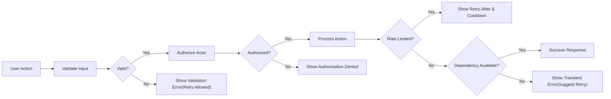
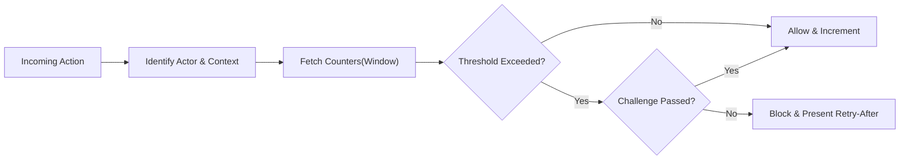
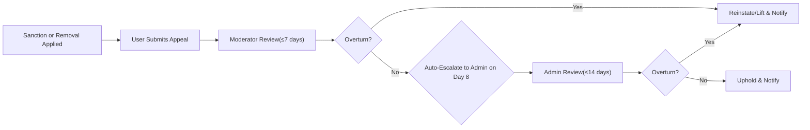

# communityPlatform Exception Handling and Abuse Prevention Requirements

## Introduction and Scope
- Objective: Ensure predictable, transparent, and fair responses to errors and abuse across registration, authentication, posting, commenting, voting, subscriptions, reporting, moderation, notifications, and appeals.
- Actors: guest, member, moderator (community-level role held by a member), and admin (platform operator).
- Performance expectation (user-perceived): THE platform SHALL surface error outcomes and recovery guidance within 2 seconds under normal load (p95) for interactive actions.
- Out of scope: UI layouts, visual design, database schemas, API contracts, and infrastructure specifics.

EARS principles (ubiquitous):
- THE platform SHALL express business rules in unambiguous, testable terms.
- WHEN a rule applies to a scoped role (moderator), THE platform SHALL restrict its effect to the assigned community scope.
- IF a rule conflicts with platform policy, THEN THE platform SHALL prioritize platform policy and record rationale in audit logs.

## Error Categories and User Messaging
Error responses must be consistent, actionable, and privacy-preserving. Each error presented to a user SHALL include: title, human-readable message, stable errorCode, nextSteps, canRetry, and where applicable retryAfterSeconds.

### Canonical Categories
| Category | Description | Typical Triggers | Retry Guidance |
|---|---|---|---|
| Validation Error | Input fails business rules | Empty title, invalid URL, oversized image | Correct inputs; retry immediately |
| Authentication Required | Action needs login | Guest attempts to vote | Log in; retry immediately |
| Authorization Denied | Actor lacks permission | Member attempts admin-only action | Do not retry; request appropriate role |
| Not Found | Target missing or removed | Deleted post permalink | Do not retry; verify resource |
| Conflict | State conflict with constraints | Duplicate post in same community | Modify and retry |
| Rate Limited | Velocity or quota exceeded | Too many comments quickly | Retry after window provided |
| Payload Too Large | Size/dimension over limits | 12 MB image upload | Reduce size and retry |
| Unsupported Type | Disallowed format/type | ftp:// link scheme | Convert/choose supported type |
| Dependency Unavailable | Upstream temporarily down | Image scanning outage | Retry later; safe fallback |
| Maintenance | Planned/unplanned downtime | Read-only window | Retry after window |
| Suspended/Restricted | Sanction prevents action | Community ban active | Wait for expiry or appeal |
| Unknown Error | Unclassified failure | Unexpected exception | Retry once; contact support if persists |

Messaging requirements (EARS):
- THE platform SHALL avoid exposing internal identifiers or stack traces in user-facing messages.
- WHEN an action is rate limited, THE platform SHALL include retryAfterSeconds accurate to ±5 seconds.
- WHEN a resource is absent due to deletion or privacy, THE platform SHALL present a neutral “not available” message without confirming prior existence to unauthorized viewers.
- WHEN a guest triggers an authenticated-only action, THE platform SHALL prompt sign-in and preserve user intent for seamless retry post-authentication (e.g., vote, subscribe).
- WHERE content is quarantined or under review, THE platform SHALL display state and an expected review window without disclosing reporter identities or private notes.
- IF a sanction prevents an action, THEN THE platform SHALL display sanction type, scope (community/platform), start time, and end time/duration with an appeal link.
- WHEN input validation fails, THE platform SHALL identify each invalid field and the violated rule in plain language, including allowed ranges or formats.
- WHEN a dependency is unavailable, THE platform SHALL return a transient error with retry guidance and SHALL not drop user-authored data silently.

Accessibility and localization:
- THE platform SHALL ensure error texts are concise, non-technical, and understandable at a target reading level equivalent to US grade 7–9.
- WHERE locale preferences exist, THE platform SHALL render messages in that locale while keeping stable error codes language-agnostic.

## Common Failure Scenarios and Recovery
### Registration and Login
- WHEN registration uses an email already in use, THE platform SHALL return a validation error and SHALL offer password reset or login.
- WHEN login fails 5 times in 10 minutes for an account, THE platform SHALL require a human-verification challenge and SHALL impose a 15-minute cooldown without challenge.
- WHEN an account is unverified, THE platform SHALL restrict posting, commenting, voting, and reporting and SHALL offer resend verification with a 60-second resend cooldown.

### Community and Posting
- WHEN community creation violates naming rules (reserved, duplicate, disallowed characters), THE platform SHALL block creation and list the violated rule(s) and allowed pattern.
- WHEN submitting a post with an invalid title length, THE platform SHALL reject and preserve a recoverable draft for at least 30 minutes.
- WHEN submitting a link post with a malformed URL or blocklisted domain, THE platform SHALL reject with a specific reason and a path to request review.
- WHEN uploading an image exceeding limits, THE platform SHALL reject and indicate max allowed size and dimensions.
- WHERE a community requires approval, THE platform SHALL place submissions in “pending review” and SHALL indicate an expected review window (default ≤ 48 hours).

### Comments and Threads
- WHEN replying to a locked or archived thread, THE platform SHALL deny the action and indicate the lock/archive state.
- WHEN a comment exceeds maximum length or link count, THE platform SHALL reject with the precise limit and current measure.
- WHEN moderation removes a comment, THE platform SHALL show a removal notice to the author and moderators with rule code and timestamp.

### Voting and Reporting
- WHEN a member attempts self-voting and self-voting is disallowed, THE platform SHALL deny the vote and present the rule summary.
- WHEN votes exceed velocity thresholds, THE platform SHALL throttle additional votes and SHALL indicate the remaining cooldown.
- WHEN reports exceed per-user limits, THE platform SHALL block further submissions and SHALL optionally queue user note drafts for later submission.

### Subscriptions and Profiles
- WHEN subscribing to a private community without access, THE platform SHALL present a request-to-join flow including expected response windows.
- WHEN viewing a private or blocked profile, THE platform SHALL show only allowed fields and indicate that other fields are hidden.

### Notifications
- WHEN external notification delivery fails (bounce/invalid token), THE platform SHALL suppress further attempts on that channel and SHALL retain the in-app record.

## Spam and Bot Prevention Policies
### Account Eligibility Controls
- THE platform SHALL require email verification before enabling posting, commenting, voting, reporting, and community creation.
- WHERE account age < 24 hours, THE platform SHALL apply beginner thresholds (reduced posting/commenting/voting limits) and SHALL label rate-limit responses accordingly.
- WHERE total karma is below policy thresholds, THE platform SHALL restrict link posts and image attachments unless moderator-approved.
- WHERE repeated suspicious rejections occur (e.g., spam patterns), THE platform SHALL require a human-verification challenge prior to additional attempts.

### Content Quality and Link Safety
- WHEN a link is from a blocklisted or low-reputation domain, THE platform SHALL block or require moderator approval and provide a reason code and escalation path.
- WHEN identical or near-duplicate posts are submitted to the same community within 24 hours by the same account, THE platform SHALL block the duplicate and SHALL reference the original item.
- WHEN the same external link is posted to more than 3 distinct communities within 24 hours by the same account, THE platform SHALL require human verification and SHALL flag the account for moderator review.
- WHEN spam patterns are detected in text (e.g., repeated promotions), THE platform SHALL quarantine the content pending review and SHALL inform the user (typical duration ≤ 48 hours).

### Behavior and Velocity Heuristics
- WHEN action velocity exceeds defined thresholds, THE platform SHALL apply rate limits with explicit wait windows.
- WHERE coordinated activity is suspected (e.g., multiple new accounts promoting the same link), THE platform SHALL reduce per-account limits by 50% for 60 minutes in the affected community and SHALL notify moderators with a summary.
- IF a user is blocked or muted by many recipients within 24 hours, THEN THE platform SHALL limit that user’s ability to mention or message others for 24 hours and SHALL present a notice with appeal options.

### Human Verification Challenges
- WHEN risk signals surpass a risk threshold, THE platform SHALL present a human-verification challenge and, on success, SHALL proceed with the action immediately.
- WHERE a user fails human verification 3 times consecutively, THE platform SHALL impose a 30-minute cooldown for the challenged action.

### False Reporting and Reporter Integrity
- WHEN a member files 20 or more reports within 30 days that are found baseless or malicious, THE platform SHALL flag the account for review and MAY restrict reporting to 1 per day for 14 days.
- WHERE a member repeatedly abuses reporting to harass others, THE platform SHALL apply proportionate sanctions (warning → temporary reporting suspension → community ban).

## Rate Limiting Behaviors and Lockouts
Global principles (EARS):
- THE platform SHALL present remaining quota or next eligible time when an action is rate-limited.
- THE platform SHALL reset counters after the specified window elapses.
- WHERE an action is blocked due to limits, THE platform SHALL not consume additional quota for repeated blocked attempts within the same window.
- WHERE a user holds moderator role in a community, THE platform SHALL allow at least 2× moderation action thresholds in that community.

Business defaults (subject to policy tuning):
| Action | Guest | Member | Moderator (in-scope) | Admin |
|---|---:|---:|---:|---:|
| Registrations per network per hour | 2 | N/A | N/A | N/A |
| Login attempts before challenge (10 min) | 5 | 5 | 7 | 10 |
| Post creations per community per 24h | N/A | 10 | 30 | 100 |
| Post creations platform-wide per 24h | N/A | 25 | 75 | 200 |
| Comment creations per hour | N/A | 60 | 180 | 600 |
| Votes per hour | N/A | 200 | 400 | 1000 |
| Reports per 24h | N/A | 50 | 200 | 500 |
| Image upload bytes per 24h | N/A | 500 MB | 2 GB | 10 GB |
| Mentions (distinct users) per 24h | N/A | 50 | 200 | 500 |

Lockouts and cooldowns:
- WHEN post creation limits are exceeded, THE platform SHALL block further posts and SHALL show the exact next allowed submission time.
- WHEN repeated login challenges occur 3 times in 24 hours, THE platform SHALL impose a 24-hour cooldown for login attempts from that account.
- WHEN repeated rate-limit violations span multiple actions, THE platform SHALL apply a composite 1-hour platform-wide cooldown on non-read actions and SHALL notify the user with rationale.

## Abuse Handling and Sanctions
Definitions:
- Content-level actions: removal, quarantine, labeling (NSFW/Spoiler), limited visibility.
- Community-level actions: posting restrictions, temporary community bans, read-only states, invite-only mode.
- Platform-level actions: temporary suspension, permanent ban.

Principles (EARS):
- THE platform SHALL apply the least-severe effective sanction first, escalating with repeat or severe violations.
- WHEN content is actioned, THE platform SHALL notify the author with reason category, scope, timestamp, and appeal path.
- IF a violation is severe (e.g., illegal content, credible threats), THEN THE platform SHALL remove content immediately and SHALL escalate for platform-level review without prior warnings.
- WHEN a sanction is issued, THE platform SHALL specify duration, scope (content/community/platform), and rule code with a human-readable summary.
- WHERE sanctions are community-level, THE platform SHALL allow moderators to manage sanctions in-scope while preserving admin superseding authority.

Sanction ladder (default durations):
- Warning: advisory; expires after 90 days without further violations.
- Content Removal: immediate; content hidden from general users; author sees removal notice.
- Temporary Community Ban: 1 day → 7 days → 30 days for repeat violations within 180 days.
- Temporary Platform Suspension: 7 days after 3 community-level bans within 90 days or for severe violations.
- Permanent Platform Ban: for egregious or repeated violations after investigation.

Moderator misuse safeguards:
- WHEN moderator actions show a pattern of unjustified removals or sanctions, THE platform SHALL enable admin review and MAY revoke moderator privileges for policy abuse.
- WHEN a moderator acts on their own content, THE platform SHALL require peer moderator or owner/admin review of that case.

Transparency and records:
- THE platform SHALL maintain an author-visible history of sanctions with dates, durations, and reason codes.
- THE platform SHALL maintain moderator-accessible audit trails for in-scope actions with necessary redactions.

## Appeal and Reinstatement Policies
Eligibility and timelines:
- THE platform SHALL allow authors to appeal content removals and sanctions within 30 days of action.
- THE platform SHALL require a concise rationale with any supporting evidence.
- WHEN an appeal targets a community-level action, THE platform SHALL route to moderators first and auto-escalate to admins on day 8 if no decision.
- WHEN an appeal reaches admins, THE platform SHALL provide a decision within 14 days.

Outcomes and remedies:
- WHEN an appeal is upheld, THE platform SHALL maintain the original enforcement and SHALL provide a reasoned explanation.
- WHEN an appeal is overturned, THE platform SHALL reinstate content or lift sanctions immediately and SHALL remove associated strikes where applicable.
- WHERE partial reinstatement applies (e.g., label change), THE platform SHALL document the new state and implications to the user.

Appeal rate limits:
- WHERE a user submits more than 3 unsuccessful appeals within 30 days, THE platform SHALL impose a 30-day cooldown on new appeals unless materially new evidence is provided.

Notifications:
- THE platform SHALL notify the appellant at each stage transition: submission received, in review, decision, and escalations.

## Visual Flows (Mermaid)

### General Error Handling Flow

### Rate Limiting Decision Flow

### Appeal Escalation Flow

## Cross-Document References
- User actors and permissions: User Actors and Permissions Requirements.
- Posting constraints and validation: Posting and Content Requirements.
- Comment structure and behaviors: Comments and Threads Requirements.
- Voting constraints and sort definitions: Voting and Ranking Requirements.
- Reporting workflows and moderation actions: Reporting and Moderation Process.
- Notifications and communication policies: Notifications and Communications Requirements.
- Performance, availability, security, and rate limits: Non-Functional Requirements.
- Data lifecycle, retention, and deletion rules: Data Lifecycle and Retention Requirements.
