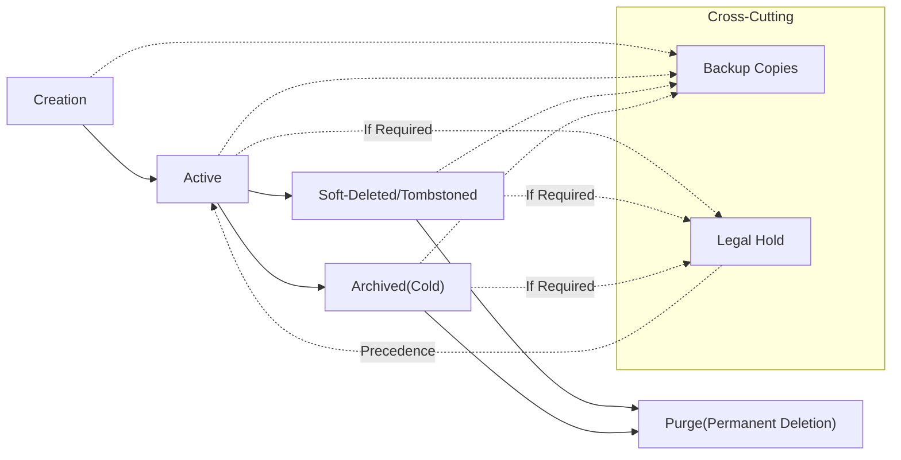
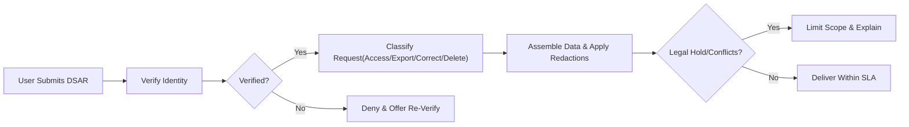
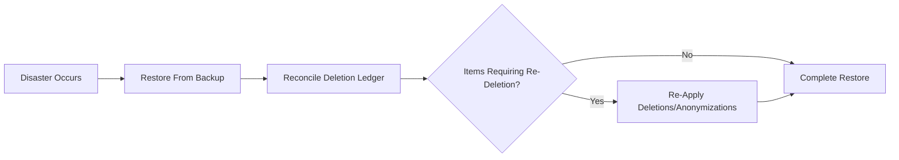

# communityPlatform Data Lifecycle and Retention Requirements

Purpose: Establish business-only requirements governing how data is created, retained, archived, exported, deleted or anonymized, preserved under legal hold, and reconciled with backups and restores across the platform.

## Scope and Non-Goals
- Scope includes: user identity and account records, community metadata, posts, comments, votes and karma inputs, subscriptions, reports and moderation records, notifications and communications metadata, audit and security logs, abuse signals, media and derivatives, analytics.
- Non-goals: No technical implementation, storage engine, database schema, vendor or protocol decisions. No code or algorithms. All durations and SLAs are stated in business terms.

## Actors and Roles
- Member (user): Can request data export and account deletion; can delete authored content; can manage privacy settings.
- Moderator (community-scoped role held by a member): May action content and members within community scope; has no authority over platform-wide data retention policies.
- Admin (platform operator): Oversees global policies, escalations, legal holds, compliance requests, and backup/restore processes.
- Legal/Compliance (admin function): Applies and releases legal holds, validates jurisdictional requirements, and oversees transparency reporting.

EARS requirements
- THE platform SHALL respect actor scopes when processing lifecycle actions (member vs moderator vs admin).
- WHERE an action requires identity verification (e.g., export, deletion), THE platform SHALL complete identity verification before processing the request.

## Conceptual Data Lifecycle

Principles
- "Active": data is visible and usable according to business visibility rules.
- "Soft-Deleted/Tombstoned": hidden from general users while preserving structure and audit context.
- "Archived(Cold)": moved to lower-access tier for compliance/operational needs; not part of normal user flows.
- "Purge": irreversible removal from primary systems after retention and hold checks.
- "Backup Copies" and "Legal Hold" can temporarily extend data presence beyond ordinary retention timelines within policy bounds.

EARS
- THE platform SHALL record lifecycle state transitions with timestamp, actor (role), and reason for audit.
- IF a legal hold exists on a record or category, THEN THE platform SHALL prevent purge until the hold is released by authorized personnel.

## Data Categories and Sensitivity Levels
- User Identity and Account: email, username, profile, consent records. Sensitivity: high (personal data).
- Community Metadata: community names, descriptions, rules, moderator assignments. Sensitivity: medium.
- Posts and Media: titles, bodies, links, images, flags (NSFW/Spoiler). Sensitivity: variable by content.
- Comments: text and nesting metadata. Sensitivity: variable by content.
- Votes and Karma Inputs: up/down votes on posts/comments. Sensitivity: medium (behavioral data).
- Subscriptions: user-to-community relationships. Sensitivity: low/medium.
- Reports and Moderation: report reasons, reporter identity, decisions, sanctions. Sensitivity: high.
- Notifications and Communications: in-app entries, delivery metadata. Sensitivity: medium.
- Audit and Security Logs: administrative actions, authentication events. Sensitivity: high.
- Abuse/Anti-Manipulation Signals: rate-limit events, suspected spam patterns. Sensitivity: high.
- Analytics (Aggregated/De-identified): counts, trends. Sensitivity: low.
- Media Derivatives: thumbnails, previews. Sensitivity: mirrors parent media.

EARS
- THE platform SHALL classify data into the categories above and apply category-specific retention policies.
- WHERE a datum contains personal information, THE platform SHALL minimize collection and retention to the shortest business-justified period.

## Retention and Archival Policies
Default retention periods stated in days unless noted. Archival denotes a low-access tier used for compliance and operations.

| Data Category | Examples | Active Retention | Archival Policy | Purge Window After Deletion/End | Rationale |
|---|---|---|---|---|---|
| User Identity & Account | email, username, profile, consents | Life of account | Consent versions archived 2 years after change | 30 days post account deletion (consent retained per law) | Compliance, reversibility window |
| Authentication Artifacts | sessions, refresh tokens | Session lifetime (≤ 30 days) | None | 0–7 days post invalidation | Security risk reduction |
| Community Metadata | name, rules, mods | Life of community | Snapshot at deactivation retained 1 year | 30 days post deletion | Dispute resolution |
| Posts (Text/Link) | title, body, URL, flags | Life of post | Optional 1 year after author deletion if appealed | 30 days post author/mod deletion | Appeals window |
| Media (Images) | originals, thumbnails | Life of post | Thumbnails optional 30 days | 30 days post post deletion | Storage hygiene |
| Comments | text, nesting | Life of comment | Optional 1 year after author deletion if appealed | 30 days post deletion | Thread integrity |
| Votes | up/down on items | Life of item | Aggregates retained; per-vote logs 90 days | 0–30 days post user deletion | Privacy & analytics |
| Subscriptions | follows | Life of account | None | Immediate on account deletion | Personalization reset |
| Reports | reasons, reporter | Until resolution + 2 years | Archive 2 years | Purge 2 years post resolution | Safety and audit |
| Moderation Actions | removals, bans | Until end + 2 years | Archive 2 years | Purge 2 years post end | Enforcement history |
| Notifications | in-app items | 365 days | None | Purge after 365 days | Reduce clutter |
| Communications Metadata | delivery logs | 365 days | None | Purge after 365 days | Troubleshooting |
| Audit Logs | admin/security actions | 2 years | Archive 2 years | Purge 2 years after creation | Accountability |
| Security Logs | auth failures, IP | 180 days; 365 days for incidents | None | Purge after retention | Threat analysis |
| Abuse Signals | rate-limit, spam | 1 year from last signal | None | Purge 1 year after last activity | Integrity risk window |
| Analytics (De-identified) | daily counts | Indefinite (de-identified only) | Not applicable | Not applicable | Product insights |

EARS
- THE platform SHALL enforce the retention durations stated above for each category.
- WHEN retention expires and no legal hold exists, THE platform SHALL purge within 7 days of expiry.
- WHERE archival is indicated, THE platform SHALL restrict archive access to authorized personnel and record access events.
- IF a security incident is associated with a record, THEN THE platform SHALL extend related log retention to 365 days.

## Deletion, Anonymization, and Tombstoning
### Content (Posts and Comments)
- Soft-Deletion/Tombstoning
  - WHEN an author deletes content, THE platform SHALL immediately hide the body from general users and show a neutral tombstone label where needed to preserve thread readability.
  - WHILE content is tombstoned, THE platform SHALL retain it for up to 30 days before purge, unless legal hold or appeal applies.
- Moderation Removal
  - WHEN moderators remove content for policy violations, THE platform SHALL hide it from public feeds and mark it for purge after the retention window unless an appeal is open.
- Anonymization and Redaction
  - WHERE anonymization is applicable (e.g., analytics), THE platform SHALL irreversibly remove direct identifiers and prevent re-identification from public data.

EARS
- WHEN 30 days elapse after author deletion and no hold exists, THE platform SHALL purge content bodies and media from primary systems.
- WHERE a removal is under appeal, THE platform SHALL defer purge until the appeal is resolved.

### Votes and Karma Inputs
EARS
- WHEN a user deletes their account, THE platform SHALL remove associations between the user and past votes within 30 days while preserving aggregate counts for ranking.
- WHERE a vote is invalidated by integrity review, THE platform SHALL exclude it from karma and ranking calculations prospectively and retroactively in summaries within 24 hours.

### Subscriptions
EARS
- WHEN a user deletes their account, THE platform SHALL immediately remove all subscriptions and stop home feed assembly for that account.

## Account Deletion and Grace Periods
- Identity Verification
  - WHEN a user requests account deletion, THE platform SHALL verify identity using policy-approved methods before proceeding.
- Grace Period
  - WHEN a deletion request is confirmed, THE platform SHALL deactivate access immediately and provide a 14-day grace period to cancel deletion.
- Finalization
  - WHEN 14 days pass without cancellation, THE platform SHALL begin deletion processing and complete removal/anonymization within 30 days, subject to legal holds.
- Residual Records
  - THE platform SHALL retain records required by law (e.g., consent logs, audit entries) per the retention schedule while minimizing personal data.

EARS
- WHEN deletion finalizes, THE platform SHALL anonymize or delete profile identifiers and disassociate personal identifiers within 30 days.
- IF a legal hold conflicts with deletion, THEN THE platform SHALL inform the requester that certain data cannot be deleted until the hold is released.

## Data Subject Requests (Access/Export/Deletion/Correction)
### DSAR Workflow and SLAs
EARS
- WHEN a verified user requests data export, THE platform SHALL provide a machine-readable export within 30 days and limit to one active export per user every 30 days.
- WHEN a verified user requests access, THE platform SHALL provide a summary of held data categories and purposes within 30 days, redacting third-party data.
- WHEN a verified user requests correction, THE platform SHALL permit correction of editable profile fields within 30 days; immutable identifiers remain unchanged.
- WHEN a verified user requests deletion, THE platform SHALL follow the Account Deletion process and timelines.

### Identity Verification and Fraud Prevention
EARS
- THE platform SHALL require identity verification before fulfilling DSARs; if verification fails, THE platform SHALL deny the request and provide a path to re-verify.
- WHERE a DSAR is excessive or manifestly unfounded or repetitive, THE platform SHALL throttle processing and may request additional verification or decline per policy.

### DSAR Flow Diagram

## Legal Holds and Exceptions
- Sources: court orders, law enforcement requests, litigation holds, regulatory directives.
- Scope: can apply to individuals, communities, or categories (e.g., reports, audit logs) and override purge until release.

EARS
- WHEN a legal hold is applied, THE platform SHALL suspend purge and archival expiration for the affected scope immediately.
- WHEN a legal hold is released, THE platform SHALL resume timers and process overdue purges within 30 days.
- WHERE legal secrecy is required, THE platform SHALL avoid notifying users if notification is legally prohibited, while recording the hold internally.

## Backup and Restore Objectives (Business-Level)
- Objectives: preserve recoverability without undermining deletion promises.
- Targets: RPO 24 hours for critical user content; RTO 24 hours for restoration of critical user-facing functionality.

EARS
- THE platform SHALL maintain rolling backups sufficient to achieve the stated RPO.
- THE platform SHALL complete restoration of critical functionality within the RTO target after a disaster.
- WHEN restoring from backups, THE platform SHALL re-apply all fulfilled deletions and anonymizations within 30 days post-restore.
- WHERE backups contain data later deleted in production, THE platform SHALL ensure such data expires from backups according to the standard backup retention window (e.g., 30 days).

### Backup/Restore Reconciliation Flow

## Regional and Age-Based Considerations
EARS
- WHERE regional law mandates different retention limits, THE platform SHALL apply the stricter rule for users domiciled in that region.
- WHERE age restrictions apply (e.g., minors), THE platform SHALL minimize retention and deny NSFW-related previews by default; deletion requests for minors SHALL receive prioritized handling within 14 days.
- WHEN regional data residency is required by law, THE platform SHALL restrict processing to the permitted regions for the applicable data categories.

## Third-Party Processors and Cross-Border Transfers
EARS
- WHERE third-party processors handle certain data categories (e.g., email delivery, image scanning), THE platform SHALL ensure contracts include retention, deletion-on-request, and breach notification obligations consistent with this policy.
- WHERE cross-border transfers occur, THE platform SHALL require appropriate safeguards (e.g., standard contractual clauses) and SHALL reflect regional retention overrides in processor instructions.

## Security and Privacy-by-Design Constraints
EARS
- THE platform SHALL practice data minimization (collect only what is necessary) and purpose limitation (use only for specified purposes).
- THE platform SHALL restrict access to sensitive categories to authorized roles; all accesses SHALL be logged for audit.
- THE platform SHALL redact PII in logs and external notifications by default and only include what is necessary for the business purpose.
- THE platform SHALL timestamp and store consent changes with versioning to enable accurate historical audits.

## Transparency, Receipts, and User Notifications
EARS
- WHEN lifecycle actions occur (content deletion, account deletion request, export ready), THE platform SHALL present clear confirmations and expected timelines.
- WHEN requests cannot be fulfilled due to legal holds, THE platform SHALL provide a general explanation unless legally prohibited.
- WHEN exports are prepared, THE platform SHALL deliver time-limited download links that expire within 24 hours and include a receipt in the user’s notification center.

## Acceptance Criteria and Testable EARS Requirements (Consolidated)
- Lifecycle and Retention
  - WHEN retention expires with no legal hold, THE platform SHALL purge within 7 days.
  - WHEN a security incident is associated with a record, THE platform SHALL retain related security logs for 365 days.
  - WHEN content is soft-deleted, THE platform SHALL purge bodies and media within 30 days absent holds.
- Account Deletion
  - WHEN a deletion request is confirmed, THE platform SHALL deactivate access immediately, allow a 14-day grace period, and complete removal/anonymization within 30 days thereafter.
  - IF deletion conflicts with legal hold, THEN THE platform SHALL defer deletion and inform the user where lawful.
- DSARs
  - WHEN a verified export is requested, THE platform SHALL deliver within 30 days and limit to one active export per 30 days.
  - WHEN an access request is made, THE platform SHALL provide category and purpose summaries within 30 days.
- Backup/Restore
  - WHEN a restore occurs, THE platform SHALL re-apply prior deletions within 30 days post-restore.
- Regional and Age-Based
  - WHERE stricter regional rules exist, THE platform SHALL apply the stricter retention.
  - WHEN a minor’s deletion request is verified, THE platform SHALL complete within 14 days absent holds.
- Third Parties
  - WHERE processors handle user data, THE platform SHALL require contractual alignment on deletion timelines and retention limits.
- Transparency
  - WHEN lifecycle actions occur, THE platform SHALL issue confirmations and receipts with timelines.

## Glossary
- Active: Data available for normal platform use.
- Archival(Cold): Low-access storage tier for compliance/operations; not for routine user access.
- Tombstoned: Hidden placeholder to preserve structure while content is not visible.
- Purge: Irreversible deletion from primary systems after retention and hold checks.
- RPO (Recovery Point Objective): Maximum acceptable data loss measured in time (e.g., 24 hours).
- RTO (Recovery Time Objective): Target time to restore critical functionality after incident (e.g., 24 hours).
- DSAR: Data Subject Access Request (access/export/correction/deletion under privacy laws).

## Related Requirement Documents
- Strategic context: see the Service Overview for the platform.
- Moderation flows and appeals: see the Reporting and Moderation Process requirements.
- Performance, security, and availability baselines: see the Non-Functional Requirements.
- Abuse and exception handling: see the Exception Handling and Abuse Prevention requirements.
- Profile and privacy visibility impacts: see the User Profile and Karma requirements.
