# Prisma Markdown

> Generated by [`prisma-markdown`](https://github.com/samchon/prisma-markdown)

- [Systematic](#systematic)
- [Actors](#actors)
- [Catalog](#catalog)
- [Inventory](#inventory)
- [Carts](#carts)
- [Orders](#orders)
- [Shipments](#shipments)
- [Payments](#payments)
- [Coupons](#coupons)
- [Returns](#returns)
- [Reviews](#reviews)
- [Notifications](#notifications)
- [Admin](#admin)

## Systematic

```mermaid
erDiagram
"shopping_mall_configurations" {
  String id PK
  String scope
  String key
  String value_type
  String value_string "nullable"
  Int value_int "nullable"
  Float value_double "nullable"
  Boolean value_boolean "nullable"
  DateTime value_datetime "nullable"
  String description "nullable"
  DateTime effective_from "nullable"
  DateTime effective_to "nullable"
  DateTime created_at
  DateTime updated_at
  DateTime deleted_at "nullable"
}
"shopping_mall_policy_reason_codes" {
  String id PK
  String code UK
  String category
  String label
  String description "nullable"
  Boolean active
  DateTime created_at
  DateTime updated_at
  DateTime deleted_at "nullable"
}
"shopping_mall_tax_classes" {
  String id PK
  String code UK
  String name
  String description "nullable"
  Boolean active
  DateTime created_at
  DateTime updated_at
  DateTime deleted_at "nullable"
}
"shopping_mall_shipping_methods" {
  String id PK
  String code UK
  String carrier "nullable"
  String service_level
  Boolean active
  String display_name
  DateTime created_at
  DateTime updated_at
  DateTime deleted_at "nullable"
}
"shopping_mall_categories" {
  String id PK
  String parent_id FK "nullable"
  String name
  String slug UK
  String state
  Int depth
  Int sort_order
  DateTime created_at
  DateTime updated_at
  DateTime deleted_at "nullable"
}
"shopping_mall_category_redirects" {
  String id PK
  String shopping_mall_category_id FK
  String old_slug UK
  DateTime effective_from
  DateTime effective_to "nullable"
  DateTime created_at
  DateTime updated_at
  DateTime deleted_at "nullable"
}
"shopping_mall_category_attributes" {
  String id PK
  String shopping_mall_category_id FK
  String shopping_mall_attribute_definition_id FK
  Boolean required
  Boolean option_dimension
  String enforcement_level "nullable"
  Int sort_order
  DateTime created_at
  DateTime updated_at
  DateTime deleted_at "nullable"
}
"shopping_mall_attribute_definitions" {
  String id PK
  String code UK
  String label
  String type
  String unit_group "nullable"
  String description "nullable"
  Boolean active
  DateTime created_at
  DateTime updated_at
  DateTime deleted_at "nullable"
}
"shopping_mall_attribute_enum_values" {
  String id PK
  String shopping_mall_attribute_definition_id FK
  String value
  String display_name
  Int sort_order
  Boolean active
  DateTime created_at
  DateTime updated_at
  DateTime deleted_at "nullable"
}
"shopping_mall_brands" {
  String id PK
  String name UK
  String slug UK
  String status
  String(80000) website "nullable"
  DateTime created_at
  DateTime updated_at
  DateTime deleted_at "nullable"
}
"shopping_mall_restricted_products" {
  String id PK
  String shopping_mall_product_id FK
  String shopping_mall_policy_reason_code_id FK
  String status
  String notes "nullable"
  DateTime effective_from
  DateTime effective_to "nullable"
  DateTime created_at
  DateTime updated_at
  DateTime deleted_at "nullable"
}
"shopping_mall_categories" }o--o| "shopping_mall_categories" : parent
"shopping_mall_category_redirects" }o--|| "shopping_mall_categories" : category
"shopping_mall_category_attributes" }o--|| "shopping_mall_categories" : category
"shopping_mall_category_attributes" }o--|| "shopping_mall_attribute_definitions" : attributeDefinition
"shopping_mall_attribute_enum_values" }o--|| "shopping_mall_attribute_definitions" : attributeDefinition
"shopping_mall_restricted_products" }o--|| "shopping_mall_policy_reason_codes" : reasonCode
```

### `shopping_mall_configurations`

Platform-wide configuration entries allowing scoped, type-aware key/value
overrides used by multiple domains. Keys are unique per scope to prevent
ambiguity. Only one of the value_* columns should be populated based on
value_type. Managed by administrators as part of governance.

Properties as follows:

- `id`: Primary Key.
- `scope`
  > Functional scope or domain for this configuration (e.g., catalog,
  > checkout, notifications). Used to group related keys.
- `key`
  > Configuration key name within the given scope. Business-meaningful
  > identifier used by services to resolve settings.
- `value_type`
  > Declared type of the stored value (one of: string, int, double, boolean,
  > datetime, uri) to guide consumers.
- `value_string`
  > String value when value_type=string or uri. Only one value_* column
  > should be populated at a time.
- `value_int`
  > Integer value when value_type=int. Only one value_* column should be
  > populated at a time.
- `value_double`
  > Double value when value_type=double. Only one value_* column should be
  > populated at a time.
- `value_boolean`
  > Boolean value when value_type=boolean. Only one value_* column should be
  > populated at a time.
- `value_datetime`: Datetime value when value_type=datetime; ISO timestamp in UTC.
- `description`: Human-readable explanation of what this configuration controls.
- `effective_from`: Optional start timestamp when this configuration becomes effective.
- `effective_to`: Optional end timestamp after which this configuration should not apply.
- `created_at`: Creation timestamp.
- `updated_at`: Last update timestamp.
- `deleted_at`: Soft deletion timestamp for recovery and audit.

### `shopping_mall_policy_reason_codes`

Normalized reason codes used across governance workflows (cancellations,
returns, refunds, moderation, disputes). Codes are unique and can be
activated/deactivated without deletion.

Properties as follows:

- `id`: Primary Key.
- `code`
  > Machine-readable unique code (e.g., CANCEL_AUTO_WINDOW,
  > DAMAGED_IN_TRANSIT).
- `category`
  > High-level grouping/category of the reason (e.g., cancellation, return,
  > moderation, dispute).
- `label`: Human-readable label to display in UIs.
- `description`: Detailed description and policy notes for the reason.
- `active`: Whether this reason code is active and selectable.
- `created_at`: Creation timestamp.
- `updated_at`: Last update timestamp.
- `deleted_at`: Soft deletion timestamp.

### `shopping_mall_tax_classes`

Tax classification dictionary used by products/SKUs and order
calculations. Each class defines a unique code and human-readable name.

Properties as follows:

- `id`: Primary Key.
- `code`
  > Unique business code that identifies this tax class (e.g., STANDARD,
  > REDUCED, ZERO).
- `name`: Display name for the tax class.
- `description`: Optional description and jurisdictional notes.
- `active`: Whether this tax class is currently active for new listings.
- `created_at`: Creation timestamp.
- `updated_at`: Last update timestamp.
- `deleted_at`: Soft deletion timestamp.

### `shopping_mall_shipping_methods`

Configurable shipping methods and service levels offered by the platform
or sellers. Includes carrier, service level, and active state.

Properties as follows:

- `id`: Primary Key.
- `code`
  > Unique code for the shipping method/service (e.g., STANDARD, EXPRESS,
  > PICKUP).
- `carrier`: Carrier or provider identifier (e.g., UPS, DHL, LOCAL_COURIER).
- `service_level`: Service level name (e.g., Standard, Expedited, Express, Pickup).
- `active`: Whether the method is available for selection.
- `display_name`: Customer-facing name for the method.
- `created_at`: Creation timestamp.
- `updated_at`: Last update timestamp.
- `deleted_at`: Soft deletion timestamp.

### `shopping_mall_categories`

Hierarchical category taxonomy (1–5 levels) used to organize products in
the catalog. Supports unique slugs and sibling-level name uniqueness.
Changes are audit-friendly for governance.

Properties as follows:

- `id`: Primary Key.
- `parent_id`: Optional parent category's [shopping_mall_categories.id](#shopping_mall_categories).
- `name`: Category display name. Unique among siblings under the same parent.
- `slug`: Globally unique slug for routing and redirects.
- `state`: Business state of the category (e.g., Draft, Active, Archived).
- `depth`: Depth in the hierarchy starting at 1 for root level.
- `sort_order`: Order value for sibling sorting in navigation.
- `created_at`: Creation timestamp.
- `updated_at`: Last update timestamp.
- `deleted_at`: Soft deletion timestamp.

### `shopping_mall_category_redirects`

Historical redirects for categories to preserve SEO and navigation after
renames or merges. Maps an old slug to a target category. Managed via
governance workflows.

Properties as follows:

- `id`: Primary Key.
- `shopping_mall_category_id`: Redirect target category's [shopping_mall_categories.id](#shopping_mall_categories).
- `old_slug`: Deprecated/legacy slug that should redirect to the target category.
- `effective_from`: Start time when the redirect becomes effective.
- `effective_to`: Optional end time when the redirect should expire.
- `created_at`: Creation timestamp.
- `updated_at`: Last update timestamp.
- `deleted_at`: Soft deletion timestamp.

### `shopping_mall_category_attributes`

Junction and policy table linking categories to attribute definitions.
Captures metadata like requirement and whether an attribute acts as a
variant option within the category. Enforced via unique constraint per
(category, attribute_definition).

Properties as follows:

- `id`: Primary Key.
- `shopping_mall_category_id`: Linked category's [shopping_mall_categories.id](#shopping_mall_categories).
- `shopping_mall_attribute_definition_id`
  > Linked attribute definition's {@link
  > shopping_mall_attribute_definitions.id}.
- `required`: Whether this attribute is required for listings in this category.
- `option_dimension`
  > Whether this attribute participates as a SKU-generating option dimension
  > for products in this category.
- `enforcement_level`
  > Policy enforcement level (e.g., warning, block) for missing/invalid
  > values.
- `sort_order`: Ordering for attribute presentation within the category.
- `created_at`: Creation timestamp.
- `updated_at`: Last update timestamp.
- `deleted_at`: Soft deletion timestamp.

### `shopping_mall_attribute_definitions`

Master catalog of attribute definitions used for descriptive facets or
variant option dimensions. Supports types like Text, Number, Boolean,
Date, Enum, and Measurement. Searchable by code and label.

Properties as follows:

- `id`: Primary Key.
- `code`
  > Unique machine-readable code for the attribute (e.g., COLOR, SIZE,
  > MATERIAL).
- `label`: Human-readable label for display in UIs.
- `type`: Attribute value type (Text, Number, Boolean, Date, Enum, Measurement).
- `unit_group`: Optional unit group for measurement attributes (e.g., length, weight).
- `description`: Optional description and usage notes.
- `active`: Whether this attribute is active for assignment to categories or products.
- `created_at`: Creation timestamp.
- `updated_at`: Last update timestamp.
- `deleted_at`: Soft deletion timestamp.

### `shopping_mall_attribute_enum_values`

Allowed enumerated values for attributes of type Enum. Values are unique
per attribute definition and can include a display name and sort order
for consistent presentation.

Properties as follows:

- `id`: Primary Key.
- `shopping_mall_attribute_definition_id`
  > Owner attribute definition's {@link
  > shopping_mall_attribute_definitions.id}.
- `value`: Canonical machine-readable value (e.g., BLACK, RED, XL).
- `display_name`: Human-readable display name for the value.
- `sort_order`: Ordering for display within the attribute's value list.
- `active`: Whether the value is selectable.
- `created_at`: Creation timestamp.
- `updated_at`: Last update timestamp.
- `deleted_at`: Soft deletion timestamp.

### `shopping_mall_brands`

Dictionary of brands used in catalog and search. Provides unique slug and
status for visibility control. Supports fuzzy search on name.

Properties as follows:

- `id`: Primary Key.
- `name`: Official brand name.
- `slug`: Globally unique brand slug for routing and filters.
- `status`: Business status (e.g., Active, Archived, Restricted).
- `website`: Optional brand website URL.
- `created_at`: Creation timestamp.
- `updated_at`: Last update timestamp.
- `deleted_at`: Soft deletion timestamp.

### `shopping_mall_restricted_products`

Governance registry of products subject to restrictions (e.g., policy
violations, legal compliance, safety). References an existing product and
a reason code, with status and timing for enforcement and audit. Allows
multiple historical windows per product for full auditability.

Properties as follows:

- `id`: Primary Key.
- `shopping_mall_product_id`: Restricted product's [shopping_mall_products.id](#shopping_mall_products).
- `shopping_mall_policy_reason_code_id`: Reason reference [shopping_mall_policy_reason_codes.id](#shopping_mall_policy_reason_codes).
- `status`: Restriction status (e.g., Proposed, Active, Lifted).
- `notes`: Optional notes with governance context or links.
- `effective_from`: Start of restriction effectiveness window.
- `effective_to`: Optional end of restriction effectiveness window.
- `created_at`: Creation timestamp.
- `updated_at`: Last update timestamp.
- `deleted_at`: Soft deletion timestamp.

## Actors

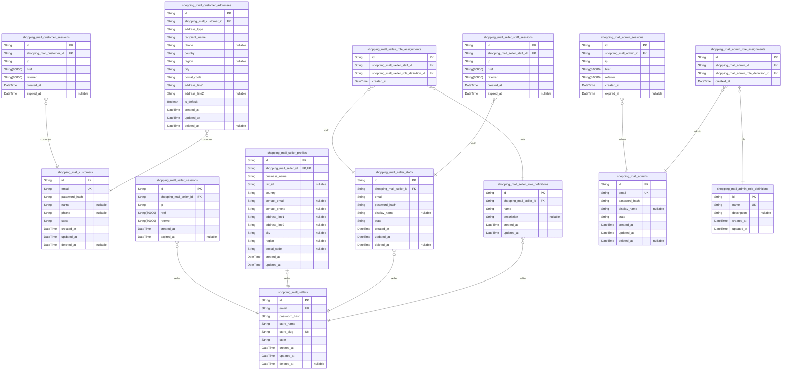
```mermaid
erDiagram
"shopping_mall_customers" {
  String id PK
  String email UK
  String password_hash
  String name "nullable"
  String phone "nullable"
  String state
  DateTime created_at
  DateTime updated_at
  DateTime deleted_at "nullable"
}
"shopping_mall_customer_sessions" {
  String id PK
  String shopping_mall_customer_id FK
  String ip
  String(80000) href
  String(80000) referrer
  DateTime created_at
  DateTime expired_at "nullable"
}
"shopping_mall_customer_addresses" {
  String id PK
  String shopping_mall_customer_id FK
  String address_type
  String recipient_name
  String phone "nullable"
  String country
  String region "nullable"
  String city
  String postal_code
  String address_line1
  String address_line2 "nullable"
  Boolean is_default
  DateTime created_at
  DateTime updated_at
  DateTime deleted_at "nullable"
}
"shopping_mall_sellers" {
  String id PK
  String email UK
  String password_hash
  String store_name
  String store_slug UK
  String state
  DateTime created_at
  DateTime updated_at
  DateTime deleted_at "nullable"
}
"shopping_mall_seller_sessions" {
  String id PK
  String shopping_mall_seller_id FK
  String ip
  String(80000) href
  String(80000) referrer
  DateTime created_at
  DateTime expired_at "nullable"
}
"shopping_mall_seller_profiles" {
  String id PK
  String shopping_mall_seller_id FK,UK
  String business_name
  String tax_id "nullable"
  String country
  String contact_email "nullable"
  String contact_phone "nullable"
  String address_line1 "nullable"
  String address_line2 "nullable"
  String city "nullable"
  String region "nullable"
  String postal_code "nullable"
  DateTime created_at
  DateTime updated_at
}
"shopping_mall_seller_staffs" {
  String id PK
  String shopping_mall_seller_id FK
  String email
  String password_hash
  String display_name "nullable"
  String state
  DateTime created_at
  DateTime updated_at
  DateTime deleted_at "nullable"
}
"shopping_mall_seller_role_definitions" {
  String id PK
  String shopping_mall_seller_id FK
  String name
  String description "nullable"
  DateTime created_at
  DateTime updated_at
}
"shopping_mall_seller_role_assignments" {
  String id PK
  String shopping_mall_seller_staff_id FK
  String shopping_mall_seller_role_definition_id FK
  DateTime created_at
}
"shopping_mall_admins" {
  String id PK
  String email UK
  String password_hash
  String display_name "nullable"
  String state
  DateTime created_at
  DateTime updated_at
  DateTime deleted_at "nullable"
}
"shopping_mall_admin_sessions" {
  String id PK
  String shopping_mall_admin_id FK
  String ip
  String(80000) href
  String(80000) referrer
  DateTime created_at
  DateTime expired_at "nullable"
}
"shopping_mall_admin_role_definitions" {
  String id PK
  String name UK
  String description "nullable"
  DateTime created_at
  DateTime updated_at
}
"shopping_mall_admin_role_assignments" {
  String id PK
  String shopping_mall_admin_id FK
  String shopping_mall_admin_role_definition_id FK
  DateTime created_at
}
"shopping_mall_seller_staff_sessions" {
  String id PK
  String shopping_mall_seller_staff_id FK
  String ip
  String(80000) href
  String(80000) referrer
  DateTime created_at
  DateTime expired_at "nullable"
}
"shopping_mall_customer_sessions" }o--|| "shopping_mall_customers" : customer
"shopping_mall_customer_addresses" }o--|| "shopping_mall_customers" : customer
"shopping_mall_seller_sessions" }o--|| "shopping_mall_sellers" : seller
"shopping_mall_seller_profiles" |o--|| "shopping_mall_sellers" : seller
"shopping_mall_seller_staffs" }o--|| "shopping_mall_sellers" : seller
"shopping_mall_seller_role_definitions" }o--|| "shopping_mall_sellers" : seller
"shopping_mall_seller_role_assignments" }o--|| "shopping_mall_seller_staffs" : staff
"shopping_mall_seller_role_assignments" }o--|| "shopping_mall_seller_role_definitions" : role
"shopping_mall_admin_sessions" }o--|| "shopping_mall_admins" : admin
"shopping_mall_admin_role_assignments" }o--|| "shopping_mall_admins" : admin
"shopping_mall_admin_role_assignments" }o--|| "shopping_mall_admin_role_definitions" : role
"shopping_mall_seller_staff_sessions" }o--|| "shopping_mall_seller_staffs" : staff
```

### `shopping_mall_customers`

Registered customer identities for the marketplace. Stores authentication
credentials, lifecycle state, and basic profile attributes. Related
entities include sessions [shopping_mall_customer_sessions](#shopping_mall_customer_sessions) and
addresses [shopping_mall_customer_addresses](#shopping_mall_customer_addresses).

Properties as follows:

- `id`: Primary Key.
- `email`: Unique email used for login and notifications.
- `password_hash`: BCrypt or equivalent password hash. Never store plaintext passwords.
- `name`: Display name of the customer.
- `phone`: Contact phone number in E.164 or local format as provided.
- `state`: Business lifecycle state (e.g., unverified, active, suspended, deleted).
- `created_at`: Creation timestamp.
- `updated_at`: Last update timestamp.
- `deleted_at`: Soft deletion timestamp when the account is closed or anonymized.

### `shopping_mall_customer_sessions`

Customer session records capturing connection context for audit and
security. Managed by identity flows; read-mostly outside of auth. See
[shopping_mall_customers](#shopping_mall_customers).

Properties as follows:

- `id`: Primary Key.
- `shopping_mall_customer_id`: Belonged customer's [shopping_mall_customers.id](#shopping_mall_customers)
- `ip`: IP address of the client.
- `href`: Request URL at session establishment.
- `referrer`: Referrer URL at session establishment.
- `created_at`: Session creation time.
- `expired_at`: Session expiration time when closed or expired.

### `shopping_mall_customer_addresses`

Customer-owned address book entries for shipping/billing usage. Enforces
ownership and supports one default per type via application logic. Parent
entity [shopping_mall_customers](#shopping_mall_customers).

Properties as follows:

- `id`: Primary Key.
- `shopping_mall_customer_id`: Owner customer's [shopping_mall_customers.id](#shopping_mall_customers)
- `address_type`: Address type, e.g., shipping or billing.
- `recipient_name`: Recipient full name.
- `phone`: Recipient contact phone.
- `country`: Country/region code or name.
- `region`: State/Province/Region component.
- `city`: City or locality component.
- `postal_code`: Postal/ZIP code.
- `address_line1`: Primary address line (street, number).
- `address_line2`: Secondary address line (apartment, suite).
- `is_default`
  > Whether this is the default address for the given type. Application
  > enforces single default per type.
- `created_at`: Creation timestamp.
- `updated_at`: Last update timestamp.
- `deleted_at`: Soft deletion timestamp when removed by user or policy.

### `shopping_mall_sellers`

Seller root identity and authentication for operating a store on the
marketplace. Holds login credentials, store name/slug, and business
state. Related to sessions [shopping_mall_seller_sessions](#shopping_mall_seller_sessions), profile
[shopping_mall_seller_profiles](#shopping_mall_seller_profiles), and staff {@link
shopping_mall_seller_staffs}.

Properties as follows:

- `id`: Primary Key.
- `email`: Unique email for seller account login and notifications.
- `password_hash`: Password hash for seller account.
- `store_name`: Public store display name.
- `store_slug`: Unique URL-friendly identifier for the store.
- `state`
  > Seller lifecycle state (onboarding, verification_pending,
  > verified_active, limited, suspended, deleted).
- `created_at`: Creation timestamp.
- `updated_at`: Last update timestamp.
- `deleted_at`: Soft deletion timestamp if store is closed.

### `shopping_mall_seller_sessions`

Seller account session records, storing connection context for audit.
Managed exclusively by identity flows. Parent {@link
shopping_mall_sellers}.

Properties as follows:

- `id`: Primary Key.
- `shopping_mall_seller_id`: Owner seller's [shopping_mall_sellers.id](#shopping_mall_sellers)
- `ip`: IP address of the client.
- `href`: Request URL at session start.
- `referrer`: Referrer URL at session start.
- `created_at`: Session creation time.
- `expired_at`: Session expiration time if closed/expired.

### `shopping_mall_seller_profiles`

Seller legal and operational profile details managed as a strict 1:1
extension of [shopping_mall_sellers](#shopping_mall_sellers). Contains business identity
and contact data required for verification and compliance.

Properties as follows:

- `id`: Primary Key.
- `shopping_mall_seller_id`: Associated seller's [shopping_mall_sellers.id](#shopping_mall_sellers) (1:1)
- `business_name`: Registered legal business name.
- `tax_id`: Business tax identifier per jurisdiction.
- `country`: Country/region of registration.
- `contact_email`: Operational contact email for the store.
- `contact_phone`: Operational contact phone.
- `address_line1`: Business address line 1.
- `address_line2`: Business address line 2.
- `city`: Business city/locality.
- `region`: Business region/state/province.
- `postal_code`: Business postal/ZIP code.
- `created_at`: Profile creation timestamp.
- `updated_at`: Profile last updated timestamp.

### `shopping_mall_seller_staffs`

Seller staff user accounts with per-store scope and independent
credentials. Staff are assigned to seller-defined roles via {@link
shopping_mall_seller_role_assignments}. Parent seller {@link
shopping_mall_sellers}.

Properties as follows:

- `id`: Primary Key.
- `shopping_mall_seller_id`: Owning seller's [shopping_mall_sellers.id](#shopping_mall_sellers)
- `email`: Staff email used for login; unique per seller.
- `password_hash`: Password hash for staff authentication.
- `display_name`: Human-friendly staff display name.
- `state`: Staff lifecycle state (active, suspended, deleted, etc.).
- `created_at`: Creation timestamp.
- `updated_at`: Last update timestamp.
- `deleted_at`: Soft deletion timestamp when access is revoked.

### `shopping_mall_seller_role_definitions`

Seller-scoped role catalog defining named permission sets for staff.
Roles are reusable within the same seller. See assignments {@link
shopping_mall_seller_role_assignments}.

Properties as follows:

- `id`: Primary Key.
- `shopping_mall_seller_id`: Role owner seller's [shopping_mall_sellers.id](#shopping_mall_sellers)
- `name`
  > Role name unique within a seller (e.g., Owner, Manager, Fulfillment,
  > Support).
- `description`: Human-readable description of the role's responsibilities.
- `created_at`: Creation timestamp.
- `updated_at`: Last update timestamp.

### `shopping_mall_seller_role_assignments`

Assignment of a seller staff member to a seller-defined role. Prevents
duplicate assignments and supports audit queries by staff or role. See
[shopping_mall_seller_staffs](#shopping_mall_seller_staffs) and {@link
shopping_mall_seller_role_definitions}.

Properties as follows:

- `id`: Primary Key.
- `shopping_mall_seller_staff_id`: Assigned staff's [shopping_mall_seller_staffs.id](#shopping_mall_seller_staffs)
- `shopping_mall_seller_role_definition_id`: Target role's [shopping_mall_seller_role_definitions.id](#shopping_mall_seller_role_definitions)
- `created_at`: Assignment creation time.

### `shopping_mall_admins`

Platform administrator accounts with sub-roles and least-privilege
access. Roles assigned via [shopping_mall_admin_role_assignments](#shopping_mall_admin_role_assignments).
Sessions stored in [shopping_mall_admin_sessions](#shopping_mall_admin_sessions).

Properties as follows:

- `id`: Primary Key.
- `email`: Unique administrator email used for login.
- `password_hash`: Password hash for admin authentication.
- `display_name`: Admin display name.
- `state`: Admin lifecycle state (active, suspended).
- `created_at`: Creation timestamp.
- `updated_at`: Last update timestamp.
- `deleted_at`: Soft deletion timestamp when deactivated.

### `shopping_mall_admin_sessions`

Administrator session records containing connection context for audit and
security. Managed through admin identity flows. Parent {@link
shopping_mall_admins}.

Properties as follows:

- `id`: Primary Key.
- `shopping_mall_admin_id`: Owner admin's [shopping_mall_admins.id](#shopping_mall_admins)
- `ip`: IP address of the client.
- `href`: Request URL at session establishment.
- `referrer`: Referrer URL at session establishment.
- `created_at`: Session creation timestamp.
- `expired_at`: Session expiration timestamp.

### `shopping_mall_admin_role_definitions`

Global administrator role catalog defining named permission sets for
platform governance (e.g., Super Admin, Catalog Manager, Moderation
Manager, Operations Manager, Risk & Compliance Admin, Finance Admin,
Support Agent, Auditor).

Properties as follows:

- `id`: Primary Key.
- `name`: Unique role name across the platform.
- `description`: Role description and scope summary.
- `created_at`: Creation timestamp.
- `updated_at`: Last update timestamp.

### `shopping_mall_admin_role_assignments`

Assignment of an administrator to a global admin role. Prevents duplicate
assignments and enables audit by admin or role.

Properties as follows:

- `id`: Primary Key.
- `shopping_mall_admin_id`: Assigned admin's [shopping_mall_admins.id](#shopping_mall_admins)
- `shopping_mall_admin_role_definition_id`: Target role's [shopping_mall_admin_role_definitions.id](#shopping_mall_admin_role_definitions)
- `created_at`: Assignment creation timestamp.

### `shopping_mall_seller_staff_sessions`

Seller staff session records storing connection context for audit and
security. Each record represents a single authenticated session for a
staff user of a seller account. This table follows the Session Table
Pattern with an exact column set and a composite index on
(shopping_mall_seller_staff_id, created_at). Managed exclusively by
identity flows.

Properties as follows:

- `id`: Primary Key.
- `shopping_mall_seller_staff_id`: Belonged staff user's [shopping_mall_seller_staffs.id](#shopping_mall_seller_staffs)
- `ip`: IP address of the client at session establishment.
- `href`: Request URL at session establishment.
- `referrer`: Referrer URL at session establishment.
- `created_at`: Session creation time.
- `expired_at`: Session expiration or closure time (nullable).

## Catalog

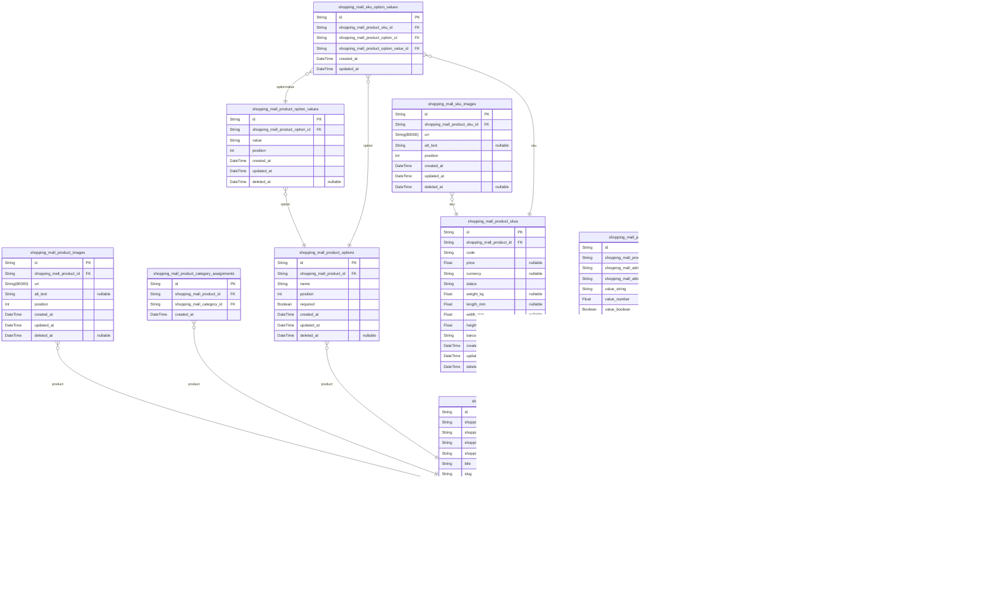
```mermaid
erDiagram
"shopping_mall_products" {
  String id PK
  String shopping_mall_seller_id FK
  String shopping_mall_brand_id FK "nullable"
  String shopping_mall_category_id FK
  String shopping_mall_tax_class_id FK
  String title
  String slug UK
  String description
  String visibility_state
  String condition
  Float base_price
  String currency
  String fulfillment_type
  Boolean has_variants
  DateTime published_at "nullable"
  DateTime created_at
  DateTime updated_at
  DateTime deleted_at "nullable"
}
"shopping_mall_product_images" {
  String id PK
  String shopping_mall_product_id FK
  String(80000) uri
  String alt_text "nullable"
  Int position
  DateTime created_at
  DateTime updated_at
  DateTime deleted_at "nullable"
}
"shopping_mall_product_category_assignments" {
  String id PK
  String shopping_mall_product_id FK
  String shopping_mall_category_id FK
  DateTime created_at
}
"shopping_mall_product_options" {
  String id PK
  String shopping_mall_product_id FK
  String name
  Int position
  Boolean required
  DateTime created_at
  DateTime updated_at
  DateTime deleted_at "nullable"
}
"shopping_mall_product_option_values" {
  String id PK
  String shopping_mall_product_option_id FK
  String value
  Int position
  DateTime created_at
  DateTime updated_at
  DateTime deleted_at "nullable"
}
"shopping_mall_product_skus" {
  String id PK
  String shopping_mall_product_id FK
  String code
  Float price "nullable"
  String currency "nullable"
  String status
  Float weight_kg "nullable"
  Float length_mm "nullable"
  Float width_mm "nullable"
  Float height_mm "nullable"
  String barcode "nullable"
  DateTime created_at
  DateTime updated_at
  DateTime deleted_at "nullable"
}
"shopping_mall_sku_images" {
  String id PK
  String shopping_mall_product_sku_id FK
  String(80000) uri
  String alt_text "nullable"
  Int position
  DateTime created_at
  DateTime updated_at
  DateTime deleted_at "nullable"
}
"shopping_mall_product_attribute_values" {
  String id PK
  String shopping_mall_product_id FK
  String shopping_mall_attribute_definition_id FK
  String shopping_mall_attribute_enum_value_id FK "nullable"
  String value_string "nullable"
  Float value_number "nullable"
  Boolean value_boolean "nullable"
  DateTime value_datetime "nullable"
  DateTime created_at
  DateTime updated_at
  DateTime deleted_at "nullable"
}
"shopping_mall_product_redirects" {
  String id PK
  String shopping_mall_product_id FK
  String source_slug UK
  DateTime created_at
}
"shopping_mall_product_moderation_cases" {
  String id PK
  String shopping_mall_product_id FK
  String opened_by_admin_id FK "nullable"
  String decided_by_admin_id FK "nullable"
  String shopping_mall_policy_reason_code_id FK "nullable"
  String status
  String severity "nullable"
  String notes "nullable"
  DateTime opened_at
  DateTime decided_at "nullable"
  DateTime created_at
  DateTime updated_at
  DateTime deleted_at "nullable"
}
"shopping_mall_sku_option_values" {
  String id PK
  String shopping_mall_product_sku_id FK
  String shopping_mall_product_option_id FK
  String shopping_mall_product_option_value_id FK
  DateTime created_at
  DateTime updated_at
}
"shopping_mall_product_images" }o--|| "shopping_mall_products" : product
"shopping_mall_product_category_assignments" }o--|| "shopping_mall_products" : product
"shopping_mall_product_options" }o--|| "shopping_mall_products" : product
"shopping_mall_product_option_values" }o--|| "shopping_mall_product_options" : option
"shopping_mall_product_skus" }o--|| "shopping_mall_products" : product
"shopping_mall_sku_images" }o--|| "shopping_mall_product_skus" : sku
"shopping_mall_product_attribute_values" }o--|| "shopping_mall_products" : product
"shopping_mall_product_redirects" }o--|| "shopping_mall_products" : product
"shopping_mall_product_moderation_cases" }o--|| "shopping_mall_products" : product
"shopping_mall_sku_option_values" }o--|| "shopping_mall_product_skus" : sku
"shopping_mall_sku_option_values" }o--|| "shopping_mall_product_options" : option
"shopping_mall_sku_option_values" }o--|| "shopping_mall_product_option_values" : optionValue
```

### `shopping_mall_products`

Catalog product master owned by a seller. Represents the parent entity
for variant SKUs, images, attributes, and category assignments. Each
product has exactly one primary category ({@link
shopping_mall_categories}) and may have additional category assignments
via [shopping_mall_product_category_assignments](#shopping_mall_product_category_assignments). Title and
description are end-user facing. Slug is globally unique for discovery
and redirects. Related entities include {@link
shopping_mall_product_skus}, [shopping_mall_product_images](#shopping_mall_product_images), {@link
shopping_mall_product_attribute_values}, and {@link
shopping_mall_product_moderation_cases}.

Properties as follows:

- `id`: Primary Key.
- `shopping_mall_seller_id`: Owning seller's [shopping_mall_sellers.id](#shopping_mall_sellers).
- `shopping_mall_brand_id`: Associated brand's [shopping_mall_brands.id](#shopping_mall_brands). Optional.
- `shopping_mall_category_id`: Primary category's [shopping_mall_categories.id](#shopping_mall_categories).
- `shopping_mall_tax_class_id`: Applicable tax class [shopping_mall_tax_classes.id](#shopping_mall_tax_classes).
- `title`: Human-readable product title used in discovery and search.
- `slug`: Globally unique, human-readable identifier for discovery and redirects.
- `description`
  > Detailed product description; must meet minimum content policy
  > requirements.
- `visibility_state`
  > Business visibility state (e.g., Draft, Pending Approval, Active,
  > Archived).
- `condition`: Item condition (e.g., New, Used, Refurbished).
- `base_price`: Base price used when SKUs do not override price.
- `currency`: ISO currency code used for pricing display and calculations.
- `fulfillment_type`: Fulfillment type (e.g., Seller-fulfilled, Platform-fulfilled).
- `has_variants`: Whether the product uses option dimensions to generate SKUs.
- `published_at`: Timestamp when the product became publicly discoverable.
- `created_at`: Creation timestamp.
- `updated_at`: Last update timestamp.
- `deleted_at`: Soft deletion timestamp, if the product is retired.

### `shopping_mall_product_images`

Images attached to a [shopping_mall_products](#shopping_mall_products) record. Stores
ordered image set with optional alt text for accessibility. Used for PDP
and listing thumbnails. Managed via product context.

Properties as follows:

- `id`: Primary Key.
- `shopping_mall_product_id`: Parent product [shopping_mall_products.id](#shopping_mall_products).
- `uri`: Image URL (primary storage location).
- `alt_text`: Accessible description of the image.
- `position`: Display order (0-based or 1-based per application policy).
- `created_at`: Creation timestamp.
- `updated_at`: Last update timestamp.
- `deleted_at`: Soft deletion timestamp.

### `shopping_mall_product_category_assignments`

Additional category associations for [shopping_mall_products](#shopping_mall_products).
Primary category is kept on the product; this table captures secondary
placements for discovery and browse aggregation. Prevents duplicates via
composite uniqueness.

Properties as follows:

- `id`: Primary Key.
- `shopping_mall_product_id`: Assigned product [shopping_mall_products.id](#shopping_mall_products).
- `shopping_mall_category_id`: Associated category [shopping_mall_categories.id](#shopping_mall_categories).
- `created_at`: Creation timestamp.

### `shopping_mall_product_options`

Variant option dimensions for a [shopping_mall_products](#shopping_mall_products) entity
(e.g., Color, Size). Each option is ordered and can be required. Values
are kept in [shopping_mall_product_option_values](#shopping_mall_product_option_values). Enforce unique
position per product to guarantee deterministic ordering and prevent
duplicates.

Properties as follows:

- `id`: Primary Key.
- `shopping_mall_product_id`: Parent product [shopping_mall_products.id](#shopping_mall_products).
- `name`: Option name (e.g., Color, Size, Style).
- `position`: Ordering of this option among the product options (unique per product).
- `required`: Whether this option must be specified to form a purchasable SKU.
- `created_at`: Creation timestamp.
- `updated_at`: Last update timestamp.
- `deleted_at`: Soft deletion timestamp.

### `shopping_mall_product_option_values`

Allowed values for a specific option of a product. Each record belongs to
one [shopping_mall_product_options](#shopping_mall_product_options). Maintains display order and
text value. Enforce unique position per option for stable ordering.

Properties as follows:

- `id`: Primary Key.
- `shopping_mall_product_option_id`: Parent option [shopping_mall_product_options.id](#shopping_mall_product_options).
- `value`: Human-readable option value (e.g., Red, Blue, M, L).
- `position`: Ordering of this value within the option (unique per option).
- `created_at`: Creation timestamp.
- `updated_at`: Last update timestamp.
- `deleted_at`: Soft deletion timestamp.

### `shopping_mall_product_skus`

Purchasable variant of a [shopping_mall_products](#shopping_mall_products) entity. May
override price and images. Lifecycle managed via status (Active,
Temporarily Unavailable, Discontinued). SKU code is unique within a
product; platform enforces per-seller uniqueness at service level due to
3NF rules. Related images in [shopping_mall_sku_images](#shopping_mall_sku_images).

Properties as follows:

- `id`: Primary Key.
- `shopping_mall_product_id`: Parent product [shopping_mall_products.id](#shopping_mall_products).
- `code`: Seller-defined SKU code. Unique within the product.
- `price`: SKU-level price override. If null, product base_price applies.
- `currency`: Currency for SKU price override when provided.
- `status`: Operational status (Active, Temporarily Unavailable, Discontinued).
- `weight_kg`: Physical weight in kilograms for shipping calculations.
- `length_mm`: Package length in millimeters.
- `width_mm`: Package width in millimeters.
- `height_mm`: Package height in millimeters.
- `barcode`: Barcode/GTIN/UPC/EAN identifier if applicable.
- `created_at`: Creation timestamp.
- `updated_at`: Last update timestamp.
- `deleted_at`: Soft deletion timestamp.

### `shopping_mall_sku_images`

Images attached to a specific [shopping_mall_product_skus](#shopping_mall_product_skus) record.
Stores ordered image set with optional alt text. Managed in the SKU
context for variant-specific imagery.

Properties as follows:

- `id`: Primary Key.
- `shopping_mall_product_sku_id`: Parent SKU [shopping_mall_product_skus.id](#shopping_mall_product_skus).
- `uri`: Image URL (primary storage location).
- `alt_text`: Accessible description of the image.
- `position`: Display order among the SKU images.
- `created_at`: Creation timestamp.
- `updated_at`: Last update timestamp.
- `deleted_at`: Soft deletion timestamp.

### `shopping_mall_product_attribute_values`

Product-level descriptive attribute values for faceting and detail pages.
References attribute definition catalog ({@link
shopping_mall_attribute_definitions}) and optional enumerated value
([shopping_mall_attribute_enum_values](#shopping_mall_attribute_enum_values)). Supports multi-typed
storage using one of value_* columns per attribute, keeping raw
(non-derived) data only.

Properties as follows:

- `id`: Primary Key.
- `shopping_mall_product_id`: Target product [shopping_mall_products.id](#shopping_mall_products).
- `shopping_mall_attribute_definition_id`
  > Attribute definition reference {@link
  > shopping_mall_attribute_definitions.id}.
- `shopping_mall_attribute_enum_value_id`
  > Optional enumerated value reference {@link
  > shopping_mall_attribute_enum_values.id}.
- `value_string`: String value when the attribute type is textual.
- `value_number`: Numeric value when the attribute type is numeric/measurement.
- `value_boolean`: Boolean value when the attribute type is logical.
- `value_datetime`: Datetime value when the attribute type is a date/time.
- `created_at`: Creation timestamp.
- `updated_at`: Last update timestamp.
- `deleted_at`: Soft deletion timestamp.

### `shopping_mall_product_redirects`

Redirect mapping for product slug changes, merges, or renames. Ensures
legacy URLs resolve to the current [shopping_mall_products](#shopping_mall_products).
Read-only for runtime resolution. One row per legacy slug.

Properties as follows:

- `id`: Primary Key.
- `shopping_mall_product_id`: Destination product [shopping_mall_products.id](#shopping_mall_products).
- `source_slug`: Legacy product slug to be redirected to the destination product.
- `created_at`: Creation timestamp.

### `shopping_mall_product_moderation_cases`

Moderation cases opened for a [shopping_mall_products](#shopping_mall_products) record.
Tracks policy review lifecycle with optional reason code ({@link
shopping_mall_policy_reason_codes}) and responsible admins. Used by
governance for compliant publication and enforcement.

Properties as follows:

- `id`: Primary Key.
- `shopping_mall_product_id`: Subject product [shopping_mall_products.id](#shopping_mall_products).
- `opened_by_admin_id`: Opening administrator [shopping_mall_admins.id](#shopping_mall_admins). Optional.
- `decided_by_admin_id`: Decision administrator [shopping_mall_admins.id](#shopping_mall_admins). Optional.
- `shopping_mall_policy_reason_code_id`
  > Policy reason code reference {@link
  > shopping_mall_policy_reason_codes.id}. Optional.
- `status`: Moderation status (e.g., Pending, Approved, Rejected, Redacted).
- `severity`: Severity classification for prioritization where applicable.
- `notes`: Reviewer notes and context for the decision.
- `opened_at`: When the case was opened.
- `decided_at`: When the case decision was made (if any).
- `created_at`: Creation timestamp.
- `updated_at`: Last update timestamp.
- `deleted_at`: Soft deletion timestamp.

### `shopping_mall_sku_option_values`

Mapping table recording, for each SKU, the selected value for each option
dimension of its parent product. Ensures one value per option per SKU and
enables auditing and querying of SKU compositions. Note: Application must
ensure that the selected value belongs to the referenced option and both
belong to the SKU's product.

Properties as follows:

- `id`: Primary Key.
- `shopping_mall_product_sku_id`: Target SKU's [shopping_mall_product_skus.id](#shopping_mall_product_skus).
- `shopping_mall_product_option_id`
  > Option dimension [shopping_mall_product_options.id](#shopping_mall_product_options) that this
  > selection addresses.
- `shopping_mall_product_option_value_id`: Selected option value [shopping_mall_product_option_values.id](#shopping_mall_product_option_values).
- `created_at`: Creation timestamp.
- `updated_at`: Last update timestamp.

## Inventory

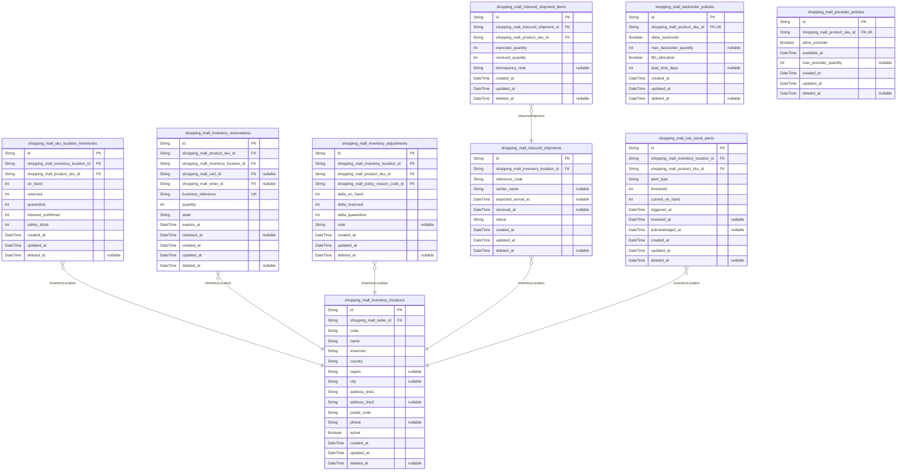
```mermaid
erDiagram
"shopping_mall_inventory_locations" {
  String id PK
  String shopping_mall_seller_id FK
  String code
  String name
  String timezone
  String country
  String region "nullable"
  String city "nullable"
  String address_line1
  String address_line2 "nullable"
  String postal_code
  String phone "nullable"
  Boolean active
  DateTime created_at
  DateTime updated_at
  DateTime deleted_at "nullable"
}
"shopping_mall_sku_location_inventories" {
  String id PK
  String shopping_mall_inventory_location_id FK
  String shopping_mall_product_sku_id FK
  Int on_hand
  Int reserved
  Int quarantine
  Int inbound_confirmed
  Int safety_stock
  DateTime created_at
  DateTime updated_at
  DateTime deleted_at "nullable"
}
"shopping_mall_inventory_reservations" {
  String id PK
  String shopping_mall_product_sku_id FK
  String shopping_mall_inventory_location_id FK
  String shopping_mall_cart_id FK "nullable"
  String shopping_mall_order_id FK "nullable"
  String business_reference UK
  Int quantity
  String state
  DateTime expires_at
  DateTime released_at "nullable"
  DateTime created_at
  DateTime updated_at
  DateTime deleted_at "nullable"
}
"shopping_mall_inventory_adjustments" {
  String id PK
  String shopping_mall_inventory_location_id FK
  String shopping_mall_product_sku_id FK
  String shopping_mall_policy_reason_code_id FK
  Int delta_on_hand
  Int delta_reserved
  Int delta_quarantine
  String note "nullable"
  DateTime created_at
  DateTime updated_at
  DateTime deleted_at "nullable"
}
"shopping_mall_inbound_shipments" {
  String id PK
  String shopping_mall_inventory_location_id FK
  String reference_code
  String carrier_name "nullable"
  DateTime expected_arrival_at "nullable"
  DateTime received_at "nullable"
  String status
  DateTime created_at
  DateTime updated_at
  DateTime deleted_at "nullable"
}
"shopping_mall_inbound_shipment_items" {
  String id PK
  String shopping_mall_inbound_shipment_id FK
  String shopping_mall_product_sku_id FK
  Int expected_quantity
  Int received_quantity
  String discrepancy_note "nullable"
  DateTime created_at
  DateTime updated_at
  DateTime deleted_at "nullable"
}
"shopping_mall_backorder_policies" {
  String id PK
  String shopping_mall_product_sku_id FK,UK
  Boolean allow_backorder
  Int max_backorder_quantity "nullable"
  Boolean fifo_allocation
  Int lead_time_days "nullable"
  DateTime created_at
  DateTime updated_at
  DateTime deleted_at "nullable"
}
"shopping_mall_preorder_policies" {
  String id PK
  String shopping_mall_product_sku_id FK,UK
  Boolean allow_preorder
  DateTime available_at
  Int max_preorder_quantity "nullable"
  DateTime created_at
  DateTime updated_at
  DateTime deleted_at "nullable"
}
"shopping_mall_low_stock_alerts" {
  String id PK
  String shopping_mall_inventory_location_id FK
  String shopping_mall_product_sku_id FK
  String alert_type
  Int threshold
  Int current_on_hand
  DateTime triggered_at
  DateTime resolved_at "nullable"
  DateTime acknowledged_at "nullable"
  DateTime created_at
  DateTime updated_at
  DateTime deleted_at "nullable"
}
"shopping_mall_sku_location_inventories" }o--|| "shopping_mall_inventory_locations" : inventoryLocation
"shopping_mall_inventory_reservations" }o--|| "shopping_mall_inventory_locations" : inventoryLocation
"shopping_mall_inventory_adjustments" }o--|| "shopping_mall_inventory_locations" : inventoryLocation
"shopping_mall_inbound_shipments" }o--|| "shopping_mall_inventory_locations" : inventoryLocation
"shopping_mall_inbound_shipment_items" }o--|| "shopping_mall_inbound_shipments" : inboundShipment
"shopping_mall_low_stock_alerts" }o--|| "shopping_mall_inventory_locations" : inventoryLocation
```

### `shopping_mall_inventory_locations`

Physical or virtual stock locations owned by a seller (warehouse, store,
3PL node). Serves as the per-location anchor for inventory tracking and
inbound receipts. Each location belongs to exactly one {@link
shopping_mall_sellers} and is referenced by {@link
shopping_mall_sku_location_inventories}, {@link
shopping_mall_inbound_shipments}, and alerting. Business uniqueness is
enforced per seller via (seller, code).

Properties as follows:

- `id`: Primary Key.
- `shopping_mall_seller_id`: Owner seller's [shopping_mall_sellers.id](#shopping_mall_sellers).
- `code`: Seller-scoped unique code identifying the location (e.g., "WH-SEOUL-01").
- `name`: Human readable name of the location for operations and search.
- `timezone`: IANA timezone identifier for operational cutoffs (e.g., "Asia/Seoul").
- `country`: Country code/label for shipping/serviceability checks.
- `region`: Administrative region/state/province of the location.
- `city`: City of the location.
- `address_line1`: Primary street address line.
- `address_line2`: Secondary street address line.
- `postal_code`: Postal/ZIP code.
- `phone`: Operational contact phone for the location.
- `active`: Whether the location is active and eligible for allocations.
- `created_at`: Creation timestamp.
- `updated_at`: Last update timestamp.
- `deleted_at`: Soft deletion timestamp if the location is retired.

### `shopping_mall_sku_location_inventories`

Per-SKU per-location inventory state storing raw counters only (no
derived fields). Tracks current On-hand, Reserved, Quarantine, Inbound
Confirmed, and Safety Stock threshold. Uniqueness is per (inventory
location, SKU).

Properties as follows:

- `id`: Primary Key.
- `shopping_mall_inventory_location_id`: Target location's [shopping_mall_inventory_locations.id](#shopping_mall_inventory_locations).
- `shopping_mall_product_sku_id`: Target SKU's [shopping_mall_product_skus.id](#shopping_mall_product_skus).
- `on_hand`: Current sellable physical quantity at the location.
- `reserved`: Total currently reserved quantity for pending orders/checkouts.
- `quarantine`: Quantity held in quarantine/damaged and excluded from ATP.
- `inbound_confirmed`: Quantity expected from confirmed inbound receipts not yet received.
- `safety_stock`: Configured minimum buffer quantity triggering alerts when breached.
- `created_at`: Creation timestamp.
- `updated_at`: Last update timestamp.
- `deleted_at`: Soft deletion timestamp if the record is retired.

### `shopping_mall_inventory_reservations`

Time-limited, idempotent inventory holds used during checkout to prevent
oversell. Each record reserves a quantity of a SKU at a specific
inventory location. Optionally links to a cart during checkout and to an
order when converted. TTL is enforced via expires_at and release tracked
via released_at. Idempotency enforced via unique business_reference.

Properties as follows:

- `id`: Primary Key.
- `shopping_mall_product_sku_id`: Reserved SKU's [shopping_mall_product_skus.id](#shopping_mall_product_skus).
- `shopping_mall_inventory_location_id`
  > Location's [shopping_mall_inventory_locations.id](#shopping_mall_inventory_locations) from which
  > quantity is reserved.
- `shopping_mall_cart_id`
  > Related cart's [shopping_mall_carts.id](#shopping_mall_carts) for pre-order reservation
  > context.
- `shopping_mall_order_id`: Converted order's [shopping_mall_orders.id](#shopping_mall_orders) once checkout succeeds.
- `business_reference`: Idempotency key for reservation requests (unique business reference).
- `quantity`: Reserved quantity for this request.
- `state`: Business state of the reservation (e.g., active, released, expired).
- `expires_at`: Reservation expiration timestamp (TTL).
- `released_at`: Timestamp when reservation was released (if applicable).
- `created_at`: Creation timestamp.
- `updated_at`: Last update timestamp.
- `deleted_at`: Soft deletion timestamp for administrative masking when needed.

### `shopping_mall_inventory_adjustments`

Immutable audit lines for inventory-affecting events with controlled
reason codes. Adjustments modify counters in {@link
shopping_mall_sku_location_inventories} via business processes and
preserve an audit trail for compliance (reasoned deltas). Actor-specific
identity is handled by platform audit logs; this table captures
normalized deltas only.

Properties as follows:

- `id`: Primary Key.
- `shopping_mall_inventory_location_id`: Affected location's [shopping_mall_inventory_locations.id](#shopping_mall_inventory_locations).
- `shopping_mall_product_sku_id`: Affected SKU's [shopping_mall_product_skus.id](#shopping_mall_product_skus).
- `shopping_mall_policy_reason_code_id`
  > Reason code's [shopping_mall_policy_reason_codes.id](#shopping_mall_policy_reason_codes) describing why
  > the adjustment occurred.
- `delta_on_hand`: Signed integer change to On-hand (positive or negative).
- `delta_reserved`: Signed integer change to Reserved (positive or negative).
- `delta_quarantine`: Signed integer change to Quarantine (positive or negative).
- `note`: Optional human-readable note describing context of the adjustment.
- `created_at`: Creation timestamp (adjustment time).
- `updated_at`: Last update timestamp.
- `deleted_at`: Soft deletion timestamp for privacy/compliance masking when needed.

### `shopping_mall_inbound_shipments`

Inbound receiving documents for inventory replenishment tied to a
specific inventory location. Represents a shipment from supplier/transfer
with carrier and scheduling information. Items are stored in {@link
shopping_mall_inbound_shipment_items}.

Properties as follows:

- `id`: Primary Key.
- `shopping_mall_inventory_location_id`: Receiving location's [shopping_mall_inventory_locations.id](#shopping_mall_inventory_locations).
- `reference_code`: Business reference code unique per location (e.g., ASN/PO number).
- `carrier_name`: Carrier or logistics provider name.
- `expected_arrival_at`: Estimated arrival timestamp for planning.
- `received_at`: Timestamp when inbound was fully received (if applicable).
- `status`
  > Business status of the inbound (e.g., created, in_transit, receiving,
  > received).
- `created_at`: Creation timestamp.
- `updated_at`: Last update timestamp.
- `deleted_at`: Soft deletion timestamp.

### `shopping_mall_inbound_shipment_items`

Line items under an inbound shipment. Each line connects the parent
[shopping_mall_inbound_shipments](#shopping_mall_inbound_shipments) with a specific {@link
shopping_mall_product_skus} and tracks expected vs received quantities
with optional discrepancy notes.

Properties as follows:

- `id`: Primary Key.
- `shopping_mall_inbound_shipment_id`: Parent shipment's [shopping_mall_inbound_shipments.id](#shopping_mall_inbound_shipments).
- `shopping_mall_product_sku_id`: SKU's [shopping_mall_product_skus.id](#shopping_mall_product_skus) on this shipment line.
- `expected_quantity`: Expected quantity to be received for this SKU.
- `received_quantity`: Actual received quantity (defaults to 0 until receipt).
- `discrepancy_note`: Optional note describing over/short/damage discrepancies.
- `created_at`: Creation timestamp.
- `updated_at`: Last update timestamp.
- `deleted_at`: Soft deletion timestamp.

### `shopping_mall_backorder_policies`

Per-SKU backorder configuration defining whether backorders are accepted
and under what limits. Applies to [shopping_mall_product_skus](#shopping_mall_product_skus).
Used during checkout/reservations to determine acceptability and caps.
Single policy per SKU enforced via unique constraint.

Properties as follows:

- `id`: Primary Key.
- `shopping_mall_product_sku_id`: Target SKU's [shopping_mall_product_skus.id](#shopping_mall_product_skus).
- `allow_backorder`: Whether backorders are permitted for the SKU.
- `max_backorder_quantity`
  > Optional maximum total backorder quantity permitted across all locations
  > (null means unlimited by policy).
- `fifo_allocation`
  > Whether allocation follows FIFO across backorders when inventory is
  > replenished.
- `lead_time_days`: Optional expected lead time in days communicated to customers.
- `created_at`: Creation timestamp.
- `updated_at`: Last update timestamp.
- `deleted_at`: Soft deletion timestamp.

### `shopping_mall_preorder_policies`

Per-SKU preorder configuration defining whether preorders are accepted,
availability date, and optional caps. Applies to {@link
shopping_mall_product_skus}. Single policy per SKU enforced via unique
constraint.

Properties as follows:

- `id`: Primary Key.
- `shopping_mall_product_sku_id`: Target SKU's [shopping_mall_product_skus.id](#shopping_mall_product_skus).
- `allow_preorder`: Whether preorders are permitted for the SKU.
- `available_at`: Availability/release timestamp when fulfillment may begin.
- `max_preorder_quantity`
  > Optional maximum total preorder quantity permitted across all locations
  > (null means unlimited by policy).
- `created_at`: Creation timestamp.
- `updated_at`: Last update timestamp.
- `deleted_at`: Soft deletion timestamp.

### `shopping_mall_low_stock_alerts`

System-generated alert records for low-stock or stockout conditions on a
(location, SKU) basis. Alerts are derived from {@link
shopping_mall_sku_location_inventories.safety_stock} breaches or zero ATP
signals and support acknowledgement/resolution tracking. Managed via
operational workflows; not directly user-authored.

Properties as follows:

- `id`: Primary Key.
- `shopping_mall_inventory_location_id`: Location's [shopping_mall_inventory_locations.id](#shopping_mall_inventory_locations).
- `shopping_mall_product_sku_id`: SKU's [shopping_mall_product_skus.id](#shopping_mall_product_skus).
- `alert_type`: Type of alert (e.g., "threshold_breach", "stockout").
- `threshold`: Threshold value that triggered the alert (safety stock or zero).
- `current_on_hand`: On-hand quantity at trigger time for context.
- `triggered_at`: Timestamp when the alert was created.
- `resolved_at`: Timestamp when the alert was resolved (if applicable).
- `acknowledged_at`: Timestamp when the alert was acknowledged (if applicable).
- `created_at`: Creation timestamp.
- `updated_at`: Last update timestamp.
- `deleted_at`: Soft deletion timestamp.

## Carts

```mermaid
erDiagram
"shopping_mall_carts" {
  String id PK
  String actor_type
  String status
  String currency_code "nullable"
  Boolean locked
  DateTime created_at
  DateTime updated_at
  DateTime deleted_at "nullable"
}
"shopping_mall_cart_of_customers" {
  String id PK
  String shopping_mall_cart_id FK,UK
  String shopping_mall_customer_id FK
  String shopping_mall_customer_session_id FK
  DateTime created_at
  DateTime updated_at
  DateTime deleted_at "nullable"
}
"shopping_mall_cart_of_guests" {
  String id PK
  String shopping_mall_cart_id FK,UK
  String guest_key UK
  String ip "nullable"
  String(80000) href "nullable"
  String(80000) referrer "nullable"
  DateTime created_at
  DateTime updated_at
}
"shopping_mall_cart_items" {
  String id PK
  String shopping_mall_cart_id FK
  String shopping_mall_product_sku_id FK
  Int quantity
  Float unit_price_at_add "nullable"
  String currency_code "nullable"
  DateTime created_at
  DateTime updated_at
  DateTime deleted_at "nullable"
}
"shopping_mall_cart_coupons" {
  String id PK
  String shopping_mall_cart_id FK
  String shopping_mall_coupon_code_id FK
  String code
  DateTime applied_at
  DateTime created_at
  DateTime updated_at
  DateTime deleted_at "nullable"
}
"shopping_mall_cart_price_locks" {
  String id PK
  String shopping_mall_cart_id FK
  DateTime locked_at
  DateTime expires_at "nullable"
  String status
  String currency_code
  Float items_total "nullable"
  Float shipping_total "nullable"
  Float discount_total "nullable"
  Float tax_total "nullable"
  Float grand_total "nullable"
  DateTime created_at
}
"shopping_mall_wishlists" {
  String id PK
  String shopping_mall_customer_id FK,UK
  String name "nullable"
  DateTime created_at
  DateTime updated_at
  DateTime deleted_at "nullable"
}
"shopping_mall_wishlist_items" {
  String id PK
  String shopping_mall_wishlist_id FK
  String shopping_mall_product_sku_id FK
  DateTime created_at
  DateTime updated_at
  DateTime deleted_at "nullable"
}
"shopping_mall_cart_merge_events" {
  String id PK
  String source_cart_id FK
  String target_cart_id FK
  String shopping_mall_customer_id FK "nullable"
  String reason
  String ip "nullable"
  String(80000) href "nullable"
  String(80000) referrer "nullable"
  DateTime created_at
}
"shopping_mall_cart_expirations" {
  String id PK
  String shopping_mall_cart_id FK
  DateTime expired_at
  String reason
  String policy_window "nullable"
  DateTime created_at
}
"shopping_mall_cart_of_customers" |o--|| "shopping_mall_carts" : cart
"shopping_mall_cart_of_guests" |o--|| "shopping_mall_carts" : cart
"shopping_mall_cart_items" }o--|| "shopping_mall_carts" : cart
"shopping_mall_cart_coupons" }o--|| "shopping_mall_carts" : cart
"shopping_mall_cart_price_locks" }o--|| "shopping_mall_carts" : cart
"shopping_mall_wishlist_items" }o--|| "shopping_mall_wishlists" : wishlist
"shopping_mall_cart_merge_events" }o--|| "shopping_mall_carts" : sourceCart
"shopping_mall_cart_merge_events" }o--|| "shopping_mall_carts" : targetCart
"shopping_mall_cart_expirations" }o--|| "shopping_mall_carts" : cart
```

### `shopping_mall_carts`

Main cart entity representing a pre-checkout shopping container.
Ownership is polymorphic and realized via subtype tables {@link
shopping_mall_cart_of_customers} and {@link
shopping_mall_cart_of_guests}. Child tables such as {@link
shopping_mall_cart_items}, [shopping_mall_cart_coupons](#shopping_mall_cart_coupons), and {@link
shopping_mall_cart_price_locks} reference this cart. Lifecycle states
include Active, Locked for Checkout, Converted, and Expired.

Properties as follows:

- `id`: Primary Key.
- `actor_type`
  > Actor classifier for polymorphic ownership (e.g., "customer", "guest").
  > Used for quick filtering; detailed ownership lives in subtype tables.
- `status`
  > Business lifecycle status of the cart (e.g., "active", "locked",
  > "converted", "expired").
- `currency_code`
  > ISO-like currency code representing the pricing context of the cart at
  > the current time.
- `locked`
  > Whether the cart is structurally locked due to an ongoing checkout
  > session.
- `created_at`: Creation timestamp of the cart.
- `updated_at`: Last update timestamp of the cart.
- `deleted_at`: Soft deletion timestamp if the cart was deleted.

### `shopping_mall_cart_of_customers`

Subtype table linking a cart to a concrete authenticated customer and
their session context. Ensures a strict 1:1 mapping between {@link
shopping_mall_carts} and the customer-specific ownership information.

Properties as follows:

- `id`: Primary Key.
- `shopping_mall_cart_id`: Linked cart. [shopping_mall_carts.id](#shopping_mall_carts).
- `shopping_mall_customer_id`: Owning authenticated customer. [shopping_mall_customers.id](#shopping_mall_customers).
- `shopping_mall_customer_session_id`
  > Customer session at the time of association. {@link
  > shopping_mall_customer_sessions.id}.
- `created_at`: Creation timestamp of the subtype record.
- `updated_at`: Last update timestamp of the subtype record.
- `deleted_at`: Soft deletion timestamp of the subtype record.

### `shopping_mall_cart_of_guests`

Subtype table linking a cart to a guest context without a registered
account. Captures a durable guest key and optional connection context for
audit. Enforces a strict 1:1 mapping to [shopping_mall_carts](#shopping_mall_carts).

Properties as follows:

- `id`: Primary Key.
- `shopping_mall_cart_id`: Linked cart. [shopping_mall_carts.id](#shopping_mall_carts).
- `guest_key`
  > Durable, random guest identifier that persists cart ownership across
  > visits without authentication.
- `ip`: IP address captured when the association was created.
- `href`: Connection URL where the cart was created or last associated.
- `referrer`: Referrer URL at time of association, if available.
- `created_at`: Creation timestamp of the subtype record.
- `updated_at`: Last update timestamp of the subtype record.

### `shopping_mall_cart_items`

Line items within a cart referencing purchasable SKUs. Enforces
de-duplication by (cart, SKU) and records quantity. Designed for
high-frequency mutations with immediate recomputation of cart estimates.
References [shopping_mall_carts](#shopping_mall_carts) and {@link
shopping_mall_product_skus}.

Properties as follows:

- `id`: Primary Key.
- `shopping_mall_cart_id`: Parent cart. [shopping_mall_carts.id](#shopping_mall_carts).
- `shopping_mall_product_sku_id`: Selected SKU. [shopping_mall_product_skus.id](#shopping_mall_product_skus).
- `quantity`
  > Requested quantity for the SKU; validated against min/max/increment
  > policies.
- `unit_price_at_add`: Unit price snapshot when the SKU was added (if captured at add time).
- `currency_code`: Currency code for the captured snapshot price, when available.
- `created_at`: Creation timestamp of the item record.
- `updated_at`: Last update timestamp of the item record.
- `deleted_at`: Soft deletion timestamp if the line item was removed.

### `shopping_mall_cart_coupons`

Coupons attached to a cart during pre-checkout. Stores a reference to the
canonical coupon code and a code snapshot for auditability. Prevents
duplicate coupon application per cart. References {@link
shopping_mall_carts} and [shopping_mall_coupon_codes](#shopping_mall_coupon_codes).

Properties as follows:

- `id`: Primary Key.
- `shopping_mall_cart_id`: Parent cart. [shopping_mall_carts.id](#shopping_mall_carts).
- `shopping_mall_coupon_code_id`: Canonical coupon code reference. [shopping_mall_coupon_codes.id](#shopping_mall_coupon_codes).
- `code`: Snapshot of the coupon code as entered/normalized at apply time.
- `applied_at`: Timestamp when the coupon was applied to the cart.
- `created_at`: Creation timestamp of the coupon attachment record.
- `updated_at`: Last update timestamp of the coupon attachment record.
- `deleted_at`: Soft deletion timestamp if the coupon was removed or invalidated.

### `shopping_mall_cart_price_locks`

Point-in-time price lock snapshots per cart created at checkout start.
Captures windowed validity and locked monetary components for audit and
deterministic payment authorization. References {@link
shopping_mall_carts}.

Properties as follows:

- `id`: Primary Key.
- `shopping_mall_cart_id`: Cart whose prices were locked. [shopping_mall_carts.id](#shopping_mall_carts).
- `locked_at`: Timestamp when the price lock was established.
- `expires_at`: Expiration time of the price lock window, if applicable.
- `status`: Status of the lock (e.g., "active", "expired").
- `currency_code`: Currency code used for locked amounts.
- `items_total`: Locked items total at the time of checkout initiation (snapshot).
- `shipping_total`: Locked shipping total at the time of checkout initiation (snapshot).
- `discount_total`: Locked discount total at the time of checkout initiation (snapshot).
- `tax_total`: Locked tax total at the time of checkout initiation (snapshot).
- `grand_total`: Locked grand total at the time of checkout initiation (snapshot).
- `created_at`: Creation timestamp of this lock record.

### `shopping_mall_wishlists`

Persistent wishlist entity per authenticated customer. Supports a single
default list in MVP scope. Child records {@link
shopping_mall_wishlist_items} reference this wishlist. One wishlist per
customer enforced.

Properties as follows:

- `id`: Primary Key.
- `shopping_mall_customer_id`: Owner customer. [shopping_mall_customers.id](#shopping_mall_customers).
- `name`: Optional wishlist display name (e.g., "My Wishlist").
- `created_at`: Creation timestamp of the wishlist.
- `updated_at`: Last update timestamp of the wishlist.
- `deleted_at`: Soft deletion timestamp of the wishlist.

### `shopping_mall_wishlist_items`

Wishlist item entries mapping a wishlist to specific SKUs. Designed to
prevent duplicates per wishlist and support cross-list analytics/search
by SKU. References [shopping_mall_wishlists](#shopping_mall_wishlists) and {@link
shopping_mall_product_skus}.

Properties as follows:

- `id`: Primary Key.
- `shopping_mall_wishlist_id`: Parent wishlist. [shopping_mall_wishlists.id](#shopping_mall_wishlists).
- `shopping_mall_product_sku_id`: Referenced SKU added to wishlist. [shopping_mall_product_skus.id](#shopping_mall_product_skus).
- `created_at`: Creation timestamp of the wishlist item.
- `updated_at`: Last update timestamp of the wishlist item.
- `deleted_at`: Soft deletion timestamp if the wishlist item was removed.

### `shopping_mall_cart_merge_events`

Event log capturing guest→customer cart merges or multi-device
consolidations. References both source and target carts and optionally
the customer who performed the merge. Used for audit trails and debugging
cart consolidation logic.

Properties as follows:

- `id`: Primary Key.
- `source_cart_id`: Source cart being merged from. [shopping_mall_carts.id](#shopping_mall_carts).
- `target_cart_id`: Target cart receiving merged contents. [shopping_mall_carts.id](#shopping_mall_carts).
- `shopping_mall_customer_id`
  > Customer associated to the merge action when authentication occurred.
  > [shopping_mall_customers.id](#shopping_mall_customers).
- `reason`
  > Human-readable reason/category for the merge (e.g., "auth_merge",
  > "concurrent_device").
- `ip`: IP address seen at time of merge.
- `href`: URL context of the merge event.
- `referrer`: Referrer URL of the event.
- `created_at`: Creation timestamp of the merge event record.

### `shopping_mall_cart_expirations`

Event records of cart expirations due to inactivity windows (e.g., 30
days for authenticated, 7 days for guests). Enables auditability of
expiration decisions and policy review. References {@link
shopping_mall_carts}.

Properties as follows:

- `id`: Primary Key.
- `shopping_mall_cart_id`: Expired cart reference. [shopping_mall_carts.id](#shopping_mall_carts).
- `expired_at`: Timestamp when the cart transitioned to expired state.
- `reason`
  > Expiration reason/category (e.g., "inactivity_authenticated",
  > "inactivity_guest").
- `policy_window`: Human-readable policy window applied (e.g., "30d", "7d").
- `created_at`: Creation timestamp of this expiration record.

## Orders

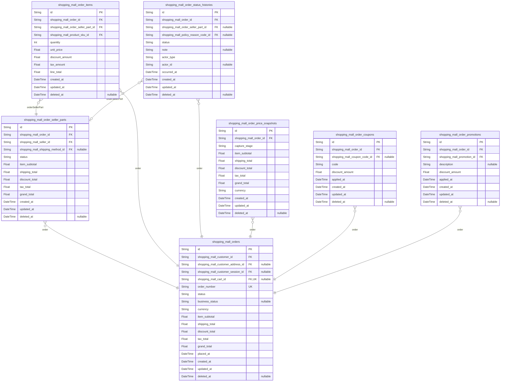
```mermaid
erDiagram
"shopping_mall_orders" {
  String id PK
  String shopping_mall_customer_id FK
  String shopping_mall_customer_address_id FK "nullable"
  String shopping_mall_customer_session_id FK "nullable"
  String shopping_mall_cart_id FK,UK "nullable"
  String order_number UK
  String status
  String business_status "nullable"
  String currency
  Float item_subtotal
  Float shipping_total
  Float discount_total
  Float tax_total
  Float grand_total
  DateTime placed_at
  DateTime created_at
  DateTime updated_at
  DateTime deleted_at "nullable"
}
"shopping_mall_order_seller_parts" {
  String id PK
  String shopping_mall_order_id FK
  String shopping_mall_seller_id FK
  String shopping_mall_shipping_method_id FK "nullable"
  String status
  Float item_subtotal
  Float shipping_total
  Float discount_total
  Float tax_total
  Float grand_total
  DateTime created_at
  DateTime updated_at
  DateTime deleted_at "nullable"
}
"shopping_mall_order_items" {
  String id PK
  String shopping_mall_order_id FK
  String shopping_mall_order_seller_part_id FK
  String shopping_mall_product_sku_id FK
  Int quantity
  Float unit_price
  Float discount_amount
  Float tax_amount
  Float line_total
  DateTime created_at
  DateTime updated_at
  DateTime deleted_at "nullable"
}
"shopping_mall_order_status_histories" {
  String id PK
  String shopping_mall_order_id FK
  String shopping_mall_order_seller_part_id FK "nullable"
  String shopping_mall_policy_reason_code_id FK "nullable"
  String status
  String note "nullable"
  String actor_type
  String actor_id "nullable"
  DateTime occurred_at
  DateTime created_at
  DateTime updated_at
  DateTime deleted_at "nullable"
}
"shopping_mall_order_price_snapshots" {
  String id PK
  String shopping_mall_order_id FK
  String capture_stage
  Float item_subtotal
  Float shipping_total
  Float discount_total
  Float tax_total
  Float grand_total
  String currency
  DateTime created_at
  DateTime updated_at
  DateTime deleted_at "nullable"
}
"shopping_mall_order_coupons" {
  String id PK
  String shopping_mall_order_id FK
  String shopping_mall_coupon_code_id FK "nullable"
  String code
  Float discount_amount
  DateTime applied_at
  DateTime created_at
  DateTime updated_at
  DateTime deleted_at "nullable"
}
"shopping_mall_order_promotions" {
  String id PK
  String shopping_mall_order_id FK
  String shopping_mall_promotion_id FK
  String description "nullable"
  Float discount_amount
  DateTime applied_at
  DateTime created_at
  DateTime updated_at
  DateTime deleted_at "nullable"
}
"shopping_mall_order_seller_parts" }o--|| "shopping_mall_orders" : order
"shopping_mall_order_items" }o--|| "shopping_mall_orders" : order
"shopping_mall_order_items" }o--|| "shopping_mall_order_seller_parts" : orderSellerPart
"shopping_mall_order_status_histories" }o--|| "shopping_mall_orders" : order
"shopping_mall_order_status_histories" }o--o| "shopping_mall_order_seller_parts" : orderSellerPart
"shopping_mall_order_price_snapshots" }o--|| "shopping_mall_orders" : order
"shopping_mall_order_coupons" }o--|| "shopping_mall_orders" : order
"shopping_mall_order_promotions" }o--|| "shopping_mall_orders" : order
```

### `shopping_mall_orders`

Customer purchase order header capturing buyer, selected address context,
conversion sources (cart, payment intent), order lifecycle status, and
authoritative financial amounts. Serves as the core transaction object;
seller-specific fulfillment is represented by {@link
shopping_mall_order_seller_parts}. Items are contained in {@link
shopping_mall_order_items}. Status changes are logged in {@link
shopping_mall_order_status_histories}. Monetary totals reflect the
committed values at order placement and are immutable for audit. Coupons
and promotions applied to this order are recorded in {@link
shopping_mall_order_coupons} and [shopping_mall_order_promotions](#shopping_mall_order_promotions).

Properties as follows:

- `id`: Primary Key.
- `shopping_mall_customer_id`: Ordering customer. [shopping_mall_customers.id](#shopping_mall_customers).
- `shopping_mall_customer_address_id`
  > Chosen shipping address at order time (nullable for pickup or digital).
  > [shopping_mall_customer_addresses.id](#shopping_mall_customer_addresses).
- `shopping_mall_customer_session_id`
  > Originating customer session for audit tracing (optional). {@link
  > shopping_mall_customer_sessions.id}.
- `shopping_mall_cart_id`
  > Source cart converted into this order (1:1 when present). {@link
  > shopping_mall_carts.id}.
- `order_number`
  > Business-visible, human-friendly order number unique across the platform
  > for customer support and reconciliation.
- `status`
  > Canonical order status (e.g., Pending Payment, Confirmed, In Fulfillment,
  > Partially Shipped, Shipped, Out for Delivery, Delivered, Completed,
  > Cancelled, Refunded/Partially Refunded).
- `business_status`
  > Optional business workflow flag (e.g., risk_hold, pending_verification)
  > used for operational views.
- `currency`: ISO currency code used to express all monetary amounts of this order.
- `item_subtotal`
  > Sum of item extended prices before shipping, tax, and order-level
  > discounts.
- `shipping_total`: Total shipping charges applied to the order.
- `discount_total`: Total discount amount applied (coupons + promotions).
- `tax_total`: Total tax amount computed for the order.
- `grand_total`
  > All-inclusive amount payable/paid for the order after discounts,
  > shipping, and taxes.
- `placed_at`: Timestamp when the order was successfully placed (post-authorization).
- `created_at`: Creation timestamp.
- `updated_at`: Last update timestamp.
- `deleted_at`: Soft deletion timestamp for recoverable delete.

### `shopping_mall_order_seller_parts`

Seller-specific partition of an order representing the scope a particular
[shopping_mall_sellers](#shopping_mall_sellers) must fulfill. Contains per-seller financial
breakdowns and lifecycle status. Each order/seller pair is unique.
Shipments and tracking reference this seller partition through other
components. Items belonging to this part are recorded in {@link
shopping_mall_order_items}.

Properties as follows:

- `id`: Primary Key.
- `shopping_mall_order_id`: Parent order. [shopping_mall_orders.id](#shopping_mall_orders).
- `shopping_mall_seller_id`
  > Owning seller responsible for fulfillment. {@link
  > shopping_mall_sellers.id}.
- `shopping_mall_shipping_method_id`
  > Selected shipping method for this seller partition when applicable.
  > [shopping_mall_shipping_methods.id](#shopping_mall_shipping_methods).
- `status`: Seller-part lifecycle status derived from fulfillment progress.
- `item_subtotal`
  > Sum of item prices within this seller partition before shipping, tax, and
  > discounts.
- `shipping_total`: Shipping charges attributed to this seller partition.
- `discount_total`
  > Total discount amount applied at this seller partition (allocations of
  > order-level discounts plus seller-funded discounts).
- `tax_total`: Total tax amount attributed to this seller partition.
- `grand_total`: All-inclusive amount for this seller partition.
- `created_at`: Creation timestamp.
- `updated_at`: Last update timestamp.
- `deleted_at`: Soft deletion timestamp.

### `shopping_mall_order_items`

Order line items referencing purchased SKUs and their captured
prices/amounts. Lines are scoped by a seller partition {@link
shopping_mall_order_seller_parts} and also linked to the parent {@link
shopping_mall_orders}. Monetary values are immutable snapshots taken at
order time for audit.

Properties as follows:

- `id`: Primary Key.
- `shopping_mall_order_id`: Parent order. [shopping_mall_orders.id](#shopping_mall_orders).
- `shopping_mall_order_seller_part_id`
  > Owning seller partition for this line. {@link
  > shopping_mall_order_seller_parts.id}.
- `shopping_mall_product_sku_id`: Purchased SKU at order time. [shopping_mall_product_skus.id](#shopping_mall_product_skus).
- `quantity`: Quantity purchased for this SKU.
- `unit_price`: Unit price captured at order time in order currency.
- `discount_amount`: Total discount amount allocated to this line.
- `tax_amount`: Tax amount allocated to this line.
- `line_total`
  > Final line amount after discounts and taxes (quantity × unit price with
  > allocations).
- `created_at`: Creation timestamp.
- `updated_at`: Last update timestamp.
- `deleted_at`: Soft deletion timestamp.

### `shopping_mall_order_status_histories`

Append-only audit trail of status transitions for orders and optionally
for seller partitions. Each record captures the target entity, new
canonical status, timestamp, actor classification, and optional reason
code. Used for compliance, SLA measurement, and user-visible timelines.
References [shopping_mall_orders](#shopping_mall_orders) and optionally {@link
shopping_mall_order_seller_parts}.

Properties as follows:

- `id`: Primary Key.
- `shopping_mall_order_id`: Target order whose status changed. [shopping_mall_orders.id](#shopping_mall_orders).
- `shopping_mall_order_seller_part_id`
  > Optional seller partition when the change pertains to a specific seller
  > scope. [shopping_mall_order_seller_parts.id](#shopping_mall_order_seller_parts).
- `shopping_mall_policy_reason_code_id`
  > Optional policy reason code associated with the transition. {@link
  > shopping_mall_policy_reason_codes.id}.
- `status`: New canonical status after the transition.
- `note`: Optional human-readable explanation of the status change.
- `actor_type`
  > Actor classification that performed the change (e.g., system, customer,
  > seller, admin).
- `actor_id`: Identifier of the actor in its home table for audit tracing when captured.
- `occurred_at`: Timestamp when the status change occurred (source-of-truth event time).
- `created_at`: Record creation timestamp.
- `updated_at`: Record update timestamp.
- `deleted_at`: Soft deletion timestamp if redaction is necessary.

### `shopping_mall_order_price_snapshots`

Append-only financial snapshots capturing aggregate order monetary
components at key capture stages (e.g., authorization, final). Enables
deterministic reconciliation and historical comparisons. Each snapshot
binds to one [shopping_mall_orders](#shopping_mall_orders).

Properties as follows:

- `id`: Primary Key.
- `shopping_mall_order_id`
  > Order whose financials are being snapshotted. {@link
  > shopping_mall_orders.id}.
- `capture_stage`
  > Named capture stage (e.g., authorization, final) used to distinguish
  > snapshots.
- `item_subtotal`: Item subtotal at this stage.
- `shipping_total`: Shipping total at this stage.
- `discount_total`: Discount total at this stage.
- `tax_total`: Tax total at this stage.
- `grand_total`: Grand total at this stage.
- `currency`: Currency code used for this snapshot (matches order currency at the time).
- `created_at`: Snapshot creation timestamp.
- `updated_at`: Snapshot update timestamp (rarely used; snapshots are append-only).
- `deleted_at`: Soft deletion timestamp for administrative redaction when necessary.

### `shopping_mall_order_coupons`

Coupons applied to an order with captured code and discount amount for
deterministic accounting. Links to the canonical coupon code record when
available. Multiple coupons may apply depending on stacking rules.
Belongs to [shopping_mall_orders](#shopping_mall_orders).

Properties as follows:

- `id`: Primary Key.
- `shopping_mall_order_id`: Order that received the coupon benefit. [shopping_mall_orders.id](#shopping_mall_orders).
- `shopping_mall_coupon_code_id`
  > Canonical coupon code reference, when resolvable. {@link
  > shopping_mall_coupon_codes.id}.
- `code`: Coupon code string as entered and accepted at checkout.
- `discount_amount`: Total discount amount attributed to this coupon application.
- `applied_at`: Timestamp when this coupon was applied to the order.
- `created_at`: Creation timestamp.
- `updated_at`: Last update timestamp.
- `deleted_at`: Soft deletion timestamp.

### `shopping_mall_order_promotions`

Record of non-coupon promotions applied to an order, including the exact
discount amount and application time. Useful for deterministic
reconciliation of seller-funded and platform-funded benefits. Belongs to
[shopping_mall_orders](#shopping_mall_orders) and references {@link
shopping_mall_promotions}.

Properties as follows:

- `id`: Primary Key.
- `shopping_mall_order_id`
  > Order that received the promotion benefit. {@link
  > shopping_mall_orders.id}.
- `shopping_mall_promotion_id`: Applied promotion configuration. [shopping_mall_promotions.id](#shopping_mall_promotions).
- `description`
  > Optional human-readable description of the promotion application for
  > audit clarity.
- `discount_amount`: Total discount amount attributed to this promotion application.
- `applied_at`: Timestamp when the promotion was applied to the order.
- `created_at`: Creation timestamp.
- `updated_at`: Last update timestamp.
- `deleted_at`: Soft deletion timestamp.

## Shipments

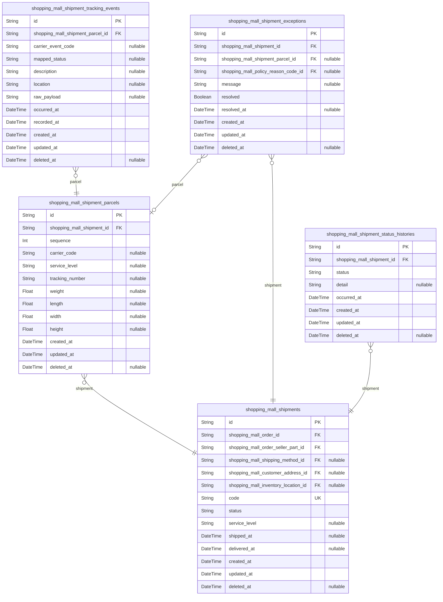
```mermaid
erDiagram
"shopping_mall_shipments" {
  String id PK
  String shopping_mall_order_id FK
  String shopping_mall_order_seller_part_id FK
  String shopping_mall_shipping_method_id FK "nullable"
  String shopping_mall_customer_address_id FK "nullable"
  String shopping_mall_inventory_location_id FK "nullable"
  String code UK
  String status
  String service_level "nullable"
  DateTime shipped_at "nullable"
  DateTime delivered_at "nullable"
  DateTime created_at
  DateTime updated_at
  DateTime deleted_at "nullable"
}
"shopping_mall_shipment_parcels" {
  String id PK
  String shopping_mall_shipment_id FK
  Int sequence
  String carrier_code "nullable"
  String service_level "nullable"
  String tracking_number "nullable"
  Float weight "nullable"
  Float length "nullable"
  Float width "nullable"
  Float height "nullable"
  DateTime created_at
  DateTime updated_at
  DateTime deleted_at "nullable"
}
"shopping_mall_shipment_tracking_events" {
  String id PK
  String shopping_mall_shipment_parcel_id FK
  String carrier_event_code "nullable"
  String mapped_status "nullable"
  String description "nullable"
  String location "nullable"
  String raw_payload "nullable"
  DateTime occurred_at
  DateTime recorded_at
  DateTime created_at
  DateTime updated_at
  DateTime deleted_at "nullable"
}
"shopping_mall_shipment_exceptions" {
  String id PK
  String shopping_mall_shipment_id FK
  String shopping_mall_shipment_parcel_id FK "nullable"
  String shopping_mall_policy_reason_code_id FK "nullable"
  String message "nullable"
  Boolean resolved
  DateTime resolved_at "nullable"
  DateTime created_at
  DateTime updated_at
  DateTime deleted_at "nullable"
}
"shopping_mall_shipment_status_histories" {
  String id PK
  String shopping_mall_shipment_id FK
  String status
  String detail "nullable"
  DateTime occurred_at
  DateTime created_at
  DateTime updated_at
  DateTime deleted_at "nullable"
}
"shopping_mall_shipment_parcels" }o--|| "shopping_mall_shipments" : shipment
"shopping_mall_shipment_tracking_events" }o--|| "shopping_mall_shipment_parcels" : parcel
"shopping_mall_shipment_exceptions" }o--|| "shopping_mall_shipments" : shipment
"shopping_mall_shipment_exceptions" }o--o| "shopping_mall_shipment_parcels" : parcel
"shopping_mall_shipment_status_histories" }o--|| "shopping_mall_shipments" : shipment
```

### `shopping_mall_shipments`

Carrier-agnostic shipment entity representing a fulfillable package group
for a seller part of an order. Serves as the parent for parcels,
tracking, exceptions, and status history. Links to the customer’s order
and seller part partition to preserve tenant boundaries. The current
status is stored for operational queries while {@link
shopping_mall_shipment_status_histories} preserves the full transition
history. Related parcels are in [shopping_mall_shipment_parcels](#shopping_mall_shipment_parcels).

Properties as follows:

- `id`: Primary Key.
- `shopping_mall_order_id`: Owning order’s [shopping_mall_orders.id](#shopping_mall_orders).
- `shopping_mall_order_seller_part_id`
  > Seller partition of the order’s {@link
  > shopping_mall_order_seller_parts.id}.
- `shopping_mall_shipping_method_id`: Selected shipping method’s [shopping_mall_shipping_methods.id](#shopping_mall_shipping_methods).
- `shopping_mall_customer_address_id`
  > Destination address reference’s {@link
  > shopping_mall_customer_addresses.id}. Optional when the order stores an
  > internal snapshot.
- `shopping_mall_inventory_location_id`
  > Ship-from inventory location’s {@link
  > shopping_mall_inventory_locations.id}.
- `code`
  > Business-visible shipment code/identifier unique within the platform for
  > traceability and customer support.
- `status`
  > Current canonical shipment status (e.g., Ready for Pickup, In Transit,
  > Out for Delivery, Delivered, Exception). Mirrors the latest entry from
  > [shopping_mall_shipment_status_histories](#shopping_mall_shipment_status_histories) for operational reads.
- `service_level`
  > Displayed service level at time of handoff (e.g., Standard, Expedited,
  > Express).
- `shipped_at`
  > Timestamp when shipment first transitioned to a shipped state. Optional;
  > derived from events if not explicitly set.
- `delivered_at`
  > Timestamp when shipment completed delivery across all parcels. Optional;
  > derived from events if not explicitly set.
- `created_at`: Creation time of the shipment entity.
- `updated_at`: Last update time of the shipment entity.
- `deleted_at`: Soft deletion timestamp for the shipment entity.

### `shopping_mall_shipment_parcels`

Parcels belonging to a shipment, each typically having its own tracking
number and potentially distinct carrier/service. Designed to support
multi-parcel shipments where each parcel can independently progress
through tracking milestones recorded in {@link
shopping_mall_shipment_tracking_events}.

Properties as follows:

- `id`: Primary Key.
- `shopping_mall_shipment_id`: Parent shipment’s [shopping_mall_shipments.id](#shopping_mall_shipments).
- `sequence`
  > Parcel sequence number unique within its parent shipment to provide
  > stable ordering and human reference (e.g., 1..N).
- `carrier_code`
  > Carrier identifier code captured at label creation (e.g., UPS, FEDEX,
  > DHL).
- `service_level`: Carrier service level for this parcel (e.g., Ground, 2-Day, Express).
- `tracking_number`: Carrier-issued tracking number tied to this parcel.
- `weight`: Parcel weight at handoff (unit defined by business policy).
- `length`: Parcel length (unit defined by business policy).
- `width`: Parcel width (unit defined by business policy).
- `height`: Parcel height (unit defined by business policy).
- `created_at`: Creation time of the parcel record.
- `updated_at`: Last update time of the parcel record.
- `deleted_at`: Soft deletion timestamp for the parcel record.

### `shopping_mall_shipment_tracking_events`

Append-only carrier tracking events captured for each parcel. These
records map provider-specific events into business context while
preserving the original textual payload. Used to infer shipment progress
and to notify customers. Related parent parcel is {@link
shopping_mall_shipment_parcels}.

Properties as follows:

- `id`: Primary Key.
- `shopping_mall_shipment_parcel_id`: Tracked parcel’s [shopping_mall_shipment_parcels.id](#shopping_mall_shipment_parcels).
- `carrier_event_code`
  > Provider-specific event code or milestone key used for reconciliation and
  > deduplication.
- `mapped_status`
  > Mapped canonical status at the time of the event (e.g., Ready for Pickup,
  > In Transit, Out for Delivery, Delivered, Exception).
- `description`: Human-readable description from the carrier event or system mapping.
- `location`
  > Free-text location provided by the carrier (facility/city/state/country
  > as available).
- `raw_payload`: Raw or normalized payload segment for audit and debugging purposes.
- `occurred_at`: Carrier-provided event timestamp (authoritative when present).
- `recorded_at`: Timestamp when the platform ingested this event.
- `created_at`: Record creation time.
- `updated_at`: Record last update time (typically equal to created_at for append-only).
- `deleted_at`: Soft deletion timestamp (rarely used, retained for governance).

### `shopping_mall_shipment_exceptions`

Recorded exceptions or issues associated with a shipment, optionally
narrowed to a specific parcel. Utilized for delivery problems such as
address issues, failed attempts, customs holds, damage/loss reports, and
other categorized reasons. Reason category references platform policy
codes in [shopping_mall_policy_reason_codes](#shopping_mall_policy_reason_codes).

Properties as follows:

- `id`: Primary Key.
- `shopping_mall_shipment_id`: Affected shipment’s [shopping_mall_shipments.id](#shopping_mall_shipments).
- `shopping_mall_shipment_parcel_id`
  > Optionally the affected parcel’s {@link
  > shopping_mall_shipment_parcels.id}.
- `shopping_mall_policy_reason_code_id`
  > Categorized exception reason code’s {@link
  > shopping_mall_policy_reason_codes.id}.
- `message`
  > Human-readable description of the exception, suitable for support and
  > auditing.
- `resolved`: Whether the exception has been resolved (closed).
- `resolved_at`: Timestamp when the exception was resolved, if applicable.
- `created_at`: Creation timestamp for the exception record.
- `updated_at`: Last update timestamp for the exception record.
- `deleted_at`: Soft deletion timestamp for the exception record.

### `shopping_mall_shipment_status_histories`

Canonical shipment status transition history. Each record captures a
point-in-time transition for [shopping_mall_shipments](#shopping_mall_shipments) with an
occurrence time, enabling audit trails and customer-visible timelines.
The latest status can be mirrored on the shipment record for fast reads.

Properties as follows:

- `id`: Primary Key.
- `shopping_mall_shipment_id`: Shipment whose status changed [shopping_mall_shipments.id](#shopping_mall_shipments).
- `status`
  > Canonical shipment status at this point in time (e.g., Ready for Pickup,
  > In Transit, Out for Delivery, Delivered, Exception).
- `detail`
  > Optional detail or rationale for this transition (e.g., source event,
  > human note).
- `occurred_at`: Timestamp when the status change took effect.
- `created_at`: Record creation time.
- `updated_at`: Record last update time (generally equals created_at).
- `deleted_at`: Soft deletion timestamp for the status history record.

## Payments

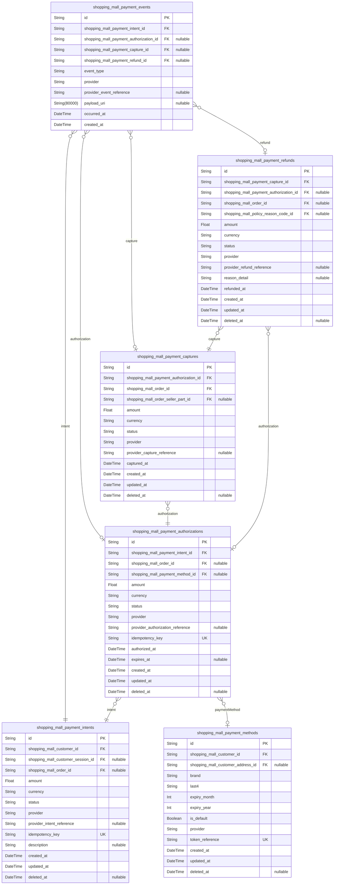
```mermaid
erDiagram
"shopping_mall_payment_intents" {
  String id PK
  String shopping_mall_customer_id FK
  String shopping_mall_customer_session_id FK "nullable"
  String shopping_mall_order_id FK "nullable"
  Float amount
  String currency
  String status
  String provider
  String provider_intent_reference "nullable"
  String idempotency_key UK
  String description "nullable"
  DateTime created_at
  DateTime updated_at
  DateTime deleted_at "nullable"
}
"shopping_mall_payment_authorizations" {
  String id PK
  String shopping_mall_payment_intent_id FK
  String shopping_mall_order_id FK "nullable"
  String shopping_mall_payment_method_id FK "nullable"
  Float amount
  String currency
  String status
  String provider
  String provider_authorization_reference "nullable"
  String idempotency_key UK
  DateTime authorized_at
  DateTime expires_at "nullable"
  DateTime created_at
  DateTime updated_at
  DateTime deleted_at "nullable"
}
"shopping_mall_payment_captures" {
  String id PK
  String shopping_mall_payment_authorization_id FK
  String shopping_mall_order_id FK
  String shopping_mall_order_seller_part_id FK "nullable"
  Float amount
  String currency
  String status
  String provider
  String provider_capture_reference "nullable"
  DateTime captured_at
  DateTime created_at
  DateTime updated_at
  DateTime deleted_at "nullable"
}
"shopping_mall_payment_refunds" {
  String id PK
  String shopping_mall_payment_capture_id FK
  String shopping_mall_payment_authorization_id FK "nullable"
  String shopping_mall_order_id FK "nullable"
  String shopping_mall_policy_reason_code_id FK "nullable"
  Float amount
  String currency
  String status
  String provider
  String provider_refund_reference "nullable"
  String reason_detail "nullable"
  DateTime refunded_at
  DateTime created_at
  DateTime updated_at
  DateTime deleted_at "nullable"
}
"shopping_mall_payment_methods" {
  String id PK
  String shopping_mall_customer_id FK
  String shopping_mall_customer_address_id FK "nullable"
  String brand
  String last4
  Int expiry_month
  Int expiry_year
  Boolean is_default
  String provider
  String token_reference UK
  DateTime created_at
  DateTime updated_at
  DateTime deleted_at "nullable"
}
"shopping_mall_payment_events" {
  String id PK
  String shopping_mall_payment_intent_id FK
  String shopping_mall_payment_authorization_id FK "nullable"
  String shopping_mall_payment_capture_id FK "nullable"
  String shopping_mall_payment_refund_id FK "nullable"
  String event_type
  String provider
  String provider_event_reference "nullable"
  String(80000) payload_uri "nullable"
  DateTime occurred_at
  DateTime created_at
}
"shopping_mall_payment_authorizations" }o--|| "shopping_mall_payment_intents" : intent
"shopping_mall_payment_authorizations" }o--o| "shopping_mall_payment_methods" : paymentMethod
"shopping_mall_payment_captures" }o--|| "shopping_mall_payment_authorizations" : authorization
"shopping_mall_payment_refunds" }o--|| "shopping_mall_payment_captures" : capture
"shopping_mall_payment_refunds" }o--o| "shopping_mall_payment_authorizations" : authorization
"shopping_mall_payment_events" }o--|| "shopping_mall_payment_intents" : intent
"shopping_mall_payment_events" }o--o| "shopping_mall_payment_authorizations" : authorization
"shopping_mall_payment_events" }o--o| "shopping_mall_payment_captures" : capture
"shopping_mall_payment_events" }o--o| "shopping_mall_payment_refunds" : refund
```

### `shopping_mall_payment_intents`

Top-level payment intent representing the customer’s attempt to pay for a
checkout session. Anchors the payment lifecycle and may predate order
creation. Links to customers and optionally the resulting order.
Provider-agnostic fields (status, provider, references) support
reconciliation and idempotency. Disambiguated relation names are applied
to avoid ambiguity with Orders.

Properties as follows:

- `id`: Primary Key.
- `shopping_mall_customer_id`: Belonged customer’s [shopping_mall_customers.id](#shopping_mall_customers).
- `shopping_mall_customer_session_id`: Originating customer session’s [shopping_mall_customer_sessions.id](#shopping_mall_customer_sessions).
- `shopping_mall_order_id`
  > Related order’s [shopping_mall_orders.id](#shopping_mall_orders) captured for retries
  > history. Uses named relation to avoid ambiguity.
- `amount`
  > Total intended amount to be authorized/captured for this checkout session
  > in the order currency.
- `currency`: Three-letter currency code (e.g., "KRW", "USD").
- `status`
  > Provider-agnostic intent status (e.g., initiated, requires_action,
  > authorized, canceled, failed).
- `provider`: Payment service provider identifier (e.g., stripe, toss, paypal).
- `provider_intent_reference`
  > External provider’s intent reference for reconciliation. May be absent
  > until provider object creation.
- `idempotency_key`
  > Idempotency key used to deduplicate create/confirm requests for this
  > intent.
- `description`: Human-readable description/memo for the payment intent (auditing/support).
- `created_at`: Creation timestamp.
- `updated_at`: Last update timestamp.
- `deleted_at`: Soft deletion timestamp.

### `shopping_mall_payment_authorizations`

Authorization records for payment intents. Represents the provider’s
approval to hold funds. Typically follows the intent and may precede
order creation. Links to [shopping_mall_payment_intents](#shopping_mall_payment_intents),
optionally the resulting [shopping_mall_orders](#shopping_mall_orders), and the {@link
shopping_mall_payment_methods} used.

Properties as follows:

- `id`: Primary Key.
- `shopping_mall_payment_intent_id`: Parent intent’s [shopping_mall_payment_intents.id](#shopping_mall_payment_intents).
- `shopping_mall_order_id`
  > Related order’s [shopping_mall_orders.id](#shopping_mall_orders). Nullable if order has
  > not been created yet.
- `shopping_mall_payment_method_id`
  > Payment method’s [shopping_mall_payment_methods.id](#shopping_mall_payment_methods) used for the
  > authorization when applicable.
- `amount`: Authorized amount in the intent/order currency.
- `currency`: Three-letter currency code stored as string.
- `status`
  > Provider-agnostic authorization status (e.g., authorized, voided,
  > expired, failed).
- `provider`: Payment service provider identifier.
- `provider_authorization_reference`: External provider’s authorization reference for reconciliation.
- `idempotency_key`: Idempotency key to deduplicate authorization attempts.
- `authorized_at`: Timestamp when the authorization was granted.
- `expires_at`: Authorization expiration time if provided by the provider.
- `created_at`: Creation timestamp.
- `updated_at`: Last update timestamp.
- `deleted_at`: Soft deletion timestamp.

### `shopping_mall_payment_captures`

Capture records representing actual fund capture (settlement). Typically
reference an authorization and the order; may be linked to a seller part
for partial capture. Links to {@link
shopping_mall_payment_authorizations}, [shopping_mall_orders](#shopping_mall_orders), and
optionally [shopping_mall_order_seller_parts](#shopping_mall_order_seller_parts).

Properties as follows:

- `id`: Primary Key.
- `shopping_mall_payment_authorization_id`: Parent authorization’s [shopping_mall_payment_authorizations.id](#shopping_mall_payment_authorizations).
- `shopping_mall_order_id`: Captured order’s [shopping_mall_orders.id](#shopping_mall_orders).
- `shopping_mall_order_seller_part_id`
  > Optional seller-part’s [shopping_mall_order_seller_parts.id](#shopping_mall_order_seller_parts) for
  > partial capture scope.
- `amount`: Captured amount in the order currency.
- `currency`: Three-letter currency code stored as string.
- `status`
  > Provider-agnostic capture status (e.g., captured, partially_captured,
  > failed).
- `provider`: Payment service provider identifier.
- `provider_capture_reference`: External provider’s capture reference for reconciliation.
- `captured_at`: Timestamp when the capture was made.
- `created_at`: Creation timestamp.
- `updated_at`: Last update timestamp.
- `deleted_at`: Soft deletion timestamp.

### `shopping_mall_payment_refunds`

Refund records representing money returned to the customer. References
the captured transaction, optionally the originating authorization and
order, and may carry a policy reason. Links to {@link
shopping_mall_payment_captures}, {@link
shopping_mall_payment_authorizations}, [shopping_mall_orders](#shopping_mall_orders), and
[shopping_mall_policy_reason_codes](#shopping_mall_policy_reason_codes).

Properties as follows:

- `id`: Primary Key.
- `shopping_mall_payment_capture_id`: Captured transaction’s [shopping_mall_payment_captures.id](#shopping_mall_payment_captures).
- `shopping_mall_payment_authorization_id`
  > Optional link to the original authorization’s {@link
  > shopping_mall_payment_authorizations.id}.
- `shopping_mall_order_id`
  > Associated order’s [shopping_mall_orders.id](#shopping_mall_orders). Nullable because
  > order can be inferred via capture.
- `shopping_mall_policy_reason_code_id`: Refund policy reason’s [shopping_mall_policy_reason_codes.id](#shopping_mall_policy_reason_codes).
- `amount`: Refunded amount in the order currency.
- `currency`: Three-letter currency code stored as string.
- `status`
  > Provider-agnostic refund status (e.g., initiated, pending, completed,
  > failed).
- `provider`: Payment service provider identifier.
- `provider_refund_reference`: External provider’s refund reference for reconciliation.
- `reason_detail`
  > Free-form explanation or notes for the refund (supplementing policy
  > reason).
- `refunded_at`: Timestamp when the refund was executed or finalized.
- `created_at`: Creation timestamp.
- `updated_at`: Last update timestamp.
- `deleted_at`: Soft deletion timestamp.

### `shopping_mall_payment_methods`

Customer payment instruments (e.g., saved card token). Managed by
customers and used during checkout. Links to {@link
shopping_mall_customers} and optionally a billing {@link
shopping_mall_customer_addresses}.

Properties as follows:

- `id`: Primary Key.
- `shopping_mall_customer_id`: Owner customer’s [shopping_mall_customers.id](#shopping_mall_customers).
- `shopping_mall_customer_address_id`
  > Billing address’s [shopping_mall_customer_addresses.id](#shopping_mall_customer_addresses) if a
  > separate billing address is stored.
- `brand`
  > Card/network brand or method family (e.g., Visa, Mastercard, Amex,
  > bank_transfer).
- `last4`: Last four characters of the instrument identifier (masked).
- `expiry_month`: Expiry month for card-like methods (1-12).
- `expiry_year`: Expiry year for card-like methods (four-digit).
- `is_default`: Whether this method is the default payment method for the customer.
- `provider`: Payment service provider that issued the token/reference.
- `token_reference`: Provider token or vaulted reference used for charges/authorizations.
- `created_at`: Creation timestamp.
- `updated_at`: Last update timestamp.
- `deleted_at`: Soft deletion timestamp.

### `shopping_mall_payment_events`

Immutable audit events emitted by the payment provider or system during
the payment lifecycle. Always tied to a {@link
shopping_mall_payment_intents} and optionally to lower-level entities
([shopping_mall_payment_authorizations](#shopping_mall_payment_authorizations), {@link
shopping_mall_payment_captures}, [shopping_mall_payment_refunds](#shopping_mall_payment_refunds)).
Stores a URI to payload for large bodies.

Properties as follows:

- `id`: Primary Key.
- `shopping_mall_payment_intent_id`: Related intent’s [shopping_mall_payment_intents.id](#shopping_mall_payment_intents).
- `shopping_mall_payment_authorization_id`
  > Optional related authorization’s {@link
  > shopping_mall_payment_authorizations.id}.
- `shopping_mall_payment_capture_id`: Optional related capture’s [shopping_mall_payment_captures.id](#shopping_mall_payment_captures).
- `shopping_mall_payment_refund_id`: Optional related refund’s [shopping_mall_payment_refunds.id](#shopping_mall_payment_refunds).
- `event_type`
  > Canonicalized event kind for querying and analytics (e.g.,
  > intent.created, authorization.succeeded, capture.succeeded,
  > refund.failed).
- `provider`: Payment service provider that emitted the event.
- `provider_event_reference`: External provider’s event reference for deduplication.
- `payload_uri`: URI to the persisted event payload (object storage) for large bodies.
- `occurred_at`: Timestamp when the event occurred at the provider or system.
- `created_at`: Ingestion timestamp when the event was recorded.

## Coupons

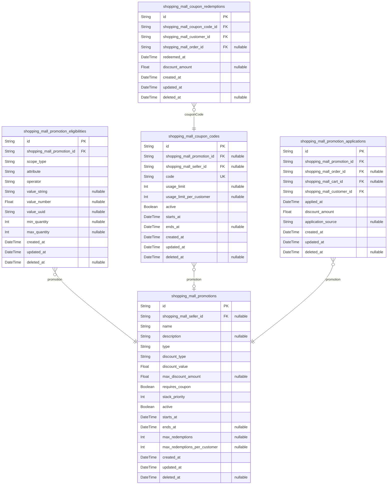
```mermaid
erDiagram
"shopping_mall_promotions" {
  String id PK
  String shopping_mall_seller_id FK "nullable"
  String name
  String description "nullable"
  String type
  String discount_type
  Float discount_value
  Float max_discount_amount "nullable"
  Boolean requires_coupon
  Int stack_priority
  Boolean active
  DateTime starts_at
  DateTime ends_at "nullable"
  Int max_redemptions "nullable"
  Int max_redemptions_per_customer "nullable"
  DateTime created_at
  DateTime updated_at
  DateTime deleted_at "nullable"
}
"shopping_mall_promotion_eligibilities" {
  String id PK
  String shopping_mall_promotion_id FK
  String scope_type
  String attribute
  String operator
  String value_string "nullable"
  Float value_number "nullable"
  String value_uuid "nullable"
  Int min_quantity "nullable"
  Int max_quantity "nullable"
  DateTime created_at
  DateTime updated_at
  DateTime deleted_at "nullable"
}
"shopping_mall_coupon_codes" {
  String id PK
  String shopping_mall_promotion_id FK "nullable"
  String shopping_mall_seller_id FK "nullable"
  String code UK
  Int usage_limit "nullable"
  Int usage_limit_per_customer "nullable"
  Boolean active
  DateTime starts_at
  DateTime ends_at "nullable"
  DateTime created_at
  DateTime updated_at
  DateTime deleted_at "nullable"
}
"shopping_mall_coupon_redemptions" {
  String id PK
  String shopping_mall_coupon_code_id FK
  String shopping_mall_customer_id FK
  String shopping_mall_order_id FK "nullable"
  DateTime redeemed_at
  Float discount_amount "nullable"
  DateTime created_at
  DateTime updated_at
  DateTime deleted_at "nullable"
}
"shopping_mall_promotion_applications" {
  String id PK
  String shopping_mall_promotion_id FK
  String shopping_mall_order_id FK "nullable"
  String shopping_mall_cart_id FK "nullable"
  String shopping_mall_customer_id FK
  DateTime applied_at
  Float discount_amount
  String application_source "nullable"
  DateTime created_at
  DateTime updated_at
  DateTime deleted_at "nullable"
}
"shopping_mall_promotion_eligibilities" }o--|| "shopping_mall_promotions" : promotion
"shopping_mall_coupon_codes" }o--o| "shopping_mall_promotions" : promotion
"shopping_mall_coupon_redemptions" }o--|| "shopping_mall_coupon_codes" : couponCode
"shopping_mall_promotion_applications" }o--|| "shopping_mall_promotions" : promotion
```

### `shopping_mall_promotions`

Promotional programs configured by admins or sellers, controlling
discount logic and stacking policy. A promotion can be platform-wide or
seller-specific. Related entities include {@link
shopping_mall_promotion_eligibilities} for rule constraints, {@link
shopping_mall_coupon_codes} when coupon code is required, and {@link
shopping_mall_promotion_applications} capturing application outcomes.
Lifecycle is controlled by temporal windows and active flag.

Properties as follows:

- `id`: Primary Key.
- `shopping_mall_seller_id`
  > Owning/funding seller if promotion is seller-specific. {@link
  > shopping_mall_sellers.id}.
- `name`: Human-readable promotion name for discovery and administration.
- `description`
  > Optional administrative and business description of the promotion purpose
  > and constraints.
- `type`
  > Business scope of the promotion such as item-level or order-level; stored
  > as string to allow policy-managed values.
- `discount_type`
  > Type of discount: for example, percentage or fixed amount. Stored as
  > string for policy flexibility.
- `discount_value`
  > The discount amount: percentage (0-100) or absolute currency amount
  > depending on discount_type.
- `max_discount_amount`: Optional cap on discount amount for this promotion application.
- `requires_coupon`: Whether a coupon code must be provided for this promotion to apply.
- `stack_priority`
  > Relative stacking priority (lower number may apply first) to resolve
  > stacking order policies.
- `active`: Whether the promotion is currently enabled. Temporal windows still apply.
- `starts_at`: Promotion activation start timestamp for eligibility evaluation.
- `ends_at`: Optional promotion end timestamp; when null the promotion is open-ended.
- `max_redemptions`
  > Optional global cap for the total number of redemptions across all
  > customers.
- `max_redemptions_per_customer`: Optional per-customer redemption cap for the promotion.
- `created_at`: Record creation time for audit trail.
- `updated_at`: Last update time for audit trail.
- `deleted_at`: Soft deletion timestamp; null if not deleted.

### `shopping_mall_promotion_eligibilities`

Eligibility rules that constrain when a [shopping_mall_promotions](#shopping_mall_promotions)
can apply. Each row expresses a single rule (dimension, operator, and
value). Rules are combined by application logic to determine eligibility.
Designed to be flexible without polymorphic FKs by storing values in
typed columns.

Properties as follows:

- `id`: Primary Key.
- `shopping_mall_promotion_id`: Related promotion's [shopping_mall_promotions.id](#shopping_mall_promotions).
- `scope_type`
  > The target scope for the rule (e.g., product, sku, category, seller,
  > customer, cart).
- `attribute`
  > Business attribute being evaluated (e.g., min_order_amount,
  > customer_tier, category_id).
- `operator`
  > Comparison operator (e.g., eq, neq, gt, gte, lt, lte, in, not_in,
  > contains).
- `value_string`: String-valued operand, used when the attribute is textual.
- `value_number`: Numeric-valued operand, used when the attribute is numeric or monetary.
- `value_uuid`
  > UUID-valued operand (e.g., category/product identifiers) without a direct
  > FK to allow polymorphic targets.
- `min_quantity`: Optional minimum quantity threshold for quantity-based conditions.
- `max_quantity`: Optional maximum quantity threshold for quantity-based conditions.
- `created_at`: Record creation time for audit.
- `updated_at`: Record last update time for audit.
- `deleted_at`: Soft deletion timestamp; null if not deleted.

### `shopping_mall_coupon_codes`

Individual coupon codes that may be linked to a {@link
shopping_mall_promotions}. Codes can be platform-wide or seller-specific,
and carry lifecycle windows and usage limits. Redemptions are tracked in
[shopping_mall_coupon_redemptions](#shopping_mall_coupon_redemptions).

Properties as follows:

- `id`: Primary Key.
- `shopping_mall_promotion_id`: Optional related promotion's [shopping_mall_promotions.id](#shopping_mall_promotions).
- `shopping_mall_seller_id`
  > Issuing/owning seller if the coupon is seller-scoped. {@link
  > shopping_mall_sellers.id}.
- `code`
  > Public coupon code string entered by customers; unique platform-wide or
  > per business policy.
- `usage_limit`: Optional overall maximum number of times this code can be redeemed.
- `usage_limit_per_customer`: Optional per-customer redemption limit for this code.
- `active`: Whether the coupon code is enabled for use. Temporal windows still apply.
- `starts_at`: Coupon validity start timestamp.
- `ends_at`: Optional coupon validity end timestamp.
- `created_at`: Record creation timestamp.
- `updated_at`: Record last update timestamp.
- `deleted_at`: Soft deletion timestamp; null if not deleted.

### `shopping_mall_coupon_redemptions`

Event records of coupon code usage by customers. Each redemption
references a [shopping_mall_coupon_codes](#shopping_mall_coupon_codes) and the redeeming {@link
shopping_mall_customers}. When converted to an order, it may reference
[shopping_mall_orders](#shopping_mall_orders). Use this table to audit usage and enforce
usage limits.

Properties as follows:

- `id`: Primary Key.
- `shopping_mall_coupon_code_id`: Redeemed code's [shopping_mall_coupon_codes.id](#shopping_mall_coupon_codes).
- `shopping_mall_customer_id`: Redeeming customer's [shopping_mall_customers.id](#shopping_mall_customers).
- `shopping_mall_order_id`
  > Associated order's [shopping_mall_orders.id](#shopping_mall_orders), if the redemption
  > resulted in an order. Nullable during pre-order states.
- `redeemed_at`: Timestamp when the coupon code was redeemed.
- `discount_amount`
  > Optional realized discount amount associated with this redemption (for
  > reporting).
- `created_at`: Record creation timestamp.
- `updated_at`: Record last update timestamp.
- `deleted_at`: Soft deletion timestamp; null if not deleted.

### `shopping_mall_promotion_applications`

Snapshot records of how a [shopping_mall_promotions](#shopping_mall_promotions) was applied to
a cart or order at a point in time. These entries capture the effective
discount amount and link to either [shopping_mall_carts](#shopping_mall_carts)
(pre‑order) or [shopping_mall_orders](#shopping_mall_orders) (post‑authorization/order),
along with the acting [shopping_mall_customers](#shopping_mall_customers).

Properties as follows:

- `id`: Primary Key.
- `shopping_mall_promotion_id`: Applied promotion's [shopping_mall_promotions.id](#shopping_mall_promotions).
- `shopping_mall_order_id`
  > Order to which the promotion was applied, if applicable. {@link
  > shopping_mall_orders.id}.
- `shopping_mall_cart_id`
  > Cart to which the promotion was applied, if applicable. {@link
  > shopping_mall_carts.id}.
- `shopping_mall_customer_id`: Customer who received the benefit. [shopping_mall_customers.id](#shopping_mall_customers).
- `applied_at`: Timestamp when the promotion was applied.
- `discount_amount`
  > Effective discount amount applied for this promotion on the referenced
  > cart/order.
- `application_source`
  > Reason/source of application such as automatic rule evaluation or
  > coupon-driven; stored as string for policy flexibility.
- `created_at`: Record creation timestamp.
- `updated_at`: Record last update timestamp.
- `deleted_at`: Soft deletion timestamp; null if not deleted.

## Returns

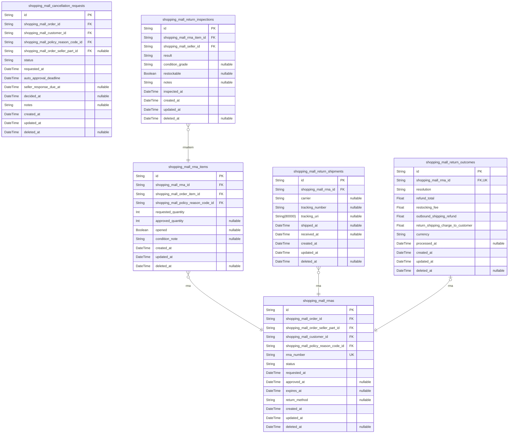
```mermaid
erDiagram
"shopping_mall_cancellation_requests" {
  String id PK
  String shopping_mall_order_id FK
  String shopping_mall_customer_id FK
  String shopping_mall_policy_reason_code_id FK
  String shopping_mall_order_seller_part_id FK "nullable"
  String status
  DateTime requested_at
  DateTime auto_approval_deadline
  DateTime seller_response_due_at "nullable"
  DateTime decided_at "nullable"
  String notes "nullable"
  DateTime created_at
  DateTime updated_at
  DateTime deleted_at "nullable"
}
"shopping_mall_rmas" {
  String id PK
  String shopping_mall_order_id FK
  String shopping_mall_order_seller_part_id FK
  String shopping_mall_customer_id FK
  String shopping_mall_policy_reason_code_id FK
  String rma_number UK
  String status
  DateTime requested_at
  DateTime approved_at "nullable"
  DateTime expires_at "nullable"
  String return_method "nullable"
  DateTime created_at
  DateTime updated_at
  DateTime deleted_at "nullable"
}
"shopping_mall_rma_items" {
  String id PK
  String shopping_mall_rma_id FK
  String shopping_mall_order_item_id FK
  String shopping_mall_policy_reason_code_id FK
  Int requested_quantity
  Int approved_quantity "nullable"
  Boolean opened "nullable"
  String condition_note "nullable"
  DateTime created_at
  DateTime updated_at
  DateTime deleted_at "nullable"
}
"shopping_mall_return_shipments" {
  String id PK
  String shopping_mall_rma_id FK
  String carrier "nullable"
  String tracking_number "nullable"
  String(80000) tracking_uri "nullable"
  DateTime shipped_at "nullable"
  DateTime received_at "nullable"
  DateTime created_at
  DateTime updated_at
  DateTime deleted_at "nullable"
}
"shopping_mall_return_inspections" {
  String id PK
  String shopping_mall_rma_item_id FK
  String shopping_mall_seller_id FK
  String result
  String condition_grade "nullable"
  Boolean restockable "nullable"
  String notes "nullable"
  DateTime inspected_at
  DateTime created_at
  DateTime updated_at
  DateTime deleted_at "nullable"
}
"shopping_mall_return_outcomes" {
  String id PK
  String shopping_mall_rma_id FK,UK
  String resolution
  Float refund_total
  Float restocking_fee
  Float outbound_shipping_refund
  Float return_shipping_charge_to_customer
  String currency
  DateTime processed_at "nullable"
  DateTime created_at
  DateTime updated_at
  DateTime deleted_at "nullable"
}
"shopping_mall_rma_items" }o--|| "shopping_mall_rmas" : rma
"shopping_mall_return_shipments" }o--|| "shopping_mall_rmas" : rma
"shopping_mall_return_inspections" }o--|| "shopping_mall_rma_items" : rmaItem
"shopping_mall_return_outcomes" |o--|| "shopping_mall_rmas" : rma
```

### `shopping_mall_cancellation_requests`

Pre-shipment cancellation requests initiated by customers for their
orders. Tracks policy reason, SLA deadlines, and decision timestamps.
Links to the owning [shopping_mall_orders](#shopping_mall_orders) and the requesting
[shopping_mall_customers](#shopping_mall_customers). Optionally scoped to a specific
seller-part of the order via [shopping_mall_order_seller_parts](#shopping_mall_order_seller_parts).

Properties as follows:

- `id`: Primary Key.
- `shopping_mall_order_id`: Target order's [shopping_mall_orders.id](#shopping_mall_orders).
- `shopping_mall_customer_id`: Requesting customer's [shopping_mall_customers.id](#shopping_mall_customers).
- `shopping_mall_policy_reason_code_id`: Business reason code [shopping_mall_policy_reason_codes.id](#shopping_mall_policy_reason_codes).
- `shopping_mall_order_seller_part_id`
  > Optional scope to seller partition of the order {@link
  > shopping_mall_order_seller_parts.id}.
- `status`
  > Current request status (e.g., pending, auto_approval_pending, approved,
  > denied, expired).
- `requested_at`: Timestamp when the customer submitted the cancellation request.
- `auto_approval_deadline`: Policy-driven deadline for auto-approval if fulfillment has not started.
- `seller_response_due_at`: Optional seller decision due time for requests that require seller action.
- `decided_at`: When the platform or seller finalized the decision (approval or denial).
- `notes`: Customer-provided or staff-added notes contextualizing the request.
- `created_at`: Creation timestamp.
- `updated_at`: Last update timestamp.
- `deleted_at`: Soft deletion timestamp.

### `shopping_mall_rmas`

Return Merchandise Authorizations (RMAs) representing customer-approved
returns per seller partition of an order. Connects to the parent {@link
shopping_mall_orders}, the specific {@link
shopping_mall_order_seller_parts}, the [shopping_mall_customers](#shopping_mall_customers)
owner, and a primary policy reason code. Serves as the header for
subsidiary items, shipments, inspections, and final outcomes.

Properties as follows:

- `id`: Primary Key.
- `shopping_mall_order_id`: Related order [shopping_mall_orders.id](#shopping_mall_orders).
- `shopping_mall_order_seller_part_id`: Seller partition of the order [shopping_mall_order_seller_parts.id](#shopping_mall_order_seller_parts).
- `shopping_mall_customer_id`: RMA owner customer [shopping_mall_customers.id](#shopping_mall_customers).
- `shopping_mall_policy_reason_code_id`: Primary reason for the RMA [shopping_mall_policy_reason_codes.id](#shopping_mall_policy_reason_codes).
- `rma_number`: Business-facing RMA code (human-friendly unique identifier).
- `status`
  > Current RMA status (e.g., pending_approval, approved, customer_to_ship,
  > in_transit, received, inspected, resolved, rejected, expired).
- `requested_at`: Timestamp when customer requested the RMA.
- `approved_at`: Approval time if the RMA is approved.
- `expires_at`: Expiration time if the RMA is not acted upon within policy windows.
- `return_method`: Configured return method label (e.g., drop_off, pickup, courier).
- `created_at`: Creation timestamp.
- `updated_at`: Last update timestamp.
- `deleted_at`: Soft deletion timestamp.

### `shopping_mall_rma_items`

Line-level items that belong to an RMA, referencing specific {@link
shopping_mall_order_items}. Captures requested and approved quantities,
line-level reason, and condition notes without duplicating order data.

Properties as follows:

- `id`: Primary Key.
- `shopping_mall_rma_id`: Parent RMA [shopping_mall_rmas.id](#shopping_mall_rmas).
- `shopping_mall_order_item_id`: Order line item being returned [shopping_mall_order_items.id](#shopping_mall_order_items).
- `shopping_mall_policy_reason_code_id`: Line-level policy reason [shopping_mall_policy_reason_codes.id](#shopping_mall_policy_reason_codes).
- `requested_quantity`: Quantity the customer requests to return for this line.
- `approved_quantity`: Quantity approved for return after review; nullable until decision.
- `opened`: Whether the item packaging is opened (affects restocking policies).
- `condition_note`
  > Seller or inspector notes about the received/declared condition for this
  > line.
- `created_at`: Creation timestamp.
- `updated_at`: Last update timestamp.
- `deleted_at`: Soft deletion timestamp.

### `shopping_mall_return_shipments`

Inbound return shipments associated with an [shopping_mall_rmas](#shopping_mall_rmas).
Tracks carrier, tracking, and shipping/receipt timestamps for the
physical return flow.

Properties as follows:

- `id`: Primary Key.
- `shopping_mall_rma_id`: Related RMA [shopping_mall_rmas.id](#shopping_mall_rmas).
- `carrier`: Carrier name for the inbound return shipment.
- `tracking_number`: Carrier-provided tracking number/code.
- `tracking_uri`: Resolvable tracking URL for the shipment if available.
- `shipped_at`: Timestamp when the customer handed off the return to carrier.
- `received_at`: Timestamp when the seller received the return shipment.
- `created_at`: Creation timestamp.
- `updated_at`: Last update timestamp.
- `deleted_at`: Soft deletion timestamp.

### `shopping_mall_return_inspections`

Inspection records for returned items at the line level. Each record
references an [shopping_mall_rma_items](#shopping_mall_rma_items) entry and the responsible
[shopping_mall_sellers](#shopping_mall_sellers). Captures result, restockability, and notes
with precise timestamps for auditability.

Properties as follows:

- `id`: Primary Key.
- `shopping_mall_rma_item_id`: Inspected line item [shopping_mall_rma_items.id](#shopping_mall_rma_items).
- `shopping_mall_seller_id`: Seller performing/owning the inspection [shopping_mall_sellers.id](#shopping_mall_sellers).
- `result`: Inspection result (e.g., pass, partial, fail).
- `condition_grade`: Business-grade for item condition (e.g., new, open_box, used, damaged).
- `restockable`: Whether the returned item is restockable based on inspection.
- `notes`: Free-text notes and observations captured during inspection.
- `inspected_at`: Timestamp when the inspection was performed.
- `created_at`: Creation timestamp.
- `updated_at`: Last update timestamp.
- `deleted_at`: Soft deletion timestamp.

### `shopping_mall_return_outcomes`

Final RMA outcomes recorded after inspection and decision. Enforces 1:1
with [shopping_mall_rmas](#shopping_mall_rmas) via a unique key and stores
non-derivative monetary amounts for reconciliation (e.g., refund totals,
fees).

Properties as follows:

- `id`: Primary Key.
- `shopping_mall_rma_id`: Parent RMA [shopping_mall_rmas.id](#shopping_mall_rmas).
- `resolution`: Outcome resolution (e.g., approved, partial, rejected).
- `refund_total`: Total refund amount approved for the RMA (final recorded figure).
- `restocking_fee`: Restocking fee amount applied (0 for seller-fault).
- `outbound_shipping_refund`
  > Amount of outbound shipping refunded when applicable (seller-fault
  > scenarios).
- `return_shipping_charge_to_customer`
  > Return shipping charge assigned to customer when applicable
  > (change-of-mind).
- `currency`
  > Currency code used for the amounts in this outcome (snapshotted at
  > decision time, typically equal to order currency).
- `processed_at`: When the outcome was executed/posted to downstream payments/refunds.
- `created_at`: Creation timestamp.
- `updated_at`: Last update timestamp.
- `deleted_at`: Soft deletion timestamp.

## Reviews

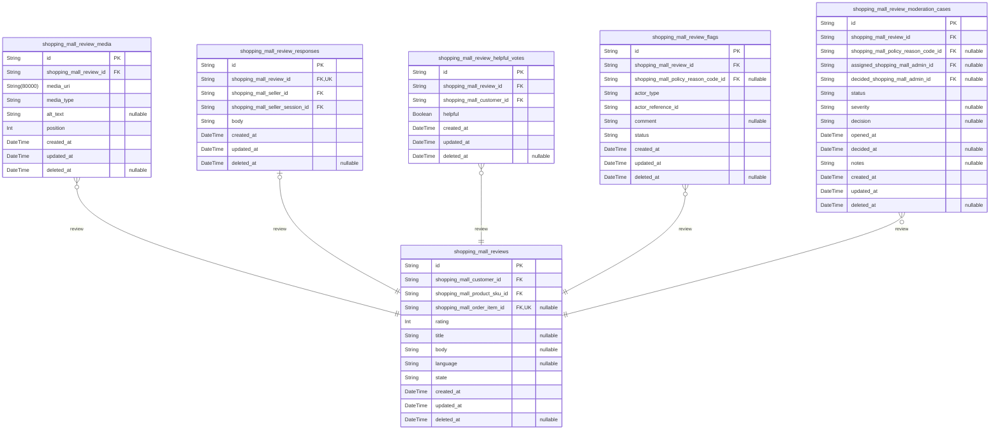
```mermaid
erDiagram
"shopping_mall_reviews" {
  String id PK
  String shopping_mall_customer_id FK
  String shopping_mall_product_sku_id FK
  String shopping_mall_order_item_id FK,UK "nullable"
  Int rating
  String title "nullable"
  String body "nullable"
  String language "nullable"
  String state
  DateTime created_at
  DateTime updated_at
  DateTime deleted_at "nullable"
}
"shopping_mall_review_media" {
  String id PK
  String shopping_mall_review_id FK
  String(80000) media_uri
  String media_type
  String alt_text "nullable"
  Int position
  DateTime created_at
  DateTime updated_at
  DateTime deleted_at "nullable"
}
"shopping_mall_review_responses" {
  String id PK
  String shopping_mall_review_id FK,UK
  String shopping_mall_seller_id FK
  String shopping_mall_seller_session_id FK
  String body
  DateTime created_at
  DateTime updated_at
  DateTime deleted_at "nullable"
}
"shopping_mall_review_helpful_votes" {
  String id PK
  String shopping_mall_review_id FK
  String shopping_mall_customer_id FK
  Boolean helpful
  DateTime created_at
  DateTime updated_at
  DateTime deleted_at "nullable"
}
"shopping_mall_review_flags" {
  String id PK
  String shopping_mall_review_id FK
  String shopping_mall_policy_reason_code_id FK "nullable"
  String actor_type
  String actor_reference_id
  String comment "nullable"
  String status
  DateTime created_at
  DateTime updated_at
  DateTime deleted_at "nullable"
}
"shopping_mall_review_moderation_cases" {
  String id PK
  String shopping_mall_review_id FK
  String shopping_mall_policy_reason_code_id FK "nullable"
  String assigned_shopping_mall_admin_id FK "nullable"
  String decided_shopping_mall_admin_id FK "nullable"
  String status
  String severity "nullable"
  String decision "nullable"
  DateTime opened_at
  DateTime decided_at "nullable"
  String notes "nullable"
  DateTime created_at
  DateTime updated_at
  DateTime deleted_at "nullable"
}
"shopping_mall_review_media" }o--|| "shopping_mall_reviews" : review
"shopping_mall_review_responses" |o--|| "shopping_mall_reviews" : review
"shopping_mall_review_helpful_votes" }o--|| "shopping_mall_reviews" : review
"shopping_mall_review_flags" }o--|| "shopping_mall_reviews" : review
"shopping_mall_review_moderation_cases" }o--|| "shopping_mall_reviews" : review
```

### `shopping_mall_reviews`

Core product/SKU review authored by a customer. Captures rating (1–5),
optional title/body, publication state (e.g., pending, published, hidden,
under_appeal), and authorship/eligibility context. Links to the exact
purchased SKU via [shopping_mall_product_skus](#shopping_mall_product_skus) and (optionally) to
the originating order line via [shopping_mall_order_items](#shopping_mall_order_items) to
evidence verified purchase. Related entities include media {@link
shopping_mall_review_media}, helpful votes {@link
shopping_mall_review_helpful_votes}, flags {@link
shopping_mall_review_flags}, responses {@link
shopping_mall_review_responses}, and moderation workflow {@link
shopping_mall_review_moderation_cases}.

Properties as follows:

- `id`: Primary Key.
- `shopping_mall_customer_id`: Author customer's [shopping_mall_customers.id](#shopping_mall_customers).
- `shopping_mall_product_sku_id`: Reviewed SKU's [shopping_mall_product_skus.id](#shopping_mall_product_skus).
- `shopping_mall_order_item_id`
  > Order line's [shopping_mall_order_items.id](#shopping_mall_order_items) if this review is
  > linked to a verified purchase.
- `rating`: Integer rating score 1–5 as submitted by the customer.
- `title`: Optional short headline for the review.
- `body`: Optional review text body (policy 10–5,000 characters when present).
- `language`
  > IETF language tag (e.g., en, ko) indicating the authoring language of the
  > text, used for moderation and filtering.
- `state`
  > Publication state of the review (e.g., pending, published, hidden,
  > under_appeal).
- `created_at`: Creation timestamp.
- `updated_at`: Last update timestamp.
- `deleted_at`: Soft deletion timestamp if the review is removed from availability.

### `shopping_mall_review_media`

Media assets (images/video) attached to a [shopping_mall_reviews](#shopping_mall_reviews)
entry. Managed as supporting records with ordering for presentation and
alternative text for accessibility. Read-only outside of the review’s
lifecycle.

Properties as follows:

- `id`: Primary Key.
- `shopping_mall_review_id`: Parent review's [shopping_mall_reviews.id](#shopping_mall_reviews).
- `media_uri`: Public or internal URI of the media asset.
- `media_type`: Media type identifier (e.g., image/jpeg, image/png, video/mp4).
- `alt_text`: Optional alternative text for accessibility and moderation context.
- `position`: Zero-based position to order media assets for the parent review.
- `created_at`: Creation timestamp.
- `updated_at`: Last update timestamp.
- `deleted_at`: Soft deletion timestamp if the media is removed.

### `shopping_mall_review_responses`

Single public seller response to a [shopping_mall_reviews](#shopping_mall_reviews) record.
Restricted to exactly one per review and authored by a specific {@link
shopping_mall_sellers} account with session traceability via {@link
shopping_mall_seller_sessions}.

Properties as follows:

- `id`: Primary Key.
- `shopping_mall_review_id`: Target review's [shopping_mall_reviews.id](#shopping_mall_reviews).
- `shopping_mall_seller_id`: Responding seller's [shopping_mall_sellers.id](#shopping_mall_sellers).
- `shopping_mall_seller_session_id`: Responding seller session's [shopping_mall_seller_sessions.id](#shopping_mall_seller_sessions).
- `body`
  > Seller's response text content. Must follow policy (no PII, no
  > promotional codes, no harassment).
- `created_at`: Creation timestamp.
- `updated_at`
  > Last update timestamp; within 24h seller may edit once, otherwise admin
  > involvement required.
- `deleted_at`: Soft deletion timestamp if the response is removed or moderated out.

### `shopping_mall_review_helpful_votes`

Helpfulness votes on [shopping_mall_reviews](#shopping_mall_reviews) by customers. Each
customer may maintain exactly one current vote state (helpful or not
helpful) per review; duplicates are prevented by a composite unique key.

Properties as follows:

- `id`: Primary Key.
- `shopping_mall_review_id`: Target review's [shopping_mall_reviews.id](#shopping_mall_reviews).
- `shopping_mall_customer_id`: Voting customer's [shopping_mall_customers.id](#shopping_mall_customers).
- `helpful`: Whether the vote indicates helpful (true) or not helpful (false).
- `created_at`: Creation timestamp of this vote record.
- `updated_at`: Last update timestamp when vote flips between helpful/not helpful.
- `deleted_at`: Soft deletion timestamp if the vote is removed.

### `shopping_mall_review_flags`

Policy or abuse flags raised against a [shopping_mall_reviews](#shopping_mall_reviews)
entry. Supports multiple actor types (customer, seller, admin,
automation) using a normalized polymorphic reference (actor_type +
actor_reference_id) without multiple nullable FKs. Flags can optionally
cite a policy reason via [shopping_mall_policy_reason_codes](#shopping_mall_policy_reason_codes).

Properties as follows:

- `id`: Primary Key.
- `shopping_mall_review_id`: Flagged review's [shopping_mall_reviews.id](#shopping_mall_reviews).
- `shopping_mall_policy_reason_code_id`
  > Optional policy reason's [shopping_mall_policy_reason_codes.id](#shopping_mall_policy_reason_codes)
  > clarifying the flag category.
- `actor_type`
  > Actor class that raised the flag (e.g., customer, seller, admin,
  > automation).
- `actor_reference_id`
  > Actor identifier corresponding to actor_type, referencing the actor table
  > in the respective component (not a direct FK to avoid polymorphic
  > nullable FK anti-pattern).
- `comment`
  > Optional free-text note supplied by the actor to provide context for the
  > flag.
- `status`: Processing status for this flag (e.g., open, closed, merged).
- `created_at`: Creation timestamp.
- `updated_at`: Last update timestamp.
- `deleted_at`: Soft deletion timestamp.

### `shopping_mall_review_moderation_cases`

Moderation workflow case for a [shopping_mall_reviews](#shopping_mall_reviews) entry.
Records status lifecycle, severity, decision, policy reason linkage via
[shopping_mall_policy_reason_codes](#shopping_mall_policy_reason_codes), involved admins {@link
shopping_mall_admins}, and notes/timestamps for auditability.

Properties as follows:

- `id`: Primary Key.
- `shopping_mall_review_id`: Subject review's [shopping_mall_reviews.id](#shopping_mall_reviews).
- `shopping_mall_policy_reason_code_id`
  > Optional linked policy reason's {@link
  > shopping_mall_policy_reason_codes.id}.
- `assigned_shopping_mall_admin_id`: Assigned moderator's [shopping_mall_admins.id](#shopping_mall_admins) handling this case.
- `decided_shopping_mall_admin_id`
  > Decision owner admin's [shopping_mall_admins.id](#shopping_mall_admins) when a final
  > outcome is recorded.
- `status`
  > Case status (e.g., open, under_review, approved, rejected, redacted,
  > appealed, closed).
- `severity`: Severity classification for SLA and prioritization (e.g., standard, high).
- `decision`
  > Final decision label when applicable (e.g., keep, hide, redact, remove,
  > escalate).
- `opened_at`: Timestamp when the case was opened.
- `decided_at`: Timestamp when the decision was recorded, if decided.
- `notes`
  > Free-text moderator notes and rationale. Avoid PII; use controlled reason
  > codes for policy categories.
- `created_at`: Creation timestamp (record creation).
- `updated_at`: Last update timestamp.
- `deleted_at`: Soft deletion timestamp for logical removal.

## Notifications

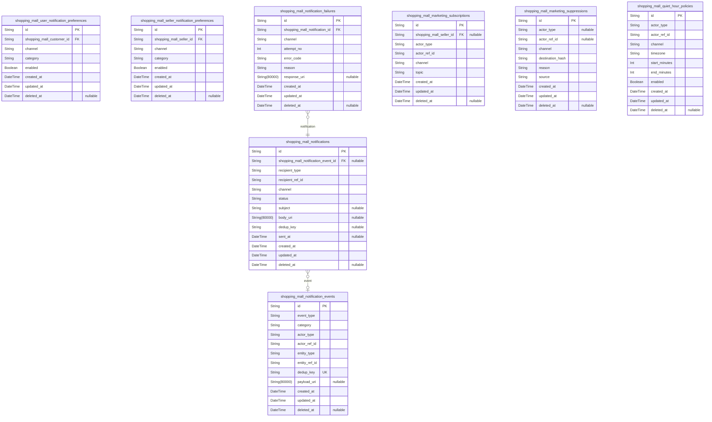
```mermaid
erDiagram
"shopping_mall_notification_events" {
  String id PK
  String event_type
  String category
  String actor_type
  String actor_ref_id
  String entity_type
  String entity_ref_id
  String dedup_key UK
  String(80000) payload_uri "nullable"
  DateTime created_at
  DateTime updated_at
  DateTime deleted_at "nullable"
}
"shopping_mall_notifications" {
  String id PK
  String shopping_mall_notification_event_id FK "nullable"
  String recipient_type
  String recipient_ref_id
  String channel
  String status
  String subject "nullable"
  String(80000) body_uri "nullable"
  String dedup_key "nullable"
  DateTime sent_at "nullable"
  DateTime created_at
  DateTime updated_at
  DateTime deleted_at "nullable"
}
"shopping_mall_user_notification_preferences" {
  String id PK
  String shopping_mall_customer_id FK
  String channel
  String category
  Boolean enabled
  DateTime created_at
  DateTime updated_at
  DateTime deleted_at "nullable"
}
"shopping_mall_seller_notification_preferences" {
  String id PK
  String shopping_mall_seller_id FK
  String channel
  String category
  Boolean enabled
  DateTime created_at
  DateTime updated_at
  DateTime deleted_at "nullable"
}
"shopping_mall_notification_failures" {
  String id PK
  String shopping_mall_notification_id FK
  String channel
  Int attempt_no
  String error_code
  String reason
  String(80000) response_uri "nullable"
  DateTime created_at
  DateTime updated_at
  DateTime deleted_at "nullable"
}
"shopping_mall_marketing_subscriptions" {
  String id PK
  String shopping_mall_seller_id FK "nullable"
  String actor_type
  String actor_ref_id
  String channel
  String topic
  DateTime created_at
  DateTime updated_at
  DateTime deleted_at "nullable"
}
"shopping_mall_marketing_suppressions" {
  String id PK
  String actor_type "nullable"
  String actor_ref_id "nullable"
  String channel
  String destination_hash
  String reason
  String source
  DateTime created_at
  DateTime updated_at
  DateTime deleted_at "nullable"
}
"shopping_mall_quiet_hour_policies" {
  String id PK
  String actor_type
  String actor_ref_id
  String channel
  String timezone
  Int start_minutes
  Int end_minutes
  Boolean enabled
  DateTime created_at
  DateTime updated_at
  DateTime deleted_at "nullable"
}
"shopping_mall_notifications" }o--o| "shopping_mall_notification_events" : event
"shopping_mall_notification_failures" }o--|| "shopping_mall_notifications" : notification
```

### `shopping_mall_notification_events`

Source business events that trigger notifications. Each record represents
a deduplicated, idempotent event captured from domain systems (orders,
shipments, payments, security). Notifications in {@link
shopping_mall_notifications} may be produced from a single event. Events
use actor_type/actor_ref_id and entity_type/entity_ref_id to reference
the originating actor and the business subject without polymorphic
nullable FKs.

Properties as follows:

- `id`: Primary Key.
- `event_type`
  > Canonical event type key (e.g., order_confirmed, shipment_shipped,
  > password_reset). Used for routing and templates.
- `category`
  > High-level category for analytics and routing (transactional, security,
  > operational).
- `actor_type`: Actor type that produced the event (customer, seller, admin, system).
- `actor_ref_id`
  > Identifier of the event actor within its actor_type. Stored as a UUID
  > reference without polymorphic FK.
- `entity_type`
  > Business subject entity type for the event (order, shipment, payout,
  > dispute, etc.).
- `entity_ref_id`: UUID of the subject entity instance referenced by entity_type.
- `dedup_key`
  > Idempotency key to prevent duplicate event ingestion across retries and
  > duplicate callbacks.
- `payload_uri`
  > Optional URI to a persisted payload snapshot (e.g., JSON blob) for audit
  > and replay.
- `created_at`: Creation timestamp.
- `updated_at`: Last update timestamp.
- `deleted_at`: Soft deletion timestamp for audit and recovery.

### `shopping_mall_notifications`

Deliverable notification instances generated from events in {@link
shopping_mall_notification_events} or created ad-hoc (e.g., compliance
alerts). Tracks recipient addressing, channel, lifecycle status, and
subject/body pointers. Failures are recorded in {@link
shopping_mall_notification_failures}.

Properties as follows:

- `id`: Primary Key.
- `shopping_mall_notification_event_id`
  > Origin event’s [shopping_mall_notification_events.id](#shopping_mall_notification_events). Optional for
  > ad-hoc notifications.
- `recipient_type`: Recipient actor type (customer, seller, admin, system).
- `recipient_ref_id`: UUID of the recipient within the specified recipient_type.
- `channel`: Delivery channel (email, sms, push, in_app).
- `status`: Notification lifecycle status (queued, sent, failed, suppressed).
- `subject`
  > Human‑readable subject or title for the notification, if applicable to
  > the channel.
- `body_uri`: Optional URI pointer to the rendered body or template snapshot for audit.
- `dedup_key`: Optional idempotency key at notification level, used for provider retries.
- `sent_at`: Timestamp when the notification was confirmed sent by the provider.
- `created_at`: Creation timestamp.
- `updated_at`: Last update timestamp.
- `deleted_at`: Soft deletion timestamp for audit and recovery.

### `shopping_mall_user_notification_preferences`

Per-customer notification preferences that control categories/channels of
notifications. Scopes to a single customer in {@link
shopping_mall_customers}.

Properties as follows:

- `id`: Primary Key.
- `shopping_mall_customer_id`: Owner customer’s [shopping_mall_customers.id](#shopping_mall_customers).
- `channel`: Channel for the preference (email, sms, push, in_app).
- `category`
  > Notification category (transactional, security, operational, or a
  > specific business category).
- `enabled`
  > Whether delivery is allowed for this (channel, category) pair for the
  > owner customer.
- `created_at`: Creation timestamp.
- `updated_at`: Last update timestamp.
- `deleted_at`: Soft deletion timestamp for audit and recovery.

### `shopping_mall_seller_notification_preferences`

Per-seller notification preferences controlling categories/channels for
the seller’s operational communications. Scopes to a single seller in
[shopping_mall_sellers](#shopping_mall_sellers).

Properties as follows:

- `id`: Primary Key.
- `shopping_mall_seller_id`: Owner seller’s [shopping_mall_sellers.id](#shopping_mall_sellers).
- `channel`: Channel for the preference (email, sms, push, in_app).
- `category`: Operational category (orders, shipments, returns, payouts, risk, etc.).
- `enabled`
  > Whether delivery is allowed for this (channel, category) pair for the
  > owner seller.
- `created_at`: Creation timestamp.
- `updated_at`: Last update timestamp.
- `deleted_at`: Soft deletion timestamp for audit and recovery.

### `shopping_mall_notification_failures`

Delivery failure attempts linked to [shopping_mall_notifications](#shopping_mall_notifications).
Stores provider error codes and reasons for retries, suppression, and
diagnostics.

Properties as follows:

- `id`: Primary Key.
- `shopping_mall_notification_id`: Failed notification’s [shopping_mall_notifications.id](#shopping_mall_notifications).
- `channel`: Channel used for the failed attempt.
- `attempt_no`: Attempt sequence number for the notification delivery.
- `error_code`: Provider or internal error code returned for the failure.
- `reason`
  > Human‑readable failure reason (e.g., bounce, blocked, invalid
  > destination, throttled).
- `response_uri`: Optional URI to a provider response snapshot useful for diagnostics.
- `created_at`: Failure recording timestamp (attempt time).
- `updated_at`: Last update timestamp.
- `deleted_at`: Soft deletion timestamp for audit and recovery.

### `shopping_mall_marketing_subscriptions`

Opt-in marketing subscriptions for actors across channels and topics
(e.g., general_offers, seller_promotions, back_in_stock, price_drop).
Uses actor_type + actor_ref_id for cross-actor ownership. Optionally
references a target seller in [shopping_mall_sellers](#shopping_mall_sellers) for
store‑specific promotions.

Properties as follows:

- `id`: Primary Key.
- `shopping_mall_seller_id`
  > Optional target seller’s [shopping_mall_sellers.id](#shopping_mall_sellers) when a
  > subscription is scoped to a store (e.g., following a seller’s
  > promotions).
- `actor_type`: Owner actor type (customer, seller, admin).
- `actor_ref_id`: UUID of the owner within the specified actor_type.
- `channel`: Marketing channel (email, sms, push, in_app).
- `topic`
  > Marketing topic (general_offers, seller_promotions, back_in_stock,
  > price_drop, etc.).
- `created_at`: Creation timestamp.
- `updated_at`: Last update timestamp.
- `deleted_at`: Soft deletion timestamp for audit and recovery.

### `shopping_mall_marketing_suppressions`

Suppression entries representing destinations or actors that must not
receive marketing (e.g., legal opt-out, bounces, complaints). May capture
hashed destinations to minimize PII exposure. Applies across channels and
may be scoped to an actor via actor_type/actor_ref_id.

Properties as follows:

- `id`: Primary Key.
- `actor_type`: Optional actor type if suppression is scoped to a known actor.
- `actor_ref_id`: Optional actor UUID when actor_type is specified.
- `channel`: Channel the suppression applies to (email, sms, push, in_app).
- `destination_hash`
  > Hash or canonical token of the destination (e.g., email/phone hash) used
  > for deduplication without storing raw PII.
- `reason`
  > Business reason for suppression (unsubscribe, bounce, complaint,
  > legal_hold, etc.).
- `source`
  > Origin of the suppression (user_unsubscribe, provider_bounce,
  > admin_action, policy).
- `created_at`: Creation timestamp.
- `updated_at`: Last update timestamp.
- `deleted_at`: Soft deletion timestamp for audit and recovery.

### `shopping_mall_quiet_hour_policies`

Quiet hours policy per actor and channel to defer non-urgent messaging
during a local time window. Uses actor_type + actor_ref_id for
polymorphic ownership without nullable multi-FKs.

Properties as follows:

- `id`: Primary Key.
- `actor_type`: Actor type to which the quiet hour applies (customer, seller, admin).
- `actor_ref_id`: Actor UUID the policy belongs to.
- `channel`: Channel constrained by the policy (email, sms, push, in_app).
- `timezone`: IANA timezone identifier for evaluating quiet hours (e.g., Asia/Seoul).
- `start_minutes`: Quiet period start minute of day in [0, 1439].
- `end_minutes`: Quiet period end minute of day in [0, 1439].
- `enabled`: Whether the policy is currently active.
- `created_at`: Creation timestamp.
- `updated_at`: Last update timestamp.
- `deleted_at`: Soft deletion timestamp for audit and recovery.

## Admin

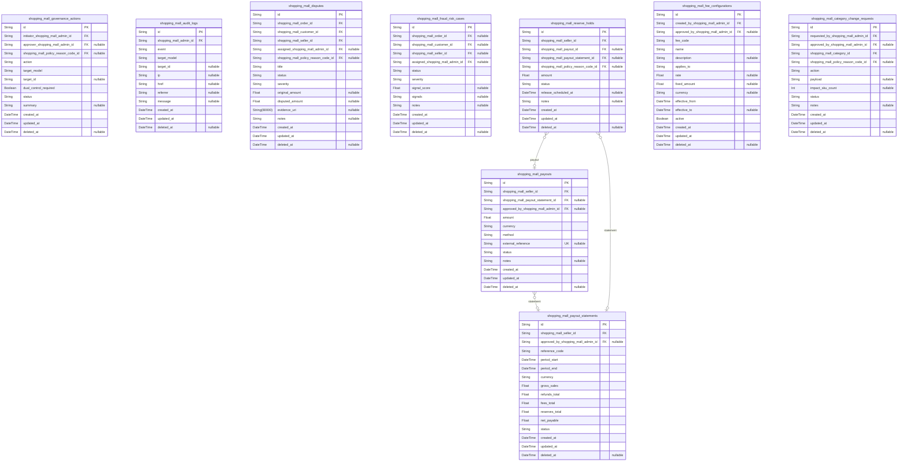
```mermaid
erDiagram
"shopping_mall_governance_actions" {
  String id PK
  String initiator_shopping_mall_admin_id FK
  String approver_shopping_mall_admin_id FK "nullable"
  String shopping_mall_policy_reason_code_id FK "nullable"
  String action
  String target_model
  String target_id "nullable"
  Boolean dual_control_required
  String status
  String summary "nullable"
  DateTime created_at
  DateTime updated_at
  DateTime deleted_at "nullable"
}
"shopping_mall_audit_logs" {
  String id PK
  String shopping_mall_admin_id FK
  String event
  String target_model
  String target_id "nullable"
  String ip "nullable"
  String href "nullable"
  String referrer "nullable"
  String message "nullable"
  DateTime created_at
  DateTime updated_at
  DateTime deleted_at "nullable"
}
"shopping_mall_disputes" {
  String id PK
  String shopping_mall_order_id FK
  String shopping_mall_customer_id FK
  String shopping_mall_seller_id FK
  String assigned_shopping_mall_admin_id FK "nullable"
  String shopping_mall_policy_reason_code_id FK "nullable"
  String title
  String status
  String severity
  Float original_amount "nullable"
  Float disputed_amount "nullable"
  String(80000) evidence_uri "nullable"
  String notes "nullable"
  DateTime created_at
  DateTime updated_at
  DateTime deleted_at "nullable"
}
"shopping_mall_fraud_risk_cases" {
  String id PK
  String shopping_mall_order_id FK "nullable"
  String shopping_mall_customer_id FK "nullable"
  String shopping_mall_seller_id FK "nullable"
  String assigned_shopping_mall_admin_id FK "nullable"
  String status
  String severity
  Float signal_score "nullable"
  String signals "nullable"
  String notes "nullable"
  DateTime created_at
  DateTime updated_at
  DateTime deleted_at "nullable"
}
"shopping_mall_payout_statements" {
  String id PK
  String shopping_mall_seller_id FK
  String approved_by_shopping_mall_admin_id FK "nullable"
  String reference_code
  DateTime period_start
  DateTime period_end
  String currency
  Float gross_sales
  Float refunds_total
  Float fees_total
  Float reserves_total
  Float net_payable
  String status
  DateTime created_at
  DateTime updated_at
  DateTime deleted_at "nullable"
}
"shopping_mall_payouts" {
  String id PK
  String shopping_mall_seller_id FK
  String shopping_mall_payout_statement_id FK "nullable"
  String approved_by_shopping_mall_admin_id FK "nullable"
  Float amount
  String currency
  String method
  String external_reference UK "nullable"
  String status
  String notes "nullable"
  DateTime created_at
  DateTime updated_at
  DateTime deleted_at "nullable"
}
"shopping_mall_reserve_holds" {
  String id PK
  String shopping_mall_seller_id FK
  String shopping_mall_payout_id FK "nullable"
  String shopping_mall_payout_statement_id FK "nullable"
  String shopping_mall_policy_reason_code_id FK "nullable"
  Float amount
  String status
  DateTime release_scheduled_at "nullable"
  String notes "nullable"
  DateTime created_at
  DateTime updated_at
  DateTime deleted_at "nullable"
}
"shopping_mall_fee_configurations" {
  String id PK
  String created_by_shopping_mall_admin_id FK
  String approved_by_shopping_mall_admin_id FK "nullable"
  String fee_code
  String name
  String description "nullable"
  String applies_to
  Float rate "nullable"
  Float fixed_amount "nullable"
  String currency "nullable"
  DateTime effective_from
  DateTime effective_to "nullable"
  Boolean active
  DateTime created_at
  DateTime updated_at
  DateTime deleted_at "nullable"
}
"shopping_mall_category_change_requests" {
  String id PK
  String requested_by_shopping_mall_admin_id FK
  String approved_by_shopping_mall_admin_id FK "nullable"
  String shopping_mall_category_id FK
  String shopping_mall_policy_reason_code_id FK "nullable"
  String action
  String payload "nullable"
  Int impact_sku_count "nullable"
  String status
  String notes "nullable"
  DateTime created_at
  DateTime updated_at
  DateTime deleted_at "nullable"
}
"shopping_mall_payouts" }o--o| "shopping_mall_payout_statements" : statement
"shopping_mall_reserve_holds" }o--o| "shopping_mall_payouts" : payout
"shopping_mall_reserve_holds" }o--o| "shopping_mall_payout_statements" : statement
```

### `shopping_mall_governance_actions`

Immutable record of sensitive governance operations requiring
auditability and potential dual-control (proposer/approver). Captures who
initiated and who approved, the business action, target entity context,
and policy reason mapping. Supports oversight and compliance for
platform-level changes by [shopping_mall_admins](#shopping_mall_admins).

Properties as follows:

- `id`: Primary Key.
- `initiator_shopping_mall_admin_id`: Admin who initiated the governance action. [shopping_mall_admins.id](#shopping_mall_admins)
- `approver_shopping_mall_admin_id`
  > Admin who approved the action when dual control applies. {@link
  > shopping_mall_admins.id}
- `shopping_mall_policy_reason_code_id`
  > Optional mapped policy reason code associated with the action. {@link
  > shopping_mall_policy_reason_codes.id}
- `action`
  > Canonical action identifier (e.g., suspend_seller, change_fee,
  > mass_category_move).
- `target_model`
  > Logical model/table name of the target entity (e.g.,
  > shopping_mall_sellers, shopping_mall_categories).
- `target_id`: Target entity identifier when applicable.
- `dual_control_required`: Whether the action required dual-control approval.
- `status`: Execution status of the action (e.g., executed, rejected, reverted).
- `summary`: Human-readable summary for quick audit review.
- `created_at`: Creation timestamp.
- `updated_at`: Last update timestamp.
- `deleted_at`: Soft deletion timestamp if ever logically removed from views.

### `shopping_mall_audit_logs`

System-wide administrative audit trail for actions performed by platform
admins. Focused on administrative scope (not customer/seller content),
capturing actor, context, and narrative suitable for compliance.
Complements [shopping_mall_governance_actions](#shopping_mall_governance_actions).

Properties as follows:

- `id`: Primary Key.
- `shopping_mall_admin_id`: Admin who performed the action. [shopping_mall_admins.id](#shopping_mall_admins)
- `event`
  > Canonical event key (e.g., role_assigned, payout_hold_applied,
  > category_change_approved).
- `target_model`: Logical model/table name of the affected entity.
- `target_id`: Affected entity identifier when applicable.
- `ip`: Origin IP address captured at the time of the action.
- `href`: Request URL at the time of action.
- `referrer`: Referrer URL when available.
- `message`: Free-form message or structured JSON string summarizing the audit context.
- `created_at`: Creation timestamp.
- `updated_at`
  > Last update timestamp (rarely used for immutable logs; preserved for
  > consistency).
- `deleted_at`: Soft deletion timestamp (not expected to be used in practice).

### `shopping_mall_disputes`

Administrative dispute/chargeback cases linked to orders with
participation by customer and seller. Managed by admins with lifecycle
states and policy reasons. Interfaces with payment resolution and refunds
externally. Related to [shopping_mall_orders](#shopping_mall_orders), {@link
shopping_mall_customers}, [shopping_mall_sellers](#shopping_mall_sellers), and admins in
[shopping_mall_admins](#shopping_mall_admins).

Properties as follows:

- `id`: Primary Key.
- `shopping_mall_order_id`: Related order under dispute. [shopping_mall_orders.id](#shopping_mall_orders)
- `shopping_mall_customer_id`: Customer party to the dispute. [shopping_mall_customers.id](#shopping_mall_customers)
- `shopping_mall_seller_id`: Seller party to the dispute. [shopping_mall_sellers.id](#shopping_mall_sellers)
- `assigned_shopping_mall_admin_id`
  > Admin currently assigned to handle the case. {@link
  > shopping_mall_admins.id}
- `shopping_mall_policy_reason_code_id`
  > Standardized dispute reason code. {@link
  > shopping_mall_policy_reason_codes.id}
- `title`: Short human-readable title summarizing the dispute.
- `status`
  > Current status (e.g., open, awaiting_seller, awaiting_customer,
  > resolved_customer, resolved_seller, refunded, rejected).
- `severity`: Business severity classification (e.g., low, medium, high).
- `original_amount`: Original order amount involved (snapshot at case creation).
- `disputed_amount`: Amount being disputed (snapshot).
- `evidence_uri`: Optional link to external evidence bundle.
- `notes`: Internal notes or structured JSON string with details and timeline.
- `created_at`: Creation timestamp.
- `updated_at`: Last update timestamp.
- `deleted_at`: Soft deletion timestamp.

### `shopping_mall_fraud_risk_cases`

Fraud and risk investigation cases generated from risk signals, payment
anomalies, or policy violations. Cases can be tied to orders, customers,
and/or sellers, with an assigned admin owner. Coordinates holds and
verification requests. Interfaces with [shopping_mall_orders](#shopping_mall_orders),
[shopping_mall_customers](#shopping_mall_customers), [shopping_mall_sellers](#shopping_mall_sellers), and
[shopping_mall_admins](#shopping_mall_admins).

Properties as follows:

- `id`: Primary Key.
- `shopping_mall_order_id`
  > Associated order that triggered risk signals. {@link
  > shopping_mall_orders.id}
- `shopping_mall_customer_id`
  > Customer involved in the case when applicable. {@link
  > shopping_mall_customers.id}
- `shopping_mall_seller_id`
  > Seller involved in the case when applicable. {@link
  > shopping_mall_sellers.id}
- `assigned_shopping_mall_admin_id`: Admin assigned to the risk case. [shopping_mall_admins.id](#shopping_mall_admins)
- `status`
  > Case status (e.g., open, info_requested, on_hold, cleared,
  > confirmed_fraud, closed).
- `severity`: Risk severity classification (e.g., low, medium, high, critical).
- `signal_score`: Numeric score representing risk signal strength at intake.
- `signals`
  > Structured JSON string summarizing signals and heuristics used for the
  > decision.
- `notes`: Investigation notes and decision rationale.
- `created_at`: Creation timestamp.
- `updated_at`: Last update timestamp.
- `deleted_at`: Soft deletion timestamp.

### `shopping_mall_payout_statements`

Periodic seller statements summarizing sales, fees, refunds, reserves,
and net payable for a cycle. Acts as the authoritative financial snapshot
for payouts and reserves management. Tied to {@link
shopping_mall_sellers} and referenced by [shopping_mall_payouts](#shopping_mall_payouts)
and [shopping_mall_reserve_holds](#shopping_mall_reserve_holds).

Properties as follows:

- `id`: Primary Key.
- `shopping_mall_seller_id`
  > Seller for whom the statement is generated. {@link
  > shopping_mall_sellers.id}
- `approved_by_shopping_mall_admin_id`
  > Admin who approved the statement if applicable. {@link
  > shopping_mall_admins.id}
- `reference_code`
  > Human-readable reference code of the statement period (e.g.,
  > 2025-W44-KST).
- `period_start`: Inclusive period start timestamp.
- `period_end`: Inclusive period end timestamp.
- `currency`: Currency code used for the statement (e.g., KRW, USD).
- `gross_sales`: Gross sales total recorded in the statement period.
- `refunds_total`: Total refunds recorded in the period.
- `fees_total`: Total platform and processing fees charged in the period.
- `reserves_total`: Total amount placed into reserves/holds in the period.
- `net_payable`
  > Net amount payable to seller for the period (gross − refunds − fees −
  > reserves).
- `status`: Statement status (e.g., draft, approved, closed, paid, on_hold).
- `created_at`: Creation timestamp.
- `updated_at`: Last update timestamp.
- `deleted_at`: Soft deletion timestamp.

### `shopping_mall_payouts`

Individual payout transactions to sellers. May reference a {@link
shopping_mall_payout_statements} for context. Tracks lifecycle
(scheduled, in_process, completed, on_hold) and external reconciliation
references. Supports governance via admin approvals.

Properties as follows:

- `id`: Primary Key.
- `shopping_mall_seller_id`: Seller receiving the payout. [shopping_mall_sellers.id](#shopping_mall_sellers)
- `shopping_mall_payout_statement_id`
  > Statement from which this payout originates, when applicable. {@link
  > shopping_mall_payout_statements.id}
- `approved_by_shopping_mall_admin_id`
  > Admin who approved this payout if applicable. {@link
  > shopping_mall_admins.id}
- `amount`: Payout amount in statement currency.
- `currency`: Currency code of the payout.
- `method`: Payout method descriptor (e.g., bank_transfer, wallet, manual_adjustment).
- `external_reference`: External payment provider reference for reconciliation.
- `status`: Payout status (e.g., scheduled, in_process, completed, on_hold, failed).
- `notes`: Optional payout notes or reconciliation memos.
- `created_at`: Creation timestamp.
- `updated_at`: Last update timestamp.
- `deleted_at`: Soft deletion timestamp.

### `shopping_mall_reserve_holds`

Reserve holds applied to seller funds to mitigate risk or pending
disputes. May be linked to a [shopping_mall_payouts](#shopping_mall_payouts) or {@link
shopping_mall_payout_statements}. Includes policy reasons, amounts, and
release schedule/status for governance and compliance.

Properties as follows:

- `id`: Primary Key.
- `shopping_mall_seller_id`: Seller whose funds are held. [shopping_mall_sellers.id](#shopping_mall_sellers)
- `shopping_mall_payout_id`
  > Related payout record if the hold applies to a specific payout. {@link
  > shopping_mall_payouts.id}
- `shopping_mall_payout_statement_id`
  > Related payout statement record if the hold is statement-scoped. {@link
  > shopping_mall_payout_statements.id}
- `shopping_mall_policy_reason_code_id`: Reason code backing the hold. [shopping_mall_policy_reason_codes.id](#shopping_mall_policy_reason_codes)
- `amount`: Amount held in the statement/payout currency.
- `status`: Hold status (e.g., active, partially_released, released, canceled).
- `release_scheduled_at`: Scheduled release time when applicable.
- `notes`: Administrative notes or structured JSON details.
- `created_at`: Creation timestamp.
- `updated_at`: Last update timestamp.
- `deleted_at`: Soft deletion timestamp.

### `shopping_mall_fee_configurations`

Platform fee configuration catalog with effective-dated records. Supports
multiple fee types (rate-based or fixed), applicable scopes, and
governance approvals. Admin-created and approved via {@link
shopping_mall_admins}.

Properties as follows:

- `id`: Primary Key.
- `created_by_shopping_mall_admin_id`: Admin who created the fee configuration. [shopping_mall_admins.id](#shopping_mall_admins)
- `approved_by_shopping_mall_admin_id`
  > Admin who approved the fee configuration if approval workflow applies.
  > [shopping_mall_admins.id](#shopping_mall_admins)
- `fee_code`
  > Stable fee code identifier (e.g., platform_commission,
  > payment_processing, dispute_fee).
- `name`: Human-readable fee name.
- `description`: Detailed description and business rules for the fee.
- `applies_to`: Application scope (e.g., order, refund, payout, dispute).
- `rate`: Percentage rate (0–1) when rate-based; nullable when not used.
- `fixed_amount`: Fixed amount when applicable; nullable when not used.
- `currency`: Currency for fixed_amount where applicable.
- `effective_from`: Effective start timestamp (inclusive).
- `effective_to`: Effective end timestamp (exclusive) when scheduled to end.
- `active`
  > Whether this configuration is currently active within its effective
  > window.
- `created_at`: Creation timestamp.
- `updated_at`: Last update timestamp.
- `deleted_at`: Soft deletion timestamp.

### `shopping_mall_category_change_requests`

Admin-governed requests for category taxonomy changes (move, rename,
merge). Includes proposer/approver, target category, impact analysis, and
status. Aligns with governance and audit rules and references {@link
shopping_mall_categories} and [shopping_mall_admins](#shopping_mall_admins).

Properties as follows:

- `id`: Primary Key.
- `requested_by_shopping_mall_admin_id`: Admin who proposed the change. [shopping_mall_admins.id](#shopping_mall_admins)
- `approved_by_shopping_mall_admin_id`
  > Admin who approved the change when applicable. {@link
  > shopping_mall_admins.id}
- `shopping_mall_category_id`
  > Target category affected by this request. {@link
  > shopping_mall_categories.id}
- `shopping_mall_policy_reason_code_id`
  > Optional policy reason used to justify the change. {@link
  > shopping_mall_policy_reason_codes.id}
- `action`: Requested action type (e.g., move, rename, merge, split).
- `payload`
  > Structured JSON string with parameters (e.g., new parent category, new
  > name, merge target list).
- `impact_sku_count`: Estimated number of SKUs impacted per assessment.
- `status`
  > Request status (e.g., draft, pending_approval, approved, rejected,
  > applied, rolled_back).
- `notes`: Additional notes or justification context.
- `created_at`: Creation timestamp.
- `updated_at`: Last update timestamp.
- `deleted_at`: Soft deletion timestamp.
