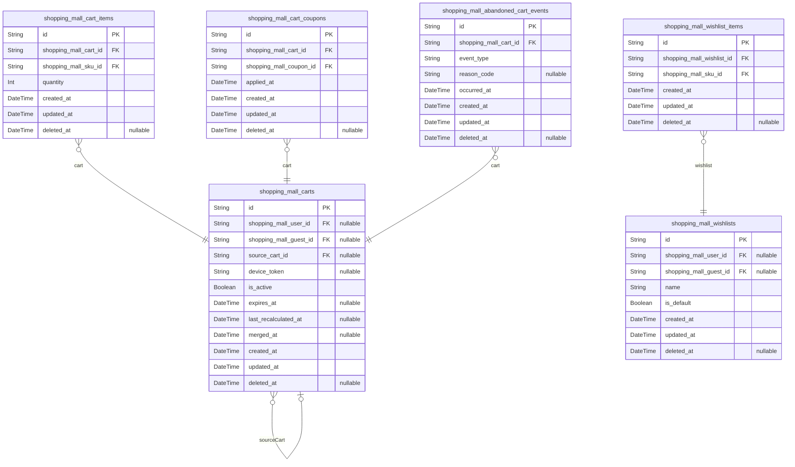

# Prisma Markdown

> Generated by [`prisma-markdown`](https://github.com/samchon/prisma-markdown)

- [Systematic](#systematic)
- [Actors](#actors)
- [Catalog](#catalog)
- [Variants](#variants)
- [Coupons](#coupons)
- [Carts](#carts)
- [Orders](#orders)
- [Payments](#payments)
- [Shipping](#shipping)
- [Reviews](#reviews)
- [Returns](#returns)
- [Sellers](#sellers)
- [Finance](#finance)
- [Inquiries](#inquiries)
- [Admin](#admin)
- [default](#default)

## Systematic

### `shopping_mall_configurations`

Key-value configuration registry for platform-wide settings. Each record
represents a single configuration entry optionally scoped to an
environment or region. Consumed by various services for feature behavior,
thresholds, and defaults. Managed by administrators with audit through
timestamps. No denormalized data; values stored as raw strings with
optional description for operator clarity.

Properties as follows:

- `id`: Primary Key.
- `key`
  > Business configuration key identifier. Unique within an optional scope to
  > prevent collisions across environments or regions.
- `value`
  > Raw configuration value stored as string; interpretation is handled by
  > application (e.g., JSON string, numeric string, boolean string).
- `scope`
  > Optional scope label to partition configurations by environment (e.g.,
  > prod, staging) or region (e.g., KR, US).
- `description`
  > Human-readable explanation of the configuration’s purpose and acceptable
  > values.
- `created_at`: Creation timestamp for the configuration entry.
- `updated_at`: Last update timestamp for the configuration entry.
- `deleted_at`: Soft deletion timestamp for recoverability; null when active.

### `shopping_mall_feature_flags`

Feature flag registry controlling conditional behaviors and progressive
rollouts. Flags can be toggled, scheduled with effective windows, and
optionally ramped by percentage. Used by application services to gate
features and experiments. Managed by operations/admin teams.

Properties as follows:

- `id`: Primary Key.
- `code`: Unique code identifier for the feature flag (e.g., checkout_risk_hold_v2).
- `name`: Human-friendly flag name for console display and search.
- `description`: Operator-facing description of the flag’s purpose and scope.
- `enabled`
  > Whether the flag is globally enabled (subject to optional schedule and
  > rollout settings).
- `rollout_percentage`
  > Optional progressive rollout percentage (0–100). When null, no
  > percentage-based rollout applies.
- `segment`
  > Optional audience or segment key used by application to target subsets
  > (e.g., locale=ko-KR, seller_tier=gold). Purely informational here.
- `starts_at`: Optional start datetime for when the flag becomes effective.
- `ends_at`: Optional end datetime after which the flag is no longer effective.
- `created_at`: Creation timestamp for the feature flag record.
- `updated_at`: Last update timestamp for the feature flag record.
- `deleted_at`: Soft deletion timestamp; null when active.

### `shopping_mall_policies`

Top-level policy definitions governing business behaviors (e.g., returns,
cancellations, pricing floors). This table represents the policy
container and metadata. Concrete business rules and effective-dated terms
are captured in [shopping_mall_policy_versions](#shopping_mall_policy_versions).

Properties as follows:

- `id`: Primary Key.
- `code`
  > Unique human-readable policy code (e.g., RETURNS_GENERAL,
  > REFUND_HIGH_VALUE).
- `title`: Policy title for administrative display and search.
- `category`
  > High-level grouping (e.g., returns, refunds, payouts, catalog,
  > moderation).
- `status`: Lifecycle state of the policy (e.g., draft, active, retired).
- `description`
  > Optional summary describing policy intent and scope (detailed terms live
  > in versions).
- `created_at`: Creation timestamp for the policy container.
- `updated_at`: Last update timestamp for the policy container.
- `deleted_at`: Soft deletion timestamp; null when active.

### `shopping_mall_policy_versions`

Effective-dated, append-only snapshots of policy content for audit and
grandfathering. Each version belongs to a [shopping_mall_policies](#shopping_mall_policies)
record, carries a semantic version label, effective window, and change
notes. Serves as the historical source of truth for policy evaluations at
a given time.

Properties as follows:

- `id`: Primary Key.
- `shopping_mall_policy_id`: Parent policy reference. Target model's [shopping_mall_policies.id](#shopping_mall_policies).
- `version`: Semantic or sequential version label (e.g., 1.0.0, 2025-01).
- `effective_from`: Start datetime when this policy version becomes effective.
- `effective_to`
  > Optional end datetime after which the version is no longer effective
  > (open-ended when null).
- `change_notes`: Summary of changes for operators and auditors.
- `approved`
  > Whether this version is approved through maker-checker or equivalent
  > governance.
- `created_at`: Creation timestamp for the policy version record.
- `updated_at`: Last update timestamp for the policy version record.
- `deleted_at`: Soft deletion timestamp; null when active.

### `shopping_mall_locales`

Locale registry of supported languages/regions for the platform. Provides
BCP 47-style codes with activation flags. Used by frontends and
notifications to determine formatting and language fallback logic.

Properties as follows:

- `id`: Primary Key.
- `code`
  > Unique locale code (e.g., en-US, ko-KR) used across services for
  > localization.
- `name`
  > English display name of the locale (e.g., English (United States), Korean
  > (Korea)).
- `native_name`
  > Locale’s self-referential name in its own language/script (e.g.,
  > 한국어(대한민국)).
- `rtl`: Whether the locale is right-to-left (true) or left-to-right (false).
- `active`: Whether the locale is currently enabled for use in the platform.
- `created_at`: Creation timestamp for the locale record.
- `updated_at`: Last update timestamp for the locale record.
- `deleted_at`: Soft deletion timestamp; null when active.

## Actors

```mermaid
erDiagram
"shopping_mall_users" {
  String id PK
  String email UK
  String password_hash
  Boolean email_verified
  DateTime verified_at "nullable"
  Boolean mfa_enabled
  String mfa_method "nullable"
  String mfa_secret_encrypted "nullable"
  String mfa_backup_codes_encrypted "nullable"
  DateTime password_changed_at "nullable"
  String status
  String name "nullable"
  String nickname "nullable"
  String phone "nullable"
  DateTime last_login_at "nullable"
  DateTime lockout_until "nullable"
  DateTime created_at
  DateTime updated_at
  DateTime deleted_at "nullable"
}
"shopping_mall_user_sessions" {
  String id PK
  String shopping_mall_user_id FK
  String refresh_token_hash UK
  String user_agent "nullable"
  String ip "nullable"
  DateTime expires_at
  DateTime revoked_at "nullable"
  DateTime last_accessed_at "nullable"
  DateTime created_at
  DateTime updated_at
}
"shopping_mall_user_addresses" {
  String id PK
  String shopping_mall_user_id FK
  String type
  String recipient
  String phone
  String country
  String region "nullable"
  String city
  String postal_code
  String address_line1
  String address_line2 "nullable"
  Boolean default_shipping
  Boolean default_billing
  Boolean serviceable
  Boolean verified
  DateTime validated_at "nullable"
  DateTime last_used_at "nullable"
  DateTime created_at
  DateTime updated_at
  DateTime deleted_at "nullable"
}
"shopping_mall_consents" {
  String id PK
  String shopping_mall_user_id FK
  String scope
  Boolean granted
  DateTime granted_at "nullable"
  DateTime revoked_at "nullable"
  DateTime created_at
  DateTime updated_at
}
"shopping_mall_user_security_events" {
  String id PK
  String shopping_mall_user_id FK
  String shopping_mall_user_session_id FK "nullable"
  String event_type
  String reason "nullable"
  String ip "nullable"
  String user_agent "nullable"
  DateTime occurred_at
  DateTime created_at
}
"shopping_mall_guest" {
  String id PK
  String shopping_mall_user_id FK,UK
  String granted_by_user_id FK "nullable"
  DateTime assigned_at
  DateTime revoked_at "nullable"
  String reason "nullable"
  DateTime created_at
  DateTime updated_at
}
"shopping_mall_customer" {
  String id PK
  String shopping_mall_user_id FK,UK
  String granted_by_user_id FK "nullable"
  DateTime assigned_at
  DateTime revoked_at "nullable"
  String reason "nullable"
  DateTime created_at
  DateTime updated_at
}
"shopping_mall_seller" {
  String id PK
  String shopping_mall_user_id FK,UK
  String granted_by_user_id FK "nullable"
  DateTime assigned_at
  DateTime revoked_at "nullable"
  String reason "nullable"
  DateTime created_at
  DateTime updated_at
}
"shopping_mall_supportagent" {
  String id PK
  String shopping_mall_user_id FK,UK
  String granted_by_user_id FK "nullable"
  DateTime assigned_at
  DateTime revoked_at "nullable"
  String reason "nullable"
  DateTime created_at
  DateTime updated_at
}
"shopping_mall_operationsmanager" {
  String id PK
  String shopping_mall_user_id FK,UK
  String granted_by_user_id FK "nullable"
  DateTime assigned_at
  DateTime revoked_at "nullable"
  String reason "nullable"
  DateTime created_at
  DateTime updated_at
}
"shopping_mall_financemanager" {
  String id PK
  String shopping_mall_user_id FK,UK
  String granted_by_user_id FK "nullable"
  DateTime assigned_at
  DateTime revoked_at "nullable"
  String reason "nullable"
  DateTime created_at
  DateTime updated_at
}
"shopping_mall_contentmoderator" {
  String id PK
  String shopping_mall_user_id FK,UK
  String granted_by_user_id FK "nullable"
  DateTime assigned_at
  DateTime revoked_at "nullable"
  String reason "nullable"
  DateTime created_at
  DateTime updated_at
}
"shopping_mall_systemadmin" {
  String id PK
  String shopping_mall_user_id FK,UK
  String granted_by_user_id FK "nullable"
  DateTime assigned_at
  DateTime revoked_at "nullable"
  String reason "nullable"
  DateTime created_at
  DateTime updated_at
}
"shopping_mall_user_sessions" }o--|| "shopping_mall_users" : user
"shopping_mall_user_addresses" }o--|| "shopping_mall_users" : user
"shopping_mall_consents" }o--|| "shopping_mall_users" : user
"shopping_mall_user_security_events" }o--|| "shopping_mall_users" : user
"shopping_mall_user_security_events" }o--o| "shopping_mall_user_sessions" : session
"shopping_mall_guest" |o--|| "shopping_mall_users" : user
"shopping_mall_guest" }o--o| "shopping_mall_users" : grantedBy
"shopping_mall_customer" |o--|| "shopping_mall_users" : user
"shopping_mall_customer" }o--o| "shopping_mall_users" : grantedBy
"shopping_mall_seller" |o--|| "shopping_mall_users" : user
"shopping_mall_seller" }o--o| "shopping_mall_users" : grantedBy
"shopping_mall_supportagent" |o--|| "shopping_mall_users" : user
"shopping_mall_supportagent" }o--o| "shopping_mall_users" : grantedBy
"shopping_mall_operationsmanager" |o--|| "shopping_mall_users" : user
"shopping_mall_operationsmanager" }o--o| "shopping_mall_users" : grantedBy
"shopping_mall_financemanager" |o--|| "shopping_mall_users" : user
"shopping_mall_financemanager" }o--o| "shopping_mall_users" : grantedBy
"shopping_mall_contentmoderator" |o--|| "shopping_mall_users" : user
"shopping_mall_contentmoderator" }o--o| "shopping_mall_users" : grantedBy
"shopping_mall_systemadmin" |o--|| "shopping_mall_users" : user
"shopping_mall_systemadmin" }o--o| "shopping_mall_users" : grantedBy
```

### `shopping_mall_users`

Platform user identities for all roles (guests who registered, customers,
sellers, and staff). Holds login credentials, verification state, account
status, and basic profile attributes. Other models link here: {@link
shopping_mall_user_sessions}, [shopping_mall_user_addresses](#shopping_mall_user_addresses),
[shopping_mall_consents](#shopping_mall_consents), {@link
shopping_mall_user_security_events}, and all role-assignment tables
(e.g., [shopping_mall_customer](#shopping_mall_customer)). This version adds secure MFA
artifacts and a password change timestamp to support token revocation and
2FA requirements.

Properties as follows:

- `id`: Primary Key.
- `email`
  > Unique email address used for login and notifications. Must be verified
  > before checkout or review actions.
- `password_hash`
  > BCrypt/Argon2 hash of the user's password. Plaintext passwords are never
  > stored.
- `email_verified`: Whether the email address has been verified.
- `verified_at`: Timestamp when the account's email verification completed.
- `mfa_enabled`: Whether multi-factor authentication is enabled for this user.
- `mfa_method`
  > Preferred 2FA method when multi-factor is enabled (e.g., totp, sms,
  > webauthn).
- `mfa_secret_encrypted`
  > Encrypted TOTP/credential secret material used for MFA; never stored in
  > plaintext. Encryption/at-rest protection required.
- `mfa_backup_codes_encrypted`
  > Encrypted/hashed bundle of backup codes for MFA recovery; rotated on use
  > and never stored in plaintext.
- `password_changed_at`
  > Timestamp of the last successful password change, used to invalidate
  > refresh tokens and enforce re-authentication per policy.
- `status`
  > Administrative/account lifecycle status (e.g., active, suspended,
  > terminated).
- `name`: Full name as provided by the user for display and fulfillment contexts.
- `nickname`: Optional nickname/handle used in certain UI contexts.
- `phone`: Optional phone number for contact and risk checks.
- `last_login_at`: Last successful interactive authentication timestamp.
- `lockout_until`: If set, the account is locked until this time due to policy/risk controls.
- `created_at`: Creation timestamp in UTC.
- `updated_at`: Last update timestamp in UTC.
- `deleted_at`
  > Soft deletion timestamp if the account is deactivated for
  > recovery/compliance.

### `shopping_mall_user_sessions`

Authentication sessions/refresh tokens for users. Each record represents
a logical session with expiry, device metadata, and revocation state.
Belongs to [shopping_mall_users](#shopping_mall_users).

Properties as follows:

- `id`: Primary Key.
- `shopping_mall_user_id`: Owner user's [shopping_mall_users.id](#shopping_mall_users).
- `refresh_token_hash`: Hash of the refresh token for secure verification and revocation.
- `user_agent`: Client user agent string captured at session creation.
- `ip`: IP address (string) observed for this session.
- `expires_at`: When this session/refresh token expires.
- `revoked_at`: When this session was revoked (if applicable).
- `last_accessed_at`: Most recent activity timestamp used for security analysis.
- `created_at`: Creation timestamp in UTC.
- `updated_at`: Last update timestamp in UTC.

### `shopping_mall_user_addresses`

Customer-managed delivery/billing addresses. Validates serviceability and
supports default shipping/billing flags per user. Belongs to {@link
shopping_mall_users}.

Properties as follows:

- `id`: Primary Key.
- `shopping_mall_user_id`: Owner user's [shopping_mall_users.id](#shopping_mall_users).
- `type`: Address type: Shipping or Billing (business-enforced).
- `recipient`: Recipient full name.
- `phone`: Contact phone number for delivery coordination.
- `country`: ISO country name/code string as stored by business rules.
- `region`: Region/State/Province where applicable.
- `city`: City/Locality.
- `postal_code`: Postal/ZIP code as applicable.
- `address_line1`: Primary street address or road name.
- `address_line2`: Secondary address info (building, unit).
- `default_shipping`
  > Whether this is the default shipping address for the user. Only one
  > should be true per user by policy.
- `default_billing`
  > Whether this is the default billing address for the user. Only one should
  > be true per user by policy.
- `serviceable`
  > Whether platform/carriers can service this address given policy and
  > region constraints.
- `verified`: Whether this address passed validation checks.
- `validated_at`: Timestamp when the address was last validated.
- `last_used_at`: Timestamp when this address was last used in an order/checkout flow.
- `created_at`: Creation timestamp in UTC.
- `updated_at`: Last update timestamp in UTC.
- `deleted_at`: Soft deletion timestamp when an address is removed from active use.

### `shopping_mall_consents`

Consent records per user for marketing/personalization and other
regulated communications. Enforces single current record per (user,
scope). Belongs to [shopping_mall_users](#shopping_mall_users).

Properties as follows:

- `id`: Primary Key.
- `shopping_mall_user_id`: Owner user's [shopping_mall_users.id](#shopping_mall_users).
- `scope`: Consent scope identifier (e.g., marketing_email, sms, personalization).
- `granted`: Whether consent is currently granted for the scope.
- `granted_at`: When consent was granted.
- `revoked_at`: When consent was revoked.
- `created_at`: Creation timestamp in UTC.
- `updated_at`: Last update timestamp in UTC.

### `shopping_mall_user_security_events`

Append-only security/audit events for identity lifecycle (login
success/failure, password reset, 2FA, token revocations). References
[shopping_mall_users](#shopping_mall_users) and optionally {@link
shopping_mall_user_sessions}. Used for investigations and compliance
audits.

Properties as follows:

- `id`: Primary Key.
- `shopping_mall_user_id`: Subject user's [shopping_mall_users.id](#shopping_mall_users).
- `shopping_mall_user_session_id`: Related session's [shopping_mall_user_sessions.id](#shopping_mall_user_sessions) when applicable.
- `event_type`
  > Event kind (e.g., login_success, login_failure, password_changed,
  > mfa_challenge, token_revoked).
- `reason`: Optional human-readable reason or category code for the event.
- `ip`: Observed IP address at time of event.
- `user_agent`: Observed user agent at time of event.
- `occurred_at`: Business time the event occurred.
- `created_at`: Ingestion time the event was recorded.

### `shopping_mall_guest`

Role-assignment table marking a [shopping_mall_users](#shopping_mall_users) identity as
guest-kind (limited capabilities). Usually transient and auto-upgraded
upon registration. 1:1 with user.

Properties as follows:

- `id`: Primary Key.
- `shopping_mall_user_id`: Assigned user's [shopping_mall_users.id](#shopping_mall_users).
- `granted_by_user_id`
  > Optional staff actor's [shopping_mall_users.id](#shopping_mall_users) who granted the
  > role.
- `assigned_at`: When this role was granted.
- `revoked_at`: When this role was revoked.
- `reason`: Reason text or code for assignment/revocation.
- `created_at`: Creation timestamp in UTC.
- `updated_at`: Last update timestamp in UTC.

### `shopping_mall_customer`

Role-assignment table indicating a [shopping_mall_users](#shopping_mall_users) identity
has customer capabilities. 1:1 with user. Used for query scoping like
"find all customers" via role presence.

Properties as follows:

- `id`: Primary Key.
- `shopping_mall_user_id`: Assigned user's [shopping_mall_users.id](#shopping_mall_users).
- `granted_by_user_id`
  > Optional staff actor's [shopping_mall_users.id](#shopping_mall_users) who granted the
  > role.
- `assigned_at`: When this role was granted.
- `revoked_at`: When this role was revoked.
- `reason`: Reason text or code for assignment/revocation.
- `created_at`: Creation timestamp in UTC.
- `updated_at`: Last update timestamp in UTC.

### `shopping_mall_seller`

Role-assignment table indicating a [shopping_mall_users](#shopping_mall_users) identity
has seller capabilities. This table does not duplicate seller business
entities; it only flags the role assignment and lifecycle. 1:1 with user.

Properties as follows:

- `id`: Primary Key.
- `shopping_mall_user_id`: Assigned user's [shopping_mall_users.id](#shopping_mall_users).
- `granted_by_user_id`
  > Optional staff actor's [shopping_mall_users.id](#shopping_mall_users) who granted the
  > role.
- `assigned_at`: When this role was granted.
- `revoked_at`: When this role was revoked.
- `reason`: Reason text or code for assignment/revocation.
- `created_at`: Creation timestamp in UTC.
- `updated_at`: Last update timestamp in UTC.

### `shopping_mall_supportagent`

Role-assignment table indicating a [shopping_mall_users](#shopping_mall_users) identity
has support agent capabilities within policy thresholds. 1:1 with user
and governed by audit controls.

Properties as follows:

- `id`: Primary Key.
- `shopping_mall_user_id`: Assigned user's [shopping_mall_users.id](#shopping_mall_users).
- `granted_by_user_id`
  > Optional staff actor's [shopping_mall_users.id](#shopping_mall_users) who granted the
  > role.
- `assigned_at`: When this role was granted.
- `revoked_at`: When this role was revoked.
- `reason`: Reason text or code for assignment/revocation.
- `created_at`: Creation timestamp in UTC.
- `updated_at`: Last update timestamp in UTC.

### `shopping_mall_operationsmanager`

Role-assignment table indicating a [shopping_mall_users](#shopping_mall_users) identity
has operations manager capabilities for catalog/policy governance. 1:1
with user and governed by maker-checker policy.

Properties as follows:

- `id`: Primary Key.
- `shopping_mall_user_id`: Assigned user's [shopping_mall_users.id](#shopping_mall_users).
- `granted_by_user_id`
  > Optional staff actor's [shopping_mall_users.id](#shopping_mall_users) who granted the
  > role.
- `assigned_at`: When this role was granted.
- `revoked_at`: When this role was revoked.
- `reason`: Reason text or code for assignment/revocation.
- `created_at`: Creation timestamp in UTC.
- `updated_at`: Last update timestamp in UTC.

### `shopping_mall_financemanager`

Role-assignment table indicating a [shopping_mall_users](#shopping_mall_users) identity
has finance manager capabilities for refunds, payouts, and reconciliation
governance. 1:1 with user and governed by maker-checker policy.

Properties as follows:

- `id`: Primary Key.
- `shopping_mall_user_id`: Assigned user's [shopping_mall_users.id](#shopping_mall_users).
- `granted_by_user_id`
  > Optional staff actor's [shopping_mall_users.id](#shopping_mall_users) who granted the
  > role.
- `assigned_at`: When this role was granted.
- `revoked_at`: When this role was revoked.
- `reason`: Reason text or code for assignment/revocation.
- `created_at`: Creation timestamp in UTC.
- `updated_at`: Last update timestamp in UTC.

### `shopping_mall_contentmoderator`

Role-assignment table indicating a [shopping_mall_users](#shopping_mall_users) identity
has content moderation capabilities. 1:1 with user and fully audited.

Properties as follows:

- `id`: Primary Key.
- `shopping_mall_user_id`: Assigned user's [shopping_mall_users.id](#shopping_mall_users).
- `granted_by_user_id`
  > Optional staff actor's [shopping_mall_users.id](#shopping_mall_users) who granted the
  > role.
- `assigned_at`: When this role was granted.
- `revoked_at`: When this role was revoked.
- `reason`: Reason text or code for assignment/revocation.
- `created_at`: Creation timestamp in UTC.
- `updated_at`: Last update timestamp in UTC.

### `shopping_mall_systemadmin`

Role-assignment table indicating a [shopping_mall_users](#shopping_mall_users) identity
has system administrator capabilities. 1:1 with user under the platform’s
highest audit and maker-checker rules.

Properties as follows:

- `id`: Primary Key.
- `shopping_mall_user_id`: Assigned user's [shopping_mall_users.id](#shopping_mall_users).
- `granted_by_user_id`
  > Optional staff actor's [shopping_mall_users.id](#shopping_mall_users) who granted the
  > role.
- `assigned_at`: When this role was granted.
- `revoked_at`: When this role was revoked.
- `reason`: Reason text or code for assignment/revocation.
- `created_at`: Creation timestamp in UTC.
- `updated_at`: Last update timestamp in UTC.

## Catalog

### `shopping_mall_categories`

Hierarchical category taxonomy node used for product discovery,
navigation, and SEO breadcrumbs. Supports parent-child relationships
through self-reference and maintains unique name/slug within the same
parent. Primary relationships: parent category via {@link
shopping_mall_categories}, products via junction {@link
shopping_mall_product_categories}.

Properties as follows:

- `id`: Primary Key.
- `parent_id`: Parent category's [shopping_mall_categories.id](#shopping_mall_categories).
- `name`: Human-readable category name displayed to users and staff.
- `slug`
  > URL-friendly unique identifier within the same parent for canonical paths
  > and SEO.
- `description`: Optional description used for merchandising or SEO snippets.
- `display_order`
  > Ordering weight among siblings for navigation and merchandising (lower
  > first).
- `status`: Business lifecycle state (e.g., draft, active, hidden, archived).
- `created_at`: Creation timestamp (UTC).
- `updated_at`: Last update timestamp (UTC).
- `deleted_at`: Soft deletion timestamp when the category is logically removed.

### `shopping_mall_brands`

Brand dimension used across the catalog for filtering, attribution, and
SEO. Managed by operations; products may reference a brand. Includes
unique name and slug with optional website URI.

Properties as follows:

- `id`: Primary Key.
- `name`: Brand display name used in listings and filters.
- `slug`: URL-friendly unique identifier for the brand.
- `description`: Optional brand description or about text.
- `website`: Optional official brand website URL.
- `created_at`: Creation timestamp (UTC).
- `updated_at`: Last update timestamp (UTC).
- `deleted_at`: Soft deletion timestamp when logically removed.

### `shopping_mall_products`

Core product entity defining buyer-facing content and canonical
placement. Each product belongs to a store ({@link
shopping_mall_stores}), has a primary category ({@link
shopping_mall_categories}), and may reference a brand ({@link
shopping_mall_brands}). Variants/SKUs, options, and inventory are modeled
in other components. Supports SEO via unique slug and content fields.

Properties as follows:

- `id`: Primary Key.
- `shopping_mall_store_id`: Owning store's [shopping_mall_stores.id](#shopping_mall_stores).
- `shopping_mall_category_id`
  > Primary category's [shopping_mall_categories.id](#shopping_mall_categories) for canonical
  > placement.
- `shopping_mall_brand_id`: Optional brand reference's [shopping_mall_brands.id](#shopping_mall_brands).
- `title`: Buyer-facing product title (5–120 chars recommended).
- `slug`: Canonical URL slug unique across products.
- `short_description`: Concise merchandising description suitable for lists (20–500 chars).
- `long_description`
  > Detailed product description for PDP; may include HTML or rich text
  > (policy-compliant).
- `status`
  > Business lifecycle state (e.g., draft, pending, published, suspended,
  > discontinued, archived).
- `published_at`: Timestamp when the product was published (UTC).
- `created_at`: Creation timestamp (UTC).
- `updated_at`: Last update timestamp (UTC).
- `deleted_at`: Soft deletion timestamp when logically removed.

### `shopping_mall_product_categories`

Junction table linking [shopping_mall_products](#shopping_mall_products) to {@link
shopping_mall_categories} for cross-listing beyond the primary category.
Ensures each product/category pair is unique for clean merchandising and
filtering.

Properties as follows:

- `id`: Primary Key.
- `shopping_mall_product_id`: Linked product's [shopping_mall_products.id](#shopping_mall_products).
- `shopping_mall_category_id`: Linked category's [shopping_mall_categories.id](#shopping_mall_categories).
- `created_at`: Creation timestamp (UTC).
- `updated_at`: Last update timestamp (UTC).
- `deleted_at`: Soft deletion timestamp when the link is logically removed.

### `shopping_mall_product_attributes`

Per-product attribute definitions used for filtering and display on PDP.
Each record defines an attribute key for a specific {@link
shopping_mall_products} with metadata like data_type, required, and
filterable. Values are stored in {@link
shopping_mall_product_attribute_values}.

Properties as follows:

- `id`: Primary Key.
- `shopping_mall_product_id`: Owner product's [shopping_mall_products.id](#shopping_mall_products).
- `name`: Attribute key/name (e.g., material, gender, season).
- `data_type`
  > Declared attribute data type for values (e.g., string, int, double,
  > boolean). Used for validation.
- `required`: Whether this attribute must be present before product publish.
- `filterable`: Whether the attribute is eligible for faceted search filtering.
- `display_order`: Ordering weight for PDP display (lower first).
- `created_at`: Creation timestamp (UTC).
- `updated_at`: Last update timestamp (UTC).
- `deleted_at`: Soft deletion timestamp when the attribute is removed.

### `shopping_mall_product_attribute_values`

Values for a single attribute definition ({@link
shopping_mall_product_attributes}). Supports multi-valued attributes
while maintaining 3NF by referencing the attribute id only. One of the
typed value columns should be populated according to the attribute's
data_type.

Properties as follows:

- `id`: Primary Key.
- `shopping_mall_product_attribute_id`: Target attribute's [shopping_mall_product_attributes.id](#shopping_mall_product_attributes).
- `value_string`
  > String representation when data_type = string (or enumerated textual
  > values).
- `value_int`: Integer representation when data_type = int.
- `value_double`: Decimal representation when data_type = double (e.g., weight).
- `value_boolean`: Boolean representation when data_type = boolean.
- `created_at`: Creation timestamp (UTC).
- `updated_at`: Last update timestamp (UTC).
- `deleted_at`: Soft deletion timestamp when the value is removed.

### `shopping_mall_product_media`

Media assets for a product ([shopping_mall_products](#shopping_mall_products)) including
images and videos. Stores canonical URI, type, ordering, and
accessibility alt text. Primary images can be derived by is_primary flag;
uniqueness per product ensures stable ordering and de-duplication.

Properties as follows:

- `id`: Primary Key.
- `shopping_mall_product_id`: Owner product's [shopping_mall_products.id](#shopping_mall_products).
- `kind`: Media kind/type hint (e.g., image, video).
- `uri`: Canonical media URI (CDN or storage link).
- `alt_text`: Accessibility alt text or caption for the media.
- `display_order`: Ordering weight for display in product galleries (lower first).
- `is_primary`: Whether this media is the primary visual for the product.
- `created_at`: Creation timestamp (UTC).
- `updated_at`: Last update timestamp (UTC).
- `deleted_at`: Soft deletion timestamp when logically removed.

## Variants

### `shopping_mall_option_types`

Master catalog of variant option types (e.g., Color, Size) that define
selectable dimensions for products and SKUs. Managed by operations and
reused across many products. Related option values live in {@link
shopping_mall_option_values}. Products select which types apply via
[shopping_mall_product_options](#shopping_mall_product_options).

Properties as follows:

- `id`: Primary Key.
- `code`
  > Business identifier code for the option type (e.g., "color", "size").
  > Must be unique platform-wide.
- `name`: Human-readable name of the option type (e.g., "Color").
- `description`: Optional description or guidance for this option type.
- `sort_order`: Display ordering priority for UI presentation; lower numbers appear first.
- `created_at`: Creation timestamp.
- `updated_at`: Last update timestamp.
- `deleted_at`: Soft deletion timestamp if the record is logically removed.

### `shopping_mall_option_values`

Concrete values under an option type (e.g., for {@link
shopping_mall_option_types} Color → Red, Blue). Each value belongs to
exactly one type and may include presentation hints (e.g., hex_color).
Used to define valid variant combinations for SKUs.

Properties as follows:

- `id`: Primary Key.
- `shopping_mall_option_type_id`: Belonged option type's [shopping_mall_option_types.id](#shopping_mall_option_types)
- `code`
  > Business identifier within the parent type (e.g., "red", "xl"). Unique
  > per option type.
- `value`: Display value for this option (e.g., "Red", "XL").
- `hex_color`: Optional hex color string (e.g., #FF0000) used for color swatches.
- `sort_order`: Display ordering priority within the type; lower numbers appear first.
- `created_at`: Creation timestamp.
- `updated_at`: Last update timestamp.
- `deleted_at`: Soft deletion timestamp if logically removed.

### `shopping_mall_product_options`

Declares which option types apply to a specific product. This enables
valid variant dimensions for that product, preserving variant integrity.
Supports ordering and whether the type is required for SKU resolution.
References [shopping_mall_products](#shopping_mall_products) and {@link
shopping_mall_option_types}. Adds a unique constraint on (product_id,
display_order) to prevent duplicate ordering positions per product.

Properties as follows:

- `id`: Primary Key.
- `shopping_mall_product_id`: Target product's [shopping_mall_products.id](#shopping_mall_products)
- `shopping_mall_option_type_id`: Applied option type's [shopping_mall_option_types.id](#shopping_mall_option_types)
- `required`: Whether this option type is required for the product's SKU resolution.
- `display_order`: Display ordering priority for the option types on the product page.
- `created_at`: Creation timestamp.
- `updated_at`: Last update timestamp.
- `deleted_at`: Soft deletion timestamp if the mapping is removed.

### `shopping_mall_skus`

Stock Keeping Units (SKUs) representing specific purchasable variants of
a product. Each SKU belongs to a [shopping_mall_products](#shopping_mall_products) item and
is resolved via its associated [shopping_mall_sku_option_values](#shopping_mall_sku_option_values).
Contains sellable status and base price information. Uniqueness of the
variant combination for a product is enforced via an
application-generated combination_key. This version removes the
unnecessary trigram GIN index on sku_code to reduce write and storage
overhead while keeping the unique constraint.

Properties as follows:

- `id`: Primary Key.
- `shopping_mall_product_id`: Parent product's [shopping_mall_products.id](#shopping_mall_products)
- `sku_code`: Platform-wide unique SKU code used internally and in integrations.
- `seller_sku_code`: Seller-provided SKU code (optional), visible to seller roles and staff.
- `status`
  > Business status of the SKU (e.g., active, out_of_stock, backorder,
  > preorder, discontinued).
- `base_price`: Base unit price for this SKU in the configured currency.
- `currency`: ISO currency code for pricing (e.g., USD, KRW).
- `barcode`: Optional barcode/GTIN for this SKU.
- `weight`: Optional weight for shipping calculations.
- `length`: Optional package length for shipping calculations.
- `width`: Optional package width for shipping calculations.
- `height`: Optional package height for shipping calculations.
- `combination_key`
  > Canonical, application-generated key representing the combination of
  > option values for this SKU within its product (e.g., sorted list of
  > option value identifiers). Ensures a single SKU per unique combination.
- `created_at`: Creation timestamp.
- `updated_at`: Last update timestamp.
- `deleted_at`: Soft deletion timestamp if the SKU is logically removed.

### `shopping_mall_sku_option_values`

Junction mapping between [shopping_mall_skus](#shopping_mall_skus) and {@link
shopping_mall_option_values} that defines the concrete variant
combination for a SKU. This version adds {@link
shopping_mall_option_types} linkage to enforce one value per option type
per SKU at the database level. It keeps the original uniqueness on
(sku_id, option_value_id) and adds a new uniqueness on (sku_id,
option_type_id) to prevent multiple values of the same type for a single
SKU.

Properties as follows:

- `id`: Primary Key.
- `shopping_mall_sku_id`: Related SKU's [shopping_mall_skus.id](#shopping_mall_skus)
- `shopping_mall_option_value_id`: Assigned option value's [shopping_mall_option_values.id](#shopping_mall_option_values)
- `shopping_mall_option_type_id`
  > Option type that the assigned value belongs to. Enforces one value per
  > type per SKU. Target model's [shopping_mall_option_types.id](#shopping_mall_option_types)
- `created_at`: Creation timestamp.
- `updated_at`: Last update timestamp.
- `deleted_at`: Soft deletion timestamp if mapping is removed.

### `shopping_mall_inventory_locations`

Inventory locations (e.g., warehouses, stores, drop-ship nodes) that hold
stock for sellers/stores. Each location belongs to a {@link
shopping_mall_stores} entity and contains basic identity and activation
fields. Inventory is recorded via {@link
shopping_mall_inventory_records}.

Properties as follows:

- `id`: Primary Key.
- `shopping_mall_store_id`: Owning store's [shopping_mall_stores.id](#shopping_mall_stores)
- `code`: Store-scoped unique code identifying the location.
- `name`: Human-readable name of the location (e.g., "Seoul WH-A").
- `address`: Optional address or free-form location note.
- `region`: Optional region/country code used for logistics constraints.
- `active`: Whether this location is active and eligible for allocation.
- `created_at`: Creation timestamp.
- `updated_at`: Last update timestamp.
- `deleted_at`: Soft deletion timestamp if the location is logically removed.

### `shopping_mall_inventory_records`

Baseline inventory records capturing per-SKU per-location on-hand
quantities and policy thresholds. Does not store derived
available-to-sell; ATS is computed from records, reservations, and
allocations. References [shopping_mall_skus](#shopping_mall_skus) and {@link
shopping_mall_inventory_locations}.

Properties as follows:

- `id`: Primary Key.
- `shopping_mall_sku_id`: Tracked SKU's [shopping_mall_skus.id](#shopping_mall_skus)
- `shopping_mall_inventory_location_id`: Inventory location's [shopping_mall_inventory_locations.id](#shopping_mall_inventory_locations)
- `on_hand`: Physical on-hand quantity at the location (non-negative).
- `non_sellable`: Units currently non-sellable (damaged, QA hold, etc.), excluded from ATS.
- `safety_stock_threshold`: Threshold at or below which Low Stock warnings are raised.
- `reorder_point`: Optional point at which replenishment should be triggered.
- `created_at`: Creation timestamp.
- `updated_at`: Last update timestamp.
- `deleted_at`: Soft deletion timestamp if the record is logically removed.

### `shopping_mall_inventory_reservations`

Temporary inventory holds created during checkout or payment
authorization to prevent oversell. Reservations may be linked to a cart,
user, and/or order and optionally to a preferred location. Expire
automatically per policy. See [shopping_mall_inventory_allocations](#shopping_mall_inventory_allocations)
for committed quantities after order confirmation.

Properties as follows:

- `id`: Primary Key.
- `shopping_mall_sku_id`: Reserved SKU's [shopping_mall_skus.id](#shopping_mall_skus)
- `shopping_mall_inventory_location_id`
  > Preferred or tentative location's {@link
  > shopping_mall_inventory_locations.id} (optional).
- `shopping_mall_cart_id`
  > Origin cart's [shopping_mall_carts.id](#shopping_mall_carts) when reservation is created
  > from a cart/checkout session.
- `shopping_mall_order_id`
  > Linked order's [shopping_mall_orders.id](#shopping_mall_orders) if created during
  > payment/confirmation.
- `shopping_mall_user_id`
  > Actor user's [shopping_mall_users.id](#shopping_mall_users) creating the reservation
  > (customer or system-assigned).
- `reservation_token`: Idempotency and tracking token for this reservation. Unique platform-wide.
- `quantity`: Reserved quantity for the SKU (positive integer).
- `status`: Lifecycle status (e.g., active, extended, consumed, released, expired).
- `reserved_at`: Timestamp when the reservation was created.
- `reservation_expires_at`: Expiry timestamp for the reservation per policy.
- `released_at`: Timestamp when the reservation was released/expired; null while active.
- `created_at`: Creation timestamp.
- `updated_at`: Last update timestamp.
- `deleted_at`: Soft deletion timestamp if the reservation record is logically removed.

### `shopping_mall_inventory_allocations`

Committed quantities that deduct from available inventory after order
confirmation. Each allocation ties a SKU, a location, and an {@link
shopping_mall_order_items} line. Used to reconcile captures and
fulfillment. Complements [shopping_mall_inventory_reservations](#shopping_mall_inventory_reservations).

Properties as follows:

- `id`: Primary Key.
- `shopping_mall_sku_id`: Allocated SKU's [shopping_mall_skus.id](#shopping_mall_skus)
- `shopping_mall_inventory_location_id`
  > Inventory location's [shopping_mall_inventory_locations.id](#shopping_mall_inventory_locations) from
  > which stock is allocated.
- `shopping_mall_order_item_id`: Fulfilled order line's [shopping_mall_order_items.id](#shopping_mall_order_items)
- `allocation_reference`: Unique reference key for idempotent allocation operations.
- `quantity`: Allocated quantity for the order line.
- `allocated_at`: Timestamp when the allocation was created.
- `created_at`: Creation timestamp.
- `updated_at`: Last update timestamp.
- `deleted_at`: Soft deletion timestamp if the record is logically removed.

### `shopping_mall_inventory_adjustments`

Audit and control records capturing manual or system-driven inventory
changes (delta-based) for a SKU at a location. Records actor, reason, and
timing. Supports reconciliation, cycle counts, and compliance. References
[shopping_mall_users](#shopping_mall_users) where applicable.

Properties as follows:

- `id`: Primary Key.
- `shopping_mall_sku_id`: Adjusted SKU's [shopping_mall_skus.id](#shopping_mall_skus)
- `shopping_mall_inventory_location_id`
  > Location's [shopping_mall_inventory_locations.id](#shopping_mall_inventory_locations) where the
  > adjustment applies.
- `adjusted_by_user_id`
  > Actor user's [shopping_mall_users.id](#shopping_mall_users) who performed/triggered the
  > adjustment.
- `adjustment_reference`: Optional external/system reference for idempotency and reconciliation.
- `delta`: Signed quantity change applied to on-hand (positive or negative).
- `reason_category`
  > Categorized business reason (e.g., sale, return, correction, damage,
  > receive).
- `reason_note`: Optional free-text note giving more context for the adjustment.
- `adjusted_at`: Timestamp when the adjustment took effect.
- `created_at`: Creation timestamp.
- `updated_at`: Last update timestamp.
- `deleted_at`: Soft deletion timestamp if the record is logically removed.

## Coupons

### `shopping_mall_promotions`

Master record for platform promotions/discount programs. Managed by
operations/admins and referenced during cart recalculation and checkout.
Promotions define discount characteristics (percentage/fixed), lifecycle
windows, exclusivity/stacking, and redemption limits. Related
eligibility/benefit constraints are modeled in {@link
shopping_mall_promotion_rules}. Applications on carts/orders are recorded
in [shopping_mall_promotion_applications](#shopping_mall_promotion_applications).

Properties as follows:

- `id`: Primary Key.
- `name`: Human-readable promotion name used in admin tools and reporting.
- `description`: Optional long-form description and business notes for operators.
- `status`
  > Lifecycle status (e.g., draft, active, paused, expired, archived). Used
  > for governance and visibility control.
- `priority`
  > Business priority used in conflict resolution when multiple promotions
  > are eligible. Higher number = higher priority.
- `exclusive`
  > Whether this promotion is exclusive (non-stackable) with other
  > promotions/coupons.
- `auto_apply`: Whether the promotion auto-applies when eligible (no code required).
- `discount_type`
  > Promo discount type, such as percentage, fixed_amount, shipping_free, or
  > other configured types.
- `discount_percentage`
  > Percentage value when discount_type is percentage. Null when not
  > applicable.
- `discount_amount`
  > Fixed discount amount when discount_type is fixed_amount. Null when not
  > applicable.
- `currency`: ISO 4217 currency code for fixed amount promotions, when applicable.
- `starts_at`: UTC start time when the promotion becomes eligible.
- `ends_at`: UTC end time when the promotion expires. Null for open-ended.
- `max_redemptions_total`: Optional cap for total redemptions across all customers.
- `max_redemptions_per_customer`: Optional cap for redemptions per individual customer.
- `created_at`: Creation timestamp (UTC).
- `updated_at`: Last update timestamp (UTC).
- `deleted_at`: Soft-delete timestamp for recoverability.

### `shopping_mall_promotion_rules`

Rule records that define eligibility filters and benefit scoping for a
[shopping_mall_promotions](#shopping_mall_promotions). Each row expresses a normalized
condition (attribute/operator/value) and optional targeting to catalog
entities (category/product/SKU) or seller. Keeps promo core in 3NF and
enables granular audit of what made a cart/order eligible.

Properties as follows:

- `id`: Primary Key.
- `shopping_mall_promotion_id`: Belonged promotion's [shopping_mall_promotions.id](#shopping_mall_promotions)
- `shopping_mall_category_id`
  > Optional category scoping. Target model's {@link
  > shopping_mall_categories.id}
- `shopping_mall_product_id`: Optional product scoping. Target model's [shopping_mall_products.id](#shopping_mall_products)
- `shopping_mall_sku_id`: Optional SKU scoping. Target model's [shopping_mall_skus.id](#shopping_mall_skus)
- `shopping_mall_seller_id`: Optional seller scoping. Target model's [shopping_mall_sellers.id](#shopping_mall_sellers)
- `rule_type`: Type of rule (e.g., eligibility, benefit_scope).
- `attribute`
  > Attribute key this rule evaluates (e.g., order_subtotal, category,
  > product, sku, customer_segment).
- `operator`: Comparison operator (e.g., eq, neq, gte, lte, in).
- `value_string`: String value for the comparison when applicable (e.g., customer segment).
- `value_int`: Integer value for the comparison when applicable (e.g., min quantity).
- `value_double`: Double value for the comparison when applicable (e.g., min subtotal).
- `min_subtotal`: Optional minimum order/item subtotal condition used by certain rules.
- `min_quantity`: Optional minimum quantity condition used by certain rules.
- `customer_segment`: Optional business segment label for eligibility targeting.
- `new_customer_only`: Whether eligibility requires a new customer.
- `first_order_only`: Whether eligibility requires the customer's first order.
- `created_at`: Creation timestamp (UTC).
- `updated_at`: Last update timestamp (UTC).
- `deleted_at`: Soft-delete timestamp for rules management.

### `shopping_mall_coupons`

Coupon definitions, optionally linked to a {@link
shopping_mall_promotions}. Each coupon carries a unique code and
lifecycle, with optional assignment to a specific customer. Redemptions
are logged in [shopping_mall_coupon_redemptions](#shopping_mall_coupon_redemptions) and concrete
order/cart applications in [shopping_mall_promotion_applications](#shopping_mall_promotion_applications).

Properties as follows:

- `id`: Primary Key.
- `shopping_mall_promotion_id`
  > Optional linked promotion's [shopping_mall_promotions.id](#shopping_mall_promotions)
  > (benefits/eligibility).
- `shopping_mall_customer_id`
  > Optional assigned customer's [shopping_mall_customer.id](#shopping_mall_customer) for
  > targeted issuance.
- `code`
  > Unique coupon code (case-insensitive semantics handled at application
  > layer).
- `status`: Lifecycle status (e.g., draft, active, paused, expired, archived).
- `issued_at`: UTC time the coupon was issued or created.
- `expires_at`: UTC expiration time if any.
- `max_redemptions_total`: Optional cap for the total number of redemptions for this coupon.
- `max_redemptions_per_customer`: Optional cap for redemptions per customer for this coupon.
- `single_use`: Whether this coupon may be redeemed only once in its lifetime.
- `one_per_order`: Whether this coupon can be applied only once per order.
- `created_at`: Creation timestamp (UTC).
- `updated_at`: Last update timestamp (UTC).
- `deleted_at`: Soft-delete timestamp for recoverability.

### `shopping_mall_coupon_redemptions`

Immutable log of coupon redemption attempts/outcomes. Links a coupon to a
cart/order context and optionally a customer. Guards against duplicates
with composite unique constraints and supports refund reconciliation
through applied amounts and timestamps.

Properties as follows:

- `id`: Primary Key.
- `shopping_mall_coupon_id`: Redeemed coupon's [shopping_mall_coupons.id](#shopping_mall_coupons)
- `shopping_mall_customer_id`: Optional actor customer's [shopping_mall_customer.id](#shopping_mall_customer)
- `shopping_mall_order_id`: Optional associated order's [shopping_mall_orders.id](#shopping_mall_orders) once placed.
- `shopping_mall_cart_id`
  > Optional associated cart's [shopping_mall_carts.id](#shopping_mall_carts) for pre-order
  > redemptions.
- `redeemed_at`: UTC timestamp when redemption was processed.
- `amount_applied`: Amount applied from the coupon at redemption time, if applicable.
- `currency`: ISO 4217 currency code of the applied amount when applicable.
- `status`: Outcome of the redemption (e.g., approved, rejected, revoked).
- `revoked_at`: UTC timestamp when redemption was revoked (if revoked).
- `reason`
  > Human-readable reason category/details for rejection or revocation when
  > applicable.
- `created_at`: Creation timestamp (UTC).
- `updated_at`: Last update timestamp (UTC).
- `deleted_at`: Soft-delete timestamp (rarely used; kept for administrative corrections).

### `shopping_mall_promotion_applications`

Immutable records of concrete promotion application instances on carts,
orders, or specific line items. Used for audit, analytics, and refund
pro‑rata logic. May reference a [shopping_mall_coupons](#shopping_mall_coupons) when the
promotion was code-triggered.

Properties as follows:

- `id`: Primary Key.
- `shopping_mall_promotion_id`: Applied promotion's [shopping_mall_promotions.id](#shopping_mall_promotions)
- `shopping_mall_coupon_id`
  > Optional coupon that triggered the promotion. {@link
  > shopping_mall_coupons.id}
- `shopping_mall_cart_id`: Optional cart context. [shopping_mall_carts.id](#shopping_mall_carts)
- `shopping_mall_order_id`: Optional order context. [shopping_mall_orders.id](#shopping_mall_orders)
- `shopping_mall_order_item_id`: Optional line-level order context. [shopping_mall_order_items.id](#shopping_mall_order_items)
- `shopping_mall_cart_item_id`: Optional line-level cart context. [shopping_mall_cart_items.id](#shopping_mall_cart_items)
- `shopping_mall_seller_id`
  > Optional seller context where benefits are constrained to a seller.
  > [shopping_mall_sellers.id](#shopping_mall_sellers)
- `applied_at`: UTC timestamp when the application occurred.
- `scope`: Application scope (e.g., order, order_item, shipping).
- `amount_applied`
  > Discount amount applied for this instance. For percentage discounts, this
  > is the computed value at time of application.
- `currency`: ISO 4217 currency code of the applied amount where applicable.
- `reason`: Optional reason or note describing why/how this promotion was applied.
- `reversed_at`: UTC timestamp if this application was reversed (e.g., upon return/refund).
- `idempotency_key`
  > Idempotency key to deduplicate and ensure at-most-once recording of a
  > promotion application event across retries.
- `created_at`: Creation timestamp (UTC).
- `updated_at`: Last update timestamp (UTC).
- `deleted_at`: Soft-delete timestamp for administrative corrections.

## Carts

### `shopping_mall_carts`

Shopping cart aggregate for guest or authenticated customer. Tracks
ownership via either a user account or a guest identity, supports
device-scoped carts, and enforces single active cart per owner at
application level. Items are stored in [shopping_mall_cart_items](#shopping_mall_cart_items).
Coupons attached through [shopping_mall_cart_coupons](#shopping_mall_cart_coupons). Abandonment
and recovery events tracked in {@link
shopping_mall_abandoned_cart_events}. Self-reference allows lineage for
cart merge operations.

Properties as follows:

- `id`: Primary Key.
- `shopping_mall_user_id`: Owning authenticated user. Target model's [shopping_mall_users.id](#shopping_mall_users).
- `shopping_mall_guest_id`
  > Owning guest identity for device-scoped carts. Target model's {@link
  > shopping_mall_guest.id}.
- `source_cart_id`
  > Upstream cart lineage reference when this cart is created by a merge from
  > another cart. Target model's [shopping_mall_carts.id](#shopping_mall_carts).
- `device_token`
  > Opaque device or browser token used to scope guest carts (e.g., cookie or
  > device fingerprint).
- `is_active`
  > Whether this cart is the owner’s currently active cart. Application
  > ensures only one active cart per owner.
- `expires_at`: Expiration timestamp for guest carts (e.g., 30 days of inactivity).
- `last_recalculated_at`: Timestamp of the last full price/promotion revalidation for the cart.
- `merged_at`
  > Timestamp when this cart was produced by merging a previous cart, if
  > applicable.
- `created_at`: Creation timestamp.
- `updated_at`: Last update timestamp.
- `deleted_at`: Soft deletion timestamp.

### `shopping_mall_cart_items`

Line items within a shopping cart. Each item references a concrete SKU
and quantity. Deduplicated per (cart, sku). Managed only through the
parent [shopping_mall_carts](#shopping_mall_carts).

Properties as follows:

- `id`: Primary Key.
- `shopping_mall_cart_id`: Parent cart's [shopping_mall_carts.id](#shopping_mall_carts).
- `shopping_mall_sku_id`: Referenced SKU's [shopping_mall_skus.id](#shopping_mall_skus).
- `quantity`
  > Requested quantity for the SKU within this cart line. Validated against
  > purchase limits and ATS.
- `created_at`: Creation timestamp.
- `updated_at`: Last update timestamp.
- `deleted_at`: Soft deletion timestamp.

### `shopping_mall_cart_coupons`

Junction table recording coupons attached to a cart. Prevents duplicate
coupon application per cart and supports audit via timestamps. Connects
[shopping_mall_carts](#shopping_mall_carts) to [shopping_mall_coupons](#shopping_mall_coupons).

Properties as follows:

- `id`: Primary Key.
- `shopping_mall_cart_id`: Parent cart's [shopping_mall_carts.id](#shopping_mall_carts).
- `shopping_mall_coupon_id`: Applied coupon's [shopping_mall_coupons.id](#shopping_mall_coupons).
- `applied_at`: Timestamp when the coupon was attached to the cart.
- `created_at`: Creation timestamp.
- `updated_at`: Last update timestamp.
- `deleted_at`: Soft deletion timestamp.

### `shopping_mall_wishlists`

Wishlist container owned by a user or guest. Supports named lists and a
per-owner default list, with items recorded in {@link
shopping_mall_wishlist_items}. No stock or price lock is implied.

Properties as follows:

- `id`: Primary Key.
- `shopping_mall_user_id`: Owning authenticated user. Target model's [shopping_mall_users.id](#shopping_mall_users).
- `shopping_mall_guest_id`
  > Owning guest identity for device-scoped wishlists. Target model's {@link
  > shopping_mall_guest.id}.
- `name`
  > Human-readable name of the wishlist (e.g., "Default", "Holiday Gifts").
  > Must be unique per owner.
- `is_default`
  > Whether this is the owner’s default wishlist. Application enforces at
  > most one default per owner.
- `created_at`: Creation timestamp.
- `updated_at`: Last update timestamp.
- `deleted_at`: Soft deletion timestamp.

### `shopping_mall_wishlist_items`

Items saved in a wishlist. Each item references the exact SKU of
interest. Deduplicated per (wishlist, sku). Managed via parent {@link
shopping_mall_wishlists}.

Properties as follows:

- `id`: Primary Key.
- `shopping_mall_wishlist_id`: Parent wishlist's [shopping_mall_wishlists.id](#shopping_mall_wishlists).
- `shopping_mall_sku_id`: Referenced SKU's [shopping_mall_skus.id](#shopping_mall_skus).
- `created_at`: Creation timestamp.
- `updated_at`: Last update timestamp.
- `deleted_at`: Soft deletion timestamp.

### `shopping_mall_abandoned_cart_events`

Event log capturing cart abandonment lifecycle for remarketing consent
workflows and audit. Records milestones such as eligibility, reminders,
recovery, and opt-out respecting policy. Supports queries by cart and
event time.

Properties as follows:

- `id`: Primary Key.
- `shopping_mall_cart_id`: Related cart's [shopping_mall_carts.id](#shopping_mall_carts).
- `event_type`
  > Business event type label (e.g., "eligible", "reminder_sent",
  > "recovered", "opt_out").
- `reason_code`
  > Optional reason or category for the event (e.g., frequency_cap,
  > user_unsubscribed).
- `occurred_at`: Timestamp when the event occurred (business time).
- `created_at`: Record creation timestamp.
- `updated_at`: Last update timestamp.
- `deleted_at`: Soft deletion timestamp.

## Orders

### `shopping_mall_orders`

Parent order entity representing the commercial contract created after
successful authorization (or COD acceptance). Captures immutable order
snapshot values (currency and monetary breakdown) and immutable
shipping/billing address snapshots. Also links to buyer and the original
address records for lineage only. Serves as the anchor for per-seller
child orders [shopping_mall_seller_orders](#shopping_mall_seller_orders), order line items {@link
shopping_mall_order_items}, and status history {@link
shopping_mall_order_status_history}. Supports fraud holds and split
shipments through related subsystems.

Properties as follows:

- `id`: Primary Key.
- `shopping_mall_user_id`: Optional buyer user's [shopping_mall_users.id](#shopping_mall_users).
- `shopping_mall_shipping_address_id`
  > Original shipping address record for lineage. {@link
  > shopping_mall_user_addresses.id}. Not used for rendering; use snapshot
  > fields.
- `shopping_mall_billing_address_id`
  > Original billing address record for lineage. {@link
  > shopping_mall_user_addresses.id}. Not used for rendering; use snapshot
  > fields.
- `order_number`: Immutable human-readable order number in format "ORD-YYYYMMDD-NNNNNN".
- `status`
  > Current canonical order state (e.g., pending_confirmation, confirmed,
  > partially_shipped, shipped, partially_delivered, delivered, completed,
  > on_hold, under_review, canceled, refunded).
- `business_status`
  > Optional workflow/business status (e.g., fraud_hold, payment_pending,
  > awaiting_acknowledgment).
- `currency`: ISO 4217 currency code for monetary snapshot values (e.g., USD, KRW).
- `subtotal`
  > Order subtotal at time of sale before discounts, taxes, shipping, and
  > duties (snapshot).
- `discount_total`: Total discounts applied at order time (snapshot).
- `shipping_total`: Shipping charges at order time (snapshot).
- `tax_total`: Total tax amount at order time across lines and shipping (snapshot).
- `duty_total`: Total duties/import fees when applicable (snapshot).
- `grand_total`
  > Final order total at order time (subtotal − discounts + shipping + taxes
  > + duties). Snapshot value.
- `placed_at`: Legal time of sale at order creation (UTC).
- `created_at`: Record creation timestamp (UTC).
- `updated_at`: Record last update timestamp (UTC).
- `deleted_at`: Soft deletion timestamp (orders are never physically deleted).
- `shipping_recipient`: Snapshot: Ship-to recipient name captured at order time (immutable).
- `shipping_phone`: Snapshot: Ship-to phone captured at order time (immutable).
- `shipping_address_line1`: Snapshot: Ship-to address line 1 captured at order time (immutable).
- `shipping_address_line2`: Snapshot: Ship-to address line 2 captured at order time (immutable).
- `shipping_city`: Snapshot: Ship-to city captured at order time (immutable).
- `shipping_region`
  > Snapshot: Ship-to region/province/state captured at order time
  > (immutable).
- `shipping_postal_code`: Snapshot: Ship-to postal/ZIP captured at order time (immutable).
- `shipping_country`: Snapshot: Ship-to country code captured at order time (immutable).
- `billing_recipient`: Snapshot: Billing recipient name captured at order time (immutable).
- `billing_phone`: Snapshot: Billing phone captured at order time (immutable).
- `billing_address_line1`: Snapshot: Billing address line 1 captured at order time (immutable).
- `billing_address_line2`: Snapshot: Billing address line 2 captured at order time (immutable).
- `billing_city`: Snapshot: Billing city captured at order time (immutable).
- `billing_region`
  > Snapshot: Billing region/province/state captured at order time
  > (immutable).
- `billing_postal_code`: Snapshot: Billing postal/ZIP captured at order time (immutable).
- `billing_country`: Snapshot: Billing country code captured at order time (immutable).

### `shopping_mall_seller_orders`

Child order per seller/store to enable split fulfillment, partial
captures, and per-seller KPIs. Uniquely tied to a parent {@link
shopping_mall_orders} and owning [shopping_mall_stores](#shopping_mall_stores). Holds
monetary snapshots required for reconciliation to the parent order.

Properties as follows:

- `id`: Primary Key.
- `shopping_mall_order_id`: Parent order reference. Target model's [shopping_mall_orders.id](#shopping_mall_orders)
- `shopping_mall_store_id`
  > Owning store reference for this seller order. Target model's {@link
  > shopping_mall_stores.id}
- `seller_order_number`
  > Unique seller-facing order identifier, often derived from parent order
  > number with a suffix.
- `status`
  > Current seller order state aligned with fulfillment (e.g., awaiting_ack,
  > ready_to_ship, in_transit, delivered, exception).
- `currency`: ISO 4217 currency code for monetary snapshot values (e.g., USD, KRW).
- `subtotal`: Sum of line item base amounts at creation for this seller order.
- `discount_total`: Total discounts applied to items in this seller order.
- `shipping_total`: Shipping charges attributable to this seller order.
- `tax_total`: Tax amount attributable to this seller order.
- `duty_total`: Duties/import fees attributable when applicable.
- `grand_total`
  > Payable amount for this seller order (subtotal − discounts + shipping +
  > taxes + duties).
- `created_at`: Record creation timestamp.
- `updated_at`: Record last update timestamp.
- `deleted_at`: Soft deletion timestamp for administrative purposes.

### `shopping_mall_order_items`

Order line items capturing immutable per-SKU snapshots at order time.
Each item belongs to the parent [shopping_mall_orders](#shopping_mall_orders) and a
specific [shopping_mall_seller_orders](#shopping_mall_seller_orders) for split-seller
reconciliation, and references the purchased [shopping_mall_skus](#shopping_mall_skus).
Stores only raw snapshot values required for audit and refunds; no
derived/calculated fields beyond the captured amounts themselves.

Properties as follows:

- `id`: Primary Key.
- `shopping_mall_order_id`: Parent order reference. Target model's [shopping_mall_orders.id](#shopping_mall_orders)
- `shopping_mall_seller_order_id`
  > Owning seller order reference for reconciliation. Target model's {@link
  > shopping_mall_seller_orders.id}
- `shopping_mall_sku_id`: Purchased SKU reference. Target model's [shopping_mall_skus.id](#shopping_mall_skus)
- `line_position`
  > Line item position within the parent order; used for deterministic
  > ordering.
- `product_name`: Snapshot of the product name at the time of purchase (buyer-visible).
- `sku_name`: Snapshot of the SKU/variant display name if distinct from product name.
- `option_summary`
  > Human-readable summary of selected option values (e.g., Color: Red; Size:
  > M).
- `quantity`: Ordered quantity for the SKU.
- `unit_price`: Base unit price at order time for the SKU.
- `unit_discount`: Discount amount per unit applied at order time.
- `unit_tax`: Tax amount per unit at order time.
- `line_subtotal`
  > Line subtotal at order time before discounts and taxes (recorded as
  > snapshot).
- `line_discount_total`: Total discount amount applied to this line at order time (snapshot).
- `line_tax_total`: Total tax amount allocated to this line at order time (snapshot).
- `line_grand_total`: Final line total after discounts and taxes at order time (snapshot).
- `currency`: ISO 4217 currency code for line-level snapshot values.
- `created_at`: Record creation timestamp.
- `updated_at`: Record last update timestamp.
- `deleted_at`
  > Soft deletion timestamp for administrative purposes (line items are
  > rarely deleted).

### `shopping_mall_order_item_allocations`

Mapping table linking order line items to inventory allocation records
for auditability of stock commitments. Maintains quantity allocated per
allocation record. Supports reconciliation between sales and inventory
subsystems. Related entities: [shopping_mall_order_items](#shopping_mall_order_items), {@link
shopping_mall_inventory_allocations}.

Properties as follows:

- `id`: Primary Key.
- `shopping_mall_order_item_id`: Linked order item. Target model's [shopping_mall_order_items.id](#shopping_mall_order_items)
- `shopping_mall_inventory_allocation_id`
  > Inventory allocation reference. Target model's {@link
  > shopping_mall_inventory_allocations.id}
- `quantity`
  > Quantity of the order item covered by this specific inventory allocation
  > link.
- `created_at`: Record creation timestamp.
- `updated_at`: Record last update timestamp.

### `shopping_mall_order_status_history`

Append-only snapshot of order status transitions for audit trails and
customer/staff timelines. Records who/what/when/why for state changes.
Related to [shopping_mall_orders](#shopping_mall_orders).

Properties as follows:

- `id`: Primary Key.
- `shopping_mall_order_id`: Associated order. Target model's [shopping_mall_orders.id](#shopping_mall_orders)
- `triggered_by_user_id`
  > Actor responsible for the change (customer, seller, or staff) when known.
  > Target model's [shopping_mall_users.id](#shopping_mall_users)
- `status`
  > Canonical order status after the transition (e.g., confirmed,
  > partially_shipped, delivered, on_hold).
- `business_status`
  > Optional business workflow state (e.g., fraud_hold,
  > awaiting_acknowledgment).
- `reason`: Reason code or human-readable explanation for the transition.
- `note`: Additional note or comment regarding the transition.
- `recorded_at`: Timestamp when the transition occurred (UTC).
- `created_at`: Record creation timestamp.
- `updated_at`: Record last update timestamp.
- `deleted_at`: Soft deletion timestamp when an entry is administratively hidden (rare).

### `shopping_mall_order_sequences`

System-maintained daily sequence counter to generate deterministic order
numbers (e.g., ORD-YYYYMMDD-NNNNNN). Used during order creation to
allocate the next sequence for a given business day.

Properties as follows:

- `id`: Primary Key.
- `sequence_yyyymmdd`
  > Business date in YYYYMMDD format used for generating daily order
  > sequences.
- `last_value`
  > Last consumed integer sequence value for the given date; next order
  > number uses last_value+1.
- `created_at`: Record creation timestamp.
- `updated_at`: Record last update timestamp.

## Payments

### `shopping_mall_payments`

Payment entity representing the financial transaction intent and
lifecycle for an order. One payment is generally associated to one {@link
shopping_mall_orders} and owned by a [shopping_mall_users](#shopping_mall_users). It may
reference a saved [shopping_mall_payment_methods](#shopping_mall_payment_methods). Tracks provider,
amount, currency, and status with idempotency and external references for
reconciliation.

Properties as follows:

- `id`: Primary Key.
- `shopping_mall_order_id`: Related order's [shopping_mall_orders.id](#shopping_mall_orders).
- `shopping_mall_user_id`: Owning user's [shopping_mall_users.id](#shopping_mall_users).
- `shopping_mall_payment_method_id`
  > Optional saved method [shopping_mall_payment_methods.id](#shopping_mall_payment_methods) used for
  > this payment.
- `provider`: Payment provider/gateway identifier (e.g., stripe, toss, paypal).
- `method_type`
  > Business method type selected for this payment (e.g., card,
  > bank_transfer, wallet, cod).
- `amount`
  > Payment amount in minor currency units or decimal standardized per
  > platform; exact representation decided by implementation.
- `currency`: ISO currency code (e.g., KRW, USD).
- `status`
  > Current payment status (e.g., pending, authorized, confirmed, captured,
  > canceled, failed, refunded).
- `intent`: Business flow intent (e.g., authorize_then_capture, sale, cod).
- `idempotency_key`
  > Idempotency key to ensure at-most-once creation/transition for checkout
  > confirmations.
- `provider_payment_id`: External provider payment identifier for reconciliation.
- `client_reference_id`
  > Client-supplied reference for duplicate-prevention and tracing (e.g.,
  > checkout token).
- `requires_action`
  > Whether additional step-up authentication or user action is required to
  > proceed.
- `failure_category`
  > Categorized failure code/reason when status is failed (e.g.,
  > do_not_honor, insufficient_funds).
- `description`: Optional human-readable description/notes for finance review.
- `created_at`: Creation timestamp (UTC).
- `updated_at`: Last update timestamp (UTC).
- `deleted_at`: Soft deletion timestamp when applicable (UTC).

### `shopping_mall_payment_authorizations`

Authorization attempts and outcomes for a [shopping_mall_payments](#shopping_mall_payments).
Each record represents a provider authorization attempt with lifecycle,
timing, and idempotency for retries.

Properties as follows:

- `id`: Primary Key.
- `shopping_mall_payment_id`: Parent payment [shopping_mall_payments.id](#shopping_mall_payments).
- `amount`: Authorized amount.
- `currency`: ISO currency code of the authorization.
- `status`: Authorization status (e.g., pending, approved, declined, expired).
- `provider_reference`: Provider authorization reference/ID.
- `idempotency_key`: Idempotency key for this authorization attempt.
- `authorized_at`: Authorization approval timestamp (UTC).
- `expires_at`: Authorization expiry timestamp according to provider policy (UTC).
- `failure_category`: Failure category/reason when declined or error occurred.
- `step_up_required`: Whether step-up authentication (e.g., 3DS) is required.
- `created_at`: Creation timestamp (UTC).
- `updated_at`: Last update timestamp (UTC).
- `deleted_at`: Soft deletion timestamp (UTC).

### `shopping_mall_payment_captures`

Capture records for a [shopping_mall_payments](#shopping_mall_payments). Supports partial
captures aligned to shipments. Each record stores provider reference,
amount, status, and timing.

Properties as follows:

- `id`: Primary Key.
- `shopping_mall_payment_id`: Parent payment [shopping_mall_payments.id](#shopping_mall_payments).
- `shopping_mall_shipment_id`
  > Optional shipment [shopping_mall_shipments.id](#shopping_mall_shipments) associated with this
  > capture portion.
- `amount`: Captured amount for this record.
- `currency`: ISO currency code of the capture.
- `status`: Capture status (e.g., pending, succeeded, failed).
- `provider_reference`: Provider capture reference/ID.
- `idempotency_key`: Idempotency key for capture execution.
- `captured_at`: Capture completion timestamp (UTC).
- `failure_category`: Failure category/reason if the capture failed.
- `created_at`: Creation timestamp (UTC).
- `updated_at`: Last update timestamp (UTC).
- `deleted_at`: Soft deletion timestamp (UTC).

### `shopping_mall_payment_refunds`

Refund execution records for a [shopping_mall_payments](#shopping_mall_payments). May refer
to a specific [shopping_mall_payment_captures](#shopping_mall_payment_captures) and an external
[shopping_mall_refund_requests](#shopping_mall_refund_requests). Stores amount, status, reasons,
and provider references for reconciliation.

Properties as follows:

- `id`: Primary Key.
- `shopping_mall_payment_id`: Parent payment [shopping_mall_payments.id](#shopping_mall_payments).
- `shopping_mall_payment_capture_id`
  > Optional associated capture [shopping_mall_payment_captures.id](#shopping_mall_payment_captures)
  > this refund offsets.
- `shopping_mall_refund_request_id`: Optional linked refund request [shopping_mall_refund_requests.id](#shopping_mall_refund_requests).
- `amount`: Refunded amount for this record.
- `currency`: ISO currency code of the refund.
- `status`: Refund status (e.g., pending, succeeded, failed).
- `reason_category`
  > Business reason category for refund (e.g., customer_canceled,
  > damaged_item, not_delivered).
- `provider_reference`: Provider refund reference/ID.
- `idempotency_key`: Idempotency key for refund execution.
- `refunded_at`: Refund completion timestamp (UTC).
- `failure_category`: Failure category/reason if the refund failed.
- `created_at`: Creation timestamp (UTC).
- `updated_at`: Last update timestamp (UTC).
- `deleted_at`: Soft deletion timestamp (UTC).

### `shopping_mall_payment_methods`

Saved payment methods (tokenized) owned by users. Methods are used for
future payments and may reference a billing address. Enforces uniqueness
by provider reference/fingerprint to prevent duplicates. Managed
independently by users.

Properties as follows:

- `id`: Primary Key.
- `shopping_mall_user_id`: Owner user's [shopping_mall_users.id](#shopping_mall_users).
- `shopping_mall_user_address_id`: Optional billing address [shopping_mall_user_addresses.id](#shopping_mall_user_addresses).
- `method_type`: Method type (e.g., card, bank_transfer, wallet).
- `display_name`: User-visible label for the method (e.g., My Visa).
- `last4`: Last 4 digits for card-like methods for display purposes only.
- `exp_month`: Expiration month for card methods when applicable.
- `exp_year`: Expiration year for card methods when applicable.
- `fingerprint`: Provider/device fingerprint to deduplicate identical instruments.
- `provider_reference`: External token/reference identifying the payment method at the provider.
- `default_method`: Whether this method is the user's default method.
- `active`: Active state flag; inactive methods cannot be used.
- `created_at`: Creation timestamp (UTC).
- `updated_at`: Last update timestamp (UTC).
- `deleted_at`: Soft deletion timestamp (UTC).

### `shopping_mall_payment_events`

Normalized provider and internal payment-related events for {@link
shopping_mall_payments}. May optionally reference a specific
authorization, capture, or refund record for correlation. Used for
idempotency, auditing, and reconciliation.

Properties as follows:

- `id`: Primary Key.
- `shopping_mall_payment_id`: Parent payment [shopping_mall_payments.id](#shopping_mall_payments).
- `shopping_mall_payment_authorization_id`
  > Optional related authorization {@link
  > shopping_mall_payment_authorizations.id}.
- `shopping_mall_payment_capture_id`: Optional related capture [shopping_mall_payment_captures.id](#shopping_mall_payment_captures).
- `shopping_mall_payment_refund_id`: Optional related refund [shopping_mall_payment_refunds.id](#shopping_mall_payment_refunds).
- `type`
  > Canonical event type (e.g., authorization_approved, capture_succeeded,
  > refund_failed, webhook_received).
- `provider_event_id`: Provider event identifier for idempotency and correlation.
- `idempotency_key`: Idempotency key to deduplicate event processing.
- `raw_type`: Original provider event type/name before canonicalization.
- `status`: Processing status (e.g., received, processed, failed).
- `payload_uri`: URI to persisted raw payload or attachment for large events.
- `occurred_at`
  > Timestamp of the event occurrence (provider or system time normalized to
  > UTC).
- `processed`: Whether the event has been processed by internal handlers.
- `error_category`: Categorized error when processing failed (used for analysis and retries).
- `created_at`: Creation timestamp (UTC).
- `updated_at`: Last update timestamp (UTC).
- `deleted_at`: Soft deletion timestamp (UTC).

## Shipping

### `shopping_mall_carriers`

Registry of supported shipping carriers used for fulfillment and
tracking. Managed by operations/admin staff and referenced by {@link
shopping_mall_shipments}. Includes carrier code, human-readable name, and
optional tracking URL template. This table enables validation and
governance of carrier usage across the marketplace.

Properties as follows:

- `id`: Primary Key.
- `code`
  > Business carrier code unique within the platform (e.g., UPS, FEDEX, DHL).
  > Used for integrations and display configuration.
- `name`
  > Carrier display name shown to users and staff. Used for search and
  > selection.
- `tracking_url_template`
  > Optional URL template for tracking links. May include placeholders like
  > {tracking_number}.
- `phone`: Optional customer service phone number for the carrier.
- `active`: Whether this carrier is enabled for use on the platform.
- `created_at`: Creation timestamp.
- `updated_at`: Last update timestamp.
- `deleted_at`
  > Soft deletion timestamp. When set, the carrier is inactive and hidden
  > from new operations.

### `shopping_mall_shipments`

Shipment entity representing a package or group of order items moving
together under a carrier/tracking number. Belongs to an {@link
shopping_mall_orders} record and optionally a {@link
shopping_mall_stores} (fulfilling store). Tracks canonical lifecycle
state, tracking identifiers, addresses snapshot, and time markers (label,
pickup, delivery). Items are linked via {@link
shopping_mall_shipment_items}; timeline via {@link
shopping_mall_shipment_events}.

Properties as follows:

- `id`: Primary Key.
- `shopping_mall_order_id`: Owning order's [shopping_mall_orders.id](#shopping_mall_orders).
- `shopping_mall_store_id`: Optional fulfilling store's [shopping_mall_stores.id](#shopping_mall_stores).
- `shopping_mall_carrier_id`
  > Assigned carrier's [shopping_mall_carriers.id](#shopping_mall_carriers). Nullable before
  > label creation.
- `shipment_number`
  > Platform-generated human-readable shipment identifier unique within the
  > system.
- `tracking_number`: Carrier-provided tracking number. Nullable before label creation.
- `tracking_url`: Direct tracking URL if available.
- `status`
  > Current canonical shipment status. Expected values include: Ready to
  > Ship, In Transit, Out for Delivery, Delivery Attempted, Delivered,
  > Exception, Return to Sender, Returned.
- `ship_from_name`: Ship-from contact name snapshot for the shipment label.
- `ship_from_phone`: Ship-from phone snapshot for the shipment label.
- `ship_from_address_line1`: Ship-from address line 1 snapshot for the label.
- `ship_from_address_line2`: Ship-from address line 2 snapshot for the label.
- `ship_from_city`: Ship-from city snapshot for the label.
- `ship_from_region`: Ship-from region/province/state snapshot for the label.
- `ship_from_postal_code`: Ship-from postal code snapshot for the label.
- `ship_from_country`: Ship-from country code snapshot (e.g., KR, US).
- `ship_to_name`: Ship-to contact name snapshot for the shipment label.
- `ship_to_phone`: Ship-to phone snapshot for the shipment label.
- `ship_to_address_line1`: Ship-to address line 1 snapshot for the label.
- `ship_to_address_line2`: Ship-to address line 2 snapshot for the label.
- `ship_to_city`: Ship-to city snapshot for the label.
- `ship_to_region`: Ship-to region/province/state snapshot for the label.
- `ship_to_postal_code`: Ship-to postal code snapshot for the label.
- `ship_to_country`: Ship-to country code snapshot (e.g., KR, US).
- `label_created_at`: Timestamp when the shipping label was created (if applicable).
- `picked_up_at`: Timestamp when the carrier first scanned/picked up the package.
- `delivered_at`: Timestamp when Delivered was recorded.
- `expected_delivery_start`: Estimated delivery window start.
- `expected_delivery_end`: Estimated delivery window end.
- `weight_kg`: Total weight of the shipment in kilograms, if known.
- `package_count`: Number of packages for this shipment group.
- `created_at`: Creation timestamp.
- `updated_at`: Last update timestamp.
- `deleted_at`: Soft deletion timestamp.

### `shopping_mall_shipment_items`

Shipment line items that specify how much of each order line is included
in a shipment. This table links [shopping_mall_shipments](#shopping_mall_shipments) to {@link
shopping_mall_order_items} and captures shipped quantities and optional
weight for audit and reconciliation. Managed through shipment operations,
not independently.

Properties as follows:

- `id`: Primary Key.
- `shopping_mall_shipment_id`: Parent shipment's [shopping_mall_shipments.id](#shopping_mall_shipments).
- `shopping_mall_order_item_id`: Referenced order item's [shopping_mall_order_items.id](#shopping_mall_order_items).
- `quantity`: Quantity of the order item included in this shipment line.
- `weight_kg`: Weight attributed to this shipment line in kilograms, if tracked.
- `created_at`: Creation timestamp.
- `updated_at`: Last update timestamp.
- `deleted_at`: Soft deletion timestamp.

### `shopping_mall_shipment_events`

Append-only canonical event timeline for shipments, used for customer
updates, SLA tracking, and audit. Each record represents a mapped carrier
event to a canonical state with timestamp and optional location. Events
belong to [shopping_mall_shipments](#shopping_mall_shipments). This table forms the immutable
audit trail for delivery progress.

Properties as follows:

- `id`: Primary Key.
- `shopping_mall_shipment_id`: Related shipment's [shopping_mall_shipments.id](#shopping_mall_shipments).
- `canonical_event`
  > Canonical event name mapped from carrier raw event. Examples: Label
  > Created, Picked Up, In Transit, Arrived at Facility, Departed Facility,
  > Out for Delivery, Delivery Attempted, Delivered, Exception, Return
  > Initiated, Returned to Origin.
- `event_at`: Timestamp when the event occurred at the carrier.
- `location_description`: Free-text location description from the carrier (city/facility).
- `latitude`: Latitude for the event location if available.
- `longitude`: Longitude for the event location if available.
- `raw_event_code`: Raw carrier event code as received prior to canonicalization.
- `raw_event_description`: Raw carrier event description/message.
- `raw_event_source`: Source system identifier (e.g., carrier name or webhook name).
- `customer_visible`: Whether this event should be shown on customer-facing timelines.
- `correlation_id`
  > Correlation identifier to deduplicate upstream messages for the same
  > event.
- `created_at`: Creation timestamp for the event record.
- `updated_at`: Last update timestamp (events are typically immutable after insert).

### `shopping_mall_return_shipments`

Return shipping parcels associated with a {@link
shopping_mall_return_requests}. Tracks carrier, tracking, and timeline
states on the way back to the seller. Complements external
shipment/carrier tables [shopping_mall_carriers](#shopping_mall_carriers) and is used for
customer updates and warehouse receiving.

Properties as follows:

- `id`: Primary Key.
- `shopping_mall_return_request_id`: Parent return request's [shopping_mall_return_requests.id](#shopping_mall_return_requests)
- `shopping_mall_carrier_id`: Carrier handling this return parcel. [shopping_mall_carriers.id](#shopping_mall_carriers)
- `tracking_number`: Carrier-provided tracking number for the return parcel.
- `status`
  > Return parcel shipping state (e.g., label_created, picked_up, in_transit,
  > out_for_delivery, delivery_attempted, delivered, exception,
  > returned_to_origin).
- `shipped_at`: Timestamp when the return parcel was shipped/picked up.
- `delivered_at`: Timestamp when the return parcel was delivered to the seller/warehouse.
- `received_at`: Timestamp when the seller/warehouse confirmed receipt in the system.
- `created_at`: Creation timestamp.
- `updated_at`: Last update timestamp.
- `deleted_at`: Soft deletion timestamp.

## Reviews

### `shopping_mall_reviews`

Customer-authored product feedback with rating and optional text at SKU
level, strictly tied to an eligible delivered order line (Verified
Purchase). Enforces exactly one review per order line for deduplication.
Supports moderation lifecycle via {@link
shopping_mall_review_moderations} and media via {@link
shopping_mall_review_media}. Aggregates feed {@link
shopping_mall_rating_aggregates} and product-level MV.

Properties as follows:

- `id`: Primary Key.
- `author_user_id`: Author user's [shopping_mall_users.id](#shopping_mall_users)
- `product_id`: Reviewed product's [shopping_mall_products.id](#shopping_mall_products)
- `sku_id`: Reviewed SKU's [shopping_mall_skus.id](#shopping_mall_skus)
- `order_item_id`
  > Linked order item for Verified Purchase. {@link
  > shopping_mall_order_items.id} Required to satisfy eligibility policy.
- `title`: Optional short title for the review. Used in some UIs for summary display.
- `body`
  > Main free-text content of the review. May be empty for rating-only
  > submissions per policy.
- `rating`: Numeric rating value (supports 0.5 increments from 1.0 to 5.0).
- `verified_purchase`
  > Whether this review is marked as Verified Purchase; set true when tied to
  > an eligible order item.
- `state`
  > Moderation state of the review (e.g., pending, approved, rejected,
  > removed_user, removed_moderator).
- `language`: BCP 47 language code for the review content (e.g., en-US, ko-KR).
- `edited_at`: Timestamp when the author last edited the review (if any).
- `created_at`: Creation timestamp.
- `updated_at`: Last update timestamp.
- `deleted_at`: Soft deletion timestamp, if the review is withdrawn or removed.

### `shopping_mall_review_media`

Media attachments (images/videos) associated with a specific review
[shopping_mall_reviews](#shopping_mall_reviews). Stores ordered media with MIME type for
policy validation and deduplicates by URI per review. Managed exclusively
via the parent review context.

Properties as follows:

- `id`: Primary Key.
- `shopping_mall_review_id`: Parent review's [shopping_mall_reviews.id](#shopping_mall_reviews).
- `uri`: Public or signed URL to the stored media asset.
- `mime_type`: MIME type of the media (e.g., image/jpeg, video/mp4).
- `kind`: Media kind classification (e.g., image, video) for policy enforcement.
- `position`
  > Ordering position within the review's media gallery (0-based or 1-based
  > per application policy).
- `created_at`: Creation timestamp.
- `updated_at`: Last update timestamp.
- `deleted_at`: Soft deletion timestamp if the media is removed.

### `shopping_mall_review_moderations`

Append-only moderation decision history for reviews. Each record captures
the decision, reason, and actor with timestamps for audit trails. The
current effective state is reflected on [shopping_mall_reviews](#shopping_mall_reviews).

Properties as follows:

- `id`: Primary Key.
- `shopping_mall_review_id`: Target review's [shopping_mall_reviews.id](#shopping_mall_reviews).
- `moderator_user_id`: Moderator actor's [shopping_mall_users.id](#shopping_mall_users).
- `decision`: Decision taken (e.g., approved, rejected, removed).
- `reason_code`: Policy reason category for the decision (e.g., off_topic, profanity, PII).
- `note`: Optional moderator note with additional context.
- `effective`
  > Whether this decision became the effective current state at the time of
  > application.
- `created_at`: Decision timestamp (creation).
- `updated_at`: Administrative update timestamp (rare).

### `shopping_mall_review_reports`

User- or guest-initiated reports against reviews for policy violations.
Supports moderation workflows with resolution tracking, actor
attribution, and auditability. Tied to [shopping_mall_reviews](#shopping_mall_reviews) and
optionally a reporter user and resolving moderator.

Properties as follows:

- `id`: Primary Key.
- `shopping_mall_review_id`: Reported review's [shopping_mall_reviews.id](#shopping_mall_reviews).
- `reporter_user_id`
  > Reporting user's [shopping_mall_users.id](#shopping_mall_users). Nullable for guest
  > reports.
- `resolver_user_id`
  > Moderator/resolver user's [shopping_mall_users.id](#shopping_mall_users). Optional until
  > resolution.
- `reporter_role`: Reporter role kind (e.g., guest, customer, seller, staff).
- `reason_category`
  > Policy reason category triggering the report (e.g., profanity,
  > harassment, PII).
- `note`: Optional free-text explanation from the reporter.
- `resolved`: Whether the report has been resolved.
- `resolved_at`: Resolution timestamp if resolved.
- `decision`: Outcome decision at resolution time (e.g., dismissed, removed, edited).
- `created_at`: Creation timestamp.
- `updated_at`: Last update timestamp.
- `deleted_at`: Soft deletion timestamp if the report is withdrawn or expunged.

### `shopping_mall_rating_aggregates`

SKU-level roll-up rating metrics for faster read paths and sorting. Each
row represents a SKU-level aggregate (product_id + sku_id). Product-level
aggregates are provided via materialized view {@link
mv_shopping_mall_product_rating_aggregates}.

Properties as follows:

- `id`: Primary Key.
- `product_id`: Target product's [shopping_mall_products.id](#shopping_mall_products).
- `sku_id`: Target SKU's [shopping_mall_skus.id](#shopping_mall_skus) for SKU-level aggregates.
- `average_rating`
  > Average rating from Approved reviews (rounded to one decimal at
  > application).
- `total_reviews`: Total number of Approved reviews included in this aggregate.
- `ratings_1_count`: Count of 1-star reviews included.
- `ratings_2_count`: Count of 2-star reviews included.
- `ratings_3_count`: Count of 3-star reviews included.
- `ratings_4_count`: Count of 4-star reviews included.
- `ratings_5_count`: Count of 5-star reviews included.
- `last_approved_review_at`: Most recent Approved review timestamp reflected in this aggregate.
- `created_at`: Creation timestamp.
- `updated_at`: Last update timestamp when aggregates were refreshed.

### `shopping_mall_seller_replies`

Single public reply from the owning seller to an Approved review. Managed
via moderation and visible on the review's page once approved. Supports
audit and soft delete. Belongs to [shopping_mall_reviews](#shopping_mall_reviews) and the
replying [shopping_mall_sellers](#shopping_mall_sellers).

Properties as follows:

- `id`: Primary Key.
- `shopping_mall_review_id`: Target review's [shopping_mall_reviews.id](#shopping_mall_reviews).
- `shopping_mall_seller_id`: Replying seller's [shopping_mall_sellers.id](#shopping_mall_sellers).
- `body`: Seller's public reply text content.
- `state`: Moderation state for the reply (e.g., pending, approved, rejected).
- `created_at`: Creation timestamp.
- `updated_at`: Last update timestamp.
- `deleted_at`: Soft deletion timestamp if the reply is withdrawn or removed.

## Returns

### `shopping_mall_cancellation_requests`

Represents a customer- or staff-initiated request to cancel an order
before shipment. Used by support and operations to enforce policy windows
and maker-checker approvals. Links to the target {@link
shopping_mall_orders} and records both requester and approver users via
[shopping_mall_users](#shopping_mall_users). Cancellation execution (void/release) is
handled by payment entities in other components. This is a primary
business entity for audit and workflow management across the marketplace.

Properties as follows:

- `id`: Primary Key.
- `shopping_mall_order_id`: Order to be canceled. Target model's [shopping_mall_orders.id](#shopping_mall_orders)
- `requested_by_user_id`
  > User who created the cancellation request. Target model's {@link
  > shopping_mall_users.id}
- `approved_by_user_id`
  > Approver user for maker-checker or staff approval where required. Target
  > model's [shopping_mall_users.id](#shopping_mall_users)
- `cancellation_request_number`
  > Unique human-readable identifier for the cancellation request used in
  > operations (e.g., "CAN-20251007-000123").
- `status`
  > Business status of the cancellation request (e.g., pending, approved,
  > rejected, withdrawn, executed).
- `reason_code`
  > Categorized reason code for the cancellation (e.g., buyer_changed_mind,
  > address_issue, pricing_error).
- `reason_note`
  > Free-text note elaborating on the cancellation reason, provided by
  > customer or staff.
- `decided_at`: Timestamp when the request was approved/rejected, if applicable.
- `created_at`: Creation timestamp.
- `updated_at`: Last update timestamp.
- `deleted_at`: Soft deletion timestamp for recovery and audit purposes.

### `shopping_mall_return_requests`

Represents an RMA request raised after shipment/delivery for items to be
returned and potentially refunded. Tied to the buyer and original {@link
shopping_mall_orders}, optionally linked to the original {@link
shopping_mall_shipments}. Approval outcomes govern downstream refund
processing in payment subsystems. Acts as the parent for {@link
shopping_mall_return_items} and [shopping_mall_return_shipments](#shopping_mall_return_shipments).

Properties as follows:

- `id`: Primary Key.
- `shopping_mall_order_id`: Related order's [shopping_mall_orders.id](#shopping_mall_orders)
- `requested_by_user_id`: User who submitted the RMA/return request. [shopping_mall_users.id](#shopping_mall_users)
- `original_shipment_id`
  > Original shipment associated with the return when applicable. {@link
  > shopping_mall_shipments.id}
- `rma_code`
  > Unique RMA code used to track the return process (e.g.,
  > "RMA-20251007-000045").
- `status`
  > Return workflow state (e.g., pending, approved, rejected,
  > in_transit_back, received, closed).
- `reason_code`
  > Categorized reason for return (e.g., defective, damaged_in_transit,
  > wrong_item, not_as_described).
- `reason_note`: Free-text explanation supporting the reason and evidence context.
- `decided_at`: Timestamp when the return request was approved/rejected.
- `created_at`: Creation timestamp.
- `updated_at`: Last update timestamp.
- `deleted_at`: Soft deletion timestamp for audit/recovery.

### `shopping_mall_return_items`

Line-level items under a return request capturing exact {@link
shopping_mall_order_items} being returned, requested and approved
quantities, condition/inspection outcomes, and refundable assessments.
Managed through the parent [shopping_mall_return_requests](#shopping_mall_return_requests).

Properties as follows:

- `id`: Primary Key.
- `shopping_mall_return_request_id`: Parent return request's [shopping_mall_return_requests.id](#shopping_mall_return_requests)
- `shopping_mall_order_item_id`: Returned order line's [shopping_mall_order_items.id](#shopping_mall_order_items)
- `requested_quantity`: Quantity requested to return for the referenced order item.
- `approved_quantity`: Quantity approved after review/inspection; may be less than requested.
- `received_condition`: Condition assessment on receipt (e.g., new, opened, used, damaged).
- `inspection_status`: Inspection workflow state (e.g., pending, in_review, accepted, rejected).
- `inspection_note`: Optional inspection notes captured by staff.
- `condition_note`: Free-text comment on item condition provided by customer or staff.
- `refundable_amount`
  > Monetary amount considered refundable for this line based on policy
  > outcomes.
- `created_at`: Creation timestamp.
- `updated_at`: Last update timestamp.
- `deleted_at`: Soft deletion timestamp.

### `shopping_mall_refund_requests`

Represents a request to refund funds (full or partial) tied to an {@link
shopping_mall_orders} snapshot, optionally originating from an approved
[shopping_mall_return_requests](#shopping_mall_return_requests). This entity precedes actual
payment refunds (executed in existing {@link
shopping_mall_payment_refunds}) and supports maker-checker approvals and
finance thresholds.

Properties as follows:

- `id`: Primary Key.
- `shopping_mall_order_id`: Parent order to which the refund applies. [shopping_mall_orders.id](#shopping_mall_orders)
- `requested_by_user_id`: User who created the refund request. [shopping_mall_users.id](#shopping_mall_users)
- `approved_by_user_id`
  > Approver user where thresholds require maker-checker. {@link
  > shopping_mall_users.id}
- `shopping_mall_return_request_id`
  > Linked return request when the refund originates from returns. {@link
  > shopping_mall_return_requests.id}
- `refund_request_number`
  > Unique reference number for this refund request (e.g.,
  > "RR-20251007-000321").
- `status`: Workflow state (e.g., pending, approved, rejected, executed, canceled).
- `reason_code`
  > Categorized reason for refund (e.g., not_received, damaged,
  > service_issue, goodwill).
- `reason_note`: Free-text note supporting the reason and decision context.
- `total_requested_amount`
  > Total amount requested for refund across all lines prior to
  > fees/adjustments.
- `approved_amount`: Amount approved after finance review; may be less than requested.
- `currency`
  > ISO currency code (e.g., KRW, USD) used for the requested and approved
  > amounts.
- `decided_at`: Timestamp when the refund request was approved/rejected.
- `created_at`: Creation timestamp.
- `updated_at`: Last update timestamp.
- `deleted_at`: Soft deletion timestamp.

### `shopping_mall_refund_items`

Per-line breakdown for a [shopping_mall_refund_requests](#shopping_mall_refund_requests),
optionally tied to an [shopping_mall_order_items](#shopping_mall_order_items) when refunding a
specific SKU line. Supports partial quantities and non-item adjustments
(shipping, fees) by allowing a null order item reference.

Properties as follows:

- `id`: Primary Key.
- `shopping_mall_refund_request_id`: Parent refund request's [shopping_mall_refund_requests.id](#shopping_mall_refund_requests)
- `shopping_mall_order_item_id`
  > Associated order item for itemized refunds. {@link
  > shopping_mall_order_items.id}
- `quantity`
  > Quantity affected for the refund line; null for non-item adjustments like
  > shipping/fees.
- `amount`
  > Amount requested/approved for this line in the refund currency; sign
  > reflects refund direction (positive refund to buyer).
- `reason_code`
  > Categorized reason for this refund line (e.g., damaged, wrong_item,
  > shipping_fee_adjustment).
- `approval_status`
  > Line-level approval status when managed separately from the header (e.g.,
  > pending, approved, rejected).
- `created_at`: Creation timestamp.
- `updated_at`: Last update timestamp.
- `deleted_at`: Soft deletion timestamp.

## Sellers

### `shopping_mall_sellers`

Merchant entity representing a seller account on the marketplace. Tied to
a platform user for authentication/ownership via {@link
shopping_mall_users}. Holds business profile, operational state, and
localization preferences. Serves as the parent for {@link
shopping_mall_stores}, [shopping_mall_seller_addresses](#shopping_mall_seller_addresses), {@link
shopping_mall_seller_payout_accounts}, and {@link
shopping_mall_seller_verifications}.

Properties as follows:

- `id`: Primary Key.
- `shopping_mall_user_id`: Owning platform user’s [shopping_mall_users.id](#shopping_mall_users).
- `seller_code`
  > Unique business identifier for the seller (human-friendly code or
  > reference).
- `display_name`: Public-facing seller or business display name.
- `contact_email`
  > Primary contact email for the seller’s business operations and
  > notifications.
- `contact_phone`: Primary contact phone for the seller’s business operations.
- `state`
  > Lifecycle state of the seller. Examples: draft, pending_verification,
  > active, suspended, terminated.
- `default_locale`: Preferred locale code for the seller workspace (e.g., en-US, ko-KR).
- `created_at`: Record creation timestamp (UTC).
- `updated_at`: Last update timestamp (UTC).
- `deleted_at`: Soft deletion timestamp (UTC). Null when active.

### `shopping_mall_stores`

Storefronts owned by sellers. Each store contains catalog, branding, and
customer service settings. Primary category and product management occur
under stores owned by [shopping_mall_sellers](#shopping_mall_sellers).

Properties as follows:

- `id`: Primary Key.
- `shopping_mall_seller_id`: Owning seller’s [shopping_mall_sellers.id](#shopping_mall_sellers).
- `store_code`: Unique business code/reference for the store.
- `name`: Public store name displayed to buyers.
- `slug`: Canonical URL slug for the store. Must be unique across platform.
- `description`: Store description or about text.
- `status`
  > Store lifecycle status. Examples: draft, active, hidden, suspended,
  > terminated.
- `support_email`: Customer support email for the store.
- `support_phone`: Customer support phone for the store.
- `logo_uri`: Public logo URI for the store brand.
- `banner_uri`: Public banner/hero image URI for the store.
- `timezone`: Business operating timezone identifier (e.g., Asia/Seoul).
- `created_at`: Record creation timestamp (UTC).
- `updated_at`: Last update timestamp (UTC).
- `deleted_at`: Soft deletion timestamp (UTC). Null when active.

### `shopping_mall_seller_verifications`

KYC/KYB verification cases for sellers. Each record captures a submission
and review outcome with timestamps for audit. Owned by {@link
shopping_mall_sellers} and optionally reviewed by a staff user via {@link
shopping_mall_users}.

Properties as follows:

- `id`: Primary Key.
- `shopping_mall_seller_id`: Target seller’s [shopping_mall_sellers.id](#shopping_mall_sellers).
- `approved_by_user_id`
  > Reviewer staff user’s [shopping_mall_users.id](#shopping_mall_users). Optional until
  > decision is made.
- `case_reference`
  > Unique verification case reference for traceability and external
  > correspondence.
- `state`
  > Verification state. Examples: draft, pending, action_required, approved,
  > rejected, suspended.
- `submitted_at`: Submission timestamp (UTC) when the case was filed.
- `reviewed_at`: Timestamp (UTC) when a decision was recorded.
- `reason`
  > Reason text for action required/approval/rejection. Business-context
  > notes only (no PII).
- `kyc_level`: Declared verification scope or level (e.g., basic, enhanced).
- `documents_uri`: URI referencing uploaded document bundle in storage.
- `expires_at`: Optional expiration or recertification due date (UTC).
- `created_at`: Record creation timestamp (UTC).
- `updated_at`: Last update timestamp (UTC).
- `deleted_at`: Soft deletion timestamp (UTC). Null when active.

### `shopping_mall_seller_addresses`

Addresses associated with a seller and optionally a specific store. Used
for legal, pickup/return, or warehouse purposes. Supports multiple
addresses per type and one or more defaults managed by business logic.
Parent: [shopping_mall_sellers](#shopping_mall_sellers). Optional link to {@link
shopping_mall_stores} for store-level return addresses.

Properties as follows:

- `id`: Primary Key.
- `shopping_mall_seller_id`: Owning seller’s [shopping_mall_sellers.id](#shopping_mall_sellers).
- `shopping_mall_store_id`
  > Optional associated store’s [shopping_mall_stores.id](#shopping_mall_stores) for
  > return/pickup contexts.
- `address_type`: Type of address. Examples: legal, pickup, return, warehouse.
- `label`: Human-friendly label for identifying the address (e.g., HQ, Warehouse A).
- `recipient`: Recipient or business name for delivery and legal correspondence.
- `phone`: Contact phone number for this address.
- `country_code`: ISO country code (e.g., KR, US).
- `region`: Administrative region/state/province where applicable.
- `city`: City/locality name.
- `postal_code`: Postal/ZIP code when applicable for the country.
- `address_line1`: Primary street address line.
- `address_line2`: Secondary address line (apartment, suite, etc.).
- `is_default`
  > Whether this address is marked as the default for its type and scope.
  > Enforced by business logic.
- `created_at`: Record creation timestamp (UTC).
- `updated_at`: Last update timestamp (UTC).
- `deleted_at`: Soft deletion timestamp (UTC). Null when active.

### `shopping_mall_seller_payout_accounts`

Financial payout configurations for sellers. Contains masked account
identifiers, status, and verification timestamps. Owned by {@link
shopping_mall_sellers}. Used by finance operations and payouts
reconciliation.

Properties as follows:

- `id`: Primary Key.
- `shopping_mall_seller_id`: Owning seller’s [shopping_mall_sellers.id](#shopping_mall_sellers).
- `external_reference`
  > Unique external reference or token for this payout account (e.g., PSP
  > reference).
- `status`
  > Payout account status. Examples: draft, pending_verification, verified,
  > rejected, suspended.
- `account_holder_name`: Legal account holder name as provided to the payout provider.
- `bank_name`: Bank or provider name where applicable.
- `account_number_masked`: Masked account number (no raw PAN or full account numbers stored).
- `routing_number_masked`: Masked routing/branch number where applicable.
- `country_code`: Country code for the payout account (e.g., KR, US).
- `currency`: ISO currency code for disbursements (e.g., KRW, USD).
- `primary`
  > Whether this is the seller’s primary payout account. Uniqueness per
  > seller is governed by business logic.
- `verified_at`: Timestamp (UTC) when the payout account was verified.
- `created_at`: Record creation timestamp (UTC).
- `updated_at`: Last update timestamp (UTC).
- `deleted_at`: Soft deletion timestamp (UTC). Null when active.

## Finance

### `shopping_mall_seller_ledgers`

Seller ledger entries recording financial debits and credits per seller.
Entries are used for reconciliation, payouts composition,
reserves/fees/refunds mapping, and audit. May reference orders, payment
captures/refunds, and chargebacks. [shopping_mall_payout_items](#shopping_mall_payout_items)
links these entries to [shopping_mall_payouts](#shopping_mall_payouts) when settled.

Properties as follows:

- `id`: Primary Key.
- `shopping_mall_seller_id`: Belonged seller's [shopping_mall_sellers.id](#shopping_mall_sellers).
- `shopping_mall_order_id`
  > Related order's [shopping_mall_orders.id](#shopping_mall_orders). Optional for generic
  > adjustments.
- `shopping_mall_payment_capture_id`: Related payment capture's [shopping_mall_payment_captures.id](#shopping_mall_payment_captures).
- `shopping_mall_payment_refund_id`: Related payment refund's [shopping_mall_payment_refunds.id](#shopping_mall_payment_refunds).
- `shopping_mall_chargeback_id`: Related chargeback's [shopping_mall_chargebacks.id](#shopping_mall_chargebacks).
- `entry_type`
  > Financial direction of the entry. Expected values like "credit" or
  > "debit" based on business rules.
- `source_type`
  > Business source of the entry (e.g., order_capture, refund, fee,
  > reserve_hold, reserve_release, adjustment, chargeback_debit).
- `source_reference`
  > External or business reference identifier for the source (e.g., capture
  > reference, refund reference).
- `currency`: ISO 4217 currency code of the entry amount.
- `amount`
  > Signed amount of the ledger entry in currency minor units where
  > applicable (business rounding rules apply).
- `balance_after`: Seller running balance immediately after this entry is applied (snapshot).
- `occurred_at`
  > Timestamp when the business event occurred (e.g., capture time), used for
  > reconciliation windows.
- `note`: Optional descriptive note for the ledger entry.
- `created_at`: Record creation timestamp.
- `updated_at`: Record last update timestamp.
- `deleted_at`: Soft deletion timestamp for recoverability.

### `shopping_mall_payouts`

Payout batches to sellers summarizing captured funds less refunds, fees,
and reserves. Managed by finance for scheduling, processing, and
reconciliation. Each payout is linked to a seller and destination payout
account. Line-level composition is captured by {@link
shopping_mall_payout_items}.

Properties as follows:

- `id`: Primary Key.
- `shopping_mall_seller_id`: Target seller's [shopping_mall_sellers.id](#shopping_mall_sellers).
- `shopping_mall_seller_payout_account_id`: Destination account's [shopping_mall_seller_payout_accounts.id](#shopping_mall_seller_payout_accounts).
- `payout_number`: Immutable business identifier for payout (e.g., "PO-YYYYMMDD-NNNNNN").
- `status`
  > Current payout status (e.g., scheduled, processing, paid, failed,
  > canceled).
- `currency`: ISO 4217 currency used for all amounts in the payout.
- `period_start`: Start of earnings window included in this payout (inclusive).
- `period_end`: End of earnings window included in this payout (inclusive).
- `scheduled_for`: Datetime when payout is planned to be executed.
- `processed_at`: Datetime when payout was processed by the provider/platform.
- `gross_amount`: Total gross amount of included positive entries before deductions.
- `fees_amount`: Total fees deducted in this payout.
- `reserve_withheld`: Amount withheld due to reserves in this payout.
- `net_amount`: Net amount disbursed to the seller (gross − fees − reserves).
- `note`: Optional finance note for the payout.
- `created_at`: Record creation timestamp.
- `updated_at`: Record last update timestamp.
- `deleted_at`: Soft deletion timestamp for recoverability.

### `shopping_mall_payout_items`

Line-level composition for payouts mapping seller ledger entries to a
payout with the settled amount. Enforces that each ledger entry can be
settled at most once across all payouts for financial integrity.

Properties as follows:

- `id`: Primary Key.
- `shopping_mall_payout_id`: Parent payout's [shopping_mall_payouts.id](#shopping_mall_payouts).
- `shopping_mall_seller_ledger_id`: Included ledger entry's [shopping_mall_seller_ledgers.id](#shopping_mall_seller_ledgers).
- `amount`: Amount of this ledger entry settled in the payout currency.
- `created_at`: Record creation timestamp.
- `updated_at`: Record last update timestamp.
- `deleted_at`: Soft deletion timestamp for recoverability.

### `shopping_mall_reserves`

Reserve holds applied to seller balances per policy (e.g., rolling
reserves, case-specific holds). Tracks hold basis, amounts/percent,
lifecycle status, and releases. May be linked to orders and releases via
payouts. Association to chargebacks is maintained only via the
chargebacks table referencing this reserve to avoid dual/cyclic linkage.

Properties as follows:

- `id`: Primary Key.
- `shopping_mall_seller_id`: Affected seller's [shopping_mall_sellers.id](#shopping_mall_sellers)
- `shopping_mall_order_id`
  > Related order's [shopping_mall_orders.id](#shopping_mall_orders) when reserve is
  > case-based.
- `released_shopping_mall_payout_id`
  > Payout's [shopping_mall_payouts.id](#shopping_mall_payouts) through which the reserve was
  > released, if applicable.
- `reserve_type`: Type of reserve (e.g., rolling, case_hold).
- `policy_reference`: Policy/configuration reference justifying this reserve.
- `reason`: Human-readable reason for applying the reserve.
- `hold_percent`: Percent of sales to hold (0–100). Used for rolling reserves.
- `hold_amount`: Fixed amount held for the case or initial hold.
- `currency`: ISO 4217 currency for amounts tracked by this reserve.
- `status`: Lifecycle status (e.g., active, released, canceled).
- `start_at`: When the reserve starts being applied.
- `release_at`: Planned or actual release time of the reserve.
- `released_amount`: Amount released from reserve (snapshot at release time).
- `created_at`: Record creation timestamp.
- `updated_at`: Record last update timestamp.
- `deleted_at`: Soft deletion timestamp for recoverability.

### `shopping_mall_fees`

Fee assessments charged to sellers (e.g., platform fees, dispute fees,
payout fees). Can relate to orders, captures/refunds, or be
settlement-time fees. Used by finance for governance and audit, and
reflected in [shopping_mall_seller_ledgers](#shopping_mall_seller_ledgers) entries.

Properties as follows:

- `id`: Primary Key.
- `shopping_mall_seller_id`: Charged seller's [shopping_mall_sellers.id](#shopping_mall_sellers).
- `shopping_mall_order_id`: Related order's [shopping_mall_orders.id](#shopping_mall_orders) when applicable.
- `shopping_mall_payment_capture_id`
  > Related payment capture's [shopping_mall_payment_captures.id](#shopping_mall_payment_captures) when
  > fee is capture-related.
- `shopping_mall_payment_refund_id`
  > Related payment refund's [shopping_mall_payment_refunds.id](#shopping_mall_payment_refunds) when
  > fee is refund-related.
- `shopping_mall_payout_id`
  > Related payout's [shopping_mall_payouts.id](#shopping_mall_payouts) when fee is assessed at
  > settlement.
- `fee_type`
  > Business category of fee (e.g., platform, payment_processing, dispute,
  > payout).
- `basis`: Basis for fee calculation (e.g., fixed, percentage_of_capture, per_order).
- `rate_percent`: Percentage rate applied when basis is percent-based.
- `amount`: Assessed fee amount in currency units.
- `currency`: ISO 4217 currency code of the fee.
- `description`: Human-readable explanation of the fee assessment.
- `assessed_at`: Timestamp when the fee was assessed.
- `created_at`: Record creation timestamp.
- `updated_at`: Record last update timestamp.
- `deleted_at`: Soft deletion timestamp for recoverability.

### `shopping_mall_chargebacks`

Chargeback cases raised by payment providers against a captured payment.
Tracks lifecycle, reasons, and amounts for reconciliation. May be
associated with reserves and payouts and impacts seller ledger entries.

Properties as follows:

- `id`: Primary Key.
- `shopping_mall_seller_id`: Affected seller's [shopping_mall_sellers.id](#shopping_mall_sellers).
- `shopping_mall_order_id`
  > Related order's [shopping_mall_orders.id](#shopping_mall_orders). Optional if only capture
  > reference is known.
- `shopping_mall_payment_capture_id`: Disputed payment capture's [shopping_mall_payment_captures.id](#shopping_mall_payment_captures).
- `shopping_mall_reserve_id`
  > Related reserve's [shopping_mall_reserves.id](#shopping_mall_reserves) when a case hold is
  > applied.
- `shopping_mall_payout_id`
  > Related payout's [shopping_mall_payouts.id](#shopping_mall_payouts) when financial impact
  > is settled in a payout.
- `provider_reference`: Payment provider's dispute/chargeback reference identifier.
- `status`
  > Chargeback status (e.g., open, under_review, won, lost, reversed,
  > canceled).
- `reason_category`: Provider reason category (e.g., fraud, not_received, not_as_described).
- `amount`: Disputed amount.
- `currency`: ISO 4217 currency code of the disputed amount.
- `opened_at`: Datetime when the chargeback was opened.
- `responded_at`: Datetime when the platform responded to the dispute.
- `closed_at`: Datetime when the chargeback was closed/resolved.
- `notes`: Internal notes for the case and evidence context.
- `created_at`: Record creation timestamp.
- `updated_at`: Record last update timestamp.
- `deleted_at`: Soft deletion timestamp for recoverability.

## Inquiries

### `shopping_mall_support_cases`

Support case master record for customer/seller inquiries and operational
issues. Provides routing (status, priority, category), SLA (sla_due_at),
assignment, and relationships to customer/seller identities, related
orders and shipments. Designed for independent search, filtering, and
recent-activity sorting via last_event_at. Timeline events, notes, and
attachments reference this parent.

Properties as follows:

- `id`: Primary Key.
- `customer_user_id`: Customer subject's [shopping_mall_users.id](#shopping_mall_users) when applicable.
- `seller_user_id`
  > Seller subject's [shopping_mall_users.id](#shopping_mall_users) when the case concerns a
  > seller.
- `order_id`
  > Related order's [shopping_mall_orders.id](#shopping_mall_orders) if the case concerns a
  > specific order.
- `shipment_id`
  > Related shipment's [shopping_mall_shipments.id](#shopping_mall_shipments) if fulfillment is
  > in scope.
- `assigned_to_user_id`
  > Assignee staff's [shopping_mall_users.id](#shopping_mall_users) responsible for handling
  > the case.
- `case_number`
  > Immutable human-friendly case number (e.g., "CAS-YYYYMMDD-NNNNNN").
  > Unique across the platform.
- `subject`: Short subject/title summarizing the issue for search and list displays.
- `description`
  > Detailed issue description provided at intake. May contain PII; masking
  > is enforced at application layer.
- `status`: Workflow state (e.g., open, pending, on_hold, resolved, closed).
- `priority`: Business priority (e.g., low, medium, high, urgent) used for SLA routing.
- `category`
  > Business category/reason code (e.g., billing, fulfillment, product,
  > policy).
- `origin_channel`: Channel where the case originated: web, email, chat, phone, or system.
- `sla_due_at`: Deadline for first response/next action per SLA policy.
- `closed_at`: Timestamp when case was resolved/closed.
- `last_event_at`: Timestamp of the most recent timeline event to support recency sorting.
- `created_at`: Creation timestamp (UTC).
- `updated_at`: Last update timestamp (UTC).
- `deleted_at`
  > Soft deletion timestamp when the case is logically removed from active
  > views.

### `shopping_mall_support_case_events`

Timeline entries for a [shopping_mall_support_cases](#shopping_mall_support_cases) capturing
state changes, communications, and system actions. Each event records an
actor (when applicable), type, visibility, and body. Used for audit
trails and customer/staff-facing timelines.

Properties as follows:

- `id`: Primary Key.
- `shopping_mall_support_case_id`: Belonged case's [shopping_mall_support_cases.id](#shopping_mall_support_cases).
- `actor_user_id`
  > Actor's [shopping_mall_users.id](#shopping_mall_users) who performed the event. Null when
  > system-generated.
- `event_type`
  > Business event type key (e.g., customer_message, staff_reply,
  > status_change, assignment_change, sla_breach).
- `visibility`
  > Visibility scope string such as public, internal, or staff_only
  > controlling who can see the event.
- `body`: Event content/body in plain text (masked/redacted where required).
- `occurred_at`
  > Timestamp representing when the event actually occurred (may differ from
  > persistence time).
- `created_at`: Creation timestamp (UTC).
- `updated_at`: Last update timestamp (UTC).
- `deleted_at`: Soft deletion timestamp for redaction/removal from active views.

### `shopping_mall_support_attachments`

File attachments associated with support cases. Attachments are always
tied to a parent [shopping_mall_support_cases](#shopping_mall_support_cases) and may optionally
reference a specific [shopping_mall_support_case_events](#shopping_mall_support_case_events) or {@link
shopping_mall_support_notes}. Used for evidence, screenshots, invoices,
or proofs.

Properties as follows:

- `id`: Primary Key.
- `shopping_mall_support_case_id`: Parent case's [shopping_mall_support_cases.id](#shopping_mall_support_cases).
- `shopping_mall_support_case_event_id`
  > Optional related event's [shopping_mall_support_case_events.id](#shopping_mall_support_case_events)
  > when the file belongs to a specific timeline entry.
- `shopping_mall_support_note_id`
  > Optional related note's [shopping_mall_support_notes.id](#shopping_mall_support_notes) when the
  > file belongs to a case note.
- `uploaded_by_user_id`: Uploader's [shopping_mall_users.id](#shopping_mall_users) (customer, seller, or staff).
- `file_name`: Original file name as provided by the uploader.
- `file_uri`: URI to the stored file location.
- `content_type`: MIME content type of the uploaded file.
- `file_size`: File size in bytes for validation and storage accounting.
- `created_at`: Creation timestamp (UTC).
- `updated_at`: Last update timestamp (UTC).
- `deleted_at`: Soft deletion timestamp when attachment is removed from active views.

### `shopping_mall_support_notes`

Free-form notes associated with a [shopping_mall_support_cases](#shopping_mall_support_cases).
Typically internal or restricted-visibility staff notes; may also store
limited audience messages per policy. Notes can carry attachments via
[shopping_mall_support_attachments](#shopping_mall_support_attachments).

Properties as follows:

- `id`: Primary Key.
- `shopping_mall_support_case_id`: Parent case's [shopping_mall_support_cases.id](#shopping_mall_support_cases).
- `author_user_id`: Author's [shopping_mall_users.id](#shopping_mall_users) who wrote the note.
- `visibility`
  > Visibility scope string such as internal, staff_only, or limited_audience
  > per policy.
- `body`
  > Note content in plain text (PII should be masked/redacted for staff views
  > by default).
- `created_at`: Creation timestamp (UTC).
- `updated_at`: Last update timestamp (UTC).
- `deleted_at`: Soft deletion timestamp for logical removal.

## Admin

### `shopping_mall_audit_events`

Immutable audit trail entries recording who did what, when, and why
across the platform. Primarily used for compliance, forensics, and
operational observability. Each event may optionally reference the actor
user and an associated [shopping_mall_admin_actions](#shopping_mall_admin_actions) record. Target
business object is referenced generically by table name and entity_id to
avoid polymorphic FK constraints.

Properties as follows:

- `id`: Primary Key.
- `actor_user_id`
  > Actor user's [shopping_mall_users.id](#shopping_mall_users). Optional for
  > system-generated events.
- `shopping_mall_admin_action_id`
  > Related admin action's [shopping_mall_admin_actions.id](#shopping_mall_admin_actions) when the
  > event is tied to an admin workflow.
- `entity_table`
  > Table name of the business entity this event pertains to (e.g.,
  > shopping_mall_orders).
- `entity_id`
  > Target entity identifier. Nullable for global/system events not tied to a
  > single record.
- `action`
  > Normalized action keyword (e.g., created, updated, published, suspended,
  > refunded).
- `summary`: Human-readable summary of the event suitable for staff consoles.
- `reason`
  > Optional reason code or narrative for state-changing events (policy
  > reference, justification).
- `correlation_id`: Correlation identifier to link related events across services and retries.
- `source_ip`: Originating IP address (string form).
- `user_agent`: User-Agent string when applicable.
- `created_at`: Creation timestamp (UTC).
- `updated_at`
  > Last update timestamp (UTC). Typically equals created_at for immutable
  > entries.
- `deleted_at`: Soft deletion timestamp for retention workflows (null for active).

### `shopping_mall_admin_actions`

Staff-initiated administrative actions that may require approval and
execution (maker-checker). Tracks the requestor, target entity, status
transitions, and idempotency. Related approvals are stored in {@link
shopping_mall_maker_checker_approvals}.

Properties as follows:

- `id`: Primary Key.
- `requested_by_user_id`: Requesting staff user's [shopping_mall_users.id](#shopping_mall_users).
- `performed_by_user_id`: Executing staff user's [shopping_mall_users.id](#shopping_mall_users) when carried out.
- `idempotency_key`
  > Client-supplied idempotency key to prevent duplicate execution of the
  > same admin action.
- `action_name`
  > Business name of the administrative action (e.g., suspend_product,
  > approve_refund, publish_category).
- `target_entity_table`: Target table name for the action (e.g., shopping_mall_products).
- `target_entity_id`: Identifier of the target entity when applicable.
- `status`
  > Current workflow status (e.g., pending, under_review, approved, rejected,
  > executed, canceled).
- `justification`
  > Requestor-provided justification text referencing policy or operational
  > reasons.
- `rejection_reason`: Reason specified when the action is rejected.
- `scheduled_at`: Optional scheduled execution time for time-bound or deferred actions.
- `executed_at`: Timestamp when the action was executed.
- `created_at`: Creation timestamp (UTC).
- `updated_at`: Last update timestamp (UTC).
- `deleted_at`: Soft deletion timestamp for retention workflows (null for active).

### `shopping_mall_risk_rules`

Configurable fraud/risk rules managed by operations/finance/security.
Each rule defines a condition expression and decision outcome (e.g.,
allow, review, block) with priority and activation status. Actions are
audited via [shopping_mall_audit_events](#shopping_mall_audit_events).

Properties as follows:

- `id`: Primary Key.
- `created_by_user_id`: Creator staff user's [shopping_mall_users.id](#shopping_mall_users).
- `updated_by_user_id`: Last editor staff user's [shopping_mall_users.id](#shopping_mall_users).
- `code`: Stable business identifier for the rule (unique).
- `name`: Human-readable rule name for consoles and search.
- `description`: Detailed description and policy references.
- `active`: Whether the rule is currently active and evaluated.
- `priority`
  > Evaluation priority; lower numbers evaluated earlier or with higher
  > precedence depending on engine configuration.
- `condition`: Expression string describing the rule condition (domain-specific syntax).
- `decision`
  > Outcome decision when condition matches (e.g., allow, review, block,
  > hold).
- `created_at`: Creation timestamp (UTC).
- `updated_at`: Last update timestamp (UTC).
- `deleted_at`: Soft deletion timestamp for retention workflows (null for active).

### `shopping_mall_data_exports`

Governed data export requests for audit, compliance, and operations.
Captures requester identity, purpose, scope, approvals, delivery details,
and lifecycle status. Approvals are optional and may be recorded in
[shopping_mall_maker_checker_approvals](#shopping_mall_maker_checker_approvals).

Properties as follows:

- `id`: Primary Key.
- `requested_by_user_id`: Requesting staff user's [shopping_mall_users.id](#shopping_mall_users).
- `approved_by_user_id`
  > Approver staff user's [shopping_mall_users.id](#shopping_mall_users) when maker-checker
  > applies.
- `request_number`
  > Human-readable request number unique across all exports (e.g.,
  > EXP-YYYYMMDD-NNNNNN).
- `purpose`
  > Declared business purpose for the export (e.g., DSAR, audit,
  > reconciliation) used for policy checks.
- `scope_description`: Textual description of included entities/fields/filters (no raw data).
- `status`
  > Lifecycle status (e.g., requested, approved, processing, completed,
  > failed, canceled).
- `justification`: Optional justification or case reference for policy review.
- `delivery_channel`: Delivery channel or mechanism (e.g., secure_link, sftp, in_app).
- `file_uri`: Where the generated artifact is available when completed (if applicable).
- `expires_at`
  > Optional expiration timestamp after which the artifact is no longer
  > accessible.
- `completed_at`: Completion timestamp for successful exports.
- `created_at`: Creation timestamp (UTC).
- `updated_at`: Last update timestamp (UTC).
- `deleted_at`: Soft deletion timestamp for retention workflows (null for active).

### `shopping_mall_maker_checker_approvals`

Approval decisions supporting the maker-checker pattern for sensitive
administrative actions. Each record captures one approver’s decision tied
to a specific [shopping_mall_admin_actions](#shopping_mall_admin_actions) entry for auditability.

Properties as follows:

- `id`: Primary Key.
- `shopping_mall_admin_action_id`: Target admin action's [shopping_mall_admin_actions.id](#shopping_mall_admin_actions).
- `approver_user_id`: Approver staff user's [shopping_mall_users.id](#shopping_mall_users).
- `decision`: Decision outcome (e.g., approved, rejected).
- `reason`: Optional rationale or policy reference for the decision.
- `decided_at`: Timestamp when the decision was made.
- `created_at`: Creation timestamp (UTC).
- `updated_at`: Last update timestamp (UTC).
- `deleted_at`: Soft deletion timestamp for retention workflows (null for active).

## default

### `mv_shopping_mall_product_rating_aggregates`

Materialized view holding product-level rating roll-ups for fast
PDP/search display. Maintained by background refresh from SKU-level
aggregates [shopping_mall_rating_aggregates](#shopping_mall_rating_aggregates). One row per product.

Note: This is a read-only computed table (materialized view).

Properties as follows:

- `id`: Primary Key.
- `product_id`: Target product's [shopping_mall_products.id](#shopping_mall_products).
- `average_rating`: Product-level average rating from Approved reviews.
- `total_reviews`: Total number of Approved reviews at product level.
- `ratings_1_count`: Count of 1-star reviews at product level.
- `ratings_2_count`: Count of 2-star reviews at product level.
- `ratings_3_count`: Count of 3-star reviews at product level.
- `ratings_4_count`: Count of 4-star reviews at product level.
- `ratings_5_count`: Count of 5-star reviews at product level.
- `last_approved_review_at`
  > Most recent Approved review timestamp considered in this product
  > aggregate.
- `created_at`: Creation timestamp (MV snapshot).
- `updated_at`: Last refresh timestamp of the MV.
