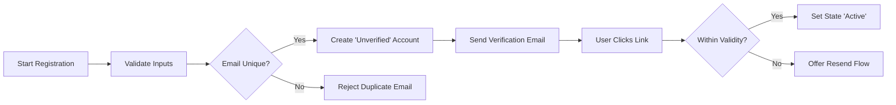
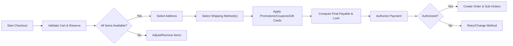
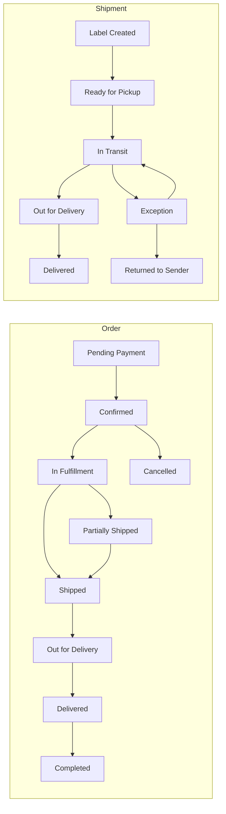
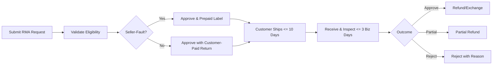
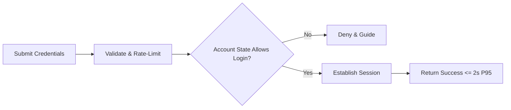
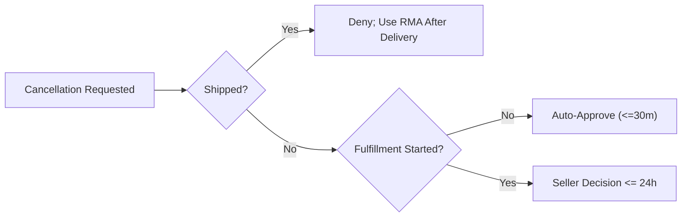

# shoppingMall — Requirements Analysis Report (Business Requirements)

## 1) Executive Overview
shoppingMall is a multi-seller e-commerce marketplace that enables Customers to discover products, select variants (SKU-level), maintain carts and wishlists, complete checkout with secure payment, track orders and shipments, submit reviews, and request cancellations/returns/refunds; empowers Sellers to onboard stores, publish listings, manage per-SKU inventory and pricing, fulfill orders, and reconcile payouts; and equips Admins with governance over categories, policies, disputes, risk, and platform health. This report defines WHAT the platform must do in business terms to deliver a production-ready backend. Technical implementation details (APIs, schemas, infrastructure) are intentionally out-of-scope.

Guiding principles:
- Trust and transparency: accurate stock, clear variants/prices/taxes/shipping, reliable tracking and fair policies.
- Safety and compliance: content moderation, least-privilege access, privacy by design, auditable decisions.
- Performance-first: user-perceived SLAs, predictable degradation, and peak season resilience in Asia/Seoul timezone context.

Actors:
- Customer: consumer buyer.
- Seller: merchant operating a store.
- Admin: platform operator (with sub-roles for governance).

## 2) Actors, Roles, and Permissions

### 2.1 Actor States (Business-Level)
- Customer: unverified, active, suspended, deleted.
- Seller: onboarding, verification_pending, verified_active, limited, suspended, deleted.
- Admin: active, suspended.

EARS — Actor states and permissions:
- THE platform SHALL maintain a business-level state for each account and enforce allowed actions accordingly.
- WHEN an account is "unverified", THE platform SHALL restrict sensitive actions (checkout, reviews, listing management).
- IF an account is "suspended", THEN THE platform SHALL deny non-support actions and present a policy-compliant message.
- WHERE an account is "deleted", THE platform SHALL prevent authentication and data access except for legally retained records.

### 2.2 Permission Matrix (Business-Level)

| Business Action | Customer | Seller | Admin |
|---|---|---|---|
| Register and verify | ✅ | ✅ | ✅ (provision)
| Login / Logout / Logout all | ✅ | ✅ | ✅
| Manage own profile | ✅ | ✅ | ✅
| Manage addresses | ✅ | ✅ (store/business only) | ⚠️ (support/compliance)
| Browse and search catalog | ✅ | ✅ | ✅
| Cart and wishlist | ✅ | ❌ | ❌
| Place orders and pay | ✅ | ⚠️ (as customer persona only) | ❌
| View own orders | ✅ | ✅ (own store orders) | ✅
| Track shipments | ✅ | ✅ (own orders) | ✅
| Reviews & ratings | ✅ (purchased items) | ⚠️ (respond only) | ⚠️ (moderate)
| Cancellations/returns/refunds | ✅ (request) | ✅ (process own) | ✅ (override)
| Seller onboarding/verification | ❌ | ✅ | ✅ (approve)
| Create/manage products & SKUs | ❌ | ✅ | ✅ (govern)
| Manage inventory & pricing | ❌ | ✅ | ✅ (audit)
| Fulfill orders & post tracking | ❌ | ✅ | ✅ (oversight)
| Category/policy governance | ❌ | ❌ | ✅
| Payouts/fees management | ❌ | ✅ (view own) | ✅ (configure/settle)

Notes: Admin access to customer PII is minimal and purpose-bound. Sellers never see payment instruments.

EARS — Permission enforcement:
- WHEN an actor attempts an action outside their role, THE platform SHALL deny and provide a business reason.
- WHILE a seller is in onboarding or verification_pending, THE platform SHALL block listing publication and order processing.

## 3) Authentication, Registration, and Address Management

### 3.1 Registration and Verification
EARS:
- THE platform SHALL allow registration using unique email and compliant password; acceptance of terms and privacy is mandatory.
- WHEN registration succeeds, THE platform SHALL set state to "unverified" and dispatch verification within 60 seconds p95.
- WHEN a valid verification link is used within its validity window, THE platform SHALL transition the account to "active".
- IF verification expires, THEN THE platform SHALL provide a self-service resend flow.

### 3.2 Login, Sessions, and Recovery
EARS:
- THE platform SHALL authenticate customers, sellers, and admins using registered credentials; rate-limit failed attempts and temporarily lock on threshold exceedance.
- WHEN valid credentials are submitted, THE platform SHALL establish a session within 2 seconds p95.
- THE platform SHALL provide logout of current session and "logout all devices" within 60 seconds.
- THE platform SHALL provide password reset via time-limited token; upon password change, THE platform SHALL revoke existing sessions unless the user opts to retain trusted sessions.

### 3.3 Address Management
EARS:
- THE platform SHALL allow customers to create, view, update, and delete their own shipping and billing addresses.
- WHERE multiple addresses exist, THE platform SHALL allow exactly one default per type (shipping, billing).
- WHEN a new default is set, THE platform SHALL unset the previous default of the same type.
- IF an address is linked to an open order, THEN THE platform SHALL prevent deletion and allow only allowable edits.
- THE platform SHALL validate country-specific formats (postal code, phone) and serviceability at checkout.

### 3.4 Registration & Verification Flow (Mermaid)

## 4) Catalog, Categories, Attributes, Variants, and Search

EARS — Categories and governance:
- THE catalog SHALL support a hierarchical taxonomy (1–5 levels) with unique slugs and single primary category per product.
- WHEN a category is Active, THE catalog SHALL include it in discovery within 5 minutes of change; Archived categories SHALL be excluded.
- WHERE categories define required attributes or allowed option dimensions, THE listing workflow SHALL enforce them.

EARS — Products and attributes:
- THE listing workflow SHALL require title, primary category, seller, condition, base price, tax class, at least one image, description, and visibility state.
- WHEN moderation is enabled, THE product SHALL remain Pending Approval until approved.
- THE platform SHALL distinguish descriptive attributes (facets) from option dimensions (variant generators) and validate enumerations.

EARS — Variants/SKUs:
- THE system SHALL support up to 5 option dimensions; each SKU combination SHALL be unique within a product.
- THE SKU code per seller SHALL be unique; SKUs MAY override price and images.
- WHEN inventory is zero and backorders are not allowed, THE SKU SHALL be temporarily unavailable.

EARS — Browse/search:
- THE platform SHALL provide faceted filtering (OR within facet, AND across facets) and sorting (Relevance, Newest, Best-Selling, Price, Rating).
- THE search SHALL accept free-text queries (≤128 chars), support typo tolerance and synonyms, and return P95 ≤ 2 seconds.

## 5) Cart and Wishlist

EARS — Cart lifecycle:
- THE platform SHALL allow one active cart per authenticated customer; guests have session-bound carts.
- WHEN checkout starts, THE platform SHALL lock the cart for structural edits; on successful order creation, THE platform SHALL mark it Converted.
- IF inactivity ≥ 30 days (authenticated) or ≥ 7 days (guest), THEN THE platform SHALL expire the cart.

EARS — Item operations and estimation:
- WHEN adding a SKU, THE platform SHALL validate purchasability, per-SKU min/max/increments, and available stock.
- WHEN cart structure changes, THE platform SHALL recompute subtotal, discounts, shipping, and tax estimates immediately.
- IF requested quantity exceeds sellable, THEN THE platform SHALL cap to maximum sellable and inform the customer.

EARS — Wishlist and merge:
- THE platform SHALL provide a persistent wishlist per authenticated customer; duplicates are disallowed.
- WHEN a guest authenticates, THE platform SHALL merge the guest cart into the customer cart and revalidate constraints.

## 6) Checkout and Payment

EARS — Preconditions and price lock:
- THE platform SHALL require a non-empty valid cart owned by the customer.
- WHEN checkout begins, THE platform SHALL validate and reserve required SKU quantities and establish a time-boxed price lock (e.g., 15 minutes).

EARS — Address, shipping, and promotions:
- WHEN a deliverable address is selected, THE platform SHALL compute eligible shipping methods per seller/shipment group and lock associated costs.
- WHEN a coupon is submitted, THE platform SHALL validate eligibility and deterministically apply stacking rules (item promos → order promos → coupons → gift cards).

EARS — Authorization and capture:
- WHEN payment is confirmed, THE platform SHALL attempt to authorize the final payable amount and create exactly one order per checkout session.
- WHERE deferred capture is configured, THE platform SHALL support partial capture at shipment; void/expire handling SHALL release reservations.

EARS — Failure handling:
- IF authorization fails or times out, THEN THE platform SHALL keep the cart and allow retry without duplicate orders.
- IF price lock expires, THEN THE platform SHALL recalculate totals and require re-acceptance before proceeding.

### Checkout Flow (Mermaid)

## 7) Orders and Shipping Management

EARS — Order and shipment lifecycles:
- THE order lifecycle SHALL include: Pending Payment, Confirmed, In Fulfillment, Partially Shipped, Shipped, Out for Delivery, Delivered, Completed, Cancelled, Refunded/Partially Refunded.
- THE shipment lifecycle SHALL include: Label Created, Ready for Pickup, In Transit, Out for Delivery, Delivered, Exception, Returned to Sender.

EARS — Transitions and aggregation:
- WHEN at least one shipment is dispatched and at least one is not, THE order status SHALL be Partially Shipped; when all dispatched, Shipped; when all Delivered, Delivered; after the post-delivery window, Completed.
- IF a transition is not allowed, THEN THE platform SHALL reject it with a business error and log rationale.

EARS — Tracking and notifications:
- WHEN tracking is added or updated, THE platform SHALL update shipment status and notify the customer within 5 minutes p95.
- IF carrier events regress, THEN THE platform SHALL ignore regression and record conflict notes.

### Order and Shipment State Flow (Mermaid)

## 8) Inventory Management

EARS — Counters and integrity:
- THE inventory model SHALL track On-hand, Reserved, and Available to Promise (ATP) per SKU per seller.
- WHEN checkout creates reservations, THE system SHALL reduce ATP accordingly; on failure/expiry, THE system SHALL release reserves immediately.
- WHEN shipments are confirmed, THE system SHALL decrement On-hand and release corresponding Reserved.

EARS — Adjustments and policies:
- THE system SHALL require reason codes for all stock adjustments; negative balances are disallowed without admin override and mandatory notes.
- WHERE backorders are enabled, THE system SHALL accept orders beyond ATP up to a limit and allocate FIFO upon replenishment.
- WHERE preorders are enabled, THE system SHALL require an availability date and cap; fulfillment SHALL prioritize preorders first at release.

Performance:
- Reservation create/release P95 ≤ 2 seconds; availability reads P95 ≤ 500 ms.

## 9) Reviews and Ratings

EARS — Eligibility and submission:
- THE platform SHALL restrict reviews to verified purchases (delivered order lines) within a policy window; one review per order line per SKU.
- THE platform SHALL accept integer ratings 1–5 and text length 10–5,000 characters; media optional per policy.

EARS — Moderation and responses:
- WHEN content is flagged by automation or users, THE platform SHALL queue for moderation with decision within 24 hours (standard) or 4 hours (high-severity).
- THE platform SHALL allow one public seller response per review; policy-violating content SHALL be hidden with reason.

EARS — Visibility and aggregation:
- THE platform SHALL compute weighted averages (verified weighted higher) and exclude hidden/deleted reviews from public aggregates.

## 10) Returns, Cancellations, and Refunds (RMA)

EARS — Cancellations:
- THE platform SHALL allow pre-shipment cancellations within policy windows; auto-approve within 30 minutes if fulfillment not started; otherwise require seller decision within 24 hours or auto-approve.
- WHEN cancellation is approved, THE platform SHALL void authorization if not captured or initiate refund if captured; stock reservations SHALL be released immediately.

EARS — RMA lifecycle:
- THE platform SHALL require RMA approval before physical returns; provide instructions and deadlines; expire inactive RMAs after 10 days if not shipped.
- WHEN returns are received, THE platform SHALL require inspection within 3 business days and compute refund per policy (items, tax proration, shipping fee rules, restocking where applicable).

EARS — Exchanges and disputes:
- WHERE direct exchanges are feasible (same product family), THE platform SHALL allow swaps subject to stock; otherwise perform return + new purchase.
- WHEN disputes are escalated, THE platform SHALL allow admin binding decisions with auditable rationale.

### Returns/RMA Flow (Mermaid)

## 11) Seller Portal Capabilities

EARS — Onboarding and verification:
- THE portal SHALL collect legal business info, contact methods, tax IDs, and documents; state remains Pending Verification until approved.
- IF docs are invalid, THEN THE portal SHALL provide reasons and allow resubmission.

EARS — Listings and inventory/pricing:
- THE portal SHALL enforce category rules, variant generation, unique SKU codes, per-SKU pricing/inventory, and media standards.
- THE portal SHALL support scheduled price changes and low-stock alerts.

EARS — Order processing:
- WHEN an order includes the seller’s items, THE portal SHALL notify within 10 seconds of confirmation; allow pick/pack, tracking entry, and partial shipments.

EARS — Payouts/statements:
- THE portal SHALL generate periodic statements (weekly by default, Asia/Seoul cutoffs), show fees/commissions, reserves, adjustments, and payout statuses (Scheduled, In Process, Completed, On Hold).

## 12) Admin Operations and Governance

EARS — Sub-roles and controls:
- THE admin module SHALL support sub-roles (Super Admin, Catalog Manager, Moderation Manager, Operations Manager, Risk & Compliance Admin, Finance Admin, Support Agent, Read-only Auditor) with least-privilege capabilities and dual-control for sensitive changes.
- WHEN sensitive actions occur (account termination, fee config changes, mass taxonomy moves), THE platform SHALL require reason codes and approver separation, logging actor and timestamps.

EARS — Governance areas:
- THE platform SHALL enable user/seller management, category governance, content moderation, dispute/fraud management, and operational dashboards/alerts.

## 13) Notifications, Communications, and Reporting

EARS — Transactional and security messages:
- WHEN order, shipping, return, or refund milestones occur, THE platform SHALL notify impacted parties within 60 seconds (transactional) or 30 seconds (security-critical) and archive messages for ≥ 24 months.
- WHERE split-merchant orders exist, THE platform SHALL scope seller notifications to their own line items only.

EARS — Preferences and suppression:
- THE platform SHALL honor user preferences for marketing while always delivering transactional and security messages via at least one durable channel.

Reporting views:
- Customer “My Notifications” history; Seller communications center and operational alerts; Admin aggregate volumes, delivery outcomes, and compliance dashboards.

## 14) Performance and SLA Expectations (Asia/Seoul)

EARS — Response time (P95 targets examples):
- Browse ≤ 1.5s; Product detail ≤ 1.2s; Search ≤ 2.0s; Add/Update cart ≤ 1.0s; Shipping options ≤ 2.0s; Coupon apply ≤ 1.5s; Place order ≤ 3.0s; Order details ≤ 1.5s; Login ≤ 1.5s; Review submit ≤ 2.0s.

EARS — Availability:
- Authentication and Checkout & Payments monthly availability ≥ 99.90%; Catalog/Search ≥ 99.80%; Seller Portal ≥ 99.80%; Admin ≥ 99.00%.

EARS — Degradation:
- WHILE under resource pressure, THE platform SHALL preserve P0 (auth, cart, checkout, payment) before P1–P3; shed non-critical features first and publish status updates within 10 minutes for Sev-1/2 incidents.

## 15) Security, Privacy, and Compliance

EARS — Data handling and consent:
- THE platform SHALL collect only necessary personal data, obtain consent where required, and honor withdrawals within 72 hours.
- WHEN DSARs are received, THE platform SHALL acknowledge within 72 hours and fulfill within 30 days (with lawful extensions when applicable).

EARS — Access control and least privilege:
- THE platform SHALL restrict data access by actor and store tenancy; sellers view only data for their orders; admins access PII only for support/compliance with audit.

EARS — Retention and deletion:
- THE platform SHALL retain order/tax records 5–7 years; audit logs ≥ 12 months; delete/anonymize personal data within 30 days of account closure unless legal holds apply.

EARS — Incident response:
- WHEN a personal data breach is confirmed, THE platform SHALL notify authorities within 72 hours and affected users without undue delay as required by law.

## 16) Acceptance Criteria and Traceability (Samples)

- WHEN a new customer registers with valid data, THE system SHALL create an unverified account, send verification within 60 seconds, and allow verification within the validity window.
- WHEN a customer adds a valid SKU to the cart, THE system SHALL validate stock and constraints and update estimates within 2 seconds.
- WHEN checkout begins, THE system SHALL reserve inventory and lock prices for a configured window.
- WHEN payment authorizes, THE system SHALL create exactly one order and expose seller sub-orders.
- WHEN a seller adds tracking, THE system SHALL notify the customer and update status within 5 minutes.
- WHEN a delivered item is reviewed, THE system SHALL publish or queue for moderation within seconds and update product aggregates within 5 seconds on publish/hide.
- WHEN a pre-shipment cancellation is requested within 30 minutes, THE system SHALL auto-approve if fulfillment has not started.
- WHEN an RMA is approved, THE system SHALL generate instructions and deadlines and process refunds within policy timelines after inspection.

## 17) Visual Appendices (Mermaid Diagrams)

### 17.1 Login and Session Establishment

### 17.2 Order Lifecycle with Partial Fulfillment

### 17.3 Cancellation Decision Tree

---

This report consolidates complete, actor-centric, EARS-compliant business requirements for shoppingMall. It is implementation-ready for backend engineering while leaving technical choices (architecture, APIs, data schema) to the development team.