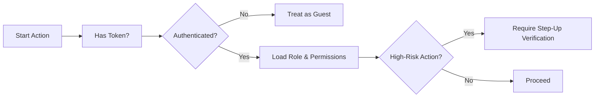
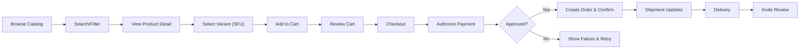
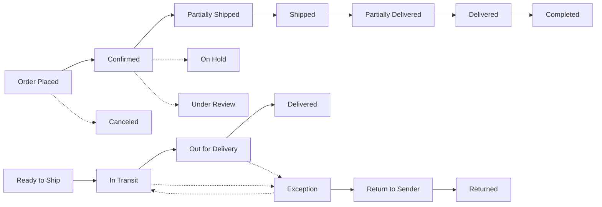
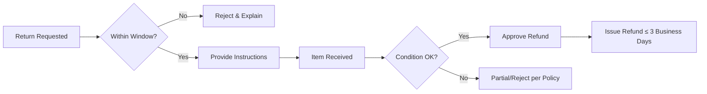
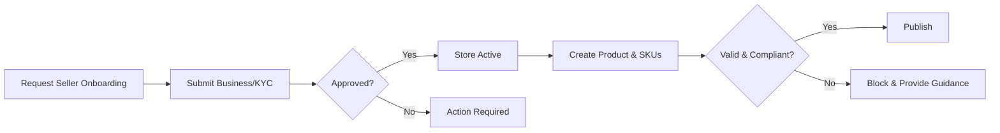

# shoppingMall – Requirements Analysis (Business Specification)

## Executive Summary
shoppingMall is a multi-seller e-commerce marketplace that connects customers and sellers under a unified discovery, checkout, and post-purchase experience. Objectives are to: enable trustworthy browsing with accurate SKU-level availability and pricing; provide persistent cart and wishlist; support secure order placement and payment; deliver transparent order tracking and shipping updates; uphold credible reviews and ratings; empower sellers with compliant catalog, inventory, and order tools; and ensure admins govern policies, content, and operations. All requirements are written in business terms using EARS syntax and include measurable performance targets. No database schemas or API specifications are included.

## Roles and Access Overview
- guest (kind: guest): browse, search, read product pages and reviews; maintain a device-scoped temporary cart; cannot check out by default.
- customer (kind: member): manage profile and addresses; persistent cart and wishlist; place and pay for orders; track shipments; review purchases; request cancellations/refunds.
- seller (kind: member): manage store profile; list products and SKUs; maintain inventory and pricing; process orders; update shipping; handle cancellations/refunds for own items.
- supportAgent (kind: admin): assist with order issues, cancellations/refunds, disputes; view customer/seller context with audit.
- operationsManager (kind: admin): manage catalog integrity, categories, visibility and policy enforcement; monitor operations.
- financeManager (kind: admin): approve high-value refunds, reconcile payouts, manage financial holds/reserves.
- contentModerator (kind: admin): moderate reviews and seller content per policy.
- systemAdmin (kind: admin): manage roles, policies, platform configurations, and audit access.

EARS – Access Control Principles
- THE platform SHALL enforce least-privilege for all roles and actions.
- WHEN ownership applies (e.g., seller listings, seller order lines), THE platform SHALL restrict write actions to the owner.
- IF a user attempts an action outside assigned role scope, THEN THE platform SHALL deny and log the attempt with a reason.

## Authentication, Identity, and Address Management
### Goals
- Provide secure registration, login, and sessions with email verification and optional 2FA.
- Allow customers to manage multiple shipping/billing addresses with validation.
- Require verified seller identity before payouts and publishing products.

### Business Rules (Authentication & Sessions)
- THE access token session SHALL expire after a short interval (e.g., 20 minutes) and be refreshable by a longer-lived token (e.g., 14 days) subject to policy.
- WHEN a password is changed or role permissions change materially, THE platform SHALL revoke active refresh tokens and require re-authentication.
- WHERE risk signals are detected (e.g., unusual geo), THE platform SHALL require step-up verification for high-risk actions (checkout, role/payout changes).

### Business Rules (Email Verification & Password Policy)
- WHEN registration completes, THE platform SHALL mark the account unverified and send a verification link valid for 7 days.
- IF a user attempts checkout or review submission with unverified email, THEN THE platform SHALL block and prompt verification.
- THE password policy SHALL require a minimum length of 10 characters and mixed character classes per policy.

### Address Management
- THE platform SHALL allow up to 10 saved addresses per customer and enforce one default shipping and one default billing address.
- WHEN an address is added or edited, THE platform SHALL validate required fields and serviceability by region.
- IF an address is referenced by an open order, THEN THE platform SHALL prevent deletion and allow edits only.

### Mermaid – Authentication Decision Flow

EARS – Authentication & Addressing
- WHEN a user logs out, THE platform SHALL invalidate the session immediately.
- WHEN a customer sets a new default address, THE platform SHALL unset the previous default of the same type.
- IF address validation fails, THEN THE platform SHALL block its use for checkout and provide field-level guidance.

## Functional Domains

### 1) Catalog and Search
Goals
- Allow intuitive discovery via categories, search, and filters.
- Ensure published products with at least one in-stock SKU are visible; hide suspended or unpublished content from buyers.

Business Rules
- THE platform SHALL support hierarchical categories (3–5 levels practical) with draft/active/hidden/archived states.
- THE platform SHALL allow products to have a primary category and optional cross-listing.
- THE platform SHALL support search with filters for category, brand, price, seller, rating, availability, and variant attributes.
- WHEN a search runs in a category context, THE platform SHALL scope results to that category and descendants by default.

EARS – Catalog/Search
- WHEN a user submits a query or selects filters, THE platform SHALL return relevant results with pagination in ≤ 1.5 seconds (p95) under normal load.
- IF a product is unpublished or suspended, THEN THE platform SHALL hide it from guest/customer discovery.
- WHERE zero results occur, THE platform SHALL suggest alternatives and relaxed filters.

### 2) Variants, SKU Integrity, and Inventory per SKU
Goals
- Represent variant options (e.g., color, size) that resolve to a single SKU with distinct price, stock, and status.
- Maintain accurate per-SKU inventory with backorder/preorder policies where allowed.

Business Rules
- THE platform SHALL allow 0..N option types per product and generate valid combinations only.
- THE platform SHALL require each SKU to have a unique identifier, status, price, and inventory policy.
- WHERE backorder or preorder is enabled, THE platform SHALL require expected date windows and caps.

EARS – Variants/Inventory
- WHEN a buyer selects option values, THE platform SHALL resolve to a single SKU and display its availability and price within 1 second.
- IF a selected SKU is out of stock without backorder/preorder, THEN THE platform SHALL prevent add-to-cart and show cause.
- WHEN checkout starts, THE platform SHALL create time-bound reservations to reduce oversell and release them on timeout/failure.

### 3) Cart and Wishlist
Goals
- Provide reliable cart operations for guests (device-scoped) and customers (account-scoped), with timely recalculation and no price lock until order confirmation.
- Offer wishlist with optional notifications.

Business Rules
- THE platform SHALL allow one active cart per customer and a device-scoped temporary cart for guests.
- THE platform SHALL revalidate prices, promotions, and stock on cart updates and at checkout start.
- THE platform SHALL support wishlist capacity limits and deduplicate items per list.

EARS – Cart/Wishlist
- WHEN a SKU is added, THE platform SHALL validate sellability and quantity against limits before acceptance.
- WHEN a cart changes, THE platform SHALL recalculate totals within 1 second for typical carts (≤ 50 lines).
- WHEN a guest logs in, THE platform SHALL merge the device cart into the account cart and revalidate promotions.

### 4) Checkout, Payment, and Order Creation
Goals
- Validate address, shipping, taxes/duties, promotions, and payment; create an order with an immutable order number.

Business Rules
- THE platform SHALL require authenticated checkout by default (configurable guest checkout possible with verified email/phone).
- THE platform SHALL compute shipping options per seller and aggregate totals per order.
- THE platform SHALL authorize payment for the order total and create the order only on successful authorization (COD excepted).

EARS – Checkout/Payment/Orders
- WHEN an order is submitted, THE platform SHALL authorize payment and, if approved, create the order and assign a unique number format "ORD-YYYYMMDD-NNNNNN".
- IF authorization fails, THEN THE platform SHALL not create an order and SHALL present retry options.
- WHEN multi-seller orders occur, THE platform SHALL maintain a parent order with child shipments per seller and ensure totals reconcile.

### 5) Order Tracking and Shipping Updates
Goals
- Provide clear order state and shipment timelines mapping carrier events to customer-friendly statuses.

Business Rules
- THE platform SHALL expose shipment states: "Ready to Ship", "In Transit", "Out for Delivery", "Delivery Attempted", "Delivered", "Exception", "Return to Sender", "Returned".
- THE platform SHALL send timely notifications at key milestones and exceptions per preferences.

EARS – Tracking/Shipping
- WHEN a shipment transitions to "In Transit" or "Out for Delivery", THE platform SHALL notify the customer within minutes (≤ 5 and ≤ 2 respectively).
- WHEN "Delivered" is recorded, THE platform SHALL invite review within 3 days and start the post-delivery window.
- IF an exception is recorded, THEN THE platform SHALL reflect it and provide next steps.

### 6) Reviews and Ratings
Goals
- Collect credible reviews from verified purchasers and moderate content per policy; aggregate ratings at SKU and product levels.

Business Rules
- THE platform SHALL allow reviews only for eligible delivered items within a 180-day window.
- THE platform SHALL queue reviews for moderation before publication and badge Verified Purchase.
- THE platform SHALL compute aggregates from Approved reviews and update within 60 seconds of state change.

EARS – Reviews
- WHEN a customer submits a review, THE platform SHALL verify eligibility and set state to Pending Moderation.
- IF policy violations are detected, THEN THE platform SHALL reject or remove the review and notify the author with a reason category.
- WHEN a review is Approved, THE platform SHALL publish and update aggregates to product and SKU levels within 60 seconds.

### 7) Seller Portal
Goals
- Enable sellers to onboard, manage catalog and SKUs, maintain inventory and pricing, process orders, update shipping, and handle after-sales within policy.

Business Rules
- THE platform SHALL require seller verification before publishing products or receiving payouts.
- THE platform SHALL restrict seller updates to owned products/SKUs and owned order lines.
- THE platform SHALL route high-value refunds to financeManager for approval.

EARS – Seller Portal
- WHEN a seller lists a product, THE platform SHALL require category selection, required content, at least one SKU, and compliant media.
- WHEN a seller creates a shipment, THE platform SHALL require carrier, tracking, ship date, and line quantities.
- IF seller misses handling SLAs, THEN THE platform SHALL flag and escalate per policy.

### 8) Admin Dashboard
Goals
- Provide centralized oversight for catalog integrity, orders, users/sellers, content moderation, policy management, and audit/reporting.

Business Rules
- THE platform SHALL restrict admin capabilities to staff roles and log every state-changing action with who/what/when/why.
- THE platform SHALL enforce maker-checker approvals for sensitive actions (e.g., high-value refunds, role grants).

EARS – Admin Dashboard
- WHEN an operationsManager publishes/unpublishes products or categories, THE platform SHALL enforce policy validations and log actions.
- WHEN a supportAgent cancels eligible orders pre-shipment, THE platform SHALL void authorizations and notify stakeholders.
- IF an admin attempts an action outside role scope, THEN THE platform SHALL block and log the attempt.

### 9) Order History, Cancellation, and Refunds
Goals
- Provide customers with order history and self-service cancellation/refund options within policy windows.

Business Rules
- THE platform SHALL show detailed order histories with items, prices, promotions, taxes, shipping, and timelines.
- THE platform SHALL allow cancellation prior to shipment according to category/region policies and refund rules.
- THE platform SHALL allow returns/refunds within policy windows and compute eligible refund amounts accordingly.

EARS – History/Cancellations/Refunds
- WHEN a customer requests cancellation before shipment, THE platform SHALL approve automatically where policy allows and release reservations.
- WHEN a return is approved and item is received and inspected, THE platform SHALL issue refunds consistent with condition outcomes and policy within 3 business days.
- IF a refund request exceeds auto-approval thresholds, THEN THE platform SHALL route it to financeManager.

## Cross-Cutting Business Policies
- Promotions & Pricing: stacking rules, precedence, and eligibility must be enforced and revalidated on recalculation and at checkout.
- Reservations & Allocations: reservations created at payment step; allocations occur on order confirmation; releases happen on timeout/failure/cancellation.
- Visibility: product and SKU states (draft/pending/published/suspended/discontinued/archived) determine buyer visibility; policy-restricted items require eligibility checks.
- Privacy & Consent: consent captured for marketing; transactional emails always sent; data subject rights honored per jurisdiction.
- Audit: immutable logs for auth changes, role changes, catalog changes, order/payment/refund/shipment transitions, and moderation actions retained per policy.

## Non-Functional Requirements (Business Targets)
Performance (p95 under normal load)
- Category/search: ≤ 1.5 s; product detail: ≤ 1.0 s; variant selection: ≤ 1.0 s.
- Cart add/update/remove: ≤ 1.0 s; checkout to order number (successful auth): ≤ 10 s.
- Order list (≤ 50 orders): ≤ 0.7 s; order detail (≤ 5 shipments): ≤ 0.6 s.
- Seller inventory/price update confirmation: ≤ 0.6 s; admin list views: ≤ 0.9 s.

Scalability and Availability
- Sustain 300 req/s browse/search, 60 req/s cart ops, 20 orders/s during normal load.
- Availability monthly SLOs: core flows ≥ 99.90%, checkout/payments ≥ 99.95%.
- RTO ≤ 60 minutes; RPO ≤ 15 minutes.

Security & Compliance
- Enforce least-privilege RBAC; mask PII in staff views with just-in-time reveal.
- Avoid storage of raw card data; use compliant payment providers.
- Honor DSAR timelines (ack ≤ 7–10 days; fulfill ≤ 30–45 days by jurisdiction).
- Asia/Seoul timezone for business cutoffs; user-facing times localized.

Localization
- Support en-US and ko-KR initially; adapt addresses and tax display by region; convert carrier timestamps to user timezone.

Observability
- Define SLIs for latency, error rate, availability, freshness; alert on budget consumption and SLA breaches.

## Business Workflows (Mermaid)

Buyer Journey

Order and Shipping Lifecycle

Returns and Refunds Lifecycle

Seller Onboarding and Listing

## KPIs and Success Metrics
Customer
- Conversion rate; cart abandonment reduction ≥ 10%; delivery on-time rate ≥ 95%; refund cycle median ≤ 7 business days.

Seller and Operations
- On-time shipment rate ≥ 95%; inventory accuracy ≥ 99%; payout timeliness ≥ 99% on schedule; order defect rate < 1%.

Trust & Safety
- ≥ 98% reviews from verified purchases; moderation SLA < 48 hours for flagged content; dispute resolution ≥ 90% within 10 business days.

Platform Reliability
- Checkout/payment availability ≥ 99.95%; duplicate order prevention incidents = 0.

## Error Handling and Edge Cases (Consolidated)
- IF a SKU in cart becomes unavailable, THEN THE platform SHALL cap or remove the line with explanation before checkout.
- IF shipping options change after address update, THEN THE platform SHALL force re-selection and recalculate totals.
- WHEN authorization is pending beyond 10 seconds, THE platform SHALL present a pending state and complete asynchronously with notification.
- IF carrier events arrive out of order, THEN THE platform SHALL ignore regressions and retain the most advanced state while logging the event.
- WHEN a guest attempts wishlist usage, THE platform SHALL prompt login/registration and preserve intent for post-login.
- IF a user repeats “Place Order” within 10 minutes, THEN THE platform SHALL ensure a single order via idempotency and return the original outcome.

## Glossary
- SKU: A unique sellable unit representing a specific variant combination of a product.
- Variant: A combination of option values (e.g., size, color) mapping to one SKU.
- Reservation: Temporary hold of inventory during checkout; released on timeout/failure.
- Allocation: Committed inventory deducted on order confirmation.
- Parent Order: Buyer-facing umbrella order that may split into shipments per seller.
- Shipment: Package-level fulfillment entity with tracking and carrier events.
- Verified Purchase: Review eligibility marker tied to delivered order lines.
- EARS: Easy Approach to Requirements Syntax, used to state testable requirements.
