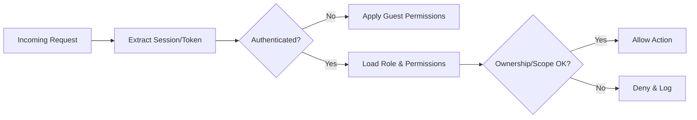
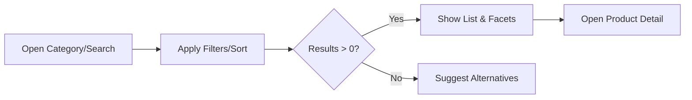
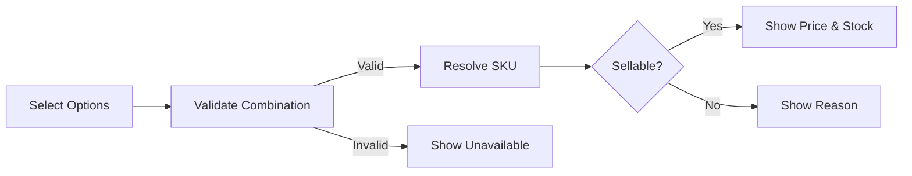
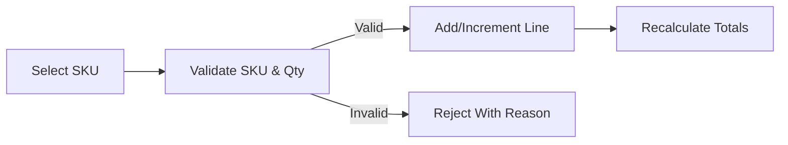
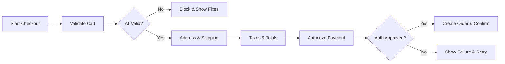
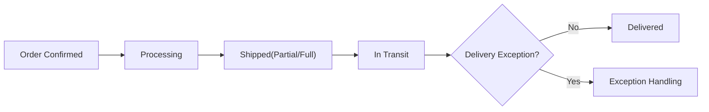
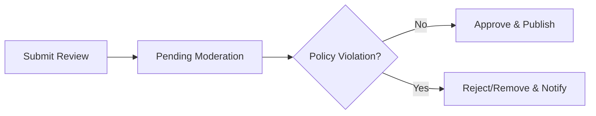
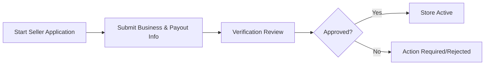
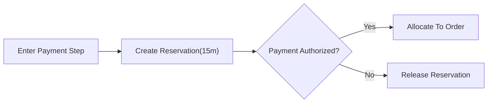
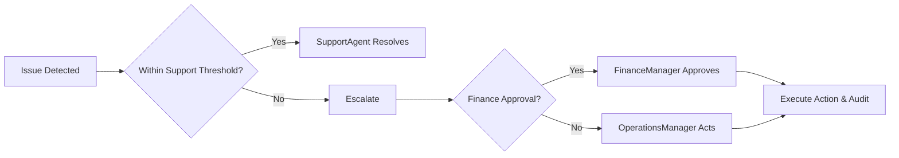

# shoppingMall Requirements Analysis – E-commerce Marketplace (Consolidated)

## Scope and Intent
shoppingMall operates as a multi-seller e-commerce marketplace delivering end-to-end buyer and seller experiences: registration and login with address management; catalog with categories and search; product variants and SKU integrity; shopping cart and wishlist; checkout with payment authorization/capture; order tracking and shipping updates; reviews and ratings; seller accounts; per-SKU inventory; order history with cancellation/refund; and administrative oversight. Content specifies WHAT the platform must do in business terms using EARS and avoids technical specifications.

## Roles and Access Model
- guest: Unauthenticated visitor who browses catalog, views product details and approved reviews, and creates a session-scoped cart. Cannot checkout.
- customer: Authenticated buyer who manages profile and addresses, cart and wishlist, places and pays for orders, tracks shipments, submits reviews, and requests cancellations/refunds.
- seller: Merchant who manages store profile, catalog, SKUs, inventory, pricing, promotions; fulfills orders and updates shipping; handles cancellations/refunds for own items.
- supportAgent: Staff assisting customers and sellers with orders, cancellations/refunds, disputes; can place order holds within policy thresholds.
- operationsManager: Staff overseeing catalog integrity, policy enforcement, feature flags, risk thresholds, and operational monitoring.
- financeManager: Staff approving refunds above thresholds, managing payouts and reconciliation, handling chargebacks.
- contentModerator: Staff moderating reviews and seller content per content policy.
- systemAdmin: Staff managing users/roles, platform configurations, integrations, and escalated audit access.

Principles
- THE shoppingMall platform SHALL enforce least-privilege access for all roles, applying ownership checks for resources (orders, products, SKUs).
- THE shoppingMall platform SHALL deny by default when no policy grants access and SHALL log authorization denials with role, attempted action, and reason category.

## Glossary (Business)
- Product: A sellable entity owned by a seller; may have multiple variants.
- Variant: A specific option combination (e.g., color/size) of a product that maps to a single SKU.
- SKU: The unique, purchasable variant with price and inventory.
- Cart: A collection of SKU line items pending checkout.
- Order: A confirmed purchase with one or more line items and shipments.
- Shipment: A package with tracking that carries some or all line items.
- Review: Customer-authored rating/text feedback for a SKU and product.
- Payout: Settlement from platform to seller for captured orders after policies.

## End-to-End Journeys (Overview)
- Buyer: Browse → Search/Filter → Product Detail → Variant Select (SKU) → Add to Cart/Wishlist → Checkout → Payment Authorization → Order Confirmation → Shipping Updates → Delivery → Review/Rating → Cancellation/Refund (if needed).
- Seller: Onboard → Create Store Profile → List Product and Variants → Price and Inventory → Receive Orders → Acknowledge and Ship with Tracking → Handle Cancellations/Refunds → Payouts → Performance Compliance.
- Staff: Manage catalog/policies, resolve disputes, approve refunds, moderate content, review audits, monitor alerts.

## Functional Requirements (EARS)

### 1) Authentication, Registration, Sessions, and Addresses
- THE shoppingMall platform SHALL support registration, login, logout, email verification, password reset, and session revocation.
- WHEN a user registers, THE shoppingMall platform SHALL create an unverified account and send a verification to the provided contact.
- IF a user attempts checkout without verified email, THEN THE shoppingMall platform SHALL block checkout and prompt verification.
- WHILE a session is active, THE shoppingMall platform SHALL enforce token/session expiry windows and deny privileged actions after expiry.
- THE shoppingMall platform SHALL allow customers to store up to 10 addresses with default flags for shipping and billing.
- WHEN a customer adds/edits an address, THE shoppingMall platform SHALL validate required fields (recipient, street, city, region, postal code, country, phone per region rules) and serviceability.
- IF an address fails validation or is unserviceable, THEN THE shoppingMall platform SHALL reject it for checkout and display field-level guidance.
- WHEN a customer deletes an address referenced by an open order, THE shoppingMall platform SHALL prevent deletion and allow edits only.

Mermaid – Authentication Decision

### 2) Catalog, Categories, Search, and Visibility
- THE shoppingMall platform SHALL maintain a hierarchical category taxonomy and allow products to have one primary and multiple secondary categories.
- WHEN a user browses a category or submits a search, THE shoppingMall platform SHALL return paginated results with configurable sorts (relevance, newest, price, rating, best-selling) and validated filters (category, brand, price, availability, seller, attributes, variant attributes).
- WHERE a product is in draft, pending, suspended, discontinued, or archived state, THE shoppingMall platform SHALL restrict visibility to appropriate roles (owner/admin) and hide it from guests/customers where applicable.
- THE shoppingMall platform SHALL compute facet counts without leaking hidden categories and SHALL present zero-result guidance when applicable.
- WHEN a product has no purchasable SKUs, THE shoppingMall platform SHALL hide purchase controls and indicate unavailability.

Mermaid – Browse and Search

### 3) Variants, SKUs, Pricing, and Per-SKU Inventory
- THE shoppingMall platform SHALL represent variants through option types/values that resolve to a single SKU per valid combination.
- WHEN a buyer selects variant options, THE shoppingMall platform SHALL resolve the SKU and display price, discount, and stock status for that SKU within 1 second (P95) under normal load.
- IF a selected SKU is unavailable (out of stock/no backorder, discontinued), THEN THE shoppingMall platform SHALL block add-to-cart and display the reason.
- THE shoppingMall platform SHALL allow per-SKU base price, promotions, safety stock thresholds, and min/max purchase quantities.
- WHERE backorder or preorder is enabled, THE shoppingMall platform SHALL display estimated ship/release windows and enforce quantity caps.

Mermaid – Variant Resolution

### 4) Cart and Wishlist
- THE shoppingMall platform SHALL allow guests to maintain a session cart for 30 days of inactivity and customers to maintain a persistent cart across devices.
- WHEN a SKU is added/updated, THE shoppingMall platform SHALL validate sellability, purchase limits, and availability-to-sell (ATS) before accepting.
- IF requested quantity exceeds ATS or policy, THEN THE shoppingMall platform SHALL cap or reject with a clear line-level reason.
- WHEN a customer logs in, THE shoppingMall platform SHALL merge the device cart into the account cart, aggregating identical SKUs and revalidating promotions/prices.
- THE shoppingMall platform SHALL allow customers to maintain wishlists (at least one default; capacity and named lists configurable) and subscribe to back-in-stock or price-drop alerts subject to consent and frequency caps.

Mermaid – Add to Cart

### 5) Checkout, Payment, and Order Creation
- THE shoppingMall platform SHALL require an authenticated customer to place orders unless guest checkout is explicitly enabled by policy.
- WHEN checkout starts, THE shoppingMall platform SHALL revalidate cart lines for stock, price, promotions, and purchase limits and SHALL compute shipping options, taxes/duties estimates, and final totals.
- WHEN the buyer submits payment, THE shoppingMall platform SHALL attempt authorization for the grand total, and upon approval SHALL create an immutable order with a unique number and reserve inventory accordingly.
- IF authorization fails or times out, THEN THE shoppingMall platform SHALL not create the order and SHALL preserve the checkout session for retry within a short window (e.g., 10 minutes).
- WHERE COD is allowed, THE shoppingMall platform SHALL create the order without authorization and mark payment method as COD.
- THE shoppingMall platform SHALL support partial captures aligned with shipments and SHALL ensure total captured does not exceed authorized amount.

Mermaid – Checkout

### 6) Order Tracking, Shipping States, and Notifications
- THE shoppingMall platform SHALL maintain shipment-level states (Ready to Ship, In Transit, Out for Delivery, Delivery Attempted, Delivered, Exception, Return to Sender, Returned) and map carrier events to canonical states.
- WHEN a shipment state changes, THE shoppingMall platform SHALL reflect the update in customer order details within 5 minutes and notify customers for significant milestones (shipped, out for delivery, delivered, exception) within the timing policy.
- WHEN multi-seller orders occur, THE shoppingMall platform SHALL support split shipments per seller and display aggregated progress (e.g., “2 of 3 shipments delivered”).

Mermaid – Order & Shipping States

### 7) Reviews, Ratings, and Moderation
- WHERE a customer has received delivery for a SKU, THE shoppingMall platform SHALL allow review and rating submission within a 180-day window and SHALL mark eligible reviews as Verified Purchase.
- WHEN a review is submitted, THE shoppingMall platform SHALL set state to Pending Moderation, perform policy checks, and upon approval publish and update product/SKU aggregates within 60 seconds.
- IF a review violates policy or is ineligible, THEN THE shoppingMall platform SHALL reject or remove it and notify the author with a reason category.
- WHERE seller replies are enabled, THE shoppingMall platform SHALL allow one public reply per review for the owning seller, subject to moderation.

Mermaid – Review Moderation

### 8) Seller Portal: Onboarding, Catalog, Orders, and Payouts
- WHEN a user applies to become a seller, THE shoppingMall platform SHALL collect business identity and payout details and set store state to Pending Verification until approved.
- WHEN a seller publishes a product, THE shoppingMall platform SHALL require required fields (title, primary category, images, description) and at least one sellable SKU with price and inventory policy.
- WHEN an order containing seller items is placed, THE shoppingMall platform SHALL notify the seller, set acknowledgment deadlines, and allow shipment creation with carrier and tracking details.
- WHEN a seller updates shipping status, THE shoppingMall platform SHALL propagate updates to customers and order timelines within 5 minutes.
- THE shoppingMall platform SHALL maintain a business-view ledger for seller payouts, respecting reserves/holds and generating scheduled payouts when eligibility criteria are met.

Mermaid – Seller Onboarding

### 9) Inventory Management: Reservation, Allocation, Release
- THE shoppingMall platform SHALL not reserve stock on add-to-cart under standard policy.
- WHEN a buyer reaches payment authorization, THE shoppingMall platform SHALL create a temporary reservation per SKU for a configurable window (default 15 minutes).
- WHEN authorization succeeds and the order is created, THE shoppingMall platform SHALL convert reservations to allocations and deduct available inventory accordingly.
- IF authorization fails or session expires, THEN THE shoppingMall platform SHALL release reservations immediately.
- WHERE partial allocation is allowed, THE shoppingMall platform SHALL allocate available units and disclose backordered remainder prior to order confirmation.

Mermaid – Reservation Lifecycle

### 10) Order History, Cancellations, Returns, and Refunds
- THE shoppingMall platform SHALL provide customers access to order history with itemized details, shipment statuses, and financial states.
- WHEN a customer requests cancellation before shipment, THE shoppingMall platform SHALL allow cancellation within policy windows and update inventory/payment holds appropriately.
- WHEN a return/refund is requested, THE shoppingMall platform SHALL collect reason codes and evidence (if required), evaluate eligibility, and route approvals to seller and financeManager as per thresholds.
- IF a refund is approved, THEN THE shoppingMall platform SHALL initiate refund and update order/line financial states; if rejected, it SHALL notify with reason and appeal options where applicable.

### 11) Admin Dashboard, Policies, Audit, and Reporting
- THE shoppingMall platform SHALL provide staff with permissioned controls for catalog governance, order escalations, refunds above thresholds, content moderation, policy/version management, and feature flags.
- WHEN a staff action changes business state, THE shoppingMall platform SHALL emit an immutable audit event capturing actor, reason, before/after state, and timestamp.
- WHERE policy changes occur, THE shoppingMall platform SHALL version policies, apply effective dates, and grandfather in-flight cases per configuration.
- THE shoppingMall platform SHALL provide operational dashboards for orders, fulfillment SLAs, moderation backlogs, and seller performance, respecting role-based visibility.

## Non-Functional Requirements (User-Experience Targets)
Performance
- THE shoppingMall platform SHALL serve category/search p95 ≤ 1.5s, product detail p95 ≤ 1.0s, variant resolution p95 ≤ 1.0s, add/update cart p95 ≤ 1.0s, checkout confirmation p95 ≤ 10s under normal load.
Availability and Reliability
- THE shoppingMall platform SHALL achieve ≥ 99.9% monthly availability for core shopping flows and ≥ 99.95% for payment authorization/order placement.
Scalability
- THE shoppingMall platform SHALL sustain at least 300 req/s browse/search, 60 req/s cart ops, and 20 orders/sec under normal load, with 5× peak scaling.
Security and Privacy
- THE shoppingMall platform SHALL enforce least privilege, mask PII for staff by default, notify users on sensitive account changes, and avoid storing raw payment data.
Compliance and Localization
- THE shoppingMall platform SHALL honor privacy regulations (e.g., PIPA in KR, GDPR/CCPA where applicable), display times in customer’s locale/timezone, and support en-US content initially.
Observability
- THE shoppingMall platform SHALL log critical business events and provide SLIs/SLOs for latency, availability, and error budgets.

## Error Scenarios and Recovery (Cross-Cutting)
- IF a user attempts a role-restricted action (e.g., guest checkout), THEN THE shoppingMall platform SHALL deny and guide to login/registration.
- IF a SKU in cart becomes unavailable, THEN THE shoppingMall platform SHALL cap/remove the line at checkout validation and present reasons and alternatives.
- IF payment authorization fails, THEN THE shoppingMall platform SHALL allow retry with alternate methods and avoid duplicate orders via idempotent handling.
- IF a carrier exception occurs, THEN THE shoppingMall platform SHALL present a status with next actions and notify within policy timing.
- IF a review violates policy, THEN THE shoppingMall platform SHALL withhold or remove it and notify the author with reason.

## KPIs and Success Metrics
- Conversion rate uplift, cart abandonment reduction, on-time shipment rate (≥95%), on-time delivery rate (≥92%), refund cycle median ≤ 7 business days, inventory oversell rate ≤ 0.05% of SKUs/month, moderation SLA ≤ 2 business days.
- THE shoppingMall platform SHALL compute and display KPIs on operational dashboards and flag breaches for remediation.

## Visual Index (Additional Mermaid)

Admin Escalation Flow

## EARS Catalog Index (Selected)
Authentication & Sessions
- WHEN a user registers, THE shoppingMall platform SHALL create an unverified account and send verification.
- IF checkout is attempted without verification, THEN THE shoppingMall platform SHALL block and prompt verification.
Catalog & Search
- WHEN a category/search is requested, THE shoppingMall platform SHALL return filtered, sorted, paginated results with facets.
Variants & Inventory
- WHEN variant options are selected, THE shoppingMall platform SHALL resolve SKU and display price/availability within 1 second (P95).
Cart & Wishlist
- WHEN a SKU is added to cart, THE shoppingMall platform SHALL validate sellability and limits before acceptance.
Checkout & Payment
- WHEN payment is submitted, THE shoppingMall platform SHALL attempt authorization and create an immutable order upon approval.
Orders & Shipping
- WHEN shipment status changes, THE shoppingMall platform SHALL reflect updates within 5 minutes and notify on milestones.
Reviews & Ratings
- WHEN a review is approved, THE shoppingMall platform SHALL update aggregates within 60 seconds.
Seller Portal
- WHEN a seller publishes a product, THE shoppingMall platform SHALL require required fields and at least one sellable SKU.
Admin & Audit
- WHEN staff change business state, THE shoppingMall platform SHALL emit an immutable audit event with actor and reason.

## Assumptions and Out-of-Scope
- Assumptions: multi-seller marketplace; sellers fulfill their items unless a separate logistics program exists; taxes/duties policies are defined externally per region.
- Out-of-scope: API specifications, database schemas, carrier/gateway protocol details, UI layouts, or vendor-specific configurations.
