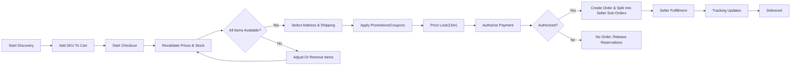
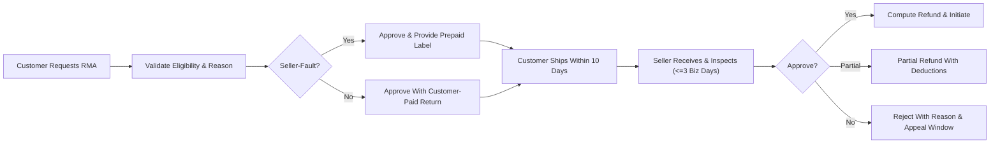

# shoppingMall Requirements Analysis and Business Requirements

## Vision and Goals
Enable a trustworthy multi-seller marketplace where customers discover products, select the correct variant (SKU), purchase confidently, track shipments reliably, manage orders (including cancellations/returns/refunds), and share feedback via reviews; where sellers efficiently onboard, list products, manage inventory, and fulfill orders; and where admins govern categories, content, disputes, risk, and policies consistently.

## Scope and Actors

In-scope capabilities aligned to marketplace MVP:
- Accounts: registration, login/logout, email verification, password reset; address book management (multiple addresses, default selection, validation).
- Catalog and Search: hierarchical categories, attributes and filters, product detail pages, SKU variants (color/size/options), keyword search, sorting.
- Cart and Wishlist: add/update/remove SKU items; wishlist save/remove.
- Checkout and Payment: address and shipping selection, promotions/coupons, authorization and capture, combined checkout with split seller orders.
- Orders and Shipping: order lifecycle visibility, shipment tracking, status updates, delivery exception handling.
- Inventory: per-SKU stock, reservations during checkout, oversell prevention; optional backorders/preorders per policy.
- Reviews and Ratings: eligibility for delivered purchases, moderation against abuse, seller responses.
- Seller Operations: onboarding/verification, product and SKU management, inventory control, order processing and tracking, payouts overview.
- Cancellations/Returns/Refunds: policy-driven windows and outcomes, RMA handling, refunds.
- Admin Governance: category and content moderation, account actions, disputes, fraud/risk controls, fee/policy configuration.

Actors and account states:
- Customer states: unverified, active, suspended, deleted.
- Seller states: onboarding, verification_pending, verified_active, limited, suspended, deleted.
- Admin states: active, suspended.

EARS (actors and access):
- THE shoppingMall platform SHALL restrict data and actions to the authenticated actor’s role and ownership boundaries.
- WHEN an account is in "unverified" state, THE shoppingMall platform SHALL restrict sensitive actions (checkout, reviews, listing management).
- IF an account is "suspended", THEN THE shoppingMall platform SHALL deny operational actions and direct the user to support information.

## Assumptions and Constraints
- Region and timezone: operate initially in one market; display times in the user’s locale with default processing cadence in Asia/Seoul.
- Currency: single transaction currency for MVP; multi-currency may follow.
- Split orders: combined checkout may generate seller-specific sub-orders with independent shipping fees and timelines.
- Guest usage: allow browsing and optional guest cart; checkout requires authentication for MVP.
- Business-only scope: requirements define outcomes, not technical designs, providers, or schemas.

## 1. Authentication, Registration, and Address Management (EARS)

Account creation and verification:
- THE shoppingMall platform SHALL allow customers and sellers to register with unique email and compliant password.
- WHEN registration succeeds, THE shoppingMall platform SHALL set account state to "unverified" and dispatch verification within 60 seconds P95.
- WHEN the user verifies within the validity window, THE shoppingMall platform SHALL transition state to "active".
- IF verification expires, THEN THE shoppingMall platform SHALL allow resend and block sensitive actions until verified.

Login, sessions, and logout:
- THE shoppingMall platform SHALL allow login for customers, sellers, and admins with rate-limited failure handling.
- WHEN valid credentials are provided, THE shoppingMall platform SHALL establish a session and respond within 2 seconds P95.
- WHEN logout is requested, THE shoppingMall platform SHALL terminate the current session; WHERE "logout all" is requested, THE platform SHALL revoke all sessions within 60 seconds.

Password recovery:
- WHEN a password reset is requested for a registered email, THE shoppingMall platform SHALL send a time-limited reset within 60 seconds P95.
- IF a reset token is invalid or expired, THEN THE shoppingMall platform SHALL deny the reset and offer to resend.

Addresses:
- THE shoppingMall platform SHALL allow customers to create, edit, delete up to 20 addresses and set exactly one default shipping and one default billing address.
- WHEN an address is added or edited, THE shoppingMall platform SHALL validate country-specific formats (postal codes, phone) and reject incomplete entries.
- IF an address is linked to an open order, THEN THE shoppingMall platform SHALL prevent deletion and limit edits to allowable fields.

## 2. Catalog, Categories, Search, and Product Variants (SKU) (EARS)

Category governance and visibility:
- THE shoppingMall platform SHALL provide a hierarchical category taxonomy (1–5 levels) with governance for required attributes by category.
- WHEN a category is set to Active, THE shoppingMall platform SHALL include it in discovery within 5 minutes; WHEN Archived, exclude it while retaining historical associations.

Products and attributes:
- THE shoppingMall platform SHALL require title, primary category, seller, condition, base price, at least one image, and a descriptive text to activate a product.
- WHERE category-required attributes exist, THE shoppingMall platform SHALL block activation until they are present and valid.

Variants and SKUs:
- THE shoppingMall platform SHALL support up to 5 variant dimensions per product and generate unique SKUs for unique option combinations.
- IF a duplicate SKU combination is submitted, THEN THE shoppingMall platform SHALL reject it with a duplication reason.
- WHEN a user selects variant options that identify a SKU, THE shoppingMall platform SHALL reflect that SKU’s price, stock, and imagery.

Search and browse:
- THE shoppingMall platform SHALL support keyword search with filters (price, brand, availability, rating, category attributes) and sorting (relevance, newest, price, rating).
- WHEN common queries run, THE shoppingMall platform SHALL respond within 2 seconds P95; applying/removing a facet SHALL respond within 1.5 seconds P95.

## 3. Cart and Wishlist (EARS)

Cart lifecycle:
- THE shoppingMall platform SHALL maintain one active cart per authenticated customer and a session cart for guests.
- WHEN checkout starts, THE shoppingMall platform SHALL lock the cart for structural edits until checkout completes or fails.
- IF inactivity exceeds 30 days (authenticated) or 7 days (guest), THEN THE shoppingMall platform SHALL expire the cart.

Item rules:
- THE shoppingMall platform SHALL validate SKU availability, min/max quantities, and region restrictions when adding or updating items.
- WHEN the same SKU is added again, THE shoppingMall platform SHALL increase quantity and revalidate limits rather than duplicating lines.
- IF requested quantity exceeds sellable inventory, THEN THE shoppingMall platform SHALL cap to the maximum sellable and inform the user.

Wishlist:
- THE shoppingMall platform SHALL provide a persistent wishlist per authenticated customer, preventing duplicate entries for the same product-variant pair.
- WHEN an item moves from wishlist to cart, THE shoppingMall platform SHALL validate availability and policies and retain the wishlist entry only if the move fails.

## 4. Checkout, Promotions, and Payment (EARS)

Preconditions and price integrity:
- WHEN a customer starts checkout, THE shoppingMall platform SHALL revalidate prices and availability and establish a price lock for 15 minutes (configurable).
- IF the price lock expires before authorization, THEN THE shoppingMall platform SHALL re-evaluate totals and request reconfirmation.

Shipping and addresses:
- THE shoppingMall platform SHALL require a deliverable address and present eligible shipping methods per seller or shipment group.
- IF no shipping method is available, THEN THE shoppingMall platform SHALL block progression until items or address change.

Promotions, coupons, gift cards:
- THE shoppingMall platform SHALL apply discounts in the order: item-level promotions → order-level promotions → coupons → gift cards/credit.
- IF a coupon is ineligible by code status, product/category, user, or minimum spend, THEN THE shoppingMall platform SHALL reject it with a clear reason.

Payment outcomes:
- WHEN payment authorization succeeds, THE shoppingMall platform SHALL create exactly one customer-facing order and split into seller sub-orders as needed.
- IF authorization fails or is canceled, THEN THE shoppingMall platform SHALL not create an order and SHALL release any reservations and gift card holds immediately.

Performance expectations:
- THE shoppingMall platform SHALL return eligible shipping methods within 2 seconds P95 and create/confirm orders within 3 seconds P95 after successful authorization.

## 5. Orders, Shipping, Tracking, and Notifications (EARS)

Order lifecycle:
- THE shoppingMall platform SHALL include order states: Pending Payment, Confirmed, In Fulfillment, Partially Shipped, Shipped, Out for Delivery, Delivered, Completed, Cancelled, Refunded/Partially Refunded.
- WHEN shipments progress, THE shoppingMall platform SHALL derive the aggregate order status accordingly and expose a status history timeline to the customer.

Tracking and exceptions:
- WHEN a tracking number is provided, THE shoppingMall platform SHALL show carrier, tracking ID, and link where applicable.
- WHEN a delivery exception occurs, THE shoppingMall platform SHALL record the reason and notify the customer within 5 minutes P95 with next steps.

Notifications:
- WHEN key events occur (confirmation, shipped, out for delivery, delivered, exception), THE shoppingMall platform SHALL dispatch notifications within minutes of state changes, honoring user preferences for non-transactional categories.

## 6. Inventory Management per SKU (EARS)

Reservations and stock integrity:
- WHEN checkout begins authorization, THE shoppingMall platform SHALL create time-limited reservations per SKU to prevent oversell (default TTL 15 minutes, configurable within 5–30 minutes).
- IF authorization fails or checkout is abandoned, THEN THE shoppingMall platform SHALL release reservations immediately or upon TTL expiry.
- WHEN an order is shipped, THE shoppingMall platform SHALL decrement on-hand and release corresponding reservations.

Backorders and preorders:
- WHERE backorders are enabled for a SKU, THE shoppingMall platform SHALL allow orders beyond ATP up to a policy-defined cap and allocate FIFO upon replenishment.
- WHERE preorders are enabled, THE shoppingMall platform SHALL accept orders up to a cap before availability date and prioritize them at release.

## 7. Reviews and Ratings (EARS)

Eligibility and submission:
- WHEN an order line reaches Delivered (or fallback window post-ship), THE shoppingMall platform SHALL allow the purchasing customer to submit one review for that SKU.
- THE shoppingMall platform SHALL accept integer ratings 1–5 and review text within policy-defined limits.

Moderation and visibility:
- WHEN content violates policy (e.g., abuse, PII exposure, spam), THE shoppingMall platform SHALL hide or redact the review and notify the author with reason and appeal window.
- THE shoppingMall platform SHALL allow sellers one public response per review of their products, subject to policy.

Timing:
- THE shoppingMall platform SHALL target automated approvals within seconds and manual moderation within 24 hours (4 hours for high-severity content).

## 8. Seller Portal Overview (EARS)

Onboarding and verification:
- THE shoppingMall platform SHALL require seller business details and documents before activation.
- WHEN verification is approved, THE shoppingMall platform SHALL enable listing publication and order processing; IF rejected, THEN provide reasons and allow resubmission.

Catalog, inventory, and orders:
- THE shoppingMall platform SHALL allow sellers to create products with variants, set per-SKU prices and stock, and process orders (accept, pack, ship, track).
- WHEN tracking is added, THE shoppingMall platform SHALL update shipment status and notify customers.

Payouts overview (business-level):
- THE shoppingMall platform SHALL summarize sales, fees, refunds, reserves, and net payable in periodic statements with payout status visibility.

## 9. Cancellations, Returns (RMA), and Refunds (EARS)

Cancellations:
- WHEN a customer requests cancellation for unshipped items within policy windows, THE shoppingMall platform SHALL auto-approve if within an immediate window (e.g., 30 minutes) or route to seller with a 24-hour SLA.
- IF capture has not occurred, THEN THE shoppingMall platform SHALL void authorization for canceled items; IF captured, THEN initiate refund processing.

Returns and RMAs:
- WHEN an RMA is requested within eligibility windows (e.g., 14 days change-of-mind; 30 days seller-fault), THE shoppingMall platform SHALL validate reason and timing and issue instructions upon approval.
- WHERE seller-fault is confirmed, THE shoppingMall platform SHALL provide a prepaid label or equivalent reimbursement.
- WHEN returned items are received, THE shoppingMall platform SHALL require inspection outcome within 3 business days and compute refunds accordingly, itemizing any deductions per policy.

Refunds:
- WHEN a refund is approved post-capture, THE shoppingMall platform SHALL initiate refund within 5 business days and notify the customer with amount breakdown and method.

## 10. Admin Governance (EARS)

Catalog and content:
- THE shoppingMall platform SHALL allow admins to manage categories, attribute templates, restricted products, and moderate user-generated content with reason codes and audits.

Users, sellers, and disputes:
- WHEN accounts are suspended or reinstated, THE shoppingMall platform SHALL require reason codes and capture audit entries.
- WHEN disputes or chargebacks are opened, THE shoppingMall platform SHALL collect evidence, adjudicate per policy, and record outcomes, including holds where risk dictates.

Separation of duties:
- THE shoppingMall platform SHALL separate initiation and approval for sensitive actions (e.g., high-value refunds, fee changes) and record dual-control approvals.

## Permissions Overview (Business Terms)

Role capabilities (selected):
- Customer: browse/search, manage own profile and addresses, manage cart and wishlist, place and track orders, write reviews, request cancellations/returns/refunds.
- Seller: manage store profile and policies, create/manage products and SKUs, manage inventory and pricing, fulfill orders and update tracking, view statements, respond to reviews within policy.
- Admin: govern categories and content, manage users/sellers, resolve disputes and fraud, configure fees/policies, view and act on operational dashboards.

EARS (permissions):
- WHEN an actor attempts an action outside their role, THE shoppingMall platform SHALL deny the action with a clear business reason and log the attempt.
- WHERE a seller accesses order information, THE shoppingMall platform SHALL restrict visibility to their own orders and necessary customer data for fulfillment.

## Performance, SLA, and Timing Expectations (User-Perceived)

Key targets (examples):
- Login ≤ 1.5s P95; product search ≤ 2.0s P95; add/update cart ≤ 1.0s P95; shipping options ≤ 2.0s P95; payment authorization ≤ 2.5s P95; order confirmation ≤ 3.0s P95.
- Notification dispatch for transactional events within 5 minutes P95 of the state change; security alerts within 60 seconds P95.
- Reservation TTL default 15 minutes; seller decision SLA on cancellations 24 hours; RMA decision SLA 48 hours; inspection within 3 business days.

## Error Scenarios and Edge Cases (EARS)

Authentication:
- IF duplicate email is used for registration, THEN THE shoppingMall platform SHALL block registration and guide account recovery.
- IF failed login attempts exceed a threshold, THEN THE shoppingMall platform SHALL temporarily lock the account and notify the user.

Inventory race conditions:
- WHEN simultaneous buyers request the last units, THE shoppingMall platform SHALL allocate via reservation during checkout and reject excess with clear messaging.

Payment failures and duplicates:
- IF authorization fails or times out, THEN THE shoppingMall platform SHALL retain cart state and offer retry without duplicate order creation.
- WHEN duplicate payment callbacks occur, THE shoppingMall platform SHALL ensure idempotency and produce a single order outcome.

Delivery exceptions:
- WHEN undeliverable events occur, THE shoppingMall platform SHALL prompt sellers with remediation options (resend/refund) and inform customers of next steps.

Policy conflicts:
- IF restricted content is detected in listings or reviews, THEN THE shoppingMall platform SHALL block publication and record a policy violation.

## Visual Workflows (Mermaid)

Customer purchase and fulfillment:

Return and refund:

Seller operations and admin governance:

## Compliance, Privacy, and Auditability (Business-Level)

- THE shoppingMall platform SHALL minimize exposure of PII and apply least-privilege access across roles; sellers SHALL see only data necessary for fulfillment.
- THE shoppingMall platform SHALL record audit trails for sensitive actions (account state changes, listing moderation, refunds, payouts) with actor, timestamp, and reason.
- THE shoppingMall platform SHALL honor user communication preferences for marketing while always delivering transactional and security-critical messages via at least one durable channel.

## Consolidated EARS Requirement Index

- THE shoppingMall platform SHALL enforce actor roles and account states for access control.
- WHEN registration completes, THE shoppingMall platform SHALL set state to unverified and send verification; WHEN verified, set to active.
- THE shoppingMall platform SHALL validate addresses and allow exactly one default shipping and billing address per customer.
- THE shoppingMall platform SHALL require mandatory product fields and category-required attributes before activation.
- THE shoppingMall platform SHALL support up to 5 variant dimensions and unique SKUs per combination.
- WHEN adding to cart, THE shoppingMall platform SHALL validate availability and limits and update totals immediately.
- WHEN checkout begins, THE shoppingMall platform SHALL revalidate totals and lock prices for 15 minutes (configurable).
- WHEN payment is authorized, THE shoppingMall platform SHALL create one order and split into seller sub-orders as needed.
- THE shoppingMall platform SHALL provide order status history and timely shipment tracking updates with notifications.
- WHEN authorization fails, THE shoppingMall platform SHALL release reservations and retain cart for retry.
- THE shoppingMall platform SHALL create reservations during checkout to prevent oversell and release them on failure or expiry.
- WHEN a delivered order exists, THE shoppingMall platform SHALL allow a single review per SKU by the purchasing customer and moderate per policy.
- THE shoppingMall platform SHALL require seller verification before activation and permit listing, inventory, and order management thereafter.
- WHEN cancellations or RMAs meet policy windows, THE shoppingMall platform SHALL process approvals with SLAs and compute refunds per rules.
- THE shoppingMall platform SHALL enable admin governance over categories, content, disputes, and risk with dual-control for sensitive changes.
- THE shoppingMall platform SHALL meet user-perceived performance targets (e.g., search ≤ 2.0s P95, order confirmation ≤ 3.0s P95) and notification dispatch windows.
