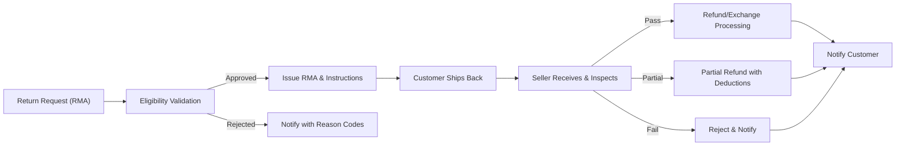

# E-commerce Shopping Mall — Requirements Analysis Report

## Executive Overview
A multi-seller e-commerce platform enables customers to discover products, select variants (SKU-level), build carts and wishlists, place and pay for orders, track shipping, review purchases, and manage cancellations/returns/refunds. Sellers onboard, publish compliant listings with SKU-level inventory and pricing, fulfill orders, and receive payouts. Admins govern categories, enforce policies, resolve disputes, moderate content, and oversee platform health. Business requirements in this report are written in natural language with EARS-style statements and avoid technical implementation details.

## Vision, Scope, and Objectives
- Vision: Provide a trustworthy marketplace with clear variants, accurate availability, transparent pricing/shipping/taxes, reliable delivery updates, and fair post-purchase policies.
- Scope (MVP): Registration/login with address management; catalog with categories, search, and SKU variants; cart and wishlist; checkout and payment; order tracking and shipping updates; reviews/ratings; seller onboarding and product/inventory management; order history and cancellation/refund requests; admin dashboard for governance.
- Objectives:
  - Reduce friction in discovery and checkout.
  - Maintain accurate SKU inventory to prevent oversell.
  - Offer predictable fulfillment and timely notifications.
  - Ensure clear, fair after-sales support and dispute resolution.

## Actors and Access
- Customer: Purchases, manages addresses, carts, wishlists, orders, returns/refunds, and reviews.
- Seller: Onboards store, creates products with variants, manages SKU inventory/pricing, fulfills orders, handles returns/refunds, views statements.
- Admin: Governs categories and policies, moderates content, manages disputes/fraud, configures fees, oversees operations and compliance.

Permissions (business-level):
- THE platform SHALL restrict customers to their own data (profile, addresses, cart, orders, reviews).
- THE platform SHALL restrict sellers to their own store data (listings, SKUs, orders, inventory, statements) and exclude access to other sellers’ data.
- THE platform SHALL allow admins to perform governance actions with least-privilege by sub-role.
- WHEN an account is unverified or suspended, THE platform SHALL limit access to sensitive actions accordingly.

## Assumptions and Out-of-Scope
Assumptions:
- Multi-seller marketplace; orders may split by seller during fulfillment.
- Single-currency MVP; potential multi-currency later.
- Transactional notifications via durable channels (e.g., email) are available.

Out-of-Scope (MVP):
- Loyalty points and gift cards (beyond coupons).
- Advanced warehouse routing, cross-border tax automation.
- Storefront UI design and any API/database specifications.

## 1) Registration, Authentication, and Sessions
EARS requirements:
- THE platform SHALL allow registration for customers and sellers using unique email and compliant password.
- WHEN registration is successful, THE platform SHALL set account to "unverified" and send verification.
- WHEN email is verified within validity, THE platform SHALL activate the account for sensitive actions (checkout, listing management).
- WHEN login attempts exceed the policy threshold, THE platform SHALL lock the account temporarily and communicate recovery steps.
- WHERE multi-factor authentication is enabled, THE platform SHALL require a second factor for login and high-risk actions.
- THE platform SHALL provide logout and "logout all devices" options; WHEN requested, THE platform SHALL revoke active sessions within 60 seconds.
- THE platform SHALL provide password reset via time-limited instructions and SHALL not disclose if an email exists in user-facing messages.

## 2) Address Management
EARS requirements:
- THE platform SHALL allow customers to create, update, delete, and set defaults for shipping and billing addresses.
- WHEN a new default is set, THE platform SHALL unset the previous default of that type.
- IF an address is linked to an open order, THEN THE platform SHALL block deletion and allow edits per policy constraints.
- WHEN checkout begins, THE platform SHALL validate deliverability for the selected shipping address.

## 3) Catalog, Categories, Attributes, and Variants (SKU)
EARS requirements:
- THE catalog SHALL organize products into a hierarchical category taxonomy (1–5 levels) with unique slugs.
- THE listing workflow SHALL enforce category-required attributes and content policies.
- THE catalog SHALL allow variant options (e.g., color, size) that generate unique SKUs per product; duplicate option combinations SHALL be rejected.
- WHEN a SKU is selected, THE platform SHALL display SKU-specific price, images, and stock status.
- IF a SKU has zero sellable inventory and backorders are disabled, THEN THE platform SHALL block add-to-cart for that SKU.

## 4) Search, Browse, Filters, and Sort
EARS requirements:
- THE platform SHALL support category browse and keyword search with faceted filters and sorting by relevance, newest, best-selling, price, and rating.
- WHEN filters are applied, THE platform SHALL use OR within a facet and AND across facets.
- IF no results match, THEN THE platform SHALL suggest alternatives (relaxed filters, synonyms, related categories).

## 5) Cart and Wishlist
EARS requirements:
- THE platform SHALL maintain one active cart per authenticated customer and a session-bound cart for guests.
- WHEN a SKU is added to cart, THE platform SHALL validate availability, min/max quantity, and policy constraints.
- WHEN cart structure changes, THE platform SHALL recalculate estimated totals (items, promotions, taxes, shipping) immediately.
- THE platform SHALL allow a private wishlist per authenticated customer and prevent duplicate entries for the same product-variant pair.
- WHEN a guest authenticates with a non-empty cart, THE platform SHALL merge carts with revalidation and clear reasons for any dropped lines.

## 6) Checkout, Promotions, and Payment
EARS requirements:
- WHEN checkout starts, THE platform SHALL re-validate prices and availability and establish a time-limited price lock (e.g., 15 minutes).
- THE platform SHALL allow address and shipping selection per shipment group (seller split orders) and compute shipping costs accordingly.
- WHEN a coupon is applied, THE platform SHALL validate eligibility (dates, usage limits, product/category constraints) and apply deterministic allocation.
- WHEN payment authorization succeeds, THE platform SHALL create exactly one customer-facing order and seller sub-orders as needed, convert reservations to commitments, and send confirmation.
- IF authorization fails or times out, THEN THE platform SHALL not create an order and SHALL preserve the cart for retry.

## 7) Orders, Shipments, Tracking, and Exceptions
EARS requirements:
- THE order lifecycle SHALL include: Pending Payment, Confirmed, In Fulfillment, Partially Shipped, Shipped, Out for Delivery, Delivered, Completed, Cancelled, Refunded/Partially Refunded.
- THE shipment lifecycle SHALL include: Label Created, Ready for Pickup, In Transit, Out for Delivery, Delivered, Exception, Returned to Sender.
- WHEN tracking is added or updated, THE platform SHALL notify the customer and update shipment and aggregate order statuses.
- WHEN a delivery exception occurs, THE platform SHALL record categorized reasons and provide next steps to the customer.

## 8) Inventory Management per SKU
EARS requirements:
- THE platform SHALL maintain on-hand, reserved, and available-to-promise (ATP) counters per SKU per seller.
- WHEN checkout initiates payment authorization, THE platform SHALL create time-limited reservations for each SKU.
- WHEN authorization fails or session expires, THE platform SHALL release reservations immediately.
- WHERE backorders are enabled, THE platform SHALL accept orders beyond ATP up to configured limits and allocate FIFO upon replenishment.
- WHERE preorders are enabled, THE platform SHALL accept orders before availability up to cap and prioritize fulfillment at release.

## 9) Reviews and Ratings
EARS requirements:
- WHEN an order line is delivered, THE platform SHALL allow the purchasing customer to review the exact SKU within the policy window.
- THE platform SHALL accept integer ratings 1–5, enforce content policy, and allow one seller response per review.
- WHEN content is flagged or violates policy, THE platform SHALL queue for moderation and hide or redact as required.

## 10) Cancellations, Returns (RMA), Refunds, Exchanges
EARS requirements:
- THE platform SHALL allow pre-shipment cancellations for unshipped items within policy windows; auto-approve within 30 minutes of order confirmation if fulfillment not started.
- WHEN cancellation is approved, THE platform SHALL void authorization if not captured or initiate refund if captured and release inventory holds.
- WHEN an RMA is requested within eligibility, THE platform SHALL validate reason/timing, issue an RMA with instructions, and track return shipment.
- WHEN a return is inspected, THE platform SHALL compute refund amounts (including taxes and shipping as policy dictates) and notify outcomes.
- WHERE exchanges are allowed, THE platform SHALL support direct swaps for same-product variants subject to stock; otherwise process as return + new order.

## 11) Seller Portal
EARS requirements:
- THE platform SHALL collect business details and verification documents before activating a seller store.
- WHILE a store is pending verification, THE platform SHALL block listing publication and order receipt.
- THE platform SHALL allow sellers to create products, define variant options, generate SKUs, set per-SKU price/inventory, and manage orders and shipments.
- THE platform SHALL provide statements summarizing sales, fees, adjustments, refunds, and payouts per cycle.

## 12) Admin Operations and Governance
EARS requirements:
- THE platform admin capability SHALL support category and attribute governance, review moderation, dispute handling, fee configuration, and policy enforcement with audit logs.
- WHEN sensitive actions occur (e.g., suspension, payout hold, fee change), THE platform SHALL require reason codes and record actor identity and timestamp.
- WHERE dual-control is required, THE platform SHALL enforce proposer/approver separation for irreversible or high-impact actions.

## 13) Notifications and Communications
EARS requirements:
- WHEN order, shipping, cancellation, return, or refund events occur, THE platform SHALL send transactional notifications to relevant parties within 60 seconds.
- WHEN security-sensitive events occur (password reset, new sign-in), THE platform SHALL notify the user within 30 seconds.
- THE platform SHALL respect user preferences for marketing communications and maintain an in-app archive for transactional/security messages.

## 14) Security, Privacy, and Compliance
EARS requirements:
- THE platform SHALL apply least-privilege access to customer and seller data and segregate seller data by store.
- THE platform SHALL support user rights requests (access, rectification, deletion) within statutory timeframes and verify identity before fulfilling.
- THE platform SHALL retain order/tax records for statutory periods and delete or anonymize personal data upon account deletion subject to legal holds.
- THE platform SHALL avoid exposing payment instruments to sellers and limit payment metadata to what is necessary for reconciliation.

## 15) Performance and SLA Expectations (User-Perceived)
EARS requirements:
- WHEN a customer views a product page, THE platform SHALL respond at P95 ≤ 1.2 seconds; search at P95 ≤ 2.0 seconds; place order at P95 ≤ 3.0 seconds.
- WHEN a seller marks an order as shipped, THE platform SHALL reflect status at P95 ≤ 1.5 seconds.
- THE platform SHALL target monthly availability of ≥ 99.9% for checkout and authentication with planned maintenance in low-traffic windows.
- THE platform SHALL reflect inventory availability changes in discovery within 5 minutes and update order status within 1 minute of state change.

## 16) Error Handling and Edge Cases (Cross-Cutting)
EARS requirements:
- IF a SKU becomes unavailable between cart and checkout, THEN THE platform SHALL block order creation for that line and propose quantity reduction or removal.
- IF a coupon is ineligible (expired, min spend not met, excluded category), THEN THE platform SHALL reject with a clear business reason and preserve checkout state.
- IF address fails deliverability, THEN THE platform SHALL require correction before proceeding.
- IF duplicate submissions occur during payment confirmation, THEN THE platform SHALL produce a single order and deduplicate payments.
- IF tracking regression events arrive (older states), THEN THE platform SHALL ignore regression for status while retaining the event in audit.

## 17) Acceptance Criteria (Business-Level)
- WHEN valid registration data is submitted, THE platform SHALL create an account, send verification, and respond within 2 seconds (excluding email delivery).
- WHEN a customer adds a valid SKU within allowed quantity to cart, THE platform SHALL recalculate totals within 2 seconds and reflect changes.
- WHEN payment authorization succeeds, THE platform SHALL create one customer order with seller sub-orders and send confirmation within 3 seconds.
- WHEN a shipment is marked delivered, THE platform SHALL display delivered status to the customer within 1 minute and permit reviews within policy window.
- WHEN a return is approved and inspected as acceptable, THE platform SHALL initiate refund within 5 business days and notify the customer.

## 18) Visual Flows (Mermaid)

Purchase Lifecycle (Customer + Seller):

Returns and Refunds (RMA):

## 19) Consolidated EARS Requirement Index
- THE platform SHALL restrict data access by actor and store.
- THE catalog SHALL enforce category-required attributes and variant/SKU rules.
- WHEN checkout begins, THE platform SHALL re-validate price and availability and lock prices for a limited window.
- WHEN payment authorization succeeds, THE platform SHALL create one order and notify parties.
- WHEN tracking updates occur, THE platform SHALL update shipment status and recalculate order aggregate state.
- WHEN a cancellation is approved, THE platform SHALL void or refund as applicable and release holds.
- WHEN an RMA is approved, THE platform SHALL issue instructions and deadlines; after inspection, THE platform SHALL calculate and initiate refund per policy.
- THE platform SHALL allow reviews for delivered order lines within policy and moderate violations.
- THE platform SHALL maintain per-SKU inventory with reservations, backorders, and preorders per policy.
- THE platform SHALL send transactional notifications for key milestones within stated timelines.
- THE platform SHALL meet user-perceived performance and availability targets for core operations.

End of requirements analysis report.