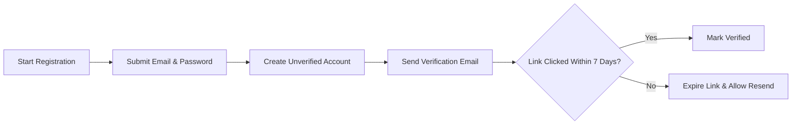
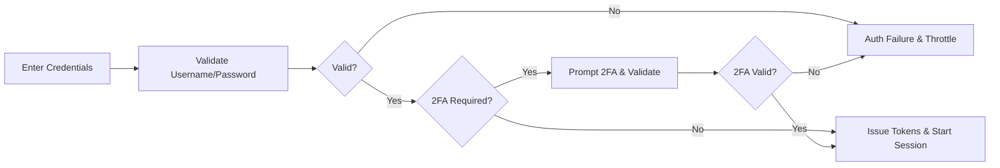
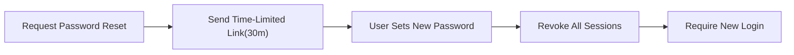
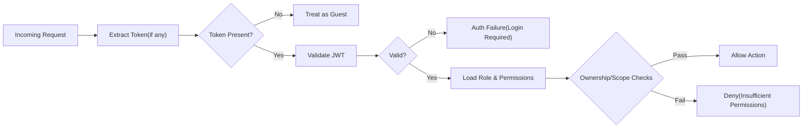
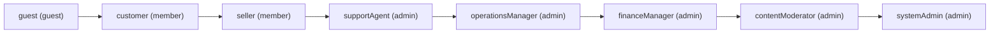

# 02 – User Roles and Permissions Requirements (shoppingMall)

Business requirements for authentication, authorization, user roles, and permissions for the shoppingMall platform. Describes WHAT must happen in business terms; technical details (APIs, schemas, vendor endpoints, UI) are intentionally excluded. JWT/session behaviors are expressed in business language to remove ambiguity for backend developers.

## 1. Introduction and Scope
- Purpose: Define authentication concepts, sessions, roles, permission boundaries, evaluation principles, address/identity rules, audit/compliance, and performance targets for access control.
- Audience: Backend developers, QA, product managers, operations and security stakeholders.
- Scope: All business rules determining who may perform which action, under which conditions, and with what validations. Out of scope: UI layouts, database design, API specifications, or infrastructure choices.

## 2. Authentication Concepts and Sessions

### 2.1 Core Authentication Functions
- THE shoppingMall platform SHALL support: registration, login, logout, email verification, password reset, password change, session revocation, and optional two-factor authentication (2FA).
- THE shoppingMall platform SHALL support guest sessions and authenticated sessions with clear upgrade from guest to customer upon login/registration.
- THE shoppingMall platform SHALL treat checkout, payout, role assignment, and policy changes as high-risk actions that may require step-up verification.

### 2.2 JWT Token Management (Business Requirements)
- THE shoppingMall platform SHALL issue access and refresh tokens using JWT semantics in business terms.
- THE access token SHALL expire within 20 minutes of issuance.
- THE refresh token SHALL expire within 14 days of issuance.
- THE JWT payload SHALL include userId, role, effective permissions, and where applicable sellerId for seller accounts.
- WHEN role or permissions change materially (e.g., seller onboarding approved, admin promotion), THE shoppingMall platform SHALL invalidate outstanding refresh tokens and require fresh login.
- WHEN a password is changed or account recovery completes, THE shoppingMall platform SHALL revoke all existing sessions and refresh tokens immediately.
- IF a refresh token is invalid, expired, or revoked, THEN THE shoppingMall platform SHALL deny refresh and require interactive login.
- WHERE 2FA is enabled, THE shoppingMall platform SHALL require a valid second factor at login and before high-risk actions.

### 2.3 Sessions and Devices
- THE shoppingMall platform SHALL allow concurrent sessions across devices and SHALL track device metadata for audit and security notifications.
- WHERE an account is flagged for risk (unusual geo/velocity), THE shoppingMall platform SHALL require step-up verification before granting access.
- WHEN a user logs out, THE shoppingMall platform SHALL invalidate the corresponding access token and revoke its refresh token immediately.

### 2.4 Email Verification and Password Policies
- WHEN a user registers by email, THE shoppingMall platform SHALL send a verification message and mark the account as unverified until successful verification.
- IF an unverified user attempts actions requiring verified identity (e.g., placing an order), THEN THE shoppingMall platform SHALL block the action and prompt verification.
- THE password policy SHALL require a minimum length of 10 characters and a mix of character classes per business policy.
- IF failed login attempts exceed 10 within 10 minutes, THEN THE shoppingMall platform SHALL rate-limit or lock the account for 15 minutes.

### 2.5 Error Handling and Messaging (Authentication)
- IF credentials are invalid, THEN THE shoppingMall platform SHALL respond with an authentication failure message without revealing which field was incorrect.
- IF the account is temporarily locked, THEN THE shoppingMall platform SHALL inform the user of remaining lockout duration.
- WHEN a password reset is initiated, THE shoppingMall platform SHALL send a reset link valid for 30 minutes.

## 3. Role Hierarchy and Kinds

### 3.1 Role Kinds
- guest (kind: guest)
- customer (kind: member)
- seller (kind: member)
- supportAgent (kind: admin)
- operationsManager (kind: admin)
- financeManager (kind: admin)
- contentModerator (kind: admin)
- systemAdmin (kind: admin)

### 3.2 Principles (Least-Privilege and Separation of Duties)
- THE shoppingMall platform SHALL enforce least-privilege: roles receive only necessary permissions.
- THE shoppingMall platform SHALL avoid implicit inheritance across roles unless explicitly defined by policy.
- WHERE financial, privacy, or platform-integrity risk exists, THE shoppingMall platform SHALL require admin roles with scoped authority and, where configured, maker-checker approvals.

## 4. Role Definitions and Capabilities

### 4.1 guest (guest)
- Browses catalog and product details; reads reviews.
- Creates a transient cart and device-scoped wishlist; cannot checkout by default.
- May register and verify an account.

EARS examples:
- WHEN a guest browses, THE shoppingMall platform SHALL allow search, filter, and sort within public catalog rules.
- IF a guest attempts checkout, THEN THE shoppingMall platform SHALL require registration/login.

### 4.2 customer (member)
- Manages profile and addresses; maintains persistent cart and wishlist.
- Places orders, pays, tracks shipments; views order history.
- Initiates cancellations and refund requests per policy.
- Submits reviews and ratings per eligibility rules.

EARS examples:
- WHEN a customer places an order, THE shoppingMall platform SHALL validate a verified email and at least one valid shipping address.
- IF a customer attempts to access another user’s order, THEN THE shoppingMall platform SHALL deny access.
- WHILE a customer is logged in, THE shoppingMall platform SHALL persist wishlist and cart server-side and sync across sessions.

### 4.3 seller (member)
- Manages store profile, products/SKUs, inventory, pricing, and promotions.
- Processes orders (own items), updates shipping status, and handles cancellations/refunds.
- Views performance metrics and payout summaries for own store.

EARS examples:
- WHEN a seller updates inventory for a SKU, THE shoppingMall platform SHALL constrain the change to SKUs owned by that seller.
- IF a seller attempts to modify another seller’s product, THEN THE shoppingMall platform SHALL deny the change.
- WHILE an order contains multiple sellers, THE shoppingMall platform SHALL limit each seller’s view to their own line items.

### 4.4 supportAgent (admin)
- Views and manages customer orders within thresholds; assists with cancellations/refunds and disputes.

EARS examples:
- WHEN a supportAgent processes a customer cancellation within policy, THE shoppingMall platform SHALL allow order or line-level cancellation subject to payment state.
- IF a supportAgent attempts a refund above threshold, THEN THE shoppingMall platform SHALL require financeManager approval.

### 4.5 operationsManager (admin)
- Oversees catalog integrity, categories, policy enforcement, feature flags, and order monitoring.

EARS examples:
- WHEN an operationsManager archives a category, THE shoppingMall platform SHALL ensure no active products remain unassigned.
- IF an operationsManager changes a policy with financial impact, THEN THE shoppingMall platform SHALL require maker-checker approval by financeManager or systemAdmin.

### 4.6 financeManager (admin)
- Approves and processes refunds and chargebacks; manages payouts and reconciliation; views/export financial reports.

EARS examples:
- WHEN a financeManager approves a refund, THE shoppingMall platform SHALL capture a reason code and link the approval to the initiator in the audit trail.
- IF a financeManager modifies seller payout banking details, THEN THE shoppingMall platform SHALL require verification steps and dual control where configured.

### 4.7 contentModerator (admin)
- Moderates reviews and seller-generated content per policy.

EARS examples:
- WHEN a contentModerator flags a review as violating policy, THE shoppingMall platform SHALL hide it from public view and retain it for audit.
- IF a contentModerator removes content, THEN THE shoppingMall platform SHALL notify the content owner with policy references.

### 4.8 systemAdmin (admin)
- Manages users and roles; has global configuration authority under audit.

EARS examples:
- WHEN a systemAdmin assigns or revokes roles, THE shoppingMall platform SHALL update effective permissions immediately and invalidate tokens as required.
- IF a systemAdmin exports audit logs, THEN THE shoppingMall platform SHALL enforce export constraints and record the export with justification.

## 5. Permission Evaluation Principles
- THE shoppingMall platform SHALL evaluate authorization using role, explicit permissions, resource ownership, data sensitivity, and policy configuration.
- WHERE ownership applies, THE shoppingMall platform SHALL match requester identity (userId or sellerId) to the resource owner identifiers.
- WHEN multiple policies apply, THE shoppingMall platform SHALL apply the most restrictive policy unless a higher-priority exception is configured.
- IF no policy grants access, THEN THE shoppingMall platform SHALL deny by default.
- WHERE time/state constraints apply (e.g., cancellation windows), THE shoppingMall platform SHALL enforce them consistently.

Performance target:
- WHEN a user requests access to a resource, THE shoppingMall platform SHALL decide within 100 ms under normal load.

## 6. Permission Matrix by Feature Area (Business)
Legend: ✅ allowed, ❌ not allowed, 🔒 allowed with constraints/approval.

| Action | guest | customer | seller | supportAgent | operationsManager | financeManager | contentModerator | systemAdmin |
|---|---|---|---|---|---|---|---|---|
| Browse catalog & search | ✅ | ✅ | ✅ | ✅ | ✅ | ✅ | ✅ | ✅ |
| View product detail & reviews | ✅ | ✅ | ✅ | ✅ | ✅ | ✅ | ✅ | ✅ |
| Create/maintain cart | ✅ (session) | ✅ | ✅ (own purchases) | ❌ | ❌ | ❌ | ❌ | ✅ |
| Wishlist | ❌ | ✅ | ✅ | ❌ | ❌ | ❌ | ❌ | ✅ |
| Checkout & place order | ❌ | ✅ | ✅ (as buyer) | ❌ | ❌ | ❌ | ❌ | ✅ |
| View own order history | ❌ | ✅ | ✅ | ❌ | ❌ | ❌ | ❌ | ✅ (controlled) |
| Cancel own order | ❌ | ✅ | ✅ | 🔒 (assist) | 🔒 | 🔒 | ❌ | ✅ |
| Initiate refund request | ❌ | ✅ | ✅ | 🔒 (assist) | 🔒 | 🔒 (approve) | ❌ | ✅ |
| Approve refunds | ❌ | ❌ | ❌ | ❌ | 🔒 | ✅ | ❌ | ✅ |
| Seller: manage store profile | ❌ | ❌ | ✅ | ❌ | 🔒 | ❌ | ❌ | ✅ |
| Seller: manage products/SKUs | ❌ | ❌ | ✅ (own) | ❌ | 🔒 (oversight) | ❌ | ❌ | ✅ |
| Seller: manage inventory | ❌ | ❌ | ✅ (own) | ❌ | 🔒 (oversight) | ❌ | ❌ | ✅ |
| Process/ship orders (own) | ❌ | ❌ | ✅ | ❌ | 🔒 (monitor) | ❌ | ❌ | ✅ |
| Update shipping status (own) | ❌ | ❌ | ✅ | ❌ | 🔒 (monitor) | ❌ | ❌ | ✅ |
| Moderate reviews/content | ❌ | ❌ | ❌ | ❌ | 🔒 | ❌ | ✅ | ✅ |
| Manage categories/taxonomy | ❌ | ❌ | ❌ | ❌ | ✅ | ❌ | ❌ | ✅ |
| Manage users and roles | ❌ | ❌ | ❌ | ❌ | 🔒 (limited) | 🔒 (finance scope) | ❌ | ✅ |
| View/export audit logs | ❌ | ❌ | ❌ | 🔒 (case-bound) | 🔒 | 🔒 | ❌ | ✅ |
| Configure policies | ❌ | ❌ | ❌ | ❌ | ✅ | 🔒 (financial) | ❌ | ✅ |
| Financial reports & reconciliation | ❌ | ❌ | ❌ | ❌ | 🔒 | ✅ | ❌ | ✅ |
| Payouts to sellers | ❌ | ❌ | ❌ | ❌ | ❌ | ✅ | ❌ | ✅ |

Notes: “🔒” indicates constraints such as ownership checks, thresholds, approvals, or maker-checker.

## 7. Address and Identity Management Rules

### 7.1 Customer Address Management
- THE shoppingMall platform SHALL allow up to 10 addresses per customer labeled by type (e.g., “Shipping”, “Billing”).
- WHEN a customer sets a default shipping or billing address, THE shoppingMall platform SHALL ensure only one default per type.
- IF an address fails validation (postal code, region), THEN THE shoppingMall platform SHALL block its use for checkout.
- WHEN a customer deletes an address used by an open order, THE shoppingMall platform SHALL prevent deletion and allow editing only.
- WHERE normalization is supported, THE shoppingMall platform SHALL store both user-entered and normalized forms.

### 7.2 Seller Identity and Payout Addresses
- THE shoppingMall platform SHALL require a legal business address and a pickup/return address before listing products.
- WHEN seller identity or payout details change, THE shoppingMall platform SHALL require re-verification by operationsManager and/or financeManager.
- IF seller verification is pending or failed, THEN THE shoppingMall platform SHALL block publishing and payouts.

### 7.3 Staff-Assisted Address Edits
- WHERE a supportAgent edits a customer address, THE shoppingMall platform SHALL require a support case and explicit customer consent recorded in the audit log.
- WHEN operationsManager performs bulk corrections, THE shoppingMall platform SHALL record the policy reference and scope of change.

### 7.4 Identity Verification
- THE shoppingMall platform SHALL require email verification before a customer’s first checkout.
- WHERE higher-risk operations occur, THE shoppingMall platform SHALL enforce 2FA if enabled.
- THE shoppingMall platform SHALL require KYC/KYB for sellers per region before payouts.

## 8. Authentication Workflows (Business)

### 8.1 Registration and Email Verification (Flow)

EARS requirements:
- WHEN a user registers, THE shoppingMall platform SHALL create an unverified account and send verification.
- IF verification is not completed within 7 days, THEN THE shoppingMall platform SHALL expire the link and allow resending.
- WHEN verification succeeds, THE shoppingMall platform SHALL grant access to actions requiring verified identity.

### 8.2 Login with Optional 2FA (Flow)

EARS requirements:
- WHEN credentials are valid, THE shoppingMall platform SHALL check whether 2FA is required and proceed accordingly.
- IF 2FA validation fails, THEN THE shoppingMall platform SHALL deny login and preserve the ability to retry within rate limits.

### 8.3 Password Reset and Session Revocation (Flow)

EARS requirements:
- WHEN password reset is requested, THE shoppingMall platform SHALL send a time-limited link (30 minutes) and, upon success, revoke all sessions.
- WHEN password is changed, THE shoppingMall platform SHALL notify the account owner and invalidate existing tokens immediately.

## 9. Audit and Logging Requirements (Business)
- THE shoppingMall platform SHALL log: registration, login success/failure, logout, token issuance/refresh/revocation, password resets; authorization denials with actor, resource, reason; admin actions (role assignment, policy changes, moderation, refunds, payouts).
- WHERE logs contain sensitive fields, THE shoppingMall platform SHALL redact PII while preserving investigative utility.
- THE shoppingMall platform SHALL retain security/admin audit logs for at least 365 days; customer activity logs for at least 180 days, subject to regulation.
- IF audit exports are requested, THEN THE shoppingMall platform SHALL record requester, purpose, scope, and required approvals.

## 10. Compliance and Privacy Considerations
- THE shoppingMall platform SHALL capture and honor consent for communications, storing consent state with timestamps.
- THE shoppingMall platform SHALL support data subject rights (access, correction, deletion, export) with identity verification.
- WHERE account deletion is requested, THE shoppingMall platform SHALL pseudonymize or delete personal data except where legal retention applies (e.g., invoices, fraud prevention).
- THE shoppingMall platform SHALL avoid storing raw payment card data; only processor tokens may be referenced.
- WHERE cross-border data transfers occur, THE shoppingMall platform SHALL ensure appropriate safeguards and data residency compliance.

## 11. Performance and Reliability Expectations (AuthN/AuthZ)
- WHEN a user submits login, THE shoppingMall platform SHALL respond within 2 seconds under normal load.
- WHEN a valid refresh token is presented, THE shoppingMall platform SHALL issue a new access token within 500 ms under normal load.
- WHEN performing authorization checks, THE shoppingMall platform SHALL decide within 100 ms under normal load.
- IF authentication/authorization services degrade, THEN THE shoppingMall platform SHALL fail closed for privileged actions and provide user-friendly guidance.

## 12. Diagrams (Reference)

### 12.1 Authentication and Authorization Decision Flow

### 12.2 Role Kind Mapping Overview

## 13. EARS Requirements Catalog (Selected)

Authentication & Sessions
- WHEN a user registers, THE shoppingMall platform SHALL create an unverified account and send verification.
- IF verification is not completed within 7 days, THEN THE shoppingMall platform SHALL expire the verification link and allow resending.
- WHILE a session is active, THE shoppingMall platform SHALL enforce token expiry and refresh rules.
- IF suspicious login patterns are detected, THEN THE shoppingMall platform SHALL require step-up verification.

Authorization & Ownership
- WHEN a seller accesses order details, THE shoppingMall platform SHALL restrict visibility to that seller’s line items only.
- IF a user without appropriate role attempts a privileged action, THEN THE shoppingMall platform SHALL deny and log the attempt.
- WHERE maker-checker is configured, THE shoppingMall platform SHALL require a distinct approver for approval.

Addresses & Identity
- WHEN a customer sets a new default address, THE shoppingMall platform SHALL unset the previous default of the same type.
- IF an address fails validation, THEN THE shoppingMall platform SHALL prevent its selection at checkout.
- WHERE KYC is mandatory, THE shoppingMall platform SHALL block payouts until verification passes.

Reviews & Moderation
- WHEN a contentModerator hides a review, THE shoppingMall platform SHALL remove it from public listings and preserve it for audit.
- IF a seller flags a review, THEN THE shoppingMall platform SHALL queue it for moderation with SLA targets.

Refunds & Finance
- WHEN a refund exceeds auto-approval limits, THE shoppingMall platform SHALL route it to financeManager for approval.
- IF duplicate refund attempts occur, THEN THE shoppingMall platform SHALL block duplicates and reference the original decision.

## 14. Glossary
- Access Token: Short-lived token granting authorization to call protected business functions.
- Refresh Token: Longer-lived token used to obtain new access tokens without re-entering credentials.
- Maker-Checker: Dual-control pattern where one user initiates a change and another user approves it.
- Ownership: Relationship binding a resource (e.g., order line, product) to a principal (userId or sellerId) used in authorization checks.
- Role Kind: Classification of role into guest/member/admin for coarse-grained privileges.

## 15. References to Related Documents
- Service overview and vision: ./01-service-overview.md
- Catalog and search: ./04-functional-requirements-product-catalog-and-search.md
- Variants and inventory: ./05-functional-requirements-product-variants-and-inventory.md
- Cart and wishlist: ./06-functional-requirements-cart-and-wishlist.md
- Checkout, payment, and orders: ./07-functional-requirements-checkout-payment-and-orders.md
- Order tracking and shipping: ./08-functional-requirements-order-tracking-and-shipping.md
- Reviews and ratings: ./09-functional-requirements-reviews-and-ratings.md
- Seller portal: ./10-functional-requirements-seller-portal.md
- Admin dashboard: ./11-functional-requirements-admin-dashboard.md
- Business rules, data lifecycle, and events: ./12-business-rules-data-lifecycle-and-events.md
- Non-functional requirements: ./13-non-functional-requirements-performance-security-compliance.md
- Exceptions and edge cases: ./15-exception-handling-and-edge-cases.md
