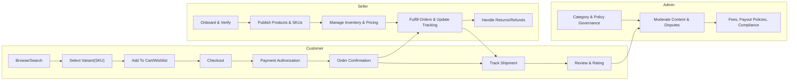
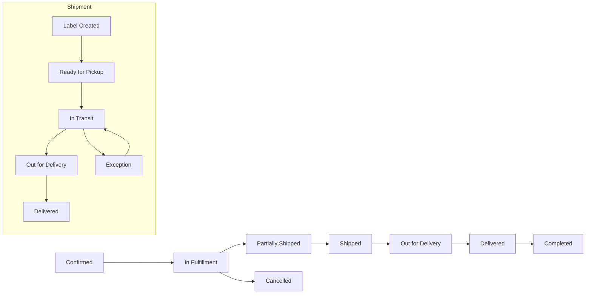
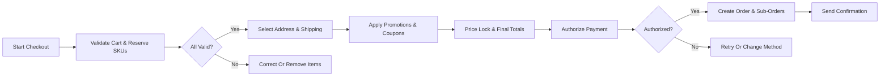
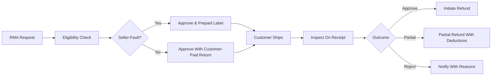
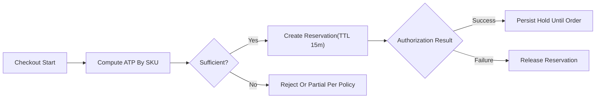

# shoppingMall — Requirements Analysis and Business Specification

## 1. Vision and Value
shoppingMall is a multi-seller e-commerce marketplace enabling customers to discover products, compare variants (SKU-level), save items, purchase securely, track shipments, and manage post-purchase needs. Sellers operate stores, publish compliant listings, manage inventory and orders, and receive predictable payouts. Administrators govern categories, policies, reviews, disputes, fees, and platform health. Outcomes prioritize trust, clarity, reliability, and policy-backed fairness throughout the commerce lifecycle.

## 2. Actors, Roles, and States
- Customer: End consumer who browses, saves products, purchases, tracks, reviews, and manages returns/refunds for their orders.
- Seller: Merchant operating a store; publishes listings, manages SKUs, inventory, orders, shipments, returns/refunds, and responds to reviews.
- Admin: Platform operator with sub-roles for catalog governance, moderation, operations, risk/compliance, finance, and support.

Business states:
- Customer account: unverified, active, suspended, deleted.
- Seller store: onboarding, verification_pending, verified_active, limited, suspended, deleted.
- Admin account: active, suspended.

EARS:
- THE platform SHALL enforce business-level account states that govern permitted actions by actor and state.
- WHEN an account is in "unverified" state, THE platform SHALL restrict high-risk features (checkout, reviews, listing publication).
- IF an account is "suspended", THEN THE platform SHALL deny non-support actions and record the denial with reason code.

## 3. Scope and Non-Scope
Scope includes end-to-end marketplace operations: registration/login with addresses; catalog, categories, search; product variants (SKU) and inventory per SKU; cart and wishlist; checkout and payment; order lifecycle with shipping and tracking; reviews and ratings; seller portal; order history; cancellations, returns, refunds; admin governance; notifications and reporting; security/privacy/compliance; performance and SLA expectations.

Out of scope: Technical implementation details (APIs, database schemas, vendor selections, infrastructure); UI/UX design.

## 4. Core Business Processes Overview

## 5. Authentication, Accounts, and Address Management
EARS:
- THE platform SHALL allow registration for customers and sellers using a unique email and a compliant password; acceptance of terms and privacy policy SHALL be required.
- WHEN registration succeeds, THE platform SHALL set account state to "unverified" and dispatch verification within 60 seconds p95.
- WHEN email verification is completed within validity, THE platform SHALL transition the account to "active".
- THE platform SHALL allow secure login for customers, sellers, and admins with rate limiting and temporary lockout after repeated failures.
- WHERE multi-factor authentication is enabled, THE platform SHALL require a second factor for login and high-risk actions (payout changes, password updates).
- THE platform SHALL provide logout and a "logout all devices" function, revoking sessions within 60 seconds.
- THE platform SHALL provide password reset via time-limited link; upon password change, prior sessions SHALL be revoked unless policy allows trusted sessions.
- THE platform SHALL allow customers to create, view, update, and delete their own addresses; exactly one default shipping and one default billing address SHALL be permitted.
- WHEN a new address is marked default, THE platform SHALL unset the previous default of that type.
- IF an address is linked to an open order, THEN THE platform SHALL restrict deletion and allow only policy-safe edits.

## 6. Catalog, Categories, Search, and Variants (SKU)
EARS:
- THE catalog SHALL support a hierarchical category taxonomy (1–5 levels) with unique slugs and governance for required attributes per category.
- WHEN a product is created, THE catalog SHALL require: title, primary category, seller, condition, base price, tax class, at least one image, and a sufficient description.
- WHERE moderation is enabled, THE product SHALL remain non-discoverable until approved.
- THE catalog SHALL distinguish descriptive attributes from option dimensions used to generate SKUs.
- THE platform SHALL support up to 5 option dimensions; each unique combination SHALL produce a unique SKU within the product.
- IF a duplicate SKU combination is submitted, THEN activation SHALL be rejected with duplication reason.
- THE search SHALL support keyword queries, attribute filters, sorting (relevance, newest, best-selling, price, rating), synonyms, and typo tolerance.
- WHEN a valid variant selection is made, THE platform SHALL display SKU-specific price, stock, and shipping estimate.

## 7. Cart and Wishlist
EARS:
- THE platform SHALL allow one active cart per authenticated customer and a session-bound cart for guests.
- WHEN adding a SKU to cart, THE platform SHALL validate sellable inventory, per-SKU min/max/increment rules, and seller restrictions.
- WHEN quantity is updated, THE platform SHALL revalidate availability and reprice estimates.
- IF a SKU is discontinued or out of stock without backorders, THEN the cart SHALL block checkout for that line and require removal.
- THE platform SHALL compute cart estimates (subtotal, discounts, taxes, shipping) and recompute on structural changes and at checkout start.
- THE platform SHALL provide a persistent wishlist for authenticated customers; duplicates SHALL be prevented and unavailable items flagged.
- WHEN a guest authenticates, THE platform SHALL merge the guest cart into the customer cart with revalidation and clear reasons for any drops or caps.

## 8. Checkout, Promotions, Payment Authorization/Capture
EARS:
- THE platform SHALL restrict checkout to authenticated customers with a valid cart they own.
- WHEN checkout starts, THE platform SHALL validate availability and reserve required quantities with a time-limited hold (default 15 minutes, admin-configurable).
- THE platform SHALL lock prices and applied discounts for a limited window; upon expiry, revalidation SHALL occur before continuation.
- THE platform SHALL require a deliverable shipping address and SHALL compute eligible shipping methods per seller/shipment group.
- WHEN a coupon is applied, THE platform SHALL validate eligibility (dates, usage limits, product/category inclusion, customer) and apply deterministically in sequence with automatic promotions and gift cards.
- WHEN payment authorization is requested, THE platform SHALL attempt authorization for the final payable amount and SHALL present remediation for failures.
- WHERE deferred capture is configured, THE platform SHALL support partial capture per shipment; immediate capture SHALL also be supported per policy.
- WHEN authorization succeeds, THE platform SHALL create exactly one customer-facing order with seller sub-orders as needed, convert reservations to commitments, and send confirmation within stated SLAs.

## 9. Orders, Shipments, Tracking, and Notifications
EARS:
- THE order lifecycle SHALL include: "Pending Payment", "Confirmed", "In Fulfillment", "Partially Shipped", "Shipped", "Out for Delivery", "Delivered", "Completed", "Cancelled", and "Refunded/Partially Refunded".
- THE shipment lifecycle SHALL include: "Label Created", "Ready for Pickup", "In Transit", "Out for Delivery", "Delivered", "Exception", "Returned to Sender".
- WHEN tracking events advance milestones, THE platform SHALL update shipment status and recompute aggregate order status.
- WHEN milestones occur (order confirmed, shipped, out for delivery, delivered, exception), THE platform SHALL notify the customer within minutes and display localized timestamps (default Asia/Seoul where user timezone is unknown).
- IF no tracking updates are received within a configured interval post "In Transit", THEN the shipment SHALL be flagged for investigation and stakeholders notified.

Mermaid state overview:

## 10. Reviews and Ratings
EARS:
- WHEN a purchased SKU is delivered or 7 days elapse after "Shipped" without delivery confirmation, THE platform SHALL enable a single review opportunity per order line item.
- THE platform SHALL accept integer ratings 1–5 and review text within policy limits; optional media attachments SHALL follow policy constraints.
- WHEN content violates policy, THE platform SHALL hide or remove it and notify the author with appeal options.
- THE platform SHALL allow a single public seller response per review for owned products within policy.
- THE platform SHALL compute weighted averages prioritizing verified purchases and SHALL exclude hidden/removed content from public aggregates.

## 11. Inventory Management, Reservations, Backorders, Preorders
EARS:
- THE platform SHALL track on-hand, reserved, and available-to-promise at SKU per seller.
- WHEN checkout reserves quantities, THE platform SHALL reduce available-to-promise and release upon failure or timeout.
- WHEN shipment pick/pack occurs, THE platform SHALL decrement on-hand and reduce reserved accordingly.
- WHERE backorders are enabled, THE platform SHALL allow sales beyond on-hand up to defined limits and allocate FIFO upon replenishment.
- WHERE preorders are enabled, THE platform SHALL accept orders up to a cap before availability date and prioritize fulfillment at release.
- IF a seller attempts to adjust inventory for another seller’s SKU, THEN THE platform SHALL deny the operation.

## 12. Order History, Cancellations, Returns, and Refunds
EARS:
- THE platform SHALL display order history with filters by status and date and provide line-level status timelines.
- WHEN a valid pre-shipment cancellation request is submitted, THE platform SHALL auto-approve in the immediate window (e.g., 30 minutes) or route to seller decision with SLA; upon approval, authorization SHALL be voided or refund queued if captured.
- WHEN a return is requested within policy windows, THE platform SHALL validate eligibility, issue an RMA with instructions, and track return shipment and inspection.
- WHEN inspection approves refund, THE platform SHALL compute itemized refund including taxes and shipping per policy (seller-fault vs change-of-mind) and initiate refund within policy timelines.
- IF a return is rejected, THEN the decision and reason SHALL be provided with appeal options where applicable.

## 13. Seller Portal: Onboarding, Catalog, Fulfillment, Payouts
EARS:
- THE seller portal SHALL collect required business and tax information and place the store in "verification_pending" until approved.
- WHILE in "verification_pending", THE seller portal SHALL block listing publication and order receipt.
- WHEN products are authored, THE seller portal SHALL enforce category-required attributes, SKU uniqueness per seller, and content policies.
- THE seller portal SHALL present paid orders within seconds of confirmation and support partial shipments with carrier/tracking capture.
- THE seller portal SHALL support inventory adjustments with required reason codes and SHALL prevent dropping below reserved quantities.
- THE seller portal SHALL generate periodic statements summarizing sales, fees, refunds, reserves, adjustments, and net payouts and SHALL display payout statuses (scheduled, in process, completed, on hold).

## 14. Admin Dashboard: Governance, Moderation, Disputes, Policies
EARS:
- THE admin dashboard SHALL support sub-roles (catalog manager, moderation manager, operations manager, risk/compliance admin, finance admin, support agent, auditor) with least-privilege access.
- THE admin dashboard SHALL allow category/attribute governance, restricted item approvals, review moderation, dispute handling, fee/commission configuration, payout holds/releases, and audit log access.
- WHEN sensitive actions occur (account termination, mass unlisting, fee changes), THE admin dashboard SHALL require reason codes and, where policy mandates, dual control (separate proposer and approver).

## 15. Notifications, Communications, and Reporting
EARS:
- THE notification service SHALL send transactional messages for order, shipping, delivery, exception, return, and refund events within minutes of state change.
- THE notification service SHALL send security-critical messages (password reset, new sign-in, payout detail changes) within 30 seconds of event creation.
- THE notification service SHALL respect marketing preferences and quiet hours for non-transactional content and SHALL cap frequency by policy.
- THE reporting views SHALL provide customers with notification history, sellers with operational alerts and summaries, and admins with aggregate metrics and delivery outcomes.

## 16. Security, Privacy, and Compliance
EARS:
- THE platform SHALL apply least-privilege data access, tenant isolation for sellers, and restrict exposure of payment instruments to status-only views for sellers.
- THE platform SHALL process personal data only for specified, legitimate purposes and record consent where applicable.
- WHEN users exercise data rights (access, correction, deletion), THE platform SHALL acknowledge within 72 hours and fulfill within statutory timelines (typically 30 days), preserving only legally required records.
- THE platform SHALL retain audit logs of sensitive actions (authentication changes, address changes, refunds, payouts, suspensions) for at least 12 months.
- IF a personal data breach is confirmed, THEN regulators and affected users SHALL be notified per applicable laws; post-incident review SHALL be produced.

## 17. Performance, SLA, and Degradation
EARS:
- THE platform SHALL meet user-perceived P95 targets for key flows: search ≤ 2.0s; product detail ≤ 1.2s; add/update cart ≤ 1.0s; shipping options ≤ 2.0s; coupon apply ≤ 1.5s; payment authorization ≤ 2.5s; order confirmation ≤ 3.0s.
- THE platform SHALL achieve monthly availability targets: authentication and checkout ≥ 99.9%; catalog/search ≥ 99.8%; seller portal ≥ 99.8%; admin operations ≥ 99.0%.
- WHILE under resource pressure, THE platform SHALL preserve P0 functions (auth, cart, checkout, payments) over non-critical features and apply graceful degradation (simplified search, deferred notifications) with timely status communication.

## 18. Acceptance Criteria (Selected)
- WHEN a new customer completes registration with valid inputs, THE platform SHALL create account, send verification within 60 seconds, and permit login; checkout SHALL remain blocked until verification.
- WHEN a customer selects a valid variant, THE platform SHALL display the SKU price, stock, and estimated delivery and SHALL block add-to-cart for zero-ATP SKUs without backorders.
- WHEN a customer adds a SKU within available quantity, THE platform SHALL accept and update cart totals within 1 second.
- WHEN checkout begins, THE platform SHALL reserve inventory, lock prices, and present eligible shipping methods; invalid lines SHALL be highlighted with corrective guidance.
- WHEN payment authorization succeeds, THE platform SHALL create exactly one order, split by seller as needed, issue confirmation, and expose sub-orders to sellers within seconds.
- WHEN a seller posts tracking, THE platform SHALL update shipment status and notify the customer within minutes.
- WHEN a review is submitted for a delivered SKU, THE platform SHALL publish subject to moderation checks and compute weighted averages within seconds of publish.
- WHEN a valid RMA is approved and item is received in acceptable condition, THE platform SHALL initiate refund within 5 business days per policy.
- WHEN an admin suspends a seller, THE platform SHALL block listing publication, fulfillment, and payouts immediately and record reason codes.

## 19. Consolidated EARS Requirement Index
- THE platform SHALL enforce business-level account states and least-privilege access by actor.
- THE catalog SHALL require mandatory product fields and category-required attributes; SKUs SHALL be unique per product and seller.
- THE cart SHALL validate availability and policy limits on add/update and recompute estimates promptly.
- THE checkout SHALL reserve inventory, lock prices, validate shipping, and apply promotions deterministically.
- THE payment flow SHALL support authorization and capture policies, including partial capture per shipment.
- THE order lifecycle SHALL progress through defined states; shipment tracking events SHALL map to canonical milestones.
- THE review system SHALL accept verified-purchase reviews, enforce moderation, and compute weighted averages.
- THE inventory system SHALL track on-hand, reserved, ATP; support reservations, backorders, and preorders.
- THE returns module SHALL handle cancellations, RMAs, inspections, refunds with itemized calculations and timelines.
- THE seller portal SHALL cover onboarding, catalog, fulfillment, inventory controls, and payouts with statements.
- THE admin dashboard SHALL support governance, moderation, disputes, fees/policies, and audit logs with dual control where required.
- THE notification service SHALL deliver transactional and security communications within target windows and honor preferences for marketing.
- THE platform SHALL meet performance and availability targets and degrade gracefully under load.
- THE platform SHALL implement privacy, consent, retention, and incident response expectations.

## 20. Glossary
- SKU: Stock Keeping Unit; unique purchasable variant.
- ATP: Available to Promise; on-hand minus reserved (plus confirmed inbound if policy defines).
- RMA: Return Merchandise Authorization.
- Capture: Settling a previously authorized payment.
- Dual Control: Two distinct authorized roles required for a sensitive action.
- P0 Functions: Highest-priority operations (auth, cart, checkout, payments).

## 21. Visual Appendices
### 21.1 Checkout Flow (Overview)

### 21.2 Return and Refund Flow

### 21.3 Inventory Reservation During Checkout

