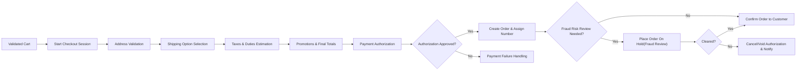
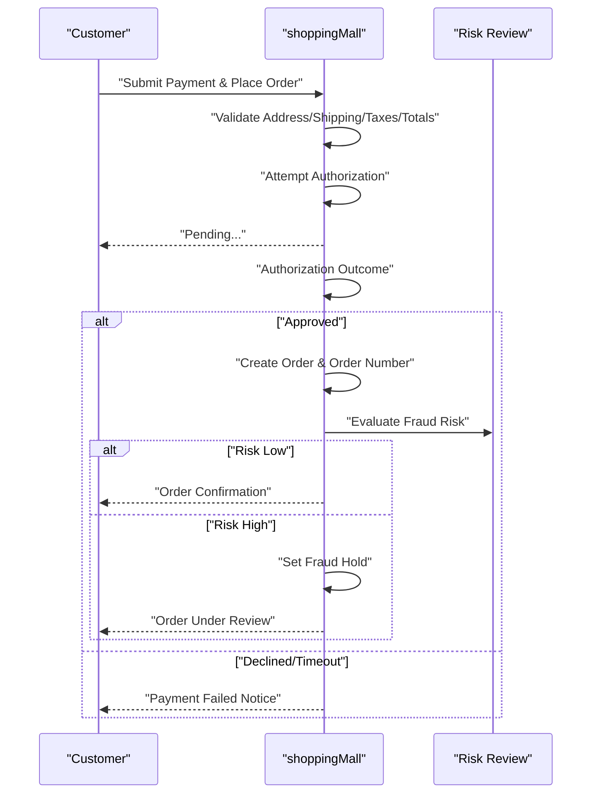

# 07 - Functional Requirements: Checkout, Payment, and Orders

This document specifies the complete business behavior for checkout, payment, and order creation within the shoppingMall platform. It defines WHAT the system must do from a business perspective and avoids HOW to implement it (no APIs, schemas, or stack details). All requirements are written to be specific, measurable, and testable.

## 1. Introduction and Scope
- Scope: The journey from a validated shopping cart to a placed order, including address validation, shipping option selection, taxes/duties estimation, payment authorization, order creation and numbering, fraud checks, and customer notifications.
- Out of Scope: Carrier API specifics, payment gateway API/tokenization details, UI/UX layouts, internal data schemas, and shipping/fulfillment state transitions after order placement (covered in the [Functional Requirements: Order Tracking and Shipping](./08-functional-requirements-order-tracking-and-shipping.md)).
- Assumptions:
  - The platform is a multi-seller marketplace; a single order may include items sold by multiple sellers and may be split into multiple shipments.
  - Checkout requires an authenticated customer account; guests may build carts but cannot submit orders unless a configuration explicitly enables guest checkout.
  - Inventory exists at the SKU level as defined in the [Functional Requirements: Product Variants and Inventory](./05-functional-requirements-product-variants-and-inventory.md).

## 2. Definitions and Roles in Scope
- Cart: A collection of SKU line items with quantities and calculated totals pending checkout.
- Checkout Session: A time-bounded process that validates cart contents, address, shipping, tax, promotions, and payment method to create an order.
- Order: A confirmed customer purchase intent tied to specific SKUs, shipping address, and payment authorization, identified by a unique order number.
- Payment Authorization: A hold on the buyer’s payment method for the order amount (full or partial captures may occur later per shipment).
- Payment Capture: The act of collecting funds (may be partial and linked to shipments).
- Roles:
  - Guest: Can browse and maintain a pre-auth cart; cannot place orders by default.
  - Customer: Can place orders, manage addresses and payment methods, and receive notifications.
  - Seller: Receives order line items for fulfillment; cannot place customer orders.
  - SupportAgent / OperationsManager / FinanceManager / SystemAdmin: Can view/hold/release/override certain order and payment states per policy.

## 3. End-to-End Checkout Overview
The following diagram shows the high-level business flow from cart to order.

## 4. Checkout Preconditions and Address Validation
### 4.1 Preconditions
- Authenticated customer is required by default.
- Cart is not empty and passes validation for SKU availability, quantity limits, and seller constraints.
- All line items have resolvable prices and variant selections.
- Promotions, vouchers, and store credits are optionally applied but must be valid and unexpired.

EARS Requirements (Preconditions)
- THE shoppingMall SHALL require the user to be an authenticated customer to submit an order.
- WHERE guest checkout is enabled by configuration, THE shoppingMall SHALL allow a guest to submit an order with a verified email and phone.
- WHEN a checkout session starts, THE shoppingMall SHALL lock mutable cart inputs (SKU, quantity, price version) for the session duration to prevent mid-checkout drift.
- IF the cart contains no items, THEN THE shoppingMall SHALL block checkout initiation and display an appropriate error.
- IF a line item is no longer available or violates minimum/maximum quantity rules, THEN THE shoppingMall SHALL block checkout initiation and show the specific offending items.

### 4.2 Address Validation
- Required fields depend on country rules but minimally include: recipient name, street address, locality/city, region/province (where applicable), postal code (where applicable), country, and phone number.
- Address must be serviceable by at least one shipping method for all items/sellers in the order.
- One shipping address per order; multi-address shipment is out of scope.

EARS Requirements (Address)
- WHEN a customer submits a shipping address, THE shoppingMall SHALL validate mandatory fields according to destination country rules.
- IF the destination is not serviceable for any item or seller, THEN THE shoppingMall SHALL block progression and list the items that cannot be shipped.
- WHEN the postal code format is invalid for the selected country, THE shoppingMall SHALL reject the address submission with a field-level error.
- WHILE the address is unverified or incomplete, THE shoppingMall SHALL disable the payment authorization step.

## 5. Shipping Options and Costs (Business Rules)
- Shipping options are computed per seller and aggregated for the order. The buyer selects one option per seller or a platform-computed optimal default where permitted.
- Options vary by destination, weight/volume, item class (e.g., hazardous, fragile), and SLA.
- Shipping cost contributes to the order total and can be discounted by promotions where allowed.

EARS Requirements (Shipping)
- WHEN the shipping address is validated, THE shoppingMall SHALL compute available shipping options for each seller’s items.
- THE shoppingMall SHALL present shipping costs, estimated delivery windows, and any surcharges at the option level.
- WHERE a seller disallows a particular carrier/SLA for specific SKUs, THE shoppingMall SHALL exclude those options for those SKUs.
- IF no shipping options satisfy the cart constraints, THEN THE shoppingMall SHALL block checkout and identify the blocking constraint.
- WHEN the buyer changes the shipping option, THE shoppingMall SHALL recalculate the order total within 2 seconds.
- THE shoppingMall SHALL support split shipments across sellers without requiring the buyer to perform multiple checkouts.

Business Rules
- Shipping cost rounding uses the currency’s minor units with banker’s rounding unless local regulation dictates otherwise.
- Free shipping promotions apply after item-level discounts and before taxes where regulations require shipping to be taxed; otherwise follow local tax law.

## 6. Taxes and Duties (Business Perspective)
- Tax calculation is based on the shipping address, seller nexus, product tax class, and applicable regulations (e.g., VAT/GST/sales tax).
- Duties and import fees may apply for cross-border shipments; estimated amounts must be disclosed before payment.
- Price display policy may be tax-inclusive (e.g., VAT) or tax-exclusive depending on locale and configuration.

EARS Requirements (Taxes & Duties)
- WHEN computing order totals, THE shoppingMall SHALL calculate taxes per line item according to product tax class and destination.
- WHERE price display is tax-inclusive, THE shoppingMall SHALL show the net price and extracted tax amount on the order summary.
- WHERE cross-border duties apply, THE shoppingMall SHALL estimate duties and include them in the order total if DDP policy is configured.
- WHERE DAP (Delivered At Place) is configured, THE shoppingMall SHALL disclose estimated duties separate from the chargeable order total and display a clear disclaimer.
- IF tax calculation fails, THEN THE shoppingMall SHALL block payment authorization and prompt a retry.

Business Rules
- Rounding occurs at the line-item level using the currency minor unit (e.g., cents) before summing to totals.
- Discounts reduce the taxable base according to local regulations.
- The platform records the tax regime used (e.g., VAT country code) as an auditable attribute of the order for compliance.

## 7. Payment Authorization and Capture (Business Flow)
- Supported business methods may include card, local bank transfer, digital wallets, and cash on delivery (COD), subject to region and seller policy. No gateway details are specified here.
- The platform performs an authorization for the full order total (items + shipping + taxes/duties − discounts/store credits).
- Captures may be partial, aligned with shipment fulfillment per seller.

### 7.1 Authorization
EARS Requirements (Authorization)
- WHEN the buyer submits payment, THE shoppingMall SHALL attempt to authorize the full payable amount for the order within the active checkout session.
- IF authorization is approved, THEN THE shoppingMall SHALL proceed to create the order and persist the authorization reference.
- IF authorization is declined or times out, THEN THE shoppingMall SHALL fail the checkout and return the decline reason category.
- WHILE authorization is pending, THE shoppingMall SHALL prevent duplicate submission by the same buyer/session.
- WHERE COD is allowed for the address and seller, THE shoppingMall SHALL create the order without a payment authorization and mark the payment method as COD.

Business Rules (Authorization)
- Authorization lifetime follows payment method policy; the platform must capture before the authorization expires.
- Authorization amount equals the order grand total at time of authorization; subsequent capture cannot exceed the authorized amount.
- Authorization retries are limited to a maximum of 2 automatic attempts within 5 minutes to avoid duplicate holds.

### 7.2 Capture
EARS Requirements (Capture)
- WHEN a shipment is confirmed for one or more line items, THE shoppingMall SHALL capture the corresponding portion of the authorized amount equal to the shipped goods and applicable shipping/taxes proportionally.
- WHERE all remaining items in an order are canceled before shipping, THE shoppingMall SHALL release or void the unused authorization amount.
- IF the authorization has expired at the time of capture, THEN THE shoppingMall SHALL attempt a re-authorization before capture.
- WHERE the order contains digital goods or instant-fulfillment items, THE shoppingMall SHALL capture immediately after order creation.

Business Rules (Capture)
- Partial captures are allowed up to the authorized amount; total captured across all shipments must not exceed the authorization.
- Shipping charges and taxes are allocated to captures proportional to the value of shipped items unless a clear seller-level policy dictates another allocation.
- For COD, capture does not apply; payment settlement occurs offline per policy.

### 7.3 Stock Reservation and Release
EARS Requirements (Reservation)
- WHEN payment authorization succeeds, THE shoppingMall SHALL reserve inventory for each ordered SKU equal to the ordered quantity.
- IF authorization fails or the checkout session expires, THEN THE shoppingMall SHALL release any temporary stock holds within 1 minute.
- WHILE an order is on fraud hold, THE shoppingMall SHALL maintain inventory reservation for up to the configured hold duration.

## 8. Order Confirmation and Numbering Rules
- Orders are created after a successful payment authorization (or COD acceptance) and assigned a unique, human-readable order number.

EARS Requirements (Order Creation & Numbering)
- WHEN authorization is approved (or COD is used), THE shoppingMall SHALL create an order record with an immutable order number.
- THE shoppingMall SHALL generate order numbers in a predictable format: "ORD-YYYYMMDD-NNNNNN" where NNNNNN is a zero-padded daily sequence per platform environment.
- THE shoppingMall SHALL prevent reuse of an order number across all time.
- IF order number generation fails, THEN THE shoppingMall SHALL not create the order and SHALL surface a retryable error.
- THE shoppingMall SHALL record the legal point-in-time of sale as the order creation timestamp in the customer’s local timezone and UTC for audit.

Parent and Child Orders (Multi-Seller)
- THE shoppingMall SHALL maintain a parent order for the buyer and child fulfillment orders per seller to enable split shipments and partial captures.
- THE shoppingMall SHALL ensure the sum of child order subtotals, shipping, taxes, and discounts equals the parent order totals.

## 9. Fraud Checks and Order Review Policies
- The platform conducts fraud checks at or immediately after authorization and may place the order on hold if risk exceeds thresholds.

EARS Requirements (Fraud & Review)
- WHEN an authorization is approved, THE shoppingMall SHALL evaluate fraud risk using available signals (address consistency, velocity, device risk, etc.).
- WHERE risk exceeds the configurable threshold, THE shoppingMall SHALL set the order status to "On Hold - Fraud Review" and prevent capture until cleared.
- IF an order is not cleared within the configured review window (e.g., 48 hours), THEN THE shoppingMall SHALL cancel the order and void the authorization if possible.
- WHEN a SupportAgent clears an order, THE shoppingMall SHALL resume the normal fulfillment flow.
- THE shoppingMall SHALL log all hold/release decisions with actor, timestamp, and reason for audit.

Business Rules
- Risk thresholds and rules are configurable by OperationsManager.
- High-value orders may require two-person verification before release.

## 10. Post-Order Confirmation Notifications (Business)
- Upon order creation, the customer receives a confirmation through configured channels (email, SMS, in-app).

EARS Requirements (Notifications)
- WHEN an order is created, THE shoppingMall SHALL send an order confirmation including order number, summary of items, charges, and shipping address.
- WHERE a checkout failure occurs after authorization decline, THE shoppingMall SHALL notify the customer with failure reason category and non-sensitive next steps.
- WHEN an order is placed on fraud hold, THE shoppingMall SHALL notify internal staff according to escalation policy and notify the customer with a neutral message indicating review.
- WHERE multi-seller orders exist, THE shoppingMall SHALL include an aggregated summary and note that items may ship separately.
- THE shoppingMall SHALL localize notifications to the customer’s preferred language and display times in the customer’s timezone.

## 11. Performance, Reliability, and Idempotency Requirements
Performance (User-Experience Terms)
- THE shoppingMall SHALL compute shipping options within 2 seconds in 95% of requests.
- THE shoppingMall SHALL compute taxes and final totals within 2 seconds in 95% of requests.
- THE shoppingMall SHALL finalize checkout (from payment submit to order number) within 10 seconds in 95% of successful authorizations.

Idempotency & Duplication
- WHEN the same checkout submission token is received multiple times, THE shoppingMall SHALL create at most one order and return the same order number for subsequent submissions.
- IF a network failure occurs after authorization but before order creation response is delivered, THEN THE shoppingMall SHALL allow safe retries that return the created order or complete creation without duplication.

Session and Timeouts
- WHILE a checkout session is active, THE shoppingMall SHALL expire it after 15 minutes of inactivity and release any temporary holds.
- WHERE authorization holds have method-specific expirations, THE shoppingMall SHALL attempt capture before expiration or notify staff to re-authorize.

Clock and Timezone
- THE shoppingMall SHALL record all critical timestamps in UTC and display customer-facing times in the customer’s timezone.

## 12. Error Handling and Recovery Scenarios
Address & Shipping Errors
- IF address validation fails, THEN THE shoppingMall SHALL keep the session active and allow address correction.
- IF no shipping method is available, THEN THE shoppingMall SHALL provide reasons per item/seller and retain the session for correction.

Payment Errors
- IF authorization is declined (insufficient funds, do not honor, suspected fraud), THEN THE shoppingMall SHALL not create an order and SHALL allow the buyer to select a different method.
- IF authorization is approved but order creation fails due to transient errors, THEN THE shoppingMall SHALL retry order creation up to 3 times and ensure idempotency.
- IF capture fails later due to expired auth, THEN THE shoppingMall SHALL attempt re-authorization once and notify staff if it fails.

Fraud & Review Errors
- IF fraud evaluation service is unavailable, THEN THE shoppingMall SHALL proceed with a conservative default and flag the order for manual review.

Inventory Conflicts
- IF inventory cannot be reserved after authorization, THEN THE shoppingMall SHALL cancel the order and void the authorization with a customer apology notification.

## 13. Role-Based Permissions for Checkout and Order Creation
The following table describes business permissions specifically for checkout and order creation.

| Action | Guest | Customer | Seller | SupportAgent | OperationsManager | FinanceManager | SystemAdmin |
|--------|-------|----------|--------|--------------|-------------------|----------------|-------------|
| Start checkout session | ❌ | ✅ | ❌ | ❌ | ❌ | ❌ | ✅ |
| Submit order (non-COD) | ❌ | ✅ | ❌ | ❌ | ❌ | ❌ | ✅ |
| Submit order (COD) | ❌ | ✅ | ❌ | ❌ | ❌ | ❌ | ✅ |
| View order after creation | ❌ | ✅ (own) | ✅ (own items) | ✅ | ✅ | ✅ | ✅ |
| Place order on fraud hold | ❌ | ❌ | ❌ | ✅ | ✅ | ❌ | ✅ |
| Clear fraud hold | ❌ | ❌ | ❌ | ✅ | ✅ | ❌ | ✅ |
| Approve high-value orders (2-person) | ❌ | ❌ | ❌ | ✅ | ✅ | ✅ | ✅ |
| Configure risk thresholds | ❌ | ❌ | ❌ | ❌ | ✅ | ❌ | ✅ |

EARS Clarifications
- WHEN a guest attempts to submit an order, THE shoppingMall SHALL deny access unless guest checkout is enabled.
- WHEN a seller attempts to place a customer order, THE shoppingMall SHALL deny access.
- WHERE role-based overrides are permitted, THE shoppingMall SHALL record actor, reason, and timestamp in the audit log.

## 14. Data Visibility and Audit Expectations (Business View)
- Audit trails include: checkout initiation, address validation results, shipping selections, tax computations, promotions applied, authorization outcomes, order creation, fraud decisions, and notifications sent.
- Sensitive payment details are never stored in a human-readable form; only non-sensitive references are recorded.

EARS Requirements (Audit)
- WHEN any state change occurs in checkout or order creation, THE shoppingMall SHALL log who/what triggered it, when it occurred, and why.
- WHERE a human override occurs, THE shoppingMall SHALL require a reason note and log it.

## 15. Dependencies and Relationships with Other Documents
- Cart persistence, validation, and promotions are defined in the [Functional Requirements: Cart and Wishlist](./06-functional-requirements-cart-and-wishlist.md).
- SKU availability and stock rules are defined in the [Functional Requirements: Product Variants and Inventory](./05-functional-requirements-product-variants-and-inventory.md).
- Post-order shipping states, tracking, and customer updates are defined in the [Functional Requirements: Order Tracking and Shipping](./08-functional-requirements-order-tracking-and-shipping.md).
- Administrative oversight, audit reporting, and policy management are defined in the [Functional Requirements: Admin Dashboard](./11-functional-requirements-admin-dashboard.md).
- Non-functional expectations (latency, availability, security, compliance) are further detailed in the [Non-Functional Requirements: Performance, Security, and Compliance](./13-non-functional-requirements-performance-security-compliance.md).

## 16. Acceptance Criteria and KPIs
Acceptance Criteria
- Successful checkout with valid address, shipping, taxes, and payment authorization generates an order with the specified numbering format.
- Multi-seller orders create child orders whose totals reconcile to the parent.
- Fraud hold correctly prevents capture until cleared; clearance resumes normal flow.
- Idempotent submissions do not create duplicate orders.
- All notifications are sent promptly and localized.

KPIs
- Checkout conversion rate from payment submit to authorization approved.
- Authorization approval rate by payment method and region.
- Average time to order number after payment submit.
- Fraud review rate and false positive rate.
- Rate of duplicate order prevention incidents (should be zero).

Additional Mermaid Sequence (Authorization to Order Creation)

Business Statement of Autonomy
This document provides business requirements only. All technical implementation decisions, including architecture, API design, database structure, payment gateway selection, and integration methods, belong to the development team. The document describes WHAT the system must do, not HOW to build it.
