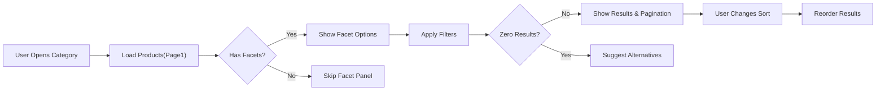
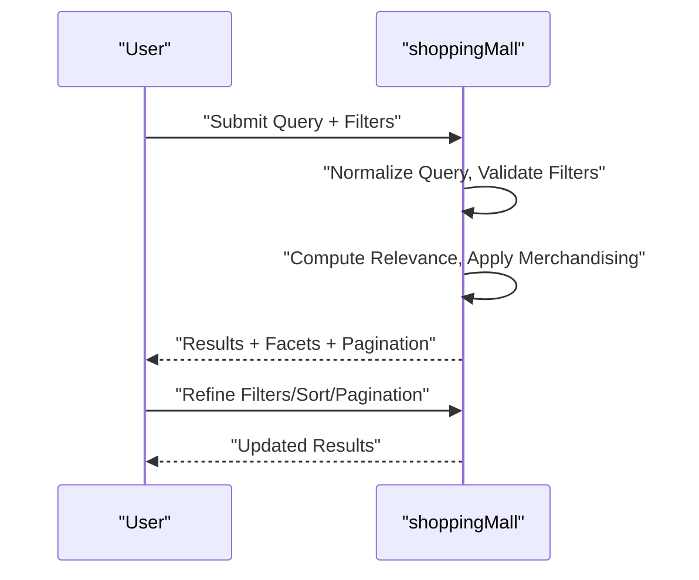
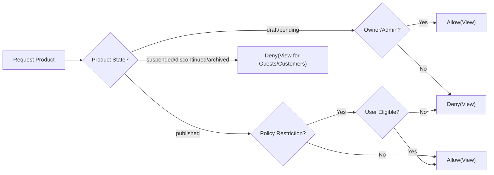

# Functional Requirements – Product Catalog and Search (shoppingMall)

## 1. Scope and Audience
Business requirements for catalog browsing, category taxonomy, product content, search semantics, relevance/sorting, pagination, SEO/discoverability, access/visibility, error handling, performance targets, and measurement. Written for backend developers, QA, and product operators in business terms without APIs, database schemas, vendor specifics, or UI prescriptions.

## 2. Definitions and Role Context
- Catalog: Structured collection of products offered by sellers.
- Category: Hierarchical taxonomy nodes organizing the catalog; used for browsing and discovery.
- Product: Purchasable entity presented to customers; may have one or more SKUs (variants).
- SKU (Variant): A specific purchasable configuration with attributes (e.g., color, size); has its own price and inventory state.
- Attributes: Descriptive and filterable fields (brand, material, gender, season, etc.).
- Availability: Business availability of a SKU or product derived from stock and policy.
- Visibility: Eligibility for display in catalog and search results for a given role and policy context.
- Roles in scope: guest, customer, seller, supportAgent, operationsManager, financeManager, contentModerator, systemAdmin.

EARS convention: WHEN/IF/WHILE/WHERE/THE/SHALL keywords are used for testable requirements; all descriptive text is en-US.

## 3. Catalog Structure and Category Taxonomy
### 3.1 Taxonomy Model and Rules
- THE shoppingMall SHALL support a hierarchical taxonomy with parent-child relationships and policy-defined depth (recommended 3–5 levels practical).
- THE shoppingMall SHALL allow a product to have a single primary category and optional cross-list categories.
- THE shoppingMall SHALL maintain category metadata: name, description, parent, display order, status (draft/active/hidden/archived), policy flags (age-restricted, hazardous, regulated), and locale-friendly slug.
- THE shoppingMall SHALL ensure primary category drives canonical placement, breadcrumbs, and SEO canonical URL.

### 3.2 Category Lifecycle (Business States)
- THE shoppingMall SHALL support category states: draft, active, hidden, archived.
- WHEN a category is hidden, THE shoppingMall SHALL remove it from guest/customer navigation and facets while preserving admin visibility.
- WHEN a category is archived, THE shoppingMall SHALL block new product assignments and exclude it from customer discovery for non-admin roles.
- IF a category is draft, THEN THE shoppingMall SHALL restrict visibility to admin/seller-owners viewing drafts as allowed by policy.

### 3.3 Navigation, Breadcrumbs, and Canonical Paths
- THE shoppingMall SHALL compute breadcrumbs from the primary category path and expose them wherever the product is shown.
- THE shoppingMall SHALL maintain stable category and product URLs that reflect canonical placement and prevent duplicate content.
- WHERE a product is cross-listed, THE shoppingMall SHALL still compute breadcrumbs using the primary category only.

### 3.4 Merchandising and Default Sorting Policies
- THE shoppingMall SHALL support category-level default sort policy (e.g., relevance, newest, best-selling) configurable by operationsManager.
- WHERE merchandising pins exist, THE shoppingMall SHALL display pinned products in top positions before organic ordering while maintaining stable pagination.
- WHERE category banners or featured collections are defined, THE shoppingMall SHALL display them subject to policy without altering organic ranking logic beyond configured merchandising rules.

### 3.5 Category Integrity Validation
- THE shoppingMall SHALL enforce unique active category names within the same parent.
- THE shoppingMall SHALL prevent cyclic parent-child relationships.
- IF a category is archived with assigned products, THEN THE shoppingMall SHALL require reassignment or fallback rules prior to archival completion.

### 3.6 Category-Specific Attribute Frameworks
- THE shoppingMall SHALL allow category-level definition of required and optional product attributes (e.g., Apparel requires brand, material, care instructions).
- WHEN a product is assigned to a category, THE shoppingMall SHALL validate presence and format of required attributes declared by that category.
- WHERE attribute value lists are constrained (e.g., color, size), THE shoppingMall SHALL restrict values to category-allowed sets.

## 4. Product Detail Content Requirements
### 4.1 Required Product Fields
- THE shoppingMall SHALL require product title, primary category, at least one image, short description, seller identity, and at least one SKU for publish.
- THE shoppingMall SHALL require each SKU to have: SKU identifier, variant attributes as applicable, price, and availability state.
- THE shoppingMall SHALL support optional fields: brand, model, long description, additional images/videos, attributes (material, gender, season), care instructions, warranty terms, country of origin, HS code (where applicable), compliance labels, and safety notes.

### 4.2 Content Quality and Validation
- THE shoppingMall SHALL enforce title length 5–120 characters and short description length 20–500 characters.
- THE shoppingMall SHALL disallow prohibited terms per policy in titles/descriptions (offensive words, deceptive claims, illegal items).
- THE shoppingMall SHALL require at least one image meeting policy for minimum resolution and aspect ratio; watermarks/promotional overlays are prohibited unless policy permits.
- IF required fields are missing or invalid, THEN THE shoppingMall SHALL block publishing and show corrective messages per field.

### 4.3 Variant and SKU Presentation (Business)
- THE shoppingMall SHALL present variant options that resolve to a single SKU for a given combination.
- WHERE a SKU is out of stock, THE shoppingMall SHALL reflect unavailability without unpublishing the product.
- WHERE at least one SKU is purchasable, THE shoppingMall SHALL keep the product visible in listings.

### 4.4 Pricing and Promotions in Catalog Context
- THE shoppingMall SHALL display the effective per-SKU price reflecting current promotions at request time.
- WHERE seller-specific promotions apply, THE shoppingMall SHALL apply them only to that seller’s SKUs.
- IF a promotion is inapplicable or expired, THEN THE shoppingMall SHALL not display the discount for that SKU.

### 4.5 Badges and Indicators
- WHERE policy allows, THE shoppingMall SHALL show badges such as "New", "Low Stock", "On Sale", and "Best Seller" based on business rules (time since publish, threshold status, active promotions, sales velocity).
- WHEN a SKU transitions to Low Stock, THE shoppingMall SHALL reflect the status badge on product listings and detail views within 1 minute.

## 5. Search Queries and Filters (Business Semantics)
### 5.1 Query Input Semantics and Normalization
- THE shoppingMall SHALL accept free-text queries up to 200 characters and normalize by trimming whitespace, collapsing repeated spaces, and case normalization.
- THE shoppingMall SHALL support typo tolerance within a business-configurable edit distance for common misspellings.
- WHERE queries contain known brands or categories, THE shoppingMall SHALL boost those matches.

### 5.2 Filters (Facets) and Multi-Select Logic
- THE shoppingMall SHALL support filters by category, brand, price range (min/max), availability (in-stock), rating (average threshold), seller, attributes (material, gender, season), and variant attributes (e.g., color, size).
- THE shoppingMall SHALL support multi-select within facets; default operator is OR within a facet and AND across different facets unless category policy dictates otherwise.
- THE shoppingMall SHALL validate filter values against allowed sets and numeric ranges; invalid values are ignored with user-facing indication.

### 5.3 Category-Scoped Search
- WHEN searching within a category context, THE shoppingMall SHALL limit results to that category and its active descendants unless user opts out.
- WHEN a category is hidden/archived, THE shoppingMall SHALL exclude it from category-scoped results for guest/customer roles.

### 5.4 Operators and Policy Constraints
- THE shoppingMall SHALL support phrase matching when queries are wrapped in quotes (e.g., "red leather boots").
- THE shoppingMall SHALL treat terms as implicit AND; support OR via explicit operator; support exclusion using a leading minus sign on a term where policy allows.
- WHERE advanced operators are disabled by policy, THE shoppingMall SHALL treat operator tokens as plain text.

### 5.5 Spell-Correction and Suggestions
- THE shoppingMall SHALL provide did-you-mean suggestions for zero-result or low-confidence queries using a business-configurable dictionary.
- WHEN a suggestion is offered, THE shoppingMall SHALL allow search on the original and suggested terms with clear labeling.

### 5.6 Personalization (Optional, Business-Level)
- WHERE personalization is enabled, THE shoppingMall SHALL adjust ranking using user engagement history in a privacy-compliant manner and SHALL disclose that results are personalized with opt-out available.
- IF personalization is disabled or unavailable, THEN THE shoppingMall SHALL fall back to non-personalized relevance.

## 6. Relevance, Sorting, and Pagination Rules
### 6.1 Ranking Signals (Business Priorities)
- THE shoppingMall SHALL rank results using a weighted combination of textual relevance, sales velocity, engagement (CTR, add-to-cart), rating quality and volume, freshness, and availability.
- WHERE all SKUs of a product are out of stock, THE shoppingMall SHALL deprioritize the product while allowing listings to appear per policy.
- WHERE a product is discontinued, THE shoppingMall SHALL exclude it from guest/customer results.

### 6.2 Sorting Options
- THE shoppingMall SHALL support sorts: relevance (default), newest, price low-to-high, price high-to-low, rating high-to-low, best-selling.
- THE shoppingMall SHALL apply deterministic tiebreakers (e.g., product recency, product ID) for stable ordering.

### 6.3 Pagination Stability and Bounds
- THE shoppingMall SHALL present paginated results with default page size 24 and policy-defined options (e.g., 24, 48, 96).
- THE shoppingMall SHALL ensure stable ordering within a session for given query+filters+sort to prevent duplicate/omitted items across pages.
- IF requested page exceeds total pages, THEN THE shoppingMall SHALL return an empty set with accurate page metadata.

### 6.4 Variant-Level vs Product-Level Matching
- THE shoppingMall SHALL match on variant attributes and consider a product relevant if any SKU matches the query or filters.
- WHERE multiple SKUs match, THE shoppingMall SHALL display the product once with aggregated price ranges and availability signals.

## 7. SEO and Discoverability Considerations (Business)
### 7.1 Canonical URLs and Slugs
- THE shoppingMall SHALL maintain canonical product URLs based on primary category and product slug; slugs are human-readable and locale-friendly.
- THE shoppingMall SHALL expose breadcrumb metadata aligned with the primary category path.

### 7.2 Sitemaps and Hreflang (Business Expectations)
- THE shoppingMall SHALL produce category and product sitemap entries and SHALL support locale alternates via hreflang where multiple locales are active.

### 7.3 Duplicate/Cross-List Handling
- WHERE cross-listing occurs, THE shoppingMall SHALL use canonical URLs to prevent duplicate indexing and SHALL keep analytics attribution consistent with canonical views.

## 8. Access and Visibility Rules
### 8.1 Product and SKU States
- THE shoppingMall SHALL support product states: draft, pending review, published, suspended, discontinued, archived.
- THE shoppingMall SHALL support SKU states: active, out_of_stock, backorder, preorder, discontinued.

### 8.2 Role-Based Visibility
- WHEN product state is draft/pending, THE shoppingMall SHALL restrict visibility to seller (owner) and admin roles with catalog permissions.
- WHEN product state is published, THE shoppingMall SHALL allow visibility to guest and customer roles subject to policy flags.
- WHEN product state is suspended/discontinued/archived, THE shoppingMall SHALL hide it from guest/customer and allow admin/seller owner access per policy.
- WHERE SKU is out_of_stock but product published, THE shoppingMall SHALL keep product visible and reflect SKU-level unavailability.

### 8.3 Policy-Restricted Content
- WHERE age-restricted content exists, THE shoppingMall SHALL require age verification in the user profile and hide such products from guests.
- WHERE hazardous/regulated goods exist, THE shoppingMall SHALL restrict by region and policy and require disclosures before checkout.

### 8.4 Regional Restrictions
- WHERE regions disallow sale or display of certain goods, THE shoppingMall SHALL filter such products from results based on the user’s region settings or address context.

## 9. Error Handling and Recovery (Catalog and Search)
- IF a category identifier is invalid, THEN THE shoppingMall SHALL indicate category not found and present top-level categories as recovery paths.
- IF a product slug or ID is invalid, THEN THE shoppingMall SHALL indicate product not found and suggest similar categories or searches.
- IF a query normalizes to empty, THEN THE shoppingMall SHALL treat it as a browse action and return popular products for the current context.
- IF filter values are invalid, THEN THE shoppingMall SHALL ignore them and surface which were ignored in user-friendly messaging.
- IF policy-restricted content is requested by an ineligible user, THEN THE shoppingMall SHALL deny access with compliant alternatives where available.
- WHEN indexing or search is degraded, THE shoppingMall SHALL prioritize category and PDP responses with cached content and indicate temporary limitations, resuming normal operation when service health restores.

## 10. Performance and Non-Functional Expectations (Catalog/Search)
- WHEN a category or search results page loads, THE shoppingMall SHALL respond within 1.5 seconds at p95 under normal load and within 3 seconds under peak events.
- WHEN a product detail loads, THE shoppingMall SHALL return content within 1.0 second at p95 under normal load.
- WHILE computing facet counts, THE shoppingMall SHALL keep overall response within the above targets by prioritizing critical content first.
- THE shoppingMall SHALL support seasonal demand spikes through business scaling plans without prescribing technical approaches.

## 11. Success Metrics and Tracking (Business KPIs)
- Discovery KPIs: category page CTR, search-to-click rate, PDP view rate, add-to-cart from search, search refinement rate, zero-result rate, bounce after zero results.
- Search Quality KPIs: average clicked rank, dwell time on PDP, query reformulation rate, abandonment after first page, personalization opt-out rate (if enabled).
- Inventory Visibility KPIs: share of visible products with ≥1 in-stock SKU, out-of-stock impression rate, conversion impact of stock state.
- SEO KPIs: organic impressions, CTR, top landing categories/products, share of branded vs non-branded traffic.
- THE shoppingMall SHALL surface per-category and per-seller discovery KPIs to authorized roles.

## 12. Diagrams (Mermaid)

Browse and Filter Flow

Search and Relevance Flow

Visibility Decision Tree

## 13. EARS Requirement Catalogue (Selected)

Catalog Taxonomy
- THE shoppingMall SHALL maintain a hierarchical taxonomy with unique sibling names and no cycles.
- WHEN a category is hidden, THE shoppingMall SHALL exclude it from guest/customer browsing and facets.
- WHEN a category is archived, THE shoppingMall SHALL block new assignments and remove it from discovery for non-admin roles.

Product Content
- THE shoppingMall SHALL require title, primary category, image, short description, seller identity, and one SKU before publish.
- IF required fields are missing, THEN THE shoppingMall SHALL block publishing and indicate missing fields.
- WHERE variant availability is mixed, THE shoppingMall SHALL keep products visible if any SKU is purchasable.

Search Semantics
- THE shoppingMall SHALL accept queries up to 200 characters and normalize whitespace/case.
- THE shoppingMall SHALL support filters for category, brand, price, availability, rating, seller, attributes, and variant attributes.
- WHEN searching within a category, THE shoppingMall SHALL scope results by default to that category and descendants.
- IF invalid filters are provided, THEN THE shoppingMall SHALL ignore them and indicate which were ignored.

Relevance and Sorting
- THE shoppingMall SHALL rank results using relevance, sales velocity, engagement, ratings, freshness, and availability.
- THE shoppingMall SHALL support sorts: relevance, newest, price asc/desc, rating desc, best-selling with deterministic tiebreakers.

Visibility and Policy
- WHEN product state is draft/pending, THE shoppingMall SHALL restrict visibility to owner/admin roles.
- WHEN product state is published, THE shoppingMall SHALL allow visibility for guest/customer subject to policy constraints.
- IF a product is suspended/discontinued/archived, THEN THE shoppingMall SHALL hide it from guest/customer while allowing admin access.

Performance and Metrics
- WHEN loading category or search, THE shoppingMall SHALL respond within 1.5s p95 under normal load and within 3s at peak.
- WHEN loading product detail, THE shoppingMall SHALL respond within 1.0s p95 under normal load.
- THE shoppingMall SHALL track discovery, search quality, inventory visibility, and SEO KPIs.

## 14. Compliance and Data Privacy (Catalog/Search Scope)
- THE shoppingMall SHALL avoid exposing restricted product metadata to unauthorized roles.
- WHERE regional restrictions apply, THE shoppingMall SHALL adjust visibility and filtering based on region and policy flags.
- WHERE age-restricted/hazardous goods exist, THE shoppingMall SHALL present appropriate warnings and policy disclosures.

## 15. Related Documents
- User Roles and Permissions: ./02-user-roles-and-permissions.md (authentication/authorization business rules)
- Product Variants and Inventory: ./05-functional-requirements-product-variants-and-inventory.md
- Cart and Wishlist: ./06-functional-requirements-cart-and-wishlist.md
- Checkout, Payment, and Orders: ./07-functional-requirements-checkout-payment-and-orders.md
- Order Tracking and Shipping: ./08-functional-requirements-order-tracking-and-shipping.md
- Reviews and Ratings: ./09-functional-requirements-reviews-and-ratings.md
- Admin Dashboard: ./11-functional-requirements-admin-dashboard.md
- Non-Functional Requirements: ./13-non-functional-requirements-performance-security-compliance.md
