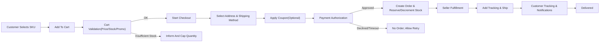
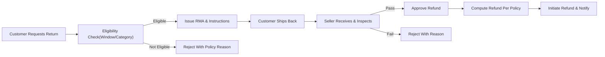
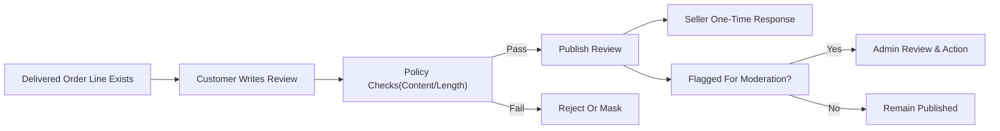

# shoppingMall — User Scenarios and Flows (Business Requirements)

## Personas and Goals

### Customer (End Consumer)
- Goals: discover products, compare variants, save items, purchase safely, receive on time, track shipments, review products, manage orders (cancellations/returns/refunds), and maintain accurate addresses.
- Environment: public browsing as guest; full capabilities when authenticated and verified. Address book may contain multiple entries with one default per type.
- Success: quick discovery and checkout, accurate price/tax/shipping estimates, reliable delivery, transparent tracking, and fair after-sales support.

### Seller (Merchant)
- Goals: onboard and verify, list products with SKU variants, maintain accurate inventory and pricing, fulfill orders, update tracking, handle returns/refunds, and reconcile payouts/fees.
- Environment: authenticated business account with store profile and verification state governing capabilities.
- Success: efficient listing and fulfillment workflows, minimal disputes, on-time shipment, predictable payouts, and policy compliance.

### Admin (Platform Administrator)
- Goals: govern categories and content quality, oversee users and sellers, moderate abuse, resolve disputes, manage fees/policies, ensure compliance, and monitor operations.
- Environment: authenticated with sub-role permissions and audit duties.
- Success: policy-consistent decisions, low fraud/abuse, timely resolutions, healthy operational metrics.

## Scope and Non-Technical Statement
- THE specification SHALL describe business behaviors and workflows for customer, seller, and admin actors without prescribing APIs, schemas, or UI design.
- THE scenarios SHALL employ EARS structure to ensure testable outcomes with measurable timing and eligibility conditions.

## Global Assumptions and Preconditions
- Authentication baseline: public browsing permitted; personalization, cart persistence, wishlist, order history, and reviews require authentication. Email verification required for sensitive actions (checkout, review submission, seller listing management).
- Timezone and localization: user-facing timestamps shown in the user’s locale with default to Asia/Seoul when unknown.
- Multi-seller model: a single customer checkout may split into seller-specific sub-orders for fulfillment and shipping.
- Inventory integrity: availability validated at add-to-cart and re-validated with reservation at checkout.

## Happy Path Scenarios by Actor

### 1) Customer Journeys

#### 1.1 Registration, Login, and Address Management
Preconditions
- Guest user with unique email; age and consent conditions satisfied.

Steps
1) Provide registration info and accept terms/privacy. 2) Verify email. 3) Log in successfully. 4) Add at least one address; set default.

EARS Requirements
- THE platform SHALL allow registration with a unique email and password that meets policy.
- WHEN a new account is created, THE platform SHALL set account state to "unverified" and send verification within 60 seconds p95.
- WHEN email is verified within the validity window, THE platform SHALL set account state to "active" and allow purchase and review eligibility.
- THE platform SHALL allow customers to create, edit, delete, and select addresses; exactly one default per type SHALL be maintained.
- IF an address misses mandatory fields or fails country rules, THEN THE platform SHALL reject save with field-level guidance.

Postconditions
- Account is active; session established; default shipping address ready for checkout.

#### 1.2 Browse, Search, and Variant Selection
Preconditions
- Customer authenticated or guest; catalog and categories active.

Steps
1) Enter search or browse category. 2) Apply filters. 3) Open product detail. 4) Select variant options to identify SKU.

EARS Requirements
- THE platform SHALL support category browsing and attribute-based filtering per category policies.
- WHEN a product offers variants, THE platform SHALL display only valid SKU combinations.
- WHEN a valid variant is selected, THE platform SHALL show that SKU’s price, availability, and estimated delivery.
- IF the SKU has zero sellable inventory and no backorder policy, THEN THE platform SHALL block add-to-cart with an out-of-stock cue.

Postconditions
- Selected SKU identified for downstream cart actions.

#### 1.3 Wishlist
Preconditions
- Customer authenticated; wishlist exists or is created on first use.

Steps
1) Mark product (or specific SKU) as saved. 2) Manage saved items; optionally move to cart.

EARS Requirements
- THE platform SHALL add an item to wishlist only once per product-variant pair per customer.
- WHEN a wishlist item is moved to cart, THE platform SHALL validate stock and policies; on failure, the wishlist item SHALL remain unchanged with error context.
- WHEN a product is delisted, THE platform SHALL mark the wishlist entry as unavailable without removing historical record.

Postconditions
- Wishlist updated; no inventory reservation created.

#### 1.4 Cart and Pre-Checkout Validation
Preconditions
- Customer has selected SKU; cart exists or will be created.

Steps
1) Add SKU with quantity. 2) Adjust quantities. 3) System recalculates estimates.

EARS Requirements
- WHEN adding a SKU, THE platform SHALL validate sellable inventory and min/max quantity rules.
- THE platform SHALL maintain a single active cart per authenticated customer; guests have a session-bound cart.
- IF requested quantity exceeds sellable inventory, THEN THE platform SHALL cap quantity to the maximum purchasable and explain the cap.

Postconditions
- Cart reflects valid items and current estimates.

#### 1.5 Checkout and Payment Authorization
Preconditions
- Authenticated, verified customer; non-empty cart; deliverable address present.

Steps
1) Start checkout. 2) Confirm address and shipping method. 3) Apply coupon or promotion where eligible. 4) Authorize payment.

EARS Requirements
- WHEN checkout starts, THE platform SHALL re-validate availability, prices, and promotions; inventory reservations SHALL be created for required SKUs.
- WHEN a valid coupon is applied, THE platform SHALL recompute totals and show itemized effects prior to payment.
- WHEN payment is authorized, THE platform SHALL create a customer-facing order and seller sub-orders as needed, and issue confirmation within 3 seconds p95.
- IF authorization fails or times out, THEN THE platform SHALL not create an order and SHALL present retry guidance without duplicating charges.

Postconditions
- Order created with unique identifier(s); reservations converted to order allocations.

#### 1.6 Order Tracking and Shipping Updates
Preconditions
- Order confirmed; seller has generated shipment(s) with tracking.

Steps
1) Track order from preparation to delivery. 2) Receive notifications on key milestones.

EARS Requirements
- THE platform SHALL display shipment-level status with carrier, tracking reference, and timestamps.
- WHEN a shipment transitions to a new milestone, THE platform SHALL update the order’s aggregate status within 1 minute p95 and notify the customer within 5 minutes.

Postconditions
- Customer sees up-to-date shipment progress; order transitions to Delivered upon completion of all shipments.

#### 1.7 Reviews and Ratings
Preconditions
- Delivered order line for the SKU within policy window.

Steps
1) Submit rating and optional text/media. 2) Undergo moderation if flagged. 3) Seller may respond once.

EARS Requirements
- WHEN an order line is delivered, THE platform SHALL allow one review per order line per SKU within the allowed window.
- THE platform SHALL enforce rating scale (1–5), content policy limits, and eligibility; ineligible attempts SHALL be rejected with reason.
- THE platform SHALL allow one seller response per review and prevent responses for products not owned by the seller.

Postconditions
- Review state published or pending moderation; aggregates updated on publish.

#### 1.8 Order History, Cancellations, and Returns
Preconditions
- Customer authenticated with past orders; relevant policy windows open.

Steps
1) Browse order history. 2) Request cancellation pre-shipment or RMA post-delivery. 3) Receive outcomes and refunds as eligible.

EARS Requirements
- WHERE items remain unshipped and within the cancellation window, THE platform SHALL accept cancellation requests and adjust order and inventory states accordingly.
- WHEN a return is approved, THE platform SHALL issue RMA and instructions and SHALL show refund calculation basis.

Postconditions
- Order history updated; refund state reflected on completion.

#### 1.9 Guest-to-Authenticated Cart Merge
Preconditions
- Guest cart has items; user logs in or registers.

Steps
1) Authenticate. 2) Merge carts. 3) Re-validate quantities and policies.

EARS Requirements
- WHEN a guest with a non-empty cart authenticates, THE platform SHALL merge the carts by summing identical SKUs and re-validating limits.
- IF merging causes policy violations or insufficient stock, THEN THE platform SHALL cap or drop offending lines with clear reasons.

Postconditions
- Single active cart associated with the authenticated account.

#### 1.10 Promotions and Stacking Resolution
Preconditions
- Eligible items and/or cart state meet configured promotion conditions.

Steps
1) Apply coupon. 2) System applies automatic promotions based on priority and stacking rules. 3) Totals recomputed deterministically.

EARS Requirements
- WHERE stacking is restricted, THE platform SHALL enforce the defined priority order and reject ineligible combinations with reasons.
- THE platform SHALL allocate order-level discounts proportionally across eligible lines and present itemized effects.

Postconditions
- Cart or checkout reflects final pre-authorization totals under the price lock window.

### 2) Seller Journeys

#### 2.1 Seller Onboarding and Verification
Preconditions
- Business information and documents available.

Steps
1) Submit store profile and documents. 2) Complete verification. 3) Activate store.

EARS Requirements
- THE platform SHALL collect mandatory business and contact information and set seller state to "pending verification" until approval.
- WHEN verification is approved, THE platform SHALL activate seller capabilities and notify with effective policies.

Postconditions
- Store active; listing publication enabled per policy.

#### 2.2 Product, SKU, and Inventory Management
Preconditions
- Seller store active; taxonomy and attribute policies defined.

Steps
1) Create product with required attributes. 2) Define variant dimensions and SKUs. 3) Set prices and inventory per SKU.

EARS Requirements
- THE platform SHALL enforce category-required attributes at listing activation.
- THE platform SHALL enforce unique SKU codes per seller and reject duplicates.
- WHEN inventory is 0 without backorders, THE platform SHALL mark SKUs unavailable for purchase.

Postconditions
- Active product with purchasable SKUs in catalog; discoverable under category rules.

#### 2.3 Order Fulfillment and Tracking
Preconditions
- Paid order(s) includes seller’s SKUs.

Steps
1) Acknowledge orders. 2) Pick/pack. 3) Create shipments with carriers and tracking. 4) Update status.

EARS Requirements
- WHEN tracking is provided, THE platform SHALL notify the customer and update shipment state.
- WHILE fulfillment is in progress, THE platform SHALL prevent unauthorized customer edits that violate policy.

Postconditions
- Shipment(s) visible with tracking; order transitions based on shipment milestones.

#### 2.4 Returns/Refunds Handling
Preconditions
- RMA approved or return received.

Steps
1) Inspect return. 2) Approve full/partial refund or reject with reason. 3) Trigger refund processing.

EARS Requirements
- WHEN an RMA is approved, THE platform SHALL show due dates and instructions to the seller.
- WHEN inspection passes, THE platform SHALL compute refunds per policy and initiate processing; otherwise, provide rejection with reason codes.

Postconditions
- Refund state updated; inventory restocked when applicable.

### 3) Admin Journeys

#### 3.1 Category Governance
EARS Requirements
- THE platform SHALL allow creation, update, and retirement of categories with effective dates and reassignment paths.

#### 3.2 Moderation of Reviews and Responses
EARS Requirements
- WHEN a review is flagged, THE platform SHALL queue it for moderation and record a decision within target SLAs.

#### 3.3 Disputes and Fraud Holds
EARS Requirements
- WHEN disputes or fraud signals arise, THE platform SHALL allow case creation, evidence collection, and binding decisions, including order or payout holds where needed.

## Alternative and Edge Case Scenarios

### A) Authentication and Account States
- Duplicate email, forgotten password rate limits, account lockouts, suspicious login challenges.

EARS
- IF registration email already exists, THEN THE platform SHALL block registration and advise account recovery.
- IF failed logins exceed threshold, THEN THE platform SHALL lock the account temporarily and notify the owner.

### B) Address Validation and Delivery Constraints
- Invalid postal codes, unsupported regions, and carrier constraints; address change requests pre-dispatch.

EARS
- IF address fails validation, THEN THE platform SHALL block save and identify invalid fields.
- WHILE no shipment is dispatched, THE platform SHALL allow address changes where permitted by carrier rules and policy.

### C) Inventory Race Conditions and Oversell Prevention
- Simultaneous demand for last units; seller stock edits during active carts.

EARS
- WHEN checkout starts, THE platform SHALL create reservations per SKU; IF reservations cannot be met, THEN order creation SHALL be blocked with guidance.

### D) Payment Failures and Timeouts
EARS
- IF authorization fails or times out, THEN THE platform SHALL preserve the cart and provide a retry path without duplicate orders.
- WHERE duplicate payment callbacks are received, THE platform SHALL deduplicate and maintain a single resulting order.

### E) Promotions, Coupons, and Conflicts
EARS
- IF a coupon is ineligible by product, seller, date, or minimum spend, THEN THE platform SHALL reject with a precise reason.
- WHERE stacking is prohibited, THE platform SHALL enforce the highest applicable discount per policy.

### F) Partial Fulfillment and Split Shipments
EARS
- WHERE items ship separately, THE platform SHALL track each shipment independently and aggregate order status appropriately.

### G) Delivery Exceptions
EARS
- WHEN an exception is received (e.g., undeliverable), THE platform SHALL update status, notify the customer, and present next steps.

### H) Returns, Exchanges, and Eligibility Boundaries
EARS
- IF a return is outside policy or non-returnable category, THEN THE platform SHALL reject with policy reason codes.
- WHERE partial returns are approved, THE platform SHALL compute proportional refund including taxes and applied discounts.

### I) Reviews and Abuse Prevention
EARS
- IF review content violates policy, THEN THE platform SHALL hide it and log moderation action.
- WHERE reviewer lacks verified purchase eligibility, THE platform SHALL restrict or label visibility per policy.

### J) Seller Operations and SLA Breaches
EARS
- IF shipment confirmation exceeds SLA, THEN THE platform SHALL flag the breach and notify admin for escalation.

### K) Admin Oversight and Fraud Signals
EARS
- WHEN risk signals exceed thresholds, THE platform SHALL hold orders for manual review and communicate to stakeholders.

## Cross-Actor Interaction Flows

### Cancellation Before Shipment (Customer ↔ Seller ↔ Admin)
- Flow: request → seller decision or auto-approval → inventory release → refund initiation → admin escalation on disputes.

EARS
- WHEN a valid pre-shipment cancellation is submitted, THE platform SHALL notify the seller and update status per acceptance or auto-policy.

### Return After Delivery (Customer ↔ Seller ↔ Admin)
- Flow: request → eligibility check → RMA → shipment back → inspection → refund → escalation on disagreement.

EARS
- WHEN RMA is approved, THE platform SHALL issue instructions with deadlines; disputes SHALL route to admin with full audit trail.

### Review and Response (Customer ↔ Seller ↔ Admin)
- Flow: review → seller response → moderation as needed.

EARS
- WHEN a seller responds, THE platform SHALL allow exactly one response per review and record timestamps; flagged items SHALL enter moderation.

## Acceptance Criteria (Business-Level)
- WHEN a user submits valid registration data, THE platform SHALL create an account and issue verification within 60 seconds p95.
- WHEN viewing product detail, THE platform SHALL render price, stock status, and variant availability within 1.2 seconds p95.
- WHEN applying a coupon, THE platform SHALL recompute totals within 1.5 seconds p95 and show itemized effects.
- WHEN authorizing payment, THE platform SHALL return order confirmation within 3 seconds p95 upon success or actionable guidance upon failure.
- WHEN sellers submit tracking, THE platform SHALL notify the customer within 5 minutes and update status within 1 minute p95.
- WHEN an eligible review is submitted, THE platform SHALL publish or mark pending moderation within 2 seconds excluding media upload time.

## Visual Flows (Mermaid Diagrams)

### Customer Purchase and Fulfillment Flow

### Return and Refund Flow

### Review Submission and Moderation

## KPIs and Measurement Examples
- Checkout conversion rate uplift after promotion and shipping clarity interventions.
- Oversell incident rate ≤ 0.1% per month at SKU level.
- Median time to first tracking update after ship confirmation ≤ 2 hours.
- Review publication median latency ≤ 2 seconds excluding media; moderation decision median ≤ 24 hours.

## Glossary of Business Terms
- Sellable Inventory: Quantity available for sale considering holds/reservations.
- Reservation: Temporary hold of inventory during checkout to prevent oversell.
- RMA: Return Merchandise Authorization with instructions and deadlines.
- Fulfillment: Seller process to pick, pack, and ship.
- Shipment: Package with carrier and tracking; can contain multiple order lines.
- Cancellation Window: Policy period before shipment when customers can cancel.
- Policy Reason Codes: Predefined business reasons presented to users when actions are denied.

## Cross-Document References
- User actors and permissions: [User Actors and Permissions](./03-shoppingMall-user-actors-and-permissions.md)
- Catalog and variants: [Catalog, Search, and Variants](./05-shoppingMall-catalog-search-and-variants.md)
- Cart and wishlist: [Cart and Wishlist](./06-shoppingMall-cart-and-wishlist.md)
- Checkout and payment: [Checkout and Payment](./07-shoppingMall-checkout-and-payment.md)
- Order lifecycle and shipping: [Order and Shipping Management](./08-shoppingMall-order-and-shipping-management.md)
- Inventory reservations and stock: [Inventory Management](./09-shoppingMall-inventory-management.md)
- Reviews and ratings: [Reviews and Ratings](./10-shoppingMall-reviews-and-ratings.md)
- Returns and refunds: [Returns, Cancellations, and Refunds](./11-shoppingMall-returns-cancellations-and-refunds.md)
- Seller tooling: [Seller Portal Requirements](./12-shoppingMall-seller-portal-requirements.md)
- Admin governance: [Admin Operations and Governance](./13-shoppingMall-admin-operations-and-governance.md)
- Security/privacy/compliance: [Security, Privacy, and Compliance](./14-shoppingMall-security-privacy-and-compliance.md)
- Performance targets: [Performance and SLA](./15-shoppingMall-performance-and-sla.md)
- Notifications and reporting: [Notifications, Communications, and Reporting](./16-shoppingMall-notifications-communications-and-reporting.md)

## Out-of-Scope and Constraints
- No API specifications, database schemas, data models, or provider-specific integrations are included.
- No UI design directives or visual templates are prescribed.
- All requirements are written in business terms using EARS for testability.
