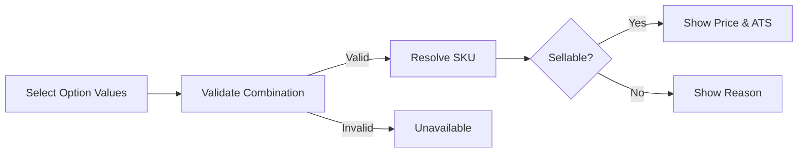
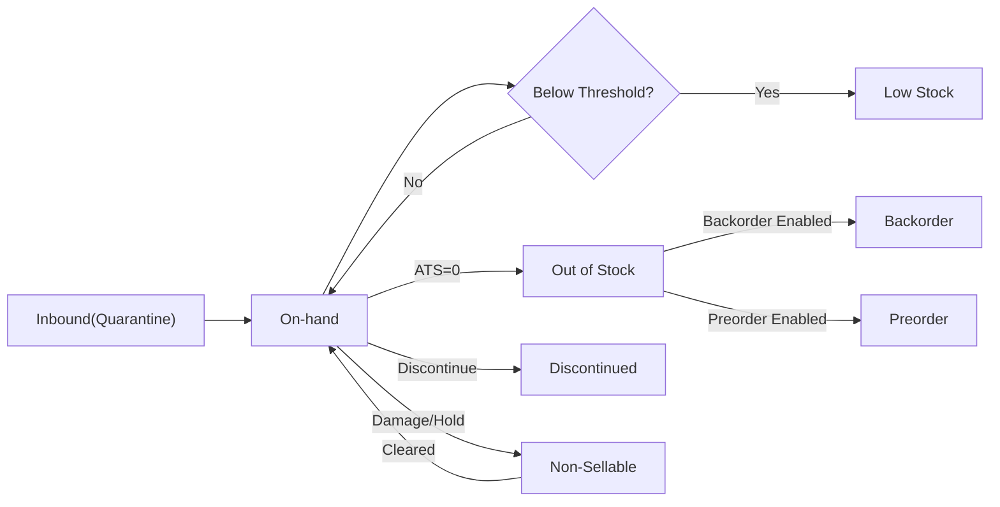
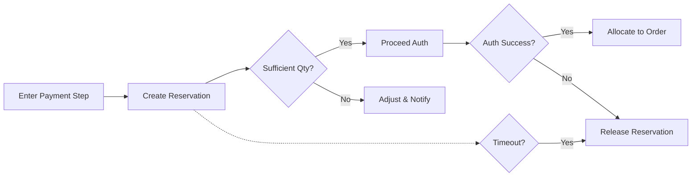
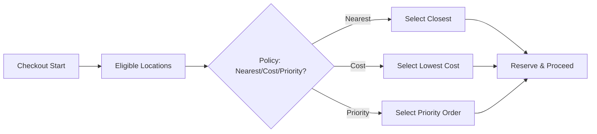
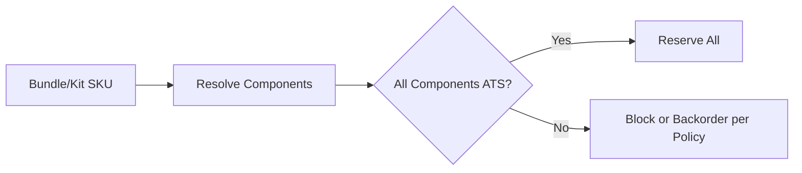
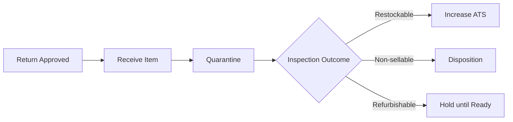

# 05 – Functional Requirements: Product Variants and Inventory (shoppingMall)

## 1. Purpose and Scope
Defines business requirements for modeling product variants, managing SKU-level inventory, controlling sellability, and ensuring reliable order fulfillment in the shoppingMall marketplace. Specifies WHAT must happen from a business perspective without prescribing HOW to implement (no APIs, schemas, or vendor specifics). Requirements use EARS for testability and clarity.

In scope: variant option modeling, SKU identity and display, inventory statuses and thresholds, multi-warehouse and allocation policies, kits/bundles, backorder/preorder, reservations and allocations, returns and restock, damaged/quarantine handling, cycle counts and reconciliation, inbound receiving, performance and KPIs, staff and seller responsibilities, error handling.

Out of scope: technical architecture, storage schemas, third-party integration details, UI layouts.

## 2. Terminology and Principles
- Product: Sellable concept that may have one or many variants.
- Variant Option Type/Value: Option families (e.g., Color) and concrete values (e.g., Red).
- Variant (Combination): Concrete selection of option values mapped to exactly one SKU.
- SKU: Unique sellable unit for inventory, price, and fulfillment.
- Inventory Quantity: Available-to-sell (ATS) units at a point in time, derived from on-hand minus reservations/allocations/holds.
- Safety Stock Threshold: Minimum practical level for signaling Low Stock.
- Allocation: Commitment of inventory to a confirmed order.
- Reservation: Temporary hold during checkout to avoid race conditions.
- Location: Business-defined inventory pool (e.g., warehouse, store, drop-ship node). May be single or multiple per seller.
- Non-Sellable Stock: Units not available to sell (damaged, QA hold, returns pending inspection).

Principles
- Variant truthfulness: Buyers must always see the SKU that matches selected options with accurate price and availability.
- Inventory integrity: Avoid oversell via validation, reservations, and clear policies under load.
- Transparency: Communicate backorder/preorder expectations and changes promptly.
- Auditability: Every material inventory change has a reason code and actor.

## 3. Role Context and Responsibilities (Business)
Roles: guest, customer, seller, supportAgent, operationsManager, financeManager, contentModerator, systemAdmin.

EARS examples:
- WHEN a seller updates inventory or pricing for a SKU, THE shoppingMall platform SHALL constrain the change to SKUs owned by that seller and record actor and reason.
- WHEN a supportAgent assists an order adjustment that impacts inventory (e.g., cancellation), THE shoppingMall platform SHALL reflect the adjustment in ATS within 1 minute and log the support case.
- WHERE operationsManager enforces policy (e.g., suspend a SKU), THE shoppingMall platform SHALL set the SKU to non-sellable immediately and retain audit trail.

## 4. Variant Modeling and Option Combinations
### 4.1 Modeling Rules
- THE shoppingMall platform SHALL support 0..N option types per product, defined per product by seller within category rules.
- WHEN option values are combined, THE shoppingMall platform SHALL ensure each valid combination maps to exactly one SKU.
- IF a proposed combination is invalid per seller rules, THEN THE shoppingMall platform SHALL block creation and explain conflicts.
- WHILE a product is draft, THE shoppingMall platform SHALL allow bulk create/update/delete of variants without public impact.
- WHEN a product is published, THE shoppingMall platform SHALL permit additive changes (e.g., new variant) and SHALL disallow destructive changes that orphan open orders.

### 4.2 Buyer Selection
- WHEN a buyer selects option values, THE shoppingMall platform SHALL resolve and display the exact SKU with price, availability, images, and attributes within 1 second (P95) under normal load.
- IF the combination does not exist or is not sellable, THEN THE shoppingMall platform SHALL show specific reasons (e.g., Out of Stock, Discontinued, Preorder date).

### 4.3 Category Alignment
- WHERE categories define standard option types (e.g., apparel sizes), THE shoppingMall platform SHALL enforce compatible option naming and allowed values for data quality.

## 5. SKU Identification and Display
- THE shoppingMall platform SHALL assign globally unique SKU identifiers and ensure they are not recycled after discontinuation.
- WHERE sellers provide seller-facing SKU codes, THE shoppingMall platform SHALL store and display seller codes to seller roles and staff.
- WHEN a variant is displayed to buyers, THE shoppingMall platform SHALL present a human-readable name based on option values and seller-provided naming rules.

EARS:
- WHEN staff or seller reference a SKU, THE shoppingMall platform SHALL support search by platform SKU, seller SKU, product name, and option values.

## 6. Inventory Model and Statuses
Statuses and meanings:
- In Stock: On-hand minus holds > safety threshold; purchasable.
- Low Stock: On-hand minus holds ≤ safety threshold and > 0; purchasable with low-stock messaging.
- Out of Stock: ATS = 0; not purchasable unless backorder enabled.
- Backorder: ATS ≤ 0 but future supply is expected and policy allows acceptance; purchasable with lead-time disclosure.
- Preorder: Not yet released; purchasable with release window disclosure.
- Reserved: Temporarily held during checkout; not available to other buyers.
- Allocated: Committed to a confirmed order; removed from ATS.
- Discontinued: No further sales allowed; remains for history.
- Quarantined/Hold: Non-sellable units pending inspection or policy checks.

EARS:
- THE shoppingMall platform SHALL compute Low Stock when ATS ≤ threshold set by seller or platform default.
- WHEN a SKU transitions to Out of Stock without backorder/preorder, THE shoppingMall platform SHALL block add-to-cart and display out-of-stock messaging.

## 7. Inventory Locations and Allocation (Single vs Multi-Warehouse)
### 7.1 Locations
- THE shoppingMall platform SHALL support per-seller inventory locations representing distinct pools (e.g., Warehouse A, Warehouse B, Drop-ship Partner).

### 7.2 Allocation Policy (Business)
- WHEN a buyer checks out, THE shoppingMall platform SHALL select inventory from the location(s) that minimize lead time and cost per configured business rules (e.g., nearest, priority list, single-ship preference).
- WHERE a product requires shipping constraints (hazardous, oversized), THE shoppingMall platform SHALL select only compliant locations.
- IF no location can fulfill the requested quantity, THEN THE shoppingMall platform SHALL apply backorder/preorder rules or block checkout with clear reasons.

### 7.3 Location Visibility
- THE shoppingMall platform SHALL hide internal location details from buyers while showing estimated delivery windows derived from selected locations.

## 8. Kits, Bundles, and Virtual SKUs
Definitions
- Kit: A pre-defined set of SKUs sold together with a single price (e.g., camera + lens).
- Bundle (Choice): A configurable set where buyers pick components from allowed lists.
- Virtual SKU: A SKU that represents a set of underlying SKUs for inventory purposes.

EARS:
- WHEN a kit SKU is sold, THE shoppingMall platform SHALL decrement component SKUs’ inventory proportionally and allocate all required components atomically.
- IF any component of a kit lacks sufficient ATS, THEN THE shoppingMall platform SHALL block the kit purchase unless backorder policy explicitly permits kit-level backorder.
- WHEN a bundle allows choices, THE shoppingMall platform SHALL resolve the exact component SKUs prior to reservation and apply inventory rules per component.

## 9. Backorder and Preorder Policies
### 9.1 Enabling and Preconditions
- WHERE a seller enables backorder, THE shoppingMall platform SHALL require expected restock dates or lead-time windows.
- WHERE a seller enables preorder, THE shoppingMall platform SHALL require a release date window and optional quantity cap.

### 9.2 Caps and Limits
- THE shoppingMall platform SHALL support per-SKU caps for backorder and preorder beyond which further adds are disallowed.
- THE shoppingMall platform SHALL support per-order and per-customer limits for backorder/preorder SKUs.

### 9.3 Communications
- WHEN a backorder or preorder is accepted, THE shoppingMall platform SHALL disclose estimated ship or release windows in checkout, confirmation, and order details.
- IF estimates change, THEN THE shoppingMall platform SHALL notify affected buyers within 24 hours of update with revised expectations.

### 9.4 Cancellations
- WHERE backorders exceed promised lead time, THE shoppingMall platform SHALL allow buyers to cancel before shipment without penalty.
- WHERE preorders are delayed beyond release window, THE shoppingMall platform SHALL allow buyers to cancel prior to shipment.

## 10. Pricing, Discounts, and Variant Promotions
- THE shoppingMall platform SHALL maintain base price at SKU level and permit per-SKU promotional overrides.
- WHEN multiple promotions are eligible, THE shoppingMall platform SHALL apply priority and exclusivity rules to compute effective price.
- IF a promotion expires during checkout, THEN THE shoppingMall platform SHALL reprice before authorization and require buyer confirmation.

## 11. Stock Reservation, Allocation, and Release
### 11.1 Reservation Timing
- THE shoppingMall platform SHALL NOT reserve stock on add-to-cart in standard policy.
- WHEN the buyer enters the payment step, THE shoppingMall platform SHALL create a reservation for requested SKUs.

### 11.2 Expiry and Conversion
- THE shoppingMall platform SHALL enforce a reservation window (default 15 minutes).
- IF the reservation expires before authorization, THEN THE shoppingMall platform SHALL release the held units immediately.
- WHEN payment authorization succeeds and the order is created, THE shoppingMall platform SHALL convert reservations to allocations.

### 11.3 Partial Allocation
- WHERE partial allocations are allowed, THE shoppingMall platform SHALL confirm the order for available quantities and disclose backordered remainder before submission.

## 12. Returns, Reverse Logistics, Restock, and Write-offs
### 12.1 Eligibility and Intake
- WHEN a return is approved per category policy, THE shoppingMall platform SHALL generate a return authorization tied to order items and reasons.
- WHEN a returned item is received, THE shoppingMall platform SHALL set it to Quarantine pending inspection.

### 12.2 Inspection Outcomes
- Restockable: THE shoppingMall platform SHALL increase ATS for the SKU within 1 minute.
- Non-sellable (damaged/used beyond policy): THE shoppingMall platform SHALL keep units in Non-Sellable status and require disposition (discard, liquidate) with reason code.
- Refurbishable: THE shoppingMall platform SHALL keep units in Hold until refurbishment is completed and then move to ATS when policy allows.

### 12.3 Financial Linkage
- WHEN a refund is approved, THE shoppingMall platform SHALL link inventory outcomes to refund calculation for audit (e.g., restocking fees per policy).

## 13. Cycle Counts, Reconciliation, and Inventory Audits
- THE shoppingMall platform SHALL support cycle counts by location, product, or category with planned schedules.
- WHEN a cycle count is performed, THE shoppingMall platform SHALL compute variances and require reason codes for adjustments.
- WHERE unexplained shrinkage exceeds thresholds, THE shoppingMall platform SHALL flag the seller for operational review.

EARS:
- WHEN an adjustment would produce negative on-hand, THE shoppingMall platform SHALL block it and request correction.
- WHEN reconciliation is completed, THE shoppingMall platform SHALL update ATS within 1 minute and record before/after values.

## 14. Damaged, Quarantined, and Restricted Inventory
- THE shoppingMall platform SHALL model Non-Sellable statuses such as Damaged, Suspected Counterfeit, QA Hold, and Regulatory Hold.
- WHEN an item enters a Non-Sellable state, THE shoppingMall platform SHALL exclude it from ATS and buyer visibility immediately.
- WHERE regulatory or safety flags apply, THE shoppingMall platform SHALL prevent sale and prompt seller remediation steps.

## 15. Inbound Receiving and Putaway (Business)
- WHEN inbound inventory is received (purchase orders, vendor consignments, returns-to-stock), THE shoppingMall platform SHALL require item identification (SKU), quantity, and location assignment.
- IF inbound details are insufficient (unknown SKU, mismatched quantities), THEN THE shoppingMall platform SHALL place items in Quarantine until resolved.
- WHEN putaway is completed, THE shoppingMall platform SHALL increase ATS and clear inbound holds.

## 16. Event Spikes, Fairness, and Oversell Prevention
- WHERE flash sales or high-demand events occur, THE shoppingMall platform SHALL allow configurable reservation start at checkout initiation and shorter windows (e.g., 10 minutes) to reduce oversell.
- WHEN concurrent buyers compete for last units, THE shoppingMall platform SHALL assign priority by earliest reservation creation time.
- WHERE bot or abusive patterns are detected (many checkouts from same account/device/IP), THE shoppingMall platform SHALL rate-limit or block reservations per policy.

## 17. Seller vs Platform Responsibilities and Permissions
| Action/Capability | Seller | Platform (Ops/Admin/Support) |
|-------------------|--------|-------------------------------|
| Define options/values | ✅ | Oversight/policy |
| Create/retire SKUs | ✅ | Policy enforcement |
| Set safety stock thresholds | ✅ | Default policy and compliance |
| Enable backorder/preorder | ✅ | Validation and buyer comms |
| Adjust on-hand inventory | ✅ | Audit oversight |
| Price and promotions (SKU) | ✅ | Policy governance |
| Reservations/allocations | System | System |
| Returns and restock | ✅ | Oversight and dispute handling |
| Damaged/quarantine handling | ✅ | Oversight |
| Cycle counts/reconciliation | ✅ | Oversight |

EARS summary:
- WHERE a seller action changes sellability (price/stock/state), THE shoppingMall platform SHALL apply ownership checks and record actor and reason.

## 18. Error Handling and Edge Cases (Representative)
- IF a buyer selects an invalid variant combination, THEN THE shoppingMall platform SHALL block add-to-cart and show unavailability.
- IF a SKU is discontinued, THEN THE shoppingMall platform SHALL block new adds and mark existing cart lines as invalid with guidance.
- IF requested quantity exceeds ATS, THEN THE shoppingMall platform SHALL cap to ATS or block checkout with reasons.
- IF a kit component is out of stock, THEN THE shoppingMall platform SHALL block the kit sale unless kit-level backorder is enabled.
- IF backorder/preorder caps are reached mid-session, THEN THE shoppingMall platform SHALL revalidate at checkout and disallow excess.
- IF safety threshold is missing, THEN THE shoppingMall platform SHALL apply a platform default for Low Stock signaling.
- IF a manual adjustment would set negative on-hand, THEN THE shoppingMall platform SHALL block it.
- IF inbound receiving references unknown SKUs, THEN THE shoppingMall platform SHALL place items in Quarantine pending resolution.

## 19. Performance and Observability (Business)
- WHEN buyers change variant selections, THE shoppingMall platform SHALL resolve SKU, price, and availability within 1 second (P95).
- WHEN validating inventory at checkout, THE shoppingMall platform SHALL decide reservation eligibility within 500 ms (P95).
- THE shoppingMall platform SHALL emit business events (InventoryReserved, InventoryReleased, InventoryAllocated, InventoryAdjusted, SKUStateChanged) and log actor, reason, before/after quantities.

## 20. KPIs and Success Criteria
- Variant resolution latency (P95 ≤ 1 s).
- Checkout inventory validation latency (P95 ≤ 0.5 s).
- Oversell rate ≤ 0.05% of SKUs monthly.
- Backorder lead-time adherence ≥ 90%.
- Preorder on-time fulfillment ≥ 95%.
- Stockout duration by SKU median trend down over time.
- Cycle count variance rate below threshold set by policy.

EARS:
- THE shoppingMall platform SHALL expose business data enabling calculation of the KPIs above without disclosing unnecessary PII.

## 21. Mermaid Diagrams

### 21.1 Variant Resolution (Buyer View)

### 21.2 Inventory State Lifecycle

### 21.3 Reservation to Allocation

### 21.4 Multi-Warehouse Allocation (Business)

### 21.5 Bundle/Kitting Fulfillment

### 21.6 Reverse Logistics (Returns)

## 22. Dependencies and References
- See discovery and visibility rules in “Functional Requirements – Product Catalog and Search”.
- See cart lifecycle and validation rules in “Functional Requirements – Cart and Wishlist”.
- See checkout, payment, and order creation in “Functional Requirements – Checkout, Payment, and Orders”.
- See order and shipping statuses in “Functional Requirements – Order Tracking and Shipping”.
- See seller operations in “Functional Requirements – Seller Portal”.
- See administrative oversight in “Functional Requirements – Admin Dashboard”.
- See events and data lifecycle in “Business Rules, Data Lifecycle, and Events”.
- See non-functional expectations in “Non-Functional Requirements – Performance, Security, and Compliance”.

Business statement of scope
All content above is stated in business terms for clarity and testability. Technical implementation details (architecture, APIs, database schemas, algorithms, vendors) are intentionally omitted and left to the development team’s discretion.