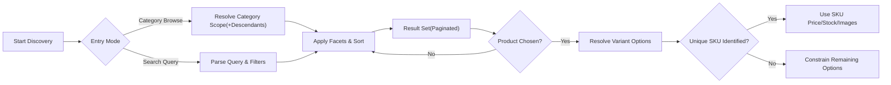
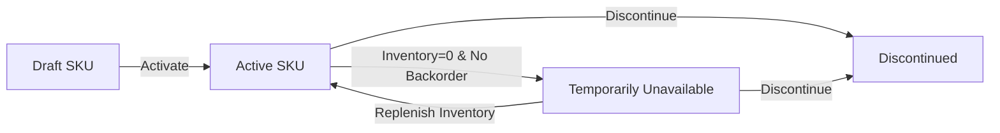
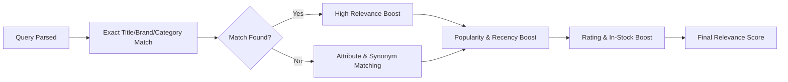

# shoppingMall Catalog, Search, and Variants Requirements

The catalog enables customers to discover products, compare variants (SKUs), and purchase reliably; empowers sellers to author compliant listings; and equips admins to govern taxonomy, data quality, and policy compliance. Requirements are expressed in business terms only; implementation details (APIs, databases, providers) are intentionally excluded and left to the development team.

## 1. Introduction and Scope
- Purpose: define WHAT shoppingMall must do for categories, products, attributes/options, variants (SKUs), browsing, filtering, sorting, and search, including validation, compliance, and performance expectations.
- Scope: taxonomy governance; listing lifecycle and visibility; attribute/option rules; SKU identity and availability; browsing and search behaviors; data quality; redirects; deduplication; accessibility; and error handling.
- Out of scope: technical specifications (API endpoints, schemas, infrastructure), vendor-specific search engines, and UI design.

Business-only statement:
- THE document SHALL define business requirements only. All technical implementation decisions belong to the development team.

## 2. Definitions and Concepts
- Catalog: Structured collection of categories and products available for discovery.
- Category: Hierarchical grouping node; may define required attributes and allowed options.
- Product: Parent entity describing a purchasable item family owned by a seller.
- Option (Variant Dimension): A selectable dimension (e.g., Color, Size) used to generate SKU combinations.
- Attribute (Descriptive): Non-variant metadata (e.g., Brand, Material) used for display and faceted filtering.
- Variant (SKU): Unique purchasable combination of option values within a product (e.g., "Color=Red, Size=M").
- Visibility: Whether entities appear in browsing and search.
- State: Business lifecycle status such as Draft, Pending Approval, Active, Archived, Discontinued.
- Slug: Human-readable identifier for categories/products used for discoverability and redirects.

## 3. Category Taxonomy Rules
### 3.1 Structure, Identity, and Governance
- THE shoppingMall catalog SHALL support a hierarchical category taxonomy with 1 to 5 levels.
- THE category name SHALL be unique among siblings within the same parent; the category slug SHALL be unique platform-wide.
- WHEN a category is moved within the tree, THE catalog SHALL preserve the category identity and migrate all child categories and product associations accordingly.
- IF a circular hierarchy would be created by a move, THEN THE catalog SHALL reject the operation with a business error.
- WHEN categories are merged, THE catalog SHALL reassign all products and descendants to the target category and mark the source as redirected.

### 3.2 Lifecycle, Visibility, and Redirects
- THE category state SHALL include Draft, Active, and Archived.
- WHEN a category is Draft, THE catalog SHALL exclude it from browse and search.
- WHEN a category is set to Active, THE catalog SHALL include it in browse and search within 5 minutes of the change.
- WHEN a category is Archived, THE catalog SHALL exclude it and its descendants from browse and search and preserve historical associations for reporting.
- WHEN a category is renamed or merged, THE catalog SHALL maintain redirects from prior slugs to the current destination for at least 12 months.

### 3.3 Category-Level Policies
- WHERE a category defines required attributes (e.g., "Brand" for Electronics), THE listing workflow SHALL enforce those attributes as mandatory for products in that category.
- WHERE a category defines allowed option dimensions (e.g., Apparel: Color, Size), THE variant creation workflow SHALL restrict options to the allowed set.
- WHERE a category defines restricted content policies (e.g., age-restricted goods), THE catalog SHALL apply those policies during listing and discovery consistent with compliance requirements.

## 4. Product Listing Requirements
### 4.1 Mandatory Fields (Business-Level)
- THE product listing SHALL require: Title (1–120 characters), Primary Category, Seller, Condition (New/Used/Refurbished), Base Price (non-negative), Tax Class (as configured), at least 1 Image, and a Description (minimum 50 characters).
- THE product listing SHALL require a Visibility State (Draft, Pending Approval where moderation applies, Active, Archived).
- THE product listing SHALL require a Fulfillment Type (e.g., Seller-fulfilled, Platform-fulfilled) with implications defined in order/shipping policies.

### 4.2 Optional but Recommended Fields
- THE product listing MAY include: Brand, Model, GTIN/UPC/EAN, MPN, Country of Origin, Warranty Terms, Material/Composition, Care Instructions, Age Range, Dimensions, Weight, Hazard Labels, and SEO metadata.
- WHERE a category marks any of the above as required, THE listing workflow SHALL enforce them.

### 4.3 Listing Lifecycle
- WHEN a seller creates a product, THE product SHALL default to Draft until all mandatory fields are satisfied.
- WHERE moderation is enabled, THE product SHALL transition to Pending Approval and SHALL not appear in discovery until approved by an administrator.
- WHEN the product is Active, THE product and its Active SKUs SHALL be discoverable within 5 minutes.
- WHEN a product is Archived or Discontinued, THE product SHALL be excluded from purchase and from default discovery.
- WHERE a future Publish Start is configured, THE catalog SHALL publish the product automatically at the scheduled time using Asia/Seoul unless store timezone is configured elsewhere.

### 4.4 Images and Media (Quality and Accessibility)
- THE product SHALL include at least 1 image at product level; recommended 3–8 images.
- THE product images SHALL meet minimum quality standards: longest side ≥ 1000 px, no watermarks or prohibited overlays.
- WHERE a SKU has color-specific imagery, THE SKU-level image set SHALL override product-level images for that SKU during discovery.
- THE product images SHOULD include alt-text descriptions in business terms for accessibility; WHERE alt text is missing, THE platform SHALL fall back to product title and option names.
- IF an image fails policy checks, THEN THE listing workflow SHALL reject the submission with a specific violation reason.

### 4.5 Pricing and Tax Business Rules
- THE product SHALL declare a Base Price in the store currency; SKUs MAY override with their own price.
- WHERE a Compare-at Price is provided, THE Base Price SHALL be strictly less than the Compare-at Price.
- WHERE tax-inclusive pricing is required by policy, THE displayed price SHALL reflect tax inclusion consistent with tax configuration.

### 4.6 Content Quality and Prohibitions
- THE product Title SHALL avoid excessive capitalization and prohibited phrases per policy.
- THE product Description SHALL be factual and avoid restricted content per policy.
- IF prohibited claims or restricted content are detected, THEN THE listing workflow SHALL reject activation with actionable reason codes.

## 5. Product Attributes and Options
### 5.1 Attribute Types and Validation
- THE catalog SHALL support attribute types: Text, Number, Boolean, Date, Enum (predefined list), and Measurement (value + unit from a controlled list).
- WHERE a Number attribute is used, THE value SHALL respect category-defined ranges (e.g., "Screen Size" 1–200 inches).
- WHERE a Measurement attribute is used, THE unit SHALL be selected from the category-approved unit set with conversions handled consistently across the platform.
- THE catalog SHALL support attribute localization; WHERE a localized value is missing, THE catalog SHALL fall back to the default language.

### 5.2 Descriptive vs Option Attributes
- THE catalog SHALL distinguish descriptive attributes (do not create SKUs) from option dimensions (do create SKUs).
- WHERE an attribute is marked as Option (e.g., Color, Size), THE variant generation SHALL use its values to create SKU combinations.
- WHERE an attribute is Descriptive (e.g., Material), THE attribute SHALL be available for faceted filtering but SHALL NOT generate new SKUs.

### 5.3 Category-Specific Templates and Enumerations
- WHERE a category defines attribute templates and enumerations (e.g., Color names), THE listing workflow SHALL enforce their presence and valid values upon activation.
- WHERE aliases exist (e.g., "Grey" vs "Gray"), THE platform SHALL normalize to canonical values for filtering and search while preserving seller intent for display.

### 5.4 Attribute Quality and Conflicts
- THE attribute values SHALL avoid contradictory combinations (e.g., "Gender=Unisex" with "Size Type=Infant" only if the category allows).
- IF an attribute value conflicts with category policy, THEN THE catalog SHALL reject activation with a conflict reason.

## 6. Variants and SKU Rules
### 6.1 Variant Dimensions and Combinatorics
- THE catalog SHALL support up to 5 option dimensions per product (e.g., Color, Size, Style, Material Variant, Pack Size).
- WHERE more than 3 dimensions are used, THE seller SHALL provide clear option names suitable for discovery and filtering.
- THE combination of option values for a SKU SHALL be unique within a product.
- IF a duplicate option combination is submitted, THEN THE submission SHALL be rejected with a duplication error.

### 6.2 SKU Identity and Uniqueness
- THE seller-defined SKU code SHALL be unique per seller across all products.
- THE platform-generated SKU identifier (if used) SHALL be unique platform-wide.
- WHERE a barcode/GTIN is provided, THE value SHALL be validated for format per policy, with optional deduplication checks.

### 6.3 SKU-Level Data and Status
- THE SKU SHALL support fields: Price (overrides product Base Price), Currency, Inventory Reference, Weight, Dimensions, Barcode/GTIN, Image Overrides, and Status (Active, Temporarily Unavailable, Discontinued).
- WHERE a SKU price is not provided, THE product Base Price SHALL apply.
- WHERE a SKU is set to Discontinued, THE SKU SHALL be excluded from purchase and from “In Stock” filters.

### 6.4 Availability and Backorders/Preorders (Business-Level)
- THE inventory SHALL be tracked per SKU; authoritative rules are defined in the inventory document.
- WHEN a SKU inventory count is 0 and backorders are not allowed, THE SKU SHALL be marked Temporarily Unavailable for purchase.
- WHERE backorders are permitted, THE SKU MAY remain purchasable with a clearly indicated lead time as defined in order/fulfillment policies.
- WHEN inventory is replenished, THE SKU availability SHALL reflect the change in discovery within 5 minutes.

### 6.5 Variant Presentation and Selection
- WHEN a variant selection uniquely identifies a SKU, THE catalog SHALL use that SKU’s price, availability, and imagery for discovery and cart operations.
- WHERE multiple SKUs match partial selections, THE catalog SHALL expose only remaining valid option values to prevent impossible combinations.
- WHERE color is an option, THE catalog SHOULD align color names to a canonical palette for accurate swatches and filtering.

### 6.6 Parent Product Purchasability
- THE product SHALL NOT be purchasable unless at least one Active, purchasable SKU exists.
- WHERE no purchasable SKUs exist, THE product MAY remain discoverable but SHALL be flagged as unavailable for purchase.

## 7. Browsing, Filtering, Sorting, and Pagination
### 7.1 Browsing Scope
- THE category browse view SHALL include products assigned to the selected category and its descendants.
- WHERE a product has multiple categories, THE product SHALL appear under each assigned category in discovery.

### 7.2 Faceted Filtering Semantics
- THE catalog SHALL provide faceted filtering on: Price range, Brand, Seller, Rating band, Availability (In Stock/Out of Stock), and category-specific attributes.
- WITHIN the same facet, THE selections SHALL apply with OR semantics; ACROSS facets, selections SHALL apply with AND semantics.
- WHERE a facet is not applicable to a category, THE facet SHALL not be available for that category.
- WHERE a facet would return zero results, THE catalog SHALL indicate the zero-result condition without substituting unrelated items.

### 7.3 Sorting and Tie-Breaking
- THE catalog SHALL support sorting by: Relevance, Newest, Best-Selling, Price (Low→High), Price (High→Low), Rating (High→Low).
- WHERE the user has not selected a sort order, THE default sort SHALL be Relevance for search results and Newest for category browsing.
- WHERE multiple items have equal scores, THE sort order SHALL be stable and deterministic across pages.

### 7.4 Pagination Stability and Limits
- THE catalog SHALL paginate results with a page size between 12 and 60 items and cap requests above 60.
- WHEN navigating between pages or toggling filters, THE catalog SHALL maintain stable ordering for items that remain in the result set.

### 7.5 Availability Preferences and Ranking
- WHERE a user preference to exclude out-of-stock exists, THE catalog SHALL exclude Temporarily Unavailable SKUs from counts and results.
- WHERE no preference exists, THE catalog SHALL rank in-stock items higher than out-of-stock while still allowing discovery unless policy forbids.

## 8. Search Behavior and Relevance
### 8.1 Query Handling
- THE search SHALL accept free-text queries up to 128 characters.
- THE search SHALL ignore common stop-words and apply basic typo tolerance for single-character edits on words of 4+ characters.
- WHERE quoted phrases are provided, THE search SHALL prioritize exact phrase matches.
- WHERE field qualifiers are supported (e.g., brand:"Nike"), THE search SHALL interpret them as filters.

### 8.2 Indexing Scope (Business Terms)
- THE search index SHALL include: Product Title, Brand, Category names, Seller name, key attributes (category-defined), and SKU option values.
- WHERE attributes are sensitive or private, THE search index SHALL exclude them.

### 8.3 Relevance and Ranking Signals
- THE search SHALL weigh signals in descending order: Exact Title match, Brand match, Category match, Attribute match, Popularity (views/sales), Recency, Rating, and In-Stock status.
- WHERE multiple matches exist, THE search SHALL boost items with higher sales velocity and higher normalized ratings.
- WHERE a user’s locale is known, THE search SHALL prefer localized titles and attributes.

### 8.4 Synonyms and Normalization
- THE search SHALL support a platform-maintained synonym list (e.g., "tee" ↔ "t-shirt").
- WHERE brand or attribute aliases exist, THE search SHALL normalize them to canonical values for matching and facets.

### 8.5 Zero-Result Behavior and Guidance
- IF a search yields zero results, THEN THE search SHALL provide suggestions by relaxing filters, applying synonyms, or proposing nearby categories.
- WHERE the query appears misspelled, THE search SHALL propose a corrected query alternative.

### 8.6 Safety and Policy
- THE search SHALL adhere to restricted content policies; WHERE the query indicates restricted content, THE search SHALL filter responses per compliance.

## 9. Validation, Errors, and Edge Cases
### 9.1 General Validation
- IF required fields are missing on product activation, THEN THE catalog SHALL reject activation with explicit field-level reasons.
- IF a category-required attribute is missing or invalid, THEN THE catalog SHALL reject the product with a category policy violation reason.
- IF an option combination duplicates an existing SKU, THEN the variant creation SHALL be rejected with a duplication reason.

### 9.2 Search and Browse Errors
- IF a filter value is not applicable to the current category, THEN THE catalog SHALL ignore the filter and return a validation message.
- IF the requested page exceeds the available range, THEN THE catalog SHALL return an empty result for that page and include total counts.

### 9.3 Images and Media
- IF an image does not meet minimum quality policy, THEN THE catalog SHALL reject it with an actionable violation reason.
- IF alt text is missing and accessibility policy requires it, THEN THE catalog SHALL block publication until a compliant value is provided or a fallback rule applies.

### 9.4 Restricted Content and Claims
- IF restricted content is attempted in titles, descriptions, or attributes, THEN THE catalog SHALL block activation and log a policy violation event.

### 9.5 Deduplication and Canonicalization
- WHEN multiple listings from the same seller attempt to describe the identical item, THE catalog SHOULD warn sellers and encourage consolidation.
- WHERE platform policies define canonical product grouping (e.g., by GTIN/brand/model), THE catalog MAY group related listings for search and browsing while preserving seller identity and price.

## 10. Performance, SLA, and Data Freshness
- WHEN a product or SKU state changes (activation, price, availability), THE catalog SHALL reflect the change in discovery within 5 minutes.
- WHEN category policies are updated, THE catalog SHALL enforce new validations on subsequent edits and activations immediately.
- WHEN adding or removing a single filter, THE catalog SHALL return updated results within 1.5 seconds at the 95th percentile.
- WHEN loading the first page of a category with default filters, THE catalog SHALL return results within 2 seconds at the 95th percentile.
- WHERE redirects are updated (rename/merge), THE catalog SHALL honor redirects for a minimum of 12 months.

## 11. Localization, Compliance, and Accessibility
- THE catalog SHALL support localized attribute labels and values; WHERE unavailable, THE platform default language SHALL be used as fallback.
- THE catalog SHALL honor compliance policies for restricted products, claims, labeling, and age-gating.
- THE catalog SHALL maintain human-readable slugs for categories and products; WHEN renames occur, THE catalog SHALL maintain redirects to avoid broken links.
- THE catalog SHOULD encourage meaningful alt text for images and clear color naming to assist color-blind users.

## 12. Diagrams (Mermaid)
### 12.1 Discovery to Variant Selection

### 12.2 SKU Availability Lifecycle

### 12.3 Search Ranking Decision (Conceptual)

## 13. Dependencies and Related Documents
- For actor capabilities, see the [User Actors and Permissions Specification](./03-shoppingMall-user-actors-and-permissions.md).
- For cart behavior of selected SKUs, see the [Cart and Wishlist Requirements](./06-shoppingMall-cart-and-wishlist.md).
- For checkout and payment, see the [Checkout and Payment Requirements](./07-shoppingMall-checkout-and-payment.md).
- For order lifecycle and shipping updates, see the [Order and Shipping Management Requirements](./08-shoppingMall-order-and-shipping-management.md).
- For stock tracking and reservations, see the [Inventory Management Requirements](./09-shoppingMall-inventory-management.md).
- For reviews and ratings, see the [Reviews and Ratings Requirements](./10-shoppingMall-reviews-and-ratings.md).
- For notifications, see the [Notifications, Communications, and Reporting Requirements](./16-shoppingMall-notifications-communications-and-reporting.md).

## 14. Out-of-Scope Items
- No API endpoints, request/response schemas, or ER diagrams.
- No search engine vendor specifics or index mappings.
- No UI layouts or visual design directives.

## 15. Appendix A — Consolidated EARS Requirements
- THE shoppingMall catalog SHALL support a hierarchical category taxonomy with 1–5 levels.
- THE category slug SHALL be unique platform-wide; names unique among siblings.
- WHEN a category is moved or merged, THE catalog SHALL migrate associations and maintain redirects for ≥ 12 months.
- IF a circular hierarchy would be created, THEN THE catalog SHALL reject the operation.
- WHEN a category is set to Active, THE catalog SHALL include it in discovery within 5 minutes.
- WHERE category-required attributes are defined, THE listing workflow SHALL enforce them.
- THE product listing SHALL require Title, Primary Category, Seller, Condition, Base Price, Tax Class, at least 1 Image, and Description.
- WHEN a product is Active, THE product and Active SKUs SHALL be discoverable within 5 minutes.
- THE product images SHALL meet minimum quality; SKU-level images override where provided.
- WHERE a Compare-at Price is provided, THE Base Price SHALL be less than the Compare-at Price.
- THE catalog SHALL support attribute types Text, Number, Boolean, Date, Enum, Measurement with localization and fallbacks.
- WHERE an attribute is marked Option, THE variant generation SHALL use its values to create SKUs; Descriptive attributes SHALL NOT create SKUs.
- THE catalog SHALL support up to 5 option dimensions per product; SKU combinations SHALL be unique.
- THE seller-defined SKU code SHALL be unique per seller; platform SKU IDs SHALL be unique platform-wide.
- WHEN SKU inventory is 0 without backorders, THE SKU SHALL be Temporarily Unavailable; replenishment SHALL reflect within 5 minutes.
- WHEN a unique SKU is identified by selection, THE catalog SHALL use that SKU’s price/stock/images for operations.
- THE product SHALL NOT be purchasable unless at least one purchasable SKU exists.
- THE catalog SHALL provide faceted filtering with OR within a facet and AND across facets.
- THE catalog SHALL support sorting by Relevance, Newest, Best-Selling, Price, and Rating with deterministic tie-breaking.
- THE catalog SHALL paginate results with page size 12–60 and maintain stable ordering across pages.
- THE search SHALL accept queries up to 128 characters with typo tolerance, phrase matches, synonyms, and field qualifiers.
- IF zero results occur, THEN THE search SHALL provide suggestions or corrections.
- WHEN adding/removing a facet, THE response time SHALL be ≤ 1.5 seconds at P95; first page ≤ 2.0 seconds at P95.
- WHEN product/SKU state or price/availability changes, THE catalog SHALL reflect within 5 minutes.
- THE catalog SHALL maintain human-readable slugs and redirects after renames.
- THE catalog SHALL honor restricted content policies and block violations.
- THE catalog SHOULD encourage accessibility via alt text and clear color naming; SHALL block where policy mandates alt text.

## 16. Glossary
- Canonical Value: The standardized attribute value used for matching and filtering across aliases.
- Compare-at Price: Reference price used to show discounts; must exceed current selling price.
- Facet: A filter dimension for narrowing search/browse results.
- In-Stock: SKU has positive sellable inventory.
- Option Dimension: A variant axis such as Color or Size that creates purchasable combinations.
- Redirect: A mapping from a previous slug to the current destination for continuity.
- Relevance: Composite ranking score used in search results ordering.
- Slug: Human-readable identifier used in URLs and redirects.
- Visibility: Inclusion of categories/products/SKUs in browsing and search.
