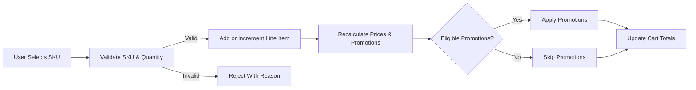
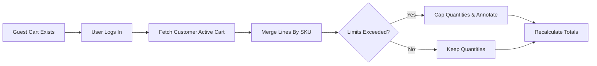
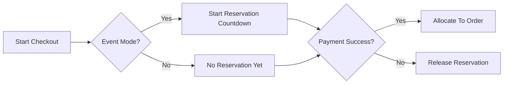
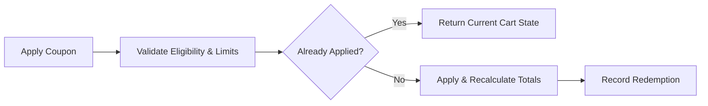
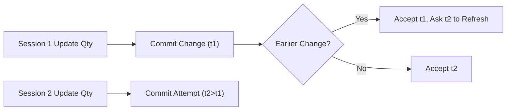

# 06 – Functional Requirements for Cart and Wishlist (shoppingMall)

## 1. Scope and Intent
Cart and wishlist capabilities enable buyers to collect SKUs across multiple sellers, validate price and stock, apply promotions, and proceed to checkout. Requirements define business behavior only: user-facing rules, validations, timing, notifications, and permissions. Technical implementation, APIs, and data schemas remain out of scope.

## 2. Glossary and Concepts
- Cart: A working collection of purchasable SKU line items with computed totals. Exactly one active cart per authenticated customer; one transient cart per guest session/device.
- Cart Line Item: A SKU with quantity and pricing components (base, discounts, taxes estimate, shipping estimate snapshot). Associated to a seller.
- SKU (Variant): Purchasable combination of options (e.g., color/size) with its own inventory, price, and policies.
- Reservation: Temporary hold of stock to protect against concurrent purchase conflicts during checkout.
- Promotion: Discount or benefit governed by business rules (automatic or coupon-based) applicable at line or cart level.
- Abandoned Cart: A cart without activity for a configured duration that may qualify for reminders subject to consent.

## 3. Roles and Permissions (Business)
| Action | guest | customer | seller | supportAgent | operationsManager | financeManager | contentModerator | systemAdmin |
|-------|-------|----------|--------|--------------|-------------------|----------------|------------------|-------------|
| Create/maintain cart | ✅ (session) | ✅ | ❌ | ❌ | ❌ | ❌ | ❌ | ✅ (test) |
| Add/update/remove items | ✅ (limits) | ✅ | ❌ | ❌ | ❌ | ❌ | ❌ | ✅ (test) |
| View cart totals | ✅ | ✅ | ❌ | ✅ (case-bound) | ✅ (read-only) | ❌ | ❌ | ✅ |
| Merge guest cart on login | ❌ | ✅ | ❌ | ❌ | ❌ | ❌ | ❌ | ✅ |
| Apply/remove coupons | ✅ (if allowed) | ✅ | ❌ | ✅ (assist) | ✅ (override) | ❌ | ❌ | ✅ |
| Manage wishlist(s) | ✅ (device) | ✅ | ❌ | ❌ | ❌ | ❌ | ❌ | ✅ (test) |
| Trigger abandoned reminders | ❌ | ❌ | ❌ | ✅ (ops) | ✅ | ❌ | ❌ | ✅ |

EARS examples
- WHEN a supportAgent views a customer cart for a verified support case, THE shoppingMall SHALL log actor, case reference, and mask sensitive fields.
- IF an operationsManager overrides a promotion, THEN THE shoppingMall SHALL require justification text and audit the override.

## 4. Cart Creation and Persistence
Business behavior
- Guests maintain a transient device-scoped cart that persists for 30 days of inactivity. Authenticated customers have a persistent account-scoped cart that does not expire but may mark items inactive after 90 days without updates.
- Exactly one active cart per authenticated customer.

EARS
- WHEN a guest adds a first SKU, THE shoppingMall SHALL create a device-scoped cart and assign a 30-day inactivity TTL.
- WHEN a customer adds a first SKU and has no active cart, THE shoppingMall SHALL create a new active cart.
- WHILE a customer is logged in, THE shoppingMall SHALL persist cart server-side and synchronize across sessions and devices within 60 seconds of change.
- IF a guest cart’s inactivity exceeds TTL, THEN THE shoppingMall SHALL expire it and allow a new cart to be created on next add.

## 5. Guest-to-Customer Cart Merge
Merge policy
- Merge by SKU identity; sum quantities subject to min/max purchase limits and available-to-sell (ATS). Revalidate prices and promotions; drop ineligible promotions; recalculate totals.

EARS
- WHEN a guest logs in, THE shoppingMall SHALL merge the guest cart into the customer cart and recalculate totals and eligibility.
- IF summed quantities exceed per-SKU limits, THEN THE shoppingMall SHALL cap to the allowed maximum and annotate affected lines with reason codes.
- WHEN identical SKUs with different promotion contexts exist across carts, THE shoppingMall SHALL keep a single line and re-evaluate promotions from scratch.
- WHERE merge conflicts occur (unpublished/discontinued SKU), THE shoppingMall SHALL exclude those lines and inform the user.

## 6. Line Item Operations
Operations
- Add: Create or increment a SKU line if already present.
- Update: Change quantity or (when allowed) reselect options mapping to a different SKU.
- Remove: Delete the line item.
- Replace: Policy-based replacement for deprecated SKUs.

Validation
- Integer quantities within min/max per SKU and per order; respect pack-size multiples where configured.
- Enforce max line items per cart (default 100).
- Respect restrictions (age/hazard/region) for later checkout validation.

EARS
- WHEN a user adds a SKU, THE shoppingMall SHALL validate sellability and quantity against ATS and purchase limits before acceptance.
- IF a SKU is unpublished, discontinued, or restricted, THEN THE shoppingMall SHALL reject add/update and annotate the line with reason.
- WHEN quantity is updated, THE shoppingMall SHALL validate against ATS, per-SKU limits, and promotion constraints; quantity 0 SHALL remove the line.
- WHERE an option change maps to a different SKU, THE shoppingMall SHALL treat it as remove-old and add-new with full validation.
- THE shoppingMall SHALL enforce a maximum of 100 line items per cart by default.
- WHERE pack-size multiples apply, THE shoppingMall SHALL require quantities to be a multiple of the configured increment.

## 7. Pricing and Promotions
Components
- Base price per SKU; line-level discounts; cart-level discounts; taxes/duties estimate; shipping estimate snapshot where available; fees/surcharges by policy.

Recalculation triggers
- Line changes, merge events, promotion validity changes, region/currency changes, time-windowed offers, or consent-dependent perks.

Stacking and precedence
- Configurable stacking rules (e.g., 1 coupon max; auto-discount may stack). Pro-rata allocation of cart-level discounts to lines for refund consistency.

EARS
- WHEN cart contents change, THE shoppingMall SHALL recompute prices, discounts, and totals within 1 second for carts ≤ 50 lines and within 2 seconds for carts ≤ 100 lines.
- THE shoppingMall SHALL revalidate promotions on every recalculation and drop ineligible ones with per-line or cart-level reason codes.
- WHERE coupon redemption limits apply (single-use per customer), THE shoppingMall SHALL enforce limits across historical orders.
- IF promotion stacking exceeds policy, THEN THE shoppingMall SHALL apply the highest-value legal stack by precedence and exclusivity.
- WHEN a time-limited promotion expires, THE shoppingMall SHALL remove its effects at next recalculation and update totals accordingly.
- THE shoppingMall SHALL not lock prices at cart time; price locks occur at order confirmation except for business features that explicitly enable pre-locking.
- WHEN a refund is processed post-capture, THE shoppingMall SHALL apply pro-rata reversal of cart-level discounts to affected lines for refund calculations.

## 8. Stock Validation and Reservation Timing
Validation moments
- Add/update, pre-checkout validation, payment initiation, and payment completion.

Reservation modes
- Standard: reserve only at payment step.
- Event: reserve at checkout start or payment initiation with countdown.

EARS
- THE shoppingMall SHALL not reserve stock on add-to-cart under standard policy.
- WHERE event mode is configured, THE shoppingMall SHALL start a reservation countdown (default 10 minutes) at checkout start or payment initiation per policy.
- WHEN payment authorization succeeds, THE shoppingMall SHALL convert reservations to allocations and deduct from ATS.
- IF authorization fails or the session expires, THEN THE shoppingMall SHALL release reservations immediately (≤ 1 minute).
- WHEN ATS drops below line quantity at checkout, THE shoppingMall SHALL cap to ATS or block submission per item with clear guidance.

## 9. Wishlist Management
Structure
- Guests: device-scoped list (default up to 100 items). Customers: default wishlist plus up to 10 named lists (up to 500 items each).
- Items may be products or specific SKUs depending on business configuration.

Behavior
- No stock reservation or price lock. Optional notifications for back-in-stock and price-drop with consent.

EARS
- WHEN a user adds an item to a wishlist, THE shoppingMall SHALL prevent duplicates within the same wishlist.
- WHERE notifications are enabled, THE shoppingMall SHALL send back-in-stock or price-drop alerts at most once per 24 hours per item per user, honoring unsubscribe.
- IF an item is discontinued, THEN THE shoppingMall SHALL mark it unavailable and stop notifications for that item.
- WHEN a wishlist item is added to cart, THE shoppingMall SHALL retain it in the wishlist unless removed by the user.
- WHERE multiple devices are used, THE shoppingMall SHALL synchronize customer wishlists within 60 seconds of change.

## 10. Abandoned Cart Handling
Eligibility and cadence
- Eligible if no activity for 24 hours (default) and customer has marketing consent. Optional second reminder at 72 hours; then stop.

EARS
- WHEN a cart becomes eligible for abandonment, THE shoppingMall SHALL enqueue a reminder workflow respecting consent and frequency caps.
- IF a user opts out of marketing communications, THEN THE shoppingMall SHALL cease abandoned cart reminders immediately.
- WHEN a user returns via a reminder, THE shoppingMall SHALL revalidate prices, promotions, and ATS prior to checkout.
- WHERE policy forbids reminder incentives in certain categories, THE shoppingMall SHALL suppress incentive content.

## 11. Cross-sell, Upsell, and Bundles
Policies
- Suggestions must be relevant to items in cart/wishlist, inventory-aware, and compliant with stacking and eligibility rules.

EARS
- WHEN an item is added to cart, THE shoppingMall SHALL generate cross-sell/upsell suggestions within 1 second for typical carts.
- WHERE bundle eligibility is met, THE shoppingMall SHALL present bundle discounts and apply them upon acceptance with standard validation.
- IF a suggested item becomes unavailable, THEN THE shoppingMall SHALL withdraw the suggestion at the next recalculation.

## 12. Concurrency, Idempotency, and Ownership
Multi-session/device
- Changes may occur from different devices or sessions for the same customer.

Idempotency and deduplication
- Prevent duplicate effects from repeated submissions (e.g., apply coupon, place order).

Ownership
- Only the owning user may modify cart/wishlist except where policy allows staff assistance.

EARS
- WHEN concurrent updates target the same line item, THE shoppingMall SHALL accept the earliest confirmed change and require later sessions to refresh state.
- WHEN the same coupon code is applied repeatedly within 10 minutes, THE shoppingMall SHALL apply it once and return the current cart state for subsequent attempts.
- WHEN a user repeats an add-to-cart action for the same SKU within 60 seconds, THE shoppingMall SHALL increment the quantity once and annotate deduplication in the event log (no duplicate lines).
- IF a non-owner attempts to alter a cart or wishlist, THEN THE shoppingMall SHALL deny the action and log the attempt.

## 13. Error Handling and Edge Cases
Representative scenarios and EARS
- IF a cart references a removed SKU, THEN THE shoppingMall SHALL remove the line and explain that the SKU is unavailable.
- IF quantity exceeds per-SKU or per-order limits, THEN THE shoppingMall SHALL cap to the allowed maximum and display the limit.
- WHEN shipping options change or become unavailable at checkout, THE shoppingMall SHALL require re-selection and recalculate totals.
- WHERE tax estimates change at confirmation, THE shoppingMall SHALL present updated totals for explicit acceptance.
- IF region or age restrictions apply, THEN THE shoppingMall SHALL block checkout for affected lines and present compliance guidance.
- IF promotion caps are reached mid-session, THEN THE shoppingMall SHALL drop the promotion and record the reason code.

## 14. Performance and Non-Functional Expectations
- Recalculation latency: p95 ≤ 1s for carts ≤ 50 lines; p95 ≤ 2s for carts ≤ 100 lines.
- Add/update/remove latency: p95 ≤ 400 ms; cart retrieval p95 ≤ 500 ms authenticated, ≤ 450 ms guest.
- Availability: 99.9% monthly for cart and wishlist operations.
- Synchronization: cross-device cart/wishlist sync within 60 seconds of change for authenticated users.
- Auditability: material cart/wishlist events (create, merge, add, update, remove, apply/remove coupon, reservation start/release) logged with actor and timestamp.
- Privacy: treat cart/wishlist as personal data; expose only to owners and authorized staff per policy; honor consent for reminders.

EARS
- THE shoppingMall SHALL meet the p95 latency and availability targets above under normal load.
- THE shoppingMall SHALL log significant cart/wishlist state changes with actor, timestamp, and reason when applicable.

## 15. Metrics and KPIs
- Cart-to-order conversion rate; average time to checkout from last cart update; abandoned cart recovery rate; average items per cart; promotion utilization; wishlist-to-cart conversion; cart operation error rate per 1,000 ops.

EARS
- THE shoppingMall SHALL emit business events to compute the above KPIs without exposing unnecessary personal data.

## 16. Diagrams (Mermaid)

### 16.1 Add to Cart and Recalculation Flow

### 16.2 Guest-to-Customer Cart Merge

### 16.3 Reservation Timing at Checkout

### 16.4 Promotion Application and Idempotency

### 16.5 Concurrency Conflict Resolution

## 17. Dependencies and Related Documents
- Catalog and search discovery rules: Functional Requirements – Product Catalog and Search.
- Variant and inventory policies: Functional Requirements – Product Variants and Inventory.
- Checkout and order creation: Functional Requirements – Checkout, Payment, and Orders.
- Order tracking after placement: Functional Requirements – Order Tracking and Shipping.
- Non-functional targets: Non-Functional Requirements – Performance, Security, and Compliance.
- Exception patterns: Exception Handling and Edge Cases.
