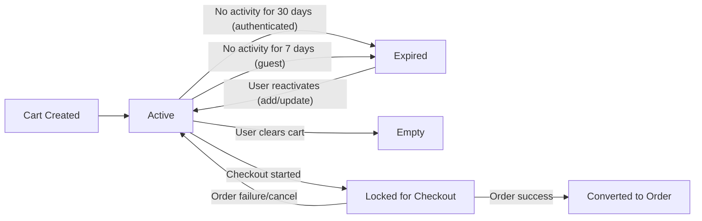
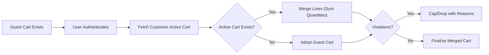
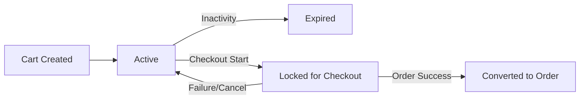
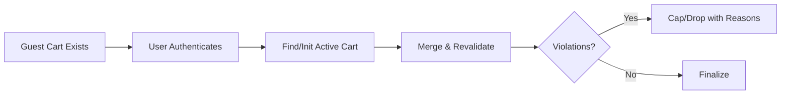

# Cart and Wishlist Requirements — shoppingMall

## Introduction and Scope
- Enables customers to collect purchasable product variants (SKUs) with desired quantities prior to checkout and to save items for later consideration without reserving inventory.
- Covers: cart lifecycle, item operations, price/tax/shipping estimation, promotions at cart-time (conceptual), wishlist operations, guest vs authenticated behavior, abuse prevention, performance expectations, and compliance.
- Excludes: UI design, provider-specific integrations, database schemas, API specifications, or infrastructure details. Technical implementation choices belong to the development team.

## Terminology and Assumptions
- Product: Catalog entity with variants and attributes (see Catalog requirements).
- Variant (SKU): Purchasable configuration with its own price, inventory, and restrictions.
- Cart: Set of line items (SKU, quantity, price snapshot) used to calculate an estimated order total.
- Wishlist: Saved list of products or variants for later reference; does not reserve stock.
- Seller: Merchant who owns the product listing.
- Customer: End consumer using the platform to shop.
- Admin: Platform administrator for governance and policy enforcement.
- Estimation: Pre-checkout calculation of subtotal, discounts, taxes, and shipping fees using current business rules and provided address/method inputs; final amounts are determined at checkout.
- Availability: Whether a SKU can be purchased now under current stock and policy constraints.
- Currency: One currency per cart; currency is fixed once checkout begins (see Checkout requirements).

## Actors and Permissions (Business-Level Matrix)
| Action | Customer (Authenticated) | Customer (Guest) | Seller | Admin |
|--------|---------------------------|------------------|--------|-------|
| Create cart | ✅ | ✅ | ❌ | ❌ |
| Add/update/remove cart items | ✅ | ✅ | ❌ | ❌ |
| View cart totals and estimates | ✅ | ✅ | ❌ | ✅ (aggregated operational views only; no PII beyond policy) |
| Apply/remove promotions in cart (conceptual) | ✅ | ✅ | ❌ | ❌ |
| Convert cart to order (checkout) | ✅ | ✅ (if enabled) | ❌ | ❌ |
| Clear cart | ✅ | ✅ | ❌ | ✅ (for compliance/system maintenance only) |
| Create wishlist | ✅ (default list) | ❌ (not persisted) | ❌ | ❌ |
| Add/remove wishlist items | ✅ | ❌ | ❌ | ❌ |
| Move item from wishlist to cart | ✅ | ❌ | ❌ | ❌ |
| Access another user’s cart/wishlist | ❌ | ❌ | ❌ | ❌ |

Notes:
- Admin visibility into cart data is limited to aggregated, anonymized operational views unless required by lawful requests or incident response per governance policies.

EARS permissions:
- WHEN a non-owner attempts to access a cart or wishlist, THE shoppingMall system SHALL deny the action.
- WHERE admin operational views require aggregated metrics, THE shoppingMall system SHALL exclude PII and limit scope to policy-approved fields.

## Cart Creation and Lifecycle
A cart is created implicitly when a user adds the first SKU or explicitly upon request. One active cart exists per user identity; authenticated customers have one active cart across devices (merge rules below). Guests have a session-bound cart.

### Lifecycle Diagram (Conceptual)

EARS — Creation & State
- THE shoppingMall system SHALL allow one active cart per authenticated customer identity at a time.
- WHEN a guest adds the first SKU, THE shoppingMall system SHALL create a guest cart bound to the guest session.
- WHEN an authenticated customer adds the first SKU, THE shoppingMall system SHALL create or reuse the customer’s active cart.
- WHEN checkout begins, THE shoppingMall system SHALL transition the cart to "Locked for Checkout" and block structural edits while allowing necessary recalculations.
- WHEN order creation succeeds, THE shoppingMall system SHALL mark the originating cart "Converted to Order" and prevent further edits.
- WHILE a cart is "Locked for Checkout", THE shoppingMall system SHALL allow only adjustments required by checkout (shipping method, address, promotions), disallowing structural changes unless checkout is canceled or fails.
- IF a cart has no activity for 30 days (authenticated), THEN THE shoppingMall system SHALL mark it "Expired" and exclude it from active experiences while retaining it for analytics within retention policies.
- IF a cart has no activity for 7 days (guest), THEN THE shoppingMall system SHALL mark it "Expired".
- WHEN a user clears the cart, THE shoppingMall system SHALL set the cart to empty and remove all line items.
- WHEN an expired cart is reactivated by new item activity, THE shoppingMall system SHALL create a new active cart instance and SHALL not resurrect obsolete prices or invalid items.

## Quantitative Limits and Policies
- Maximum distinct line items per cart: 100 (configurable policy).
- Maximum quantity per line: default 20 unless SKU policy defines otherwise (configurable).
- Quantity increment steps: per-SKU policy (e.g., packs of 2) must be honored.
- Maximum saved wishlists: 1 default list in scope (multiple lists post-MVP).
- Maximum wishlist entries: 500 product or product-variant pairs (configurable).
- Rounding: Monetary amounts rounded to 2 decimals using platform standard rounding unless local rule dictates otherwise.
- Currency: Single currency per cart; currency locks at checkout start.
- Device count: Multiple sessions may edit the same authenticated cart subject to conflict rules below.

EARS — Limits
- IF an add causes cart lines to exceed 100 distinct items, THEN THE shoppingMall system SHALL reject the operation with a limit-exceeded message.
- WHEN a quantity update violates per-SKU max or increment, THE shoppingMall system SHALL cap or reject and surface the allowed range and step.
- WHEN wishlist entries exceed 500, THE shoppingMall system SHALL block the add with a limit-exceeded reason.

## Item Add/Update/Remove Rules
Validation and Constraints
- Require valid SKU identifier and purchasability checks (active listing, region allowed, not discontinued, not blocked by policy).
- Validate inventory according to Inventory requirements on every add/update.
- Enforce min/max order quantity and increment steps where defined by SKU policy.
- Prevent mixed-cart conflicts where items cannot ship together due to legal or carrier restrictions; require separate checkout per conflict cluster.
- Unify duplicates: increasing quantity for the same SKU rather than adding duplicate lines unless policy mandates separate lines.
- Persist descriptive metadata necessary for estimation (e.g., price snapshot and discount rules version) with understanding that final prices are determined at checkout.

EARS — Add
- WHEN a customer adds a SKU with a specified quantity, THE shoppingMall system SHALL reject if below min or above max.
- WHEN an out-of-stock SKU is added and backorders are not allowed, THE shoppingMall system SHALL reject with out-of-stock messaging.
- WHEN backorder/preorder is allowed, THE shoppingMall system SHALL accept and tag the line for downstream handling.
- WHEN a SKU belongs to a suspended seller, THE shoppingMall system SHALL reject with an unavailable seller message.
- WHEN adding a SKU already present, THE shoppingMall system SHALL increase quantity and revalidate availability and limits.
- WHEN multiple SKUs are added in batch, THE shoppingMall system SHALL process independently and report partial successes and failures.

EARS — Update
- WHEN a customer updates line quantity, THE shoppingMall system SHALL validate current stock, min/max, and increment steps before applying.
- WHEN SKU attributes affecting price or availability change between add and update, THE shoppingMall system SHALL reprice the line estimate and revalidate availability.
- WHEN quantity is set to zero, THE shoppingMall system SHALL remove the line item.
- WHEN a SKU is discontinued, THE shoppingMall system SHALL block quantity increases and require removal before checkout.

EARS — Remove
- WHEN a customer removes a line item, THE shoppingMall system SHALL delete the item and recalculate estimates.
- WHEN a line item references a SKU no longer visible due to region or policy, THE shoppingMall system SHALL remove the item at next recalculation and inform the customer.

Idempotency and Batching
- THE shoppingMall system SHALL treat rapid duplicate adds for the same SKU within a short window (e.g., 2 seconds) as a single intent where possible, incrementing quantity once and returning a single success outcome.

## Price, Tax, and Shipping Estimation (Conceptual)
Estimates are recalculated at every impactful interaction and are not final until payment authorization. Taxes depend on jurisdiction; shipping estimates depend on destination and method.

Estimation Inputs and Behavior
- Compute estimated subtotal from current unit prices and quantities.
- Support price changes over time; recalculate on add/update/remove and at lifecycle events (checkout start, address change, shipping method change, promotion application).
- Display tax estimate only after sufficient address detail is present; otherwise mark as pending.
- Estimate shipping after deliverable destination (at least country and postal code) and method are known or defaulted.
- Support multi-seller carts by estimating shipping per shipment grouping and summing at cart level.
- Round monetary amounts using platform policy and ensure sum of line allocations equals totals.

Promotions and Discounts (Conceptual)
- Apply conditionally visible promotions/coupons in cart for preview only. Final validation occurs at checkout (see Checkout requirements).
- Allocation of order-level discounts: proportional to eligible lines by pre-discount extended value.

EARS — Estimation
- WHEN any cart structural change occurs, THE shoppingMall system SHALL recompute estimated totals within the same interaction.
- WHEN address fields sufficient for tax calculation are present, THE shoppingMall system SHALL compute estimated tax using current tax rules snapshot.
- IF required address detail is missing, THEN THE shoppingMall system SHALL set tax estimate to zero or mark it pending.
- WHEN a shipping method is selected or changed, THE shoppingMall system SHALL recompute shipping estimates and totals.
- IF a price or promotion rule changes after items were added, THEN THE shoppingMall system SHALL update estimates at next recalculation and indicate that prices have changed since last view.

## Promotions and Discounts in Cart (Conceptual Behavior)
- Stacking order (conceptual): seller-funded item discounts → automatic order promotions → coupons → gift cards/store credit.
- Eligibility: Enforce product/category/seller exclusions, usage limits, and minimum spend.
- Communication: Surface reasons when a promotion or coupon cannot apply; retain user-entered coupon for retry at checkout when allowed.

EARS — Promotions in Cart
- WHEN a coupon code is entered, THE shoppingMall system SHALL validate syntactic form and attempt a provisional eligibility check, deferring final enforcement to checkout.
- IF a coupon is ineligible by product, seller, date, or minimum spend, THEN THE shoppingMall system SHALL reject with a clear reason.
- WHERE stacking is restricted, THE shoppingMall system SHALL enforce the restriction and indicate which benefit remains.

## Wishlist Management
Core Rules
- Provide each authenticated customer a single default wishlist.
- Prevent duplicate entries for the same product-variant pair.
- Moving from wishlist to cart performs all cart validations.
- Wishlist is private to the owner; no public sharing in scope.

EARS — Wishlist Operations
- WHEN a customer adds a product or variant to wishlist, THE shoppingMall system SHALL add it only if not already present.
- WHEN a customer moves a wishlist item to cart, THE shoppingMall system SHALL validate availability, default quantity, and report failures without deleting the wishlist item unless the move succeeds.
- WHEN a product becomes unavailable or delisted, THE shoppingMall system SHALL retain the wishlist entry but mark it unavailable.
- WHEN a customer removes a wishlist item, THE shoppingMall system SHALL delete it immediately.

## Guest vs Authenticated Behavior
Guests operate a transient cart that may expire quickly. Authenticated customers have a persistent cart and a persistent wishlist.

Merge and Persistence Rules
- WHEN a guest with a non-empty cart authenticates, THE shoppingMall system SHALL merge the guest cart into the customer’s active cart by summing quantities for identical SKUs and revalidating availability and limits.
- IF merging causes policy or stock violations, THEN THE shoppingMall system SHALL cap to allowed maxima or drop violating lines with clear reasons.
- THE shoppingMall system SHALL ensure a single active cart per authenticated customer; older carts SHALL be archived per retention policies.
- THE shoppingMall system SHALL not persist a guest wishlist; attempts to save wishlist as guest SHALL be deferred until authentication.

Expiration and Reactivation
- THE shoppingMall system SHALL expire guest carts after 7 days of inactivity and authenticated carts after 30 days of inactivity.
- WHEN an expired cart is reactivated by new operations, THE shoppingMall system SHALL create a new active cart and recompute estimates using current rules.

### Guest→Auth Merge Flow

## Error and Recovery Scenarios
Inventory and Availability Changes
- IF a SKU goes out of stock between add and update, THEN THE shoppingMall system SHALL reject the update and indicate maximum purchasable quantity or zero.
- IF a SKU’s seller disables the listing, THEN THE shoppingMall system SHALL mark the line unavailable and require removal before checkout.
- IF regional restrictions render a SKU non-sellable to the chosen address, THEN THE shoppingMall system SHALL block checkout for that line and require removal.

Price and Promotion Drift
- IF a unit price changes after being added, THEN THE shoppingMall system SHALL update estimates on recalculation and indicate that prices have changed.
- IF a promotion becomes invalid or expires, THEN THE shoppingMall system SHALL remove its effect and provide a reason.

Concurrency and Conflicts
- WHEN two sessions for the same authenticated customer attempt conflicting cart changes, THE shoppingMall system SHALL apply arrival order and ensure a consistent final state, returning clear messages for rejections.
- WHEN checkout locks the cart, THE shoppingMall system SHALL prevent structural edits until checkout completes or fails.

Shipping Estimation Failures
- IF no shipping methods are available for the given address, THEN THE shoppingMall system SHALL indicate shipping is unavailable and block checkout until resolved.
- IF address data is incomplete, THEN THE shoppingMall system SHALL defer shipping estimation and mark totals as partial.

Data Integrity and Missing References
- IF a line item references a deleted SKU, THEN THE shoppingMall system SHALL remove it at next recalculation and notify the customer that it was removed due to unavailability.

Partial Success Handling
- WHEN batch operations include multiple adds or updates, THE shoppingMall system SHALL process each independently and return per-item outcomes to avoid all-or-nothing failure.

## Abuse Prevention and Rate Limits (Business-Level)
- Mutation frequency: limit cart add/update/remove operations per account/IP within a short interval to prevent denial-of-inventory while preserving typical behavior.
- Promotion attempts: limit coupon application attempts per session and per time window to mitigate abuse.
- Scraping resistance: throttle unauthenticated high-frequency requests that indicate automation overuse while keeping browsing responsive.

EARS — Abuse Controls
- WHEN cart mutation frequency exceeds the policy threshold, THE shoppingMall system SHALL throttle further mutations and communicate retry timing.
- WHEN coupon validation attempts exceed thresholds, THE shoppingMall system SHALL temporarily block further attempts and maintain cart state.
- WHERE automated access patterns are detected, THE shoppingMall system SHALL reduce service levels for offending sources while preserving core functions for legitimate users.

## Performance and SLA Expectations (User-Centric)
- WHEN a single cart item is added, updated, or removed, THE shoppingMall system SHALL complete validation and return updated estimates within 2 seconds under normal load.
- WHEN computing totals after structural changes affecting up to 20 line items, THE shoppingMall system SHALL return updates within 3 seconds under normal load.
- WHEN merging a guest cart into an authenticated cart containing up to 50 line items, THE shoppingMall system SHALL produce the merged result within 4 seconds under normal load.
- WHILE peak season load occurs, THE shoppingMall system SHALL prioritize correctness and maintain cart operations within 5 seconds at P95, aligned with Performance & SLA expectations.

## Privacy, Compliance, and Auditability
- Treat carts and wishlists as personal data; restrict access to the owning customer and authorized admin workflows under governance policies in Security, Privacy, and Compliance requirements.
- Provide mechanisms to delete carts and wishlists upon account deletion in accordance with data retention policies.
- Record business events (add/remove/update, merge, lock, convert) sufficient for audit and customer support while adhering to data minimization.

## Cross-Document References
- For product structure and variant behavior, see the Catalog, Search, and Variants requirements.
- For stock validation, reservations, and holds, see the Inventory Management requirements.
- For checkout sequencing, promotions, and payment handling, see the Checkout and Payment requirements.
- For shipping states and order lifecycle after checkout, see the Order and Shipping Management requirements.
- For actor definitions and authentication, see the User Actors and Permissions specification.
- For platform-wide performance targets, see the Performance and SLA requirements.
- For notifications and reporting, see the Notifications, Communications, and Reporting requirements.

## Consolidated EARS Requirements (Index)
- THE shoppingMall system SHALL allow one active cart per authenticated customer identity at a time.
- WHEN checkout starts, THE shoppingMall system SHALL lock the cart for structural edits and permit necessary recalculations only.
- IF cart inactivity exceeds policy windows (30 days authenticated; 7 days guest), THEN THE shoppingMall system SHALL expire the cart.
- IF cart line count exceeds 100 or wishlist entries exceed 500, THEN THE shoppingMall system SHALL reject the add with limit messaging.
- WHEN adding or updating quantities, THE shoppingMall system SHALL validate min/max and increment steps before acceptance.
- WHEN a SKU becomes unavailable or region-restricted, THE shoppingMall system SHALL block purchase and require removal.
- WHEN estimates change due to price or promotion drift, THE shoppingMall system SHALL recompute at next recalculation and indicate changes.
- WHEN address or shipping method changes, THE shoppingMall system SHALL recompute shipping and totals.
- WHEN a coupon is ineligible or stacking is restricted, THE shoppingMall system SHALL reject or adjust with clear reasons.
- WHEN a guest cart is merged upon authentication, THE shoppingMall system SHALL sum identical SKUs, cap or drop violating lines, and report reasons.
- WHEN batch adds occur, THE shoppingMall system SHALL produce per-item outcomes to avoid all-or-nothing failure.
- WHEN mutation or promo attempts exceed thresholds, THE shoppingMall system SHALL throttle and communicate retry timing.
- THE shoppingMall system SHALL meet user-perceived response targets for add/update/remove and cart total recomputations under normal load.
- THE shoppingMall system SHALL audit key cart and wishlist events subject to data minimization and retention policy.

## Visual Appendices

### Cart Lifecycle (Conceptual)

### Guest→Auth Merge (Detail)

