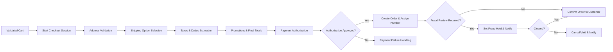
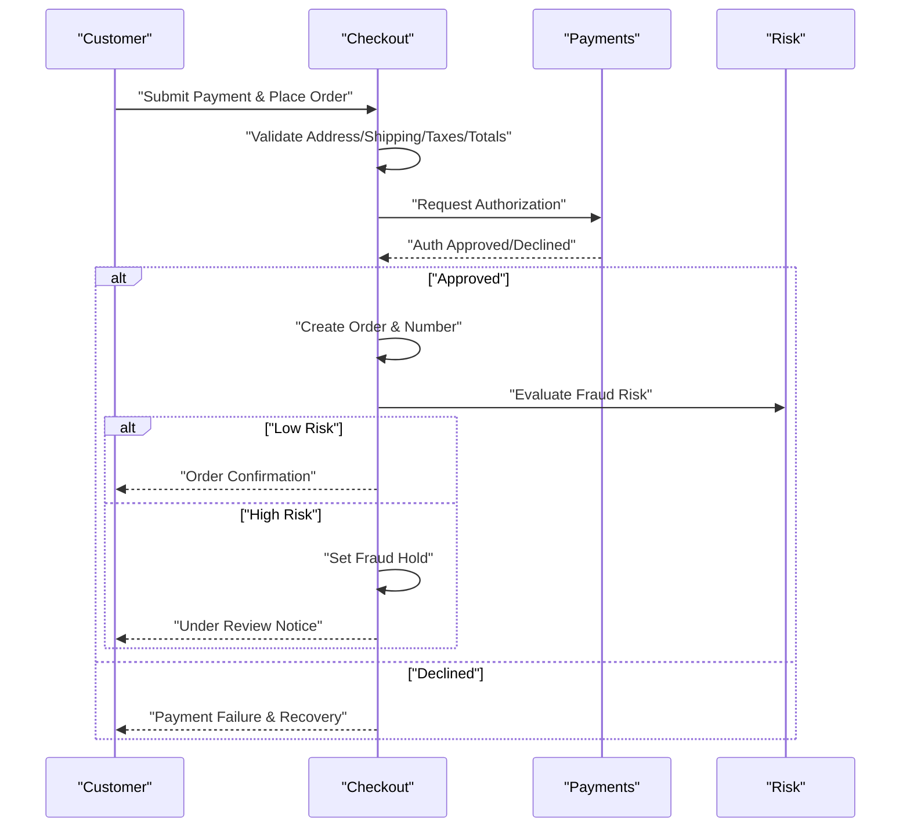
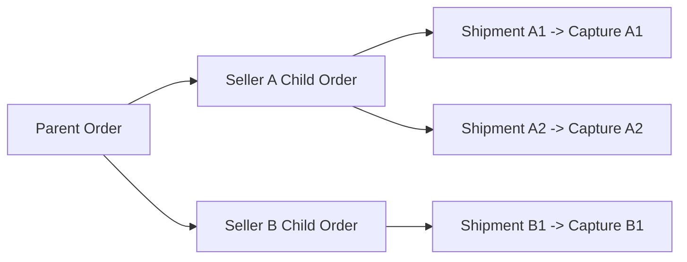
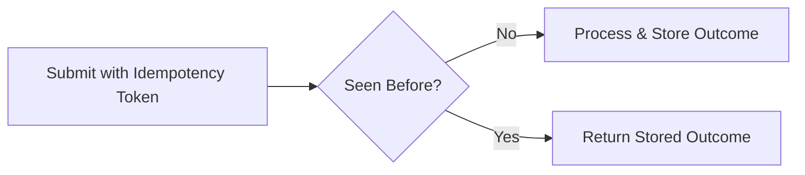

# Functional Requirements — Checkout, Payment, and Orders (shoppingMall)

## 1. Scope and Intent
Business requirements for moving a validated cart to a confirmed order with reliable payment and clear post-order states. The content defines WHAT must happen in business terms, not how to implement it. All timing targets are expressed from a user experience perspective and must be testable.

## 2. Roles and Preconditions for Checkout
### 2.1 Roles in Scope
- guest: may browse and maintain a pre-auth cart; cannot submit orders unless guest checkout is explicitly enabled by policy.
- customer: authenticated buyer authorized to place orders.
- seller: cannot place orders as seller; receives order line items for fulfillment.
- supportAgent, operationsManager, financeManager, systemAdmin: staff roles with scoped abilities to view/intervene per policy.

### 2.2 Preconditions
- THE shoppingMall platform SHALL require an authenticated customer to place orders, unless guest checkout is enabled by policy.
- WHEN guest checkout is enabled, THE shoppingMall platform SHALL require verified email and phone at checkout before order submission.
- WHEN checkout begins, THE shoppingMall platform SHALL validate that the cart contains at least one purchasable SKU and that each line adheres to minimum/maximum purchase limits.
- WHEN checkout begins, THE shoppingMall platform SHALL re-validate price, promotions, and stock for each line prior to payment.
- WHERE age-, region-, or policy-restricted items exist, THE shoppingMall platform SHALL enforce eligibility checks before allowing submission.

## 3. End-to-End Flow Overview

## 4. Checkout Session Lifecycle and Cart Snapshot Rules
- WHEN a checkout session starts, THE shoppingMall platform SHALL bind the session to the current cart state (SKU identifiers, quantities, price version, active promotion set) and SHALL prevent mid-session drift by re-validating at decision points.
- THE shoppingMall platform SHALL expire a checkout session after 15 minutes of inactivity; on expiry, reservations (if any) SHALL be released and the user prompted to restart.
- WHEN a session resumes after re-authentication, THE shoppingMall platform SHALL restore preserved inputs (address, shipping choice, payment preference) if still valid.
- WHEN finalizing, THE shoppingMall platform SHALL snapshot itemized prices, tax, shipping, discounts, address, and payment summary into the order and retain immutably.

EARS guarantees
- WHILE a session is active, THE shoppingMall platform SHALL prevent duplicate authorization attempts for the same tokenized submission.
- IF the browser resubmits due to network uncertainty, THEN THE shoppingMall platform SHALL apply idempotency (see Section 14) to avoid duplicate orders and payments.

## 5. Address Requirements and Validation
- THE shoppingMall platform SHALL require recipient name, street, locality/city, region/province (if applicable), postal code (if applicable), country, and contact phone.
- WHEN an address is submitted, THE shoppingMall platform SHALL validate format and serviceability for at least one shipping option across all items/sellers.
- IF the address is not serviceable for any item, THEN THE shoppingMall platform SHALL block progression and identify the blocking items.
- WHEN the user selects a billing address different from shipping, THE shoppingMall platform SHALL capture it for payment compliance where required.
- THE shoppingMall platform SHALL record all critical timestamps in UTC and display address- and delivery-related times to customers in their timezone (primary reference Asia/Seoul).

## 6. Shipping Options, Costs, and Delivery Windows
- WHEN an address is validated, THE shoppingMall platform SHALL compute available shipping options per seller and present costs and estimated delivery windows.
- WHERE multiple sellers are in one cart, THE shoppingMall platform SHALL allow independent option selection per seller or offer a platform-optimized default when policy permits.
- WHEN a user changes the shipping option, THE shoppingMall platform SHALL recalculate totals within 2 seconds and update the ETA.
- IF no valid option exists for an item, THEN THE shoppingMall platform SHALL require removal or address change before submission.
- WHERE free shipping promotions apply, THE shoppingMall platform SHALL apply them according to policy and reflect net shipping charges in totals.

## 7. Taxes and Duties (DDP/DAP)
- WHEN computing totals, THE shoppingMall platform SHALL calculate taxes per line using destination rules and product tax classes.
- WHERE cross-border duties apply and Delivered Duty Paid (DDP) is configured, THE shoppingMall platform SHALL include duties in the order total and disclose them prior to payment.
- WHERE Delivered At Place (DAP) applies, THE shoppingMall platform SHALL disclose estimated duties separately with a clear disclaimer and SHALL not charge them in the order total.
- IF tax or duty calculation fails, THEN THE shoppingMall platform SHALL block authorization and allow retry.

## 8. Promotions, Coupons, Store Credits, and Gift Cards
- WHEN promotions are applied, THE shoppingMall platform SHALL validate eligibility (time window, item/seller/category rules, quantity thresholds, customer segment) before order submission.
- THE shoppingMall platform SHALL support mutually exclusive coupons where defined and SHALL apply the highest-value eligible set respecting stacking rules.
- WHERE store credits or gift cards are used, THE shoppingMall platform SHALL deduct them before charging the payment method and SHALL include the applied value in the snapshot and receipt.
- IF a promotion expires during checkout, THEN THE shoppingMall platform SHALL reprice totals and request explicit confirmation before proceeding.
- WHERE cart-level discounts apply, THE shoppingMall platform SHALL allocate benefits pro-rata to lines for refund consistency.

## 9. Payment Methods and Business Flows
### 9.1 Supported Business Methods
- Cards and digital wallets, domestic bank transfers, local payment rails per region, and cash on delivery (COD) where enabled.
- Strong Customer Authentication (e.g., 3-D Secure) may be required per region or risk signals.

### 9.2 Authorization
- WHEN the user submits payment, THE shoppingMall platform SHALL request authorization for the order grand total (items + shipping + taxes/duties − discounts − credits).
- IF authorization is approved, THEN THE shoppingMall platform SHALL persist the authorization reference and proceed to order creation.
- IF authorization is declined or times out, THEN THE shoppingMall platform SHALL fail the attempt, present a categorized reason, and allow an alternate method.
- WHILE authorization is pending, THE shoppingMall platform SHALL prevent duplicate submissions from the same session.
- WHERE COD is selected and permitted, THE shoppingMall platform SHALL create the order without authorization and mark payment method as COD.

### 9.3 Capture and Partial Capture
- WHEN a shipment is confirmed for any line items, THE shoppingMall platform SHALL capture an amount corresponding to shipped goods and proportional shipping/tax.
- WHERE multiple shipments exist, THE shoppingMall platform SHALL allow multiple partial captures up to the authorized amount.
- IF the authorization expires before capture, THEN THE shoppingMall platform SHALL attempt re-authorization once before proceeding or escalating to staff.
- WHERE digital or instantly fulfilled goods exist, THE shoppingMall platform SHALL capture immediately upon order creation.

### 9.4 Voids, Reversals, and Refunds (Payment Perspective)
- WHEN an order is canceled before shipment, THE shoppingMall platform SHALL void the authorization or reverse the hold if supported by the method.
- WHEN a refund is approved post-capture, THE shoppingMall platform SHALL execute full or partial refunds and update financial state accordingly.
- IF a duplicate charge risk is detected, THEN THE shoppingMall platform SHALL reconcile against idempotency keys and prior outcomes and deny the duplicate.

### 9.5 Step-up Authentication and Compliance
- WHERE SCA or step-up is required, THE shoppingMall platform SHALL complete the authentication flow within 120 seconds or provide a clear recovery path.
- WHEN step-up fails or is abandoned, THE shoppingMall platform SHALL allow a single retry within 10 minutes without losing the session context.

## 10. Order Creation, Numbering, and Multi-Seller Composition
- WHEN authorization is approved (or COD selected), THE shoppingMall platform SHALL create an order and assign a unique number with format "ORD-YYYYMMDD-NNNNNN" (zero-padded daily sequence).
- THE shoppingMall platform SHALL prevent reuse of order numbers across all time.
- WHERE multi-seller items are present, THE shoppingMall platform SHALL create child fulfillment orders per seller and ensure reconciliation so that the sum of child subtotals, shipping, taxes, and discounts equals the parent totals.
- THE shoppingMall platform SHALL record the legal time of sale at order creation in UTC and display in the customer’s timezone.

## 11. Fraud and Risk Review Policies
- WHEN an order is created, THE shoppingMall platform SHALL evaluate risk using business signals (address consistency, velocity, device risk, historical disputes).
- WHERE risk exceeds threshold, THE shoppingMall platform SHALL place the order on "Fraud Hold" and block capture until cleared.
- IF the hold is not resolved within the configured window (e.g., 48 hours), THEN THE shoppingMall platform SHALL cancel the order and void authorization if possible.
- WHEN staff clears an order, THE shoppingMall platform SHALL resume normal fulfillment.

## 12. Customer and Internal Notifications
- WHEN an order is created, THE shoppingMall platform SHALL send a confirmation with order number, charges, and delivery expectations.
- WHEN fraud hold is applied or cleared, THE shoppingMall platform SHALL notify relevant staff and inform the customer with neutral wording.
- WHEN payment fails, THE shoppingMall platform SHALL notify the customer of failure category and recovery options.
- WHERE multi-seller orders exist, THE shoppingMall platform SHALL inform the customer that items may ship separately.
- THE shoppingMall platform SHALL localize notifications to the customer’s preferred language and display times in the customer’s timezone.

## 13. Cancellations, Returns, and Refunds
- WHEN a customer requests cancellation before shipment, THE shoppingMall platform SHALL approve within policy windows and restore inventory/reservations.
- WHERE a seller cannot fulfill due to stock or address issues, THE shoppingMall platform SHALL allow seller-initiated cancellation with reason codes and inform the buyer.
- WHEN a return/refund is requested post-shipment, THE shoppingMall platform SHALL collect reason, evidence if required, and route to seller and finance roles for decision per policy.
- WHEN a refund is approved, THE shoppingMall platform SHALL issue refunds within policy SLAs and update order financial status.

## 14. Idempotency, Concurrency, and Duplicate Protection
- WHEN a checkout confirmation submission is received with the same idempotency token within 24 hours, THE shoppingMall platform SHALL return the original outcome and SHALL NOT create a duplicate order.
- WHEN the same payment capture request is retried with the same reference, THE shoppingMall platform SHALL allow only one successful capture and treat others as duplicates.
- WHEN simultaneous edits to a cart occur from multiple sessions, THE shoppingMall platform SHALL accept the earliest validated change and request the later session to refresh.
- IF a network failure occurs after authorization but before the confirmation response is delivered, THEN THE shoppingMall platform SHALL allow safe retries that either return the created order or complete creation once.

## 15. Performance and Reliability Expectations
- WHEN loading checkout with address and shipping options, THE shoppingMall platform SHALL respond within 700 ms at p95 under normal load.
- WHEN computing shipping rates, THE shoppingMall platform SHALL respond within 800 ms domestic and 1,200 ms cross-border at p95.
- WHEN submitting order placement including authorization, THE shoppingMall platform SHALL confirm the order within 2,000 ms at p95 for successful authorizations.
- WHILE authorization is pending beyond 10,000 ms, THE shoppingMall platform SHALL present a pending state and complete asynchronously with notification.
- THE shoppingMall platform SHALL meet monthly availability ≥ 99.95% for payment authorization and order placement.

## 16. Auditability, Compliance, and Privacy
- THE shoppingMall platform SHALL log checkout initiation, address validation outcomes, shipping selections, tax/duty computations, promotion applications, authorization results, order creation, fraud decisions, and notifications with actor and timestamps.
- THE shoppingMall platform SHALL avoid storing raw card data and SHALL rely on compliant payment providers.
- THE shoppingMall platform SHALL mask PII in staff views by default and reveal only with justified access.
- THE shoppingMall platform SHALL retain audit logs for security-sensitive actions per policy (≥ 1 year) and transactional order/payment records per statutory requirements (≥ 5 years where required).

## 17. Role-Based Permissions (Business View)
| Action | guest | customer | seller | supportAgent | operationsManager | financeManager | systemAdmin |
|--------|-------|----------|--------|--------------|-------------------|----------------|-------------|
| Start checkout | ❌ | ✅ | ❌ | ❌ | ❌ | ❌ | ✅ |
| Submit order (non-COD) | ❌ | ✅ | ❌ | ❌ | ❌ | ❌ | ✅ |
| Submit order (COD) | ❌ | ✅ | ❌ | ❌ | ❌ | ❌ | ✅ |
| View own orders | ❌ | ✅ | ✅ | ✅ | ✅ | ✅ | ✅ |
| Place fraud hold/clear | ❌ | ❌ | ❌ | ✅ | ✅ | ❌ | ✅ |
| Approve high-value refunds | ❌ | ❌ | ❌ | ❌ | ❌ | ✅ | ✅ |
| Configure risk thresholds | ❌ | ❌ | ❌ | ❌ | ✅ | ❌ | ✅ |

EARS clarifications
- WHEN a non-permitted role attempts a restricted action, THE shoppingMall platform SHALL deny and log the attempt.

## 18. Error Handling and Recovery Scenarios
Address & Shipping
- IF address validation fails, THEN THE shoppingMall platform SHALL retain inputs, highlight fields, and allow correction.
- IF no shipping option remains valid, THEN THE shoppingMall platform SHALL require item removal or address change and show reasons per item.

Payment
- IF authorization is declined, THEN THE shoppingMall platform SHALL allow alternate method selection without losing checkout state.
- IF capture fails post-authorization, THEN THE shoppingMall platform SHALL attempt one re-authorization and, if still failing, SHALL escalate and inform the user.
- IF step-up authentication fails, THEN THE shoppingMall platform SHALL allow one retry within 10 minutes.

Inventory & Pricing
- IF stock validation fails at confirmation, THEN THE shoppingMall platform SHALL cap quantities or block submission with per-line reasons.
- IF price or promotion changes mid-checkout, THEN THE shoppingMall platform SHALL reprice and require explicit acceptance to continue.

Fraud Review
- IF the risk service is unavailable, THEN THE shoppingMall platform SHALL flag orders above conservative thresholds for manual review while allowing low-risk orders to proceed.

Notifications
- WHEN failures occur, THE shoppingMall platform SHALL issue clear user-facing messages and staff alerts as appropriate.

## 19. KPIs and Acceptance Criteria
Acceptance Criteria
- Successful checkout produces an order with format "ORD-YYYYMMDD-NNNNNN"; multi-seller orders reconcile parent/child totals.
- Idempotent submissions do not create duplicates; duplicate capture is prevented.
- Fraud hold blocks captures until cleared; clearing resumes normal flow.
- Notifications are sent promptly and localized.

KPIs
- Checkout conversion from payment submit to authorization approved.
- Authorization approval rate by method/region.
- Average time from payment submit to order number (p95 ≤ 2,000 ms under normal load).
- Duplicate order prevention incidents (target 0).
- Refund cycle time median ≤ 3 business days from approval.

## 20. Visual Appendices
### 20.1 Authorization to Order Creation (Sequence)

### 20.2 Multi-Seller Splits and Partial Captures

### 20.3 Idempotency and Duplicate Protection

Consolidated EARS Highlights
- WHEN checkout starts, THE shoppingMall platform SHALL validate cart, reprice, and enforce eligibility before payment.
- WHEN payment authorization succeeds, THE shoppingMall platform SHALL create a unique order number and snapshot charges.
- WHERE fraud risk is high, THE shoppingMall platform SHALL place the order on hold and prevent capture until cleared.
- WHEN partial shipments occur, THE shoppingMall platform SHALL allow proportional captures aligned to shipments.
- WHEN duplicate submissions occur within the window, THE shoppingMall platform SHALL return the original outcome and prevent duplicates.
