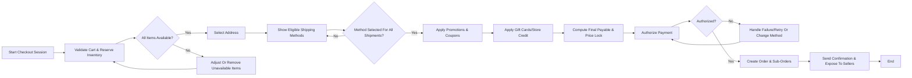
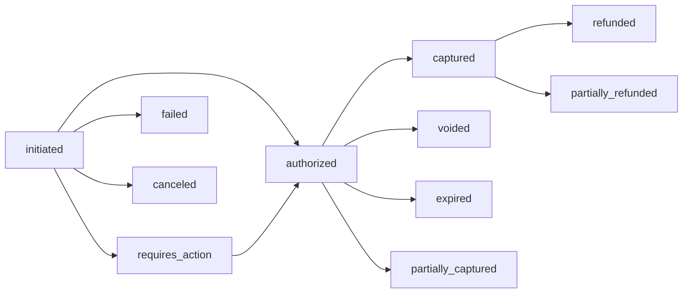
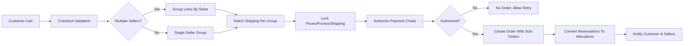

# shoppingMall Checkout and Payment Requirements

Checkout and payment flows convert a customer’s cart into one or more confirmed orders using provider-agnostic payment states and deterministic pricing rules. Business requirements below are implementation-neutral and testable using EARS syntax. Architecture, APIs, data models, and provider selection remain at the development team’s discretion.

## 1. Introduction and Scope
- Purpose: Define end-to-end behaviors for completing purchases, including preconditions, address and shipping selection, promotions and coupons, payment authorization and capture, order creation, notification triggers, failure handling, and fraud/risk controls.
- Scope: Authenticated customer checkout. Guest checkout is out of scope. Multi-seller carts are supported with per-seller sub-orders under a single customer-facing order when allowed by policy.
- Out of scope: UI/UX design, provider-specific payment or shipping integrations, APIs/data schemas, and internal infrastructure details.

### 1.1 Glossary and Concepts
- Checkout Session: Bounded interaction from entering checkout to order confirmation or abandonment.
- Order: Customer-facing record of the purchase; may contain one or more seller-specific sub-orders (shipments).
- Sub-Order/Shipment: A fulfillment unit tied to one seller or fulfillment node, with independent shipping method and tracking.
- SKU: Sellable variant identified by a unique option combination.
- Price Lock: Temporary guarantee that prices, promotions, shipping, and taxes used for payment are held for a limited time window.
- Reservation: Time-limited inventory hold per SKU to prevent oversell during checkout.
- Payment States (conceptual): "initiated", "requires_action", "authorized", "captured", "voided", "failed", "canceled", "expired", "refunded", "partially_captured", "partially_refunded".

## 2. Actors and Permissions (Business-Level)
- Customer: Initiates checkout for own cart; selects address and shipping methods; applies promotions/coupons/gift cards; authorizes payment; receives confirmations.
- Seller: Views and fulfills sub-orders belonging to their store after order creation; cannot alter customer payment state; may configure shipping methods and seller-funded promotions.
- Admin: Oversees policies (shipping, taxes at a conceptual level, promotions, coupons, gift cards), resolves disputes, applies risk holds, approves refunds where required.

| Action | Customer | Seller | Admin |
|--------|----------|--------|-------|
| Initiate checkout for own cart | ✅ | ❌ | ❌ |
| Manage delivery addresses | ✅ | ❌ | ❌ |
| Select shipping methods | ✅ | ❌ | ✅ (policy-level) |
| Apply coupons/gift cards | ✅ | ❌ | ✅ (issue/manage) |
| Authorize payment | ✅ | ❌ | ❌ |
| Create order | System (for customer) | ❌ | ✅ (intervene) |
| Cancel unpaid order | ✅ (own order) | ❌ | ✅ |
| Capture funds | System per policy | ❌ | ✅ (override) |

EARS permissions:
- WHEN a user is not authenticated, THE platform SHALL deny checkout initiation and prompt authentication.
- WHILE an order belongs to multiple sellers, THE platform SHALL restrict each seller’s visibility to their own sub-order scope only.
- IF an actor attempts an action outside their role, THEN THE platform SHALL deny with a business reason.

## 3. Preconditions for Checkout

### 3.1 Authentication, Session, and Account Readiness
- THE platform SHALL restrict checkout to authenticated customers with an active session.
- WHEN email verification is required by policy, THE platform SHALL require verified email before payment authorization.
- WHEN high-risk signals are detected (e.g., unusual device/location), THE platform SHALL require step-up verification before payment authorization.

### 3.2 Cart Validity and Ownership
- THE platform SHALL require a non-empty cart owned by the customer.
- IF a cart contains items that are disabled, region-ineligible, or non-purchasable, THEN THE platform SHALL block checkout until resolved.

### 3.3 Inventory Reservations and Stock Checks
- WHEN checkout starts, THE platform SHALL validate SKU availability and create time-limited reservations for the session duration.
- WHILE reservations are active, THE platform SHALL exclude reserved quantities from available-to-promise.
- IF availability is insufficient, THEN THE platform SHALL present adjustment options (reduce quantities or remove lines) before proceeding.

### 3.4 Price Lock
- WHEN checkout starts, THE platform SHALL establish a price lock covering item prices, applicable promotions, shipping costs, and taxes for a limited time window (e.g., 15 minutes).
- IF the price lock expires before authorization, THEN THE platform SHALL re-evaluate and present updated totals for acceptance before continuing.

## 4. Address and Shipping Method Selection

### 4.1 Address Validation and Deliverability
- WHEN a customer selects or creates an address, THE platform SHALL validate required fields (name, phone, address lines, region, postal code, country) and check deliverability.
- IF deliverability checks fail (e.g., unsupported region or postal code), THEN THE platform SHALL deny progression and show a business reason.
- WHERE P.O. Box or restricted destinations are incompatible with selected methods, THE platform SHALL require a compatible address or method.

### 4.2 Shipping Method Eligibility and Selection
- WHEN an address is confirmed, THE platform SHALL compute eligible shipping methods per seller/shipment group based on address, item constraints, and seller policies.
- WHERE multiple sellers are in the cart, THE platform SHALL allow per-seller (or per-shipment group) method selection and compute costs per group.
- IF no method is available for a group, THEN THE platform SHALL block checkout for that group and require changes.

### 4.3 Shipping Cost Lock
- WHEN a shipping method is selected, THE platform SHALL lock its cost within the price lock window.
- IF a selected method becomes unavailable before authorization, THEN THE platform SHALL require reselection and re-lock pricing.

## 5. Promotions, Coupons, and Gift Cards

### 5.1 Stack Order and Eligibility
- THE platform SHALL apply benefits in this order: (1) item-level automatic promotions, (2) order-level automatic promotions, (3) coupon codes, (4) gift cards/store credit.
- WHEN a coupon code is submitted, THE platform SHALL validate activity status, usage limits, customer eligibility, order minimums, and product/category constraints before applying.
- IF ineligible, THEN THE platform SHALL reject the coupon with a business reason.

### 5.2 Discount Calculation and Allocation
- THE platform SHALL allocate order-level discounts proportionally by pre-discount extended line values.
- WHERE rounding is required, THE platform SHALL apply deterministic rounding to ensure sum of line allocations equals the displayed total discount.

### 5.3 Concurrency and Idempotency
- WHILE multiple promotion changes occur during the session, THE platform SHALL recompute totals deterministically and avoid duplicate applications.
- WHEN a coupon is applied more than once, THE platform SHALL keep a single application outcome per the validation window.

### 5.4 Gift Cards and Store Credit
- WHEN gift cards/store credit are applied, THE platform SHALL reduce the payable amount after all promotions and coupons.
- IF balance is insufficient, THEN THE platform SHALL apply partially and retain the remainder.
- IF checkout is canceled or fails prior to order creation, THEN THE platform SHALL release any holds and restore balances immediately.

## 6. Payment Authorization and Capture (Conceptual)

### 6.1 Provider-Agnostic Payment States
- THE platform SHALL represent payment states as: "initiated", "requires_action", "authorized", "captured", "voided", "failed", "canceled", "expired", "refunded", "partially_captured", "partially_refunded".

### 6.2 Authorization
- WHEN the customer confirms payment, THE platform SHALL attempt to authorize the final payable amount after promotions, shipping, and taxes within the price lock.
- IF payer authentication is required (e.g., step-up), THEN THE platform SHALL prompt completion and resume checkout upon success.
- IF authorization fails, THEN THE platform SHALL not create an order and SHALL provide retry guidance (same or different method).

### 6.3 Capture Policy
- WHERE immediate capture is configured, THE platform SHALL capture funds at order creation.
- WHERE deferred capture is configured, THE platform SHALL capture per shipment at fulfillment and support partial capture.
- IF capture fails for a shipment, THEN THE platform SHALL not mark that shipment as paid and SHALL require remediation per operations policy.

### 6.4 Amount Integrity and Changes
- THE platform SHALL ensure the authorized amount equals the order total at authorization time; material changes SHALL trigger re-authorization.
- WHERE partial shipments occur, THE platform SHALL support partial capture up to the authorized amount.

### 6.5 Voids, Expiration, and Refunds
- WHEN an authorization is voided or expires, THE platform SHALL reflect the state and release related reservations that are no longer needed.
- WHEN a refund occurs post-capture, THE platform SHALL transition to "refunded" or "partially_refunded" following returns/refunds policy.

### 6.6 Asynchronous Methods
- WHERE payment methods settle asynchronously, THE platform SHALL hold order creation until success or expiration per method rules or create a pending state with clear constraints where business policy allows.

## 7. Order Creation and Confirmation

### 7.1 Idempotency and Single Creation
- WHEN payment authorization succeeds, THE platform SHALL create exactly one customer-facing order per checkout session even if the confirmation is submitted multiple times.

### 7.2 Structure and Allocation
- THE platform SHALL generate a unique order identifier and unique sub-order identifiers per seller group.
- WHEN an order is created, THE platform SHALL convert reservations into committed allocations for ordered quantities.

### 7.3 Notifications and Visibility
- WHEN an order is created, THE platform SHALL notify the customer with a complete financial breakdown and expected shipping timelines.
- WHERE sub-orders exist, THE platform SHALL expose them to the corresponding sellers for fulfillment.

### 7.4 Timeboxing
- IF authorization is not completed within the session window, THEN THE platform SHALL expire the session, release reservations, and revert gift card holds.

## 8. Failure Handling and Recovery

### 8.1 Payment
- IF authorization fails or is canceled, THEN THE platform SHALL not create an order and SHALL allow retry without duplicating charges.
- WHILE step-up is in progress, THE platform SHALL maintain a recoverable session state for the time allowed by the method.

### 8.2 Address and Shipping
- IF an address becomes invalid mid-session, THEN THE platform SHALL require correction before authorization.
- IF a selected shipping method becomes unavailable, THEN THE platform SHALL require reselection and price re-locking.

### 8.3 Inventory and Pricing
- IF inventory is insufficient at finalization, THEN THE platform SHALL prompt quantity reduction/removal before retrying authorization.
- IF the price lock expires, THEN THE platform SHALL recompute totals and require acceptance.

### 8.4 Concurrency and Duplicates
- THE platform SHALL treat rapid repeat confirmations as a single intent and prevent duplicate orders.
- THE platform SHALL ensure notifications for the same business event are sent at most once per channel.

### 8.5 Session Timeout and Restoration
- WHILE a session is inactive beyond timeout, THE platform SHALL expire the session and release holds.
- WHEN the user returns within a grace window, THE platform SHALL restore selections subject to revalidation.

## 9. Fraud and Risk Controls (Business-Level)
- WHEN high-risk signals are detected at checkout or post-authorization, THE platform SHALL place the order on hold pending review and prevent irreversible fulfillment actions until cleared.
- WHERE additional verification is requested (e.g., confirm identity or address), THE platform SHALL notify the customer with next steps and timelines.
- IF the review fails or the hold window elapses without resolution, THEN THE platform SHALL cancel the order and release reservations; refunds or voids SHALL occur per state.

## 10. Performance and SLA Expectations (User-Perceived)
- THE platform SHALL present eligible shipping methods within 2 seconds (P95) for typical carts (≤ 20 lines).
- THE platform SHALL validate and apply promotions/coupons within 2 seconds (P95).
- THE platform SHALL respond to payment authorization attempts within 5 seconds (P95) in common cases; step-up flows may extend up to 2 minutes.
- THE platform SHALL create and confirm the order within 3 seconds (P95) after successful authorization.

## 11. Data Validation and Monetary Consistency
- THE platform SHALL validate address fields for presence and format appropriate to the destination.
- THE platform SHALL validate one selected shipping method per shipment group prior to authorization.
- THE platform SHALL validate coupons for eligibility and deduplicate their application.
- THE platform SHALL compute totals deterministically: subtotal → discounts → shipping → tax → gift cards/credits → final payable.
- THE platform SHALL prevent negative line totals and negative final payable; excess SHALL be handled by capping benefits or restoring balances.
- THE platform SHALL fix one currency per order at checkout start; conversion for reporting is out of scope here.
- THE platform SHALL support independent shipping costs and fulfillment statuses per seller sub-order within a single order.

## 12. Diagrams (Mermaid)

### 12.1 Checkout Flow (High-Level)

### 12.2 Payment States (Conceptual)

### 12.3 Multi-Seller Split and Allocation (Conceptual)

## 13. Cross-References
- Catalog and variants: see the [Catalog, Search, and Variants Requirements](./05-shoppingMall-catalog-search-and-variants.md).
- Cart lifecycle and pre-checkout rules: see the [Cart and Wishlist Requirements](./06-shoppingMall-cart-and-wishlist.md).
- Order and shipping lifecycle after creation: see the [Order and Shipping Management Requirements](./08-shoppingMall-order-and-shipping-management.md).
- Inventory reservations and adjustments: see the [Inventory Management Requirements](./09-shoppingMall-inventory-management.md).
- Returns, cancellations, and refunds: see the [Returns, Cancellations, and Refunds Requirements](./11-shoppingMall-returns-cancellations-and-refunds.md).
- Security, privacy, and compliance: see the [Security, Privacy, and Compliance Requirements](./14-shoppingMall-security-privacy-and-compliance.md).
- Performance targets and SLAs: see the [Performance and SLA Requirements](./15-shoppingMall-performance-and-sla.md).
- Notifications and reporting: see the [Notifications, Communications, and Reporting Requirements](./16-shoppingMall-notifications-communications-and-reporting.md).

## 14. Acceptance Criteria (Business-Level Examples)
- WHEN a customer begins checkout with a valid cart, THE platform SHALL reserve inventory, lock prices, and present eligible shipping methods within stated SLAs.
- WHEN the customer applies valid coupons and gift cards, THE platform SHALL recompute totals deterministically and reflect prorated discounts across eligible lines.
- WHEN payment authorization succeeds, THE platform SHALL create exactly one order with sub-orders per seller and send a confirmation.
- IF payment fails or is canceled, THEN THE platform SHALL not create an order and SHALL release reservations and gift card holds immediately.
- WHEN an order is placed on risk hold, THE platform SHALL block irreversible fulfillment until cleared or canceled per policy.

## 15. Consolidated EARS Requirements Index

Preconditions
- THE platform SHALL restrict checkout to authenticated customers and verified email where required by policy.
- WHEN checkout starts, THE platform SHALL validate availability and create time-limited reservations per SKU.
- WHEN checkout starts, THE platform SHALL lock prices, promotions, shipping costs, and taxes for a defined window.

Address & Shipping
- WHEN an address is selected, THE platform SHALL validate deliverability and compute eligible shipping methods per seller group.
- IF no shipping method is available for a group, THEN THE platform SHALL block checkout for that group and require changes.
- WHEN a shipping method is selected, THE platform SHALL lock its cost within the price lock window.

Promotions & Coupons
- THE platform SHALL apply promotions in the defined stack order and allocate discounts deterministically.
- IF a coupon is ineligible, THEN THE platform SHALL reject it with a business reason.

Payment
- WHEN payment is confirmed, THE platform SHALL attempt authorization for the final payable amount.
- IF authorization requires action, THEN THE platform SHALL resume checkout upon successful action.
- IF authorization fails, THEN THE platform SHALL not create an order and SHALL allow retry.
- WHERE deferred capture is configured, THE platform SHALL support partial capture per shipment.

Order Creation
- WHEN authorization succeeds, THE platform SHALL create exactly one order per session and convert reservations to allocations.
- THE platform SHALL generate unique identifiers for the order and each sub-order.

Failures & Recovery
- IF the price lock expires, THEN THE platform SHALL recompute totals and require acceptance.
- IF inventory is insufficient, THEN THE platform SHALL prompt adjustments before reattempting authorization.
- THE platform SHALL treat rapid repeat confirmations as a single intent to prevent duplicates.

Fraud & Risk
- WHEN high-risk signals are detected, THE platform SHALL place the order on hold and block irreversible fulfillment until cleared.

Performance
- THE platform SHALL meet user-perceived response targets for shipping methods, promotions, authorization, and order confirmation at P95 thresholds.

Notifications
- WHEN an order is created, THE platform SHALL send confirmation to the customer and expose sub-orders to sellers.

All content above is business-level and provider-agnostic, using EARS where applicable and complying with diagram syntax and cross-document consistency.
