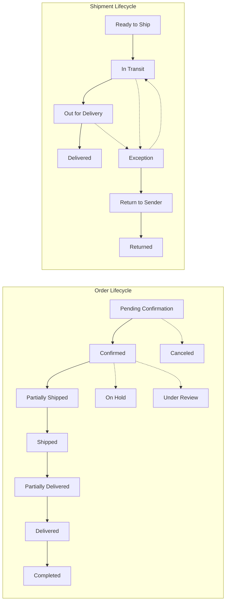
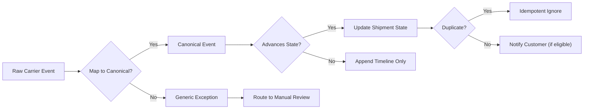
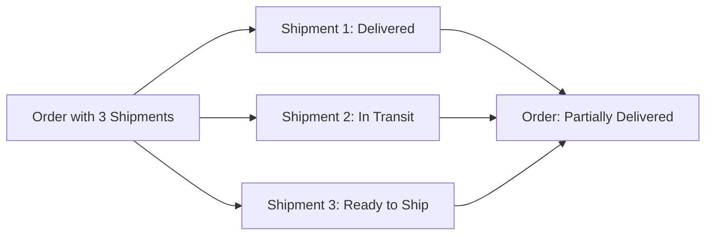
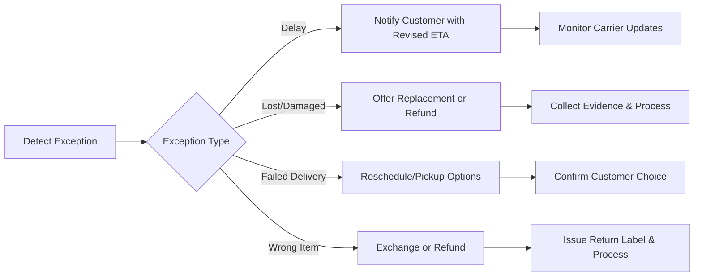

# Functional Requirements – Order Tracking and Shipping (shoppingMall)

## 1. Scope and Objectives
Defines business behavior for order tracking and shipping across the shoppingMall marketplace. Establishes unambiguous order- and shipment-level states, canonical mapping of carrier events, rules for multi-seller and split shipments, exception handling policies, notification triggers and timing, role-based responsibilities, performance targets, KPIs, and audit expectations. Avoids technical implementation specifics (no APIs, schemas, or carrier/gateway protocol details).

Objectives
- Provide consistent, testable order and shipment lifecycles in business terms.
- Ensure timely and accurate status updates with clear customer communication.
- Support multi-seller orders, split shipments, and partial resolutions without blocking unaffected items.
- Define exception detection, remediation, and escalation with measurable SLAs.
- Preserve auditability, privacy, and localization expectations.

## 2. Terminology and Entities (Business-Level)
- Order: A confirmed purchase; may include items from multiple sellers. Has one or more shipments. Customer-facing summaries aggregate shipment states.
- Shipment: A package or group of items handled together through a carrier with its own tracking and timeline.
- Carrier: Third-party shipping provider emitting raw events mapped to canonical business events.
- Canonical Event: Platform-standardized shipping event (e.g., "In Transit", "Delivered").
- Customer: Authenticated buyer who placed the order.
- Seller: Merchant fulfilling a subset of order items.
- Support Agent: Staff who resolves exceptions and disputes.
- Operations Manager: Staff who governs policy and oversees fulfillment performance.
- System Admin: Staff managing global settings and escalations.

## 3. Order Status Lifecycle (Business States)
Customer-facing order states derive deterministically from payment/fulfillment progression across shipments.

Order-level states
- "Pending Confirmation": Order created; payment authorization pending or just completed; pre-fulfillment checks underway.
- "Confirmed": Order accepted for fulfillment.
- "Partially Shipped": At least one shipment has departed; others not yet shipped.
- "Shipped": All shipments have departed.
- "Partially Delivered": At least one shipment delivered; others not yet delivered.
- "Delivered": All shipments delivered.
- "Completed": Post-delivery window elapsed without open issues; order considered closed.
- "On Hold": Manual hold applied (e.g., fraud review) before fulfillment resumes or cancels.
- "Under Review": Fraud/compliance review prevents fulfillment.
- "Canceled": Order canceled before any shipment departs.
- "Refunded": Order fully refunded (partial refunds remain annotated at line/shipment level).

EARS – Order-level derivation and timing
- THE shoppingMall platform SHALL represent order-level states using the enumeration above.
- WHEN the first shipment departs and at least one shipment remains unshipped, THE shoppingMall platform SHALL set the order to "Partially Shipped" within 5 minutes.
- WHEN all shipments depart, THE shoppingMall platform SHALL set the order to "Shipped" within 5 minutes of the last departure.
- WHEN the first shipment is delivered and at least one shipment remains undelivered, THE shoppingMall platform SHALL set the order to "Partially Delivered" within 5 minutes.
- WHEN all shipments are delivered, THE shoppingMall platform SHALL set the order to "Delivered" within 5 minutes of the last delivery confirmation.
- WHERE a configurable completion window applies (default 7 calendar days after last delivery), THE shoppingMall platform SHALL set the order to "Completed" automatically when the window elapses without unresolved issues.
- IF an order is canceled before any shipment departs, THEN THE shoppingMall platform SHALL set the order to "Canceled" immediately upon cancellation confirmation.
- WHERE a partial refund occurs, THE shoppingMall platform SHALL annotate item/shipment refunds without altering the order to "Refunded" unless the order is fully refunded.

Order and Shipment Lifecycle Diagram

## 4. Shipment Lifecycle and Carrier Event Mapping

### 4.1 Canonical Events (Business Standard)
- "Label Created"
- "Picked Up / First Scan"
- "In Transit"
- "Arrived at Facility" / "Departed Facility"
- "Out for Delivery"
- "Delivery Attempted"
- "Delivered"
- "Exception" (e.g., Weather Delay, Address Issue, Customs Hold, Damage, Lost)
- "Return Initiated"
- "Returned to Origin"

EARS – Canonicalization and correctness
- THE shoppingMall platform SHALL map raw carrier messages to the canonical event set above.
- WHERE a raw event could represent multiple canonical events, THE shoppingMall platform SHALL select the most advanced canonical event consistent with prior events without skipping unobserved states.

### 4.2 Mapping Rules and Conflict Resolution
Illustrative mapping (carrier-agnostic business logic):
- Manifested / Label generated / Awaiting pickup → "Label Created"
- Pickup scan / Accepted at origin → "Picked Up / First Scan"
- Arrived/Departed facility → "In Transit"
- Out for delivery → "Out for Delivery"
- No one available / Attempted delivery → "Delivery Attempted"
- Delivered / Signed / Left at door → "Delivered"
- Address not found / Weather delay / Customs hold / Damaged / Lost → "Exception (reason)"
- Return to sender initiated → "Return Initiated"; Arrived at origin → "Returned to Origin"

EARS – Conflicts, idempotency, and ordering
- IF a less-advanced event arrives after a more-advanced event, THEN THE shoppingMall platform SHALL ignore the regression and preserve the most advanced state while appending the raw event to the internal timeline.
- IF duplicate events are received, THEN THE shoppingMall platform SHALL process idempotently and SHALL not create duplicate customer-visible entries.
- WHEN two events of equal advancement arrive with differing timestamps, THE shoppingMall platform SHALL prefer the latest timestamp and annotate the earlier as superseded.
- IF an event arrives older than the current shipment state's timestamp, THEN THE shoppingMall platform SHALL archive it without downgrading the state.
- IF an event indicates "Delivered" after "Return to Sender", THEN THE shoppingMall platform SHALL flag the shipment for manual review and display the most conservative customer-visible state until resolved.

Canonical Mapping Flow

### 4.3 Proof of Delivery and Signature Rules (Business)
- WHERE a carrier includes a recorded recipient signature or photo proof, THE shoppingMall platform SHALL display a non-sensitive proof indicator to the customer and retain detailed proof metadata for staff audit only.
- WHERE the shipping option requires signature on delivery, THE shoppingMall platform SHALL show "Signature Required" on the order detail and SHALL not mark as "Delivered" until the signed event is received or an equivalent proof is provided by the carrier.

## 5. Multi-Seller and Partial Shipments

EARS – Multi-seller shipment creation and aggregation
- WHEN an order contains items from multiple sellers, THE shoppingMall platform SHALL create at least one shipment per seller and SHALL allow additional shipments per seller when operationally needed.
- WHERE split shipments are created, THE shoppingMall platform SHALL show each shipment with separate tracking and status while computing order-level state according to Section 3.
- WHEN at least one shipment is delivered and others are not, THE shoppingMall platform SHALL set the order to "Partially Delivered" and present a progress summary such as "2 of 3 shipments delivered".

Split/Merge Constraints
- Splitting: Allowed before carrier pickup; prohibited after pickup.
- Merging: Allowed before any label is created; prohibited after label creation for involved items.

EARS – Split/Merge rules
- WHEN a shipment is split before pickup, THE shoppingMall platform SHALL create new tracking numbers as required and update customer-visible shipment lists within 2 minutes.
- IF a merge request includes any shipment with an existing label, THEN THE shoppingMall platform SHALL deny the merge and retain existing shipments.

Aggregation Summary (Conceptual)

## 6. Delivery Exceptions and Reattempt Policies

Attempt limits and windows
- Default: Up to 3 delivery attempts within 7 calendar days from first attempt; cooling periods follow carrier norms (typically next business day).

EARS – Attempts and escalation
- WHEN a delivery attempt fails, THE shoppingMall platform SHALL record the attempt with timestamp and carrier reason.
- WHERE the number of attempts reaches 3 within 7 days, THE shoppingMall platform SHALL transition the shipment to "Return to Sender" unless a scheduled pickup or hold is confirmed.

Address changes and holds
- Address changes permitted until "Out for Delivery"; costs or feasibility may vary by carrier and require seller approval.

EARS – Address and holds
- IF a customer requests an address change while the shipment is "In Transit", THEN THE shoppingMall platform SHALL forward the request to the seller, annotate the shipment with "Address Change Requested", and display the seller decision once available.
- WHEN "Hold at Location" is approved, THE shoppingMall platform SHALL capture the hold location and pickup window in the shipment timeline and notify the customer.

Lost/Damaged/Return-to-Sender handling
- Lost: No scans for 7 consecutive days domestic (14 cross-border) → start "Lost Investigation".
- Damaged: Carrier reports damage → seller/platform remediation flow.
- Return to Sender: After attempt limit or refusal → process replacement or refund per policy upon return receipt.

EARS – LDR responses
- IF no carrier scans occur within 7 days domestically (or 14 days cross-border), THEN THE shoppingMall platform SHALL set shipment state to "Exception (Lost Suspected)" and notify both customer and seller with next steps.
- WHEN carrier flags damage, THE shoppingMall platform SHALL set shipment state to "Exception (Damaged)" and initiate remediation with evidence capture.
- WHEN a returned shipment is received by the seller, THE shoppingMall platform SHALL set shipment state to "Returned" and prompt replacement or refund per policy.

Delivery Exception Handling Flow

## 7. Notifications and Timing

Triggers and timing (customer-facing)
- WHEN an order is "Confirmed", THE shoppingMall platform SHALL notify the customer within 2 minutes.
- WHEN a shipment transitions to "In Transit", THE shoppingMall platform SHALL notify within 5 minutes including carrier and tracking link.
- WHEN a shipment transitions to "Out for Delivery", THE shoppingMall platform SHALL notify within 2 minutes.
- WHEN "Delivery Attempted" occurs, THE shoppingMall platform SHALL notify within 10 minutes including next steps.
- WHEN a shipment is "Delivered", THE shoppingMall platform SHALL notify within 10 minutes and start the post-delivery window timer.
- IF an "Exception" is recorded, THEN THE shoppingMall platform SHALL notify within 15 minutes with actionable guidance.
- WHERE an order has multiple shipments, THE shoppingMall platform SHALL send separate notifications per shipment and an optional aggregated digest.

Channels, preferences, and localization
- Supported channels: email and in-app; optional SMS/push when opted in.

EARS – Channel and locale
- WHERE a customer has opted in to SMS or push, THE shoppingMall platform SHALL deliver via those channels in addition to email.
- IF a customer opts out of a channel, THEN THE shoppingMall platform SHALL cease notifications via that channel while retaining mandatory transactional email.
- THE shoppingMall platform SHALL render notification timestamps in the customer’s timezone and preferred language (e.g., en-US) while storing UTC for audit.

Content requirements (business)
- Include status, shipment count context, item summary, carrier, tracking number, tracking URL, and next-step guidance when applicable.

## 8. Roles, Responsibilities, and SLAs

Access and actions
- Customers: View order/shipment states and timelines for their own orders; request address changes/holds where allowed.
- Sellers: View and update shipping details for own orders and shipments; respond to exceptions; cannot modify customer preferences.
- Support Agents: View/annotate timelines, apply manual corrections with case references, trigger notification resends, mediate exceptions.
- Operations Manager/System Admin: Oversee platform-wide shipments, adjust policies, resolve mapping issues, and enforce SLAs.

EARS – Permissions and SLAs
- IF a user attempts to view or modify an order they do not own, THEN THE shoppingMall platform SHALL deny access and log the attempt.
- WHEN a seller generates a label, THE shoppingMall platform SHALL require carrier, tracking number, and ship date within 24 hours.
- WHEN a carrier event is received, THE shoppingMall platform SHALL update the shipment state within 5 minutes and append to the visible timeline.
- IF a seller misses a configured handling-time SLA, THEN THE shoppingMall platform SHALL flag the order and notify operations for review.

## 9. KPIs and Performance Targets (Fulfillment)

Definitions
- On-time Shipment Rate (OTSR)
- On-time Delivery Rate (OTDR)
- First-Attempt Delivery Success (FADS)
- Average Handling Time (AHT – Order to first scan)
- Average Transit Time (ATT – First scan to delivery)
- Tracking Validity Rate (TVR)
- Exception Resolution Time (ERT)

Targets and measurement windows
- OTSR ≥ 95% (30-day rolling)
- OTDR ≥ 92% (30-day rolling; by lane/SLA)
- FADS ≥ 90% (30-day rolling)
- TVR ≥ 99% (monthly)
- ERT median ≤ 48 hours (monthly)
- AHT median ≤ 24 hours (weekly); ATT benchmark by lane

EARS – KPI calculation and response
- THE shoppingMall platform SHALL compute the KPIs above on rolling windows and expose them for operational review by authorized roles.
- WHERE a KPI falls below target, THE shoppingMall platform SHALL flag the metric and identify contributing shipments and sellers for remediation workflows.

## 10. Performance and Reporting Expectations (Business)

Customer experience latency
- WHEN a customer requests order status, THE shoppingMall platform SHALL return current state and latest timeline within 2 seconds under normal load.
- WHEN a shipment state changes, THE shoppingMall platform SHALL make the updated state visible in order details within 5 minutes of event receipt.

Operational reporting
- THE shoppingMall platform SHALL provide aggregate counts of shipments by state and exception reason for the last 24 hours, 7 days, and 30 days, segmented by seller and lane.

## 11. Auditability, Traceability, Privacy, and Retention (Business)
- THE shoppingMall platform SHALL record all status changes with actor, timestamp, source (carrier/seller/platform), event reason, and correlation IDs.
- THE shoppingMall platform SHALL present customer timelines with non-sensitive details only; staff-facing audit logs MAY include additional necessary metadata.
- WHERE privacy policies restrict exposure, THE shoppingMall platform SHALL mask or omit sensitive elements (e.g., exact geolocation) in customer-facing timelines.
- THE shoppingMall platform SHALL retain shipment timelines and audit logs for at least 1 year after order completion, and retain escalations/dispute records for at least 3 years, subject to jurisdiction.

## 12. Acceptance Criteria (Business) and EARS Index

Acceptance criteria
- Order- and shipment-level states appear and transition strictly as defined; order states update within specified windows.
- Carrier events are canonicalized; duplicates/regressions do not corrupt timelines; idempotency preserved.
- Exceptions trigger appropriate remediation flows and timely customer/staff notifications.
- Notifications respect preferences, localization, and timezones; content includes required fields.
- KPIs and SLAs are measurable and monitored; breaches raise flags.
- Audit logs contain required actors, timestamps, and reason codes; customer timelines exclude sensitive data.

Selected EARS index (non-exhaustive)
- WHEN the first shipment is delivered, THE shoppingMall platform SHALL set the order to "Partially Delivered" within 5 minutes.
- WHEN all shipments are delivered, THE shoppingMall platform SHALL set the order to "Delivered" within 5 minutes.
- WHEN a carrier reports "Out for Delivery", THE shoppingMall platform SHALL set the shipment to "Out for Delivery" and notify within 2 minutes.
- IF an exception (e.g., Weather Delay) occurs, THEN THE shoppingMall platform SHALL set the shipment to "Exception" and notify within 15 minutes with guidance.
- WHEN delivery attempts reach the configured limit, THE shoppingMall platform SHALL transition to "Return to Sender" unless a pickup/hold is confirmed.
- WHEN a "Delivered" event includes signature requirement, THE shoppingMall platform SHALL consider the shipment delivered only after signature proof is received.
- WHEN a customer requests address change while "In Transit", THE shoppingMall platform SHALL forward the request, annotate the timeline, and reflect the decision.
- WHEN a carrier event is received, THE shoppingMall platform SHALL update customer-visible status within 5 minutes and record the source and correlation ID.
- WHEN an order has shipments from multiple sellers, THE shoppingMall platform SHALL present per-shipment tracking and aggregate order-level progress.

## 13. Related Materials
- Functional Requirements – Checkout, Payment, and Orders: business rules for order creation and captures.
- Functional Requirements – Seller Portal: seller fulfillment responsibilities and SLAs.
- Functional Requirements – Reviews and Ratings: post-delivery eligibility for reviews.
- Business Rules, Data Lifecycle, and Events: canonical entities and lifecycle event reactions.
- Non-Functional Requirements – Performance, Security, and Compliance: cross-cutting latency, availability, security, and localization expectations.

End of requirements.