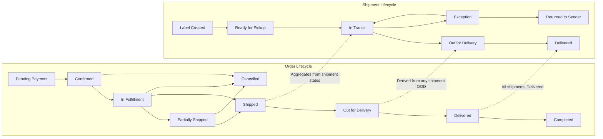

# shoppingMall Order and Shipping Management Requirements

This document specifies the business requirements for end-to-end order lifecycle and shipping management in the shoppingMall platform. It defines states, transitions, shipping options, tracking updates, delivery exceptions, order editing constraints, and timeliness expectations. It describes WHAT the system should do from a business perspective and deliberately avoids technical implementation details such as APIs, database schemas, or provider-specific integrations.

## 1. Introduction and Scope
- THE shoppingMall platform SHALL manage the lifecycle from post-checkout order creation through delivery completion and any subsequent cancellation/refund processes at a business level.
- THE scope of this document SHALL include: order statuses, shipment statuses, transition rules, shipping methods (conceptual), tracking updates, delivery exceptions, order editing constraints, and SLAs for updates.
- THE scope of this document SHALL exclude: low-level technical details (APIs, database schema), UI design, provider-specific integrations, and policy definitions already owned by returns/cancellations/refunds or performance-wide SLAs beyond update-specific expectations.

## 2. Actors and Access (Business-Level)
- Actors: customer, seller, admin.
- THE customer SHALL create and track their own orders and request cancellations or refunds subject to policy.
- THE seller SHALL fulfill and update shipping information for orders that belong to their store and respond to delivery exceptions per policy.
- THE admin SHALL have oversight capability to view and intervene in orders, shipments, and exceptions across the platform, including dispute resolution.

## 3. Definitions and Concepts
- Order: A business record representing a customer purchase that may contain one or more line items from one or more sellers, potentially split into multiple shipments.
- Shipment: A business record representing a physical package or parcel (or controlled handoff event) associated with an order, with carrier, tracking, and delivery milestones.
- Partial Fulfillment: The condition where an order is shipped in multiple shipments at different times.
- Order Status vs Shipment Status: Order status is an aggregate of fulfillment and financial states; Shipment status tracks physical movement of goods.
- Business Day: Default business day calculations SHALL follow the seller’s business calendar where relevant; if unspecified, they SHALL default to the platform’s standard business calendar.
- Timezone: Timestamps shown to end users SHALL be localized to the user’s profile timezone with fallback to the platform default.

## 4. Order Status Lifecycle

### 4.1 Order-Level States (Canonical)
- Draft (pre-order): Defined in checkout; not part of the post-order lifecycle.
- Pending Payment: Order created, awaiting payment authorization/capture (see checkout document).
- Confirmed: Payment authorized/captured; order accepted for fulfillment.
- In Fulfillment: Seller(s) preparing items; may include picking, packing, and labeling.
- Partially Shipped: At least one shipment has been shipped, but not all.
- Shipped: All shipments dispatched.
- Out for Delivery: Last-mile courier indicates active delivery attempt (shipment-level aggregation).
- Delivered: All shipments delivered.
- Completed: Post-delivery window elapsed with no pending issues; order lifecycle closed.
- Cancelled: Order or remaining unshipped portions cancelled per policy.
- Refunded/Partially Refunded: Refund(s) processed per policy (see returns/cancellations/refunds document).

EARS Requirements:
- THE order lifecycle SHALL include the states “Pending Payment”, “Confirmed”, “In Fulfillment”, “Partially Shipped”, “Shipped”, “Out for Delivery”, “Delivered”, “Completed”, “Cancelled”, and “Refunded/Partially Refunded”.
- WHEN payment moves from authorized to captured, THE order status SHALL become “Confirmed” unless business rules dictate immediate “Cancelled” (e.g., fraud decline).
- WHILE any shipment is being prepared, THE order status SHALL be “In Fulfillment”.
- WHEN at least one shipment is dispatched and at least one is not, THE order status SHALL be “Partially Shipped”.
- WHEN all shipments are dispatched, THE order status SHALL be “Shipped”.
- WHEN any shipment reports “Out for Delivery” and none are in exception, THE order status SHALL be “Out for Delivery”.
- WHEN all shipments report “Delivered”, THE order status SHALL be “Delivered”.
- WHEN the configurable post-delivery confirmation window elapses with no active issues, THE order status SHALL be “Completed”.
- IF all remaining unshipped items are cancelled, THEN THE order status SHALL transition to “Cancelled”.
- WHERE refunds are processed for any portion, THE order status SHALL reflect “Refunded/Partially Refunded” while preserving the last fulfillment status context for audit.

### 4.2 Shipment-Level States (Canonical)
- Label Created: Shipment record created and label generated.
- Ready for Pickup: Package ready for carrier pickup or drop-off.
- In Transit: Carrier indicates movement between facilities.
- Out for Delivery: Carrier indicates it is on the last-mile route.
- Delivered: Carrier indicates delivery completed.
- Exception: Carrier indicates a problem (e.g., failed attempt, address issue, customs hold).
- Returned to Sender: Carrier indicates return to origin in progress or completed.

EARS Requirements:
- THE shipment lifecycle SHALL include “Label Created”, “Ready for Pickup”, “In Transit”, “Out for Delivery”, “Delivered”, “Exception”, and “Returned to Sender”.
- WHEN a label is generated by seller action, THE shipment status SHALL be “Label Created”.
- WHEN the package is staged for handover, THE shipment status SHALL be “Ready for Pickup”.
- WHEN the carrier scan indicates movement, THE shipment status SHALL be “In Transit”.
- WHEN carrier marks last-mile handoff, THE shipment status SHALL be “Out for Delivery”.
- WHEN carrier delivers, THE shipment status SHALL be “Delivered”.
- WHEN carrier reports an issue that interrupts planned flow, THE shipment status SHALL be “Exception”.
- IF the carrier indicates reversal to the origin, THEN THE shipment status SHALL be “Returned to Sender”.

### 4.3 Multi-Shipment and Partial Fulfillment
- THE platform SHALL support multiple shipments per order, each with independent tracking and milestones.
- WHERE an order contains items from multiple sellers, THE platform SHALL allow seller-specific shipments and timelines.
- WHILE at least one shipment remains undelivered, THE order SHALL not be “Completed”.

### 4.4 State Transition Rules (Order-Level)
- Allowed transitions (business-level):
  - “Pending Payment” → “Confirmed”
  - “Confirmed” → “In Fulfillment”
  - “In Fulfillment” → “Partially Shipped” or “Shipped”
  - “Partially Shipped” → “Shipped”
  - “Shipped” → “Out for Delivery” → “Delivered” → “Completed”
  - Any pre-shipment state → “Cancelled” (subject to constraints)
  - Post-shipment cancellation limited to unshipped items; shipped items follow returns policy
- Disallowed transitions examples:
  - “Delivered” → “In Fulfillment” (not allowed)
  - “Completed” → any non-terminal state (not allowed)

EARS Requirements:
- IF a transition is not explicitly allowed, THEN THE platform SHALL reject the transition with a business error.
- WHEN a transition occurs, THE platform SHALL record transition timestamp, actor (system/seller/admin), and rationale where applicable.

### 4.5 Mermaid Diagram: Order and Shipping State Flow

## 5. Shipping Options and Carriers (Conceptual)
### 5.1 Shipping Methods
- THE platform SHALL support configurable shipping methods including “Standard”, “Expedited”, “Express”, and “Store Pickup/Local Delivery” where enabled by seller.
- WHERE a seller disables a method for certain regions or weights, THE platform SHALL enforce those constraints at checkout and during fulfillment.
- THE platform SHALL support multi-parcel shipments for a single order.

EARS Examples:
- WHERE “Store Pickup” is enabled, THE platform SHALL allow shipments without a carrier or tracking number and SHALL still progress shipment statuses based on seller updates.
- IF a shipping method is incompatible with the destination or package attributes, THEN THE platform SHALL prohibit selection and provide a business reason.

### 5.2 Carrier-Agnostic Milestones
- THE platform SHALL treat carrier events as inputs mapped to canonical milestones defined in this document.
- WHEN a carrier-specific event is received, THE platform SHALL map it deterministically to one of: “Ready for Pickup”, “In Transit”, “Out for Delivery”, “Delivered”, or “Exception”.

### 5.3 Packaging and Multi-Parcel Considerations
- THE seller SHALL be able to create multiple parcels under one shipment group for large orders.
- THE platform SHALL track each parcel’s tracking number where applicable.
- WHILE any parcel is not delivered, THE associated shipment SHALL not be “Delivered”.

## 6. Tracking Updates and Notifications
### 6.1 Tracking Event Sources and Mapping
- Sources: carrier event feeds, seller manual updates (where permitted), and system inferences based on elapsed time.
- THE platform SHALL process tracking events in chronological order by carrier timestamp, with idempotent behavior for duplicate events (business-level requirement).
- WHEN a tracking event advances a shipment milestone, THE platform SHALL update shipment status and recompute the order’s aggregate status.
- IF a tracking event is stale (older than the current known status), THEN THE platform SHALL ignore it but retain it in the audit log with reason “stale event”.

### 6.2 Customer, Seller, and Admin Notifications
- THE platform SHALL send transactional notifications on the following milestones at minimum: order confirmed, item shipped, out for delivery, delivered, delivery exception, return to sender.
- WHEN a milestone triggers, THE platform SHALL notify the order’s customer and the responsible seller; admins SHALL receive alerts only for exception or dispute-related triggers according to platform policy.
- WHERE the order has multiple shipments, THE platform SHALL send shipment-specific notifications and provide context linking the shipment to the overall order.

EARS Timing Requirements:
- WHEN a qualifying milestone occurs, THE platform SHALL enqueue notifications within 1 minute and dispatch them within 5 minutes under normal operating conditions.
- IF dispatch fails, THEN THE platform SHALL retry according to the platform’s notification policy and record attempts.

### 6.3 Localization and Timezone Behavior
- THE platform SHALL present tracking timestamps in the customer’s profile timezone with fallback to the platform default.
- WHERE the seller’s or carrier’s local times differ, THE platform SHALL preserve the original event time and label the displayed time with the customer’s timezone indicator.

## 7. Delivery Exceptions and Reattempts
### 7.1 Common Exception Types
- Address Issue: invalid or incomplete address, recipient unavailable.
- Failed Delivery Attempt: recipient absent, restricted access.
- Customs/Regulatory Hold: pending duties or documents.
- Damage/Loss Reported: package damaged or lost in transit.
- Weather/Force Majeure: carrier-delayed conditions outside seller control.

EARS Requirements:
- WHEN an exception is received, THE platform SHALL set shipment status to “Exception” with a categorized reason.
- WHEN an exception is resolved and movement resumes, THE platform SHALL transition shipment back to “In Transit” and notify the customer and seller.

### 7.2 Reattempts and Holds
- THE default number of reattempts SHALL be configurable per carrier/method with a platform default of 2 additional attempts after the first.
- WHEN a failed attempt occurs, THE platform SHALL notify customers with the next expected attempt window if available.
- WHERE holds at carrier location are possible, THE platform SHALL display pickup instructions to customers.

### 7.3 Lost/Damaged/Return-to-Sender Handling
- IF the carrier marks a shipment as lost or damaged, THEN THE platform SHALL notify the seller and admin and flag the order for remediation.
- WHERE “Returned to Sender” is reported, THE platform SHALL notify the customer, seller, and admin and SHALL prevent “Delivered” or “Completed” transitions for the affected items.
- WHEN remediation is initiated (replacement or refund), THE platform SHALL link the action to the original order for audit and customer visibility.

## 8. Order Editing Constraints
### 8.1 What Can Be Edited and When
- Addresses:
  - WHEN order status is “Confirmed” or “In Fulfillment” and no shipment has been dispatched, THE customer or seller SHALL be able to request an address change subject to seller approval and method eligibility.
  - IF any shipment has been dispatched, THEN THE platform SHALL block address changes at the order level; shipment-level rerouting MAY be allowed where carrier policies permit (business policy dependent).
- Items and Quantities:
  - WHILE in “Confirmed” or “In Fulfillment”, THE seller SHALL be able to remove out-of-stock items or adjust quantities downward with customer notification and price adjustment.
  - IF quantity increases are requested post-order, THEN THE platform SHALL require a new order for the additional quantity.
- Shipping Method:
  - WHEN no shipment has been dispatched, THE seller SHALL be able to upgrade shipping method at buyer’s request, with incremental charges handled per checkout/payment rules.
- Contact Details:
  - THE customer SHALL be able to update contact phone/email until first shipment dispatch; changes SHALL apply to future notifications only.

### 8.2 Cancellation Windows
- Pre-Dispatch:
  - WHEN order status is “Confirmed” or “In Fulfillment” and no shipments dispatched, THE customer SHALL be able to request full order cancellation subject to seller approval and policy timelines.
- Post-Dispatch:
  - IF some shipments are dispatched, THEN THE platform SHALL allow cancellation of undispached items only; shipped items SHALL follow returns policy.
- EARS Timing:
  - WHERE a seller does not act on a cancellation request within a configurable SLA (e.g., 24 hours), THE platform SHALL auto-escalate to admin review.

### 8.3 Address Changes and Shipping Method Changes
- Address Change:
  - WHEN address validation fails business rules (e.g., unsupported region), THE platform SHALL reject the change and preserve the original.
- Method Change:
  - IF method change results in a price difference, THEN THE platform SHALL require customer confirmation of the adjusted total before proceeding.

## 9. SLA Expectations for Updates
### 9.1 Tracking Update Latency
- WHEN a carrier event is available to the platform, THE system SHALL reflect the new shipment status within 15 minutes under normal conditions.
- IF carrier feeds are delayed beyond 60 minutes, THEN THE platform SHALL flag the shipment as “stale tracking” for admin visibility.

### 9.2 Notification Dispatch Timeliness
- THE platform SHALL dispatch milestone notifications within 5 minutes of status change under normal conditions.
- IF notification dispatch exceeds 15 minutes, THEN THE platform SHALL log a breach for operational follow-up.

### 9.3 Seller Fulfillment Timelines
- WHERE the listing advertises a handling time (e.g., “ships in 2 business days”), THE seller SHALL mark shipments as “Ready for Pickup” within that window or provide reason for delay.
- IF seller fails to meet advertised handling time, THEN THE platform SHALL notify the customer of the delay and provide the seller’s updated expectation.

## 10. Permissions Matrix (Business-Level)

| Action | Customer | Seller | Admin |
|--------|----------|--------|-------|
| View own orders | ✅ | ✅ (own store orders) | ✅ |
| Edit shipping address pre-dispatch | ✅ (request) | ✅ (approve/deny) | ✅ |
| Edit contact details pre-dispatch | ✅ | ✅ | ✅ |
| Change shipping method pre-dispatch | ✅ (request) | ✅ (execute) | ✅ |
| Create shipment/label | ❌ | ✅ | ✅ |
| Update tracking info | ❌ | ✅ | ✅ |
| Mark order shipped | ❌ | ✅ | ✅ |
| Resolve exceptions | ❌ | ✅ | ✅ |
| Cancel pre-dispatch | ✅ (request) | ✅ (execute) | ✅ |
| Cancel post-dispatch (undispatched items) | ✅ (request) | ✅ (execute) | ✅ |
| Mark delivered (manual override) | ❌ | ❌ | ✅ (with audit) |
| Initiate refund (policy-bound) | ✅ (request) | ✅ (initiate per policy) | ✅ |

EARS Permissions:
- IF a user attempts an action outside their role permissions, THEN THE platform SHALL deny the action with a business reason.
- WHERE an admin override occurs, THE platform SHALL require reason entry and record the actor and timestamp.

## 11. Error Handling and Recovery Scenarios
- Duplicate Events:
  - WHEN duplicate tracking events arrive, THE platform SHALL treat them idempotently and SHALL not regress the shipment status.
- Conflicting Events:
  - IF a newer event indicates an earlier state (regression), THEN THE platform SHALL ignore the regression and record a conflict note.
- Missing Tracking:
  - IF no tracking updates are received within a configurable interval (e.g., 72 hours) after “In Transit”, THEN THE platform SHALL alert seller and admin for investigation and inform the customer of the delay.
- Undeliverable:
  - WHEN a shipment is marked undeliverable, THE platform SHALL prompt sellers with remediation options (resend, refund per policy) and inform the customer of next steps.

## 12. Auditability, Idempotency (Business-Level), and Reconciliation
- THE platform SHALL maintain an immutable sequence of order and shipment status changes with actor, timestamp, and reason where applicable.
- THE platform SHALL ensure that processing the same tracking event more than once does not produce duplicate or conflicting outcomes.
- THE platform SHALL support reconciliation views comparing expected vs actual milestones to identify anomalies (e.g., shipped but not delivered after N days).

## 13. Dependencies and Relationships to Other Documents
- For payment and order creation preconditions, refer to the [Checkout and Payment Requirements](./07-shoppingMall-checkout-and-payment.md).
- For stock holds and adjustments, refer to the [Inventory Management Requirements](./09-shoppingMall-inventory-management.md).
- For cancellation, return, and refund policies, refer to the [Returns, Cancellations, and Refunds Requirements](./11-shoppingMall-returns-cancellations-and-refunds.md).
- For seller-side workflows, refer to the [Seller Portal Requirements](./12-shoppingMall-seller-portal-requirements.md).
- For admin oversight, refer to the [Admin Operations and Governance Requirements](./13-shoppingMall-admin-operations-and-governance.md).
- For notification triggers and reporting, refer to the [Notifications, Communications, and Reporting Requirements](./16-shoppingMall-notifications-communications-and-reporting.md).
- For platform-wide performance targets, refer to the [Performance and SLA Requirements](./15-shoppingMall-performance-and-sla.md).

## 14. Implementation Autonomy Statement
This document defines business requirements only. All technical implementation decisions, including architecture, APIs, data models, providers, and integration mechanisms, are the responsibility of the development team. The document describes WHAT the system must do, not HOW to build it.
